# Crypto Exchange Risk Management — BU User Handbook

**Venue:** Finprime **V-Exchange** (ADGM / Mauritius licensed entity; matching + clearing/settlement + risk)  
**Audience:** Business Unit Persons-in-Charge (BU PICs), Risk Officers (RO), Product, Trading Ops, Engineering, Compliance, Treasury, Listing, Custody  
**Scope:** Full catalogue covers Spot · USD Margin · cross-ccy margin · portfolio margin · Options · Wealth · Perps; **Phase 1 production (green) = Perpetual contracts + Perp Account (USD/USDT) + matching / risk & liquidation / clearing**. Access = 2B broker / institution / MM; 2C end users enter **through a broker** (no public self-serve).  
**Public site:** [https://hxyan2020.github.io/PRD/risk-handbook/](https://hxyan2020.github.io/PRD/risk-handbook/) · **All URLs:** [https://hxyan2020.github.io/PRD/risk-handbook/urls.html](https://hxyan2020.github.io/PRD/risk-handbook/urls.html) · **Admin URLs:** [https://hxyan2020.github.io/PRD/risk-handbook/admin/](https://hxyan2020.github.io/PRD/risk-handbook/admin/)  
**Version:** 2.4 · **Owner:** Chief Risk Officer (2nd line) · **Review cycle:** Quarterly or after material incident  

> This handbook is the **operating playbook**: who owns what, how work is split, how to run each procedure, which screens to use, which numbers to watch, and what to do when something looks wrong. It does **not** replace legal policy, the Limit Book (the signed list of real numbers), or regulatory filings.  
> **Numbers in this handbook are teaching examples.** Before using any threshold in production, copy the live value from the Limit Book and get two Risk Officers to approve it.  
> **Edit both languages:** [Edit English / 简体中文](edit.html) — browser editor for `en.md` and `zh-CN.md` (drafts in this browser; download to commit).  
> **Ask AI:** select any text. On a phone a green **Ask AI** bar appears at the top (the system Copy menu covers a small icon). On desktop a sparkle appears next to the selection. Then keep chatting. Floating button (bottom-right) also opens the bot.

---

## Table of contents

0. [Visual maps](#visual-maps)
0a. [If you are new to exchange risk](#if-you-are-new-to-exchange-risk)
1. [How to use this handbook](#1-how-to-use-this-handbook)
2. [Three lines of defence & role map](#2-three-lines-of-defence--role-map)
3. [Instrument primers (Spot / Margin / Perps)](#3-instrument-primers-spot--margin--perps)
4. [BU-by-BU playbooks](#4-bu-by-bu-playbooks)
5. [Cross-BU RACI matrix](#5-cross-bu-raci-matrix)
6. [Global SOPs (shared) & detailed runbooks](#6-global-sops-shared--detailed-runbooks)
7. [Admin pages & tool catalogue](#7-admin-pages--tool-catalogue)
8. [Limits, KRIs, thresholds, actions & escalation](#8-limits-kris-thresholds-actions--escalation)
9. [Risk scenario diagnostics (RAG + time sequence)](#9-risk-scenario-diagnostics-rag--time-sequence)
10. [Incident severity & war room](#10-incident-severity--war-room)
11. [Appendix — glossary & checklists](#11-appendix--glossary--checklists)
12. [Phase 1 operating scope](#phase-1-operating-scope-labels-used-throughout)

---

## Phase 1 operating scope (labels used throughout)

> **Phase 1 is live / in-scope now** = the **green** boxes on the V-Exchange map. Later-phase content stays in this handbook for readiness but is marked **`[Phase 2+]`** (or later). Do not enable Phase 2+ flows in production without a formal phase-gate sign-off (Risk **A** + CP + Product).

### Phase 1 — in scope (green)

| Area | Phase 1 rule |
|------|----------------|
| **Venue** | **Finprime V-Exchange.** Entity: ADGM and/or Mauritius licence. Infrastructure: matching + clearing/settlement + risk. |
| **Product (green)** | **Perpetual contracts only** (永续合约), including **XAUUSD** and other approved perps. |
| **Account (green)** | **Perp Account** (永续合约账户). Transfers **into** this account: **USD / USDT only**. |
| **Trading stack (green)** | Matching (open / hold / close) · Risk & liquidation · Clearing & settlement. |
| **2B access** | **Broker 接入** (Vantage and other sub-brands; external white-label / API) · **Institutional direct** (hedge funds / HNW; **offline open, API only**) · **MM 接入** (partner liquidity). All 2B opens are **offline**. |
| **2C access** | Terminal users enter **through a broker**. No public self-serve signup. |
| **Funding rails (needed for green)** | User **deposit** → **MT account** and/or **X-fund** → USD/USDT transfer into Perp Account. User **withdraw** after trading. MT ↔ X-fund may transfer. |
| **Primary BUs** | Futures/Perps Product & Liq Ops · Matching · Risk Engine · Clearing · Risk Ops · Broker/Institution/MM ops (CP+Product) · Wallet/Treasury on MT–X-fund–cash rails · Surveillance |


**Figure — V-Exchange Phase 1 (green) vs later products**

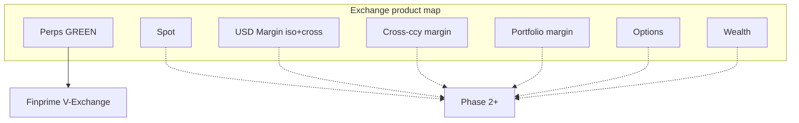

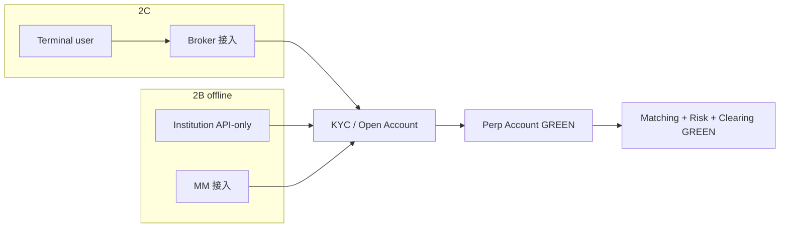

### Phase 1 — out of production (keep playbooks; label only)

| Area | Label | Note |
|------|-------|------|
| Spot markets, spot listing/delist go-live | **`[Phase 2+]`** | Playbooks SP-*, LD-05, spot KRIs remain |
| USD Margin isolated + cross; borrow / LTV / interest | **`[Phase 2+]`** | MG-* remain |
| Cross-currency margin; portfolio margin / unified account | **`[Phase 2+]`** | Do not turn on netting across products |
| Options; wealth / 理财; other products | **`[Phase 2+]`** | Unless separately gated |
| Public 2C self-serve registration | **`[Phase 2+]`** | 2C = broker-introduced only |

### Phase 1 control implications (operators)

1. **Listing / go-live:** only the **perp** pipeline (incl. **XAUUSD**) is production-critical.  
2. **Access control:** reject or hold any UID that is not tagged **broker**, **institution**, or **MM**. Public “register” live = **L3**.  
3. **Funding:** only **USD/USDT** may be transferred into the Perp Account (from MT account or X-fund). Other assets stay off this rail.  
4. **KRIs / SOPs:** Spot-, Margin-, options-, and wealth-tagged items are still documented — treat as **dormant** unless a Phase 2+ waiver exists. Prefer Perps + access + funding-rail KRIs in daily MI.  
5. **XAUUSD perps:** full Perps controls (mark/index, funding, leverage brackets, insurance/ADL) plus commodity/FX-hours awareness (session gaps, weekend/holiday liquidity).

**What that means in everyday language**

V-Exchange is a licensed shop (ADGM / Mauritius). **Today the green lights are only perpetual futures** — contracts that track a price and never expire. Gold versus US dollar (**XAUUSD**) is one of those. A retail customer does **not** walk in off the street. They come through a **broker** (for example a Vantage sub-brand, or an external white-label). Hedge funds and large clients open **offline** and trade **by API**. Market makers plug in on their own path.

Money does not drop straight into a trading wallet. The customer **deposits** into an **MT account** or **X-fund**, then **transfers USD or USDT** into a **Perp Account**. That account is what matching, liquidation, and clearing see. Spot, USD margin (isolated and cross), cross-currency margin, portfolio margin, options, and wealth products are drawn on the map so teams can prepare — those switches stay **off**.

If you see a ticket about Spot or Margin, treat it as **homework for later**, not a live control, unless Risk has signed a Phase 2+ waiver.

---

## If you are new to exchange risk

You do not need a trading background to use this book. You **do** need to know who to call and which switch is dangerous. This section translates the jargon.

### What this company is doing

This is **Finprime V-Exchange**. Customers who are allowed in open a **Perp Account**, send **USD/USDT** into it, and trade **perpetual futures**. They go **long** if they think the price will rise, or **short** if they think it will fall. Because they can use **leverage**, a small price move can wipe out their collateral. When that happens the system **liquidates** them: it forcibly closes the position so the loss does not spill onto other customers or the firm.

Your job, in one sentence: **keep client money safe, keep the matching engine honest, and stop a bad price or a bad config from cascading.**

### Words you will see on every page

| Word you will see | Plain meaning | Why you should care |
|-------------------|---------------|---------------------|
| **BU / PIC** | Business Unit / Person-in-Charge — the team and the named owner | Tickets and admin access are tied to these names |
| **SOP** | Standard operating procedure — a numbered recipe | Do the steps in order. Do not skip dual-control steps |
| **KRI** | Key risk indicator — a number we watch | Green = looks healthy. Amber (WARN) = look now. Red (BREACH) = act now |
| **Limit** | A cap the system or a human must respect | Changing a limit without a ticket is a control failure |
| **Maker / Checker** | Two different people: one proposes, another approves | Same person must never do both on serious changes |
| **RO / RO-OPS** | Risk Officer (sets rules) / Risk Ops (24×7 watch) | Ops acknowledges alerts; the Officer owns the decision |
| **ME** | Matching engine — the program that pairs buy and sell orders | If ME is wrong, prices and liquidations are wrong |
| **RE** | Risk engine — the program that calculates margin and liquidation | If RE is wrong, we may liquidate healthy users or miss bankrupt ones |
| **Mark price** | A *fair* price used for profit/loss and liquidation, not the last trade | A last trade can be a thin print or manipulation; mark is meant to be harder to game |
| **Index price** | Average (or weighted) price from several outside venues | If the index is stale or from one broken venue, mark becomes unsafe |
| **Funding** | Periodic payment between longs and shorts so the perp stays near the real price | Extreme funding can stress accounts even if the market looks calm |
| **Insurance fund** | Pool of money that pays when a liquidation still leaves a hole | If it runs low, **ADL** takes profit from winning counterparties |
| **ADL** | Auto-deleveraging — we reduce winning opposite positions to cover a hole | Rare and painful. Confirm insurance was actually insufficient first |
| **Halt** | Stop matching new trades (and, for perps, decide whether liquidations continue) | Always say the **scope** (one symbol vs whole venue) and the **reason code** |
| **Hypercare** | Extra watching after a change (usually 24h after a config, 4h after a resume, 72h after a launch) | Close the ticket only when hypercare has an owner |
| **Sev-1 / L4** | Highest incident / highest escalation | Client assets or engine integrity — open a war room; do not debug alone |
| **SLA** | Service level agreement — max minutes to act | Missing ACK time auto-pages the next person |
| **RACI** | Responsible / Accountable / Consulted / Informed | **A** is the one who can say yes. **R** does the typing |

### How money actually moves (simple picture)

1. A **2C** person arrives through a **broker** (Vantage sub-brand or external white-label). A **2B** hedge fund / HNW opens **offline** and gets **API only**. An **MM** joins on the liquidity path.  
2. **KYC / Compliance** then **Open Account**.  
3. They **deposit** into an **MT account** or **X-fund**, then **transfer USD or USDT only** into the **Perp Account**.  
4. They send orders. The **matching engine** turns two orders into a trade (open / hold / close).  
5. The **risk engine** constantly asks: “If price jumps against them, do they still have enough collateral?”  
6. If the answer becomes no, **liquidation** starts. Insurance (then ADL) covers leftovers. **Clearing & settlement** books the result.  
7. They **withdraw** from the funding rails. At end of day, **reconciliation** checks our books against wallets and banks so we do not pay out money we do not have.

Phase 1 stops at perps. There is no “buy Bitcoin on spot and withdraw it as a spot customer” in production yet.

### How to read a procedure (SOP)

Every SOP answers eight questions. If a field is blank, **stop** and ask Risk Ops — do not invent a step.

1. **When** — what event starts this recipe (an alert, a clock time, a human request).  
2. **Who** — who types, who signs, who must be told.  
3. **SLA** — how many minutes you have.  
4. **Preconditions** — if these are false, do not start (escalate instead).  
5. **How** — numbered steps. Dual-control steps (two people) are never skipped “because it is urgent” except via the written break-glass path.  
6. **Systems** — which screen or script. The `/admin/...` links in this handbook are **documentation stubs** (maps of future consoles), not the live exchange.  
7. **Done when** — what evidence you attach before you close.  
8. **Escalate if** — when to page a more senior person.

### Traffic-light habit (RAG)

- **Green** does **not** mean “ignore”. First check the **timestamp**. A green number that stopped updating is a fake green (family **S9** in §9).  
- **Amber / WARN** = “something is off; you have minutes, not hours.” Acknowledge, then decide watch vs act.  
- **Red / BREACH** = “the safety margin is gone.” Contain first; write the essay later.  
- **Kill** = “stop the machine.” Withdraw freeze, matching kill switch. Two people, always.

When several lights turn red, **order matters**. Example: if our **price feed dies first** and then liquidations explode, users may have been liquidated on a **wrong price** (family **S2**). If **outside markets dump first** and our feed is healthy, that is a real crash (family **S1**). §9 is the detective chapter.

### What you should do on your first week

1. Read this section, **Phase 1**, §2 (who is who), §3.3 (perps), and your own BU chapter in §4.  
2. Bookmark the alert console and the on-call roster.  
3. Sit with RO-OPS for one alert from ACK to close.  
4. Practice saying a halt request in one breath: *symbol, reason, orders-only or include liquidations, who already knows.*  
5. Do not change a limit, a mark source, or a kill switch until you have watched one G01 and one G04 (two-person check) as a **reader**.

### Worked example — 03:00, one red light (no background needed)

You are on RO-OPS. Pager: **PF-K01 BREACH** on **XAUUSD**. You have never traded gold.

1. **ACK within 5 minutes** (G03). That only means “I saw it.” It does not fix gold.
2. **Look at the timestamp** on the number (PL-K06 / PF-K02). If the clock is old, this may be a fake red or a fake green — go ENG-03. Do not liquidate or halt on a stale clock.
3. **Look outside our exchange.** Is gold actually moving on other venues?  
   - Outside calm, we are screaming → likely **S2** (our fair-price feed is wrong). Pause unsafe liquidations (RE-02), fail over the feed (RE-03).  
   - Outside also dumping, our feed healthy → likely **S1** (real market). Prefer **reduce-only** (PF-07) over a full halt if matching is healthy.
4. Say on the bridge, in one breath: *“XAUUSD, PF-K01 red, I think S2, liquidations paused, Comms not posted yet.”*
5. Do **not** rewrite the mark formula to make the chart pretty. Do **not** close the alert because “it flickered back to green.”
6. Full recipe: **PF-03**. Detective chapter: **§9**.

That is the whole job of a first night: **see, timestamp, outside world, contain, name the family, write it down.**

---

## 1. How to use this handbook

| If you are… | Read first |
|-------------|------------|
| New BU PIC | §§2–4 for your BU + §7 tools |
| Risk Officer / Risk Ops | Full doc; own §6 SOPs, §8 catalogue, §9 scenarios & §10 incidents |
| Product (Spot / Margin / Futures) | §3 + your product BU chapter + listing SOPs |
| Eng / SRE (Matching, Risk Engine, Wallet) | Your tech BU chapter + failover SOPs |
| Compliance / Surveillance | Compliance BU + market-abuse SOPs |
| Listing / Delisting PIC | Listing BU chapter end-to-end |
| Phase 1 PIC / launch crew | **Phase 1 operating scope** + [If you are new](#if-you-are-new-to-exchange-risk) + §3.3 Perps + §4.4 + ACC (broker / institution / MM) |
| Handbook editor (EN / 简体中文) | [edit.html](edit.html) — edit `en.md` and `zh-CN.md`, save drafts, download both |
| Ask AI about a term | Select the text → tap the top **Ask AI** bar (phone) or the sparkle (desktop) → chat. Or tap the bottom-right AI button. |

If a section number looks like “§6.2”, it means “chapter 6, SOP G02 (trading halt)”. Codes like **PF-K01** are indicator IDs you can paste into a ticket. Codes like **SOP-G01** are procedures. You do not have to memorise them; on this page they are **clickable** and jump to that card.

**Golden rules** (why they exist)

1. **No silent limit changes** — a “limit” is a safety cap (max leverage, max position, max order size). If someone edits it in a console with no ticket, nobody can reconstruct *who* moved a safety rail. Every hard-limit change needs a ticket, two people (or more for Tier A+), and an audit row.  
2. **Segregation of duties** — the person who *asks* is not the person who *approves*. The person who *types the config* is not the only person who *signs*. This is how we stop a tired or compromised account from moving money or leverage.  
3. **Instrument-aware** — Spot, Margin, and Perps are different machines. Copying a Spot price-band onto a perp, or a perp liquidation onto margin, can liquidate the wrong people. Always tag **SPOT / MARGIN / PERP** on the ticket.  
4. **Pre-trade / at-trade / post-trade** — *before* the order (limits, KYC), *while* it matches (bands, STP, rate limits), *after* (alerts, recon, surveillance). One layer failing should not be the only layer.  
5. **Client assets first** — if you must choose between keeping withdrawals honest and keeping a revenue feature on, protect withdrawals and custody.  
6. **Phase 1 product & access gates** — production trading = **perps only** (including **XAUUSD**) on a **Perp Account** funded in **USD/USDT**. Access = **broker / institution / MM** (2C via broker). Spot, USD margin, cross-ccy margin, portfolio margin, options, wealth, and public signup stay **`[Phase 2+]`** until a phase-gate sign-off.

---

## 2. Three lines of defence & role map

### 2.1 Lines of defence

Banks and exchanges use a simple idea: the people who *run* the shop must not be the only people who *check* the shop, and neither of those groups grades their own homework.

| Line | Who | In plain English |
|------|-----|------------------|
| **1st** | Product BUs, Trading Ops, Matching Eng, Wallet Ops, Listing, Market Making Ops | You own the day-to-day. You turn controls on, you watch them, you escalate when they break. You are not allowed to say “Risk will notice.” |
| **2nd** | Market Risk, Credit/Liquidation Risk, Model Risk, Compliance, Legal | You write the appetite (“how much pain is allowed”), you challenge 1st line, you run independent monitors. You do not operate the matching engine. |
| **3rd** | Internal Audit | You visit later and ask “did the design work, and did people actually follow it?” You do not approve live limit changes. |

**Escalation:** 1st line pages 2nd line when a control is breached. 2nd line pages the CRO / Risk Committee when the event is material or Sev-1. Audit reviews both lines on a calendar, not only after a fire.

If you are a new PIC: you are **1st line** unless your title is Risk Officer, Compliance, Legal, or Audit.


**Figure — Three lines of defence**

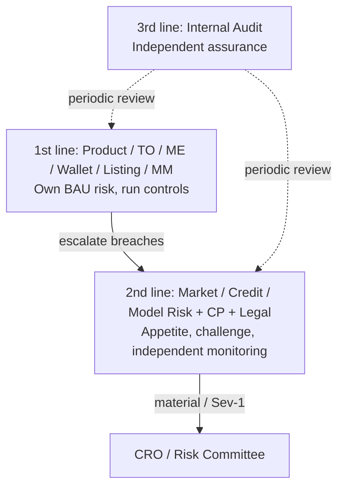

### 2.2 Standard role codes (used in tickets & admin ACLs)

These short codes appear in tickets so a 03:00 on-call person can see *which hat* is needed. They are not vanity titles.

| Code | Role | What they actually do |
|------|------|-----------------------|
| **CRO** | Chief Risk Officer | Final risk yes/no on big items; board pack |
| **RO** | Risk Officer (2nd line) | Approves limits, halt, mark methodology; challenges product |
| **RO-OPS** | Risk Operations (24×7) | First human to ACK an alert; follows the recipe; pages RO |
| **PM** | Product Manager | Owns the product spec and user-facing behaviour |
| **TO** | Trading Operations | Runs the book during incidents; proposes halt/resume |
| **ME** | Matching Engine PIC | The matching program and its kill/halt switches |
| **RE** | Risk Engine PIC | Margin, mark, liquidation, config promotion |
| **WO** | Wallet / Custody Ops | Keys, deposits, withdrawals, chain events |
| **LI** | Listing PIC | Due diligence pack before a market goes live |
| **CP** | Compliance / Surveillance | KYC, sanctions, abuse, holds |
| **TS** | Treasury / Settlement | Bank and on-chain money movement after books match |
| **MM** | Market Making / Liquidity Ops | Agreements that keep an order book two-sided |
| **ENG** | Engineering on-call | Code, config pipelines, access |
| **SRE** | Site Reliability | Uptime, failover, latency |
| **DA** | Data / Quant / Model | Index math, stress shocks, model risk |
| **TR** | Internal trader / VIP desk (if any) | May *request* leverage; may never approve their own |

---

## 3. Instrument primers (Spot / Margin / Perps)

Use this section when configuring limits, writing SOPs, or deciding which admin page applies. If you only remember one thing: **Phase 1 production is perps. Spot and Margin chapters are study material until a phase-gate.**

### 3.1 Spot `[Phase 2+]`

> **Not enabled in Phase 1.** Keep the playbook; do not turn the product on.

**In plain English:** Spot is “cash market” trading. The customer pays the full price and gets the asset (or sells the asset they already hold). There is no loan and no liquidation engine. If BTC/USDT last trades at 60,000, a buy of 1 BTC costs about 60,000 USDT plus fees. The customer cannot lose *more than they paid* on the trade itself (wallet mistakes and fraud are separate).

**Why risk still cares:** someone can still spoof the book, fat-finger a huge order, list a junk token, or steal via deposits/withdrawals.

| Topic | Risk relevance |
|-------|----------------|
| **What it is** | Immediate buy/sell of base/quote; no leverage on the instrument itself |
| **Primary risks** | Market manipulation, fat-finger, listing quality, wallet settlement, fiat rail |
| **Key controls** | Price bands (reject crazy prices), max order size, self-trade prevention (STP), trading halt, deposit/withdraw gates |
| **No liquidation engine** | Client loss is limited to paid amount (except deposit/withdraw errors) |
| **Admin focus** | Symbol config, fee tiers, STP, halt/resume, ticker metadata |

### 3.2 Margin (Cross & Isolated) `[Phase 2+]`

> **Not enabled in Phase 1.** Perps also use “margin” in a different sense (collateral for a derivative). Do not mix the two in tickets.

**In plain English:** Margin lending is “I borrow USDT from the platform, buy more of an asset, and pay interest.” If the asset falls, the loan can exceed the collateral. Then we **force-sell**. **Isolated** means only that one position is on the hook. **Cross** means the whole account’s collateral can be eaten — losses can jump from one coin to another inside the same account.

| Topic | Risk relevance |
|-------|----------------|
| **What it is** | Borrowed funds to amplify spot exposure; interest accrues on loans |
| **Isolated** | Margin & liquidation scoped to one position/pair |
| **Cross** | Shared collateral across positions; contagion within account |
| **Primary risks** | Credit/borrow default, liquidation shortfall, interest misconfig, collateral haircut error |
| **Key controls** | LTV / margin ratio, borrow caps per asset, interest rate curves, liquidation waterfall, negative-balance auto-repay |
| **Admin focus** | Collateral tiers, borrow whitelist, LTV brackets, interest config, forced liquidation console |

### 3.3 Perpetual futures (USDⓈ-M / COIN-M) `[Phase 1]`

> **Phase 1 in scope:** approved perps including **XAUUSD perps** and other listed perps. Spot/Margin are off.

**In plain English:** A perpetual future (“perp”) is a contract that tracks an underlying price (BTC, ETH, gold in USD, …) and **never expires**. Customers post collateral and can be long or short with leverage. Every few hours **funding** is paid between longs and shorts so the contract does not drift forever away from the real-world price.

**Two prices you must never mix up**

- **Last / last traded** — the latest match on *our* book. Fine for “what just traded.” Dangerous as the only input to liquidation: one thin print can move it.  
- **Mark price** — the price we use for unrealized profit/loss and for “are you bankrupt?” It is usually built from an **index** (several other venues) plus a basis cap. If mark is wrong, we liquidate the wrong people. That is family **S2**.

**USDⓈ-M vs COIN-M:** USD-margined perps settle in a stablecoin (or USD-like). Coin-margined settle in the underlying coin. Phase 1 operators should still know which a contract is, because insurance and PnL units differ.

**Why XAUUSD is extra:** gold/FX markets sleep; crypto indexes may not. Weekend gaps and holiday liquidity can make mark and last disagree. Watch session opens.

| Topic | Risk relevance |
|-------|----------------|
| **What it is** | Leveraged derivatives with no expiry; funding exchanges long↔short |
| **Mark vs last** | Mark price drives unrealized PnL & liquidation; last price for trading |
| **Primary risks** | Leverage cascades, insurance fund drain, mark/index manipulation, funding extremes, ADL |
| **Key controls** | Max leverage by tier, position notional caps, price index multi-exchange, funding caps, insurance fund, ADL queue |
| **Admin focus** | Leverage brackets, risk limits, funding formula, insurance fund MI, ADL/auto-deleveraging console, circuit breakers |
| **Phase 1 examples** | **XAUUSD** perpetual and other approved perp symbols only |
| **Phase 1 extra watch** | Metals/FX session gaps, weekend/holiday liquidity vs crypto 24×7 index hours |


**Figure — Perps control chain (Phase 1 primary)**

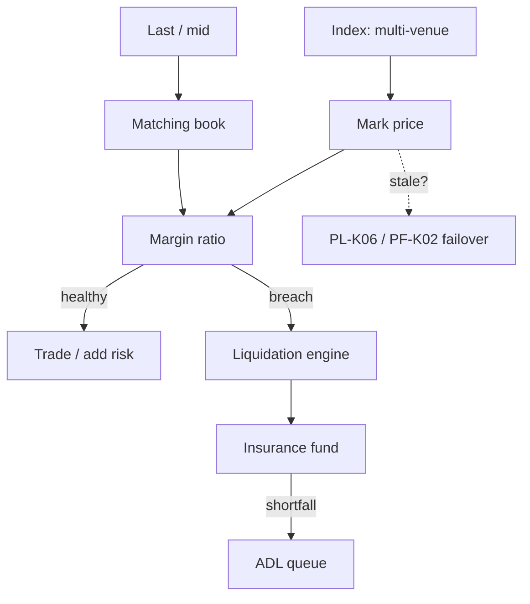

### 3.4 Instrument comparison (ops cheat sheet)

| Dimension | Spot | Margin | Perps |
|-----------|------|--------|-------|
| Leverage | 1× | Configurable (e.g. up to 5–10×) | Tiered (e.g. up to 20–125× by VIP/notional) |
| Liquidation | N/A | Margin call → force sell | Margin ratio → force close → ADL |
| Insurance | N/A / platform ops | Partial (loan loss) | Insurance fund + ADL |
| Index critical? | Low–med | Medium | **Critical** |
| Funding | N/A | Interest on borrow | Periodic funding rate |
| Halt impact | Book frozen | Borrow + liquidations may continue under SOP | Liquidations/funding continue under SOP |
| Typical KRI | Cancel/fill ratio, halt count | Borrow util, liquidation volume, bad debt | Insurance balance, ADL events, basis, mark–index gap |
| **Phase label** | **`[Phase 2+]`** | **`[Phase 2+]`** | **`[Phase 1]`** (incl. XAUUSD) |


**Figure — Instruments vs Phase 1 gate**

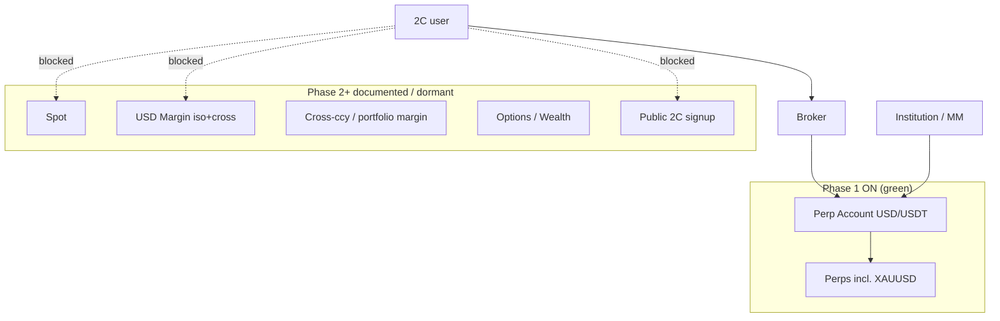

---

## 4. BU-by-BU playbooks

Each chapter follows the same template so one team does not write a novel while another dumps three acronyms:

- **In scope / out of scope** — should this incident land on you?
- **Job division** — who on your team clicks
- **SOPs** — numbered recipes; the full how-to is in **§6.7**
- **Tools / admin pages** — where to look, where to change
- **Handoffs** — who you pass the baton to

**In plain English:** a “BU” is one business unit (futures product, matching, wallet, …). A “PIC” is the named owner. Tickets and admin access hang off those names. You do not need to be a trader. You do need to know whether this chapter is yours, and the first SOP to open when something breaks.


**Figure — Phase 1 critical-path BUs**

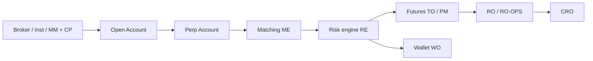

---

### 4.1 Market Risk & Risk Ops (2nd line) — RO / RO-OPS / CRO

#### In scope
- Enterprise risk appetite, limit books (Spot / Margin / Perps)
- Real-time monitoring of VaR-style desk metrics, concentration, leverage utilisation
- Liquidation / insurance / ADL oversight (challenge 1st line)
- Stress testing & scenario catalogue approval
- New-product risk sign-off; listing risk opinion
- Breach investigation, waiver governance, daily risk pack

#### Out of scope
- Day-to-day matching engine tuning (ME)
- Hot-wallet signing operations (WO)
- KYC onboarding decisions (CP) — except when risk-holds apply

#### Job division

| Role | Owns |
|------|------|
| CRO | Appetite, board pack, material waivers |
| RO (Market) | Perps/spot market risk limits, stress catalogue |
| RO (Credit/Liq) | Margin LTV, borrow caps, liquidation params, insurance fund policy |
| RO-OPS | 24×7 alert ACK, first triage, escalate Sev-1/2 |
| DA | Models, mark/index methodology challenge, stress engines |

#### SOPs
| ID | Name | Trigger |
|----|------|---------|
> Detailed who / when / how / SLA cards: **§6.7** (RM-01…).

| RM-01 | Daily risk MI pack | Every UTC cutoff |
| RM-02 | Soft-limit WARN response | Alert WARN |
| RM-03 | Hard-limit BREACH response | Alert BREACH |
| RM-04 | Leverage / rights increase approval | Trader or VIP request |
| RM-05 | Stress catalogue change | Model or scenario edit |
| RM-06 | Insurance fund draw review | Any insurance payout / ADL |
| RM-07 | Trading halt recommendation | Gap, oracle fail, cascade |

#### Useful tools
- Risk metrics monitor (realtime alerts: equity, PnL, DD, VaR, concentration)
- Stress testing / what-if console
- Risk reporting & CSV export
- Liquidation & insurance fund dashboards
- Limit request / trader-rights workflow (maker–checker)

#### Admin pages
| Page | Purpose | ACL |
|------|---------|-----|
| `/admin/risk/limits` | Soft/hard thresholds by instrument & VIP tier | RO + checker |
| `/admin/risk/alerts` | ACK / assign / escalate | RO-OPS |
| `/admin/risk/stress` | Run scenarios; publish catalogue | RO + DA |
| `/admin/risk/insurance` | Fund balance, payouts, ADL log | RO (Credit) |
| `/admin/risk/reports` | Schedule daily/weekly packs | RO |
| `/admin/risk/waivers` | Temporary limit waivers with expiry | CRO/RO dual |

#### Handoffs
- To ME/TO: halt/resume recommendations  
- To RE: push approved limit configs  
- To CP: suspected manipulation during breach  
- To Product: new-product conditions / go-live gates  

---

### 4.2 Spot Product & Trading Ops — PM-SPOT / TO `[Phase 2+]`

> Phase 1: dormant product surface. Keep halt/listing readiness; do not open spot symbols.

#### In scope
- Spot symbol lifecycle ops (post-listing config)
- Fee tiers, order types, STP, price protection bands
- Spot trading halt/resume execution (with Risk/ME)
- Spot market quality KRIs (spread, depth, cancel ratio)
- User education copy for risk disclosures (with Legal)

#### Out of scope
- Margin LTV / borrow interest (Margin BU)
- Perps funding / insurance (Futures BU)
- On-chain custody keys (Wallet)

#### Job division

| Role | Owns |
|------|------|
| PM-SPOT | Product rules, fee experiments, UX risk disclosures |
| TO | Halt/resume execution, symbol flags, VIP order exceptions |
| MM liaison | Depth SLAs, MM agreement breaches |

#### SOPs
| ID | Name | Trigger |
|----|------|---------|
| SP-01 | Spot symbol go-live checklist | New listing |
| SP-02 | Spot trading halt | Index fail / fat-finger / regulatory |
| SP-03 | Spot resume | RO + ME clearance |
| SP-04 | Price band / max notional change | Volatility regime change |
| SP-05 | Wash / self-trade investigation handoff | Surveillance alert |

#### Useful tools
- Spot order-book health dashboard
- Halt/resume console
- Fee & VIP tier admin
- Market quality report (spread, depth @ 1%/2%)

#### Admin pages
| Page | Purpose |
|------|---------|
| `/admin/spot/symbols` | Enable/disable, tick size, lot size, filters |
| `/admin/spot/bands` | Price protection / percentage bands |
| `/admin/spot/halt` | Halt reasons + audit trail |
| `/admin/spot/fees` | Maker/taker & VIP schedule |
| `/admin/spot/stp` | Self-trade prevention modes |

#### Handoffs
- Listing → Spot PM for go-live  
- Risk → TO for halt authority  
- Wallet → TO for deposit-only / withdraw-only modes during incidents  

---

### 4.3 Margin Product & Credit Ops — PM-MARGIN / RO-CREDIT / TO `[Phase 2+]`

> Phase 1: no margin borrow book. Perps margin/liquidation stays under §4.4 / RE.

#### In scope
- Cross & Isolated margin product rules
- Collateral whitelist, haircuts, LTV brackets
- Borrow caps (asset & user tier), interest curves
- Margin call / liquidation parameters & messaging
- Bad-debt / negative-balance remediation
- Margin stress (collateral crash + borrow squeeze)

#### Out of scope
- Perps position limits (Futures)
- Spot-only symbol listing (Listing / Spot)

#### Job division

| Role | Owns |
|------|------|
| PM-MARGIN | Product UX, modes (cross/isolated), feature flags |
| RO-CREDIT | Haircuts, LTV, borrow caps, liquidation buffer |
| TO | Force liquidation ops, borrow freeze |
| TS | Interest accrual accounting, bad-debt booking |

#### SOPs
| ID | Name | Trigger |
|----|------|---------|
| MG-01 | Add collateral asset | Listing + risk opinion |
| MG-02 | Haircut / LTV change | Volatility or governance |
| MG-03 | Borrow freeze (asset) | Liquidity crunch / depeg |
| MG-04 | Forced liquidation runbook | Cascade / engine lag |
| MG-05 | Bad debt write-off / recovery | Post-liquidation shortfall |
| MG-06 | Interest curve update | Funding cost / peg risk |

#### Useful tools
- Margin utilisation heat map (by asset)
- Liquidation proximity monitor
- Borrow outstanding vs inventory
- Stress tool with collateral shock + depeg paths
- EOD recon for loans vs ledger

#### Admin pages
| Page | Purpose |
|------|---------|
| `/admin/margin/collateral` | Whitelist, haircut, tier |
| `/admin/margin/ltv` | Initial / maintenance / liquidation ratios |
| `/admin/margin/borrow` | Caps, VIP multipliers, freeze |
| `/admin/margin/interest` | Curves, accrual schedule |
| `/admin/margin/liquidation` | Queue, manual force-close, pause flag |
| `/admin/margin/bad-debt` | Cases, recovery, P&L booking |

#### Handoffs
- To Futures: shared collateral / unified account design changes  
- To Wallet: asset delist → repay & withdraw sequencing  
- To Risk: any bad debt > materiality threshold  

---

### 4.4 Futures / Perps Product & Liquidation Ops — PM-FUT / RO / TO-FUT `[Phase 1 — primary]`

> Phase 1 critical path: **XAUUSD perps** + other approved perps on the **Perp Account**; 2C via broker; 2B institution / MM.

**In plain English:** this team owns the *product* you are actually running today. If mark price, leverage, funding, insurance, or ADL is wrong, it is this chapter plus Risk Engine (§4.6). Read it even if your day job is not “futures.”

#### In scope
- USDⓈ-M and COIN-M perpetuals (and dated futures if live)
- Leverage brackets, position & notional limits
- Mark price / index constituents & deviation alerts
- Funding rate formula, caps, and settlement ops
- Insurance fund policy ops; ADL configuration
- Perps circuit breakers, impact buffers, reduce-only modes

#### Out of scope
- Spot matching fairness (ME, but shared engines possible)
- Margin borrow interest (Margin BU)

#### Job division

| Role | Owns |
|------|------|
| PM-FUT | Contract specs, leverage UX, funding display |
| RO | Brackets, insurance, ADL policy, mark methodology approval |
| TO-FUT | Emergency reduce-only, funding pause (rare), ADL monitoring |
| DA | Index construction, basis/funding analytics |
| RE | Engine params push after approval |

#### SOPs
| ID | Name | Trigger |
|----|------|---------|
| PF-01 | New perp contract launch | Listing + risk sign-off |
| PF-02 | Leverage bracket change | Volatility / VIP policy |
| PF-03 | Mark–index deviation response | Gap > threshold |
| PF-04 | Funding extreme / pause playbook | Funding > cap or oracle fail |
| PF-05 | Insurance fund payout review | Liquidation bankruptcy |
| PF-06 | ADL activation review | Insurance insufficient |
| PF-07 | Perps trading halt / reduce-only | Cascade or infra fail |
| PF-08 | Multi-exchange index constituent outage | Venue down |

#### Useful tools
- Mark vs index vs last price monitor
- Open interest / leverage heat map
- Liquidation calendar / burst monitor
- Insurance fund P&L and coverage ratio
- ADL queue viewer
- Basis & funding analytics
- Stress: spot shock → perp equity → margin shortfall

#### Admin pages
| Page | Purpose |
|------|---------|
| `/admin/futures/contracts` | Specs, tick, contract size, status |
| `/admin/futures/leverage` | Brackets by notional & VIP |
| `/admin/futures/risk-limits` | Position, OI, user notional caps |
| `/admin/futures/mark-index` | Constituents, weights, protection |
| `/admin/futures/funding` | Formula, interval, caps, manual settle |
| `/admin/futures/insurance` | Balances, injections, payouts |
| `/admin/futures/adl` | Ranking, dry-run, enable/disable |
| `/admin/futures/breaker` | Circuit breaker & impact buffer |

#### Handoffs
- To ME: halt matching while liquidations drain under SOP  
- To Risk: Sev-1 if insurance coverage ratio < policy floor  
- To CP: suspected index manipulation  

---

### 4.5 Matching Engine & Exchange Core — ME / SRE / ENG

#### In scope
- Order matching correctness, latency SLOs, fairness
- Failover / DR / dual-site consistency
- Kill switches, cancel-on-disconnect, STP mechanics
- Capacity (cancel storms, burst liquidations)
- Symbol sharding & rate limits

#### Out of scope
- Economic risk appetite (Risk)
- Custody keys (Wallet)

#### Job division

| Role | Owns |
|------|------|
| ME PIC | Matching rules, release notes, config ownership |
| SRE | Availability, DR drills, capacity |
| ENG on-call | Incident fix, rollback |

#### SOPs
| ID | Name | Trigger |
|----|------|---------|
| ME-01 | Engine deploy / rollback | Release |
| ME-02 | Matching halt (global or symbol) | Sev-1 integrity |
| ME-03 | Dual-site failover | Primary loss |
| ME-04 | Cancel storm mitigation | Rate > SLO |
| ME-05 | Post-incident book rebuild verify | After failover |

#### Useful tools
- Matching latency & drop dashboards
- Order/trade recon vs clearing
- Chaos / load test harness
- Kill-switch panel

#### Admin pages
| Page | Purpose |
|------|---------|
| `/admin/engine/status` | Shard health, lag, mode |
| `/admin/engine/kill` | Kill switch (dual control) |
| `/admin/engine/rate-limits` | IP/UID/API weights |
| `/admin/engine/stp` | Engine-level STP |
| `/admin/engine/failover` | Site preference, drain |

#### Handoffs
- TO / Risk approve business halt reasons  
- RE notified so liquidations pause/resume consistently  

---

### 4.6 Risk Engine, Clearing & Liquidation Systems — RE / DA

#### In scope
- Margin ratio calculation, bankruptcy price, liquidation engine
- Limit enforcement at-trade (pre-trade checks where applicable)
- Push of approved risk configs to production
- Reconciliation of risk state vs matching vs wallet ledger
- Unified account / portfolio margin engines (if live)

#### Out of scope
- Setting appetite numbers without RO approval

#### Job division

| Role | Owns |
|------|------|
| RE PIC | Engine config deployment, feature flags |
| DA | Formula correctness, backtests |
| ENG | Performance & data pipelines |

#### SOPs
| ID | Name | Trigger |
|----|------|---------|
| RE-01 | Config promote (limits → prod) | After RO dual-approval |
| RE-02 | Liquidation engine pause/resume | Cascade control |
| RE-03 | Mark price feed failover | Oracle/index issue |
| RE-04 | Risk state rebuild | Desync detected |
| RE-05 | Portfolio-margin model change | Model governance |

#### Useful tools
- Config versioning & diff viewer
- Liquidation simulator (dry-run)
- Risk state vs ledger recon
- Repo modules: `risk_metrics_monitor.py`, `stress_testing.py`, `trader_rights_workflow.py`

#### Admin pages
| Page | Purpose |
|------|---------|
| `/admin/risk-engine/configs` | Versioned params, promote/rollback |
| `/admin/risk-engine/liq` | Pause, speed, batch size |
| `/admin/risk-engine/feeds` | Mark/index health |
| `/admin/risk-engine/sim` | What-if liquidation |

---

### 4.7 Wallet, Custody & Withdrawals — WO / TS / SRE

#### In scope
- Hot / warm / cold / MPC key ops
- Deposit attribution, travel-rule, withdraw screening hooks
- Chain finality, reorg handling, wrong-chain playbooks
- Liquidity buffers for withdrawals (run risk)
- PoR / liabilities reconciliation support

#### Out of scope
- Trading limit policy (Risk)
- Token fundamental diligence (Listing) — except contract deposit/withdraw technical review

#### Job division

| Role | Owns |
|------|------|
| WO | Operational custody runbooks, address ops |
| TS | Fiat + crypto liquidity buffer policy with Risk |
| SRE/Security | HSM/MPC controls, access |

#### SOPs
| ID | Name | Trigger |
|----|------|---------|
| WA-01 | Hot wallet top-up | Below buffer |
| WA-02 | Withdrawal queue / slow mode | Run risk / attack |
| WA-03 | Chain halt / reorg | Node alerts |
| WA-04 | Wrong deposit recovery | User ticket |
| WA-05 | Key ceremony / rotation | Schedule or incident |
| WA-06 | PoR snapshot | Periodic / attestation |

#### Useful tools
- Wallet balance vs ledger recon (`eod_reconciliation.py` pattern)
- Withdrawal backlog & aging
- Chain health monitors
- Address allowlist / whitelist admin for VIP

#### Admin pages
| Page | Purpose |
|------|---------|
| `/admin/wallet/balances` | Hot/cold by asset |
| `/admin/wallet/withdraw` | Queue, hold, release, slow mode |
| `/admin/wallet/deposit` | Crediting rules, memo/tag |
| `/admin/wallet/keys` | Ceremony logs (highly restricted) |
| `/admin/wallet/chains` | Enable/disable network |

---

### 4.8 Listing, Delisting & Token Due Diligence — LI / RO / CP / Legal

> **Phase 1 listing focus:** perp contracts only (e.g. **XAUUSD** and other approved perps). Spot listing/delist SOPs = **`[Phase 2+]`**. Margin eligibility (LD-03) = **`[Phase 2+]`**.

#### In scope
- New spot pairs, margin eligibility, perp contracts
- Contract risk (mint, upgrade, pause, blacklist)
- Liquidity & unlock analysis; seed/monitoring tags
- Delisting playbooks across Spot / Margin / Perps
- Rebrand / migration / ticker collision

#### Out of scope
- Day-2 fee tuning (Product)
- Insurance fund sizing (Risk owns policy)

#### Job division

| Role | Owns |
|------|------|
| LI | Diligence pack, project liaison |
| RO | Risk opinion (market/credit/manipulation) |
| CP | Sanctions / securities classification flags |
| Legal | Opinion on legal form |
| PM (Spot/Margin/Fut) | Go-live product checklist |

#### SOPs
| ID | Name | Trigger |
|----|------|---------|
| LD-01 | Listing risk opinion | New asset/contract |
| LD-02 | Seed tag / monitoring tag | Elevated risk |
| LD-03 | Margin eligibility decision | Post-spot listing |
| LD-04 | Perp listing decision | OI demand + risk |
| LD-05 | Delist sequence (Spot) | Criteria breach |
| LD-06 | Delist sequence (Margin) | Force repay → disable borrow → delist |
| LD-07 | Delist sequence (Perps) | Reduce-only → settle → delist |
| LD-08 | Emergency delist / halt | Exploit / fraud |

#### Useful tools
- Diligence checklist workspace
- Holder concentration & unlock calendar
- Contract scanner / audit repository
- Cross-venue liquidity & manipulation screens

#### Admin pages
| Page | Purpose |
|------|---------|
| `/admin/listing/pipeline` | Stages, owners, SLA |
| `/admin/listing/tags` | Seed / monitoring / caution |
| `/admin/listing/delist` | Notices, timelines, force actions |
| `/admin/listing/migrations` | Rebrand / contract swap |

**Delist sequencing (mandatory order)**  
1. Risk + Legal + CP approve  
2. **Perps:** reduce-only → flatten / expiry SOP → delist contract  
3. **Margin:** freeze borrow → force repay / liquidate → remove collateral  
4. **Spot:** halt if needed → trading off → withdrawals remain per WA SOP  
5. Comms templates issued; support macros updated  

---

### 4.9 Compliance, Surveillance & Market Abuse — CP

#### In scope
- KYC/AML, sanctions, travel rule
- **Phase 1 access:** broker / sub-brand 2C (ACC-01); institutional direct API (ACC-02); MM access (ACC-04); block public self-serve signup
- Trade surveillance (spoofing, layering, wash, insider)
- Market abuse investigations across Spot / Margin / Perps
- Regulatory reporting liaison
- Hard holds that block leverage / withdraw / trade

#### Out of scope
- Setting economic leverage brackets (RO) — CP can impose hard holds

#### SOPs
| ID | Name | Trigger |
|----|------|---------|
| CP-01 | Surveillance alert triage | Alert |
| CP-02 | Account hard hold | Confirmed suspicion |
| CP-03 | Cross-product abuse review | Spot+Perps pattern |
| CP-04 | Reg request / freeze | External order |

#### Admin pages
| Page | Purpose |
|------|---------|
| `/admin/compliance/surveillance` | Cases, replay |
| `/admin/compliance/holds` | Trade/withdraw/leverage holds |
| `/admin/compliance/kyb-kyc` | Restricted views |
| `/admin/compliance/sanctions` | Screening overrides (dual control) |

---

### 4.10 Treasury, Settlement & Banking — TS

**In plain English:** Treasury owns **the firm's money and pipes** (banks, stablecoin inventory, cash in the insurance fund) — not whether a customer's trade made a profit. If the end-of-day books do not match, they must **not** send a payment.

#### In scope
- Fiat corridors, banking concentration
- Corporate treasury (not client trading risk)
- Settlement after recon approval
- Insurance fund / SAFU cash management under policy
- Stablecoin inventory & redemption playbooks

#### SOPs
| ID | Name | Trigger |
|----|------|---------|
| TS-01 | Banking corridor outage | Partner down |
| TS-02 | Stablecoin depeg response | Peg break |
| TS-03 | Settlement after EOD recon | Daily |
| TS-04 | Insurance fund injection | Board/CRO approved |

#### Admin pages
`/admin/treasury/balances` · `/admin/treasury/settlement` · `/admin/treasury/stablecoins`

---

### 4.11 Liquidity / Market Making Ops — MM

> Phase 1: MM **接入** is live as a 2B path onto **perps** (ACC-04). Spot MM SLAs stay `[Phase 2+]`.

**In plain English:** a market maker is paid (or contracted) to keep a **buy price and a sell price** on the book so other people can trade. If the gap between those prices suddenly explodes, or the book is empty, first ask “is the maker still alive (heartbeat)?” before you decide the whole market crashed.

#### In scope
- MM agreement SLAs (depth, spread, uptime) — **Phase 1: perps**; Spot `[Phase 2+]`
- Inventory & adverse selection monitoring
- Cross-venue arb inventory risk if MM is internal/affiliated (Chinese walls with Risk)

#### SOPs
| ID | Name | Trigger |
|----|------|---------|
| MM-01 | SLA breach escalation | Depth/spread fail |
| MM-02 | Vol regime quote widen | Stress |
| MM-03 | Conflict / information barrier check | New listing / prop overlap |

#### Admin pages
`/admin/mm/sla` · `/admin/mm/inventory` · `/admin/mm/agreements`

---

### 4.12 Platform Engineering, Security & Data — ENG / SRE / Security / DA

**In plain English:** they keep the pipes, the keys to admin pages, and the audit log that cannot be rewritten. Every green/red number on a risk screen comes through their pipelines. If the pipeline is late, a green light can be a lie.

#### In scope
- Secure SDLC, access control, audit logs for all admin pages
- Data pipelines feeding risk (marks, positions, fills)
- Bug bounty / pen-test remediation tracking
- Model & report automation (`risk_reporting.py`, recon, stress)

#### SOPs
| ID | Name | Trigger |
|----|------|---------|
| ENG-01 | Privileged admin access grant | Joiner/mover |
| ENG-02 | Audit log immutability check | Periodic |
| ENG-03 | Pipeline lag incident | Risk feed late |
| ENG-04 | Security incident (key/API) | Compromise |

---

## 5. Cross-BU RACI matrix

**How to read this table (no background required)**

- **R (Responsible)** — the people who *do* the work (click the button, write the ticket).  
- **A (Accountable)** — one seat that *owns the outcome*. If it goes wrong, this is the name on the post-mortem. There should be exactly one **A** per row where possible.  
- **C (Consulted)** — you must ask them *before* acting (two-way).  
- **I (Informed)** — you tell them *after* (one-way).  

Example: on a **perps leverage bracket** change, Futures product is **R** (drafts the new ladder), Risk Engine is **R** (pushes config), Risk is **A** (says yes), Compliance is **C** if retail users are affected.

**R** = Responsible · **A** = Accountable · **C** = Consulted · **I** = Informed

| Activity | Spot PM/TO | Margin | Futures | ME | RE | Wallet | Listing | Risk | CP | Treasury |
|----------|------------|--------|---------|----|----|--------|---------|------|----|----------|
| Spot halt/resume | **R** | I | I | **R** | C | C | I | **A** | C | I |
| Margin LTV change | I | **R** | C | I | **R** | I | C | **A** | C | I |
| Perps leverage bracket | I | C | **R** | I | **R** | I | C | **A** | C | I |
| New listing go-live | C | C | C | C | C | C | **R** | **A** | **R** | I |
| Delist (multi-product) | **R** | **R** | **R** | C | C | **R** | **A** | **A** | **R** | C |
| Insurance payout | I | C | **R** | I | C | I | I | **A** | I | **R** |
| ADL event | I | I | **R** | I | **R** | I | I | **A** | I | I |
| Withdraw slow-mode | I | I | I | I | I | **R** | I | **A** | C | **R** |
| Mark/index change | I | C | **R** | I | **R** | I | C | **A** | C | I |
| Surveillance hard hold | C | C | C | I | C | C | I | C | **A/R** | I |
| EOD trade recon | C | C | C | C | C | C | I | C | I | **A** + Ops **R** |
| Stress catalogue | C | C | C | I | C | I | C | **A** | I | I |
| Trader rights / leverage up | C | C | C | I | **R** | I | I | **A** | **C** | I |

---

## 6. Global SOPs (shared) & detailed runbooks

These are the **shared recipes**. BU-specific recipes (PF-*, ACC-*, …) sit in §6.7.

If you have never run one: read [How to read a procedure](#how-to-read-a-procedure-sop) first. Then open the SOP, read **When** (does it apply?), **Preconditions** (are we allowed to start?), then **How**.

Every SOP card below uses the same fields: **When (trigger)** · **Who** · **SLA** · **Preconditions** · **How** · **Systems** · **Done when** · **Escalate if**.  
Role codes: see §2.2. Ticket system = Risk/Ops ticket unless noted.

### 6.0 SOP card legend

| Field | Meaning |
|-------|---------|
| **When** | Event, schedule, or threshold that starts the SOP |
| **Who** | R = does the work · A = accountable sign-off · C = consulted · I = informed |
| **SLA** | Max time to first action / to contain / to close |
| **Preconditions** | Must be true before acting (else stop and escalate) |
| **How** | Ordered steps; do not skip dual-control steps |
| **Systems** | Admin pages / tools / modules |
| **Done when** | Exit criteria + evidence to attach |
| **Escalate if** | Conditions that bump L-level / Sev |

---

### 6.1 SOP-G01 — Limit change (all instruments)


**Figure — SOP-G01 limit change**

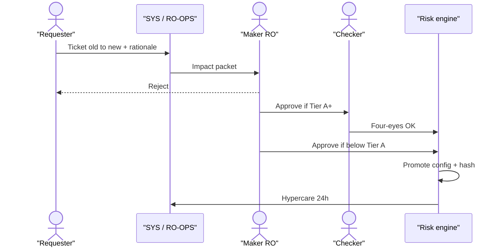

| Field | Detail |
|-------|--------|
| **When** | Any proposed change to soft/hard limits, brackets, bands, OI caps, LTV/haircut, borrow caps, VIP multipliers — scheduled calib or ad-hoc stress response |
| **Who** | **R:** Requester (PM / TO / RO / DA) prepares packet · **A:** RO (Maker) · **Checker A (Tier A+):** RO2 or CRO · **R (deploy):** RE · **C:** ME, Product PIC, CP if retail-impacting · **I:** RO-OPS, Comms if client-visible |
| **SLA** | Non-urgent: decision ≤ 2 business days · Urgent (active BREACH/cascade): Maker decision ≤ 30 min; Checker ≤ 30 min parallel bridge · Hypercare 24h post-deploy |
| **Preconditions** | Instrument tagged **SPOT / MARGIN / PERP**; old→new values numeric; stress delta attached (or waiver by CRO); no conflicting open G01 on same key |
| **Systems** | Ticket · `/admin/risk/limits` · `/admin/risk/waivers` · `/admin/risk-engine/configs` · `stress_testing.py` · `trader_rights_workflow.py` (if rights-linked) |

**What this SOP is for:** any time a number that *caps risk* will change — max leverage, position size, open-interest cap, price band, LTV, borrow cap, VIP multiplier. “Calib” means a planned tune-up; “ad-hoc” means we are in a storm.

**How (do not skip; each step says why)**
1. **Requester opens a ticket.** Write the instrument tag (**PERP / SPOT / MARGIN**), the symbol, the field name, the **old number → new number**, why, which KRI or incident this is tied to, and a stress screenshot. If CRO waived stress, write that in words. *Why:* the next person at 03:00 should not have to guess.  
2. **SYS / RO-OPS attaches an impact packet.** How close are we already to the new cap? Any breaches in 30 days? Would this spill into another product? *Why:* approving a looser cap that is already almost eaten is how cascades start.  
3. **Maker (RO) decides:** reject / approve / approve with conditions (expiry date, symbol list). They leave a comment even if they approve. *Why:* silence is not an audit trail.  
4. **If Tier A+** (large notional, max leverage, insurance-related, or a policy table), a **different human** (Checker) must also approve. Same login is automatically rejected. *Why:* one compromised or hurried account must not move a safety rail.  
5. **RE promotes** the config staging → production and pastes the **config version hash** on the ticket. *Why:* later we can prove exactly what the engine ran.  
6. **ME / Product ACK** if the change is trading-facing (bands, symbol flags). *Why:* Risk must not surprise Matching.  
7. **RO-OPS starts 24h hypercare** — a watchlist of the KRIs this limit is supposed to protect. *Why:* bad calibrations show up as a burst of WARNs, not a polite email.  
8. **Close only when** hash + ACKs + hypercare owner are all on the ticket.

**Done when:** Approved decision logged; prod hash matches ticket; no unexplained BREACH in hypercare attributable to this change.  
**Escalate if:** Checker unavailable on the urgent path → CRO or named delegate; deploy fails → RE rollback + L2; client complaints spike → Comms + L3.  
**If you skip a step:** the typical failure is “config is live, ticket is empty, nobody is watching.” Treat that as an incident, not as a paperwork miss.

---

### 6.2 SOP-G02 — Trading halt / resume (Spot vs Perps / Margin)


**Figure — SOP-G02 halt then resume**

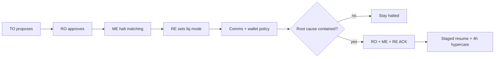

| Field | Detail |
|-------|--------|
| **When** | Disorderly market, oracle/index fail, fat-finger contagion, regulatory order, Sev-1 integrity, cascade per §9 families S1–S4/S7 |
| **Who** | **Propose R:** TO (Spot) / TO-FUT / Margin TO · **A approve halt:** RO · **Execute R:** ME (matching) + RE (liq mode) · **C:** CP (if abuse/reg), WO (withdraw policy), Comms · **Resume A:** RO + ME (+ RE mark healthy for perps) |
| **SLA** | Propose→approve ≤ 5 min in Sev-1/2 · ME execute ≤ 2 min after approve · First Comms draft ≤ 10 min · Resume only after written clearance |
| **Preconditions** | Halt reason code selected; scope (symbol / segment / global) stated; for perps: decision on **orders-only vs include liquidations** |
| **Systems** | `/admin/spot/halt` · `/admin/futures/breaker` · `/admin/engine/kill` (global only, dual) · `/admin/margin/borrow` · Comms macros |

**What this SOP is for:** the market is not safe to match in — wild book, broken index, fat-finger contagion, regulator order, or a liquidation cascade. A halt is not a punishment; it is a pause so we do not print more damage.

**How — Halt (say these words on the bridge)**
1. On-call **TO** opens a voice/chat bridge. In the first 30 seconds state: **scope** (one symbol / one segment / global), **reason code**, and your best **§9 family guess** (S1 real dump vs S2 bad marks vs …). *Why:* people cannot help you if they think the whole venue is down when only XAUUSD is.  
2. **RO** approves (CRO if global). Write the approval on the ticket, not only in chat.  
3. **ME** applies halt/kill for that scope and *confirms* the effect: Spot = no new matches; Perps = no new risk-increasing orders (as designed). Paste a screenshot or engine flag.  
4. **RE (perps/margin):** decide **orders-only vs include liquidations**. Unsafely continuing liquidation on a rotten mark is how we steal from users. Follow RE-02. Tell Comms the truth.  
5. **Margin TO:** if collateral is involved, consider **MG-03** borrow freeze. Phase 1: usually N/A.  
6. **WO:** default **keep withdrawals**. Freeze only if CP/RO order it (client-asset or crime). *Why:* stopping withdrawals during a price scare starts a bank-run rumour.  
7. **Comms** posts status. Perps text **must** say whether funding and liquidations are still running.  
8. **Scribe** logs a timeline (UTC) on the war-room ticket. Do not reconstruct from memory tomorrow.

**How — Resume (do not “just turn it on”)**
1. RO checks root cause is contained. ME health is green. For perps, **RE** confirms mark/index are fresh (PL-K06 / PF-K02). If mark is still stale, you are not done.  
2. Dual ACK: RO + ME (+ Product PIC). Three names, not “we all agreed on the call.”  
3. Resume in stages: watch for a cancel storm → bands on → normal.  
4. Hypercare **at least 4 hours**.

**Done when:** Matching state matches the intended mode; Comms updated; resume ticket signed.  
**Escalate if:** You need a **global kill** → L4 dual-control on `/admin/engine/kill`; marks are wrong *during* a halt → Sev-1 immediately.

---

### 6.3 SOP-G03 — Alert ACK (WARN / BREACH / KILL)


**Figure — SOP-G03 alert ACK**

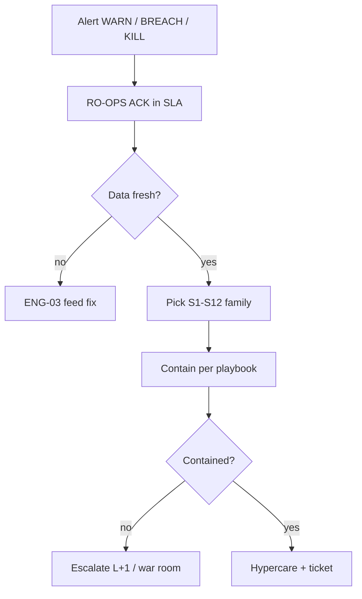

| Field | Detail |
|-------|--------|
| **When** | Any Risk Portal / paging alert on §8 KRIs |
| **Who** | **R ACK + triage:** RO-OPS · **C:** BU PIC for L2+ · **A escalation:** RO / CRO by ladder · **I:** ENG if data-quality |
| **SLA** | ACK: WARN ≤15m · BREACH ≤5m · KILL/client-asset ≤2m · Classification note ≤10m after ACK · Containment plan ≤15m on BREACH |
| **Preconditions** | Alert visible with timestamp; on-call calendar current |
| **Systems** | `/admin/risk/alerts` · §9 triage card · Pager |

**What this SOP is for:** a pager or Risk Portal row lit up. ACK means “a human has seen it,” not “it is fixed.” If nobody ACKs, the next person is auto-paged. That is intentional.

**How**
1. **ACK in the console within the SLA** (WARN 15m, BREACH 5m, Kill/client-asset 2m). *Why:* ACK stops a page storm so the rest of the team can work. It does not close the incident.  
2. **Check that the number is fresh.** Look at the feed timestamp (PL-K06 / PF-K02). If the clock is old, tag the ticket “data” and follow ENG-03. Do **not** liquidate, halt, or change limits on a stale green/red.  
3. **If the number is real:** write the primary KRI, list other KRIs that moved in ±15 minutes, pick a §9 family (S1–S12). *Why:* this is how we avoid treating a bad mark as a real crash.  
4. **Contain** using the playbook for that family. Check whether an automatic action already fired; if it should have and did not, that is a second incident.  
5. **Set L1–L4** and page the roles in §8.2. Say who owns the next action.  
6. **Sev-1/2:** open a war room; schedule a post-mortem within 5 business days while memories are fresh.

**Done when:** ACK + classification + action log on the ticket; a named owner for the next step.  
**Escalate if:** ACK SLA missed → auto-page RO; two BREACHes with no containment → L3.

---

### 6.4 SOP-G04 — Maker–checker & segregation of duties

| Field | Detail |
|-------|--------|
| **When** | Always for Tier A+ limit changes, kill switch, key ceremony, sanctions override, insurance injection, hold removal, leverage rights Tier A+ |
| **Who** | **Maker** initiates · **Checker** different human ID · **SYS** enforces (reject same UID) · **A:** CRO/CISO policy owner |
| **SLA** | Blocking: no prod mutate until checker done · Break-glass: ≤15m with auto-ticket + CRO/CISO page |
| **Preconditions** | ACL roles distinct; maker≠checker≠beneficiary trader |
| **Systems** | IAM · `/admin/audit` · workflow engines |

**What this SOP is for:** stopping one person (or one stolen laptop) from moving a safety rail. “Four-eyes” means two human eyeballs, two logins.

**How / Rules**
1. A trader **cannot** approve their own leverage or rights. The workflow (`trader_rights_workflow`) must reject same-UID.  
2. The RE engineer who *deploys* a Tier A config **cannot** be the only approver.  
3. Wallet key ceremonies: at least two people (prefer three), plus a ceremony ID written down. Old material is destroyed or logged as revoked.  
4. Removing a Compliance hold needs a second CP or an RO, per policy. Putting a hold on can be faster; taking it off is the dangerous direction.  
5. **Break-glass** (emergency access): time-bounded account, automatic ticket (PL-K07), same-day review. If you used break-glass, you have not “finished” until the review exists.

**Done when:** Audit log shows two distinct actor IDs and a ticket link.  
**Escalate if:** Same-ID approval is even *attempted* → treat as security incident ENG-04 / L3, not as a UI glitch.

---

### 6.5 SOP-G05 — EOD reconciliation & settlement

| Field | Detail |
|-------|--------|
| **When** | Daily at configured UTC cutoff (+ ad-hoc after Sev-1 trading incident) |
| **Who** | **R match:** ENG/SYS · **R exceptions:** Clearing Ops / TO · **Checker:** CO2 or RO if material · **A settlement:** TS · **C:** CP retention |
| **SLA** | Match job complete ≤ 60m after cutoff · Material exceptions aged ≤ 4h · Settlement wires only after `SettlementReady` |
| **Preconditions** | Cutoff complete; feeds available; materiality threshold published |
| **Systems** | `eod_reconciliation.py` · treasury settlement queue · evidence store |

**What this SOP is for:** proving our books match the real world before Treasury sends money. “EOD” means end of day at a UTC cutoff. If this is wrong, we can pay a client twice or miss a hole in the insurance fund.

**How**
1. SYS runs a match: internal trades/balances vs ledger, broker, chain, bank → a list of `ReconLine` rows (matched / unmatched / break).  
2. Clearing Ops / TO **owns each break**: re-pull data, adjust with a ticket, or chase the venue. Nobody leaves a break in “other.”  
3. If the money size is above the published materiality: **maker–checker** before anyone approves the break away.  
4. Only when the file is clean (or waived by RO) does the system emit **`SettlementReady`**. That flag is the green light, not a Slack thumbs-up.  
5. **TS** sends the wire or on-chain payment and stores bank/txid references on the pack.  
6. Keep the pack for as long as Compliance policy says.

**Done when:** Zero critical opens, or waived with RO sign-off; TS confirmation IDs attached.  
**Escalate if:** Trades are missing with no explanation → L2/L3 and consider whether trading should pause.

---

### 6.6 SOP-G06 — New product / instrument approval


**Figure — SOP-G06 new product gates (Phase 1 = perps + broker/institution/MM)**

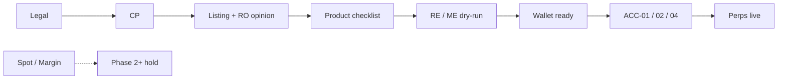

| Field | Detail |
|-------|--------|
| **When** | New spot pair, margin asset, perp contract, or material product feature (portfolio margin, unified account) |
| **Who** | Gate owners in order below; **A go-live:** Risk (RO) + CP clear · **R coord:** LI or PM |
| **SLA** | Each gate SLA on listing pipeline board (typ. 2–10 BD per gate) · No “soft launch” without Risk+CP |
| **Preconditions** | Diligence folder ID; Legal classification draft |
| **Systems** | `/admin/listing/pipeline` · product checklists §11 · wallet chain enable |

**What this SOP is for:** turning a *document* into a *live market*. Gates are ordered so Legal/CP/Risk cannot be “caught up later.” A “soft launch” without Risk+CP is still a launch.

**How (gates — do not reorder)**
1. **Legal** writes what the instrument is (perp? security? which countries care).  
2. **CP** checks sanctions, securities, AML red flags.  
3. **Listing (LI)** completes diligence; **RO** writes a risk opinion (LD-01) with conditions that become the go-live checklist.  
4. **Product** walks the §11 checklist (for Phase 1, the perps list, not Spot).  
5. **RE/ME** put configs in staging and **sign a dry-run** (especially liquidation and ADL for perps).  
6. **WO** confirms deposit/withdraw on the right chains if collateral needs them.  
7. Soft launch / whitelist if used → **72h hypercare roster** named.  
8. Only then open traffic. **Phase 1:** broker / institution / MM cohort only, **not** public 2C signup; **perps only** on the Perp Account.

> **Phase 1 gate note:** production instruments = **perps (incl. XAUUSD)**; access = **ACC-01/02/04** (broker / institution / MM). Spot/Margin/options/wealth = **`[Phase 2+]`**.

**Done when:** Pipeline stage = Live; monitoring KRIs wired; hypercare named.  
**Escalate if:** Traffic is detected before clear → PL-K12 BREACH, force disable, L3 audit.

---

### 6.7 BU SOP catalogue (detailed)

This section is the **desk-level recipes**. Global G01–G06 above are the shared skeleton (change a limit, halt a market, ACK an alert, two-person control, end-of-day books, open a new product). Each card below is one job a named team actually runs.

**If you have never done this work**

1. Find your team's prefix: **RM** = risk ops, **PF** = perps (today's live product), **ACC** = V-Exchange access (broker / institution / MM), **ME** = matching engine, **RE** = risk/liquidation engine, **WA** = wallet, **SP** = spot `[Phase 2+]`, **MG** = margin lending `[Phase 2+]`.
2. Read **What this is** first. If you cannot explain the job in one sentence to a new colleague, do not start clicking.
3. Read **When**. If that event has not happened, this recipe is not yours yet — do not improvise a similar-looking action.
4. Then **How**, in order. A sentence marked *Why* is the reason the previous step exists, not decoration.
5. Do not close the ticket until **Done when** is true. Attach the evidence listed. A closed ticket with no screenshot/hash/ACK is an audit failure.
6. If a field is blank or a screen is missing, **stop and ask RO-OPS**. Inventing a step at 03:00 is how wrong liquidations start.

**Phase 1 people:** read **RM, PF, ACC, ME, RE, WA** first. Spot (SP) and Margin (MG) cards stay here so you can study them; do not enable those products.

---

#### RM — Risk Ops

These are the jobs the 24×7 risk desk actually does. “MI pack” means management information — a snapshot of whether we are inside our risk appetite.

##### RM-01 Daily risk MI pack

**What this is:** every day we print a picture of “are we safe?” so the next shift and the CRO do not start from a blank page. It is a newspaper, not a trade.

| Field | Detail |
|-------|--------|
| **When** | Every UTC cutoff (default 22:00) and again on any L3 day |
| **Who** | **R:** system assembles · **A:** RO reads and comments · **C:** PM/TO on exceptions · **I:** CRO (summary) |
| **SLA** | Pack published ≤ 90 minutes after cutoff |
| **Systems** | `/admin/risk/reports` · `risk_reporting.py` |

**How (do not skip)**
1. Confirm the cutoff actually finished (matching, risk engine, wallet feeds have a timestamp at or after cutoff). *Why:* a pack built on a stuck feed looks green and is a lie (family S9).
2. Run `risk_reporting.py` (or the portal job) so it pulls: desk/company snapshots, every still-open WARN/BREACH, stress-test highlights, waivers expiring in 7 days.
3. Paint each §8 family red/amber/green **and write the feed timestamp next to the colour**.
4. Send to the distribution list. The RO writes a short comment on every amber/red — silence is not a review.
5. ACK in the portal. If the pack is >2 hours late, that is **ENG-03** (pipeline), not “we were busy.”

**Done when:** email/portal post exists and an RO has ACK'd. **Escalate if:** pack >2h late → ENG-03; numbers contradict the live alert console → treat as data incident, do not “fix the PDF.”

##### RM-02 Soft-limit WARN response

**What this is:** a yellow light. Something is off. You have minutes, not hours. WARN is **not** permission to ignore until red.

| Field | Detail |
|-------|--------|
| **When** | Any WARN on §8 |
| **Who** | **R:** RO-OPS · **C:** the BU PIC for that product · **A:** RO if it lasts beyond time-to-escalate |
| **SLA** | ACK 15 min; a written plan in 30–60 min |

**How**
1. ACK in the console (SOP-G03). *Why:* ACK stops the pager from shouting at the next person so you can think.
2. Check the timestamp (PL-K06 / PF-K02). Stale yellow → ENG-03, do not change limits.
3. Write one sentence: “this looks like S? because …”. List other KRIs that moved in ±15 minutes.
4. Decide **watch** (stay on the desk, name a re-check time) or **act** (open a G01/G02/PF-* draft *now*). If the number is walking toward BREACH, pre-stage the next SOP while it is still yellow. *Why:* finding a Checker at red is slower than finding them at yellow.
5. Leave the WARN ticket open until the colour is green **or** you have upgraded it.

**Done when:** WARN cleared or upgraded with a ticket. **Escalate if:** two WARNs on the same family with no plan → treat as L2.

##### RM-03 Hard-limit BREACH response

**What this is:** a red light. The safety margin is gone. Contain first; write the essay later.

| Field | Detail |
|-------|--------|
| **When** | BREACH or anything next to Kill |
| **Who** | **R:** RO-OPS + the product BU PIC · **A:** RO · page CRO if L3+ |
| **SLA** | ACK 5 min; containment 15 min |

**How**
1. ACK (G03). Say on the bridge: scope, KRI id, best §9 family guess.
2. **Contain by product, immediately:** perps → prefer reduce-only (PF-07); margin `[Phase 2+]` → consider borrow freeze (MG-03); spot `[Phase 2+]` → consider halt (G02). *Why:* the engine will keep matching unless someone changes the mode.
3. Check whether the **automatic** action in the §8 table actually fired. If it should have and did not, that is a **second** incident (engine), not a footnote.
4. Set L1–L4 using §8.2. Sev-1/2 → war room (§10). Do not debug alone on client-asset issues.
5. Keep the BREACH open until containment has an owner for the permanent fix. Clicking “close alert” is not containment.

**Done when:** contained + named owner for the permanent fix. **Escalate if:** 15 min with no containment → L3 automatically.

##### RM-04 Leverage / rights increase

**What this is:** a trader or VIP asks to borrow more risk (higher leverage, higher position cap). This is **not** a customer-service favour. It is a credit decision.

| Field | Detail |
|-------|--------|
| **When** | TR/VIP submits a buying-power or leverage request |
| **Who** | **R submit:** trader · **R packet:** system · **A Maker:** RO · **Checker:** RO2/PM if Tier A+ · **R push:** ENG/RE |
| **SLA** | Eligibility packet <5 min auto · Maker ≤1 business day (urgent 1h) |

**How**
1. Trader submits in `trader_rights_workflow` (never in private chat as the only record).
2. System builds an eligibility packet: recent PnL/drawdown, open CP holds, current utilisation, any unpaid bad debt. *Why:* a winning month is not a reason to ignore a compliance freeze.
3. RO (Maker) approves, rejects, or approves with a smaller number and an expiry date. Write the reason.
4. If Tier A+ (large notional / max leverage), a **different human** must Checker. Same login is rejected. *Why:* G04 — one stolen laptop must not raise the ceiling.
5. Only then RE/ENG pushes the new cap. Paste the config hash on the ticket.
6. Confirm the trader's broker/OMS actually shows the new cap before you tell the trader “done.”

**Done when:** status APPROVED and the live limit matches the ticket. **Escalate if:** anyone tries to approve their own UID → security incident, not a UI bug.

##### RM-05 Stress catalogue change

**What this is:** we keep a list of “what if gold gaps 8% overnight / what if the stablecoin breaks.” Changing that list changes which disasters we pretend to survive.

| Field | Detail |
|-------|--------|
| **When** | New scenario, shock size, or correlation matrix |
| **Who** | **R:** DA (quant) · **A:** RO · **C:** PM · **I:** CRO if a core scenario |
| **SLA** | Dual sign-off before the catalogue is published |

**How**
1. DA proposes the shock in writing (which prices move, by how much, over how many minutes).
2. Backtest: would this have lit up on the last three real stress days? If never, the shock may be toy; if always, it may be too tight to be useful.
3. RO + DA both sign. Publish a **version number**. A catalogue with no version is unpublished.
4. Link the version into the daily MI pack (RM-01) so tomorrow's desk uses the new list.

**Done when:** version ID is on the portal.

##### RM-06 Insurance fund draw review

**What this is:** the insurance fund is the pool that pays when a liquidation still leaves a hole. Any payout (or ADL) is a near-miss on client money.

| Field | Detail |
|-------|--------|
| **When** | Any insurance payout or ADL (PF-K07 / K08 / K12) |
| **Who** | **R flash:** TO-FUT · **A review:** RO · **C:** TS accounting · **I:** CRO if above the published size |
| **SLA** | Flash note ≤30 min; formal review ≤1 business day |

**How**
1. Within 30 min: how much was paid, at what mark, was the book thick, did liquidations run on time? One page, UTC timestamps.
2. Within 1 business day: reconcile the ledger vs the engine. Mismatch → L2/L3, do not “plug” the difference.
3. Decide: inject more money (TS-04), tighten leverage (G01), or review ADL (PF-06) if ADL fired.
4. File the note where the next RO-OPS can find it at 03:00.

**Done when:** review note filed and ledger entries match.

##### RM-07 Trading halt recommendation

**What this is:** Risk can *recommend* a halt. Matching actually *does* it (G02). A recommendation sitting in chat is not a halt.

| Field | Detail |
|-------|--------|
| **When** | Price gap, oracle/index failure, liquidation cascade, or a regulator asks |
| **Who** | **R recommend:** RO / RO-OPS · **A decide:** RO · execute via **G02** |
| **SLA** | Recommendation ≤5 min on a BREACH cascade |

**How**
1. On the bridge, say four things: **scope** (one symbol / segment / global), **reason code**, **§9 family**, **orders-only vs include liquidations**.
2. Hand to G02. Stay on the bridge until resume criteria are written down. *Why:* the person who resumes may not have been on the first call.

---

#### SP — Spot `[Phase 2+]`

> Phase 1: these recipes are **study material**. Do not enable a spot symbol.

##### SP-01 Spot symbol go-live

**What this is:** turning a listed token into a live order book people can trade. A listing opinion (LD-01) is not the same as “the button is green.”

| Field | Detail |
|-------|--------|
| **When** | Pipeline stage ready after LD-01 / G06 |
| **Who** | **R:** PM-SPOT + TO · **A:** RO+CP already cleared · **C:** WO, MM, ME |
| **SLA** | Checklist complete the same day as the advertised launch window |

**How**
1. Confirm wallet deposit/withdraw on the **correct chain** (wrong chain = customer money in a hole).
2. Set tick size, lot size, price bands, STP, fees. *Why:* a 0.00000001 tick on a $60,000 coin lets people spam the book.
3. Confirm a market-maker SLA **or** a public “thin book” disclosure. Silence is not a disclosure.
4. Test halt (SP-02 path) on staging. If you cannot halt, you cannot launch.
5. Wire KRIs SP-K01/02/03/05. Name the 72h hypercare roster.
6. Announce only after the flags are live.

**Done when:** §11.5 ticked; hypercare named.

##### SP-02 Spot trading halt

**What this is:** stop matching buys and sells on a spot pair. Default: **keep withdrawals on** so this does not look like a bank run.

Follow **G02** (Spot column). TO proposes, RO approves, ME executes ≤2 min, Comms posts. Reason code on the ticket.

**Done when:** `/admin/spot/halt` shows the intended state.

##### SP-03 Spot resume

**What this is:** turning the pair back on without printing a fake price into an empty book.

**How**
1. RO+ME confirm the root cause is gone (not “it looks quieter”).
2. Check book integrity and that the market maker is actually quoting.
3. Resume in stages (narrow bands → normal). Hypercare 4 hours.

##### SP-04 Price band / max notional change

A **band** is a fence: the engine rejects an order whose price is too far from the reference. Changing it is a **G01** limit change (two people if Tier A+), then `/admin/spot/bands`, then watch SP-K03.

##### SP-05 Wash / self-trade handoff

**What this is:** two orders from the “same economic owner” trading with each other to fake volume. You are not the detective — Compliance is. Your job is to **hand off evidence fast** and not silently weaken STP (self-trade prevention).

**How:** freeze the order/trade IDs → open a CP case ≤30 min → consider CP-02 hold → do **not** “turn STP down so the client can trade.”

---

#### MG — Margin `[Phase 2+]`

> Phase 1: no lending book. Do not confuse this with **perps margin** (collateral on futures), which lives under PF / RE.

**Plain English:** the user deposits coins, **borrows** (usually stablecoins), buys more coins, and pays interest. If the coins fall, we **force-sell**. **Isolated** = only that position can die. **Cross** = the whole account's collateral can be eaten.

##### MG-01 Add collateral asset

**How**
1. After LD-03, DA stress-tests a **haircut** (we count $100 of a jumpy coin as e.g. $70). *Why:* the coin can fall while we are still selling it.
2. Set LTV (loan-to-value) brackets, borrow caps, interest curve.
3. Dry-run liquidation on isolated **and** cross. Enable only then.

##### MG-02 Haircut / LTV change

G01 path. Urgent depeg: dual-approve ≤30 min. Tell users if the change is adverse (they can be liquidated by a parameter change). Watch MG-K02/03.

##### MG-03 Borrow freeze (asset)

**What this is:** stop **new** loans of an asset (e.g. USDT) so a short squeeze or depeg cannot drain inventory. Existing loans still exist.

**How:** `/admin/margin/borrow` freeze → optional max rate → announce if user-visible → **write the unfreeze criteria on the ticket** (otherwise the freeze lives forever).

##### MG-04 Forced liquidation runbook

**How**
1. Confirm marks are fresh. Rotten marks → **RE-02 pause**. Liquidating on a wrong price is taking user money.
2. If marks are good: keep the queue draining; throttle risk-increasing orders; never delete liquidation history.
3. Lag >30s → L3 (the engine is behind the market).

##### MG-05 Bad debt write-off / recovery

After a shortfall: quantify → try auto-repay → chase the user → residual write-off needs two people → feed the lesson back into haircut/buffer. TS books the P&L; this is not a “rounding” chat message.

##### MG-06 Interest curve update

Do not push a new rate curve while MG-K07 (accrual exceptions) is red — you will compound the error. Material changes go through G01.

---

#### PF — Perps `[Phase 1]`

**This is today's live path.** Read every card. A perpetual (“perp”) is a contract that tracks a price (Bitcoin, gold vs US dollar, …) and **never expires**. Users post collateral, go long or short with leverage. We use a **mark price** (fair price from an index of other venues) to decide profit/loss and liquidation — **not** the last print on our book.

##### PF-01 New perp contract launch

**What this is:** putting a new contract (for example another metal pair, or a new BTC perp) in front of broker / institution / MM users. Skipping a checkbox here is how you launch with no insurance or a one-venue index.

| Field | Detail |
|-------|--------|
| **When** | LD-04 + G06 complete |
| **Who** | **R:** PM-FUT · **A:** RO · **C:** RE / ME / DA / TS |
| **How** | Walk §11.3 **out loud** with a second person. Specs signed; index has the minimum number of venues and PF-K01/K02 alerts on; leverage brackets dual-approved; insurance seed in the wallet; funding cap tested; liquidation + ADL dry-run signed; matching symbol + rate limits; support scripts that mention funding and liq; 72h named hypercare; RO-OPS can explain S2 (bad mark) vs S1 (real dump) for **this** symbol. |
| **Done when** | Live, and PF-K01/02/06/07 dashboards are green **with fresh timestamps**. Missing one item = do not launch. |

##### PF-02 Leverage bracket change

**What this is:** “maximum leverage for this contract / this notional size.” Raising it lets users lose their collateral faster. This is G01, not a product experiment.

**How**
1. Count how many users sit near the cap and how much open interest would jump.
2. G01 dual-control → `/admin/futures/leverage` → 24h hypercare **watching liquidation count** (PF-K06). *Why:* a “small” bracket change is a common Sev-level mistake.

##### PF-03 Mark–index deviation response

**What this is:** the most important perps alarm. **Mark** should stay near **index** (the average of other exchanges). If they split, either the world moved (basis) or **our number is wrong** (we may liquidate healthy users).

| Field | Detail |
|-------|--------|
| **When** | PF-K01 WARN/BREACH |
| **Who** | **R:** RO-OPS + RE + DA · **A:** RO · **C:** TO-FUT |
| **SLA** | BREACH triage ≤5 min |

**How (say this on the bridge)**
1. **Clock:** when did PF-K01 move? Did **PL-K06** (pipeline lag) or **PF-K02** (a venue in the index went stale) move *first*? *Why:* first-mover tells S2 (data) from S1 (real market).
2. Look at **external** venues (the real gold/BTC market). If they are calm and we are screaming, believe S2.
3. **If data (S2):** fail over the feed (RE-03). If marks are unsafe, **pause liquidations** (RE-02) and consider reduce-only (PF-07). Tell Comms: “liquidations paused because the fair price feed is unhealthy,” not “the market is closed.”
4. **If real basis:** the index is honest; our book is just far away. Consider reduce-only. Do **not** rewrite the mark formula to make the chart pretty.
5. Any formula change is **dual RO+DA**. There is no “fix it now, ticket later.”

**Done when:** the deviation is explained, and either the feed is healthy or trading is contained. **Escalate if:** liquidations already ran on a suspected bad mark → Sev-1.

##### PF-04 Funding extreme / pause

**What this is:** every 1 or 8 hours (as designed), longs pay shorts or the reverse, so the perp cannot float away from the real price forever. A **cap** (clamp) stops the rate from becoming infinite. Users complaining that funding is “expensive” is **not** a reason to switch it off.

**How**
1. Confirm the cap actually applied (PF-K03). If it did, the system worked.
2. Pause **settlement** only if integrity is broken (wrong formula, double-pay). Dual RO+PM, and Comms must say funding is paused.
3. Resume with an RO ACK.

##### PF-05 Insurance payout review

Same-day flash: bankruptcy price, were liquidations on time, was a market maker present? Numbers that do not match the ledger → escalate. Then RM-06 / possible TS-04 inject.

##### PF-06 ADL activation review

**What this is:** Auto-Deleveraging. When insurance cannot pay a hole, we cut **winning opposite positions**. It feels unfair to winners. It is the last safety valve.

**How**
1. Prove insurance was **actually** insufficient (PF-K07 should have gone amber/red **before** PF-K08). If ADL fired first, the trigger is misconfigured → **stop ADL + Sev-1**.
2. Check the ranking was the published rule (usually highest leverage / highest profit first — follow the live policy).
3. User notices go out. CP looks for abuse if the pattern is odd.

##### PF-07 Perps halt / reduce-only

**Reduce-only** means: you may **close** or shrink a position, you may **not** make it bigger. Prefer this over a full halt when the matching engine is healthy. Full halt follows G02. Comms **must** say whether funding and liquidations are still running.

##### PF-08 Index constituent outage

The index is an average of several outside venues. If one venue dies or prints nonsense, **drop it** (policy). If too few venues remain, **protect the mark** and go reduce-only / pause liq. Temporary weights need an RO signature. Do not “just use Binance only” without that signature — one venue is easy to manipulate.

---

#### ME — Matching

**Plain English:** the matching engine is the program that turns a buy order and a sell order into a trade. If it is wrong, every price and every liquidation that used that price is wrong. Treat it like a nuclear control room: small, dual-controlled switches.

##### ME-01 Engine deploy / rollback

**How**
1. Change ticket with what will be different and how to roll back (rehearsed, not “we think we remember”).
2. Canary (tiny slice of traffic) first. Watch latency SP-K09 and cancel ratio SP-K04.
3. If Sev-1 latency or integrity: rollback decision ≤15 min. Heroic hotfixes during a red book are how you get a second incident.

##### ME-02 Matching halt

Business halt (G02) needs RO approval. **Global kill** (the whole venue) is two people on `/admin/engine/kill`. Confirm the effect (no new matches) and tell RE so liquidations are not running on a frozen book by accident. Never leave one shard trading and another halted without saying so.

##### ME-03 Dual-site failover

Declare the incident → drain/failover on `/admin/engine/failover` → **ME-05** prove the book is the same book → resume via G02 if you halted. A failover without a book checksum is a rumour.

##### ME-04 Cancel storm mitigation

Too many cancel messages starve real trades. Raise rate limits **carefully** or shed load; if one UID is the storm, hand to CP (abuse). Protect the latency SLO; do not “open the firehose so VIPs are happy.”

##### ME-05 Post-incident book rebuild verify

Compare book checksums and trade continuity. **Sign the comparison on the ticket before full resume.** *Why:* resuming into a reconstructed garbage book prints fake prices and fake liquidations.

---

#### RE — Risk engine

**Plain English:** this program continuously asks “if price jumps, does this user still have enough collateral?” It computes **margin ratio**, **bankruptcy price**, and it **starts liquidation**. A wrong config here is more dangerous than a wrong blog post — it moves money.

##### RE-01 Config promote

**How**
1. Only promote with a **G01 ticket id** and a diff you can read.
2. Staging first, then production. Paste the **config hash** back on the ticket.
3. Ping RO-OPS to start 24h hypercare.
4. Promote without a ticket → **revert + audit**. There is no “emergency paste into prod.”

##### RE-02 Liquidation engine pause / resume

**What this is:** stop the robot that force-closes users. You do this when the **price it is using is unsafe**, not because users are complaining they got liquidated fairly.

**How**
1. RO orders it. RE hits pause on `/admin/risk-engine/liq` ≤2 min.
2. Comms tells the truth: users may **still be at risk**; we stopped the robot because the ruler is broken.
3. Resume **only** when marks are fresh **and** RO ACKs in writing.

##### RE-03 Mark price feed failover

Switch to the secondary source, then watch PF-K01. If **both** sources are bad: reduce-only and/or pause liq. Do not average two rotten numbers and call it fine.

##### RE-04 Risk state rebuild

When risk-engine balances disagree with matching or wallet: **freeze risk-increasing orders** → rebuild from the authoritative ledger → sample-recon → unfreeze. Never rebuild while users can still open new leverage.

##### RE-05 Portfolio-margin model change

If unified account / portfolio margin is on: run the new model **in parallel** (shadow) → publish the gap report → feature flag → keep a conservative fallback. This is dual G01. Phase 1: usually off.

---

#### WA — Wallet

**Plain English:** this is where coins actually sit. **Hot** wallet = connected to the internet, pays withdrawals, must not hold more than a buffer. **Cold** = slower, more people, ceremony. A “top-up” is moving coins cold → hot so genuine withdrawals still pay. A “slow mode” is paying withdrawals slower so a panic does not empty the hot wallet.

##### WA-01 Hot wallet top-up

**How**
1. Confirm **on-chain** balances (not only the internal screen). *Why:* the screen can lag; the chain is the money.
2. WARN: start the cold→hot move ≤30 min. BREACH: start immediately.
3. Follow the key ceremony (WA-05 / G04). Log the txid on the ticket. Verify the buffer is actually back above policy.

##### WA-02 Withdrawal queue / slow mode

**How**
1. BREACH on backlog or run-risk: decide slow mode ≤15 min.
2. Turn it on at `/admin/wallet/withdraw`. Write the **priority rules** (who gets paid first) and the **exit criteria** (buffer + backlog ages).
3. Status page for users. Hiding a queue creates a worse run.

##### WA-03 Chain halt / reorg

A **reorg** is the blockchain rewriting recent blocks. Credits on a block that disappeared were never real. Pause crediting that chain, measure depth, claw back if we already credited, resume only with the finality policy (how many confirmations).

##### WA-04 Wrong deposit recovery

User sent the wrong asset, wrong chain, or missing memo. Verify they own the sending address → is recovery even possible → fee policy → **two people** to move funds → close with txids. CP checks AML. This is not “just send it back.”

##### WA-05 Key ceremony / rotation

Two (prefer three) people, a ceremony ID written down, old keys destroyed or logged as revoked. G04 applies. A photo of a seed phrase in chat is an incident.

##### WA-06 PoR snapshot

Proof of Reserves: pick a block height, extract liabilities, publish/attest, archive. CRO/Finance per policy. Do not run this as a marketing screenshot without the liability side.

---

#### LD — Listing / delisting

**Plain English:** listing = allowing a market. Delisting = taking it away in a **fixed order** so we do not leave a futures contract live on a token that no longer has a spot price, or leave loans open on a coin we are about to disable.

##### LD-01 Listing risk opinion

LI builds the diligence pack (who issued it, can they freeze accounts, unlocks, manipulation history). RO writes **Approve / Conditional / Reject**. Conditions become the go-live checklist — they are not polite suggestions.

##### LD-02 Seed / monitoring tag

A public warning tag (“seed”, “monitoring”). Optional tighter bands. Support and Comms must see the same tag the user sees.

##### LD-03 Margin eligibility `[Phase 2+]`

After the coin has been calm on spot, RO-Credit may allow it as collateral → then MG-01.

##### LD-04 Perp listing decision `[Phase 1]`

Demand + risk appetite → RO says yes → **PF-01**. Phase 1: this is the live listing path (XAUUSD and other approved perps).

##### LD-05 / LD-06 / LD-07 Delist sequences

**Mandatory order** (do not skip because “spot is the real product”):
1. Risk + Legal + CP approve.
2. **Perps (LD-07):** reduce-only → flatten or wait expiry → delist the contract.
3. **Margin (LD-06, Phase 2+):** freeze borrow → force repay/liquidate → remove collateral.
4. **Spot (LD-05, Phase 2+):** halt if needed → disable trading → withdrawals follow WA.
5. Comms + support macros.

##### LD-08 Emergency delist / halt

Exploit, fraud, stolen-mint. **Safety first:** halt and disable deposits immediately. Fill in the paperwork within 24h. Forensics with Security/CP. Do not wait for a tidy project call.

---

#### CP — Compliance

**Plain English:** Compliance decides *who is allowed to trade* and whether someone is **abusing** the market. Risk decides *how much leverage*. Do not mix those jobs. A **hard hold** is a lock on trade, withdraw, and/or leverage.

##### CP-01 Surveillance alert triage

Open the alert → decide false/positive → open a case → link UIDs and products. Same-day for high severity. You are building a timeline, not a vibe.

##### CP-02 Account hard hold

Put the hold on `/admin/compliance/holds`. Tell Support which script to read to the user. **Removing** a hold needs a second person (G04). Putting a hold on can be fast; taking it off is the dangerous direction.

##### CP-03 Cross-product abuse review

Someone may be buying spot and dumping perps (or the reverse). Build **one** timeline across products. Tell RO if it is moving the mark. Holds as needed.

##### CP-04 Reg request / freeze

An outside authority asks to freeze. **Authenticate the order first** (forgery is a thing). Freeze the stated scope, acknowledge, retain. Legal is Accountable. Do not expand the freeze “to be helpful.”

---

#### TS / MM / ENG

##### TS-01 Banking corridor outage

A bank or payment partner is down. Divert to another rail, update deposit/withdraw wording with WO/Comms, tell RO if this creates a liquidity hole. Done when the corridor or an alternative is actually live.

##### TS-02 Stablecoin depeg response

The “$1 coin” is no longer $1. Confirm on **external** markets (S3) vs our oracle being wrong (S2). Inventory and redemption, haircut/borrow with MG-03 `[Phase 2+]`, Comms. Hard depeg → L3.

##### TS-03 Settlement after EOD recon

Pay **only** after `SettlementReady` (G05). Attach bank/txid refs. Never settle on an open material break — that is how we pay twice.

##### TS-04 Insurance fund injection

Move company money into the insurance pool after RM-06 + CRO. Dual control (G04). Ledger it. Tell RO. This is not a silent wallet drift.

##### MM-01 SLA breach escalation

Market makers promised to keep a bid and an offer near each other. If depth/spread fail (SP-K01/02), call them, enforce the contract, ask RO for a halt if the book is disorderly.

##### MM-02 Vol regime quote widen

In a storm they may legally widen. They must keep a **heartbeat** (quotes still updating). Silent empty book is an outage (S5), not “vol.”

##### MM-03 Information barrier check

If we have an affiliated desk, they must not see customer flow. Log the check when listing or when prop overlap appears.

##### ENG-01 Privileged admin access grant

Joiner/mover: least privilege, time-bound, ticketed, recertified quarterly. BU PIC + Security both sign. Admin pages in this handbook are dangerous; access is not a souvenir.

##### ENG-02 Audit log immutability check

Periodically prove nobody can edit history. A gap is L3 — you have lost the court record.

##### ENG-03 Pipeline lag incident

Risk numbers are late (PL-K06). Fix the consumer. If marks are unsafe, trigger RE-02 / PF-03 **before** you finish the Kubernetes ticket. Done when lag < WARN.

##### ENG-04 Security incident (key/API)

Compromised key: **kill it ≤2 min**, rotate, notify, forensics, L3/L4 war room. CRO/CISO/CP informed. Speed beats a perfect write-up.

---

#### ACCESS — Phase 1 V-Exchange onboarding `[Phase 1]`

**Plain English:** in Phase 1 a person **cannot** create an account from the public website. **2C** terminal users come through a **broker** (Vantage or another sub-brand, or an external white-label / API broker). **Hedge funds / HNW** open **offline** and trade **by API**. **Market makers** join on the liquidity path. After KYC they get a **Perp Account** funded in **USD/USDT** only. Spot, USD margin, cross-ccy margin, portfolio margin, options, and wealth flags stay off. If you find a public “register” button working, that is an **L3 incident**, not a growth win.

##### ACC-01 Broker / sub-brand 2C onboarding

| Field | Detail |
|-------|--------|
| **When** | A contracted broker (Vantage sub-brand or external white-label / API) introduces a terminal user |
| **Who** | **R:** Broker ops / Product · **A CP:** KYC/KYB gates · **A risk entitlements:** RO · **R enable trade:** RE/ENG flags |
| **SLA** | Broker-tag bind ≤5 min automated after CP clear · Manual CP review per policy · Entitlement push ≤15 min after clear |
| **Preconditions** | Phase 1 mode on; broker agreement live; sanctions screen clear |
| **Systems** | Broker portal · KYC · `/admin/compliance/holds` · risk limits tier |

**How (why each step exists)**
1. **Verify the broker agreement is live** (not expired, not suspended). *Why:* a lapsed broker is not a front door.
2. **Collect KYC/KYB** on the end-client (who they are; if a company, who owns it).
3. **CP clears.** Until this, the account is a folder, not a trader.
4. **Bind metadata:** broker id, sub-brand vs external WL, who introduced, when. *Why:* surveillance and broker revenue need this tag.
5. **Open Account, then Perp Account.** Product entitlement = **perps only**. Spot / margin / options / wealth flags **off**.
6. **Funding rule:** only **USD/USDT** transfers from **MT account** or **X-fund** into the Perp Account.
7. Enable trading flags. Audit log. Spot-check: can they open an approved perp? Can they **not** open a spot order?

**Done when:** they can trade approved perps only, tagged to that broker. **Escalate if:** public signup path found open → **L3 disable the path first**, then hunt UIDs already created.

##### ACC-02 Institutional direct (offline, API-only)

**What this is:** a hedge fund or HNW opens **offline** on V-Exchange and receives **API access only** — no public UI signup. Limits are the **tighter** of (institution book limit, account limit).

**How**
1. Offline KYC/KYB pack complete; Legal/CP classify the entity.
2. Open Account **without** a retail UI path. Issue API credentials under dual control (G04).
3. Apply **both** limit stacks; the engine must use the stricter one.
4. Entitlement = Phase 1 **Perp Account** only (USD/USDT). Dual-control any VIP/credit.
5. If the agreement lapses: **kill new API keys** first. Existing positions follow the contract + a risk opinion.

**Done when:** the institution trades only on the approved API path; surveillance can attribute orders to that legal entity.

##### ACC-03 Phase 1 entitlement & channel guard (daily)

**What this is:** the daily “is the front door still locked, and is money still on the green rail?”

**How**
1. Alert if any UID has spot, USD margin, cross-ccy margin, portfolio margin, options, or wealth enabled.
2. Alert if self-serve 2C register is open.
3. Alert if a UID can place an order with **no** broker, institution, or MM tag.
4. Alert if a Perp Account accepted a transfer that is **not** USD/USDT.
5. Daily report to RO-OPS + CP. Zero exceptions, or exceptions ticketed with a **phase-gate waiver** (not a Slack emoji).

**Done when:** daily zero exceptions or every exception has a waiver ticket.

##### ACC-04 MM / liquidity-partner access

**What this is:** a contracted market maker plugs into V-Exchange to quote Phase 1 perps. They are 2B, not a retail 2C user.

**How**
1. Agreement + MM SLA live (heartbeat, max spread/depth for the perp book).
2. Offline open; tag **MM**. API keys dual-control.
3. Entitlement = perps only. Separate information barriers if an affiliate desk exists (MM-03).
4. If heartbeat dies → treat as family **S5** (single-name liquidity hole), not “they went quiet.”

**Done when:** MM tag + SLA monitors are live on the symbols they cover.


## 7. Admin pages & tool catalogue

### 7.1 Canonical admin map (by domain)

**URL sheet (all full links):** [https://hxyan2020.github.io/PRD/risk-handbook/urls.html](https://hxyan2020.github.io/PRD/risk-handbook/urls.html)  
**Admin catalogue:** [https://hxyan2020.github.io/PRD/risk-handbook/admin/](https://hxyan2020.github.io/PRD/risk-handbook/admin/)

| Domain | Logical path | Full public URL (GitHub Pages) | Primary BU |
|--------|--------------|--------------------------------|------------|
| Risk limits & alerts | `/admin/risk/*` | [https://hxyan2020.github.io/PRD/risk-handbook/admin/risk/](https://hxyan2020.github.io/PRD/risk-handbook/admin/risk/) | RO / RO-OPS |
| Risk engine | `/admin/risk-engine/*` | [https://hxyan2020.github.io/PRD/risk-handbook/admin/risk-engine/](https://hxyan2020.github.io/PRD/risk-handbook/admin/risk-engine/) | RE |
| Futures/Perps | `/admin/futures/*` | [https://hxyan2020.github.io/PRD/risk-handbook/admin/futures/](https://hxyan2020.github.io/PRD/risk-handbook/admin/futures/) | Futures PM / TO-FUT |
| Matching engine | `/admin/engine/*` | [https://hxyan2020.github.io/PRD/risk-handbook/admin/engine/](https://hxyan2020.github.io/PRD/risk-handbook/admin/engine/) | ME / SRE |
| Wallet | `/admin/wallet/*` | [https://hxyan2020.github.io/PRD/risk-handbook/admin/wallet/](https://hxyan2020.github.io/PRD/risk-handbook/admin/wallet/) | WO |
| Listing | `/admin/listing/*` | [https://hxyan2020.github.io/PRD/risk-handbook/admin/listing/](https://hxyan2020.github.io/PRD/risk-handbook/admin/listing/) | LI |
| Compliance | `/admin/compliance/*` | [https://hxyan2020.github.io/PRD/risk-handbook/admin/compliance/](https://hxyan2020.github.io/PRD/risk-handbook/admin/compliance/) | CP |
| Treasury | `/admin/treasury/*` | [https://hxyan2020.github.io/PRD/risk-handbook/admin/treasury/](https://hxyan2020.github.io/PRD/risk-handbook/admin/treasury/) | TS |
| Access & audit | `/admin/iam/* , /admin/audit/*` | [https://hxyan2020.github.io/PRD/risk-handbook/admin/iam/](https://hxyan2020.github.io/PRD/risk-handbook/admin/iam/) · [https://hxyan2020.github.io/PRD/risk-handbook/admin/audit/](https://hxyan2020.github.io/PRD/risk-handbook/admin/audit/) | Security / ENG |
| Spot `[Phase 2+]` | `/admin/spot/*` | [https://hxyan2020.github.io/PRD/risk-handbook/admin/spot/](https://hxyan2020.github.io/PRD/risk-handbook/admin/spot/) | Spot PM / TO |
| Margin `[Phase 2+]` | `/admin/margin/*` | [https://hxyan2020.github.io/PRD/risk-handbook/admin/margin/](https://hxyan2020.github.io/PRD/risk-handbook/admin/margin/) | Margin PM / RO-Credit |
| Market making `[Phase 1 — perps]` | `/admin/mm/*` | [https://hxyan2020.github.io/PRD/risk-handbook/admin/mm/](https://hxyan2020.github.io/PRD/risk-handbook/admin/mm/) | MM |

> **Vercel:** this handbook is **not** on Vercel. `https://prd.vercel.app/` is a different product (LeadShark MVP PRD).  
> These GitHub Pages URLs are **public documentation stubs** of the admin catalogue (not a live exchange). Map the same paths 1:1 onto the internal Admin Console when it exists.

> **Phase 1 admin priority:** futures, risk, engine, wallet, broker/institution/MM & compliance. Spot and margin URLs exist as stubs but stay **disabled** in production (`[Phase 2+]`).

#### 7.1.1 Every admin page (full URL)

| Phase | Path | Full public URL |
|-------|------|-----------------|
| Phase 1 | `/admin/risk/limits` | [https://hxyan2020.github.io/PRD/risk-handbook/admin/risk/limits/](https://hxyan2020.github.io/PRD/risk-handbook/admin/risk/limits/) |
| Phase 1 | `/admin/risk/alerts` | [https://hxyan2020.github.io/PRD/risk-handbook/admin/risk/alerts/](https://hxyan2020.github.io/PRD/risk-handbook/admin/risk/alerts/) |
| Phase 1 | `/admin/risk/stress` | [https://hxyan2020.github.io/PRD/risk-handbook/admin/risk/stress/](https://hxyan2020.github.io/PRD/risk-handbook/admin/risk/stress/) |
| Phase 1 | `/admin/risk/insurance` | [https://hxyan2020.github.io/PRD/risk-handbook/admin/risk/insurance/](https://hxyan2020.github.io/PRD/risk-handbook/admin/risk/insurance/) |
| Phase 1 | `/admin/risk/reports` | [https://hxyan2020.github.io/PRD/risk-handbook/admin/risk/reports/](https://hxyan2020.github.io/PRD/risk-handbook/admin/risk/reports/) |
| Phase 1 | `/admin/risk/waivers` | [https://hxyan2020.github.io/PRD/risk-handbook/admin/risk/waivers/](https://hxyan2020.github.io/PRD/risk-handbook/admin/risk/waivers/) |
| Phase 1 | `/admin/risk-engine/configs` | [https://hxyan2020.github.io/PRD/risk-handbook/admin/risk-engine/configs/](https://hxyan2020.github.io/PRD/risk-handbook/admin/risk-engine/configs/) |
| Phase 1 | `/admin/risk-engine/liq` | [https://hxyan2020.github.io/PRD/risk-handbook/admin/risk-engine/liq/](https://hxyan2020.github.io/PRD/risk-handbook/admin/risk-engine/liq/) |
| Phase 1 | `/admin/risk-engine/feeds` | [https://hxyan2020.github.io/PRD/risk-handbook/admin/risk-engine/feeds/](https://hxyan2020.github.io/PRD/risk-handbook/admin/risk-engine/feeds/) |
| Phase 1 | `/admin/risk-engine/sim` | [https://hxyan2020.github.io/PRD/risk-handbook/admin/risk-engine/sim/](https://hxyan2020.github.io/PRD/risk-handbook/admin/risk-engine/sim/) |
| Phase 1 | `/admin/futures/contracts` | [https://hxyan2020.github.io/PRD/risk-handbook/admin/futures/contracts/](https://hxyan2020.github.io/PRD/risk-handbook/admin/futures/contracts/) |
| Phase 1 | `/admin/futures/leverage` | [https://hxyan2020.github.io/PRD/risk-handbook/admin/futures/leverage/](https://hxyan2020.github.io/PRD/risk-handbook/admin/futures/leverage/) |
| Phase 1 | `/admin/futures/risk-limits` | [https://hxyan2020.github.io/PRD/risk-handbook/admin/futures/risk-limits/](https://hxyan2020.github.io/PRD/risk-handbook/admin/futures/risk-limits/) |
| Phase 1 | `/admin/futures/mark-index` | [https://hxyan2020.github.io/PRD/risk-handbook/admin/futures/mark-index/](https://hxyan2020.github.io/PRD/risk-handbook/admin/futures/mark-index/) |
| Phase 1 | `/admin/futures/funding` | [https://hxyan2020.github.io/PRD/risk-handbook/admin/futures/funding/](https://hxyan2020.github.io/PRD/risk-handbook/admin/futures/funding/) |
| Phase 1 | `/admin/futures/insurance` | [https://hxyan2020.github.io/PRD/risk-handbook/admin/futures/insurance/](https://hxyan2020.github.io/PRD/risk-handbook/admin/futures/insurance/) |
| Phase 1 | `/admin/futures/adl` | [https://hxyan2020.github.io/PRD/risk-handbook/admin/futures/adl/](https://hxyan2020.github.io/PRD/risk-handbook/admin/futures/adl/) |
| Phase 1 | `/admin/futures/breaker` | [https://hxyan2020.github.io/PRD/risk-handbook/admin/futures/breaker/](https://hxyan2020.github.io/PRD/risk-handbook/admin/futures/breaker/) |
| Phase 1 | `/admin/engine/status` | [https://hxyan2020.github.io/PRD/risk-handbook/admin/engine/status/](https://hxyan2020.github.io/PRD/risk-handbook/admin/engine/status/) |
| Phase 1 | `/admin/engine/kill` | [https://hxyan2020.github.io/PRD/risk-handbook/admin/engine/kill/](https://hxyan2020.github.io/PRD/risk-handbook/admin/engine/kill/) |
| Phase 1 | `/admin/engine/rate-limits` | [https://hxyan2020.github.io/PRD/risk-handbook/admin/engine/rate-limits/](https://hxyan2020.github.io/PRD/risk-handbook/admin/engine/rate-limits/) |
| Phase 1 | `/admin/engine/stp` | [https://hxyan2020.github.io/PRD/risk-handbook/admin/engine/stp/](https://hxyan2020.github.io/PRD/risk-handbook/admin/engine/stp/) |
| Phase 1 | `/admin/engine/failover` | [https://hxyan2020.github.io/PRD/risk-handbook/admin/engine/failover/](https://hxyan2020.github.io/PRD/risk-handbook/admin/engine/failover/) |
| Phase 1 | `/admin/wallet/balances` | [https://hxyan2020.github.io/PRD/risk-handbook/admin/wallet/balances/](https://hxyan2020.github.io/PRD/risk-handbook/admin/wallet/balances/) |
| Phase 1 | `/admin/wallet/withdraw` | [https://hxyan2020.github.io/PRD/risk-handbook/admin/wallet/withdraw/](https://hxyan2020.github.io/PRD/risk-handbook/admin/wallet/withdraw/) |
| Phase 1 | `/admin/wallet/deposit` | [https://hxyan2020.github.io/PRD/risk-handbook/admin/wallet/deposit/](https://hxyan2020.github.io/PRD/risk-handbook/admin/wallet/deposit/) |
| Phase 1 | `/admin/wallet/keys` | [https://hxyan2020.github.io/PRD/risk-handbook/admin/wallet/keys/](https://hxyan2020.github.io/PRD/risk-handbook/admin/wallet/keys/) |
| Phase 1 | `/admin/wallet/chains` | [https://hxyan2020.github.io/PRD/risk-handbook/admin/wallet/chains/](https://hxyan2020.github.io/PRD/risk-handbook/admin/wallet/chains/) |
| Phase 1 | `/admin/compliance/surveillance` | [https://hxyan2020.github.io/PRD/risk-handbook/admin/compliance/surveillance/](https://hxyan2020.github.io/PRD/risk-handbook/admin/compliance/surveillance/) |
| Phase 1 | `/admin/compliance/holds` | [https://hxyan2020.github.io/PRD/risk-handbook/admin/compliance/holds/](https://hxyan2020.github.io/PRD/risk-handbook/admin/compliance/holds/) |
| Phase 1 | `/admin/compliance/kyb-kyc` | [https://hxyan2020.github.io/PRD/risk-handbook/admin/compliance/kyb-kyc/](https://hxyan2020.github.io/PRD/risk-handbook/admin/compliance/kyb-kyc/) |
| Phase 1 | `/admin/compliance/sanctions` | [https://hxyan2020.github.io/PRD/risk-handbook/admin/compliance/sanctions/](https://hxyan2020.github.io/PRD/risk-handbook/admin/compliance/sanctions/) |
| Phase 1 | `/admin/listing/pipeline` | [https://hxyan2020.github.io/PRD/risk-handbook/admin/listing/pipeline/](https://hxyan2020.github.io/PRD/risk-handbook/admin/listing/pipeline/) |
| Phase 1 | `/admin/listing/tags` | [https://hxyan2020.github.io/PRD/risk-handbook/admin/listing/tags/](https://hxyan2020.github.io/PRD/risk-handbook/admin/listing/tags/) |
| Phase 1 | `/admin/listing/delist` | [https://hxyan2020.github.io/PRD/risk-handbook/admin/listing/delist/](https://hxyan2020.github.io/PRD/risk-handbook/admin/listing/delist/) |
| Phase 1 | `/admin/listing/migrations` | [https://hxyan2020.github.io/PRD/risk-handbook/admin/listing/migrations/](https://hxyan2020.github.io/PRD/risk-handbook/admin/listing/migrations/) |
| Phase 1 | `/admin/treasury/balances` | [https://hxyan2020.github.io/PRD/risk-handbook/admin/treasury/balances/](https://hxyan2020.github.io/PRD/risk-handbook/admin/treasury/balances/) |
| Phase 1 | `/admin/treasury/settlement` | [https://hxyan2020.github.io/PRD/risk-handbook/admin/treasury/settlement/](https://hxyan2020.github.io/PRD/risk-handbook/admin/treasury/settlement/) |
| Phase 1 | `/admin/treasury/stablecoins` | [https://hxyan2020.github.io/PRD/risk-handbook/admin/treasury/stablecoins/](https://hxyan2020.github.io/PRD/risk-handbook/admin/treasury/stablecoins/) |
| Phase 1 | `/admin/iam/` | [https://hxyan2020.github.io/PRD/risk-handbook/admin/iam](https://hxyan2020.github.io/PRD/risk-handbook/admin/iam) |
| Phase 1 | `/admin/audit/` | [https://hxyan2020.github.io/PRD/risk-handbook/admin/audit](https://hxyan2020.github.io/PRD/risk-handbook/admin/audit) |
| Phase 2+ | `/admin/spot/symbols` | [https://hxyan2020.github.io/PRD/risk-handbook/admin/spot/symbols/](https://hxyan2020.github.io/PRD/risk-handbook/admin/spot/symbols/) |
| Phase 2+ | `/admin/spot/bands` | [https://hxyan2020.github.io/PRD/risk-handbook/admin/spot/bands/](https://hxyan2020.github.io/PRD/risk-handbook/admin/spot/bands/) |
| Phase 2+ | `/admin/spot/halt` | [https://hxyan2020.github.io/PRD/risk-handbook/admin/spot/halt/](https://hxyan2020.github.io/PRD/risk-handbook/admin/spot/halt/) |
| Phase 2+ | `/admin/spot/fees` | [https://hxyan2020.github.io/PRD/risk-handbook/admin/spot/fees/](https://hxyan2020.github.io/PRD/risk-handbook/admin/spot/fees/) |
| Phase 2+ | `/admin/spot/stp` | [https://hxyan2020.github.io/PRD/risk-handbook/admin/spot/stp/](https://hxyan2020.github.io/PRD/risk-handbook/admin/spot/stp/) |
| Phase 2+ | `/admin/margin/collateral` | [https://hxyan2020.github.io/PRD/risk-handbook/admin/margin/collateral/](https://hxyan2020.github.io/PRD/risk-handbook/admin/margin/collateral/) |
| Phase 2+ | `/admin/margin/ltv` | [https://hxyan2020.github.io/PRD/risk-handbook/admin/margin/ltv/](https://hxyan2020.github.io/PRD/risk-handbook/admin/margin/ltv/) |
| Phase 2+ | `/admin/margin/borrow` | [https://hxyan2020.github.io/PRD/risk-handbook/admin/margin/borrow/](https://hxyan2020.github.io/PRD/risk-handbook/admin/margin/borrow/) |
| Phase 2+ | `/admin/margin/interest` | [https://hxyan2020.github.io/PRD/risk-handbook/admin/margin/interest/](https://hxyan2020.github.io/PRD/risk-handbook/admin/margin/interest/) |
| Phase 2+ | `/admin/margin/liquidation` | [https://hxyan2020.github.io/PRD/risk-handbook/admin/margin/liquidation/](https://hxyan2020.github.io/PRD/risk-handbook/admin/margin/liquidation/) |
| Phase 2+ | `/admin/margin/bad-debt` | [https://hxyan2020.github.io/PRD/risk-handbook/admin/margin/bad-debt/](https://hxyan2020.github.io/PRD/risk-handbook/admin/margin/bad-debt/) |
| Phase 1 | `/admin/mm/sla` | [https://hxyan2020.github.io/PRD/risk-handbook/admin/mm/sla/](https://hxyan2020.github.io/PRD/risk-handbook/admin/mm/sla/) |
| Phase 1 | `/admin/mm/inventory` | [https://hxyan2020.github.io/PRD/risk-handbook/admin/mm/inventory/](https://hxyan2020.github.io/PRD/risk-handbook/admin/mm/inventory/) |
| Phase 1 | `/admin/mm/agreements` | [https://hxyan2020.github.io/PRD/risk-handbook/admin/mm/agreements/](https://hxyan2020.github.io/PRD/risk-handbook/admin/mm/agreements/) |

### 7.2 Tooling aligned to platform modules

| Need | Tool / module | Primary users |
|------|---------------|---------------|
| Realtime metrics & alert routing | `risk_metrics_monitor.py` / Risk Portal | RO-OPS, TR |
| Leverage / buying-power requests | `trader_rights_workflow.py` | TR, RO, PM |
| Stress / what-if | `stress_testing.py` | RO, DA, PM |
| Daily risk pack | `risk_reporting.py` | RO, PM |
| EOD recon | `eod_reconciliation.py` | CO/TO, TS |
| Performance attribution | `performance_attribution.py` | PM, RO |
| Narrative flowchart | `05-use-case-narrative-flowchart.drawio` | All PICs (training) |

### 7.3 ACL principles for admin pages

1. **Least privilege** by role code.  
2. **Dual control** on: kill switch, key ops, sanctions override, insurance injection, Tier-A limits.  
3. **Immutable audit** on every mutate.  
4. **Break-glass** accounts: time-bound, auto-ticket, CRO/CISO notify.  
5. **Environment separation**: read-only prod replicas for analysts where possible.

---

## 8. Limits, KRIs, thresholds, actions & escalation

### 8.1 How to read the indicator catalogue

This chapter is a **watch list**. Each row is one sensor. You do not need to memorise the formulas; you need to know: *what is it measuring, when is it “a bit off,” when is it “broken,” what the machine already did, and what a human must do.*

Each indicator row uses this schema:

| Column | Meaning in plain English |
|--------|--------------------------|
| **ID** | A stable code (e.g. PF-K01) to paste into tickets and dashboards so everyone points at the same sensor |
| **Indicator** | The thing being measured, in words |
| **Freq** | How often we look (every second vs once a day) |
| **WARN** | Soft threshold: investigate; usually no auto-block. Think “check-engine light” |
| **BREACH** | Hard threshold: something must happen (the system and/or a human). Think “brake” |
| **Auto action** | What the system already does without waiting for you (only where that is safe) |
| **Human action** | What you must still do even if the system fired |
| **Escalate** | Who to page, using the L1–L4 ladder in §8.2 |
| **Owner** | Whose BU is graded on the quality of the response |

**Severity mapping:** WARN → typically L1–L2 · BREACH (contained) → L2 · BREACH cascade / fund threat → L3–L4 · Kill-switch class → L4.

**ACK SLAs (RO-OPS):** WARN ≤ 15 min · BREACH ≤ 5 min · Kill / client-asset ≤ 2 min. ACK = “I have seen it,” not “it is fixed.”

**Threshold governance:** changing a WARN or BREACH number is a **SOP-G01** limit change. Any figure marked *calib.* is a teaching placeholder — replace it from the Limit Book.

**Phase 1 daily habit:** watch **Perps (PF-K\*)** and **access (ACC / PL)** first. Spot (SP-K\*) and Margin (MG-K\*) rows stay in the table so you can study them; they are dormant until Phase 2+.

### 8.2 Escalation ladder (global)

Escalation is **not** “who is more senior in the org chart.” It is “how wide is the blast radius, and how fast must a human join a live call.”

| Level | Criteria | Notify (page / bridge) | Time-to-bridge |
|-------|----------|------------------------|----------------|
| **L1** | Single WARN; data quality suspect; no client impact | RO-OPS | N/A (ticket) |
| **L2** | Hard BREACH contained to 1 symbol/account class; reversible | RO + BU PIC (+ RE if engine-related) | 15 min |
| **L3** | Multi-symbol cascade, insurance draw, ADL storm, prolonged halt | CRO + Product PIC + ME + RE + Comms | Immediate |
| **L4** | Client-fund threat, key/API compromise, exchange-wide halt, wrong marks at scale | ELT · Crisis Comms · Legal · CP · CISO | Immediate + exec bridge |

If you are unsure between two levels, **choose the higher one** and say so. Downgrading is allowed; failing to page is not.


**Figure — Escalation ladder**

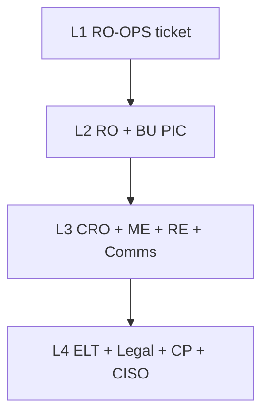

### 8.3 Limit types

| Type | Meaning | Example |
|------|---------|---------|
| Soft (WARN) | Early warning; no auto-block by default. You still ACK. | Perps open interest ≥ 80% of cap |
| Hard (BREACH) | Auto-action and/or a human *must* act. | User leverage above their bracket → reject the order |
| Kill | Immediate safety stop. Two people. | Matching kill switch; withdraw freeze |

Soft vs hard is a **policy choice** stored in the Limit Book, not a feeling on the day.

---

### 8.4 Spot indicators

| ID | Indicator | Freq | WARN | BREACH | Auto action | Human action | Escalate | Owner |
|----|-----------|------|------|--------|-------------|--------------|----------|-------|
| **SP-K01** | Bid–ask spread vs 30d median (top pair) | 1s tick / 1m agg | ≥ 3× median for 5m | ≥ 5× median for 2m **or** ≥ 10× any 30s | Widen MM alert; flag symbol | TO verify MM SLA; contact MM; consider band tighten | L1→L2 | Spot TO / MM |
| **SP-K02** | Book depth notional within ±2% of mid | 1s / 1m | < 50% of SLA depth for 5m | < 25% of SLA for 2m | Page MM bot | TO enforce MM; RO may recommend halt if disorderly | L2 | MM / Spot TO |
| **SP-K03** | Last vs index/ref mid deviation | 1s | ≥ 2% for 30s (*majors calib.*) | ≥ 5% for 15s **or** ≥ 10% instant | Price-band reject aggressive orders | TO+RO: halt candidate; CP if manip suspected | L2→L3 | Spot TO / RO |
| **SP-K04** | Cancel / fill ratio (UID or symbol) | 1m | > 50:1 sustained 10m | > 100:1 or API weight abuse | Rate-limit / reject cancels | TO throttle; CP surveillance case | L1→L2 | ME / CP |
| **SP-K05** | Fat-finger / max notional hit rate | Per order + 5m | > N rejects/UID/5m (*calib.*) | Single order ≥ hard notional cap | Reject order | TO review VIP exception; RO if repeated | L1 | ME / Spot TO |
| **SP-K06** | Spot trading halt count | Event + daily | ≥ 1 halt/day on majors | ≥ 3 halts/day **or** halt > 60m | — | Post-incident; RO root-cause; Comms | L2→L3 | Spot TO / RO |
| **SP-K07** | Deposit→trade→withdraw velocity (UID) | Per event / 5m | Unusual pattern vs peer | Travel-rule / AML rule hit | Hold withdraw | CP investigate; WO release only on clear | L2 | CP / WO |
| **SP-K08** | Self-trade / wash score | 1m / batch | Score ≥ WARN model cut | Score ≥ BREACH cut | STP block / flag | CP case; possible hard hold | L2 | CP |
| **SP-K09** | Matching latency p99 | 10s | > 2× SLO | > 5× SLO **or** drop rate > 0.1% | Shed non-critical traffic | ME/SRE mitigate; consider halt | L2→L3 | ME / SRE |
| **SP-K10** | Seed-tag / new listing 24h volatility | 1m | Daily range > policy A | Range > policy B **or** −50% from list | Tighten bands | LI+RO monitoring tag; delist path if fraud | L2 | LI / RO |

**Spot response cheat-sheet**

| Condition | First move | Escalate if |
|-----------|------------|-------------|
| Illiquid + wide spread | MM call + SLA ticket | Depth BREACH > 10m → RO halt opinion |
| Price dislocation vs ref | Band enforce | BREACH → SOP-G02 halt |
| Wash / spoof pattern | CP hold on UID | Multi-UID ring → L3 + Legal |

---

### 8.5 Margin indicators (Cross & Isolated)

| ID | Indicator | Freq | WARN | BREACH | Auto action | Human action | Escalate | Owner |
|----|-----------|------|------|--------|-------------|--------------|----------|-------|
| **MG-K01** | Asset borrow utilisation (borrow / inventory) | 1m | ≥ 80% | ≥ 95% | Raise borrow rate step; throttle new borrows | Freeze borrow (MG-03) if persistent; notify TS | L2 | RO-Credit / TS |
| **MG-K02** | User margin ratio / LTV vs maintenance | 1s | Within 10% of call line | Crosses liquidation line | Margin call → liquidation engine | TO monitor queue lag; pause only per RE-02 | L1→L2 | RE / TO |
| **MG-K03** | Platform liquidation notional (5m / 1h) | 1m | > 2× 30d 95th %ile (5m) | > 5× **or** engine lag > 30s | Slow other risk-increasing orders | RO: consider borrow freeze + spot band; RE capacity | L2→L3 | RO / RE |
| **MG-K04** | Bad debt / negative balance created | Event + daily | Any > $X (*calib.*) | Daily sum > $Y **or** single > $Z | Auto-repay attempt; isolate UID | MG-05 recovery; P&L booking; CRO if Tier A | L2→L3 | RO-Credit / TS |
| **MG-K05** | Collateral haircut gap vs realized vol | Hourly / daily | Vol regime up 1 tier vs haircut | Stress LTV breach in DA daily run | — | Propose haircut/LTV change (SOP-G01) | L2 | DA / RO-Credit |
| **MG-K06** | Cross-margin contagion score (acct) | 1m | High HHI + high LTV | Multiple legs near liq | Reduce-only on risk-increasing | TO force partial close if policy allows | L2 | RO-Credit |
| **MG-K07** | Interest accrual exceptions | Hourly | Mismatch count > 0 | Notional interest break > tol | Block curve change push | TS+ENG recon; halt interest updates | L2 | TS / ENG |
| **MG-K08** | Stablecoin collateral depeg (mark) | 1s | Peg < 0.995 for 5m | < 0.99 for 2m **or** < 0.98 instant | Haircut step-up; borrow freeze on asset | TS redemption playbook; RO stress | L2→L3 | TS / RO |
| **MG-K09** | VIP / wholesale borrow concentration | Daily | Top 10 > 40% of asset borrow | Top 10 > 60% **or** single > 25% | Cap new VIP borrow | RO credit review; reduce limits | L2 | RO-Credit |
| **MG-K10** | Liquidation slip vs bankruptcy price | Per liq + daily | Avg slip > buffer/2 | Slip consumes buffer → bad debt | — | Tune impact buffer; review MM during liq | L2 | RO / DA |

**Margin response cheat-sheet**

| Condition | First move | Escalate if |
|-----------|------------|-------------|
| Borrow util BREACH | Rate up + throttle | Still ≥ 95% in 30m → hard freeze |
| Liq cascade | Protect engine capacity | Lag > 30s → L3; consider spot halt on collateral |
| Depeg collateral | Haircut + freeze borrow | Peg < 0.98 → L3 + Treasury war room |

---

### 8.6 Perps indicators (USDⓈ-M / COIN-M)

| ID | Indicator | Freq | WARN | BREACH | Auto action | Human action | Escalate | Owner |
|----|-----------|------|------|--------|-------------|--------------|----------|-------|
| **PF-K01** | Mark − index deviation | 1s | ≥ 0.5% majors / ≥ 1.5% alts (*calib.*) | ≥ 1.5% majors / ≥ 3% alts sustained 30s **or** spike ≥ 5% | Prefer mark protection; reject manipulative fills per rules | PF-03 playbook; check constituents; reduce-only candidate | L2→L3 | RO / RE / DA |
| **PF-K02** | Index constituent stale / outlier | 1s | 1 venue stale > 5s | < min venues **or** 2+ stale | Drop bad venue from index | PF-08; RO approve temporary weights | L2 | DA / RE |
| **PF-K03** | Funding rate (abs) vs cap | Per interval + 1m pred | ≥ 75% of cap | Hit cap **or** predicted next ≥ cap | Clamp funding at cap | PF-04 review; extreme → pause funding (rare, dual) | L2 | PM-FUT / RO |
| **PF-K04** | Open interest vs OI cap | 1m | ≥ 80% cap | ≥ 100% (block increase) | Reject risk-increasing opens | Bracket/OI review; MM OI check | L2 | RO / TO-FUT |
| **PF-K05** | User / VIP position notional vs limit | Per order | ≥ 80% limit | ≥ 100% | Reject / reduce-only only | Rights workflow if increase requested | L1→L2 | RE / RO |
| **PF-K06** | Liquidation notional burst (1m / 5m) | 1s–1m | > 2× 30d 99th %ile | > 5× **or** liq queue lag > 15s | Slow opens; batch liqs per RE config | PF-07 reduce-only; insurance watch | L2→L3 | TO-FUT / RE |
| **PF-K07** | Insurance fund coverage ratio | 1m / event | < 120% of policy floor stress | < 100% floor **or** single payout > X% of fund | — | PF-05; prepare ADL; CRO inject decision | L3 | RO / TS |
| **PF-K08** | ADL events | Event | Any ADL | ≥ 3 ADL / hour **or** ADL on majors | Execute ADL queue | PF-06 review; Comms; CP if abuse | L3 | TO-FUT / RO |
| **PF-K09** | Basis (perp mid − spot mid) | 1m | Outside 30d 95% band | Extreme basis + thin depth | — | Check index; funding; possible reduce-only | L2 | DA / RO |
| **PF-K10** | Top-N long/short concentration | 5m / daily | Top 10 > 30% OI one side | Top 10 > 50% **or** single > 15% | Tighten UID limits | RO concentration action; CP if squeeze pattern | L2 | RO / CP |
| **PF-K11** | Leverage tier utilisation (users near max) | 5m | > 20% users in top bracket | > 40% **or** rising fast into stress | — | Consider bracket tighten (SOP-G01) | L2 | RO / PM-FUT |
| **PF-K12** | Insurance payout / bankruptcy count | Event + daily | Any bankruptcy fill | Payout sum daily > Y | Draw insurance | Accounting + RO challenge MM/liq quality | L2→L3 | RO / TS |

**Perps response cheat-sheet**

| Condition | First move | Escalate if |
|-----------|------------|-------------|
| Mark–index BREACH | Validate feeds; drop bad venue | Sustained + liqs firing → reduce-only / halt opens |
| Insurance < floor | Freeze discretionary risk-ups | ADL armed → L3 bridge |
| Funding at cap | Clamp; publish reason | Need pause → dual RO+PM + Comms |

---

### 8.7 Cross-cutting / platform indicators

| ID | Indicator | Freq | WARN | BREACH | Auto action | Human action | Escalate | Owner |
|----|-----------|------|------|--------|-------------|--------------|----------|-------|
| **PL-K01** | Hot-wallet buffer vs 24h withdraw p95 | 5m | < 150% of p95 | < 100% of p95 | Slow-mode withdraw | WA-01 top-up; WA-02 queue | L2→L3 | WO / TS |
| **PL-K02** | Withdraw backlog age (p95) | 1m | > 30m | > 2h **or** growing > 1h | — | Capacity / chain check; Comms if broad | L2 | WO |
| **PL-K03** | Deposit credit lag vs chain finality | 1m | > 2× expected | > 4× **or** silent fail | — | Chain/node incident; stop auto-credit if reorg risk | L2 | WO / SRE |
| **PL-K04** | Reorg depth detected | Event | Reorg ≥ 1 (non-final) | Reorg affects credited txs | Pause credit on chain | WA-03; possible debit/clawback SOP | L3 | WO / RO |
| **PL-K05** | EOD recon break notional | Daily + intraday | Any unmatched > tol | > materiality $ (*calib.*) | Block `SettlementReady` | SOP-G05 maker–checker | L2 | TO / TS |
| **PL-K06** | Risk feed / mark pipeline lag | 10s | Lag > 2s | Lag > 5s **or** gap | RE feed failover | ENG-03; pause liq if marks unsafe | L2→L3 | RE / ENG |
| **PL-K07** | Admin dual-control bypass / break-glass use | Event | Any use | Use without ticket | Auto-ticket + page | Security+CRO review same day | L3→L4 | Security / CRO |
| **PL-K08** | API key anomaly / privilege spike | 1m | Score WARN | Score BREACH / confirmed leak | Kill API key | ENG-04; user notify; CP if fraud | L3→L4 | Security |
| **PL-K09** | Desk / company VaR or DD vs limit | 1m / daily | ≥ 80% limit | ≥ 100% limit | Alert TR+RO; block size-ups if policy | Rights freeze; stress rerun | L2 | RO / TR |
| **PL-K10** | Stress test: post-shock margin shortfall | Daily + ad hoc | Shortfall in alt scenario | Shortfall in core scenario > appetite | — | Limit tighten proposal; board if persistent | L2→L3 | DA / RO |
| **PL-K11** | Surveillance open cases aging | Daily | Case > SLA | Case > 2× SLA with open exposure | — | CP escalate; hard hold if needed | L2 | CP |
| **PL-K12** | Listing pipeline diligence overdue | Daily | > SLA stage time | Live traffic without Risk/CP clear | Block go-live flag | LI stop; audit exception | L2→L3 | LI / RO |

---

### 8.8 Unified account / portfolio-margin indicators (if enabled)

| ID | Indicator | Freq | WARN | BREACH | Auto action | Human action | Escalate | Owner |
|----|-----------|------|------|--------|-------------|--------------|----------|-------|
| **PM-K01** | Portfolio margin vs SPAN/IM model gap | Hourly | Gap > 10% | Gap > 25% | Fall back to conservative mode | DA model incident; disable PM feature flag if needed | L3 | DA / RE |
| **PM-K02** | Cross-product hedge break (spot vs perp) | 1m | Hedge ratio drift WARN | Hedge broken into naked high leverage | Margin call | RO review correlations | L2 | RO / DA |

---

### 8.9 Monitoring frequency summary (by layer)

| Layer | Cadence | Typical indicators | Primary console |
|-------|---------|--------------------|-----------------|
| **At-trade / streaming** | Tick–1s | Marks, LTV, bands, kill switches | Risk Engine + Matching |
| **Near-real-time** | 1–5m | OI, depth, borrow util, liq bursts, wallet buffer | Risk Portal alerts |
| **Intraday ops** | 15–60m | Concentration, funding pred, backlog age | BU PIC dashboards |
| **Daily** | UTC cutoff | Bad debt, recon, stress, VaR/DD pack | `risk_reporting.py` / MI pack |
| **Weekly** | PIC review | KRI RAG, waiver expiry, listing pipeline | Risk committee pre-read |
| **Monthly / quarterly** | Governance | Threshold calib, model validation, DR/liq dry-run | CRO / Risk Committee |

### 8.10 Alert → action → escalation state machine

```
Detect (SYS) → Route (WARN|BREACH|KILL)
    → ACK (RO-OPS within SLA)
        → Data quality? → fix feed / no-action + note
        → Real risk?
            → Auto actions already fired? confirm effectiveness
            → Human playbook (instrument SOP)
            → Still open after TTE?
                → Escalate L+1 (ladder §8.2)
            → Contained → document + hypercare window
            → Sev-1/2 → war room (§9) + post-mortem
```

| Parameter | Default |
|-----------|---------|
| Time-to-escalate (TTE) WARN | 30–60 min without containment plan |
| TTE BREACH | 15 min without containment |
| TTE Kill / client-asset | 0 (immediate L3/L4) |
| Hypercare after BREACH | 24h enhanced monitoring |
| Post-mortem due | 5 business days (Sev-1/2) |

### 8.11 Reporting & evidence pack (per indicator family)

| Deliverable | Freq | Owner | Contents |
|-------------|------|-------|----------|
| Intraday alert journal | Continuous | RO-OPS | ACK times, false positives, actions |
| Daily risk MI pack | Daily | RO | RAG on SP/MG/PF/PL KRIs + open breaches |
| Liquidation & insurance flash | Event + daily | RO-Credit / Futures | Liq notional, bad debt, insurance, ADL |
| Wallet run-risk flash | Daily / stress | WO / TS | Buffer vs outflow, slow-mode events |
| Weekly PIC attestation | Weekly | Each BU PIC | KRIs reviewed; exceptions accepted |
| Quarterly threshold calib | Quarterly | DA + RO | Backtest hit rates; propose Limit Book edits |

### 8.12 Minimum “always on” set (if tooling is constrained)

Stand up these first — then expand to full catalogue:

**Phase 1 prefer (perps + access + platform):**  
1. **PF-K01** Mark−index · **PF-K07** Insurance · **PF-K06** Liq burst · **PF-K03** Funding (incl. **XAUUSD**)  
2. **ACC / access:** broker / institution / MM tag coverage; blocked public signup; Perp Account = perps-only; USD/USDT funding rail  
3. **PL-K01** Hot-wallet buffer · **PL-K06** Mark pipeline lag · **PL-K05** Recon · **SP-K09** Matching latency (shared engine)  

**`[Phase 2+]` dormant until enabled:**  
4. **MG-K01 / K04 / K08** · **SP-K03** (spot book) and other Spot/Margin KRIs  

---

## 9. Risk scenario diagnostics (RAG + time sequence)

Use this section when an indicator (or cluster) flips colour. **Never act on colour alone** — reconstruct the **time sequence**, then discriminate causes.

### 9.1 RAG colour map

| Colour | Maps to §8 | Meaning for diagnostics |
|--------|------------|-------------------------|
| **Green (G)** | Below WARN | Healthy *or* silent failure / not computed — confirm data freshness |
| **Amber (A)** | WARN | Elevated; investigate before it becomes BREACH |
| **Red (R)** | BREACH / Kill-adjacent | Contain first, then diagnose; assume real until proven data quality |

**Important:** Green is not always “safe”. A green mark feed that is **stale** (see PL-K06) can hide a red economic reality. Always check **last update timestamp** with colour.


**Figure — RAG is not the diagnosis**

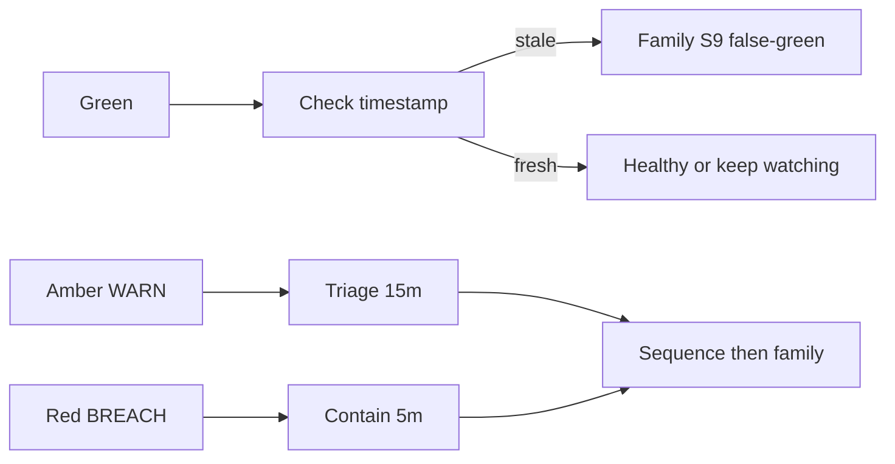

### 9.2 Diagnostic method (mandatory order)

```
1. CLOCK   — Build timeline (T0 first anomaly → Tn now). Note timezone UTC.
2. SCOPE   — 1 UID / 1 symbol / 1 asset / venue-wide / cross-product?
3. DATA    — Is the metric fresh? Formula version? Feed failover active?
4. SINGLE  — Plausible causes for the primary indicator colour (§9.3).
5. CLUSTER — Which other KRIs moved, and in what order? (§9.4–9.5)
6. RULE OUT — Eliminate causes inconsistent with sequence or green peers.
7. ACT     — Contain per §8 actions → escalate per §8.2 → war room if Sev-1/2.
8. WRITE   — Timeline + ruled-in/out causes in incident ticket.
```


**Figure — Diagnostic order (clock first)**

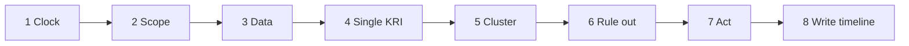

**Time-sequence grammar (use in tickets):**

| Pattern | Interpretation |
|---------|----------------|
| **A → B** | A likely causal precursor of B (seconds–minutes) |
| **A ≈ B** | Simultaneous / common driver (same second–minute bucket) |
| **A ↛ B** | A alone usually does *not* produce B; look for third factor |
| **A then quiet then B** | Two-phase incident (e.g. exploit deposit → later dump) |
| **Oscillating A/R** | Flip-flopping often = threshold noise, feed flap, or MM restart |

---

### 9.3 Single-indicator scenarios (all plausible causes)

For each key KRI: what **Green / Amber / Red** can mean. Lists are **exhaustive enough for ops triage**, not metaphysical.

#### 9.3.1 Spot — SP-K01 Bid–ask spread

| Colour | Plausible causes | Quick discriminators |
|--------|------------------|----------------------|
| **G** | Normal MM; tight regime; low vol | Depth SP-K02 also G; latency SP-K09 G |
| **G (false comfort)** | Mid calculation broken (both sides empty → NaN coerced); quoting on wrong tick size | Book empty but spread shows 0; trades failing |
| **A** | MM widened quotes; vol spike; inventory skew; one-sided flow; partial MM outage; competing venue dislocation pulling quotes | Check MM heartbeat; realized vol; SP-K02 depth |
| **R** | Full MM disconnect; disorderly market; fat-finger resting orders cleared; halt remnant; API rate-limit starving MM; intentional thin book pre-news | SP-K02 R? SP-K09 R? Recent halt SP-K06? |

**Typical sequences:** `vol spike → A spread → A depth` (market) · `MM process crash → R depth then R spread within seconds` (tech) · `spread R while depth G` (wide but thick — often policy widen, not outage).

#### 9.3.2 Spot — SP-K03 Last vs ref / index deviation

| Colour | Plausible causes | Quick discriminators |
|--------|------------------|----------------------|
| **G** | Price discovery aligned | Mark/index feeds fresh |
| **G (false)** | Ref feed stale and last follows stale ref; both wrong together | PL-K06 / external venue check |
| **A** | Transient imbalance; arb lag; bands absorbing; news micro-gap; thin alt | Recovers < 60s? Depth OK? |
| **R** | Oracle/ref bug; manipulated last prints; wrong symbol mapping; halt on ref venues only; fat-finger print; index constituent failure | Cross-check 3 external venues; SP-K08 wash; PF-K01 if perp listed |

**Sequences:** `external crash ≈ SP-K03 R` (real move) · `SP-K03 R while externals flat` (local book/manip/data) · `PL-K06 A → SP-K03 A` (feed lag artifact).

#### 9.3.3 Spot — SP-K09 Matching latency p99

| Colour | Plausible causes | Quick discriminators |
|--------|------------------|----------------------|
| **G** | Engine healthy | Drop rate ~0 |
| **A** | Load spike; GC; noisy neighbor; cancel storm start; partial shard hot | Cancel/fill SP-K04; CPU/network |
| **R** | Shard overload; network partition; bad deploy; infinite cancel loop; DDoS; clock skew | Failover status; recent ME-01 deploy; SP-K04 R |

**Sequences:** `SP-K04 A → SP-K09 A→R` (cancel storm) · `deploy → SP-K09 R alone` (bad release) · `SP-K09 R → SP-K03 A` (stale books / delayed matches).

#### 9.3.4 Margin — MG-K01 Borrow utilisation

| Colour | Plausible causes | Quick discriminators |
|--------|------------------|----------------------|
| **G** | Amply inventoried | Rates normal |
| **A** | Organic demand; short squeeze forming; inventory withdrawal by lenders; rate still sticky | VIP concentration MG-K09; funding/perp basis PF-K09 |
| **R** | Squeeze; bank-run on lendable asset; mis-set inventory denomiator; double-count bug; whale borrow | Freeze path; check inventory ledger vs wallet |

**Sequences:** `spot dump → collateral call → rush borrow stable → MG-K01 A/R` · `MG-K01 R with flat markets` (inventory/accounting bug or silent lender exit).

#### 9.3.5 Margin — MG-K02 / proximity to liquidation (user LTV)

| Colour | Plausible causes | Quick discriminators |
|--------|------------------|----------------------|
| **G** | Healthy cushion | — |
| **A** | Vol against position; interest accrual; haircut unchanged while vol rose (MG-K05); user added leverage | Position PnL vs borrow growth |
| **R** | Breach maintenance; liq engine should fire | If R but **no liq orders** → RE stuck (critical) |

**Sequences:** `price shock → MG-K02 R → MG-K03 liq notional ↑` (healthy engine) · `MG-K02 R ↛ MG-K03` for >15–30s (engine/pause/feed fail — escalate L3).

#### 9.3.6 Margin — MG-K04 Bad debt

| Colour | Plausible causes | Quick discriminators |
|--------|------------------|----------------------|
| **G** | No shortfall | Confirm ledger job ran |
| **A** | Small gap after liq slip; partial fill; dust | MG-K10 slip |
| **R** | Gap move through bankruptcy; engine lag; wrong mark; depeged collateral; ADL/insurance analogue missing on margin | MG-K08; PL-K06; insurance analogue |

**Sequences:** `MG-K08 R → MG-K02 R → MG-K03 → MG-K04` (depeg cascade) · `MG-K04 R with MG-K03 G` (accounting/recon bug or manual adjust).

#### 9.3.7 Margin — MG-K08 Stablecoin collateral depeg

| Colour | Plausible causes | Quick discriminators |
|--------|------------------|----------------------|
| **G** | Peg holds | Multi-venue peg |
| **A** | Soft depeg; liquidity thin; temporary venue dislocation | Redemption queue; TS inventory |
| **R** | Hard depeg; issuer freeze; exploit; oracle marks wrong stable | On-chain peg; bank/issuer status; PL-K06 |

**Sequences:** `external depeg ≈ MG-K08` (real) · `MG-K08 R → MG-K01 util ↑ (flight) → MG-K03 liqs` · `MG-K08 R while CEX+on-chain G` (local mark bug).

#### 9.3.8 Perps — PF-K01 Mark − index deviation

| Colour | Plausible causes | Quick discriminators |
|--------|------------------|----------------------|
| **G** | Mark tracks index | Constituents live |
| **G (false)** | Both mark and index stuck on same stale value | PL-K06 timestamp; external spot |
| **A** | Premium/discount building; funding pressure; thin perp vs spot; skew | PF-K03 funding; PF-K09 basis; depth |
| **R** | Index broken (venues down); mark formula bug; manip on last used in mark; circuit not engaged; wrong contract multiplier | PF-K02; external index rebuild |

**Sequences:** `PF-K02 A/R → PF-K01 R` (index integrity) · `PF-K01 R ≈ PF-K09 R with PF-K02 G` (real basis stress) · `PL-K06 R → PF-K01 flap` (pipeline).

#### 9.3.9 Perps — PF-K06 Liquidation burst

| Colour | Plausible causes | Quick discriminators |
|--------|------------------|----------------------|
| **G** | Quiet | — |
| **A** | Vol event; cascade starting; OI high leverage cohort | PF-K11; PF-K10 concentration |
| **R** | Cascade; wrong marks mass-liq; restart draining queue; attack on mark | PF-K01; insurance PF-K07; engine lag |

**Sequences:** `macro dump → PF-K01 A → PF-K06 A→R → PF-K07 A` (classic) · `PF-K06 R with flat underlying` (bad mark / bug — Sev-1 candidate) · `PF-K06 R → PF-K08 ADL` (insurance insufficient).

#### 9.3.10 Perps — PF-K07 Insurance coverage / PF-K08 ADL

| Colour | Plausible causes | Quick discriminators |
|--------|------------------|----------------------|
| **G** | Fund healthy | — |
| **A (K07)** | Large payouts; under-seeded listing; slow fee inject | PF-K12 payouts |
| **R (K07)** | Coverage < floor after bankruptcies | Prepare ADL |
| **A/R (K08)** | ADL fired / storm | Comms + CP abuse check |

**Sequences:** `PF-K06 R → PF-K12 payouts → PF-K07 A→R → PF-K08` (ordered stress) · `PF-K08 without prior PF-K07 A` (misconfig ADL trigger — investigate urgently).

#### 9.3.11 Perps — PF-K03 Funding vs cap

| Colour | Plausible causes | Quick discriminators |
|--------|------------------|----------------------|
| **G** | Balanced OI / premium | — |
| **A** | Persistent premium/discount; one-sided retail; arb constrained | PF-K09; withdraw/fiat rails |
| **R** | Hit clamp; extreme imbalance; formula error; wrong interest component | Predicted vs realized; code version |

**Sequences:** `basis PF-K09 A for hours → PF-K03 A→R` (organic) · `instant PF-K03 R at funding boundary only` (calc bug or clock).

#### 9.3.12 Platform — PL-K01 Hot-wallet buffer / PL-K02 withdraw backlog

| Colour | Plausible causes | Quick discriminators |
|--------|------------------|----------------------|
| **G** | Buffer OK; queue healthy | — |
| **A** | Outflow surge; cold→hot lag; chain fee spike slowing sends; listing unlock day | On-chain congestion; news |
| **R** | Run risk; hot drain; signer stuck; chain halt; attack draining hot | WA-02 slow-mode; Security if unexplained |

**Sequences:** `negative news → withdraw spike → PL-K01 A→R → PL-K02 A→R` (run) · `PL-K02 R with PL-K01 G` (signer/chain bottleneck, not balance) · `PL-K04 reorg → credit pause → perceived backlog`.

#### 9.3.13 Platform — PL-K06 Risk / mark pipeline lag

| Colour | Plausible causes | Quick discriminators |
|--------|------------------|----------------------|
| **G** | Fresh marks | Compare wall clock vs event time |
| **A** | Kafka/consumer lag; GC; dependency slow | Downstream KRIs flap |
| **R** | Pipeline down; poison message; bad deploy; clock jump | Failover; pause unsafe liqs |

**Sequences:** `PL-K06 R first → many KRIs A/R without external move` (data incident) · `external move then PL-K06 A` (backpressure from load — still dangerous).

#### 9.3.14 Platform — PL-K05 EOD recon break

| Colour | Plausible causes | Quick discriminators |
|--------|------------------|----------------------|
| **G** | Books match | Job completed flag |
| **A** | Timing cut-off; fee rounding; partial fills late | Re-pull broker |
| **R** | Missing trades; duplicate; wrong account map; venue outage mid-day; fraud | Materiality; maker–checker |

**Sequences:** `intraday ME incident → late PL-K05 R` · `PL-K05 R isolated` (reporting/ETL) vs with client PnL tickets (real breaks).

#### 9.3.15 When Green is the anomaly

Treat **unexpected Green** as a scenario:

| Observation | Plausible causes |
|-------------|------------------|
| Major market crash but PF-K01/SP-K03 stay G | Feeds frozen; alert rule disabled; wrong symbol scope; thresholds too loose |
| MG-K02 all G while MG-K03 liq notional spikes | Liquidating **wrong accounts** / test bleed / shared engine noise |
| PL-K01 G but users report stuck withdraws | Backlog is chain/signing (PL-K02) not balance; UI status bug |
| All KRIs G after Sev-1 | Dashboard pointed at staging; ACL showing cached snapshot |

---

### 9.4 Multi-indicator cluster scenarios (with time sequence)


**Figure — Same reds, different order: S1 vs S2**

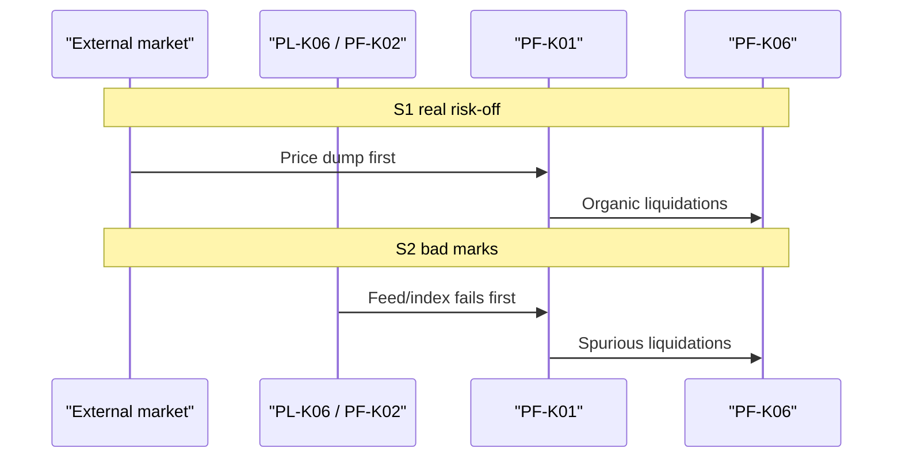

Legend: colours on the **cluster at diagnosis time**; arrows show **required order** to prefer that cause.

#### Scenario family S1 — Real macro / crypto risk-off

| Phase (UTC order) | Cluster | Preferred cause | Rule-outs |
|-------------------|---------|-----------------|-----------|
| T0 | External BTC/ETH dump (off-platform) | Macro | — |
| T0+0–30s | SP-K03 A/R · PF-K09 A · SP-K01 A | Price discovery stress | If externals flat → not S1 |
| T0+30s–5m | PF-K01 A · PF-K06 A→R · MG-K02 A→R · MG-K03 ↑ | Liquidations organic | — |
| T0+5–30m | PF-K07 A · MG-K01 A · PL-K01 A | Insurance & borrow & outflows | — |
| Optional | PF-K08 if insurance thin | ADL | |

**Also green that supports S1:** PL-K06 G (feeds fresh), PF-K02 G (index venues alive).  
**Escalation:** L2–L3 depending on insurance/ADL; Comms ready.

#### Scenario family S2 — Mark / index data integrity failure

| Phase | Cluster | Preferred cause | Rule-outs |
|-------|---------|-----------------|-----------|
| T0 | PL-K06 A/R **or** PF-K02 R | Feed/constituent fail | — |
| T0+seconds | PF-K01 R · possibly SP-K03 R **without** matching external move | Bad marks | If externals moved same → S1 |
| T0+1–5m | PF-K06 R (spurious liqs) · MG-K02 R | Engine trusting bad marks | — |
| Concurrent | SP-K09 may stay G | Not matching overload | Distinguishes from S4 |

**Actions:** Pause risk-increasing + pause liq if policy (RE-02); failover feeds; Sev-1 if mass wrong liqs.  
**Green peers:** External spot monitors G/flat; chain health G.

#### Scenario family S3 — Stablecoin depeg contagion

| Phase | Cluster | Preferred cause |
|-------|---------|-----------------|
| T0 | MG-K08 A→R · external peg break | Depeg |
| T0+1–10m | MG-K05 A · MG-K02 R on stable-collateral accounts · MG-K03 ↑ | Collateral shock |
| Parallel | MG-K01 R on other stables/fiat borrows · PF-K09 dislocations on stable pairs | Flight to quality / confusion |
| T0+10–60m | MG-K04 A/R · PL-K01 A · PF-K07 A if perps margined in stable | Bad debt + run + insurance |

**Rule-out:** MG-K08 R with on-chain+off-venue peg G → local oracle (treat as S2 subclass).

#### Scenario family S4 — Matching / infra overload or bad deploy

| Phase | Cluster | Preferred cause |
|-------|---------|-----------------|
| T0 | SP-K09 A→R · often after ME deploy or DDoS ticket | Infra |
| T0+ | SP-K04 A/R (cancel storm) · SP-K01/02 A (MM can't update) | Secondary market quality |
| Later | SP-K03 A · PF-K01 A if delayed updates | Stale trading |
| Usually green | PF-K02 · MG-K08 · PL-K06 may be G early | Distinguishes from S2 |

**Rule-out:** If PL-K06 R leads and SP-K09 G → prefer S2 not S4.

#### Scenario family S5 — MM withdrawal / liquidity hole (single name)

| Phase | Cluster | Preferred cause |
|-------|---------|-----------------|
| T0 | SP-K02 R · SP-K01 R on **one** symbol; others G | MM outage / SLA breach |
| Optional | SP-K03 A on that symbol only | Thin book impact |
| Green | Platform PL-* G · other symbols G · PF-* G if no perp | Localized |

**Vs manipulation (S7):** S5 often has MM heartbeat down; S7 has SP-K08 / CP scores rising with heartbeats up.

#### Scenario family S6 — Liquidation cascade with insurance stress (perps)

| Phase | Cluster | Preferred cause |
|-------|---------|-----------------|
| T0→T1 | PF-K11 A · PF-K10 A (crowded) then shock | Positioning fragility |
| T1 | PF-K01 A · PF-K06 R | Cascade |
| T2 | PF-K12 R · PF-K07 A→R | Fund drain |
| T3 | PF-K08 A/R | ADL |

**Time discipline:** If **PF-K08 before PF-K07 A**, suspect ADL misconfig (not “natural” S6).

#### Scenario family S7 — Market abuse / manipulation

| Phase | Cluster | Preferred cause |
|-------|---------|-----------------|
| T0 | SP-K08 A/R and/or CP alert · often SP-K04 odd patterns | Abuse |
| T0+ | SP-K03 R **localized** · PF-K01 may follow if mark uses last | Print paint / stop hunt |
| Optional | PF-K06 burst on victims · MG-K02 on leveraged victims | Forced flows |
| Green / mixed | SP-K09 often G · PL-K06 G | Not infra |

**Sequence clue:** Repeated **oscillating** SP-K03 A/R around a UID cluster with SP-K08 ↑.

#### Scenario family S8 — Withdrawal run / custody stress

| Phase | Cluster | Preferred cause |
|-------|---------|-----------------|
| T0 | Social/news or competitor failure | Trigger |
| T0+ | PL-K01 A→R · PL-K02 A→R | Outflow |
| Parallel | Spot sell pressure SP-K03 A · MG-K01 A · PF-K09 A | Market side-effects |
| Distinguisher | PL-K08 Security G vs R | Pure run vs compromise |

**If PL-K08 R leads:** treat as security incident (L4) not pure S8.

#### Scenario family S9 — Silent / false-green systemic

| Phase | Cluster | Preferred cause |
|-------|---------|-----------------|
| T0 | User tickets / external price move / support spike | Outside signal |
| T0 | **All primary KRIs G** | Dashboard wrong env; rules disabled; frozen consumers showing last-good |
| Confirm | PL-K06 timestamp ancient **or** alert manager muted | Data plane lie |

**Action:** Page ENG+RO; do not declare “all clear”.

#### Scenario family S10 — Listing / new-market failure

| Phase | Cluster | Preferred cause |
|-------|---------|-----------------|
| T0 | New symbol live | — |
| T0+minutes | SP-K10 R · SP-K01/02 R · SP-K03 R | Thin + volatile listing |
| Optional | MG eligibility too early → MG-K03/04 | Premature margin |
| Optional | Perp day-0 → PF-K01/06 noisy | Index immature (PF-K02) |

**Green elsewhere** supports isolation to the new market.

#### Scenario family S11 — Cross-product arb / basis blowout

| Phase | Cluster | Preferred cause |
|-------|---------|-----------------|
| T0 | PF-K09 R · PF-K03 A | Basis/funding stress |
| Parallel | SP depth OK (SP-K02 G) but perp thin **or** vice versa | One-leg liquidity hole |
| Optional | PL-K01/withdraw friction blocks arb | Rails / run |
| Optional | MG-K01 R if spot-leg financed on margin | Capital constraint |

**Vs S2:** PF-K02 G and PL-K06 G required to trust basis reading.

#### Scenario family S12 — Post-incident recovery (colours improving)

| Phase | Cluster | Meaning |
|-------|---------|---------|
| Tn | Was R, now A, peers still A | Recovering — keep hypercare |
| Tn | Primary G but PF-K07 still A | Price OK, **fund not rebuilt** — don't reset leverage yet |
| Tn | All G except PL-K05 A/R | Market OK, **books not clean** — block settlement |

---

### 9.5 Cluster lookup (symptoms → scenario family)

| You see (approx. order) | Consider first | Then check |
|-------------------------|----------------|------------|
| Externals dump → SP/PF price KRIs → liqs → insurance | **S1** | S6 if ADL |
| PL-K06/PF-K02 first → PF-K01 → spurious liqs | **S2** | Pause liq |
| MG-K08 first → margin liqs / bad debt | **S3** | Oracle vs real peg |
| SP-K09/deploy first → spreads/depth | **S4** | Rollback |
| Single-symbol depth/spread R; rest G | **S5** or **S7** | MM heartbeat vs SP-K08 |
| Crowding KRIs then liq then insurance then ADL | **S6** | ADL order sanity |
| SP-K08/CP first | **S7** | Holds |
| PL-K01/02 lead; security G | **S8** | Slow-mode |
| PL-K08 or key anomaly leads | **Security / L4** (not pure S8) | — |
| Everything G amid chaos | **S9** | Timestamps |
| New listing only | **S10** | Delist / tags |
| Basis/funding extremes; feeds G | **S11** | Rails / borrow |

---

### 9.6 Worked mini-examples (time-stamped)

#### Example A — Amber alone

`10:00:00Z SP-K01 A on ALT/USDT; SP-K02 G; SP-K09 G; PL-K06 G`

- Plausible: MM intentional widen; mild vol; one LP offline but others fill depth.  
- Not yet: full outage (depth still G), engine issue (latency G), feed lie (PL-K06 G).  
- Action: L1 watch 15m; if depth flips A/R → treat as S5.

#### Example B — Red cluster with sequence

```
14:00:00Z  External USDX peg 0.97 (off-site)
14:00:05Z  MG-K08 R
14:00:40Z  MG-K02 R (many UIDs) · MG-K03 A
14:05:00Z  MG-K04 A · MG-K01 R (USDC borrow)
14:10:00Z  PL-K01 A
```

- Diagnosis: **S3** real depeg contagion (not S2 — external peg confirms).  
- Actions: haircut/borrow freeze; liq capacity; Treasury; L3 bridge.

#### Example C — Same reds, different sequence → different cause

```
# Case C1
09:00:00Z  PL-K06 R
09:00:10Z  PF-K01 R · MG-K08 R (stable mark stuck)
09:01:00Z  PF-K06 R
→ Prefer S2 (data). Externals peg still 1.00.

# Case C2
09:00:00Z  External peg break
09:00:10Z  MG-K08 R · PF-K01 A
09:01:00Z  PF-K06 A · PL-K06 G
→ Prefer S3. Do not pause marks; do adjust haircuts.
```

#### Example D — Green + Red contradiction

`PF-K06 R (liq burst) + PF-K01 G + PL-K06 G + externals flat`

- Plausible: liq engine bug; wrong contract config; test traffic in prod; ADL/liq bot loop.  
- Unlikely: honest market cascade (needs price KRIs or externals).  
- Escalate **L3/Sev-1**; consider RE-02 pause.

---

### 9.7 RO-OPS triage card (print / pinned)

1. Screenshot RAG panel + **timestamps** (not only colours).  
2. Mark primary indicator + list all A/R within ±15m.  
3. Draw sequence arrows (T0…Tn).  
4. Pick family S1–S12 from §9.5; note ruled-out families.  
5. Execute §8 auto/human actions for primary + cluster.  
6. Escalation level from worst KRI + family (S2/S8-security/S9 → bias up).  
7. Paste timeline into ticket before handoff.

---

## 10. Incident severity & war room

| Sev | Definition | War room chair |
|-----|------------|----------------|
| Sev-1 | Client asset loss risk, engine integrity fail, widespread wrong marks | CRO or CTO |
| Sev-2 | Material bad debt, ADL storm, prolonged halt | BU PIC + RO |
| Sev-3 | Degraded feature, single-market issue | BU PIC |
| Sev-4 | Cosmetic / minor | On-call |


**Figure — War-room seating (Sev-1)**

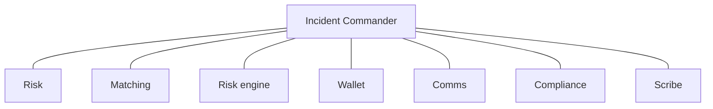

**Standing war-room roles:** Incident Commander · Risk · ME · RE · Wallet · Comms · CP · Scribe  

**Always capture:** timeline (§9 clock), configs touched, orders/liquidations during incident, ruled-in scenario family (S1–S12), client impact, permanent fix owner.

**Scenario → severity hints:** S2 spurious mass liqs · S8 with PL-K08 · S9 false-green in crisis → start at **Sev-1** until proven otherwise. S5 single-name MM → often Sev-3. S1 orderly risk-off with insurance G → Sev-2/3 ops mode.

---

## 11. Appendix — glossary & checklists

### 11.1 Glossary (short)

If a word is not here, search this page; many terms are defined in [If you are new to exchange risk](#if-you-are-new-to-exchange-risk).

| Term | Plain meaning |
|------|----------------|
| Mark price | The fair price we use for profit/loss and for “should we liquidate?” on perps. Not the same as last trade. |
| Index price | A blend of prices from several outside exchanges, used to build mark. |
| Funding | A periodic payment between longs and shorts so the perp does not drift away from the real price. |
| ADL | Auto-deleveraging: if insurance cannot pay a liquidation hole, we reduce winning opposite positions. |
| LTV | Loan-to-value — how big the loan is compared with the collateral (margin lending). |
| STP | Self-trade prevention — stop a customer (or bot) from trading with themselves to fake volume. |
| Insurance fund | A pool that pays when a forced close still leaves unpaid loss. |
| Reduce-only | An order that is allowed only if it makes the position smaller, never bigger. |
| Tier A+ | A change big enough that two people must approve (four-eyes). |
| RAG | Red / Amber / Green status of an indicator (§9). |
| Scenario family | A named pattern of several KRIs moving in a certain order, S1–S12 (§9.4). |
| Phase 1 | What is live now on V-Exchange: perpetual contracts (including XAUUSD); Perp Account (USD/USDT); matching / risk / clearing. Access = broker / institution / MM; 2C via broker. |
| Phase 2+ | Written here but **not** switched on (Spot, USD Margin, cross-ccy margin, portfolio margin, options, wealth, public 2C signup). |
| V-Exchange | Finprime venue (ADGM / Mauritius). Matching + clearing/settlement + risk. |
| Perp Account | The Phase 1 trading account. Only USD/USDT may be transferred in. |
| MT account / X-fund | Funding wallets. Users deposit here, then transfer USD/USDT into the Perp Account. |
| 2B / 2C | Business vs consumer access. 2C enters through a broker. 2B = broker, institution (API-only), MM. |
| Broker channel | Vantage sub-brands or external white-label / API brokers. Offline broker open. |
| KYC | Know-your-customer identity check before trading. |
| Collateral | Assets the customer posts so we can close them out if the bet goes wrong. |
| Liquidation | Forced close of a position when collateral is no longer enough. |
| Notional | Size of the position in money terms (price × quantity × contract multiplier). |
| Open interest (OI) | Sum of outstanding perp positions. A cap on OI limits how crowded a contract can get. |
| Basis | Difference between perp price and index/spot. Large basis can mean stress or a bad mark. |
| Haircut | A discount we apply to collateral because it might fall before we can sell it. |
| Hypercare | Extra monitoring window after a change. |
| Limit Book | The signed document with the real WARN/BREACH numbers. This handbook’s numbers are examples. |
| Four-eyes / maker–checker | Two different people; one proposes, one approves. |
| Break-glass | Emergency access that is time-limited and always ticketed. |
| War room | Live call with named seats (commander, risk, matching, engine, wallet, comms, compliance, scribe). |

### 11.2 BU PIC weekly checklist

- [ ] Review open WARNs/BREACHes and waivers nearing expiry (ACK SLA breaches noted)  
- [ ] Confirm admin ACL joiner/mover/leaver tickets closed  
- [ ] Instrument KRI RAG vs §8 catalogue (Spot SP-K*, Margin MG-K*, Perps PF-K*, Platform PL-K*)  
- [ ] Spot-check one amber using §9 single-indicator causes + sequence  
- [ ] Attest weekly PIC pack: false-positive rate + any threshold calib requests  
- [ ] Upcoming listings/delistings risk opinions scheduled  
- [ ] DR / failover or liquidation dry-run status (monthly at minimum)  
- [ ] Read-across: any Spot issue that should change Margin/Perps params  

### 11.3 Go-live checklist — Perps (summary) `[Phase 1]`

> Includes **XAUUSD** and other Phase 1 perps. Confirm ACC-01/02/04 (broker / institution / MM) and the USD/USDT Perp Account rail before publicising any cohort.

- [ ] Contract specs signed (PM + Legal)  
- [ ] Index constituents ≥ policy minimum; **PF-K01/PF-K02** alerts on  
- [ ] Leverage brackets & risk limits dual-approved; **PF-K04/PF-K05** wired  
- [ ] Insurance fund seed per policy; **PF-K07/PF-K08** dashboards live  
- [ ] Funding formula & caps tested; **PF-K03** clamp verified  
- [ ] Liquidation & ADL dry-run signed by RE + RO (**PF-K06**)  
- [ ] Matching symbol configured; rate limits set  
- [ ] Comms + support macros  
- [ ] Hypercare roster 72h  
- [ ] RO-OPS briefed on S2 vs S1 discrimination for this contract  

### 11.3a Go-live checklist — Phase 1 access (V-Exchange)

- [ ] Public 2C self-serve registration **disabled**
- [ ] Broker agreements (Vantage sub-brands + external WL/API) executed; tagging works (ACC-01)
- [ ] Institutional direct: offline open, API-only, dual-control keys (ACC-02)
- [ ] MM access tagged; SLA heartbeat live (ACC-04)
- [ ] Every trade-enabled UID has broker **or** institution **or** MM attribution
- [ ] Product entitlement = **Perp Account / perps only** (spot/margin/options/wealth flags off)
- [ ] Perp Account inbound transfers = **USD/USDT only** (MT account / X-fund)
- [ ] ACC-03 daily exception report subscribed by RO-OPS + CP

### 11.4 Go-live checklist — Margin asset `[Phase 2+]`

- [ ] Spot market stable ≥ observation window  
- [ ] Haircut/LTV stress-tested (DA); **MG-K05** baseline recorded  
- [ ] Borrow inventory & caps set; **MG-K01/MG-K09** alerts on  
- [ ] Interest curve approved; **MG-K07** recon green  
- [ ] Liquidation path tested on isolated + cross (**MG-K02/MG-K03**)  
- [ ] Bad-debt ledger mapping ready (**MG-K04**)  
- [ ] Depeg tabletop (S3) completed if stable / soft-peg collateral  

### 11.5 Go-live checklist — Spot `[Phase 2+]`

- [ ] Listing diligence complete (LI/RO/CP/Legal)  
- [ ] Wallet deposit/withdraw enabled on correct chain(s); **PL-K01** buffer OK  
- [ ] Tick/lot/bands/STP/fees configured; **SP-K03/SP-K05** live  
- [ ] MM SLA live or disclosure if thin book; **SP-K01/SP-K02** wired  
- [ ] Halt authority tested (**SP-K06**)  

### 11.6 Document control

| Item | Value |
|------|-------|
| Classification | Internal — Risk Restricted |
| Change control | CRO approve; publish via Risk portal |
| Related artefacts | Limit Book, Liquidation Policy, Insurance/ADL Policy, Listing Policy, BCP/DR, **§8 Indicator Catalogue**, **§9 Scenario Diagnostics**; Chinese edition via handbook tabs |
| Training | Mandatory for all BU PICs within 30 days of role start |
| Version | 2.4 — select-to-explain AI chatbot (handbook + Cursor V-Exchange decisions); both languages editable |

---

*End of English handbook. Simplified Chinese full translation follows.*

---
