# 加密货币交易所风险管理 — 业务单元（BU）用户手册

**读者：** 业务单元负责人（BU PIC）、风险官（RO）、产品、交易运维、工程、合规、资金、上币、托管  
**范围：** 全量目录含现货·杠杆·永续；**Phase 1 生产 = 仅永续（含 XAUUSD）+ 邀请/经纪商准入**  
**公开站点：** https://hxyan2020.github.io/PRD/risk-handbook/ · **全部 URL：** https://hxyan2020.github.io/PRD/risk-handbook/urls.html · **后台 URL：** https://hxyan2020.github.io/PRD/risk-handbook/admin/  
**版本：** 1.9 · **归属：** 首席风险官（第二道防线）· **审阅周期：** 每季度或重大事件后  

> 本手册是**操作说明书**：谁负责什么、工作怎么分、每道手续怎么做、用哪块屏幕、看哪些数字、出问题时先做什么。它**不能**代替法律政策、《限额手册》（已签字的真实数字）或监管申报。  
> **文中数字是教学示例。** 投产前必须从《限额手册》抄录现行值，并经两名风险官批准。

---

## 目录

0. [示意图](#visual-maps-zh)
0a. [零基础说明](#零基础说明)
1. [如何使用本手册](#1-如何使用本手册)
2. [三道防线与角色映射](#2-三道防线与角色映射)
3. [产品入门（现货 / 杠杆 / 永续）](#3-产品入门现货--杠杆--永续)
4. [分 BU 作战手册](#4-分-bu-作战手册)
5. [跨 BU RACI 矩阵](#5-跨-bu-raci-矩阵)
6. [全局 SOP（共用）与详细作业手册](#6-全局-sop共用与详细作业手册)
7. [管理后台与工具目录](#7-管理后台与工具目录)
8. [限额、KRI、阈值、动作与升级](#8-限额kri阈值动作与升级)
9. [风险情景诊断（红黄绿 + 时序）](#9-风险情景诊断红黄绿--时序)
10. [事件定级与战时指挥](#10-事件定级与战时指挥)
11. [附录 — 术语与检查清单](#11-附录--术语与检查清单)
12. [Phase 1 运营范围](#phase-1-运营范围全文标签说明)

---

## Phase 1 运营范围（全文标签说明）

> **Phase 1 为当前生产范围。** 后续阶段内容保留备战，一律标注 **`[Phase 2+]`**（或更晚）。未经正式阶段门禁（风险 **A** + 合规 + 产品）不得在生产开通 Phase 2+ 流程。

### Phase 1 — 范围内

| 领域 | Phase 1 规则 |
|------|----------------|
| **产品 / 合约** | **仅永续（Perps）。** 含 **XAUUSD 永续** 及其他已批准永续合约。Phase 1 **无现货交易簿、无杠杆借贷簿**。 |
| **开户** | **仅邀请制** 和/或 **经经纪商（Broker / IB）** 引入。无面向公众的自助开放注册。 |
| **交易准入** | 须完成邀请兑换 **或** 经纪商引入入驻，并通过风险/合规门禁后方可交易。 |
| **关键路径 BU** | 合约/永续产品与强平 · 撮合 · 风控引擎 · 风险运维 · 邀请/经纪商运营（合规+产品）· 钱包/结算（按需）· 监察 |


**图 — Phase 1 生产范围（开通 vs 仅标签）**

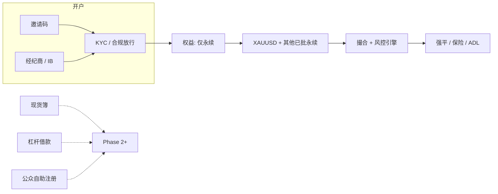

### Phase 1 — 生产未开（保留手册，仅贴标签）

| 领域 | 标签 | 说明 |
|------|------|------|
| 现货市场、现货上/下币投产 | **`[Phase 2+]`** | 保留 SP-*、LD-05、现货 KRI |
| 杠杆借款 / LTV / 利息 | **`[Phase 2+]`** | 保留 MG-* |
| 公众自助开户 | **`[Phase 2+]`** | Phase 1 = 邀请 + 经纪商 |
| 非永续产品（期权、理财等，如有） | **`[Phase 2+]`** | 除非另行门禁 |

### Phase 1 对操作的含义

1. **上币/上线：** 生产关键路径仅为 **永续**（含 **XAUUSD**）与邀请/经纪商权益配置。  
2. **准入：** 既非邀请兑换、亦非经纪商关联的账户不得开通交易。  
3. **KRI/SOP：** 现货/杠杆条目仍文档化 — 视为**休眠**，除非有 Phase 2+ 豁免；日报优先永续与准入类指标。  
4. **XAUUSD 永续：** 适用完整永续控制（标记/指数、资金费、杠杆档、保险/ADL），并关注贵金属时段/节假日流动性与间隙风险。

**用日常话说**

把交易所想成一家店：**今天只卖一种货**——**永续合约**（跟踪某个价格、没有到期日的合同）。黄金对美元（**XAUUSD**）是其中之一。客人不能直接从大街走进来，必须有**邀请码**，或由已签约的**经纪商**带来。做完身份核验（KYC，即“了解你的客户”）之后，也**只能交易永续**。现货买币、借钱加杠杆，手册里写着是为了以后能开，但开关现在是**关**的，除非走完正式阶段门禁。

如果工单在说现货或杠杆，先当成**以后的作业**，不是今天的生产控制——除非风险已经签了 Phase 2+ 豁免。

---

## 零基础说明

不要求你以前做过交易。你需要知道的是：**出了事该叫谁、哪一颗按钮会伤人**。本节把行话翻成人话。

### 这家公司在干什么

客户把**抵押品**（多为稳定币或加密资产）交给我们，开立**仓位**：看涨叫**做多**，看跌叫**做空**。因为可以用**杠杆**，价格小动就可能把抵押品亏光。这时系统会**强平**：强制平掉仓位，避免亏损传染给其他客户或公司。

一句话职责：**保住客户资产、让撮合诚实、别让错误价格或错误配置连环爆炸。**

### 每一页都会出现的词

| 你会看到的词 | 人话 | 为什么要管 |
|--------------|------|------------|
| **BU / PIC** | 业务单元 / 负责人 | 工单和后台权限都挂在这些名字上 |
| **SOP** | 标准作业程序，一份按编号执行的食谱 | 按顺序做；双人步骤不可因为“急”而跳过 |
| **KRI** | 关键风险指标，一只我们盯着的数字 | 绿=看着健康；黄 WARN=现在看；红 BREACH=现在动手 |
| **限额 Limit** | 系统或人必须遵守的上限 | 没有工单改限额，属于控制失效 |
| **Maker / Checker** | 两个人：一个提、一个批 | 重大变更禁止同一人兼任 |
| **RO / RO-OPS** | 风险官（定规则）/ 风险运维（7×24 值班） | 运维先确认告警；官做决定 |
| **ME** | 撮合引擎，配对买卖单的程序 | ME 错了，价格和强平都会错 |
| **RE** | 风控引擎，算保证金和强平的程序 | RE 错了，可能错杀健康用户或放过已破产仓 |
| **标记价 Mark** | 用于盈亏和“该不该强平”的公允价，不是最新成交 | 最新成交可能是薄单或操纵；标记更难被带偏 |
| **指数价 Index** | 多家外盘价格合成 | 指数陈旧或只剩一家坏源时，标记就不安全 |
| **资金费 Funding** | 多空之间定期付钱，让永续不要永远偏离真价 | 资金费极端时，行情看起来平静账户也会被压垮 |
| **保险基金** | 强平仍留下窟窿时用来填的钱池 | 不够时会走 **ADL**（从盈利对手仓上减仓） |
| **ADL** | 自动减仓 | 很罕见、很伤人。先确认保险真的不够 |
| **停牌 Halt** | 停止撮合新成交（永续还要决定强平是否继续） | 必须说清**范围**和**原因码** |
| **超护 Hypercare** | 变更后加盯（配置后常 24h，复牌后 4h，上线后 72h） | 没有超护责任人不要关单 |
| **Sev-1 / L4** | 最高事件 / 最高升级 | 客户资产或引擎完整性——开战时，不要一个人抠 |
| **SLA** | 必须在多少分钟内行动 | 确认超时会自动叫下一个人 |
| **RACI** | 执行 / 问责 / 咨询 / 知会 | **A** 能说“准”；**R** 负责去点 |

### 钱怎么走（简图）

1. **邀请或经纪商**让人开得了户。  
2. **KYC / 合规**确认此人可以交易。  
3. 抵押品进入**钱包 / 托管**。  
4. 下单；**撮合引擎**把两笔订单变成成交。  
5. **风控引擎**不停问：“价格若反向跳，抵押还够不够？”  
6. 不够就开始**强平**。窟窿先由保险、再由 ADL 补。  
7. 日终**对账**，核对账本、钱包、银行，避免把没有的钱打出去。

Phase 1 停在永续。生产上还没有“现货买完币再提出去”这条完整零售路径。

### 怎么读一份 SOP

每份 SOP 回答八个问题。哪一项是空的，**停下问风险运维**，不要自己编步骤。

1. **何时** — 什么事件启动（告警、时钟、有人申请）。  
2. **谁** — 谁输入、谁签字、必须告诉谁。  
3. **SLA** — 你有多少分钟。  
4. **前置** — 不满足就不要开做（应升级）。  
5. **如何做** — 编号步骤。双人步骤除书面“破窗”外，不得因紧急而省略。  
6. **系统** — 哪块屏幕或脚本。本手册里的 `/admin/...` 是**文档桩**（未来后台地图），不是正在跑的交易所。  
7. **完成** — 关单前要附什么证据。  
8. **升级** — 何时呼叫更高级别。

### 红黄绿灯习惯（RAG）

- **绿并不等于可以不理。** 先看**时间戳**。停更的绿灯是假绿（§9 情景族 **S9**）。  
- **黄 / WARN** = 有不对，你有的是分钟不是小时。先确认，再决定盯还是动。  
- **红 / BREACH** = 安全垫没了。先遏制，再写文章。  
- **Kill** = 停机。提现冻结、撮合总闸。永远两个人。

多灯变红时，**顺序很重要**。若**价格源先死**再爆强平，可能是按**错价**杀了人（族 **S2**）。若**外盘先崩**而我们的源仍健康，才是真下跌（族 **S1**）。§9 是侦探章。

### 入职第一周建议

1. 读本节、**Phase 1**、§2（角色）、§3.3（永续）、以及 §4 里你自己的 BU。  
2. 收藏告警台和值班表。  
3. 跟着 RO-OPS 把一笔告警从确认做到关闭。  
4. 练习一口气说停牌：**标的、原因、只停订单还是含强平、谁已经知道。**  
5. 在作为**旁观者**看过一次 G01 和一次 G04（双人）之前，不要自己改限额、切标记源或按 Kill。

---

## 1. 如何使用本手册

| 如果你是… | 优先阅读 |
|-----------|----------|
| 新任 BU PIC | §2–§4（本 BU）+ §7 工具 |
| 风险官 / 风险运维 | 全文；主责 §8 指标目录、§9 情景、§10 事件 |
| 产品（现货/杠杆/合约） | §3 + 对应产品 BU 章 + 上币 SOP |
| 工程 / SRE（撮合、风控引擎、钱包） | 对应技术 BU 章 + 容灾 SOP |
| 合规 / 监察 | 合规 BU + 市场操纵类 SOP |
| 上币 / 下币 PIC | 上币 BU 章全文 |
| Phase 1 负责人 / 上线组 | **Phase 1 运营范围** + [零基础说明](#零基础说明) + §3.3 永续 + §4.4 + 邀请/经纪商 SOP |

“§6.2”表示第 6 章的 SOP-G02（停牌）。**PF-K01** 这类是指标编号，可直接贴进工单。**SOP-G01** 这类是手续编号。不必背，用本页搜索即可。

**铁律**（为什么要有）

1. **禁止静默改限额** — 限额是安全帽（最高杠杆、最大仓、最大下单）。有人在后台改了却没有工单，事后无法还原是谁拆了栏杆。硬限额必须有工单、双人（A+ 级更多人）、审计记录。  
2. **职责分离** — 申请的人不能是批准的人。录入配置的人不能是唯一签字的人。这是为了防止疲惫或被盗的账号单独挪钱或加杠杆。  
3. **产品差异意识** — 现货、杠杆、永续是三台不同的机器。把现货价格带抄到永续、把永续强平抄到杠杆，会杀错人。工单必须标注 **SPOT / MARGIN / PERP**。  
4. **盘前 / 盘中 / 盘后** — 下单前（限额、KYC）、撮合中（价格带、STP、限频）、盘后（告警、对账、监察）。不能只靠一层。  
5. **客户资产优先** — 提现和托管的完整性，高于营收功能。  
6. **Phase 1 产品与准入门禁** — 生产交易 = **仅永续**（含 **XAUUSD**）；开户 = **邀请制或经纪商**。现货、杠杆、公众注册保持 **`[Phase 2+]`**。

---

## 2. 三道防线与角色映射

### 2.1 三道防线

银行和交易所共用一个简单想法：**开店的人不能既当裁判又给自己打分。**

| 防线 | 谁 | 人话 |
|------|-----|------|
| **第一道** | 产品 BU、交易运维、撮合、钱包、上币、做市 | 日常归你。你开控制、你盯、坏了你升级。不许说“风险会看见的”。 |
| **第二道** | 市场风险、信用/强平风险、模型风险、合规、法务 | 你写“能亏多少”、挑战第一道、跑独立监控。你不操作撮合引擎。 |
| **第三道** | 内部审计 | 事后问：设计有没有用、人有没有照做。你不批准现场改限额。 |

**升级：** 第一道在控制被突破时呼叫第二道；第二道在重大或 Sev-1 时呼叫 CRO / 风险委员会。审计按日历审两边，不只在火灾之后。

新任 PIC：除非头衔是风险官、合规、法务或审计，否则你是**第一道**。


**图 — 三道防线**

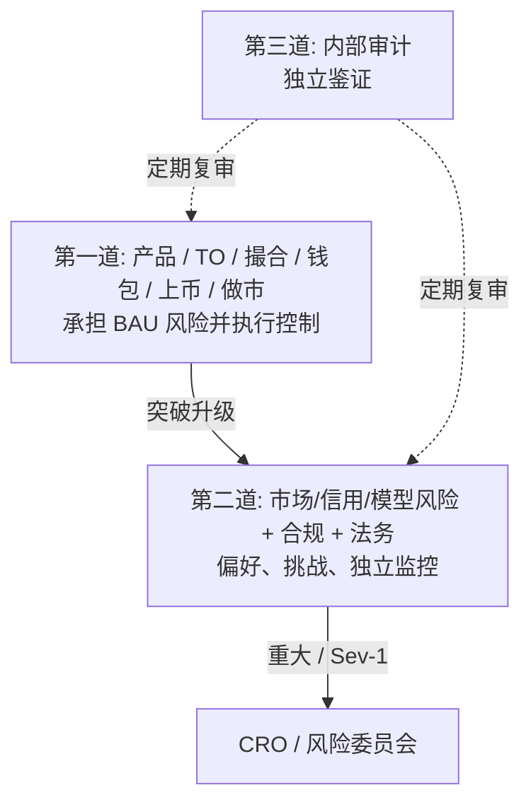

### 2.2 标准角色代码（工单与后台 ACL）

短代码是给凌晨三点值班的人看的：**现在需要哪一顶帽子**。不是头衔炫耀。

| 代码 | 角色 | 实际在做的事 |
|------|------|--------------|
| **CRO** | 首席风险官 | 大事最终可否；董事会材料 |
| **RO** | 风险官（第二道） | 批限额、停牌、标记方法；挑战产品 |
| **RO-OPS** | 风险运维（7×24） | 第一个确认告警的人；按食谱做；呼叫 RO |
| **PM** | 产品经理 | 产品规格和对客行为 |
| **TO** | 交易运维 | 出事时盯盘；提议停/复牌 |
| **ME** | 撮合引擎负责人 | 撮合程序及其总闸 |
| **RE** | 风控引擎负责人 | 保证金、标记、强平、配置晋级 |
| **WO** | 钱包 / 托管运维 | 密钥、充提、链上事件 |
| **LI** | 上币负责人 | 市场上线前的尽调包 |
| **CP** | 合规 / 监察 | KYC、制裁、滥用、冻结 |
| **TS** | 资金 / 结算 | 账对平之后的银行/链上打款 |
| **MM** | 做市 / 流动性运维 | 让订单簿两边都有人报价的协议 |
| **ENG** | 工程值班 | 代码、配置管道、权限 |
| **SRE** | 站点可靠性 | 可用性、容灾、时延 |
| **DA** | 数据 / 量化 / 模型 | 指数数学、压力冲击、模型风险 |
| **TR** | 内部交易 / VIP 台（如有） | 可以*申请*加杠杆；永远不能批自己的 |

---

## 3. 产品入门（现货 / 杠杆 / 永续）

配置限额、写 SOP、选后台时用本节。只记一句：**Phase 1 生产是永续。现货和杠杆章节是预习，直到阶段门禁通过。**

### 3.1 现货 Spot `[Phase 2+]`

> **Phase 1 未启用。** 手册保留；不要打开产品。

**人话：** 现货就是“现金市场”。客户付全款拿到资产（或卖掉已有资产）。没有借款，也没有强平引擎。若 BTC/USDT 最新价 60,000，买 1 个 BTC 大约花 60,000 USDT 加手续费。就这笔交易本身，客户亏不完超过已付款（充提差错和欺诈另说）。

**风险仍要管：** 有人可以挂假盘、fat-finger 下巨单、上垃圾币、或从充提偷。

| 主题 | 风险含义 |
|------|----------|
| **是什么** | 标的/计价即时买卖；产品本身无杠杆 |
| **主要风险** | 操纵、fat-finger、上币质量、钱包结算、法币通道 |
| **关键控制** | 价格带（挡住离谱价）、最大下单、自成交防护（STP）、停牌、充提闸门 |
| **无强平引擎** | 客户亏损原则上以已付金额为限（充提差错除外） |
| **后台重点** | 交易对配置、费率档、STP、停复牌、行情元数据 |

### 3.2 杠杆 Margin（全仓与逐仓） `[Phase 2+]`

> **Phase 1 未启用。** 永续里说的“保证金”是另一回事（衍生品抵押）。工单里不要混用。

**人话：** 杠杆借贷是“我向平台借 USDT 去买更多资产，并付利息”。资产跌了，贷款可能超过抵押，于是**强制卖出**。**逐仓**只连坐那一个仓位；**全仓**会吃掉整个账户的抵押——亏损可能在同一账户里从一种币跳到另一种。

| 主题 | 风险含义 |
|------|----------|
| **是什么** | 借入资金放大现货敞口；借款计息 |
| **逐仓 Isolated** | 保证金与强平限于单一仓位/交易对 |
| **全仓 Cross** | 抵押品在账户内共享；账户内传染 |
| **主要风险** | 借款违约、强平缺口、利率配错、折扣不足 |
| **关键控制** | LTV/保证金率、分资产借款上限、利率曲线、强平瀑布、负余额自动还款 |
| **后台重点** | 抵押品档位、借款白名单、LTV 档、利率、强制平仓台 |

### 3.3 永续合约 Perps（U 本位 / 币本位） `[Phase 1]`

> **Phase 1 范围内：** 已批准永续，含 **XAUUSD 永续** 及其他永续；现货/杠杆关闭。

**人话：** 永续（perp）是跟踪标的价格（BTC、ETH、黄金兑美元……）且**永不到期**的合约。客户交抵押，可杠杆做多或做空。每隔若干小时，多空之间结算**资金费**，避免合约永远偏离真实世界价格。

**两种价格千万别混**

- **最新价** — 我们簿上刚撮合的那一笔。适合回答“刚才成交了什么”。单独拿来强平很危险：一笔薄单就能把它带走。  
- **标记价** — 用来算未实现盈亏和“你破产了没有”。通常来自**指数**（多家外盘）再加基差封顶。标记错了就会杀错人。这是情景族 **S2**。

**U 本位 vs 币本位：** 前者用稳定币（或类美元）结算；后者用标的币结算。Phase 1 值班也要知道本合同是哪一种，因为保险和盈亏单位不同。

**为什么 XAUUSD 要额外盯：** 金银/外汇会休息，加密指数可能 24×7。周末缺口和节假日流动性会让标记和最新价吵起来。关注开盘。

| 主题 | 风险含义 |
|------|----------|
| **是什么** | 无到期杠杆衍生品；资金费率在多空间交换 |
| **标记价 vs 最新价** | 标记价驱动未实现盈亏与强平；最新价用于撮合成交 |
| **主要风险** | 杠杆连环强平、保险基金耗尽、标记/指数操纵、极端资金费、ADL |
| **关键控制** | 分档杠杆、持仓名义上限、多交易所指数、资金费封顶、保险基金、ADL 队列 |
| **后台重点** | 杠杆档、风险限额、资金费公式、保险基金看板、ADL、熔断 |
| **Phase 1 示例** | **XAUUSD** 永续及其他已批准永续标的 |
| **Phase 1 额外关注** | 贵金属/外汇时段间隙、周末节假日流动性 vs 加密 24×7 指数交易时段 |


**图 — 永续控制链（Phase 1 主路径）**

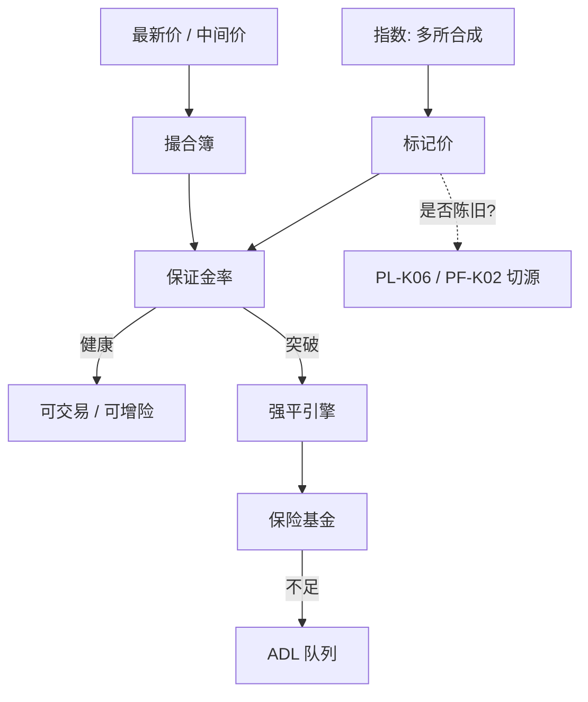

### 3.4 产品对比（运维速查）

| 维度 | 现货 | 杠杆 | 永续 |
|------|------|------|------|
| 杠杆 | 1× | 可配（如最高 5–10×） | 分档（如按 VIP/名义最高 20–125×） |
| 强平 | 无 | 追加保证金 → 强制卖出 | 保证金率 → 强制平仓 → ADL |
| 保险 | 无 / 平台运营 | 部分（借款损失） | 保险基金 + ADL |
| 指数关键性 | 低–中 | 中 | **极高** |
| 资金成本 | 无 | 借款利息 | 周期性资金费率 |
| 停牌影响 | 订单簿冻结 | 借款+强平可按 SOP 继续 | 强平/资金费可按 SOP 继续 |
| 典型 KRI | 撤单/成交比、停牌次数 | 借款占用、强平量、坏账 | 保险余额、ADL、基差、标记–指数偏离 |
| **阶段标签** | **`[Phase 2+]`** | **`[Phase 2+]`** | **`[Phase 1]`**（含 XAUUSD） |


**图 — 产品 vs Phase 1 门禁**

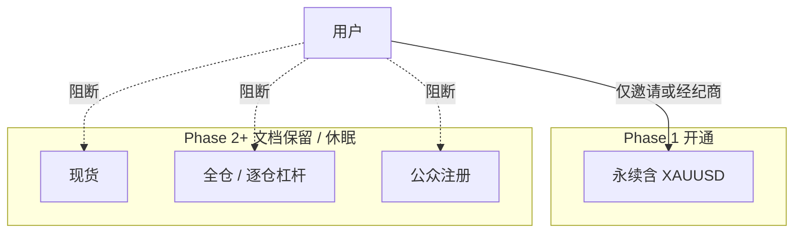

---

## 4. 分 BU 作战手册


**图 — Phase 1 关键路径 BU**

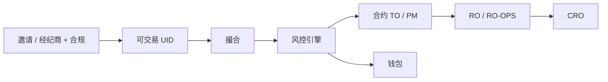

各章统一模板：**范围内/外 → 分工 → SOP → 工具 → 管理后台 → 交接**。

### 4.1 市场风险与风险运维（第二道）— RO / RO-OPS / CRO

**范围内：** 全公司风险偏好与限额手册（现货/杠杆/永续）；实时监控；强平/保险/ADL 监督；压力测试目录审批；新产品风险会签；上币风险意见；突破调查、豁免治理、日报。  

**范围外：** 撮合日常调优（ME）；热钱包签名作业（WO）；KYC 准入决定（CP）— 风险冻结除外。

| 角色 | 负责 |
|------|------|
| CRO | 偏好、董事会材料、重大豁免 |
| RO（市场） | 永续/现货市场风险限额、压力情景目录 |
| RO（信用/强平） | 杠杆 LTV、借款上限、强平参数、保险基金政策 |
| RO-OPS | 7×24 告警确认、初判、Sev-1/2 升级 |
| DA | 模型、标记/指数方法论挑战、压力引擎 |

**SOP：** RM-01…RM-07（明细见 **§6.7**）— 每日风险包 · WARN/BREACH · 杠杆权限 · 压力目录 · 保险复核 · 停牌建议  

**工具：** 实时风险指标与告警；压力/情景台；风险报告与 CSV；强平与保险看板；交易员权限/杠杆申请（maker–checker）  

**后台：** `/admin/risk/limits` · `alerts` · `stress` · `insurance` · `reports` · `waivers`  

### 4.2 现货产品与交易运维 — PM-SPOT / TO `[Phase 2+]`

> Phase 1：休眠。勿开放现货交易对。

**范围内：** 现货交易对生命周期（上币后配置）；费率、订单类型、STP、价格保护带；停复牌执行；市场质量 KRI；风险披露文案（会同法务）。  
**范围外：** 杠杆 LTV/利息（杠杆 BU）；永续资金费/保险（合约 BU）；链上托管密钥（钱包）。

**SOP：** SP-01 上线清单 · SP-02 停牌 · SP-03 复牌 · SP-04 价格带/名义上限变更 · SP-05 对倒/自成交移交  

**后台：** `/admin/spot/symbols` · `bands` · `halt` · `fees` · `stp`

### 4.3 杠杆产品与信用运维 — PM-MARGIN / RO-CREDIT / TO `[Phase 2+]`

> Phase 1：无杠杆借贷簿。

**范围内：** 全仓/逐仓规则；抵押品白名单、折扣、LTV；借款上限与利率曲线；追加保证金/强平参数；坏账处置；抵押品暴跌+借币挤兑压力。  

**SOP：** MG-01 新增抵押品 · MG-02 折扣/LTV 变更 · MG-03 借款冻结 · MG-04 强制平仓手册 · MG-05 坏账核销/追偿 · MG-06 利率曲线更新  

**后台：** `/admin/margin/collateral` · `ltv` · `borrow` · `interest` · `liquidation` · `bad-debt`

### 4.4 合约 / 永续产品与强平运维 — PM-FUT / RO / TO-FUT `[Phase 1 — 主路径]`

> Phase 1 关键路径：**XAUUSD 永续** + 其他已批永续；仅邀请/经纪商客户。

**人话：** 这是你们**今天真正在跑的产品**。标记价、杠杆、资金费、保险、ADL 出问题，先看本章和风控引擎（§4.6）。即使你不是“合约岗”也请读。

**范围内：** U/币本位永续（及定期合约）；杠杆档与持仓限额；标记价/指数成分与偏离告警；资金费公式与结算；保险基金与 ADL；熔断、冲击缓冲、只减仓。  

**SOP：** PF-01 新合约上线 · PF-02 杠杆档变更 · PF-03 标记–指数偏离响应 · PF-04 极端资金费/暂停 · PF-05 保险赔付复核 · PF-06 ADL 启动复核 · PF-07 停牌/只减仓 · PF-08 指数成分交易所故障  

**后台：** `/admin/futures/contracts` · `leverage` · `risk-limits` · `mark-index` · `funding` · `insurance` · `adl` · `breaker`

### 4.5 撮合引擎与交易核心 — ME / SRE / ENG

**范围内：** 撮合正确性、时延 SLO、公平性；容灾双活一致性；Kill switch、断线撤单、STP；容量（撤单风暴、强平洪峰）；分片与限频。  

**SOP：** ME-01 发布/回滚 · ME-02 撮合停机 · ME-03 双活切换 · ME-04 撤单风暴抑制 · ME-05 故障后订单簿校验  

**后台：** `/admin/engine/status` · `kill` · `rate-limits` · `stp` · `failover`

### 4.6 风控引擎、清算与强平系统 — RE / DA

**范围内：** 保证金率、破产价、强平引擎；盘中限额执行；已批准配置推送生产；风险状态与撮合/钱包对账；统一账户/组合保证金（如已上线）。  

**SOP：** RE-01 配置晋级 · RE-02 强平引擎暂停/恢复 · RE-03 标记价源切换 · RE-04 风险状态重建 · RE-05 组合保证金模型变更  

**后台：** `/admin/risk-engine/configs` · `liq` · `feeds` · `sim`  
**仓内模块：** `risk_metrics_monitor.py` · `stress_testing.py` · `trader_rights_workflow.py`

### 4.7 钱包、托管与提现 — WO / TS / SRE

**范围内：** 热/温/冷/MPC 密钥作业；充值归属、旅行规则、提现筛查挂钩；终局性与重组、错链处理；提现流动性缓冲（挤兑风险）；储备证明支持。  

**SOP：** WA-01 热钱包补款 · WA-02 提现排队/慢速模式 · WA-03 链停/重组 · WA-04 错充找回 · WA-05 密钥仪式/轮换 · WA-06 PoR 快照  

**后台：** `/admin/wallet/balances` · `withdraw` · `deposit` · `keys` · `chains`

### 4.8 上币、下币与代币尽调 — LI / RO / CP / Legal

> **Phase 1 上币焦点：** 仅永续（如 **XAUUSD** 及其他已批永续）。现货上/下币 = **`[Phase 2+]`**；杠杆资格 LD-03 = **`[Phase 2+]`**。

**范围内：** 新现货对、杠杆资格、永续合约；合约风险（增发、可升级、暂停、黑名单）；流动性与解锁；种子/监控标签；跨产品下币；更名/迁移/代码冲突。  

**SOP：** LD-01 上币风险意见 · LD-02 种子/监控标签 · LD-03 杠杆资格 · LD-04 永续上线决定 · LD-05/06/07 现货/杠杆/永续下币序列 · LD-08 紧急下币/停牌  

**强制下币顺序：** 风险+法务+合规批准 → **永续**只减仓→平仓/到期→下线 → **杠杆**冻借款→强平还款→移出抵押 → **现货**必要时停牌→关闭交易→提现按 WA SOP → 对外沟通与客服话术。

### 4.9 合规、监察与市场滥用 — CP

**范围内：** KYC/AML、制裁、旅行规则；**Phase 1 准入：** 邀请码兑换控制、**经纪商/IB** 引入账户、阻断公众自助注册；监察（幌骗、分层、对倒、内幕）；跨产品调查；监管报送；硬冻结。  

**SOP：** CP-01 告警分流 · CP-02 账户硬冻结 · CP-03 跨产品滥用复核 · CP-04 监管协查/冻结  

**后台：** `/admin/compliance/surveillance` · `holds` · `kyb-kyc` · `sanctions`

### 4.10–4.12 资金结算、做市、平台工程

- **TS：** 法币通道、银行集中度、日终结算、保险/SAFU 现金管理、稳定币库存与兑付。SOP：TS-01~04。后台：`/admin/treasury/*`  
- **MM：** 做市 SLA、库存与逆向选择、信息隔离。SOP：MM-01~03。后台：`/admin/mm/*`  
- **ENG/SRE/安全/DA：** 安全开发生命周期、审计日志、风险数据管道、漏洞赏金。SOP：ENG-01~04  

---

## 5. 跨 BU RACI 矩阵

**怎么读这张表（不需要背景）**

- **R 执行** — 动手的人（点按钮、开工单）。  
- **A 问责** — 对结果负责的那一个座位。出事时复盘找这个名字。一行里尽量只有一个 **A**。  
- **C 咨询** — 行动*之前*必须问（双向）。  
- **I 知会** — 行动*之后*告诉一声（单向）。  

例子：改**永续杠杆档**时，合约产品是 **R**（起草新档），风控引擎是 **R**（推配置），风险是 **A**（说准），若影响零售则合规是 **C**。

**R** = 执行 · **A** = 问责 · **C** = 咨询 · **I** = 知会

**R** 执行 · **A** 问责 · **C** 咨询 · **I** 知会  

| 活动 | 现货 | 杠杆 | 合约 | ME | RE | 钱包 | 上币 | 风险 | 合规 | 资金 |
|------|------|------|------|----|----|------|------|------|------|------|
| 现货停复牌 | **R** | I | I | **R** | C | C | I | **A** | C | I |
| 杠杆 LTV 变更 | I | **R** | C | I | **R** | I | C | **A** | C | I |
| 永续杠杆档 | I | C | **R** | I | **R** | I | C | **A** | C | I |
| 新上币上线 | C | C | C | C | C | C | **R** | **A** | **R** | I |
| 多产品下币 | **R** | **R** | **R** | C | C | **R** | **A** | **A** | **R** | C |
| 保险赔付 | I | C | **R** | I | C | I | I | **A** | I | **R** |
| ADL 事件 | I | I | **R** | I | **R** | I | I | **A** | I | I |
| 提现慢速模式 | I | I | I | I | I | **R** | I | **A** | C | **R** |
| 标记/指数变更 | I | C | **R** | I | **R** | I | C | **A** | C | I |
| 监察硬冻结 | C | C | C | I | C | C | I | C | **A/R** | I |
| 日终对账 | C | C | C | C | C | C | I | C | I | **A**+运维 **R** |
| 压力目录 | C | C | C | I | C | I | C | **A** | I | I |
| 交易员权限/加杠杆 | C | C | C | I | **R** | I | I | **A** | **C** | I |

---

## 6. 全局 SOP（共用）与详细作业手册

每张 SOP 卡片字段统一：**何时触发** · **谁** · **SLA** · **前置条件** · **如何做** · **系统** · **完成标准** · **升级条件**。角色代码见§2.2。

### 6.0 字段说明

| 字段 | 含义 |
|------|------|
| **何时** | 启动本 SOP 的事件/日程/阈值 |
| **谁** | R 执行 · A 问责签字 · C 咨询 · I 知会 |
| **SLA** | 首次动作 / 遏制 / 关闭时限 |
| **前置** | 不满足则停止并升级 |
| **如何做** | 有序步骤；双控步骤不可跳过 |
| **系统** | 后台 / 工具 |
| **完成** | 退出标准 + 须附件 |
| **升级** | 抬升 L / Sev 的条件 |

---

### SOP-G01 — 限额变更（全产品）


**图 — SOP-G01 限额变更**

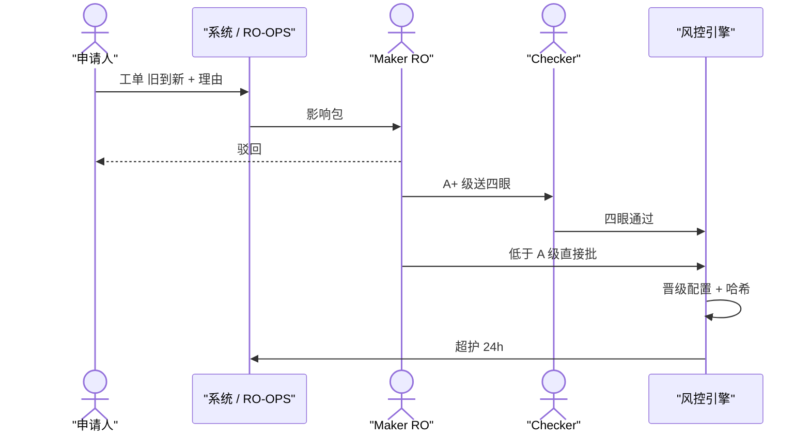

| 字段 | 明细 |
|------|------|
| **何时** | 软/硬限额、杠杆档、价格带、OI、LTV/折扣、借款上限、VIP 乘数等拟变更（定期校准或事中响应） |
| **谁** | **R** 申请人（PM/TO/RO/DA）· **A Maker** RO · **A+ Checker** RO2/CRO · **R 部署** RE · **C** ME、产品、零售影响时 CP · **I** RO-OPS；对客可见时传播 |
| **SLA** | 非紧急 ≤2 个工作日决策；紧急（进行中 BREACH）Maker ≤30 分、Checker ≤30 分；部署后超护 24h |
| **前置** | 标注 SPOT/MARGIN/PERP；旧→新数值；附压力影响（或 CRO 豁免）；同键无冲突在途 G01 |
| **系统** | 工单 · `/admin/risk/limits` · `waivers` · `/admin/risk-engine/configs` · `stress_testing.py` |

**这份 SOP 干什么：** 凡是会改“风险上限”的数字——最高杠杆、仓位、持仓上限、价格带、LTV、借款上限、VIP 乘数。“校准”是计划内微调；“临时”是风暴里改。

**如何做（不要跳；每步写了为什么）**
1. **申请人开工单。** 写产品标签（**PERP / SPOT / MARGIN**）、标的、字段名、**旧数字→新数字**、理由、关联哪条 KRI/事件、压力截图。若 CRO 豁免压力测试，用文字写明。*为什么：* 凌晨三点的下一个人不该靠猜。  
2. **系统 / RO-OPS 附影响包。** 现在离新上限有多近？30 天内有没有突破？会不会溅到别的产品？*为什么：* 批准一个已经快被吃完的更松上限，是连环爆的典型入口。  
3. **Maker（RO）决定：** 驳 / 批 / 附条件批（到期日、标的名单）。即使批准也要留评论。*为什么：* 沉默不是审计轨迹。  
4. **若是 A+ 级**（大名义、最高杠杆、保险相关或政策表），必须由**另一个人** Checker 再批。同一登录会被系统拒。*为什么：* 一个被盗或匆忙的账号不能单独拆栏杆。  
5. **RE 把配置从预发晋级到生产**，并把**配置版本哈希**贴回工单。*为什么：* 事后能证明引擎当时跑的是哪一版。  
6. **ME / 产品 ACK** 若变更对着交易（价格带、标的开关）。*为什么：* 风险不能给撮合惊喜。  
7. **RO-OPS 开 24h 超护**，把这条限额本该保护的 KRI 放进观察名单。*为什么：* 校准失败通常表现为 WARN 爆发，而不是一封礼貌邮件。  
8. **哈希 + ACK + 超护责任人都在工单上才能关。**

**完成：** 批准记录在案；生产哈希与工单一致；超护期内无归因于本次变更的异常突破。  
**升级：** 紧急缺 Checker→CRO 或指定代理人；部署失败→RE 回滚+L2；客诉飙升→传播+L3。  
**若跳过步骤：** 典型失败是“配置已上、工单是空的、没人盯”。按事件处理，不要当成缺纸。

### SOP-G02 — 停牌 / 复牌（现货 vs 永续/杠杆）


**图 — SOP-G02 停牌后复牌**

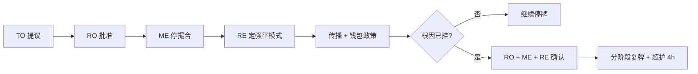

| 字段 | 明细 |
|------|------|
| **何时** | 失序、预言机/指数故障、fat-finger 传染、监管令、完整性 Sev-1、连环强平等 |
| **谁** | **提议 R** TO / TO-FUT / 杠杆 TO · **批准 A** RO · **执行 R** ME + RE（强平模式）· **C** CP/WO/传播 · **复牌 A** RO+ME（永续另需 RE 标记健康） |
| **SLA** | Sev-1/2：提议→批准 ≤5 分；批准后执行 ≤2 分；传播初稿 ≤10 分 |
| **前置** | 原因码+范围；永续须明确**仅停订单 vs 是否含强平** |

**这份 SOP 干什么：** 市场已经不适合继续撮合——簿乱、指数坏、fat-finger 传染、监管令、或强平连环。停牌不是惩罚，是暂停，免得继续打印伤害。

**停牌如何做（桥上先说这些话）**
1. 值班 **TO** 建语音/聊天桥。前 30 秒说清：**范围**（单标的 / 板块 / 全局）、**原因码**、你猜的 **§9 情景族**（S1 真跌 vs S2 错标记…）。*为什么：* 别人若以为全站挂了，其实只是 XAUUSD，就帮不上忙。  
2. **RO** 批准（全局则 CRO）。批在工单上，不要只在聊天里。  
3. **ME** 按范围执行停/Kill，并*确认效果*：现货=不再成交；永续=不再接受增险订单（按设计）。贴截图或引擎标志。  
4. **RE（永续/杠杆）：** 决定**只停订单还是连强平一起停**。在腐烂的标记上继续强平等于抢用户的钱。按 RE-02。对传播说真话。  
5. **杠杆 TO：** 若涉及抵押，考虑 **MG-03** 冻借款。Phase 1 通常不适用。  
6. **钱包：** 默认**保持提现**。只有 CP/RO 下令才冻（客户资产或犯罪）。*为什么：* 行情恐慌时停提现会传成挤兑。  
7. **传播**发状态。永续文字**必须**写清资金费和强平是否还在跑。  
8. **记录员**在战时工单上记 UTC 时间线。不要明天靠回忆补。

**复牌如何做（不要“直接打开”）**
1. RO 确认根因已控。撮合健康为绿。永续须 **RE** 确认标记/指数新鲜（PL-K06 / PF-K02）。标记仍陈旧就还没完。  
2. 双 ACK：RO + ME（+ 产品）。三个名字，不是“会上大家都同意了”。  
3. 分阶段恢复：先看撤单风暴 → 打开价格带 → 正常。  
4. 超护**至少 4 小时**。

**升级：** 需要全局 Kill → L4 在 `/admin/engine/kill` 双控；停牌期间标记仍错 → 立刻 Sev-1。

### SOP-G03 — 告警确认（WARN / BREACH / KILL）


**图 — SOP-G03 告警确认**

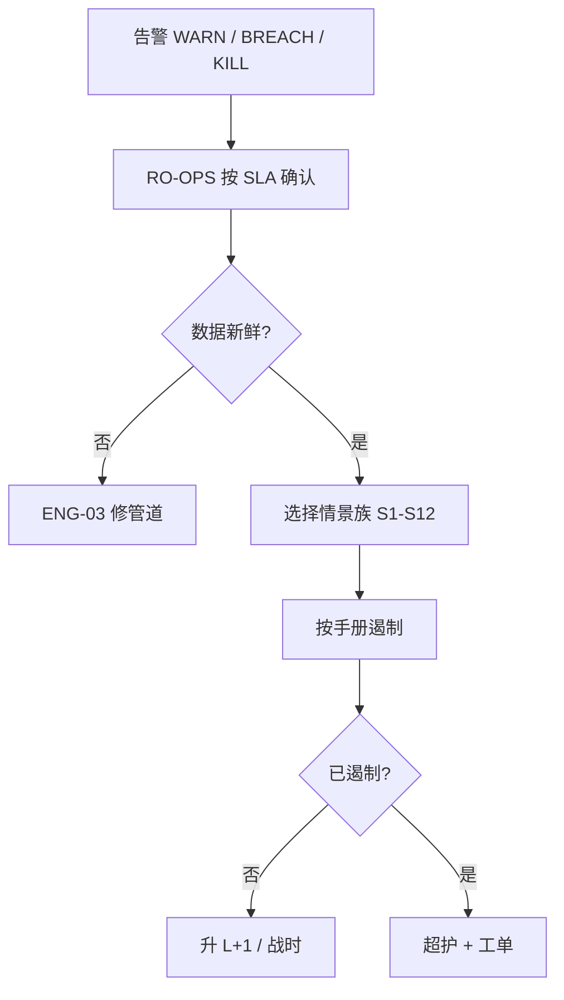

| 字段 | 明细 |
|------|------|
| **何时** | §8 任一告警 |
| **谁** | **R** RO-OPS · **C** L2+ 时 BU PIC · **升级 A** RO/CRO |
| **SLA** | 确认：WARN≤15 分 · BREACH≤5 分 · Kill/客户资产≤2 分；分类说明确认后≤10 分；BREACH 遏制方案≤15 分 |

**这份 SOP 干什么：** 寻呼或风险门户亮了。确认的意思是“有人看见了”，不是“修好了”。没人确认，系统会自动叫下一个人。这是故意的。

**如何做**
1. **在 SLA 内在控制台确认**（WARN 15 分，BREACH 5 分，Kill/客户资产 2 分）。*为什么：* 确认能止住寻呼风暴，让其他人能干活。它不关闭事件。  
2. **看数字新不新。** 看管道时间戳（PL-K06 / PF-K02）。时钟是旧的，就给工单打“数据”标签，走 ENG-03。**禁止**在陈旧的红/绿上强平、停牌或改限额。  
3. **若数字是真的：** 写下主 KRI，列出 ±15 分钟内动过的其他 KRI，选 §9 情景族（S1–S12）。*为什么：* 避免把错标记当成真崩盘。  
4. **按该族手册遏制。** 核对应自动动作有没有打出；该打没打，是第二起事件。  
5. **定 L1–L4**，按 §8.2 呼叫。说清下一步谁负责。  
6. **Sev-1/2：** 开战时；5 个工作日内排复盘，趁还记得。

**升级：** 确认超时自动呼 RO；两次 BREACH 仍无遏制 → L3。

### SOP-G04 — Maker–Checker 与职责分离

| 字段 | 明细 |
|------|------|
| **何时** | A+ 限额、Kill、密钥仪式、制裁覆盖、保险注资、解冻、A+ 杠杆权限等 |
| **谁** | Maker ≠ Checker ≠ 受益交易员；**SYS** 强制；政策 **A** CRO/CISO |
| **SLA** | 无 Checker 不得变更生产；破窗 ≤15 分且自动工单+呼叫 |

**这份 SOP 干什么：** 防止一个人（或一台被偷的电脑）单独拆安全栏杆。“四眼”= 两双人眼、两个登录。

**规则**
1. 交易员**不能**批准自己的杠杆或权限。工作流必须拒绝同一 UID。  
2. 部署 A 级配置的 RE 工程师**不能**当唯一审批人。  
3. 钱包密钥仪式：至少两人（宜三人），并写下仪式 ID。旧材料销毁或登记作废。  
4. **解除**合规冻结需要第二名合规或 RO。加上冻结可以快；拿掉才是危险方向。  
5. **破窗**（紧急权限）：限时账号、自动工单（PL-K07）、当天复核。用了破窗，没有复核就不算做完。

**升级：** 哪怕只是*尝试*同一人自批 → 当安全事件 ENG-04 / L3，不要当成界面故障。

### SOP-G05 — 日终对账与结算

| 字段 | 明细 |
|------|------|
| **何时** | 每日 UTC 日切（重大交易事件后可加做） |
| **谁** | **R 匹配** ENG/SYS · **R 例外** 清算/TO · **Checker** 重大时 CO2/RO · **A 结算** TS |
| **SLA** | 日切后 ≤60 分出匹配；重大例外 ≤4h 老化；仅 `SettlementReady` 后打款 |

**这份 SOP 干什么：** 在资金打款前，证明我们的账和真实世界一致。EOD 是某个 UTC 日切。错了可能给客户打两遍钱，或看不见保险基金的窟窿。

**如何做**
1. 系统跑匹配：内部成交/余额 vs 账本、经纪商、链、银行 → `ReconLine` 列表（已配 / 未配 / 差异）。  
2. 清算/TO **认领每一笔差异**：重拉数据、带工单调整、或追外部场所。不许把差异留在“其他”。  
3. 金额超过公布的重要性：批准前必须 **maker–checker**。  
4. 文件干净（或 RO 豁免）后系统才发 **`SettlementReady`**。这是绿灯，不是 Slack 一个赞。  
5. **TS** 打款或上链，并把银行回单/txid 存进证据包。  
6. 按合规政策留存。

**升级：** 缺账无法解释 → L2/L3，并评估是否该暂停交易。

### SOP-G06 — 新产品 / 新合约准入


**图 — SOP-G06 新产品门禁（Phase 1 = 永续 + 邀请/经纪商）**

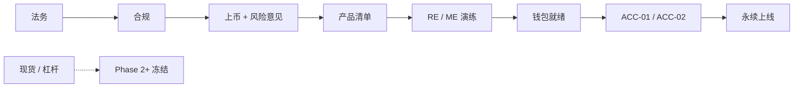

| 字段 | 明细 |
|------|------|
| **何时** | 新现货对、杠杆资产、永续、重大功能（组合保证金等） |
| **谁** | 门禁顺序见下；**上线 A** 风险+合规放行；**协调 R** LI 或 PM |
| **SLA** | 各门禁按流水线看板；无风险+合规不得“软启” |

**这份 SOP 干什么：** 把一份*文档*变成*活市场*。门禁有顺序，法务/合规/风险不能“以后再补”。“没风险+合规的软启”仍然是上线。

**门禁（不可乱序）**
1. **法务**写清这是什么工具（永续？证券？哪些司法管辖在意）。  
2. **合规**查制裁、证券、反洗钱红旗。  
3. **上币（LI）**做尽调；**RO** 出风险意见（LD-01），条件变成上线清单。  
4. **产品**走 §11 清单（Phase 1 用永续清单，不是现货）。  
5. **RE/ME** 在预发放配置并**签署演练**（永续尤其要强平与 ADL）。  
6. **钱包**确认抵押所需链的充提可用。  
7. 若用白名单/软启 → **点名 72h 超护值班**。  
8. 然后才放流量。**Phase 1：** 仅邀请/经纪商客群，**不是**公众注册；**仅永续**。

> **Phase 1 门禁说明：** 生产合约 = **永续（含 XAUUSD）**；准入 = **ACC-01/02（邀请或经纪商）**，非公众注册；现货/杠杆 = **`[Phase 2+]`**。
**升级：** 未放行已有流量 → PL-K12，强制关闭，L3 审计。

---

### 6.7 BU SOP 目录（详细）

#### RM 风险

这些是风险值班每天真正会碰到的手续。下面每条都写成“何时 / 怎么做 / 做完长什么样”，避免只记口诀。

- **RM-01 每日风险包：** **何时：** 每个 UTC 日切（默认 22:00），L3 当天再加做。**怎么做：** 系统用 `risk_reporting.py` 把策略/台/公司快照、未关闭告警、压力要点拼成一包；按 §8 给各家族涂红黄绿；标出 7 天内到期的豁免；发给邮件组；RO 对例外写评语。**做完：** 门户/邮件已发且 RO 点过确认。**超时 >2h** 当管道事件（ENG-03），不是“晚一点也行”。  
- **RM-02 WARN：** **何时：** 任一黄灯。**怎么做：** 按 G03 先确认 → 写下可能原因 → 决定“继续盯”还是“现在动” → 若正在逼近红灯，预先打开 G01/G02 草稿，免得红灯来了才找人。**SLA：** 15 分确认，30–60 分有方案。  
- **RM-03 BREACH：** **何时：** 红灯或接近 Kill。**怎么做：** 按产品立刻遏制（永续优先只减仓；杠杆冻借款；现货考虑停牌）→ 核对应自动动作打没打出 → 选定 §9 族 → Sev-1/2 则开战时。**SLA：** 5 分确认，15 分遏制。没有遏制方案不要把告警点掉。  
- **RM-04 杠杆/权限上调：** 交易员或 VIP **提交申请** → 系统自动出资格包（收益、回撤、风控冻结等）→ RO 当 Maker 批或驳 → A+ 再要 Checker → 工程/风控引擎才推限额。**禁止自己批自己。**  
- **RM-05 压力目录变更：** 量化提出新冲击或相关矩阵 → 回测命中率 → RO+量化双签 → 发布带版本号的目录 → 挂进每日包。没版本号等于没发布。  
- **RM-06 保险动用复核：** 任一保险赔付或 ADL 之后：**30 分内**快报（赔了多少、价格是否可信、当时簿好不好）→ **1 个工作日内**正式复核 → 可能接着注资（TS-04）、收杠杆档（G01）或查 ADL 是否误触发（PF-06）。  
- **RM-07 停牌建议：** 缺口、预言机坏、连环、监管开口时，RO/RO-OPS 在 **5 分钟内**给出范围建议并转入 G02。建议本身不是停牌；没有 G02 执行就还没停。

#### PF 永续 `[Phase 1]`（今天的主路径，请读完）

- **PF-01 新合约上线：** 按 §11.3 一张张勾：合约规格签字、指数成分够数且告警开、杠杆档双批、保险种子到位、资金费封顶测过、强平+ADL 演练签字、撮合与限频、客服话术、72h 超护名单、RO-OPS 知道这条合约怎么区分 S2（错标记）和 S1（真下跌）。缺一项就不上。  
- **PF-02 改杠杆档：** 走完整 G01，超护期内盯强平量。把最高杠杆当玩具调是 Sev 级失误。  
- **PF-03 标记偏离：** **5 分钟内分流。** 先问：是数据坏了（S2：切源、必要时暂停不安全强平）还是真基差（可走 PF-07 只减仓）？**改标记公式必须 RO+量化双控**，没有“先改再补单”。  
- **PF-04 资金费极端：** 先确认封顶/钳制是否生效。只有结算完整性已经坏了，才允许双人暂停资金费结算，并且传播必须写明。不要因为客户抱怨费率高就私自关。  
- **PF-05 保险赔付：** 当天快报：破产价、强平是否及时、做市是否在。数字对不上账就升级。  
- **PF-06 ADL：** 先证明保险**真的不够**。再看减仓排名是否公允。若像误触发：立刻停 ADL 并升 Sev-1。ADL 是最后手段，不是日常工具。  
- **PF-07 停牌 / 只减仓：** 引擎还健康时，**优先只减仓**（允许减仓、禁止加仓），而不是一关了之。传播必须说明资金费还在不在抽。引擎不健康则转 G02。  
- **PF-08 指数成分故障：** 把坏掉的外盘踢出指数。剩下的源少于政策最少家数 → 保护标记并只减仓/暂停强平。临时改权重必须 RO 批。

#### ACCESS — Phase 1 邀请与经纪商开户 `[Phase 1]`

- **ACC-01 邀请制开户（逐步）：** ① 系统校验邀请码仍有效、未被滥用 ② 客户完成 KYC ③ 合规放行 ④ 账户打上邀请元数据（谁邀请的、何时）⑤ 产品权益写成**仅永续** ⑥ 这才打开交易开关。若发现公众自助注册入口是开的 → **L3**，先关入口再查已放出的 UID。  
- **ACC-02 经纪商引入：** ① 经纪商协议仍有效 ② 客户 KYC ③ 经纪商限额与客户限额叠在一起（取更严）④ 权益=仅永续。协议一失效：停**新开户**，已开户按协议与风险意见处理，不要假装没看见。  
- **ACC-03 权益护栏（每天）：** 扫：误开了现货/杠杆的 UID、自助注册漏网、没有邀请/经纪商标签却能下单的 UID。日报给 RO-OPS + 合规。这是 Phase 1 的“门有没有锁”检查。

#### SP 现货 `[Phase 2+]`
- **SP-01 上线：** G06/LD 通过后，PM+TO 按 §11.5 配链/参数/MM/停牌测试/KRI，超护 72h。  
- **SP-02 停牌：** TO 提议、RO 批、ME 执行（G02）；默认保持提现。  
- **SP-03 复牌：** RO+ME 清除；验簿与做市；分阶段；超护 4h。  
- **SP-04 价格带/名义：** 走 G01；`/admin/spot/bands`。  
- **SP-05 对倒移交：** ≤30 分交 CP（订单/成交 ID）；可 CP-02；不得静默削弱 STP。

#### MG 杠杆 `[Phase 2+]`
- **MG-01 新增抵押：** LD-03 后压测折扣→LTV→借款上限→利率→强平路径测通→启用。  
- **MG-02 折扣/LTV：** G01；脱锚紧急 ≤30 分双批。  
- **MG-03 冻借款：** BREACH 后 ≤15 分决策；后台冻结+解冻标准入工单。  
- **MG-04 强平手册：** 先确认标记；不安全则 RE-02；否则保队列+限增险；延迟 >30s→L3。  
- **MG-05 坏账：** 定量→追偿→残余核销双控→反哺折扣/缓冲。  
- **MG-06 利率曲线：** MG-K07 未清不得推；重大走 G01。

#### ME / RE / WA
- **ME-01 发布/回滚：** 金丝雀盯 SP-K09/K04；Sev-1 时 ≤15 分决定回滚。  
- **ME-02 撮合停机：** 业务停牌 RO 批；全局 Kill 双控。  
- **ME-03 双活切换：** 宣告→failover→ME-05 验簿→按需 G02 复牌。  
- **ME-04 撤单风暴：** 限频/降载；滥用交 CP。  
- **ME-05 验簿：** 校验通过前不得完全复牌。  
- **RE-01 配置晋级：** 必须挂钩 G01 工单哈希；无单不得晋级。  
- **RE-02 强平暂停/恢复：** RO 令后 ≤2 分；传播须诚实说明风险；恢复须标记健康+RO ACK。  
- **RE-03 标记切源：** 切备源验 PF-K01；双源皆坏则只减仓/暂停强平。  
- **RE-04 状态重建：** 先冻结增险→权威账本重建→抽样对账→解冻。  
- **RE-05 组合保证金模型：** 并行跑→缺口报告→特性开关→保守回退就绪。  
- **WA-01 热钱包补款：** WARN ≤30 分启动；BREACH 立即；冷→热按仪式。  
- **WA-02 慢速提现：** BREACH ≤15 分决策；状态页+退出标准（缓冲+积压）。  
- **WA-03 链停/重组：** 暂停入账；已入账重组走追回；终局策略恢复。  
- **WA-04 错充：** 核权→可恢复性→费用政策→双控执行→txid。  
- **WA-05 密钥仪式：** 多方+仪式 ID+废止旧材料（G04）。  
- **WA-06 PoR：** 定高→负债提取→披露/鉴证→归档。

#### LD / CP / TS / MM / ENG
- **LD-01 风险意见：** LI 材料，RO 批/有条件/驳，条件变上线清单。  
- **LD-02 标签：** 种子/监控；可收紧价格带。  
- **LD-03/04：** 杠杆资格→MG-01；永续决策→PF-01。  
- **LD-05/06/07 下币序：** 批准→永续只减仓结清→杠杆冻借强平移除抵押→现货关交易保提现→传播。  
- **LD-08 紧急：** 安全优先立即停/禁充；24h 内补手续；取证会同安全/合规。  
- **CP-01~04：** 分流立案；硬冻结双控解除；跨产品时间线；监管令先验真。  
- **TS-01~04：** 通道切换；脱锚库存/兑付+MG-03；仅 SettlementReady 后结算；保险注资 CRO 双控。  
- **MM-01~03：** SLA 催办；压力扩价但心跳在；信息隔离检查。  
- **ENG-01~04：** 最小权限赋权；审计不可篡改抽查；管道延迟联动 RE-02/PF-03；密钥/API 失陷 ≤2 分杀钥并 L3/L4。

## 7. 管理后台与工具目录

### 7.1 规范管理后台映射（含完整 URL）

**完整 URL 表：** https://hxyan2020.github.io/PRD/risk-handbook/urls.html  
**后台目录：** https://hxyan2020.github.io/PRD/risk-handbook/admin/

> **Vercel：** 本手册**没有**部署在 Vercel。`https://prd.vercel.app/` 是另一个产品（LeadShark MVP PRD）。  
> 下列 GitHub Pages 地址为**公开文档桩页面**（不是真实交易所后台）。

| 域 | 逻辑路径 | 完整公开 URL（GitHub Pages） | 主责 BU |
|----|----------|------------------------------|---------|
| 风险限额与告警 | `/admin/risk/*` | [https://hxyan2020.github.io/PRD/risk-handbook/admin/risk/](https://hxyan2020.github.io/PRD/risk-handbook/admin/risk/) | RO / RO-OPS |
| 风控引擎 | `/admin/risk-engine/*` | [https://hxyan2020.github.io/PRD/risk-handbook/admin/risk-engine/](https://hxyan2020.github.io/PRD/risk-handbook/admin/risk-engine/) | RE |
| 合约/永续 `[Phase 1]` | `/admin/futures/*` | [https://hxyan2020.github.io/PRD/risk-handbook/admin/futures/](https://hxyan2020.github.io/PRD/risk-handbook/admin/futures/) | 合约 PM / TO-FUT |
| 撮合 | `/admin/engine/*` | [https://hxyan2020.github.io/PRD/risk-handbook/admin/engine/](https://hxyan2020.github.io/PRD/risk-handbook/admin/engine/) | ME / SRE |
| 钱包 | `/admin/wallet/*` | [https://hxyan2020.github.io/PRD/risk-handbook/admin/wallet/](https://hxyan2020.github.io/PRD/risk-handbook/admin/wallet/) | WO |
| 上币 | `/admin/listing/*` | [https://hxyan2020.github.io/PRD/risk-handbook/admin/listing/](https://hxyan2020.github.io/PRD/risk-handbook/admin/listing/) | LI |
| 合规 | `/admin/compliance/*` | [https://hxyan2020.github.io/PRD/risk-handbook/admin/compliance/](https://hxyan2020.github.io/PRD/risk-handbook/admin/compliance/) | CP |
| 资金 | `/admin/treasury/*` | [https://hxyan2020.github.io/PRD/risk-handbook/admin/treasury/](https://hxyan2020.github.io/PRD/risk-handbook/admin/treasury/) | TS |
| 权限与审计 | `/admin/iam/*`, `/admin/audit/*` | [https://hxyan2020.github.io/PRD/risk-handbook/admin/iam/](https://hxyan2020.github.io/PRD/risk-handbook/admin/iam/) · [https://hxyan2020.github.io/PRD/risk-handbook/admin/audit/](https://hxyan2020.github.io/PRD/risk-handbook/admin/audit/) | 安全 / ENG |
| 现货 `[Phase 2+]` | `/admin/spot/*` | [https://hxyan2020.github.io/PRD/risk-handbook/admin/spot/](https://hxyan2020.github.io/PRD/risk-handbook/admin/spot/) | 现货 PM / TO |
| 杠杆 `[Phase 2+]` | `/admin/margin/*` | [https://hxyan2020.github.io/PRD/risk-handbook/admin/margin/](https://hxyan2020.github.io/PRD/risk-handbook/admin/margin/) | 杠杆 PM / RO-Credit |
| 做市 `[Phase 2+]` | `/admin/mm/*` | [https://hxyan2020.github.io/PRD/risk-handbook/admin/mm/](https://hxyan2020.github.io/PRD/risk-handbook/admin/mm/) | MM |

逐页完整 URL 见 [https://hxyan2020.github.io/PRD/risk-handbook/urls.html](https://hxyan2020.github.io/PRD/risk-handbook/urls.html) 与 [https://hxyan2020.github.io/PRD/risk-handbook/admin/](https://hxyan2020.github.io/PRD/risk-handbook/admin/)。

**ACL 原则：** 最小权限；Kill/密钥/制裁覆盖/保险注资/A 级限额双控；变更不可篡改审计；破窗账户限时+自动工单+通知 CRO/CISO；分析尽量用只读副本。

> **Phase 1 后台优先级：** `/admin/futures/*`、风险与撮合、邀请/经纪商与合规冻结。`/admin/spot/*`、`/admin/margin/*` 文档桩仍在，生产须**关闭**（`[Phase 2+]`）。

---
## 8. 限额、KRI、阈值、动作与升级

### 8.1 读法

这一章是**值班观察清单**。每一行是一只传感器。你不必背公式，但要知道：它在量什么、什么叫“有点不对”、什么叫“坏了”、机器已经做了什么、人还必须做什么。

| 列 | 人话 |
|----|------|
| **ID** | 稳定编码（如 PF-K01），贴进工单和看板，大家指同一只传感器 |
| **指标** | 用话说清楚在量什么 |
| **频率** | 多久看一次（每秒还是每天） |
| **WARN（黄）** | 软阈：要调查，通常不自动阻断。像发动机故障灯 |
| **BREACH（红）** | 硬阈：必须有动作（系统及/或人）。像刹车 |
| **自动动作** | 不等你、系统已做的（仅在安全时） |
| **人工动作** | 即使系统已动，你仍必须做的 |
| **升级** | 按 §8.2 的 L1–L4 呼叫谁 |
| **主责** | 哪个 BU 对响应质量负责 |

**确认 SLA（RO-OPS）：** WARN ≤15 分 · BREACH ≤5 分 · Kill/客户资产 ≤2 分。确认 = “我看见了”，不是“修好了”。  
阈值变更走 SOP-G01；标 *calib.* 须换成《限额手册》真值。

**Phase 1 日报习惯：** 先看 **永续 PF-K\*** 和 **准入 ACC/平台**。现货 SP-K\*、杠杆 MG-K\* 留在表里供预习，Phase 2+ 前视为休眠。

### 8.2 升级阶梯

升级不是“谁职级更高”，而是“爆炸半径有多大、必须多快把人拉进电话”。

若两档之间拿不准，**选高的那档**并说出来。允许事后降级；不允许该叫而没叫。

| 级别 | 标准 | 通知 | 建桥时限 |
|------|------|------|----------|
| **L1** | 单笔 WARN；疑似数据质量；无客户影响 | RO-OPS | 工单即可 |
| **L2** | 硬突破且限于 1 标的/账户类；可逆 | RO + BU PIC（引擎相关含 RE） | 15 分 |
| **L3** | 多标的连环、保险动用、ADL 风暴、长时间停牌 | CRO + 产品 PIC + ME + RE + 传播 | 立即 |
| **L4** | 客户资金威胁、密钥/API 失陷、全站停牌、大范围错价 | ELT · 危机传播 · 法务 · 合规 · CISO | 立即+高管桥 |


**图 — 升级阶梯**

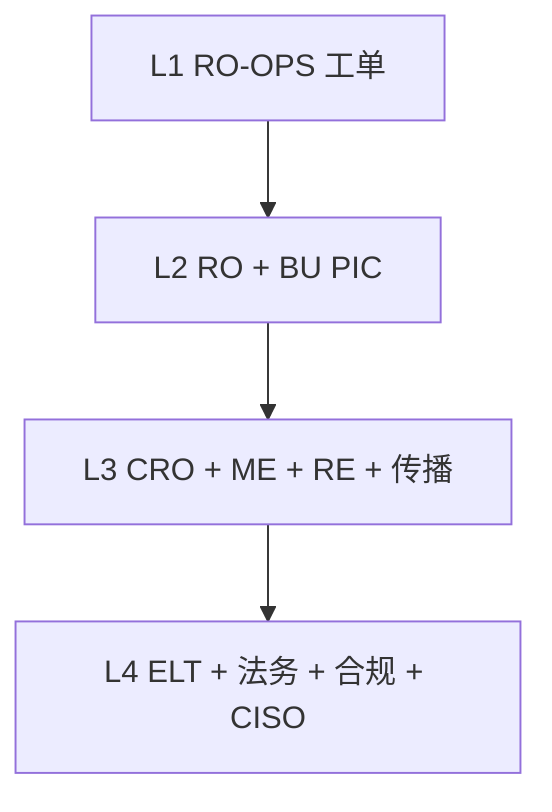

### 8.3 限额类型

软（WARN）/ 硬（BREACH）/ Kill（撮合总闸、提现冻结等）。

### 8.4 现货指标（摘要表）

| ID | 指标 | 频率 | WARN | BREACH | 自动动作 | 人工动作 | 升级 | 主责 |
|----|------|------|------|--------|----------|----------|------|------|
| **SP-K01** | 买卖价差相对 30 日中位数 | 1s/1m | ≥3× 持续 5m | ≥5× 持续 2m 或瞬间 ≥10× | 做市告警 | 查 SLA/联系 MM | L1→L2 | 现货 TO/MM |
| **SP-K02** | ±2% 盘口深度名义 | 1s/1m | <SLA 50%×5m | <SLA 25%×2m | 呼叫 MM | 执行 SLA；可建议停牌 | L2 | MM/TO |
| **SP-K03** | 最新价相对参考/指数偏离 | 1s | ≥2%×30s（主流 *calib.*） | ≥5%×15s 或瞬间 ≥10% | 价格带拒单 | 停牌候选；疑操纵交 CP | L2→L3 | TO/RO |
| **SP-K04** | 撤单/成交比 | 1m | >50:1×10m | >100:1 或 API 滥用 | 限频/拒撤 | 限流；监察立案 | L1→L2 | ME/CP |
| **SP-K05** | Fat-finger / 最大名义命中 | 逐笔+5m | 拒单次数过高 | 单笔触硬顶 | 拒单 | VIP 例外复核 | L1 | ME/TO |
| **SP-K06** | 现货停牌次数 | 事件+日 | 主流 ≥1 次/日 | ≥3 次/日或停牌 >60m | — | 复盘；传播 | L2→L3 | TO/RO |
| **SP-K07** | 充→交易→提速度（UID） | 事件/5m | 相对同侪异常 | 旅行规则/AML 命中 | 扣留提现 | CP 调查后放行 | L2 | CP/WO |
| **SP-K08** | 自成交/对倒评分 | 1m/批 | ≥WARN 切点 | ≥BREACH 切点 | STP/标记 | 立案；可硬冻结 | L2 | CP |
| **SP-K09** | 撮合时延 p99 | 10s | >2×SLO | >5×SLO 或丢单 >0.1% | 降非关键流量 | 缓解；可停牌 | L2→L3 | ME/SRE |
| **SP-K10** | 新币/种子标签 24h 波动 | 1m | 日振幅 >政策 A | >政策 B 或自上市 −50% | 收紧价格带 | 监控标签；欺诈则下币 | L2 | LI/RO |

### 8.5 杠杆指标（摘要表）

| ID | 指标 | 频率 | WARN | BREACH | 自动动作 | 人工动作 | 升级 | 主责 |
|----|------|------|------|--------|----------|----------|------|------|
| **MG-K01** | 资产借款占用（借/库存） | 1m | ≥80% | ≥95% | 利率阶跃；节流新借 | 持续则冻借款 | L2 | RO-Credit/TS |
| **MG-K02** | 用户保证金率/LTV | 1s | 距强平线 10% 内 | 穿强平线 | 追加→强平引擎 | 监控队列；仅按 RE-02 暂停 | L1→L2 | RE/TO |
| **MG-K03** | 平台强平名义（5m/1h） | 1m | >30 日 95 分位 2× | >5× 或引擎延迟 >30s | 抑制增险订单 | 可冻借款+收紧现货带 | L2→L3 | RO/RE |
| **MG-K04** | 坏账/负余额 | 事件+日 | 任笔 >$X | 日合计 >$Y 或单笔 >$Z | 自动还款尝试；隔离 UID | 追偿入账；A 级报 CRO | L2→L3 | RO-Credit/TS |
| **MG-K05** | 折扣相对实现波动缺口 | 时/日 | 波动升一档而折扣未动 | 日压测 LTV 突破 | — | 提折扣/LTV 变更 | L2 | DA/RO-Credit |
| **MG-K06** | 全仓传染评分 | 1m | 高 HHI+高 LTV | 多腿近强平 | 只减仓 | 政策允许则强制减仓 | L2 | RO-Credit |
| **MG-K07** | 利息计提例外 | 时 | 错配数 >0 | 名义突破容差 | 阻断曲线推送 | 对账；停利率更新 | L2 | TS/ENG |
| **MG-K08** | 稳定币抵押脱锚 | 1s | <0.995×5m | <0.99×2m 或瞬间 <0.98 | 折扣上调；冻该资产借款 | 兑付手册；压力 | L2→L3 | TS/RO |
| **MG-K09** | VIP 借款集中度 | 日 | Top10 >40% | Top10 >60% 或单一 >25% | 限制新 VIP 借 | 信用复核降额 | L2 | RO-Credit |
| **MG-K10** | 强平滑点 vs 破产价 | 逐笔+日 | 均滑点 >缓冲/2 | 滑点吃光缓冲→坏账 | — | 调冲击缓冲；检强平时做市 | L2 | RO/DA |

### 8.6 永续指标（摘要表）

| ID | 指标 | 频率 | WARN | BREACH | 自动动作 | 人工动作 | 升级 | 主责 |
|----|------|------|------|--------|----------|----------|------|------|
| **PF-K01** | 标记−指数偏离 | 1s | 主流 ≥0.5% / 山寨 ≥1.5% | 主流 ≥1.5% / 山寨 ≥3%×30s 或尖峰 ≥5% | 标记保护；拒操纵成交 | PF-03；可只减仓 | L2→L3 | RO/RE/DA |
| **PF-K02** | 指数成分陈旧/异常 | 1s | 1 所陈旧 >5s | 少于最少所数或 2+ 陈旧 | 踢出坏成分 | PF-08；临时权重审批 | L2 | DA/RE |
| **PF-K03** | 资金费率相对上限 | 周期+1m 预测 | ≥上限 75% | 触顶或预测触顶 | 钳制在上限 | PF-04；极端可双人暂停 | L2 | PM-FUT/RO |
| **PF-K04** | 持仓量 vs OI 上限 | 1m | ≥80% | ≥100%（禁增仓） | 拒增险开仓 | 限额复核 | L2 | RO/TO-FUT |
| **PF-K05** | 用户/VIP 名义 vs 限额 | 逐笔 | ≥80% | ≥100% | 拒单/只减仓 | 权限上调走流程 | L1→L2 | RE/RO |
| **PF-K06** | 强平名义洪峰 | 1s–1m | >30 日 99 分位 2× | >5× 或队列延迟 >15s | 减速开仓；分批强平 | 只减仓；盯保险 | L2→L3 | TO-FUT/RE |
| **PF-K07** | 保险基金覆盖率 | 1m/事件 | <政策地板压力 120% | <100% 或单笔赔付过大 | — | PF-05；备 ADL；CRO 注资决策 | L3 | RO/TS |
| **PF-K08** | ADL 事件 | 事件 | 任一 ADL | ≥3 次/时或主流 ADL | 执行 ADL 队列 | PF-06；传播；查滥用 | L3 | TO-FUT/RO |
| **PF-K09** | 基差（永续中间价−现货） | 1m | 出 30 日 95% 带 | 极端基差+薄盘 | — | 查指数/资金费；可只减仓 | L2 | DA/RO |
| **PF-K10** | Top-N 多空集中度 | 5m/日 | Top10 单边 >30% OI | >50% 或单一 >15% | 收紧 UID 限额 | 集中度处置；夹空嫌疑交 CP | L2 | RO/CP |
| **PF-K11** | 顶档杠杆使用占比 | 5m | >20% 用户在顶档 | >40% 或压力中急升 | — | 考虑收紧档位 | L2 | RO/PM-FUT |
| **PF-K12** | 保险赔付/破产笔数 | 事件+日 | 任一破产成交 | 日赔付合计 >Y | 动用保险 | 入账；挑战强平质量 | L2→L3 | RO/TS |

### 8.7 平台横切指标（摘要）

| ID | 指标 | 要点 |
|----|------|------|
| **PL-K01** | 热钱包缓冲 vs 24h 提现 p95 | WARN <150% / BREACH <100% → 慢速模式 + 补款 |
| **PL-K02** | 提现积压年龄 p95 | WARN >30m / BREACH >2h |
| **PL-K03** | 充值入账滞后 | BREACH >4× 预期或静默失败 |
| **PL-K04** | 重组深度 | 影响已入账 → 暂停入账 L3 |
| **PL-K05** | 日终对账差额 | 重大 → 阻断结算 |
| **PL-K06** | 标记/风险管道延迟 | >5s → 切源；不安全则暂停强平 |
| **PL-K07** | 破窗/绕过双控 | 任意使用告警；无工单 → L3–L4 |
| **PL-K08** | API 密钥异常 | BREACH → 杀钥 L3–L4 |
| **PL-K09** | 台/公司 VaR 或回撤 | ≥100% 限额 → 冻结加仓 |
| **PL-K10** | 压力测试冲击后缺口 | 核心情景超偏好 → 收紧限额 |
| **PL-K11** | 监察案件超龄 | >2×SLA 且仍有敞口 → 硬冻结评估 |
| **PL-K12** | 上币尽调超期 | 无风险/合规放行却有流量 → 阻断上线 |

### 8.8 组合保证金（如启用）
**PM-K01** 模型缺口 >25% → 保守模式/关特性；**PM-K02** 现货–永续对冲破裂 → 追加保证金。

### 8.9 监控频率分层
流式（tick–1s）→ 近实时（1–5m）→ 盘中（15–60m）→ 日切 MI 包 → 周 PIC 认证 → 季校准。

### 8.10 告警状态机
检测 → WARN|BREACH|KILL 路由 → SLA 内确认 → 数据质量？→ 真实风险则核对自动动作有效性 → 产品 SOP 人工遏制 → 超时升 L+1 → 遏制后超护 → Sev-1/2 进战时与复盘。  
**默认 TTE：** WARN 30–60 分无方案；BREACH 15 分；Kill/客户资产 0（立即 L3/L4）；超护 24h；复盘 5 个工作日。

### 8.11 报告与证据
盘中告警日志 · 每日风险 MI（RAG）· 强平与保险快报 · 钱包挤兑快报 · 周 PIC 认证 · 季阈值校准。

### 8.12 最小必开集
**Phase 1 优先：** PF-K01/K07/K06/K03（含 XAUUSD）· 邀请/经纪商覆盖与仅永续权益 · PL-K01/K06/K05 · SP-K09（共用撮合时延）。  
**`[Phase 2+]` 休眠：** MG-K01/K04/K08 · 现货簿 SP-K03 等。

---

## 9. 风险情景诊断（红黄绿 + 时序）

指标或组合变色时使用。**禁止只看颜色** — 先重建**时序**，再判别原因。

### 9.1 RAG 颜色映射

| 颜色 | 对应 §8 | 诊断含义 |
|------|---------|----------|
| **绿 G** | 低于 WARN | 健康 *或* 静默失败/未计算 — 须确认数据新鲜度 |
| **黄 A** | WARN | 抬升；在变红前调查 |
| **红 R** | BREACH / 近 Kill | 先遏制再诊断；在证明是数据问题前按真实风险处理 |

**要点：** 绿不一定安全。标记源**陈旧**却仍显示绿（见 PL-K06）可掩盖真实红灯。看颜色必看**最后更新时间戳**。


**图 — 红黄绿不是结论**

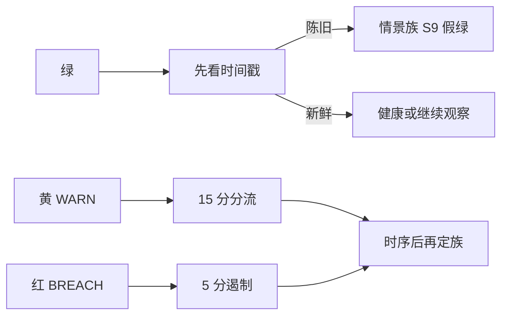

### 9.2 强制诊断顺序

```
1. 时钟  — 建时间线（T0 首异→Tn 现在），统一 UTC
2. 范围  — 单 UID / 单标的 / 单资产 / 全站 / 跨产品？
3. 数据  — 指标新鲜吗？公式版本？是否已切源？
4. 单点  — 主指标颜色的可能原因（§9.3）
5. 组合  — 哪些其他 KRI 动了、顺序如何？（§9.4–9.5）
6. 排除  — 与时序或“同伴仍绿”矛盾的原因划掉
7. 行动  — 按 §8 遏制 → §8.2 升级 → 必要时战时
8. 记录  — 工单写入时间线 + 采纳/排除原因
```


**图 — 诊断顺序（先时钟）**


**时序语法：** `A → B` 先因后果 · `A ≈ B` 同时/共同驱动 · `A ↛ B` 单 A 通常推不出 B · `A 静默后 B` 两阶段 · `A/R 振荡` 常为阈值噪声/源抖动/MM 重启。

### 9.3 单指标情景（绿/黄/红可能原因）

#### 现货 SP-K01 价差
- **绿：** 正常做市；低波。同伴深度、时延亦绿。  
- **假绿：** 中间价计算坏（空簿 NaN→0）；错误最小变动价。  
- **黄：** MM 主动扩价；波动抬升；库存偏斜；单边流；部分 MM 故障。  
- **红：** MM 全断；失序市；残停牌；API 限频饿死 MM。  
**时序：** `波动↑ → 黄价差 → 黄深度`（市场）· `MM 进程崩 → 秒级红深度再红价差`（技术）。

#### 现货 SP-K03 偏离
- **绿：** 价格发现一致且源新鲜。  
- **假绿：** 参考源与最新价一起卡住。  
- **黄：** 瞬时失衡、套利滞后、新闻微缺口、薄山寨。  
- **红：** 预言机/参考 bug、操纵成交、符号映射错、仅参考所停牌、成分失效。  
**时序：** `外盘崩 ≈ 红`（真跌）· `外盘平而本地红`（本地簿/操纵/数据）。

#### 现货 SP-K09 时延
- **黄：** 负载、GC、撤单风暴初起。  
- **红：** 分片过载、网络分区、坏发布、无限撤单环、DDoS。  
**时序：** `SP-K04 黄 → SP-K09 黄→红`（撤单风暴）· `发布 → 单独红时延`（坏版本）。

#### 杠杆 MG-K01 借款占用
- **黄：** 真实需求、轧空萌芽、出借人撤资。  
- **红：** 轧空、可借资产挤兑、库存分母配错、巨鲸借入。  
**时序：** `现货暴跌 → 补保 → 抢借稳定币 → 占用黄/红`。

#### 杠杆 MG-K02 近强平
- **红但无强平单：** 引擎卡住 — **L3 级严重**。  
**健康时序：** `价格冲击 → MG-K02 红 → MG-K03 强平量↑`。  
**病态：** `MG-K02 红 ↛ MG-K03` 超过 15–30 秒。

#### 杠杆 MG-K04 坏账 / MG-K08 脱锚
- 脱锚真时序：`外盘脱锚 ≈ MG-K08 → MG-K02/03 → MG-K04`。  
- `MG-K08 红而链上+外盘仍绿` → 本地标记 bug（归 S2 子类）。

#### 永续 PF-K01 / PF-K06 / PF-K07–08
- **PF-K01 红：** 指数坏、标记公式 bug、用最新价被操纵、熔断未触发。  
- **经典连环：** `宏观下跌 → PF-K01 黄 → PF-K06 黄→红 → PF-K07 黄`。  
- **`PF-K06 红 + 标的平坦`：** 错标记/bug — Sev-1 候选。  
- **`PF-K08 早于 PF-K07 黄`：** ADL 触发配错，非自然耗尽。

#### 平台 PL-K01/02 / PL-K06 / PL-K05
- `利空 → 提现浪 → PL-K01→02`（挤兑）。  
- `PL-K02 红而 PL-K01 绿`：签名/链瓶颈非余额。  
- `PL-K06 红领先 → 多 KRI 变色但外盘未动`：数据事件（S2）。

#### 当“绿”本身异常
大跌而 PF-K01/SP-K03 仍绿 → 源冻结/规则关闭/阈值过松；  
MG-K02 全绿却 MG-K03 飙升 → 可能强平错户/测试流量；  
危机中全绿 → 看板指到预发环境或缓存快照（S9）。

### 9.4 多指标组合情景族（含时序）


**图 — 同为红灯、顺序不同: S1 vs S2**

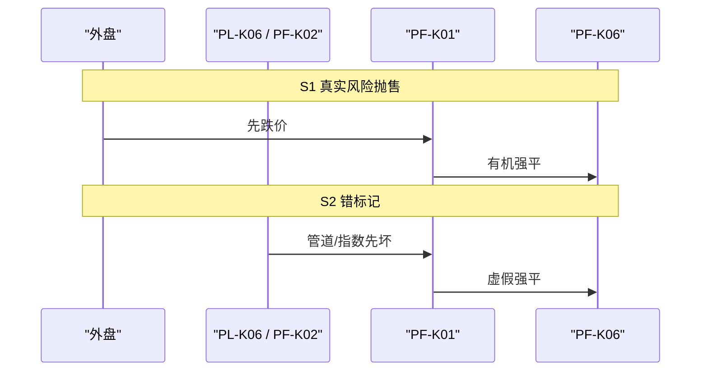

| 族 | 名称 | 关键时序（摘要） | 与其他族区分 |
|----|------|-----------------|--------------|
| **S1** | 真实宏观/风险资产抛售 | 外盘跌 → 现货/永续价格 KRI → 强平 → 保险/提现 | 需外盘同向；PL-K06/PF-K02 宜绿 |
| **S2** | 标记/指数数据完整性 | **PL-K06 或 PF-K02 先红** → PF-K01 → 虚假强平 | 外盘平坦；可与 S4 比：S4 先红时延 |
| **S3** | 稳定币脱锚传染 | MG-K08 → 杠杆强平/坏账 → 挤兑与保险压力 | 外盘脱锚确认；否则当预言机故障 |
| **S4** | 撮合过载/坏发布 | SP-K09（常跟发布/DDoS）→ 价差深度恶化 | 早期 PL-K06 可仍绿 |
| **S5** | 单币做市撤出 | **仅一标的**深度/价差红，其余绿 | MM 心跳挂 vs S7 心跳在但 SP-K08↑ |
| **S6** | 强平连环+保险压力 | 拥挤(K10/K11)→冲击→强平洪峰→赔付→保险↓→ADL | ADL 不得早于保险告警 |
| **S7** | 市场滥用 | SP-K08/CP 领先 → 局部偏离 → 受害者被强平 | 时延/管道常绿 |
| **S8** | 提现挤兑/托管压力 | 舆情触发 → PL-K01/02 → 市场抛压副作用 | 若 PL-K08 先红 → 安全事件 L4 |
| **S9** | 静默/假绿系统 | 外有混乱而主 KRI 全绿 | 查时间戳/告警是否静音/环境 |
| **S10** | 新币/新市场上线失败 | 仅新标的 SP-K10 与簿质量红 | 其余市场绿支持隔离 |
| **S11** | 跨产品套利/基差爆炸 | PF-K09/K03 极端；喂价绿 | 提现摩擦或借款占用可并存 |
| **S12** | 事后恢复 | 主指标转绿但 PF-K07 仍黄 → 勿急松杠杆；仅 PL-K05 红 → 禁结算 | 分项恢复含义不同 |

### 9.5 症状 → 情景族速查

| 大致顺序所见 | 优先 | 再查 |
|--------------|------|------|
| 外盘跌→价→强平→保险 | S1 | 若 ADL 则 S6 |
| 管道/成分先→标记→假强平 | S2 | 暂停强平 |
| MG-K08 先→杠杆坏账 | S3 | 真脱锚 vs 预言机 |
| 时延/发布先→价差深度 | S4 | 回滚 |
| 单币深度价差红 | S5 或 S7 | MM 心跳 vs SP-K08 |
| 拥挤→强平→保险→ADL | S6 | ADL 顺序 |
| SP-K08/CP 先 | S7 | 冻结 |
| 钱包 KRI 先且安全绿 | S8 | 慢速模式 |
| PL-K08/密钥异常先 | **安全 / L4** | — |
| 一片混乱却全绿 | S9 | 时间戳 |
| 仅新上市 | S10 | 标签/下币 |
| 基差/资金费极端且喂价绿 | S11 | 通道/借款 |

### 9.6 时序工作示例

**例 A — 单独黄：** `SP-K01 黄，深度/时延/管道绿` → 多为有意扩价或轻波动；深度若转红再按 S5。  

**例 B — 红组合：** 外盘 USDX 0.97 → MG-K08 红 → 多户 MG-K02/03 → 坏账与借款占用 → 热钱包黄 → **判 S3**，冻借款/调折扣，L3。  

**例 C — 同红异序：**  
- C1：`PL-K06 先红 → PF-K01/MG-K08 红 → 强平红`，外盘锚仍 1.00 → **S2（数据）**。  
- C2：`外盘先脱锚 → MG-K08 → 强平`，PL-K06 绿 → **S3**；勿停标记，应调折扣。  

**例 D — 绿红矛盾：** `PF-K06 红 + PF-K01 绿 + 管道绿 + 外盘平` → 强平引擎 bug/错合约/测试流量；升 **L3/Sev-1**，考虑 RE-02 暂停。

### 9.7 RO-OPS 分流卡片

1. 截屏 RAG **含时间戳**  
2. 标主指标 + ±15 分钟内全部黄/红  
3. 画 T0…Tn 箭头  
4. 选 S1–S12，写明排除族  
5. 执行 §8 自动/人工动作  
6. 按最差 KRI + 情景族定升级（S2/带安全的 S8/S9 倾向上调）  
7. 交接前把时间线贴进工单  

---

## 10. 事件定级与战时指挥

| 定级 | 定义 | 指挥 |
|------|------|------|
| Sev-1 | 客户资产损失风险、引擎完整性失败、大范围错标记 | CRO 或 CTO |
| Sev-2 | 重大坏账、ADL 风暴、长时间停牌 | BU PIC + RO |
| Sev-3 | 功能降级、单市场问题 | BU PIC |
| Sev-4 | 外观/轻微 | 值班 |


**图 — 战时席位（Sev-1）**

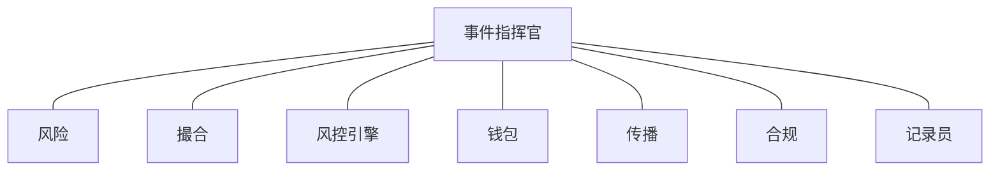

**战时常设角色：** 事件指挥官 · 风险 · 撮合 · 风控引擎 · 钱包 · 传播 · 合规 · 记录员  

**必须记录：** 时间线（§9 时钟）、改过的配置、期间订单/强平、采纳的情景族（S1–S12）、客户影响、永久修复负责人。  

**情景→定级提示：** S2 大规模错强平 · 带 PL-K08 的 S8 · 危机中 S9 → 先按 **Sev-1**；S5 单币 MM → 常 Sev-3；S1 有序抛售且保险仍绿 → Sev-2/3 运维模式。

---

## 11. 附录 — 术语与检查清单

### 11.1 术语

更多白话解释见 [零基础说明](#零基础说明)。

| 术语 | 人话 |
|------|------|
| 标记价 Mark | 永续用来算盈亏和“该不该强平”的公允价，不是最新成交 |
| 指数价 Index | 多家外盘价格合成，用来做标记 |
| 资金费率 Funding | 多空之间定期付钱，让永续不要永远偏离真价 |
| ADL | 保险填不起强平窟窿时，从盈利的对手仓上减仓 |
| LTV | 贷款相对抵押值的比例（杠杆借贷） |
| STP | 自成交防护，防止自己和自己成交刷量 |
| 保险基金 | 强制平仓仍留下未付亏损时用来填的池子 |
| 只减仓 Reduce-only | 只允许把仓变小、不许变大的订单 |
| A+ 级 | 大到必须两个人批（四眼）的变更 |
| RAG | 红 / 黄 / 绿 指标状态（§9） |
| 情景族 | 多只 KRI 按某种顺序一起动的命名模式 S1–S12 |
| Phase 1 | 现在生产：仅永续（含 XAUUSD）；邀请或经纪商开户 |
| Phase 2+ | 写在手册里但开关是关的（现货、杠杆、公众注册） |
| 邀请制 | 没有有效邀请/白名单就开不了户 |
| 经纪商通道 | 签约引入经纪商带来的客户 |
| KYC | 交易前的身份核验 |
| 抵押 / 保证金 | 客户押上的资产，赌错了用来平仓 |
| 强平 | 抵押不够时强制平掉仓位 |
| 名义 Notional | 用钱衡量的仓位大小 |
| 持仓量 OI | 未平永续仓的合计，有上限防止过度拥挤 |
| 基差 Basis | 永续价与指数/现货的差 |
| 折扣 Haircut | 因为抵押可能还没卖掉就先跌，所以先打个折 |
| 超护 Hypercare | 变更后加盯的时间窗 |
| 限额手册 Limit Book | 签过字的真 WARN/BREACH 数字；本手册数字是例子 |
| 四眼 / Maker–Checker | 两个人：一个提、一个批 |
| 破窗 | 限时紧急权限，永远带工单 |
| 战时指挥 | 有座位名单的电话：指挥官、风险、撮合、引擎、钱包、传播、合规、记录员 |

### 11.2 BU PIC 每周清单

- [ ] 复核未关闭 WARN/BREACH 与临期豁免（含确认超时）  
- [ ] 确认后台 ACL 入转离工单关闭  
- [ ] 按 §8 做现货/杠杆/永续/平台 KRI 红黄绿  
- [ ] 抽 1 个黄灯按 §9 单指标原因+时序走一遍  
- [ ] 周认证：误报率 + 阈值校准申请  
- [ ] 排期上/下币风险意见  
- [ ] 容灾/强平演练状态（至少每月）  
- [ ] 现货问题是否应传导到杠杆/永续参数  

### 11.3 永续上线清单 `[Phase 1]`

> 含 **XAUUSD** 及其他 Phase 1 永续。对外宣传任何客群前，先确认 ACC-01/02（邀请或经纪商）已接通。

- [ ] 合约规格由产品 + 法务签字  
- [ ] 指数成分达到政策最少家数；**PF-K01/PF-K02** 告警已开  
- [ ] 杠杆档与风险限额双人批准；**PF-K04/PF-K05** 已接通  
- [ ] 保险基金按政策注资；**PF-K07/PF-K08** 看板可看  
- [ ] 资金费公式与封顶已测；**PF-K03** 钳制有效  
- [ ] 强平 + ADL 演练由 RE + RO 签字（**PF-K06**）  
- [ ] 撮合标的已配，限频已设  
- [ ] 客服与传播话术（须写资金费/强平行为）  
- [ ] 72 小时超护值班表已点名  
- [ ] RO-OPS 能口述本合约如何区分 S2（错标记）与 S1（真下跌）

### 11.3a Phase 1 准入清单（邀请 / 经纪商）

- [ ] 公众自助注册**已关闭**
- [ ] 邀请服务上线；过期/复用规则已测（ACC-01）
- [ ] 经纪商白名单+协议生效；标签/门户可用（ACC-02）
- [ ] 每一可交易 UID 均有邀请 **或** 经纪商归属
- [ ] 产品权益 = **仅永续**（现货/杠杆关闭）
- [ ] ACC-03 日例外报表已订阅（RO-OPS + 合规）

### 11.4 杠杆资产上线清单（摘要） `[Phase 2+]`
现货观察窗达标；折扣/LTV 压测；借款库存与上限及 K01/K09；利率曲线与 K07 对账绿；逐仓+全仓强平路径测通；坏账科目映射；若稳定币抵押则完成 S3 桌面推演。

### 11.5 现货上线清单（摘要） `[Phase 2+]`
尽调完成；正确链充提且 PL-K01 缓冲 OK；tick/lot/带/STP/费率及 K03/K05；做市 SLA 或薄盘披露及 K01/K02；停牌权限测通（K06）。

### 11.6 文档控制

| 项 | 值 |
|----|-----|
| 密级 | 内部 — 风险受限 |
| 变更控制 | CRO 批准；经风险门户发布 |
| 相关产物 | 限额手册、强平政策、保险/ADL 政策、上币政策、BCP/DR、§8 指标目录、§9 情景诊断 |
| 培训 | 新任 BU PIC 30 日内必修 |
| 版本 | 1.9 — 零基础说明；SOP 步骤写清为什么 |

---

*本手册（简体）正文结束。工单模板、告警路由与自动化归属见仓库根目录模块及用例叙述流程图。*


