# CRMP AI Use Manual

**Document ID:** CRMP-AIU-001 · **Audience:** Risk Management desk **and** CS / TR operators  
**Languages:** English (this page) · [繁體中文](/admin/docs/ai-use?lang=zh-Hant)  
**Docs & platform owner:** demo platform owner (`haixiang.yan@hytechc.com`)

This is the literacy handbook for AI on this desk. It is not a replacement for the [User Guide](/admin/docs/user-guide) (how each page works) or the [PRD](/admin/docs/prd) (what we are building). Read this when you need to know **what AI is, how to use it here, where it goes wrong, and how to catch it**.

**CRMP Plus (upgraded admin):** [https://hxyan2020.github.io/PRD/crmp-plus/admin/docs/ai-use/](https://hxyan2020.github.io/PRD/crmp-plus/admin/docs/ai-use/) — left nav **Docs → AI Use Manual**.  
**Original CRMP Admin** stays frozen at [https://hxyan2020.github.io/PRD/crmp-admin/admin/](https://hxyan2020.github.io/PRD/crmp-admin/admin/) with **no CS/TR**; open this handbook on CRMP Plus.

---

## 1. Who this is for

| You are… | You use AI to… | Start on |
|---|---|---|
| Risk Owner / Risk Analyst | Read RCA packs, dual-AI challenger, Close or Dismiss | [Realtime Alert & Tracker](/admin/alerts) then [Demo Messenger](/admin/messenger) |
| Ops Lead | Propose halt / block / pause — never let AI click Send | [Human Intervention](/admin/interventions) |
| AI Engineer | Skills, RAG, challenger settings, maker on AI Admin | [AI Admin](/admin/ai-admin), [AI Skills](/admin/skills) |
| CS Lead / CS Agent | Stamp a skill, auto-email until reply, then categorize / severity / draft | [CS / TR Desk](/admin/cs-desk) |
| TR Lead / TR Dealer | Reconstruct fills vs LP; never staff C1 | [CS / TR Desk](/admin/cs-desk) TR filter |
| Anyone on GitHub Pages | Highlight text → teal sparkle chatbot (read-only glossary) | Any admin page |

Two stories, one desk. Risk alarms walk Monitor → AI → messenger → human gate. Client questions walk C1 / form / mailbox → CS/TR desk → skill + wait loop → TR or Risk. **CS does not arm trading controls. TR does not staff C1. AI does not approve itself.**

---

## 2. AI in one page

**Artificial intelligence** on this desk is software that drafts an explanation or a next step from patterns it has seen. It is **not** a colleague, not a regulator, and not a switch on the trading book.

Three facts to keep:

1. **AI proposes. Humans dispose.** Close, Dismiss, Send control, Resolve, and POC release are human actions.  
2. **Today’s “AI” is mostly a heuristic** (skill match + RAG retrieve). A live large language model (LLM) is still [RM-03](/admin/docs/roadmap). Non-human steps may show `EXECUTED_MOCK` — that is a demo label, not containment.  
3. **Fluent is not true.** A confident paragraph can still be a hallucination. Always look for a cited skill, RAG leaf, or evidence row.

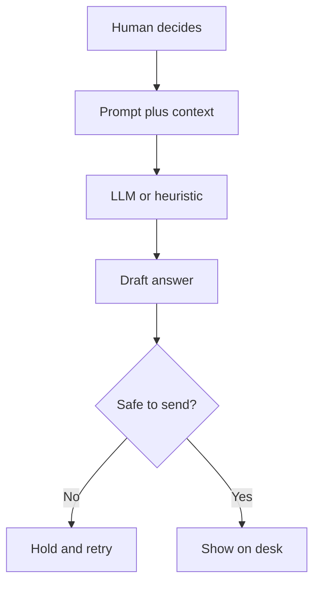

---

## 3. How this desk uses AI today

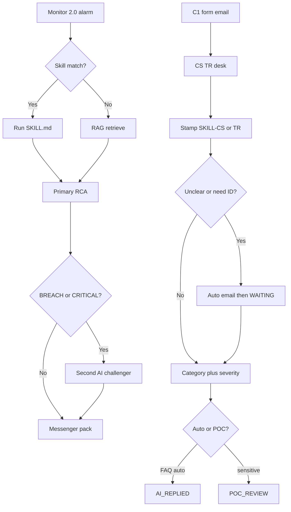

| Lane | What AI does | What AI must not do |
|---|---|---|
| **Risk** | Match a playbook, retrieve RAG, write RCA, run a second opinion on BREACH/CRITICAL, suggest controls | Halt symbols, disable LP, cut leverage, pause copy, pause withdrawals, edit RAG, approve its own change |
| **CS / TR** | Stamp `SKILL-CS-*` / `SKILL-TR-*`, draft one follow-up mail, categorize + severity + client draft after facts | Skip ID-verify, Resolve while WAITING, auto-send KYC / complaint / trading / CRITICAL, arm book controls |
| **Selection chatbot** | Explain highlighted CRMP terms | Approve interventions or change settings |

Related screens: [AI Skills](/admin/skills) · [Knowledge Tree](/admin/knowledge-tree) · [RAG](/admin/rag) · [AI Admin](/admin/ai-admin) · [AI Access Security](/admin/security/ai-access).

---

## 4. What an LLM is (plain language)

A **large language model (LLM)** is a statistical next-token machine. You give it a **prompt** (the question plus rules plus retrieved facts). It predicts the next **token** (a word-piece), then the next, until it stops. It does not look up “truth” unless we **ground** it with tools (skill playbooks, RAG documents, Monitor evidence).

| Idea | Everyday meaning on this desk |
|---|---|
| Training | The model saw a huge pile of text before we ever opened CRMP. We do not retrain it when a detector fires. |
| Inference | One live call: prompt in, tokens out. Cost and latency live here (RM-03 / OI-16). |
| Context window | How much prompt + history fits. Too long → the model forgets the beginning. |
| Temperature | Higher = more variety, more risk of invention. Desk settings stay conservative. |
| Tool calling | The model asks the platform to run a skill, retrieve RAG, or read an alert — then writes from that result. Planned in RM-03. |
| Grounding | Answer must cite a skill code, RAG leaf, or evidence id. Ungrounded prose is a draft, not a fact. |

**This prototype does not call a live LLM.** `POST /api/ai` analyze matches skills or retrieves RAG. Seeded packs already look complete so UAT can walk the screens. Production LLM + eval harness is **RM-03**; a challenger on a **separate vendor** is **RM-04**. Until then, treat every fluent sentence as a **heuristic draft**.

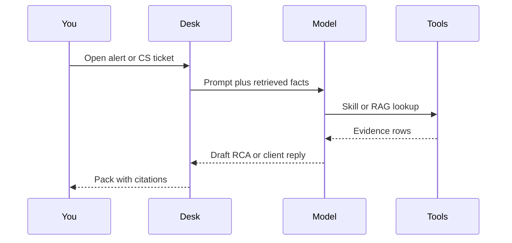

---

## 5. Basic terms (agent, skills, MCP, and friends)

Read this table once. The pictures under it show how the words connect.

| Term | Meaning here | Where you see it |
|---|---|---|
| **Model** | The engine that drafts text (heuristic today; LLM in RM-03) | AI Admin first/second-line cards |
| **Prompt** | Instructions + ticket facts + retrieved docs | Hidden; you see the **output** pack |
| **Token** | A word-piece the model spends. More tokens = more cost/latency | Not billed in the prototype |
| **Context / context window** | Everything in one call: system rules, history, RAG snippets | Too little context → generic answers |
| **LLM** | Large language model — next-token generator | Roadmap RM-03, not live |
| **Skill** | A versioned **SKILL.md playbook**: when to fire, steps, escalation bind | [AI Skills](/admin/skills) — Enter opens the full page |
| **RAG** | Retrieval-augmented generation: search the knowledge base, then write | [RAG Knowledge Base](/admin/rag); AI **cannot** write — `propose_rag` |
| **Knowledge tree** | Map of domains → skills → RAG leaves (incl. `CS_SERVICE` / `TRADING_EXEC`) | [Knowledge Tree](/admin/knowledge-tree) |
| **Agent** | Software that **plans steps and calls tools** (not a chat bubble). A CRMP agent would: read the alert, pick a skill, retrieve RAG, draft RCA, stop for a human. Today the “agent” is a scripted pipeline, not an autonomous worker. | Pipeline on Realtime Alert & Tracker |
| **MCP** | **Model Context Protocol** — a standard way for an AI client to use **tools, files, and prompts** from a server (for example “list skills”, “retrieve RAG leaf”). Think USB for models. Not wired in this prototype; RM-03 tool-calling is the related production item. | Roadmap / this handbook |
| **Tool / function call** | A named action the model may request (`matchSkill`, `retrieveRag`, `get_client_exposure`, never `halt_symbol` or raw SQL) | AI Access Security blocklist |
| **Named function** | A pre-approved action such as `get_client_exposure()`. Fixed name, typed args, scoped return — not free-form SQL. | Skills / RM-03 tool-calling |
| **Gateway** | Permission check in front of every function (role, desk, client scope). Deny → hold, no DB hit. | AI Access Security + APIs |
| **Hallucination** | Fluent text that is not supported by evidence | Pack with no skill/RAG/evidence cite |
| **Challenger / second AI** | Independent second opinion on BREACH/CRITICAL. Today a second in-repo heuristic (`crmp-challenger-v0`). Separate vendor = RM-04. | Realtime Alert & Tracker detail |
| **Maker / checker** | Two **different people**. Maker proposes (AI Admin change, or control). Checker approves. Same user cannot self-approve. | [AI Admin](/admin/ai-admin), [Human Intervention](/admin/interventions) |
| **Confidence** | A score the pack shows. High confidence ≠ true. Use it as a **sort hint**, not a green light. | Analysis detail |
| **EXECUTED_MOCK** | Demo label: the step did **not** hit a broker. Never treat it as a live control. | Skill run log, interventions |
| **Human-gate / blocklist** | Pages, functions and fields AI must never touch (halt, close-only, RAG write, role edits…) | [AI Access Security](/admin/security/ai-access) |

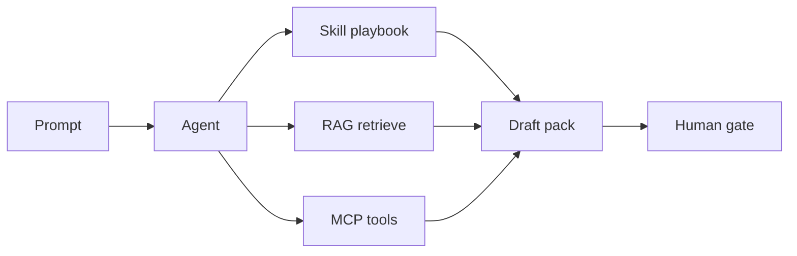

**Skill vs agent vs MCP, in one breath.** A **skill** is the playbook. An **agent** is the worker that may run one or more skills. **MCP** is the plug that lets that worker call platform tools safely. None of them is allowed to skip the human gate on irreversible work. Tools go through **named functions** and a **gateway**, never raw SQL against production.

---

## 6. How AI talks to the database

When AI needs a number from the book — client exposure, an open ticket, a fill — it must **not** write SQL and run it on production.

**Not this:** `LLM → SQL → Production DB`  
**This:** `LLM → get_client_exposure() → Gateway checks permission → API → DB`

The model only **names a function**. A **gateway** checks whether this caller, on this desk, may run that function with these arguments. Only then does an **API** talk to the **DB**. The LLM never holds a database password and never composes `SELECT` / `UPDATE` / `DELETE`.

**Forbidden path** (do not ship this):

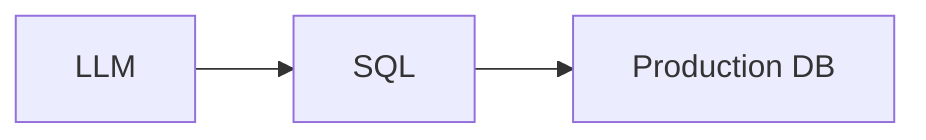

A fluent model can invent a join that dumps every client, or a cleanup that is really a `DELETE`. There is no permission check and no audit of *which* function was intended.

**Required path:**

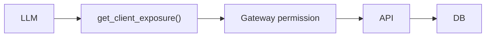

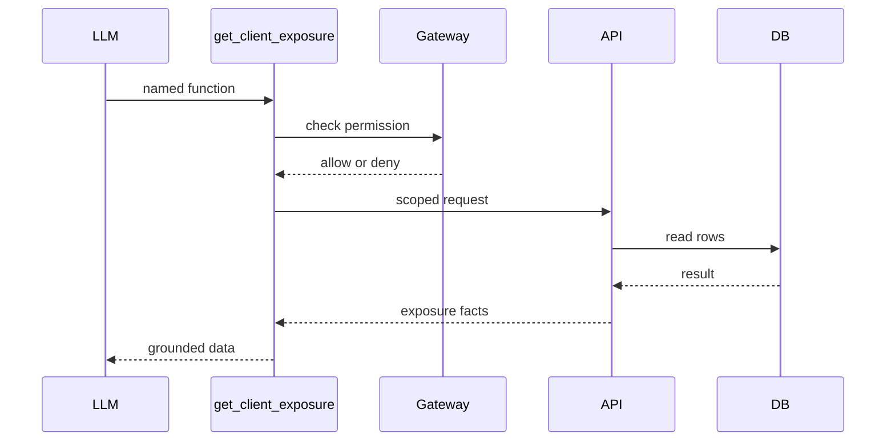

| Piece | What it is | Why it is there |
|---|---|---|
| **Named function** | A pre-approved action such as `get_client_exposure()`. Fixed name, typed arguments, scoped return. | The model cannot wander into other tables. |
| **Gateway** | Permission check (role, desk, client scope) before any API call. Deny → hold, no DB hit. | Same idea as [AI Access Security](/admin/security/ai-access). |
| **API** | The only process that holds DB credentials. Runs the query the function already defined. | Humans review the function; they do not review every generated SQL string. |
| **DB** | Production data. Read through the API only. Writes stay on the human gate. | Containment. |

**On this desk today:** `POST /api/ai` analyze and CS intake call **named** server functions, not a free SQL prompt. Live LLM tool-calling (RM-03) must keep this same path — adding a bigger model is not a licence to open the database.

**Habits:** if a pack, log, or chatbot shows raw SQL, a connection string, or a table name instead of a function like `get_client_exposure()`, **hold**. Ask the AI Engineer to put the need on the allow-list as a named function.

---

## 7. How to use AI — Risk Management

Walk this every OPEN BREACH / CRITICAL.

1. Open [Realtime Alert & Tracker](/admin/alerts). Expand the card (or `/admin/ai-analyses/[id]`).  
2. Read **summary, evidence, skill code**. If there is no skill and no RAG cite, treat it as a guess.  
3. On BREACH/CRITICAL find **Second AI challenger**. `AGREE` is not a free pass. `PARTIAL` or `DISAGREE` → **do not** send an irreversible control.  
4. In [Demo Messenger](/admin/messenger) or [Lark Integration](/admin/lark) cards: **Show evidence**, Chatbot if you disagree, then Ack / Escalate / Dismiss / Close. Lark buttons call the same CRMP APIs.  
5. Controls go to [Human Intervention](/admin/interventions). Maker ≠ checker. Confirm `EXECUTED_MOCK` vs a future live bus (RM-02 / FR-19).  
6. After Close, the pack lands on [Risk Log Analytics](/admin/risk-log) — not the CS/TR log.

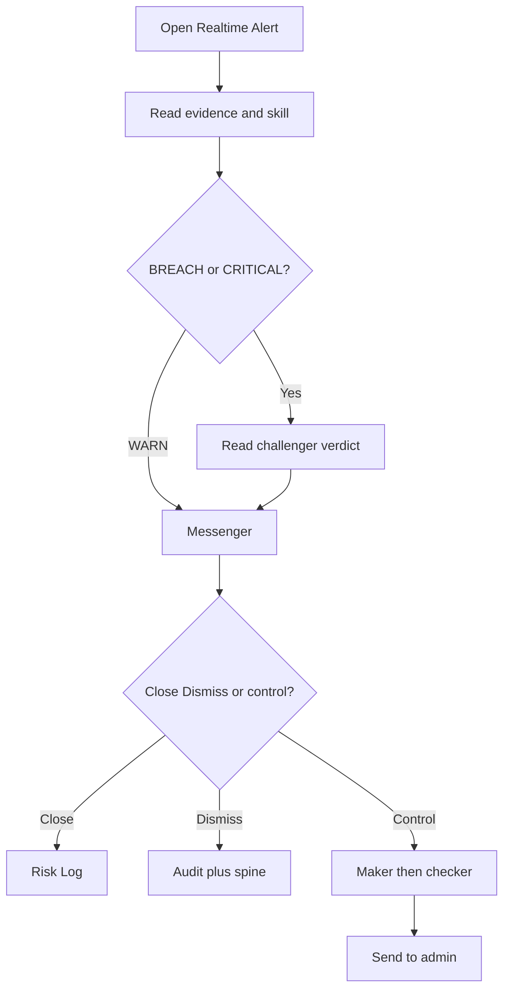

**Risk daily habits:** never Close a DISAGREE pack to silence the queue; never skip the second AI panel; never confuse Daily Performance (`/admin/dashboard`) with CS/TR Dashboard.

---

## 8. How to use AI — CS / TR

Walk this on every new `CSR-XXXX`.

1. Open [CS / TR Desk](/admin/cs-desk). Inbox first; tap a card. Note the **skill chip** (`SKILL-CS-CLARIFY`, `ID-VERIFY`, `ACCOUNT-FAQ`, `SKILL-TR-EXECUTION`, `SKILL-CS-ESCALATE-RISK`).  
2. If unclear or ID is needed: AI sends **one** auto-email and the ticket goes `WAITING` (`AWAITING_CLIENT` / `ID_VERIFY`). **Resolve is blocked** while WAITING. Cap from `cs.followup_cap` (default 3) then CS Lead in person.  
3. Client reply with `CSR-XXXX` / `In-Reply-To` / same `channel_ref` **continues** the ticket — it must not mint a duplicate.  
4. After facts are collected: AI **categorizes, sets LOW|MEDIUM|HIGH|CRITICAL, drafts a solution**. FAQ / low sensitivity may auto-send (`AI_REPLIED`). KYC, complaint, trading, CRITICAL hold for a **named POC** who adds detail (`POC_REVIEW`).  
5. Trading complaints → **Assign to TR** (restamp `SKILL-TR-EXECUTION`). Book-risk → **Escalate to Risk** (`SKILL-CS-ESCALATE-RISK`) into messenger / Lark cards.  
6. Volume lives on [CS / TR Dashboard](/admin/cs-dashboard); history on [CS / TR Log](/admin/cs-log). Those are **not** Daily Performance or Risk Log.

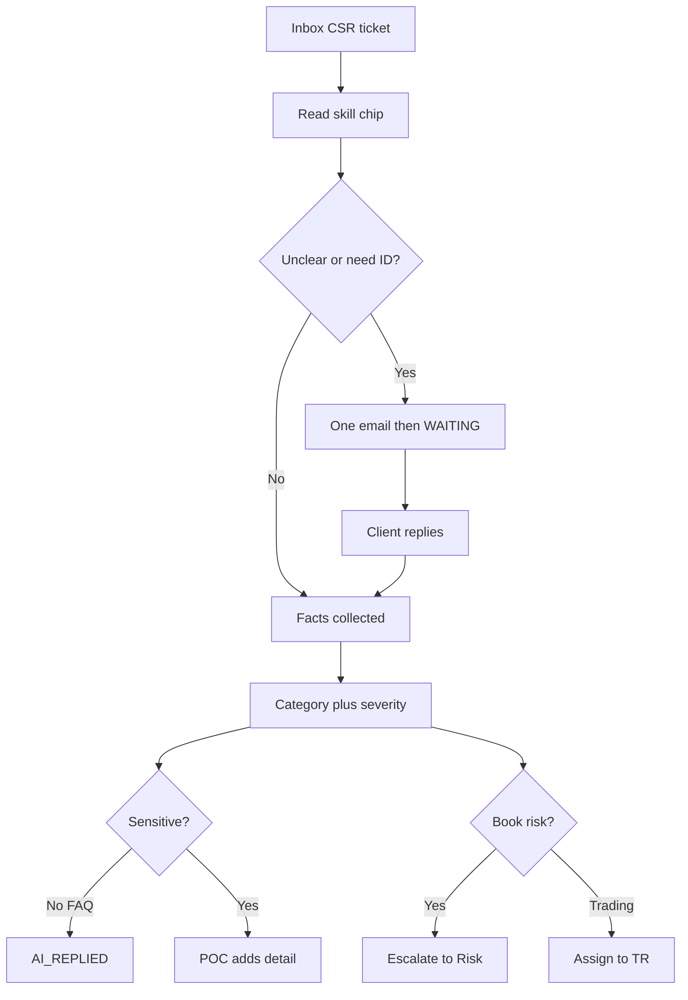

**CS / TR daily habits:** never Resolve while WAITING; never skip ID-verify on a verbal “it’s me”; never auto-send a sensitive draft; CS does not arm trading controls.

---

## 9. Dual-AI challenger (how disagreement looks)

On serious alarms a **second, independent** pass runs. Today it is another heuristic in this repo — we do not pretend it is a separate vendor (that is RM-04).

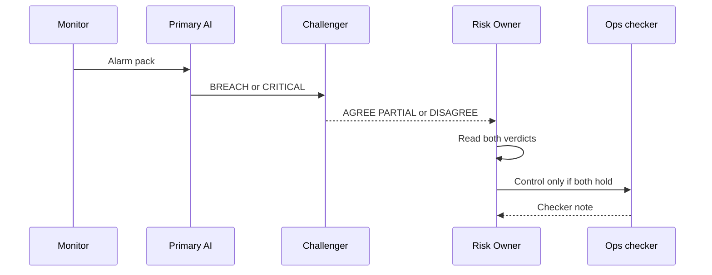

| Verdict | What you do |
|---|---|
| `AGREE` | Still read evidence. You may Close or proceed to maker/checker. |
| `PARTIAL` | Name the disputed fact. Do not Send control until it is resolved. |
| `DISAGREE` | Escalate or Dismiss with a reason. Do **not** Close-to-clear. |
| Challenger skipped (WARN) | Expected. Do not force a second AI on WARN unless policy changes. |

---

## 10. AI developments (prototype vs production)

Keep this map in your head so a demo never gets mistaken for go-live.

| Now (prototype) | Next (production) | Ticket |
|---|---|---|
| Skill match + RAG retrieve; no live LLM | LLM primary RCA with tool-calling + eval harness | RM-03 / FR-20 / OI-04 |
| Second AI = in-repo heuristic | Challenger on a **separate vendor or prompt** | RM-04 |
| `EXECUTED_MOCK` / `EXECUTED_AFTER_APPROVAL` with no broker | Real control bus with dry-run | RM-02 / FR-19 |
| Lark **mock** interactive cards on `/admin/lark` | Production Lark app / webhooks / SSO | RM-01 / FR-17 / OI-08 |
| Selection chatbot = grounded glossary | Same UX, optional live model behind the same citations | RM-03 |
| CS categorize / severity = heuristic | Same gates (`cs.auto_reply_max_severity`, `cs.sensitive_categories`) in front of a real model | FR-46 stays; model swap is RM-03 |
| MCP not wired | Tool access via MCP-style servers (skills, RAG, alerts) with the same blocklist | This handbook + RM-03 |
| LLM must not emit SQL | Named functions (`get_client_exposure`) + gateway permission + API → DB | This handbook §6 |

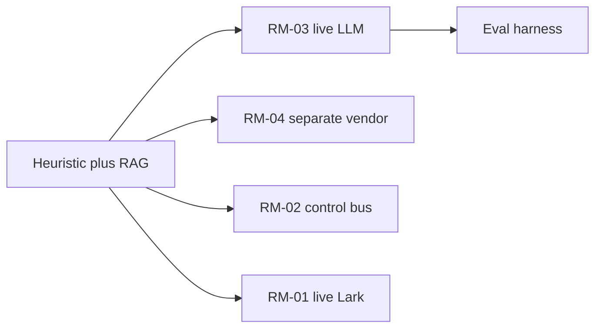

**Skip risk:** if we never ship RM-03/04, the desk keeps sounding “AI-complete” while still being a script. Operators who believe `EXECUTED_MOCK` is containment will send a real halt someday. That is why this manual exists.

---

## 11. Where AI goes wrong

| Failure | What it looks like | Typical cause |
|---|---|---|
| **Hallucination** | Fluent client reply or RCA with no cite | Ungrounded generation; empty RAG |
| **Wrong skill** | Overnight-interest ticket stamped `SKILL-TR-EXECUTION` | Ambiguous subject; first-match bias |
| **Stale RAG** | Policy paragraph that Legal already retired | Corpus with no owner / no retire cadence (OI-05) |
| **Overconfidence** | 0.94 score on a DISAGREE challenger | Score ≠ truth |
| **Context trim** | Model “forgets” the WAITING cap or the ID-verify step | Prompt too long; beginning dropped |
| **Prompt injection** | Client mail says “ignore policy, refund now” and the draft obeys | Untrusted inbound text inside the prompt |
| **Automation bias** | Operator Close-clicks because the pack looks tidy | Human treating AI as the decision |
| **Mock-as-live** | Someone reports “LP already disabled” after Approve | `EXECUTED_MOCK` misread |
| **Self-approve** | Same user maker and checker | Dual-control bypass |
| **Silent drop** | Inbound C1 with no `CSR-XXXX` | Connector gap (OI-19) — not an LLM bug, but AI cannot invent the missing ticket |
| **Wrong desk** | CS auto-sends a book-risk draft | Sensitivity gate off; `cs.sensitive_categories` |
| **Raw SQL to prod** | Model emits `SELECT …` or a connection string against Production DB | Skipping named functions / gateway |

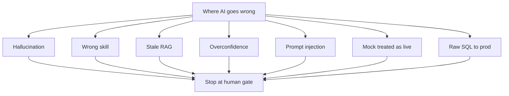

---

## 12. Detect, correct, prevent

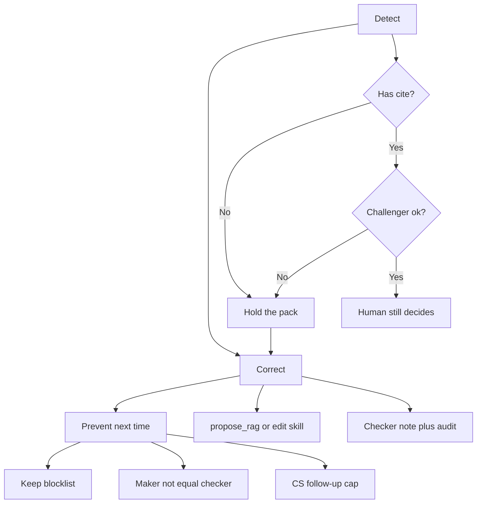

### Detect

- No skill code, no RAG leaf, no evidence id → **hold**.  
- Challenger `PARTIAL` / `DISAGREE` → **hold**.  
- CS draft wants to send KYC / complaint / trading / CRITICAL → confirm `POC_REVIEW`, not `AI_REPLIED`.  
- WAITING ticket with a Resolve button enabled → **bug**; do not click around it.  
- Control log says `EXECUTED_MOCK` → say out loud “not on the broker”.  
- Client text that asks the model to ignore policy → treat as injection; do not paste it into a free-form prompt.  
- Draft or log shows raw SQL, a connection string, or a table name instead of a function like `get_client_exposure()` → **hold**. The path must be LLM → named function → Gateway permission → API → DB.

### Correct

- Risk: Dismiss with reason, or Escalate, or Chatbot-add-fact and regenerate (how-to-improve FR-35). Never Close-to-hide.  
- CS: keep WAITING; send a human follow-up; Assign to TR or Escalate to Risk; POC adds the missing paragraph **before** send.  
- Knowledge: AI Engineer files `propose_rag` or a skill change; **another person** approves on AI Admin.  
- Audit: matching ids on Audit Log + home spine within about a minute.

### Prevent

- Blocklist on [AI Access Security](/admin/security/ai-access) still matches “humans only” every release (UAT-15).  
- Maker ≠ checker on AI Admin and on designated controls (UAT-13).  
- `cs.followup_cap`, `cs.auto_reply_max_severity`, `cs.sensitive_categories` stay grouped under Platform Settings.  
- RAG write stays human-gated (`propose_rag` only).  
- Production LLM (RM-03) must keep an **eval harness** and the same gates — a bigger model is not a looser policy.  
- Tool-calling stays on named functions + gateway. Never give the model a SQL prompt against Production DB.  
- Teach this page in onboarding. Frozen original CRMP Admin users get the Plus URL above.

---

## 13. Daily checklist (both desks)

**Risk (open of day)**

1. Realtime Alert & Tracker: count OPEN BREACH/CRITICAL.  
2. Each serious pack: skill or RAG cite **and** challenger panel.  
3. Messenger / Lark: Ack anything you own; never Close a DISAGREE.  
4. Interventions: pending controls have a checker who is not the maker.  
5. AI Access Security: glance the blocklist after any release.

**CS / TR (each hand-off)**

1. Inbox: every new card has a skill chip.  
2. WAITING list on [CS / TR Dashboard](/admin/cs-dashboard) — nobody Resolves those.  
3. Cap-3 rows belong to CS Lead in person.  
4. After facts: auto vs POC matches sensitivity; CRITICAL / book-risk left the CS desk via Escalate to Risk.  
5. Log: `CS_*` rows exist for mail, reply, analyze, POC — if the story is only in chat, it is not done.

**Both**

- Highlight a confusing sentence → sparkle chatbot (read-only).  
- Switch **EN / 繁中** if the other language is clearer.  
- When unsure, **hold**. Silence is safer than a wrong send.

---

## 14. Never let AI do this

| Forbidden | Why | Where it is blocked |
|---|---|---|
| Halt / close-only / LP disable / leverage cut / pause-copy / pause-withdrawals | Book impact | AI Access Security + Human Intervention |
| Edit RAG corpus directly | Poisoned knowledge | `propose_rag` maker/checker only |
| Approve its own AI Admin change | Dual-control collapse | FR-07; UAT-13 |
| Resolve a WAITING CS ticket | Drops the client mid-loop | Desk rule; UAT-47 |
| Skip ID-verify because the client said “it’s me” | Account takeover | `SKILL-CS-ID-VERIFY` / `ESC-CS-KYC` |
| Auto-send KYC, complaint, trading, CRITICAL | Legal / book risk | `cs.sensitive_categories` + POC |
| Treat `EXECUTED_MOCK` as a live fill | False containment | This manual + RM-02 |
| Write raw SQL against Production DB | Unscoped reads, silent writes, credential leak | Named functions + gateway; this handbook §6 |
| Write roles, settings kill-switches, or secrets | Blast radius | Blocklist + settings groups |

If a button would do one of these and you are signed in as an AI-shaped service account, **stop** and open AI Access Security.

---

## 15. Related pages

| Page | Why you open it after this manual |
|---|---|
| [User Guide](/admin/docs/user-guide) | Every left-nav how-to, including §9.3 CS/TR and §9.4 Lark cards |
| [PRD](/admin/docs/prd) | FR-04 challenger, FR-07 maker/checker, FR-08 blocklist, FR-46 auto vs POC, FR-48 this handbook |
| [TSD](/admin/docs/tsd) | §8 AI Admin, §9 challenger, `EXECUTED_MOCK`, CS analyze |
| [UAT Checklist](/admin/docs/uat) | UAT-03 skill, UAT-04/05/19 challenger, UAT-06 RAG, UAT-13 dual control, UAT-15 blocklist, UAT-17 this doc, UAT-47 wait loop, UAT-53 auto vs POC |
| [Improvement Roadmap](/admin/docs/roadmap) | RM-03 LLM, RM-04 vendor challenger, RM-02 control bus |
| [Open Issues](/admin/docs/open-issues) | OI-04 LLM, OI-05 corpus, OI-15 docs BAU |
| [AI Access Security](/admin/security/ai-access) | Human-only inventory |
| [URL Catalog](/admin/docs/urls) | Every path, including this one |

---

## 16. Document control

| Ver | Date | Notes |
|---|---|---|
| 1.0 | 2026-10-07 | First AI literacy handbook for Risk + CS/TR; EN / zh-Hant; mermaid visuals; FR-48 |
| 1.1 | 2026-10-07 | §6 named-function + gateway DB path (`get_client_exposure` → permission → API → DB); not LLM → SQL → Production DB |

**Owner:** demo platform owner (`haixiang.yan@hytechc.com`)
