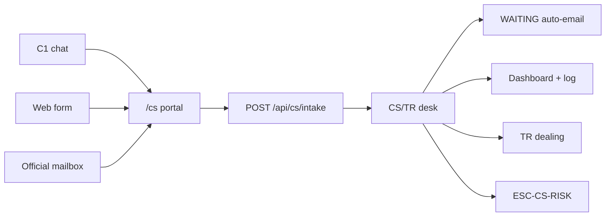

# CRMP Open Issues

**Document ID:** CRMP-OI-001 · **Version:** 1.5 · **Interactive board:** [/admin/docs/open-issues](/admin/docs/open-issues) · **Progress twin:** [/admin/docs/progress](/admin/docs/progress)

Tentative open-issue checklist for the CRMP admin / control-plane programme. Assumptions are explicit:

1. **Monitor 2.0** is still adding indicators — CRMP syncs; it does not own the registry.  
2. **CRMP** is in **initial design** for production scope (prototype desk already ships).  
3. **Tech details** and **resource planning** remain open (see [Ecosystem Eval](/admin/docs/ecosystem) bands).

Statuses: **Planned · Started · WIP · Delayed · UAT · Go live · BAU**. Every issue carries **responsible BU**, **dependencies**, and a **tentative ETA** through **end-2027**.

Source of truth for the interactive checklist: `platform/src/lib/docs/open-issues.ts` (**20 issues**, OI-01 … OI-20). New CS/TR functions are a **catalogue on those 20**, not extra numbered issues. Progress Tracker stays **20 columns**.

---

## CS/TR feature catalogue

Interactive twin: filter **CS/TR** on [/admin/docs/open-issues](/admin/docs/open-issues) (`data-testid="oi-cs-catalogue"`). Two **primary** issues own the door and the vault/tape. Six **support** issues carry the RAG tree, Lark seeds, UAT pack, mobile, prototype UAT window, and docs. Prototype ticks vs production remaining — connectors, vault, tape, SMTP and live volume stay open.

| Kind | ID | Feature | Screens / URLs | Prototype shipped | Still open (production) |
|---|---|---|---|---|---|
| primary | OI-19 | Production C1 / form / mailbox connectors | `/cs`, desk, dashboard, log, data, `POST /api/cs/intake` | Portal, wait loop, seed dashboard/log/data, UAT-46 | Signed C1, form HMAC, mailbox gateway, production SMTP, live volume, no-silent-drop SLA |
| primary | OI-20 | CS/TR ID vault and dealing-tape reconstruct | CS KYC Vault, desk, Data Sources, Demo Messenger | Vault team, ESC-CS-KYC flags-only, TR routing, MT4/MT5 tape listed | Production vault, mailer with `cs.followup_cap`, live tape, live messenger escalate, CS Lead waiver audit |
| support | OI-05 | Knowledge tree + RAG corpus (`CS_SERVICE` / `TRADING_EXEC`) | Knowledge Tree, RAG, AI Skills | Trunks + `cs-*` leaves (UAT-50) | Corpus owners, retire cadence, skill↔doc binds, `propose_rag` SLA |
| support | OI-08 | Production Lark interactive cards (CS/TR channels) | Lark Integration | Seed `oc_cs_c1` / `oc_cs_kyc` / `oc_tr_dealing` (UAT-36) | Live card Ack / Escalate / Approve including CS WAITING / cap |
| support | OI-09 | Risk Owner UAT exit including CS/TR catalogue | UAT Checklist v2.6 | Pack v2.6 (51 cases, skip UAT-45) indexes CS/TR | Formal RO sign-off of UAT-25/46/47/48/50/51/52 + four CS hops |
| support | OI-11 | Admin UX polish — CS/TR phone-width | Desk, dashboard, log, data | Surfaces listed for ~390px (UAT-18) | Phone-width pass on those surfaces |
| support | OI-14 | Prototype AI desk UAT window includes CS/TR door | `/cs`, desk, skills, wait loop, dashboard, log, data | CS/TR door shipped for UAT-46…52 | Formal UAT sign-off (OI-09) |
| support | OI-15 | Docs & URL catalog keep pace (UG §9.3 / UAT v2.6) | User Guide, URL Catalog, UAT, Open Issues, Progress | UG §9.3 + URL Catalog CS/TR + UAT catalogue v2.6 | Keep Open Issues + Progress in lockstep |

### Public URLs (CS/TR)

Permanent Pages origin: `https://hxyan2020.github.io/PRD/crmp-plus/`.

| Surface | Path |
|---|---|
| Client portal | `/cs` |
| CS / TR Desk | `/admin/cs-desk` |
| CS / TR Dashboard | `/admin/cs-dashboard` |
| CS / TR Log | `/admin/cs-log` |
| CS / TR Data | `/admin/cs-data` |
| Intake API | `POST /api/cs/intake` · `GET /api/cs/intake` |
| Payloads | `GET /api/cs?view=dashboard` · `log` · `data` |

---

## Summary by BU

| BU | IDs | Focus |
|---|---|---|
| **Monitor** | OI-01, OI-13 | Indicator expansion; bidirectional ticket write-back |
| **Product** | OI-02, OI-15, OI-18 | Design freeze; docs BAU (incl. CS/TR catalogue); multi-entity tenancy |
| **CS** | OI-19 | Production C1 / form / mailbox connectors (catalogue primary) |
| **TR** | OI-20 | CS/TR ID vault and dealing-tape reconstruct (catalogue primary) |
| **System** | OI-03, OI-06, OI-11, OI-16 | Tech/resource plan; SSO; UX (CS/TR phone-width); observability |
| **AI** | OI-04, OI-05, OI-14 | Production LLM; RAG CS_SERVICE/TRADING_EXEC; prototype UAT incl. CS/TR door |
| **Ops** | OI-07, OI-08, OI-17 | Control adapters; Lark cards (CS/TR seeds); kill-switches |
| **Risk Owner** | OI-09 | UAT exit + policy thresholds (pack v2.6 CS/TR catalogue) |
| **Pricing** | OI-10 | LP / pricing feed contracts |
| **GRC** | OI-12 | Evidence retention, redaction, audit export (no ID images on CS intake) |
| **All** | OI-15 | Docs / URL catalog keep pace |

---

## Summary table

| ID | Pri | Area | BU | Status | Tentative ETA | Title |
|---|---|---|---|---|---|---|
| OI-01 | P0 | Monitor | Monitor | WIP | 2027-Q2 | Monitor 2.0 indicator expansion |
| OI-02 | P0 | Product | Product | Started | 2027-Q1 | CRMP control-plane — initial design freeze |
| OI-03 | P0 | System | System | Planned | 2027-Q1 | Tech architecture & resource plan |
| OI-04 | P1 | AI | AI | WIP | 2027-Q3 | Production LLM RCA + independent challenger |
| OI-05 | P1 | AI | AI | Started | 2027-Q1 | Knowledge tree + RAG corpus governance |
| OI-06 | P0 | System | System | Planned | 2027-Q2 | SSO / IdP + SCIM |
| OI-07 | P0 | Ops | Ops | Planned | 2027-Q4 | Real control adapters |
| OI-08 | P1 | Ops | Ops | Planned | 2027-Q2 | Production Lark interactive cards |
| OI-09 | P1 | RO | Risk Owner | Started | 2026-Q4 / 2027-Q1 | Risk Owner UAT exit + policy thresholds |
| OI-10 | P2 | Pricing | Pricing | Planned | 2027-Q3 | LP / pricing feed contracts |
| OI-11 | P2 | Platform | System | WIP | 2026-Q4 | Admin UX polish — mobile + docs parity |
| OI-12 | P1 | GRC | GRC | Planned | 2027-Q4 | Evidence retention, redaction & audit export |
| OI-13 | P1 | Monitor | Monitor | Delayed | 2027-Q3 | Bidirectional Monitor ticket write-back |
| OI-14 | P2 | AI | AI | UAT | 2026-10 / 11 | Prototype AI desk features — UAT window |
| OI-15 | P3 | Product | All | BAU | Ongoing → 2027-12 | Docs & URL catalog keep pace with admin |
| OI-16 | P1 | System | System | Planned | 2027-Q3 | Observability — spine SLOs / AI / false-alarm |
| OI-17 | P1 | Ops | Ops | Planned | 2027-Q4 | Global kill-switches |
| OI-18 | P2 | Product | Product | Planned | 2027-Q4 → 12 | Multi-entity / brand tenancy readiness |
| OI-19 | P1 | CS | CS | Started | 2027-Q2 | Production C1 / form / mailbox connectors |
| OI-20 | P1 | TR | TR | Started | 2027-Q3 | CS/TR ID vault and dealing-tape reconstruct |

---

## Detail checklist (by BU)

### Monitor

#### OI-01 — Monitor 2.0 indicator expansion
**BU:** Monitor · **Status:** WIP · **ETA:** 2027-Q2 (ongoing) · **Depends:** Monitor roadmap; naming; sync contract

- [ ] Publish additive `M2-*` naming + category map as Monitor adds indicators  
- [ ] Keep tooltip / deep-link contract stable for new codes on Monitor 2.0 + Realtime Alert & Tracker  
- [ ] Sync / `run_detectors` tolerate unknown additive fields without CRMP schema fork  
- [ ] Risk Domains P0–P3 scenarios map to new primary indicators  
- [ ] UAT pack updated when each Monitor indicator wave lands  

#### OI-13 — Bidirectional Monitor ticket write-back *(delayed)*
**BU:** Monitor · **Status:** Delayed · **ETA:** 2027-Q3 (slipped) · **Depends:** Monitor write API; OI-01; OI-03

- [ ] Inbound webhook: Monitor warn/breach → CRMP upsert + AI RCA  
- [ ] Outbound PATCH: Ack / dismiss / close / assignee on Realtime Alert & Tracker → Monitor ticket  
- [ ] Contract tests against Monitor sandbox  
- [ ] Replace `sync_monitor2` fake `pulled_alerts: 5` with live pull/push  
- [ ] No auto-close BREACH/CRITICAL from AI alone without RO policy  

*Today:* Ack/dismiss/close update local SQLite only — no live Monitor HTTP.

---

### Product

#### OI-02 — CRMP control-plane initial design freeze
**BU:** Product · **Status:** Started · **ETA:** 2027-Q1 · **Depends:** RO + Platform Owner workshops; Ecosystem A–B

- [ ] Workshop: spine stages vs home ticket counts vs audit planes  
- [ ] Draft BU RACI (AI / System / RO / Pricing / Ops / Monitor / GRC / CS / TR)  
- [ ] Define dual-control write path (maker → checker → control bus)  
- [ ] Classify surfaces: BAU desk vs pilot-only vs human-only blocklist  
- [ ] Design freeze signed by Risk Owner + Platform Owner  

#### OI-15 — Docs & URL catalog BAU
**BU:** All · **Status:** BAU · **ETA:** Ongoing → 2027-12 · **Depends:** Docs owner; each feature ship

- [x] UG §9.3 + URL Catalog CS/TR + UAT catalogue v2.6 (desk, `/cs`, dashboard, log, data)  
- [ ] Keep UG / PRD / TSD / UAT / Roadmap / Ecosystem aligned after each nav ship  
- [ ] Refresh Open Issues + Progress when statuses/ETAs change  
- [ ] URL catalog lists public + admin paths with correct permissions  
- [ ] EN + zh-Hant parity for every docs page  

#### OI-18 — Multi-entity / brand tenancy readiness
**BU:** Product · **Status:** Planned · **ETA:** 2027-Q4 → 2027-12 · **Depends:** OI-02; OI-06; Legal entity list

- [ ] Define tenant = legal entity (or brand) model  
- [ ] Isolate alerts / RAG / skills / Lark routes / audit export  
- [ ] Read-only cross-entity exec aggregation (if required)  
- [ ] Two UAT seeds (e.g. VFSC vs FCA) when design allows  

---

### CS

#### OI-19 — Production C1 / form / mailbox connectors
**BU:** CS · **Status:** Started · **ETA:** 2027-Q2 (connectors) / prototype UAT now · **Depends:** C1 vendor; mailbox Graph/IMAP; production SMTP; OI-03

- [x] Public `/cs` portal posts C1, form and mailbox through the same intake API  
- [x] Inbound replies match CSR-XXXX / channel_ref / In-Reply-To and close WAITING auto-mail  
- [x] Prototype CS/TR dashboard + log on seed cases (UAT-51)  
- [x] Prototype CS/TR data: hops, `cs.*`, KYC vault team (UAT-52)  
- [x] Prototype AI categorize + severity + auto vs POC after collected facts (UAT-53)  
- [x] Sandbox UAT against C1 staging (UAT-46) — prototype desk  
- [ ] Replace demo-c1 token with signed C1 webhook + replay protection  
- [ ] Website / app form HMAC into the same intake API  
- [ ] Mailbox gateway for support@ and complaints@ (Graph or IMAP)  
- [ ] Production SMTP for the auto-email wait loop (not console / demo)  
- [ ] Live dashboard / log volume (not seed-only)  
- [ ] No-silent-drop SLA on the CS/TR desk (channel stamp on every inbound)  

*Today:* `POST /api/cs/intake` with `x-cs-intake-token: demo-c1`, public `/cs` portal, inbound CSR-XXXX matching, seed dashboard/log/data, plus simulate buttons on `/admin/cs-desk`.

---

### TR

#### OI-20 — CS/TR ID vault and dealing-tape reconstruct
**BU:** TR · **Status:** Started · **ETA:** 2027-Q3 / prototype UAT now · **Depends:** OI-19; CRM/KYC; oneZero MT; OI-07

- [x] Prototype CS KYC Vault team nested under Customer Service (UAT-38)  
- [x] Prototype ESC-CS-KYC hop + SKILL-CS-ID-VERIFY flags-only KYC (no ID images)  
- [x] Prototype TR routing + ESCALATED_RISK on the desk (UAT-48)  
- [x] Prototype collected KYC holds for a named POC (not auto-reply) (UAT-53)  
- [x] MT4/MT5 dealing tape listed on Data Sources / CS-TR Data (UAT-39)  
- [ ] Production KYC document vault + UID match; ID-verify stays open until reply or CS Lead waiver  
- [ ] Production auto-follow-up mailer (unclear / need_id) with `cs.followup_cap`  
- [ ] Live TR reconstruct fill vs LP from oneZero / MT4 / MT5 tape  
- [ ] Live escalate-to-risk writes a messenger thread + Human Intervention gate  
- [ ] CS Lead waiver audited on Vantage + CRMP planes  

*Today:* heuristic AI emails the client and waits (cap from `cs.followup_cap`); TR routing and ESCALATED_RISK are desk-local; KYC is flags-only.

---

### System

#### OI-03 — Tech architecture & resource plan
**BU:** System · **Status:** Planned · **ETA:** 2027-Q1 · **Depends:** OI-02; infra; Finance SOW

- [ ] Target architecture: Postgres + HA, secrets vault, env isolation  
- [ ] IdP / SCIM integration sketch (feeds OI-06)  
- [ ] APM + spine SLO sketch (latency, false-alarm, AI cost)  
- [ ] FTE plan vs Ecosystem ~7–11 steady-state band  
- [ ] Budget re-estimate vs A–C $730k–$1.3M and Phase D run-rate  
- [ ] SOW package for Finance / vendor review  

#### OI-06 — SSO / IdP + SCIM
**BU:** System · **Status:** Planned · **ETA:** 2027-Q2 · **Depends:** Okta/Entra; OI-03

- [ ] Choose IdP (Okta / Entra) and SCIM group → role map  
- [ ] Remove shared demo passwords from staging/prod  
- [ ] Enforce maker ≠ checker in IAM for AI Admin + interventions  
- [ ] Map BU and Teams to directory groups  
- [ ] UAT login personas against corporate IdP  

#### OI-11 — Admin UX polish
**BU:** System · **Status:** WIP · **ETA:** 2026-Q4 BAU · **Depends:** Docs owner; FE; i18n

- [x] Nav drawer + messenger list→thread + mobile cards (Monitor / Escalation / Data Sources / Risk Log / Audit / Users / Open Issues / Progress)  
- [x] Realtime Alert & Tracker filter toolbar 2-col on phone  
- [x] Mobile cards for Lark / Market Intel sources+scans / AI Admin / URL Catalog  
- [x] Confirm-sheet primary buttons full-width on phone (`action-row`)  
- [ ] CS/TR desk, dashboard, log and data usable at ~390px (UAT-18)  
- [ ] Docs parity BAU with each nav ship  

#### OI-16 — Observability
**BU:** System · **Status:** Planned · **ETA:** 2027-Q3 · **Depends:** OI-03; OI-04; SRE

- [ ] Define spine stage latency SLOs  
- [ ] Dashboards: AI RCA + challenger latency/cost  
- [ ] False-alarm / dismiss rate tracking for shadow mode  
- [ ] Adapter health checks for Monitor + Lark + control bus  
- [ ] On-call runbook for CRMP control-plane pages  

---

### AI

#### OI-04 — Production LLM RCA + independent challenger
**BU:** AI · **Status:** WIP · **ETA:** 2027-Q3 UAT · **Depends:** Prompt vault; RM-03/04; RAG dual-control

- [ ] Select primary LLM vendor + separate challenger vendor/prompt path  
- [ ] Eval harness for BREACH/CRITICAL RCA quality gates  
- [ ] Cost & latency SLOs with alerts (RM-14)  
- [ ] Preserve `propose_rag` human-gate / AI write blocklist  
- [ ] Wire first/second-line AI Admin cards to production models  
- [ ] Shadow mode acceptance before any write-path coupling  

#### OI-05 — Knowledge tree + RAG corpus governance
**BU:** AI · **Status:** Started · **ETA:** 2027-Q1 · **Depends:** rag.manage staffing; skill catalog

- [x] Prototype CS_SERVICE / TRADING_EXEC trunks + cs-* RAG leaves (UAT-50)  
- [ ] Name corpus owners per domain (CFD / crypto / ops / CS_SERVICE / TRADING_EXEC)  
- [ ] Retire / refresh cadence for stale RAG leaves  
- [ ] Skill↔doc bind coverage targets as catalog grows  
- [ ] Maker-checker SLA for `propose_rag` queue depth  
- [ ] Tag corpus rows to Monitor `M2-*` where applicable  

#### OI-14 — Prototype AI desk features — UAT window
**BU:** AI · **Status:** UAT · **ETA:** 2026-10 / 11 · **Depends:** UAT-01…52 (skip UAT-45); RO calendar

- [x] Realtime Alert & Tracker + Detectors merged into Monitor 2.0  
- [x] First/second-line AI Admin · grouped pipeline · intervention actioner email  
- [x] `propose_rag` · ESC-DEFAULT + coefficients · RAG leaves · MonitorCode  
- [x] Editable Roles + audit plane split + Roll back  
- [x] CS/TR door for UAT: `/cs`, desk, skills, wait loop, dashboard, log, data (UAT-46…52)  
- [ ] Formal UAT sign-off (OI-09)  

---

### Ops

#### OI-07 — Real control adapters
**BU:** Ops · **Status:** Planned · **ETA:** 2027-Q4 (gated) · **Depends:** Control bus; OI-04; ESC-DEFAULT

- [ ] Inventory controls: halt, leverage cut, widen, pause-copy, block account  
- [ ] Dry-run adapter against staging control bus  
- [ ] Checker path for irreversible controls (SoD)  
- [ ] Global + per-adapter kill-switches (ties OI-17)  
- [ ] Runbooks for Ops liaison; shadow false-alarm gate from RO  

#### OI-08 — Production Lark interactive cards
**BU:** Ops · **Status:** Planned · **ETA:** 2027-Q2 UAT · **Depends:** Lark app approval; vault; escalation routes

- [x] Seed CS/TR Lark ids `oc_cs_c1` / `oc_cs_kyc` / `oc_tr_dealing` on Lark Integration (UAT-36)  
- [ ] Lark app / bot approved; secrets in vault  
- [ ] Card actions: Ack / Escalate / Approve → CRMP APIs (including CS WAITING / cap)  
- [ ] Route cards by ESC-DEFAULT + dimension coefficients + ESC-CS-* hops  
- [ ] Keep Demo Messenger for UAT / fallback  
- [ ] Decide Lark vs Teams as corporate messenger (leadership)  

#### OI-17 — Global kill-switches
**BU:** Ops · **Status:** Planned · **ETA:** 2027-Q4 · **Depends:** OI-07; OI-08; Settings flags

- [ ] Kill-switch matrix: auto-skills / intel push / each write adapter  
- [ ] UI + API to flip switches with audit row (Vantage plane)  
- [ ] UAT drill: disable and restore under RO observation  
- [ ] Document who may flip switches (SoD)  

---

### Risk Owner

#### OI-09 — Risk Owner UAT exit + policy thresholds
**BU:** Risk Owner · **Status:** Started · **ETA:** 2026-Q4 / 2027-Q1 · **Depends:** UAT pack v2.6; BU and Teams RACI; AI Admin

- [ ] Execute interactive UAT-01…52 (skip UAT-45) with evidence notes, including CS/TR catalogue v2.6  
- [ ] Sign UAT exit criteria including CS/TR primary cases (UAT-25, 46, 47, 48, 50, 51, 52)  
- [ ] Set second-AI severity policy (default BREACH)  
- [ ] Accept ESC-DEFAULT catch-all + four CS/TR hops (ESC-CS-24-7 / ESC-CS-KYC / ESC-TR-DEAL / ESC-CS-RISK)  
- [ ] Rehearse escalation Primary → Secondary → RO → Exec  

---

### Pricing

#### OI-10 — LP / pricing feed contracts
**BU:** Pricing · **Status:** Planned · **ETA:** 2027-Q3 · **Depends:** Vendor RFPs; Monitor IDs; Data Sources

- [ ] RFP licensed news / market-intel vendors  
- [ ] LP pricing feed contract for margin / widen scenarios  
- [ ] Register feeds in Data Sources with owner + cadence  
- [ ] Bind feed health to Monitor `M2-*` where applicable  
- [ ] Scoring / false-positive policy with RO + AI  

---

### GRC

#### OI-12 — Evidence retention, redaction & audit export
**BU:** GRC · **Status:** Planned · **ETA:** 2027-Q4 · **Depends:** Legal; OI-06; Postgres

- [x] Prototype audit plane split (CRMP / Vantage Markets Admin) + Roll back  
- [x] Prototype: CS intake never stores ID images; public GET status has no PII (FR-42)  
- [ ] Legal retention + redaction policy for evidence excerpts  
- [ ] Scheduled retention / purge jobs  
- [ ] Auditor-ready export pack (beyond UI tabs)  
- [ ] Data residency statement for multi-entity  

---

## Document control

| Ver | Date | Notes |
|---|---|---|
| 1.0 | 2026-10-05 | Initial open-issues pack wired into admin docs |
| 1.1 | 2026-10-05 | Audit plane split + rollback; editable Roles; escalation dimensions noted |
| 1.2 | 2026-10-05 | Nav truth: Realtime Alert & Tracker; Detectors→Monitor 2.0; OI-11 mobile cards; OI-13 local-only ack |
| 1.3 | 2026-10-05 | Detailed per-BU checklists; OI-16 observability, OI-17 kill-switches, OI-18 tenancy; board renders checklist lines |
| 1.4 | 2026-10-06 | OI-19 C1/form/mailbox connectors; OI-20 CS/TR ID vault + dealing tape; 20 issues |
| 1.5 | 2026-10-06 | CS/TR feature catalogue on the same 20 issues (primary OI-19/20 + support 05/08/09/11/14/15); prototype ticks vs production remaining; interactive CS/TR filter |

**Owner:** demo platform owner (`haixiang.yan@hytechc.com`) · **中文:** [OPEN_ISSUES.zh-Hant.md](./OPEN_ISSUES.zh-Hant.md)
