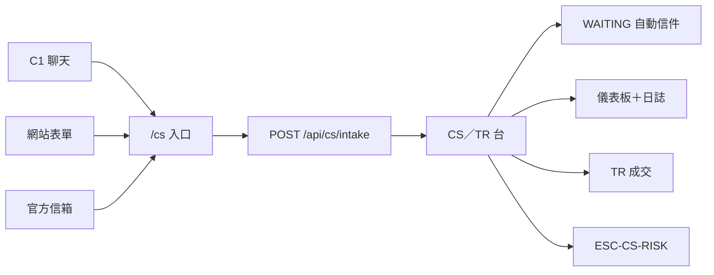

# CRMP 開放議題

**文件編號：** CRMP-OI-001 · **版本：** 1.5 · **互動看板：** [/admin/docs/open-issues](/admin/docs/open-issues) · **進度雙生：** [/admin/docs/progress](/admin/docs/progress)

CRMP 管理後台／控制面計畫的**暫定**開放議題清單。前提明示：

1. **Monitor 2.0** 仍在新增指標 — CRMP 同步，不擁有登錄表。  
2. **CRMP** 生產範圍仍處**初始設計**（原型台面已交付）。  
3. **技術細節**與**資源規劃**仍開放（見 [生態導入評估](/admin/docs/ecosystem)）。

狀態：**已規劃 · 已啟動 · 進行中 · 延期 · UAT · 上線 · 日常**。每一項含**負責 BU**、**依賴**與暫定 **ETA**（至 **2027 年底**）。

互動清單資料源：`platform/src/lib/docs/open-issues.ts`（**20 項**，OI-01 … OI-20）。新 CS／TR 功能是這 20 項上的**目錄**，不是額外編號。進度追蹤仍為 **20 欄**。管理後台看板可依領域／BU／狀態篩選並勾選明細。

---

## CS／TR 功能目錄

互動雙生：在 [/admin/docs/open-issues](/admin/docs/open-issues) 篩選 **CS／TR**（`data-testid="oi-cs-catalogue"`）。兩項**主案**負責大門與核身庫／成交帶。六項**支援**涵蓋 RAG 樹、Lark 種子、UAT 包、手機、原型 UAT 窗口與文件。原型已勾 vs 正式仍開放 — 連接器、核身庫、成交帶、SMTP 與即時量仍開著。

| 種類 | ID | 功能 | 畫面／網址 | 原型已交付 | 正式仍開放 |
|---|---|---|---|---|---|
| 主案 | OI-19 | 正式 C1／表單／信箱連接器 | `/cs`、台面、儀表板、日誌、資料、`POST /api/cs/intake` | 入口、等待迴圈、儀表板／日誌／資料、分類＋嚴重度直回 vs POC（UAT-46、UAT-51、UAT-52、UAT-53） | 簽章 C1、表單 HMAC、信箱閘道、正式 SMTP、即時量、無靜默丟失 SLA |
| 主案 | OI-20 | CS／TR 核身庫與成交帶還原 | CS 核身庫、台面、資料來源、示範 Messenger | 核身庫團隊、ESC-CS-KYC 僅旗標、TR 分流、具名 POC 暫扣、列出 MT4／MT5 成交帶（UAT-53） | 正式核身庫、`cs.followup_cap` 寄信、即時成交帶、即時 Messenger 升級、CS Lead 豁免稽核 |
| 支援 | OI-05 | 知識樹＋RAG 語料（`CS_SERVICE`／`TRADING_EXEC`） | 知識樹、RAG、AI 技能 | 樹幹＋`cs-*` 葉（UAT-50） | 語料負責人、退役節奏、技能↔文件綁定、`propose_rag` SLA |
| 支援 | OI-08 | 生產 Lark 互動卡片（CS／TR 頻道） | Lark 整合 | 模擬 Lark 即時通訊卡片（警報＋升級）；確認／升級／排除／結案呼叫 CRMP（UAT-36） | 正式 Lark 應用／webhook／SSO；正式 CS WAITING／上限卡片 |
| 支援 | OI-09 | 風險負責人 UAT 出口含 CS／TR 目錄 | UAT 清單 v2.7 | v2.7 包（52 案、跳過 UAT-45）已索引 CS／TR 含 UAT-53 | 正式 RO 簽核 UAT-25／46／47／48／50／51／52／53＋四條 CS 關卡 |
| 支援 | OI-11 | 管理後台 UX 打磨 — CS／TR 手機寬 | 台面、儀表板、日誌、資料 | 台面列表→案件；儀表板／日誌／資料／／cs 分頁／RAG 閘道卡片雙檔（UAT-18） | 原生手機 App；其餘密表作日常 |
| 支援 | OI-14 | 原型 AI 台面 UAT 窗口含 CS／TR 大門 | `/cs`、台面、技能、等待迴圈、儀表板、日誌、資料 | CS／TR 大門已交付供 UAT-46…53 | 正式 UAT 簽核（OI-09） |
| 支援 | OI-15 | 文件與網址目錄跟上（使用手冊 §9.3／UAT v2.7） | 使用手冊、網址目錄、UAT、開放議題、進度 | 使用手冊 §9.3.10＋網址目錄 CS／TR＋UAT 目錄 v2.7＋開放議題 v1.5 | 每次交付後進度保持同步 |

### 公開網址（CS／TR）

永久 Pages 來源：`https://hxyan2020.github.io/PRD/crmp-plus/`。

| 畫面 | 路徑 |
|---|---|
| 客戶入口 | `/cs` |
| CS／TR 台 | `/admin/cs-desk` |
| CS／TR 儀表板 | `/admin/cs-dashboard` |
| CS／TR 日誌 | `/admin/cs-log` |
| CS／TR 資料 | `/admin/cs-data` |
| 進件 API | `POST /api/cs/intake` · `GET /api/cs/intake` |
| 負載 | `GET /api/cs?view=dashboard` · `log` · `data` |

---

## 依 BU 摘要

| BU | ID | 重點 |
|---|---|---|
| **Monitor** | OI-01、OI-13 | 指標擴充；工單雙向回寫 |
| **Product** | OI-02、OI-15、OI-18 | 設計凍結；文件日常（含 CS／TR 目錄）；多法人租戶 |
| **CS** | OI-19 | 正式 C1／表單／信箱連接器（目錄主案） |
| **TR** | OI-20 | CS／TR 核身庫與成交帶還原（目錄主案） |
| **System** | OI-03、OI-06、OI-11、OI-16 | 技術／資源；SSO；UX（CS／TR 手機寬）；可觀測性 |
| **AI** | OI-04、OI-05、OI-14 | 生產 LLM；RAG CS_SERVICE／TRADING_EXEC；原型 UAT 含 CS／TR 大門 |
| **Ops** | OI-07、OI-08、OI-17 | 控制適配；Lark 卡片（CS／TR 種子）；緊急開關 |
| **Risk Owner** | OI-09 | UAT 出口＋政策門檻（v2.6 包 CS／TR 目錄） |
| **Pricing** | OI-10 | LP／定價饋送契約 |
| **GRC** | OI-12 | 證據保存、遮罩、稽核匯出（CS 進件不存證件圖） |
| **All** | OI-15 | 文件／網址目錄跟上 |

---

## 總表

| ID | 優先 | 領域 | BU | 狀態 | 暫定 ETA | 標題 |
|---|---|---|---|---|---|---|
| OI-01 | P0 | Monitor | Monitor | 進行中 | 2027-Q2 | Monitor 2.0 指標擴充 |
| OI-02 | P0 | Product | Product | 已啟動 | 2027-Q1 | CRMP 控制面 — 初始設計凍結 |
| OI-03 | P0 | System | System | 已規劃 | 2027-Q1 | 技術架構與資源規劃 |
| OI-04 | P1 | AI | AI | 進行中 | 2027-Q3 | 生產 LLM 根因＋獨立挑戰者 |
| OI-05 | P1 | AI | AI | 已啟動 | 2027-Q1 | 知識樹＋RAG 語料治理 |
| OI-06 | P0 | System | System | 已規劃 | 2027-Q2 | SSO／IdP＋SCIM |
| OI-07 | P0 | Ops | Ops | 已規劃 | 2027-Q4 | 真實控制適配 |
| OI-08 | P1 | Ops | Ops | 已規劃 | 2027-Q2 | 生產 Lark 互動卡片 |
| OI-09 | P1 | RO | Risk Owner | 已啟動 | 2026-Q4／2027-Q1 | 風險負責人 UAT 出口＋政策門檻 |
| OI-10 | P2 | Pricing | Pricing | 已規劃 | 2027-Q3 | LP／定價饋送契約 |
| OI-11 | P2 | Platform | System | 進行中 | 2026-Q4 | 管理後台 UX 打磨 |
| OI-12 | P1 | GRC | GRC | 已規劃 | 2027-Q4 | 證據保存、遮罩與稽核匯出 |
| OI-13 | P1 | Monitor | Monitor | 延期 | 2027-Q3 | Monitor 工單雙向回寫 |
| OI-14 | P2 | AI | AI | UAT | 2026-10／11 | 原型 AI 台面功能 — UAT |
| OI-15 | P3 | Product | All | 日常 | 持續→2027-12 | 文件與網址目錄跟上後台 |
| OI-16 | P1 | System | System | 已規劃 | 2027-Q3 | 可觀測性 — 脊柱 SLO／AI／誤報 |
| OI-17 | P1 | Ops | Ops | 已規劃 | 2027-Q4 | 全域緊急開關 |
| OI-18 | P2 | Product | Product | 已規劃 | 2027-Q4→12 | 多法人／品牌租戶就緒 |
| OI-19 | P1 | CS | CS | 已啟動 | 2027-Q2 | 正式 C1／表單／信箱連接器 |
| OI-20 | P1 | TR | TR | 已啟動 | 2027-Q3 | CS／TR 核身庫與成交帶還原 |

---

## 明細勾選（依 BU）

### Monitor

#### OI-01 — Monitor 2.0 指標擴充
**BU：** Monitor · **狀態：** 進行中 · **ETA：** 2027-Q2 · **依賴：** Monitor 路線；命名；同步契約

- [ ] 隨 Monitor 加指標發布可加性的 `M2-*` 命名與類別對照  
- [ ] 新代碼在 Monitor 2.0＋即時警報與追蹤的提示／深連結契約保持穩定  
- [ ] 同步／`run_detectors` 容忍未知加性欄位，不造成 CRMP schema 分叉  
- [ ] 風險領域 P0–P3 情境對應新的主指標  
- [ ] 每波 Monitor 指標落地時更新 UAT 包  

#### OI-13 — Monitor 工單雙向回寫（*延期*）
**BU：** Monitor · **狀態：** 延期 · **ETA：** 2027-Q3 · **依賴：** Monitor 寫入 API；OI-01；OI-03

- [ ] 入站 webhook：Monitor 警告／違規 → CRMP upsert＋AI RCA  
- [ ] 出站 PATCH：在即時警報與追蹤 Ack／排除／結案／承辦人 → Monitor 工單  
- [ ] 對 Monitor 沙盒做契約測試  
- [ ] 以真實拉／推取代 `sync_monitor2` 假 `pulled_alerts: 5`  
- [ ] 無 RO 政策前禁止 AI 單獨自動關閉 BREACH／CRITICAL  

*現況：* Ack／排除／結案只改本機 SQLite — 無真實 Monitor HTTP。

---

### Product

#### OI-02 — CRMP 控制面初始設計凍結
**BU：** Product · **狀態：** 已啟動 · **ETA：** 2027-Q1 · **依賴：** RO＋平台負責人工作坊；生態 A–B

- [ ] 工作坊：脊柱階段 vs 首頁計數 vs 稽核平面  
- [ ] 起草 BU RACI（AI／System／RO／Pricing／Ops／Monitor／GRC／CS／TR）  
- [ ] 定義雙重控制寫路徑（Maker→Checker→控制匯流排）  
- [ ] 畫面分級：日常台面／僅試點／僅限人類黑名單  
- [ ] 風險負責人＋平台負責人簽核設計凍結  

#### OI-15 — 文件與網址目錄日常
**BU：** All · **狀態：** 日常 · **ETA：** 持續→2027-12 · **依賴：** 文件負責人；各功能交付

- [x] 使用手冊 §9.3＋網址目錄 CS／TR＋UAT 目錄 v2.6（台面、`/cs`、儀表板、日誌、資料）  
- [ ] 每次選單交付後對齊 UG／PRD／TSD／UAT／路線圖／生態  
- [ ] 狀態／ETA 變更時更新開放議題＋進度  
- [ ] 網址目錄列出公開＋管理路徑與正確權限  
- [x] 每份文件頁 EN＋繁中對齊  

#### OI-18 — 多法人／品牌租戶就緒
**BU：** Product · **狀態：** 已規劃 · **ETA：** 2027-Q4→12 · **依賴：** OI-02；OI-06；法人清單

- [ ] 定義租戶＝法人（或品牌）模型  
- [ ] 隔離警報／RAG／技能／Lark 路由／稽核匯出  
- [ ] 只讀跨法人高階彙總（如需要）  
- [ ] 設計允許時兩套 UAT 種子（如 VFSC vs FCA）  

---

### CS

#### OI-19 — 正式 C1／表單／信箱連接器
**BU：** CS · **狀態：** 已啟動 · **ETA：** 2027-Q2（連接器）／原型 UAT 現可測 · **依賴：** C1 供應商；信箱 Graph／IMAP；正式 SMTP；OI-03

- [x] 公開 `/cs` 入口把 C1、表單與信箱打同一進件 API  
- [x] 進件回覆以 CSR-XXXX／channel_ref／In-Reply-To 對案並關閉 WAITING 自動信件  
- [x] 原型 CS／TR 儀表板＋日誌（種子案，UAT-51）  
- [x] 原型 CS／TR 資料：關卡、`cs.*`、核身庫團隊（UAT-52）  
- [x] 原型資料齊全後 AI 分類＋嚴重度＋直回 vs POC（UAT-53）  
- [x] 對 C1 測試環境做沙盒 UAT（UAT-46）— 原型台面  
- [ ] 以簽章 C1 webhook＋防重放取代 demo-c1 token  
- [ ] 網站／App 表單 HMAC 接入同一進件 API  
- [ ] support@ 與 complaints@ 信箱閘道（Graph 或 IMAP）  
- [ ] 正式 SMTP 跑自動信件等待迴圈（非 console／示範）  
- [ ] 儀表板／日誌即時量（非僅種子）  
- [ ] CS／TR 台無靜默丟失 SLA（每筆進件含渠道戳記）  

*今日：* `POST /api/cs/intake` 搭配 `x-cs-intake-token: demo-c1`、公開 `/cs` 入口、CSR-XXXX 進件對案、種子儀表板／日誌／資料，以及 `/admin/cs-desk` 模擬按鈕。

---

### TR

#### OI-20 — CS／TR 核身庫與成交帶還原
**BU：** TR · **狀態：** 已啟動 · **ETA：** 2027-Q3／原型 UAT 現可測 · **依賴：** OI-19；CRM／KYC；oneZero MT；OI-07

- [x] 原型 CS 核身庫團隊嵌在客服底下（UAT-38）  
- [x] 原型 ESC-CS-KYC 關卡＋SKILL-CS-ID-VERIFY 僅旗標核身（無證件圖）  
- [x] 原型台面 TR 分流＋ESCALATED_RISK（UAT-48）  
- [x] 原型齊全核身交具名 POC、不直回（UAT-53）  
- [x] 資料來源／CS-TR 資料列出 MT4／MT5 成交帶（UAT-39）  
- [ ] 正式 KYC 證件庫＋UID 核對；身分驗證須待回覆或 CS Lead 豁免才可關  
- [ ] 正式自動追問信（不清楚／需核身）套用 `cs.followup_cap`  
- [ ] 即時 TR 自 oneZero／MT4／MT5 成交帶還原成交 vs LP  
- [ ] 即時升級風控寫入 Messenger 執行緒＋人工干預關卡  
- [ ] CS Lead 豁免寫入 Vantage＋CRMP 稽核平面  

*今日：* 啟發式 AI 寄信並等待（上限來自 `cs.followup_cap`）；TR 分流與 ESCALATED_RISK 為台面本地；核身為僅旗標。

---

### System

#### OI-03 — 技術架構與資源規劃
**BU：** System · **狀態：** 已規劃 · **ETA：** 2027-Q1 · **依賴：** OI-02；基礎設施；財務 SOW

- [ ] 目標架構：Postgres＋HA、密鑰庫、環境隔離  
- [ ] IdP／SCIM 整合草圖（餵給 OI-06）  
- [ ] APM＋脊柱 SLO 草圖（延遲、誤報、AI 成本）  
- [ ] FTE 計畫對照生態評估約 7–11 穩態人力帶  
- [ ] 預算重估對照 A–C $730k–$1.3M 與階段 D 年費  
- [ ] 供財務／供應商審查的 SOW 包  

#### OI-06 — SSO／IdP＋SCIM
**BU：** System · **狀態：** 已規劃 · **ETA：** 2027-Q2 · **依賴：** Okta／Entra；OI-03

- [ ] 選定 IdP 與 SCIM 群組→角色對照  
- [ ] 從 staging／prod 移除共用示範密碼  
- [ ] 在 IAM 強制 AI 管理＋干預的 Maker≠Checker  
- [ ] 將 BU 與團隊對映目錄群組  
- [ ] 以企業 IdP 驗收登入角色  

#### OI-11 — 管理後台 UX 打磨
**BU：** System · **狀態：** 進行中 · **ETA：** 2026-Q4 日常 · **依賴：** 文件；前端；i18n

- [x] 導覽抽屜＋Messenger 列表→執行緒＋多頁手機卡片  
- [x] 即時警報與追蹤篩選手機兩欄  
- [x] Lark／市場情報來源＋掃描／AI 管理／網址目錄手機卡片  
- [x] 確認表主按鈕手機全寬（`action-row`）  
- [x] CS／TR 台、儀表板、日誌與資料在約 390px 可用（UAT-18）  
- [ ] 每次選單交付後的文件對齊日常  

#### OI-16 — 可觀測性
**BU：** System · **狀態：** 已規劃 · **ETA：** 2027-Q3 · **依賴：** OI-03；OI-04；SRE

- [ ] 定義脊柱階段延遲 SLO  
- [ ] 儀表板：AI RCA＋挑戰延遲／成本  
- [ ] 影子模式誤報／排除率追蹤  
- [ ] Monitor＋Lark＋控制匯流排適配健康檢查  
- [ ] CRMP 控制面頁面值班手冊  

---

### AI

#### OI-04 — 生產 LLM 根因＋獨立挑戰者
**BU：** AI · **狀態：** 進行中 · **ETA：** 2027-Q3 UAT · **依賴：** 提示詞金庫；RM-03／04；RAG 雙重控制

- [ ] 選定主 LLM 供應商＋獨立挑戰供應商／提示路徑  
- [ ] BREACH／CRITICAL RCA 品質閘道評測架  
- [ ] 成本與延遲 SLO＋告警（RM-14）  
- [ ] 維持 `propose_rag` 人工閘道／AI 寫入黑名單  
- [ ] 將一線／二線 AI 管理卡片接到生產模型  
- [ ] 任何寫路徑耦合前完成影子模式接受  

#### OI-05 — 知識樹＋RAG 語料治理
**BU：** AI · **狀態：** 已啟動 · **ETA：** 2027-Q1 · **依賴：** rag.manage 人力；技能目錄

- [x] 原型 CS_SERVICE／TRADING_EXEC 樹幹＋cs-* RAG 葉（UAT-50）  
- [ ] 按領域（CFD／加密／營運／CS_SERVICE／TRADING_EXEC）指定語料負責人  
- [ ] 過期 RAG 葉的退役／刷新節奏  
- [ ] 技能↔文件綁定覆蓋目標  
- [ ] `propose_rag` 佇列深度的 Maker-Checker SLA  
- [ ] 適用處將語料列標到 Monitor `M2-*`  

#### OI-14 — 原型 AI 台面功能 — UAT
**BU：** AI · **狀態：** UAT · **ETA：** 2026-10／11 · **依賴：** UAT-01…52（跳過 UAT-45）；RO 行程

- [x] 即時警報與追蹤＋偵測器併入 Monitor 2.0  
- [x] 一線／二線 AI 管理·分組管線·干預操作者信箱  
- [x] `propose_rag`·ESC-DEFAULT＋係數·RAG 葉·MonitorCode  
- [x] 可編輯角色＋稽核平面分流＋回滾  
- [x] CS／TR 大門供 UAT：`/cs`、台面、技能、等待迴圈、儀表板、日誌、資料（UAT-46…52）  
- [ ] 正式 UAT 簽核（OI-09）  

---

### Ops

#### OI-07 — 真實控制適配
**BU：** Ops · **狀態：** 已規劃 · **ETA：** 2027-Q4（閘控） · **依賴：** 控制匯流排；OI-04；ESC-DEFAULT

- [ ] 盤點控制：停市、槓桿、擴點、暫停跟單、封鎖帳戶  
- [ ] 對 staging 控制匯流排做 dry-run 適配  
- [ ] 不可逆控制的 Checker 路徑  
- [ ] 全域＋逐適配緊急開關（銜接 OI-17）  
- [ ] 營運窗口操作手冊；RO 影子誤報閘門  

#### OI-08 — 生產 Lark 互動卡片
**BU：** Ops · **狀態：** 已啟動 · **ETA：** 2027-Q2 UAT · **依賴：** Lark 核准；密鑰庫；升級路徑

- [x] Lark 整合種子 CS／TR 頻道 `oc_cs_c1`／`oc_cs_kyc`／`oc_tr_dealing`（UAT-36）  
- [x] 原型 Lark 即時通訊卡片：警報＋升級的確認／升級／排除／結案（UAT-36）  
- [x] 依匹配 Lark chat_id／ESC-DEFAULT＋CS 關卡路由原型卡片  
- [x] 保留 Demo Messenger 供 UAT／備援  
- [ ] Lark 應用／機器人核准；密鑰入庫  
- [ ] 正式 webhook 卡片＋CS WAITING／上限＋SSO 身分  
- [ ] 高階決策：企業即時通訊選 Lark 或 Teams  

#### OI-17 — 全域緊急開關
**BU：** Ops · **狀態：** 已規劃 · **ETA：** 2027-Q4 · **依賴：** OI-07；OI-08；設定旗標

- [ ] 緊急開關矩陣：自動技能／情報推送／各寫入適配  
- [ ] UI＋API 切換開關並寫稽核列（Vantage 平面）  
- [ ] UAT 演練：在 RO 觀察下關閉與恢復  
- [ ] 文件化誰可切換開關（職責分離）  

---

### Risk Owner

#### OI-09 — 風險負責人 UAT 出口＋政策門檻
**BU：** Risk Owner · **狀態：** 已啟動 · **ETA：** 2026-Q4／2027-Q1 · **依賴：** UAT 包 v2.6；BU 與團隊 RACI；AI 管理

- [ ] 執行互動式 UAT-01…52（跳過 UAT-45）並留證據註記，含 CS／TR 目錄 v2.6  
- [ ] 簽核 UAT 退出標準，含 CS／TR 主案（UAT-25、46、47、48、50、51、52）  
- [ ] 設定第二 AI 嚴重度政策（預設 BREACH）  
- [ ] 接受 ESC-DEFAULT 兜底＋四條 CS／TR 關卡（ESC-CS-24-7／ESC-CS-KYC／ESC-TR-DEAL／ESC-CS-RISK）  
- [ ] 演練升級 Primary→Secondary→RO→Exec  

---

### Pricing

#### OI-10 — LP／定價饋送契約
**BU：** Pricing · **狀態：** 已規劃 · **ETA：** 2027-Q3 · **依賴：** 供應商 RFP；Monitor ID；資料來源

- [ ] 對授權新聞／市場情報供應商發 RFP  
- [ ] 保證金／擴點情境的 LP 定價饋送契約  
- [ ] 在資料來源登錄饋送（負責人＋節奏）  
- [ ] 適用處將饋送健康綁到 Monitor `M2-*`  
- [ ] 與 RO＋AI 訂定評分／誤報政策  

---

### GRC

#### OI-12 — 證據保存、遮罩與稽核匯出
**BU：** GRC · **狀態：** 已規劃 · **ETA：** 2027-Q4 · **依賴：** 法務；OI-06；Postgres

- [x] 原型稽核平面分流（CRMP／Vantage Markets 管理）＋回滾  
- [x] 原型：CS 進件不存證件圖；公開 GET 狀態無個資（FR-42）  
- [ ] 證據摘錄的法遵保存＋遮罩政策  
- [ ] 排程保存／清除作業  
- [ ] 稽核就緒匯出包（超越 UI 分頁）  
- [ ] 多法人資料駐留聲明  

---

## 文件控制

| 版本 | 日期 | 說明 |
|---|---|---|
| 1.0 | 2026-10-05 | 初版開放議題包接入管理文件 |
| 1.1 | 2026-10-05 | 稽核平面分流＋回滾；可編輯角色；升級維度 |
| 1.2 | 2026-10-05 | 選單真相：即時警報與追蹤；偵測器→Monitor 2.0 |
| 1.3 | 2026-10-05 | 依 BU 詳細勾選；OI-16／17／18；看板渲染勾選明細 |
| 1.4 | 2026-10-06 | OI-19 C1／表單／信箱連接器；OI-20 CS／TR 核身庫＋成交帶；20 項 |
| 1.5 | 2026-10-06 | 同一 20 項上的 CS／TR 功能目錄（主案 OI-19／20＋支援 05／08／09／11／14／15）；原型已勾 vs 正式仍開放；互動 CS／TR 篩選 |

**負責人：** demo platform owner（`haixiang.yan@hytechc.com`）
