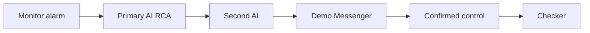

# CRMP Product Requirements Document (PRD)

**Document ID:** CRMP-PRD-001  
**Status:** Prototype / Demo-ready  
**Products in scope:** CFD + Crypto Exchange  
**Owner:** YAN Haixiang · **Approver:** Risk Owner  
**Related:** [TSD](/admin/docs/tsd) · [User Guide](/admin/docs/user-guide) · [UAT](/admin/docs/uat) · [Ecosystem Eval](/admin/docs/ecosystem)

---

## 1. Problem statement

Vantage Markets operates CFD and crypto risk across Monitor 2.0 indicators, desks, and messenger escalation. Today, alarm → root cause → action is fragmented: analysts re-derive context, AI suggestions (if any) lack an independent challenge, and irreversible controls are hard to audit end-to-end.

**We need a centralised risk management plane that:**
- Turns Monitor alarms into explainable AI RCA  
- Challenges high-severity RCA with a second independent AI  
- Lets operators act in messenger (evidence, escalate, dismiss, close, controls)  
- Enforces maker/checker and keeps AI off human-only surfaces  
- Leaves a single spine + audit trail  

---

## 2. Goals

| # | Goal | Measurable outcome |
|---|---|---|
| G1 | One spine | Detect → Analyse → Challenge → Escalate → Intervene → Audit is visible in Spine Log |
| G2 | Certainty routing | Known skills auto-execute when certain; else RAG + human review |
| G3 | Dual-AI on high severity | 100% of BREACH/CRITICAL analyses have second-AI challenge |
| G4 | SoD on AI config | AI Admin changes require maker ≠ checker |
| G5 | Messenger-native ops | Operators can triage without leaving chat for core actions |
| G6 | Market awareness | 5-minute intel scan for LP-moving headlines |
| G7 | Safe AI boundary | Human-only pages/functions/fields listed and denied to AI |

---

## 3. Non-goals (this prototype)

| Non-goal | Rationale |
|---|---|
| Production Lark webhook delivery | Mocked via audit / outbox / in-app Demo Messenger |
| Billed production LLM APIs | Heuristic skill/RAG/challenger engines stand in |
| Full MT4/MT5/LP write adapters | Deep-links + mock admin refs only |
| Multi-brand tenancy at scale | Single demo tenancy |
| Replacing Monitor 2.0 | CRMP consumes Monitor; does not rebuild it |

---

## 4. Personas & jobs-to-be-done

| Persona | Primary jobs |
|---|---|
| **Risk Owner** | Accept/reject AI packs; escalate; approve irreversible controls; run UAT exit |
| **Risk Analyst** | Triage alerts; challenge AI in messenger; add context |
| **Ops Lead / Analyst** | Propose halt/block/widen/pause-copy; maker-confirm into admin |
| **AI Engineer** | Skills, RAG, detectors, second-opinion threshold, AI Admin proposals |
| **System Admin** | Users/roles, settings, AI access blocklist, audit hygiene |
| **Viewer** | Read-only oversight (no AI Admin / operate) |

---

## 5. User journeys (happy path)

### 5.1 High-severity alarm → dual-AI → messenger close
1. Monitor indicator breaches (e.g. COPY concentration).  
2. CRMP creates alert + AI analysis (`SKILL_MATCH` or `RAG_REASONING`).  
3. If severity ≥ `ai.second_opinion_severity` (default BREACH), run `crmp-challenger-v0`.  
4. Risk Analyst opens Demo Messenger thread; **Show evidence**; optionally challenges via chatbot.  
5. Risk Owner reviews primary + challenger; **Close (accept AI)** or escalates / requests control.

### 5.2 Control with double confirm + checker
1. Operator selects recommended action (e.g. Block user account).  
2. Double-confirm gate → mock Vantage admin ref + link.  
3. If `needs_checker`, Checker approves via Interventions / instructed path.  
4. Audit + Spine record maker/checker outcome.

### 5.3 AI Admin change
1. Maker proposes setting/model/policy in AI Admin.  
2. Distinct Checker approves.  
3. Self-approve is rejected.

---

## 6. Functional requirements

### 6.1 P0 — must ship in prototype

| ID | Requirement | Acceptance sketch |
|---|---|---|
| FR-01 | Sync/display Monitor 2.0 indicators & raise alarms | Indicators EQ/MRG/COPY visible; simulate alarm works |
| FR-02 | Skill-match RCA with step execution log | COPY breach → `SKILL_MATCH` + skill run steps |
| FR-03 | RAG RCA when skill uncertain | EQ path can yield `RAG_REASONING` + evidence |
| FR-04 | Independent second-AI challenger ≥ threshold | BREACH/CRITICAL show panel + CHALLENGER evidence; WARN default skip |
| FR-05 | Demo Messenger: evidence / chat / escalate / dismiss / close | Each action mutates thread + audit |
| FR-06 | Recommended controls + double-confirm → admin ref | Block/halt/etc. produce admin_ref; checker note when required |
| FR-07 | AI Admin maker ≠ checker | Same user cannot approve own proposal |
| FR-08 | AI access blocklist (pages/functions/fields) | UI lists human-only targets with reasons |
| FR-09 | Spine + Audit for AI/messenger/intervention events | Events correlatable within ~1 minute |
| FR-10 | RBAC for admin surfaces | Viewer blocked from AI Admin operate paths |

### 6.2 P1 — should ship in prototype

| ID | Requirement | Acceptance sketch |
|---|---|---|
| FR-11 | Market intel 5-min scan + outbox card format | Scan runs on localhost; GitHub Pages uses a client demo scan (no 405). Findings/outbox/scan log update in the desk. |
| FR-12 | Risk Log analytics | Page loads timeline / analytics for risk events |
| FR-13 | Bilingual product docs (EN / zh-Hant) | PRD, TSD, User Guide, UAT, Ecosystem toggle works |
| FR-14 | Responsive admin (web + mobile) | 390px: drawer + messenger master-detail; no page overflow |
| FR-15 | Enriched skill risk scenarios / chains | Skills board shows scenarios with thresholds & escalation |
| FR-16 | URL catalog for demo navigation | `/admin/docs/urls` lists admin/API/data paths |

### 6.3 P2 — later (ecosystem phases)

| ID | Requirement |
|---|---|
| FR-17 | Production Lark interactive cards |
| FR-18 | Monitor bidirectional ticket write-back |
| FR-19 | Real trading control bus with dry-run |
| FR-20 | Production LLM + eval harness; diversified challenger vendor |

---

## 7. Non-functional requirements

| ID | Area | Requirement |
|---|---|---|
| NFR-01 | Latency | Prototype: alarm → dual-AI pack typically &lt; 60s |
| NFR-02 | Auditability | Mutations to alerts/analyses/messenger/AI Admin emit audit |
| NFR-03 | Security | AI principals must not receive blocklisted rights |
| NFR-04 | SoD | Maker/checker enforced for AI Admin; checker for designated controls |
| NFR-05 | Availability | Demo single-node SQLite acceptable; production needs HA (see Ecosystem) |
| NFR-06 | i18n | Operator docs EN + zh-Hant; UI nav language toggle |
| NFR-07 | Accessibility (basic) | Touch targets usable on mobile; critical actions labeled |

---

## 8. Detailed acceptance criteria (prototype gate)

1. **Skill + challenger:** Simulate COPY BREACH → `SKILL_MATCH` + Second AI panel with ≥1 HIGH improvement when challenged.  
2. **Threshold:** WARN-only EQ simulate does **not** create challenge under default BREACH threshold.  
3. **Messenger path:** Show evidence posts vault; Escalate advances path; Dismiss/Close update statuses.  
4. **Controls:** Block account → double confirm → admin_ref; checker follow-up when required.  
5. **AI Admin:** Distinct checker required; self-approve blocked.  
6. **Coverage:** UAT window BREACH/CRITICAL samples 100% challenged (backfill allowed).  
7. **Docs:** PRD/TSD/User Guide/UAT/Ecosystem render EN and zh-Hant.  
8. **Mobile:** Messenger list→thread→back works at ~390px without document overflow.

Formal execution: [UAT Checklist](/admin/docs/uat) (UAT-01 … UAT-20).

---

## 9. Success metrics (pilot)

| Metric | Target |
|---|---|
| Mean time alarm → dual-AI pack | &lt; 60s (prototype) |
| % BREACH+ with challenger attached | 100% |
| False-alarm dismissals audited | 100% |
| AI Admin changes with distinct checker | 100% |
| Human-only surfaces documented in blocklist | 100% of agreed inventory |
| Critical UAT cases Pass | 100% |

---

## 10. Scope boundaries & dependencies

**Depends on:** Monitor 2.0 indicator model; Lark as corporate messenger (future); Vantage admin for real controls; IdP for production SSO.  
**Provides to:** Risk/Ops desks a single control plane UI + audit spine.  
**Out of scope until Phase B/C:** Live webhooks, write adapters, Postgres HA (see [Ecosystem Eval](/admin/docs/ecosystem)).

---

## 11. Risks & open questions

| Risk / question | Mitigation |
|---|---|
| Heuristic AI overconfidence | Mandatory second AI on high severity; needs_human on PARTIAL/DISAGREE |
| Operators bypass messenger | Keep admin deep-links; audit both paths |
| Premature write automation | Shadow mode before control bus (ecosystem Phase C) |
| Which messenger is corporate standard? | Lark assumed; Teams adapter TBD |
| Data retention for evidence PII | Legal review before production identifiers |

---

## 12. Release plan (prototype → production)

| Stage | Outcome |
|---|---|
| Prototype (now) | Demo spine, dual-AI, messenger, docs, UAT pack |
| Phase A | Harden auth/hosting/observability |
| Phase B | Live Monitor + Lark notify (read path) |
| Phase C | Supervised write path + kill-switches |
| Phase D | Model ops / challenger diversity |

---

## 13. Approvals

| Role | Name | Decision | Date |
|---|---|---|---|
| Platform owner / docs owner | YAN Haixiang | Named | 2026-10-04 |
| Risk Owner | Alex Chen (demo) | Demo persona | |
| Risk Platforms PM | YAN Haixiang | Named | 2026-10-04 |
| Engineering Lead | _TBD_ | | |
| Security / GRC | _TBD_ | | |
