# CRMP Product Requirements Document (PRD)

**Document ID:** CRMP-PRD-001  
**Status:** Prototype / Demo-ready  
**Products in scope:** CFD + Crypto Exchange  
**Owner:** demo platform owner · **Approver:** Risk Owner  
**Related:** [TSD](/admin/docs/tsd) · [User Guide](/admin/docs/user-guide) · [UAT](/admin/docs/uat) · [Ecosystem Eval](/admin/docs/ecosystem)

This PRD is the product contract for **every screen and feature currently in CRMP Plus** (original CRMP Admin plus 24/7 CS/TR). That includes the public client door at [`/cs`](/cs), the three realtime connectors (C1 live chat, website form, official mailbox), the auto-email wait loop, **categorize / severity / AI solution with auto-reply or named POC review**, dedicated CS/TR SKILL.md playbooks, a **separate CS/TR dashboard and log** (not Daily Performance / Risk Log), the **CS/TR data contract** (BU / team / escalation hops / `cs.*` parameters), and the [URL Catalog](/admin/docs/urls) CS/TR section. Operator how-tos live in the [User Guide](/admin/docs/user-guide) (§9.3). Build detail lives in the [TSD](/admin/docs/tsd) (§17). Sign-off cases are [UAT-01 … UAT-53](/admin/docs/uat) (CS/TR: UAT-46…53).

---

## 1. Problem statement

Vantage Markets operates CFD and crypto risk across Monitor 2.0 indicators, desks, and messenger escalation. Today, alarm → root cause → action is fragmented: analysts re-derive context, AI suggestions (if any) lack an independent challenge, and irreversible controls are hard to audit end-to-end.

**We need a centralised risk management plane that:**
- Turns Monitor alarms into explainable AI RCA  
- Challenges high-severity RCA with a second independent AI  
- Lets operators act in messenger (evidence, escalate, dismiss, close, controls)  
- Staffs 24/7 CS (C1 / form / email via public `/cs` and `POST /api/cs/intake`) and TR dealing on the same desk  
- Emails the client when the issue is unclear or ID is needed and **waits for a reply** (cap 3) instead of guessing  
- Enforces maker/checker and keeps AI off human-only surfaces  
- Leaves a single spine + audit trail (CS_* actions included)  
- Gives every desk function a named admin page (home, performance, risk log, intel, org, settings, docs) plus a public client portal

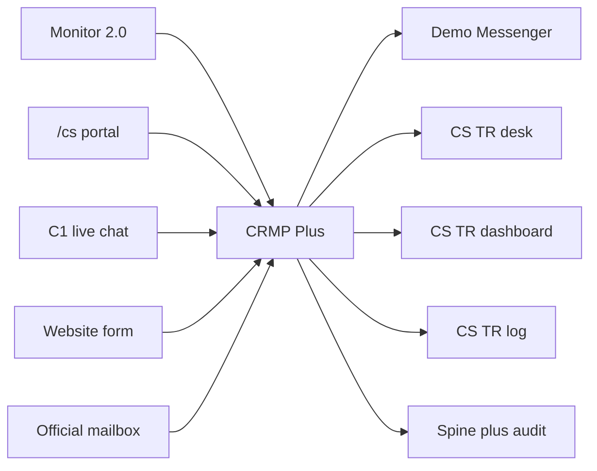

---

## 2. Goals

| # | Goal | Measurable outcome |
|---|---|---|
| G1 | One spine | Detect → Analyse → Challenge → Escalate → Intervene → Audit is visible on Admin Home spine (stage ticket counts; Spine Log tab removed) |
| G2 | Certainty routing | Known skills auto-execute when certain; else RAG + human review |
| G3 | Dual-AI on high severity | 100% of BREACH/CRITICAL analyses have second-AI challenge |
| G4 | SoD on AI config | AI Admin changes require maker ≠ checker |
| G5 | Messenger-native ops | Operators can triage without leaving chat for core actions |
| G6 | Market awareness | 5-minute intel scan for LP-moving headlines (live on localhost; demo scan on Pages) |
| G7 | Safe AI boundary | Human-only pages/functions/fields listed and denied to AI |
| G8 | Complete admin map | Every left-nav group/page in §6.4 is shipped and documented |
| G9 | Unread awareness | New work on Realtime Alert & Tracker / Messenger / Intel / Interventions / home spine / Audit / Monitor 2.0 / Risk Log shows a badge that clears when viewed |
| G10 | Public demo | GitHub Pages snapshot at `/PRD/crmp-plus/` walks the desk without 404/405 on login, messenger Open-in-admin, or Scan now |
| G11 | Named owner | Platform owner demo platform owner is a first-class persona; session persists in-browser |
| G12 | Dual public URLs | This upgraded platform is `/PRD/crmp-plus/`; original CRMP Admin stays frozen at `/PRD/crmp-admin/` |
| G13 | 24/7 CS/TR door | Three connectors + `/cs` share `POST /api/cs/intake`; unclear/ID cases email and wait (cap 3, CSR-XXXX match); five SKILL.md stamps; **dedicated dashboard + log**; catalog lists the door |

---

## 3. Non-goals (this prototype)

| Non-goal | Rationale |
|---|---|
| Production Lark webhook delivery | Mocked via audit / outbox / in-app Demo Messenger |
| Billed production LLM APIs | Heuristic skill/RAG/challenger engines stand in |
| Full MT4/MT5/LP write adapters | Deep-links + mock admin refs only |
| Multi-brand tenancy at scale | Single demo tenancy |
| Replacing Monitor 2.0 | CRMP consumes Monitor; does not rebuild it |
| Production SSO / IdP | Demo personas + cookie / localStorage session |
| Production IMAP / SMTP mailbox | Official-email connector is ingested through the same intake webhook (demo send + inbound match) |
| Storing ID document images on the ticket | ID verify asks via official mail; images stay off `cs_requests` (process vault, not a blob store) |
| CS arming trading kill-switches | CS never arms Monitor/trading controls; book-risk leaves via **Escalate to Risk** |
| TR staffing C1 around the clock | TR owns fills/slippage after CS handoff; C1 is CS 24/7 |

---

## 4. Personas & jobs-to-be-done

| Persona | Primary jobs |
|---|---|
| **Platform Owner (demo platform owner)** | Own the desk and docs; default login on the public snapshot |
| **Risk Owner** | Accept/reject AI packs; escalate; approve irreversible controls; run UAT exit |
| **Risk Analyst** | Triage alerts; challenge AI in messenger; add context |
| **Ops Lead / Analyst** | Propose halt/block/widen/pause-copy; maker-confirm into admin |
| **AI Engineer** | Skills, RAG, Monitor 2.0 detector registry, second-opinion threshold, AI Admin proposals |
| **System Admin** | Users/roles, grouped settings, AI access blocklist, audit hygiene |
| **Client (public `/cs`)** | Ask via C1 live chat, website form or official email; reply to CSR-XXXX / auto-mail until the desk has enough |
| **CS L1 (24/7 Desk)** | Triage intake; send/wait follow-ups; answer FAQ from RAG; never Resolve while WAITING |
| **CS Lead** | Take over after wait-loop cap 3; ID vault exceptions; staff the unclear queue |
| **TR Dealing Support** | Own fills, slippage, rejects after CS assign; never reprice from C1 |
| **Viewer** | Read-only oversight (no AI Admin operate) |

---

## 5. User journeys (happy path)

### 5.1 High-severity alarm → dual-AI → messenger close
1. Monitor indicator breaches (e.g. COPY concentration).  
2. CRMP creates alert + AI analysis (`SKILL_MATCH` or `RAG_REASONING`) **and** an always-on **how-to-improve** review (data source, dormant indicator health, missing reasoning, new skill pattern, tighten X→Y, response time) with a chatbot to pull data, add facts, challenge, and regenerate.  
3. If severity ≥ `ai.second_opinion_severity` (default BREACH), run `crmp-challenger-v0`.  
4. Risk Analyst opens Demo Messenger thread; **Show evidence**; optionally challenges via chatbot.  
5. Risk Owner reviews primary + challenger; **Close (accept AI)** or escalates / requests control.

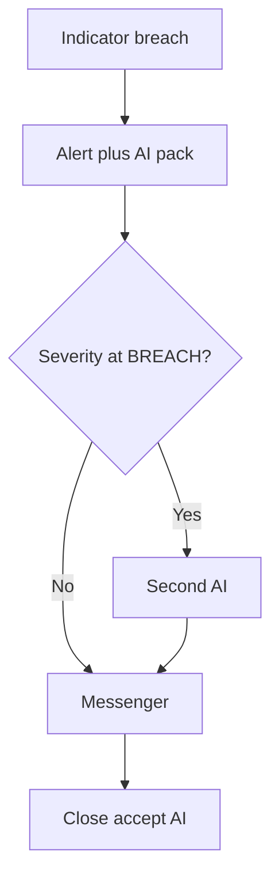

### 5.2 Control with double confirm + checker
1. Operator selects recommended action (e.g. Block user account).  
2. Double-confirm gate → mock Vantage admin ref + link.  
3. If `needs_checker`, Checker approves via Interventions / instructed path.  
4. Audit + Spine record maker/checker outcome.

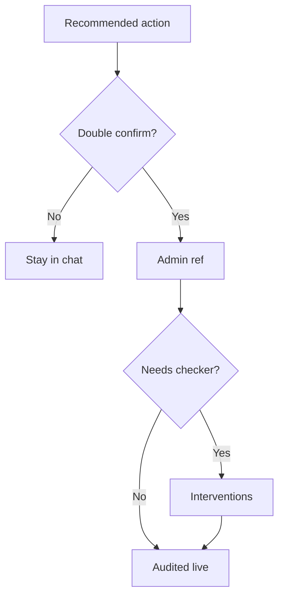

### 5.3 AI Admin change
1. Maker proposes setting/model/policy in AI Admin.  
2. Distinct Checker approves.  
3. Self-approve is rejected.

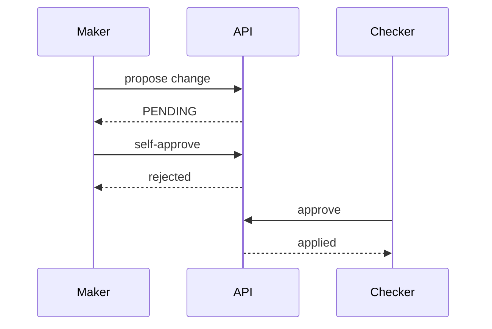

### 5.4 Market intel on public snapshot
1. Operator opens Market Intelligence on GitHub Pages.  
2. **Scan now** runs the client demo scan (same templates as live).  
3. Findings, outbox and scan log update locally. No 405.

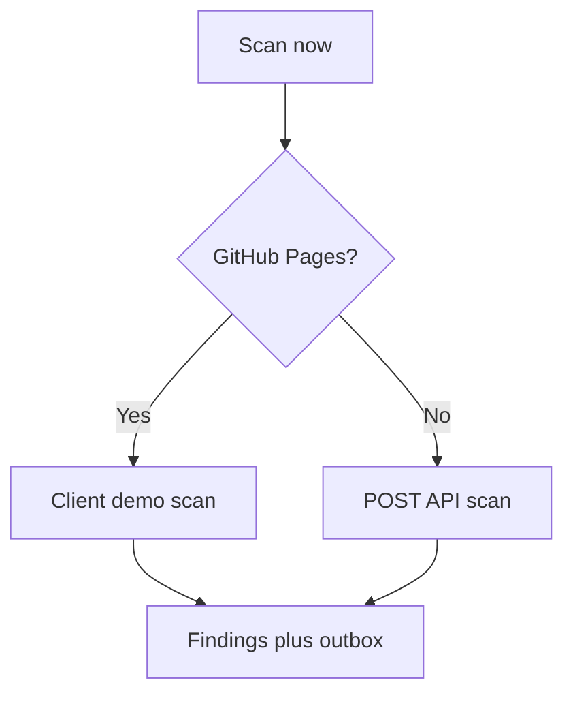

### 5.5 Knowledge tree drill-down
1. Operator opens Knowledge Tree, filter CFD or Crypto if needed.  
2. Clicks a domain (e.g. LP_HEDGE) to fan out skills.  
3. Clicks a skill; inspector fills; **Enter** opens the SKILL.md playbook.

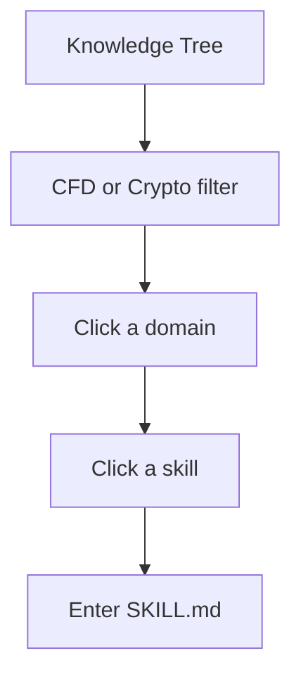

### 5.6 Unread badge
1. A Monitor 2.0 **Run all indicators** / intel scan / AI simulate creates new work.  
2. Left-nav badge increments (Realtime Alert & Tracker, Messenger, Intel, etc.).  
3. Opening that tab stores “seen” and the badge drops to zero for this browser.

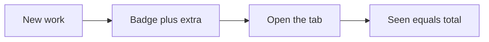

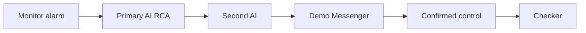

### 5.7 Client intake → wait loop → reply
1. Client opens public [`/cs`](/cs) (or C1 / website form / official mailbox). All three post `POST /api/cs/intake`.  
2. AI stamps a dedicated skill (`SKILL-CS-CLARIFY` or `SKILL-CS-ID-VERIFY` when thin or ID is the ask).  
3. Desk sends **one** auto-email (`EMAIL_OUT`) and holds `AWAITING_CLIENT` / `ID_VERIFY` with follow-up **WAITING** (cap 3). Resolve is blocked.  
4. Client replies with `CSR-XXXX` in the subject, the same `channel_ref`, `in_reply_to`, or `request_id`. Intake **continues** the ticket — it does not open a duplicate.  
5. AI re-triages. If still thin, another mail (until cap); if facts are collected, categorize + severity + AI draft (auto-reply or POC review).

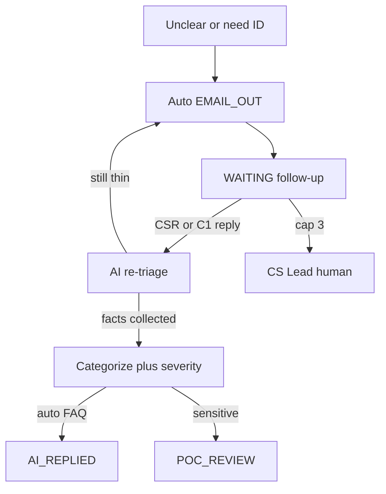

### 5.8 Skill stamp → CS auto-reply, TR, or Risk
1. A clear swap/hours/UID question stamps `SKILL-CS-ACCOUNT-FAQ` — CS may answer from RAG (`cs-swap-faq`).  
2. Fill / slippage / MT4/MT5 stamps `SKILL-TR-EXECUTION` — CS **assigns TR**, never reprices.  
3. Suspected fraud / A-book / liquidity stamps `SKILL-CS-ESCALATE-RISK` — lands on Demo Messenger via `ESC-CS-RISK`.

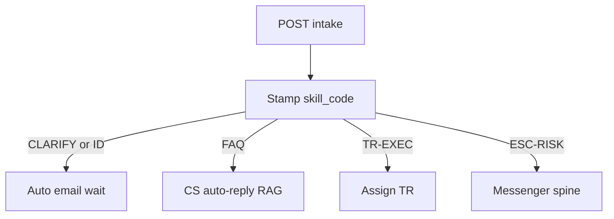

### 5.9 Find the door in the URL catalog
1. Operator opens [URL Catalog](/admin/docs/urls).  
2. Reads the CS/TR cheat (`/cs`, intake API, CSR-XXXX).  
3. Opens `/cs`, `/admin/cs-desk`, a SKILL-CS-* playbook, or `GET /api/cs/intake` from the **CS / TR** section (UAT-25).

### 5.10 Collected facts → categorize, severity, auto-reply or POC
1. Wait-loop facts are complete (clarity `clear`, or a collected reply ≥48 characters with a UID).  
2. Heuristic AI (`analyzeCsRequest`) categorises the issue and assigns **LOW / MEDIUM / HIGH / CRITICAL**.  
3. It drafts a detailed solution and a client reply.  
4. Sensitivity from `cs.auto_reply_max_severity` (default MEDIUM) and `cs.sensitive_categories` (complaint, kyc, trading): FAQ at or below the cap **auto-replies** (`AI_REPLIED`); KYC / complaint / trading **hold for a named POC** who adds detail then sends (`POC_REVIEW` → `AI_REPLIED`); CRITICAL / book-risk still **Escalate to Risk** (no client auto-mail). Trading stays `ASSIGNED_TR`.

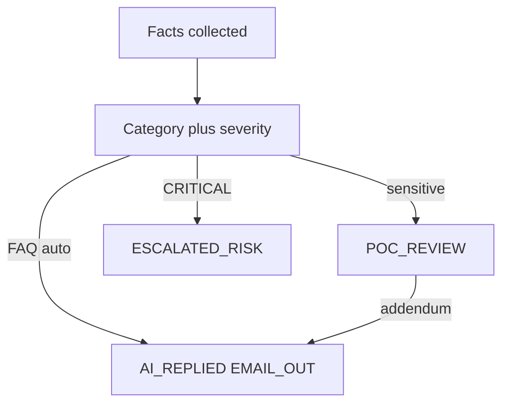

---

## 6. Functional requirements

### 6.1 P0 — must ship in prototype

| ID | Requirement | Acceptance sketch |
|---|---|---|
| FR-01 | Sync/display Monitor 2.0 indicators & raise alarms | Unified indicator + detector registry (EQ/MRG/COPY); Run all / Pause; simulate alarm works; no Alerts/Tickets tabs on Monitor |
| FR-02 | Skill-match RCA with step execution log | COPY breach → `SKILL_MATCH` + skill run steps |
| FR-03 | RAG RCA when skill uncertain | EQ path can yield `RAG_REASONING` + evidence |
| FR-04 | Independent second-AI challenger ≥ threshold | BREACH/CRITICAL show panel + CHALLENGER evidence; WARN default skip |
| FR-05 | Demo Messenger: evidence / chat / escalate / dismiss / close | Each action mutates thread + audit |
| FR-06 | Recommended controls + double-confirm → admin ref | Block/halt/etc. produce admin_ref; checker note when required |
| FR-07 | AI Admin maker ≠ checker | Same user cannot approve own proposal |
| FR-08 | AI access blocklist (pages/functions/fields) | UI lists human-only targets with reasons |
| FR-09 | Home spine + Audit for AI/messenger/intervention events | Events correlatable within ~1 minute; Spine Log tab removed |
| FR-10 | RBAC for admin surfaces | Viewer blocked from AI Admin operate paths; Roles page editable via `/api/roles` |

### 6.2 P1 — should ship in prototype

| ID | Requirement | Acceptance sketch |
|---|---|---|
| FR-11 | Market intel 5-min scan + outbox card format | Scan runs on localhost; GitHub Pages uses a client demo scan (no 405). Findings/outbox/scan log update in the desk. |
| FR-12 | Risk Log analytics | Overview lists closed tracker cards (ticket closed, AI analysis, AI/BU action logs, mandated solution) plus 90-day historical charts (backfilled), timeline / loss vs prevented |
| FR-13 | Bilingual product docs (EN / zh-Hant) | PRD, TSD, User Guide, UAT, Ecosystem, Roadmap, Open Issues, Progress, URL Catalog toggle works |
| FR-14 | Responsive admin (web + mobile) | 390px: drawer + messenger master-detail; card lists where tables would overflow; no page overflow |
| FR-15 | Enriched skill risk scenarios / chains | Skills board shows scenarios with thresholds & escalation; **Enter** opens `/admin/skills/{code}` |
| FR-16 | URL catalog for demo navigation | `/admin/docs/urls` lists admin/API/data paths + public Pages URLs plus CS/TR section (`/cs`, desk, five SKILL.md, RAG leaves, `/api/cs/intake`) |
| FR-21 | Admin Home snapshot | Every card/row is a link (stats, owner, messenger, jumps, departments, recent alerts, spine steps). Dummy alert / Dummy alert group walk DETECT→close; chrome and stored copy are EN / zh-Hant. |
| FR-22 | Daily Performance dashboard | CFD + crypto metric grids; refresh on localhost |
| FR-23 | Monitor 2.0 registry (indicators + detectors) | Run all / Sync / Pause; recent runs; enable-disable persists on localhost (`/admin/detectors` redirects here) |
| FR-24 | Realtime Alert & Tracker ack queue | Open-only queue; grouped AI pipeline; Acknowledge mutates status; closed tickets → Risk Log |
| FR-25 | Knowledge Tree visualisation | SVG map + outline; domain fan-out including CS_SERVICE / TRADING_EXEC; Enter to playbook; RAG document leaves with deep links |
| FR-26 | Grouped Platform Settings | Seven groups (platform, monitor, AI, market intel, Lark, SLA, **CS/TR** `cs.*`); save on localhost / browser-only on Pages |
| FR-27 | Org directory | Combined BU and Teams hub (`/admin/departments`), editable Roles (`/admin/roles` · `/api/roles`), Users (incl. demo platform owner / haixiang.yan@hytechc.com) |
| FR-28 | Escalation routes + Lark registry | Dimensions × coefficients; ESC-DEFAULT catch-all; skill binds one route code; no Path name column; channel enable |
| FR-36 | Audit plane split + rollback | `/admin/audit` CRMP logs vs Vantage Markets Admin logs tabs; Roll back restores before-state via `POST /api/audit/rollback` |
| FR-29 | Unread nav badges | Badge = max(0, total+extra−seen); clears on view; bumps on new work |
| FR-30 | Login persist on Pages | Sign in as named persona; session survives refresh; Sign in link under `/PRD/crmp-plus/login/` (no 404) |
| FR-31 | Grouped left nav + Vantage logo | Seven groups; EN/繁中 labels; owner line |
| FR-32 | UAT interactive pack | UAT-01…UAT-53 with why/steps/pass/evidence and screen coverage |
| FR-33 | Data sources registry | Internal + external catalogue; manage on localhost |
| FR-34 | Risk domains catalogue | CFD + crypto domains with P0–P3 scenarios, owner / supporting BUs, M2-* chips |
| FR-35 | How-to-improve review + chatbot | Every AI analysis (all severities) produces DATA_SOURCE / INDICATOR_HEALTH / REASONING_GAP / SKILL_PATTERN / THRESHOLD / RESPONSE_TIME items; chatbot pull/add-fact/challenge/regenerate until SATISFIED |
| FR-37 | CS / TR 24/7 desk | `/admin/cs-desk` inbox: C1, web form and official email via `POST /api/cs/intake`; public `/cs`; skill chip; TR assign; escalate to Risk; simulate_c1/form/email. UAT-46. |
| FR-38 | CRMP Plus public URL | Permanent snapshot at `https://hxyan2020.github.io/PRD/crmp-plus/`; original CRMP Admin at `/PRD/crmp-admin/` is frozen and not overwritten |
| FR-39 | CS/TR dedicated skills + RAG tree | Five SKILL.md: `SKILL-CS-CLARIFY` / `ID-VERIFY` / `ACCOUNT-FAQ`, `SKILL-TR-EXECUTION`, `SKILL-CS-ESCALATE-RISK` stamp `skill_code`; Knowledge Tree `CS_SERVICE` / `TRADING_EXEC`; RAG `cs-*` leaves; routes `ESC-CS-24-7` / `ESC-CS-KYC` / `ESC-TR-DEAL` / `ESC-CS-RISK`. UAT-50. |
| FR-40 | Public CS intake portal + inbound replies | Client `/cs` tabs (C1, form, official email) post to `/api/cs/intake`; GET connector catalog; replies match `request_id` / `in_reply_to` / `channel_ref` / `CSR-XXXX` and continue the ticket. Permanent URL `https://hxyan2020.github.io/PRD/crmp-plus/cs/`. |
| FR-41 | Auto-email wait loop | Unclear or need-ID → one `EMAIL_OUT`, status `AWAITING_CLIENT` or `ID_VERIFY`, follow-up `WAITING`; cap from `cs.followup_cap` (default 3) then CS Lead; **Resolve blocked** while WAITING. UAT-47. |
| FR-42 | CS/TR privacy + public status | `GET /api/cs/intake?request_id=` returns status without PII; never store ID images on the request; ID vault is process, not a blob. UAT-49. |
| FR-43 | CS/TR operator docs | User Guide §9.3; URL Catalog **CS / TR** section (`/cs`, desk, dashboard, log, data, five skills, RAG leaves, intake API, `cs_*` tables); UAT catalogue v2.7 (UAT-25 + UAT-46…53 + support 17/22/27–29/36–40) |
| FR-44 | CS/TR dashboard + log | Dedicated `/admin/cs-dashboard` (KPIs: totals, open/resolved, WAITING, follow-up cap, TR, Risk, by channel/status/skill/desk) and `/admin/cs-log` (CS_* timeline + resolved packs). **Not** Daily Performance (`/admin/dashboard`) and **not** Risk Log Analytics (`/admin/risk-log`). `GET /api/cs?view=dashboard\|log`. UAT-51. |
| FR-45 | CS/TR supporting data | Seeded and surfaced: CUSTOMER_SERVICE / TRADING BUs; teams CS 24/7 Desk, **CS KYC Vault**, TR Dealing Support; named POCs; hops `ESC-CS-24-7` / `ESC-CS-KYC` / `ESC-TR-DEAL` / `ESC-CS-RISK`; `cs.*` parameters (cap, SLA, intake token, mailboxes, Lark ids); C1/form/mailbox + KYC vault + dealing-tape sources. Page `/admin/cs-data`, `GET /api/cs?view=data`. UAT-52. |
| FR-46 | Categorize, severity, AI solution, auto vs POC | After collected facts: category + LOW\|MEDIUM\|HIGH\|CRITICAL; heuristic solution + client draft; auto-reply when sensitivity `auto` (`AI_REPLIED`); otherwise named POC adds detail before send (`POC_REVIEW`). Gates: `cs.auto_reply_max_severity`, `cs.sensitive_categories`. CRITICAL / book-risk still escalate. Prototype — no live LLM. UAT-53. |

### 6.3 P2 — later (ecosystem phases)

| ID | Requirement |
|---|---|
| FR-17 | Production Lark interactive cards |
| FR-18 | Monitor bidirectional ticket write-back |
| FR-19 | Real trading control bus with dry-run |
| FR-20 | Production LLM + eval harness; diversified challenger vendor |

### 6.4 Feature catalogue — every admin surface

This table **is** the product scope of the admin. If a row is in the left nav, it is in scope for this PRD, the User Guide, the TSD, and UAT.

| Group | Feature | Path | Jobs to be done | Key acceptance |
|---|---|---|---|---|
| Overview | Admin Home | `/admin` | Orient; jump via cards; dummy spine walk; spine stage counts | Every card/row is a link; dummy buttons; spine viz; messenger + CS/TR CTAs |
| Monitor & risk | Daily Performance | `/admin/dashboard` | Day-end CFD + crypto picture | Both product grids; WARN/BREACH counts |
| Monitor & risk | Risk Log Analytics | `/admin/risk-log` | Closed tracker packs, handling time, loss vs prevented, loopholes | Overview closed cards + category + domain + records |
| Monitor & risk | Market Intelligence | `/admin/market-intel` | LP-moving headlines | Scan now; Findings; outbox; scan log; Pages demo scan |
| Monitor & risk | Monitor 2.0 | `/admin/monitor-2` | Unified indicator + detector registry | Run all / Sync / Pause; recent runs; open alerts link → Realtime Alert & Tracker (no Alerts/Tickets tabs) |
| Monitor & risk | Detectors (redirect) | `/admin/detectors` | Bookmarks only | Not in left nav — redirects to Monitor 2.0 |
| Monitor & risk | Realtime Alert & Tracker | `/admin/alerts` | Open queue + grouped AI pipeline | MonitorCode tooltips; open-only; ack; `/admin/ai-analyses` list redirects here |
| Monitor & risk | Risk Domains | `/admin/risk-domains` | Ownership + P0–P3 scenarios linked to Monitor 2.0 | Expand scenario; click M2-* chip |
| AI & knowledge | AI Analyses (redirect) | `/admin/ai-analyses` → `/admin/alerts` | List merged into Realtime Alert & Tracker | Grouped pipeline + rank note; detail pack at `/admin/ai-analyses/[id]` |
| AI & knowledge | AI Admin | `/admin/ai-admin` | Dual-control + first/second-line cards | Seven tabs; propose_rag human-gate; maker ≠ checker |
| AI & knowledge | AI Skills | `/admin/skills` | Playbooks + chains | Enter → SKILL.md; one escalation bind |
| AI & knowledge | Knowledge Tree | `/admin/knowledge-tree` | Visual map | Map/outline; CS_SERVICE / TRADING_EXEC; RAG leaves + deep links |
| AI & knowledge | RAG Knowledge Base | `/admin/rag` | Corpus retrieve | Human-gate: AI cannot edit → escalate to human / propose_rag; CS_POLICY docs |
| Response | Human Intervention | `/admin/interventions` | Runtime checker | Approve/Reject + note; actioner email on samples |
| Response | Demo Messenger | `/admin/messenger` | Chat-native triage with bird-eye POC windows | Path chips, per-POC chats, sync, evidence, chat, escalate, dismiss, close, controls, Open in admin |
| Response | CS / TR Desk | `/admin/cs-desk` | 24/7 C1, form and mailbox intake | Three channels; public `/cs` portal; inbound CSR-XXXX replies; dedicated skill chip; wait loop cap 3; categorize / severity / auto vs POC; TR routing; escalate to Risk |
| Response | CS / TR Dashboard | `/admin/cs-dashboard` | CS/TR volume and wait-loop health | Separate from Daily Performance; WAITING / cap-3 / TR / Risk KPIs; by channel, status, skill, desk |
| Response | CS / TR Log | `/admin/cs-log` | CS_* timeline and resolved packs | Separate from Risk Log; filter CS_INTAKE … CS_RESOLVE; resolved request packs |
| Response | CS / TR Data | `/admin/cs-data` | BU, team, hops, parameters | Live contract; links to org / escalation / settings / sources / Lark |
| Response | Lark Integration | `/admin/lark` | Channel registry | List + enable; `oc_cs_c1` / `oc_tr_dealing`; mock notify localhost |
| Response | Escalation Routes | `/admin/escalation` | Dimensions × coefficients → team → SLA | ESC-DEFAULT plus ESC-CS-24-7 / ESC-CS-KYC / ESC-TR-DEAL / ESC-CS-RISK; skill binds one path |
| Organisation | BU and Teams | `/admin/departments` | RACI + on-call | Combined hub; `/admin/teams` redirects |
| Organisation | Roles & Permissions | `/admin/roles` | Editable RBAC | `/api/roles`; permission chips + charters |
| Organisation | Users | `/admin/users` | Directory | demo platform owner / haixiang.yan@hytechc.com; add/disable manage |
| Platform | Data Sources | `/admin/data-sources` | Feed registry | Category + status; C1 gateway, website CS form, official mailboxes, CS KYC Vault, MT4/MT5 dealing tape |
| Platform | AI Access Security | `/admin/security/ai-access` | Human-only inventory | Blocklist + allowed + forbidden perms |
| Platform | Audit Log | `/admin/audit` | CRMP vs Vantage Markets Admin planes | Two tabs; Roll back via before-state snapshot |
| Platform | Platform Settings | `/admin/settings` | Flags | Grouped keys including **cs.***; save |
| Docs | User Guide | `/admin/docs/user-guide` | How to operate | EN + zh-Hant; every screen plus §9.3 CS/TR |
| Docs | PRD | `/admin/docs/prd` | Why / what / accept | This document (FR-37…46, G13, §5.7–5.10, §6.5) |
| Docs | TSD | `/admin/docs/tsd` | How built | Surface map complete |
| Docs | UAT Checklist | `/admin/docs/uat` | Sign-off | 52 cases, interactive (UAT-46…53 CS/TR; catalogue v2.7) |
| Docs | Ecosystem Eval | `/admin/docs/ecosystem` | Adoption | Phases, budget, risks |
| Docs | Improvement Roadmap | `/admin/docs/roadmap` | Next | RM-01…15: today / build / done-when |
| Docs | Open Issues | `/admin/docs/open-issues` | Programme gaps | 20 issues; CS/TR catalogue v1.5 on OI-19/20 |
| Docs | Progress Tracker | `/admin/docs/progress` | Timeline board | X=issues Y=now→2027; CS/TR catalogue v1.6 on 20 columns |
| Docs | URL Catalog | `/admin/docs/urls` | Navigation | Pages + APIs + tables + **CS / TR** section |
| Shell | Login | `/login` | Named persona | Persist; Pages path; owner default |
| Shell | Language | cookie `crmp_ui_lang` | EN / 繁中 | Nav + docs switch |
| Shell | Unread badges | left nav | New work | Increment / clear-on-view |
| Shell | Mobile drawer | `< lg` | Phone use | Hamburger; messenger master-detail |
| Public | CS client portal | `/cs` | Client C1 / form / mailbox | Three tabs; same `POST /api/cs/intake`; CSR-XXXX wait loop; Pages URL `/PRD/crmp-plus/cs/` |

### 6.5 CS / TR product contract (CRMP Plus only)

This door ships **only** on CRMP Plus (`/PRD/crmp-plus/`). Original CRMP Admin at `/PRD/crmp-admin/` stays frozen and must not receive these routes.

#### Connectors — one webhook

| Channel | Client surface | Product behaviour |
|---|---|---|
| `C1_LIVE_CHAT` | C1 widget + `/cs` Live chat tab | `POST /api/cs/intake` (header `x-cs-intake-token: demo-c1` or session). `channel_ref` = chat session. |
| `WEB_FORM` | Website / app contact form + `/cs` Submission tab | Same webhook. `channel_ref` = form submission id. |
| `OFFICIAL_EMAIL` | Official support / complaints mailbox + `/cs` Official email tab | Same webhook. Subject may carry `CSR-XXXX`. |

`GET /api/cs/intake` returns this catalog. Operator `/api/cs` is **not** the public ingest — it is desk actions (triage / analyze / followup / client_reply / reply / assign_tr / escalate_risk / resolve / poc_release / simulate_*) plus `GET ?view=dashboard|log|data`.

#### Continuation — must not open a duplicate

An inbound payload **continues** the existing `CSR-XXXX` when any of these match: `request_id`, `in_reply_to`, the same `channel_ref`, or `CSR-[0-9A-F]{6}` in the subject. That closes a WAITING follow-up instead of minting a second ticket.

#### Wait loop (FR-41)

If AI is unclear or needs identity: send **one** auto-email, hold the ticket, wait for the client. Cap **3** mails then CS Lead in person. Resolve is forbidden while a follow-up is WAITING.

#### Skill stamps (FR-39)

| Skill | When | Next |
|---|---|---|
| `SKILL-CS-CLARIFY` | Thin / unclear text | Auto-email; `ESC-CS-24-7` |
| `SKILL-CS-ID-VERIFY` | KYC / passport / cannot-login | Official-mail ID ask; `ESC-CS-KYC`; never store images |
| `SKILL-CS-ACCOUNT-FAQ` | Swap, hours, UID, deposits | CS may auto-reply from RAG |
| `SKILL-TR-EXECUTION` | Fill, slippage, reject, MT4/MT5 | Assign TR; CS does not reprice |
| `SKILL-CS-ESCALATE-RISK` | Fraud / A-book / liquidity | Demo Messenger via `ESC-CS-RISK` |

Knowledge Tree trunks: `CS_SERVICE`, `TRADING_EXEC`. Timeline: `CHAIN-CS-TR-INTAKE`. RAG leaves: `cs-24-7-intake`, `cs-id-verify-policy`, `cs-swap-faq`, `tr-dealing-handoff`, `cs-escalate-to-risk`, `cs-skill-playbooks`.

#### Privacy (FR-42)

Public ticket status has **no PII**. ID images are not stored on `cs_requests`. Audit records `CS_*` actions on the CRMP plane.

#### Docs (FR-43)

Operators must find the door without guessing: URL Catalog CS/TR section, User Guide §9.3, UAT-25 / UAT-46…53.

#### Dedicated dashboard + log (FR-44)

CS/TR volume and wait-loop health live on `/admin/cs-dashboard`. CS_* audit plus resolved packs live on `/admin/cs-log`. Daily Performance remains CFD/crypto day-end metrics. Risk Log Analytics remains closed Monitor tracker packs. Mixing those surfaces is a product defect.

#### Supporting data (FR-45)

The desk, dashboard and log must read the same operational records: CUSTOMER_SERVICE and TRADING BUs; teams **CS 24/7 Desk**, **CS KYC Vault**, **TR Dealing Support**; named POCs; hops `ESC-CS-24-7` (clarify/FAQ), `ESC-CS-KYC` (ID verify), `ESC-TR-DEAL` (execution), `ESC-CS-RISK` (book-risk); `cs.*` parameters (`followup_cap`, `auto_reply_max_severity`, `sensitive_categories`, wait/TR/Risk SLA, intake token, support@ / complaints@, Lark chat ids). `/admin/cs-data` is the contract page. `GET /api/cs?view=data` returns the live payload. ID images stay off `cs_requests` — the KYC vault is status flags only.

#### Categorize / severity / auto vs POC (FR-46)

After the wait loop has enough facts, AI **must** categorise, assign severity, and draft a solution plus a client reply. Low-sensitivity FAQ may send immediately (`AI_REPLIED`). Sensitive categories and severity above `cs.auto_reply_max_severity` hold for a **named POC** who adds detail before send (`POC_REVIEW`). CRITICAL / book-risk never auto-mail the client. Prototype heuristic — no live LLM on this path.

---

## 7. Non-functional requirements

| ID | Area | Requirement |
|---|---|---|
| NFR-01 | Latency | Prototype: alarm → dual-AI pack typically < 60s |
| NFR-02 | Auditability | Mutations to alerts/analyses/messenger/AI Admin/CS_* emit audit |
| NFR-03 | Security | AI principals must not receive blocklisted rights; public CS status has no PII |
| NFR-04 | SoD | Maker/checker enforced for AI Admin; checker for designated controls |
| NFR-05 | Availability | Demo single-node SQLite acceptable; production needs HA (see Ecosystem) |
| NFR-06 | i18n | Operator docs EN + zh-Hant; UI nav language toggle; URL Catalog titles/descriptions, Settings `cs.*` copy and CS/TR Data seed strings 繁中 |
| NFR-07 | Accessibility (basic) | Touch targets usable on mobile; critical actions labeled |
| NFR-08 | Public snapshot | Static export under `basePath` `/PRD/crmp-plus`; original CRMP Admin remains at `/PRD/crmp-admin`; no dead `/api` clicks (demo fallbacks) |
| NFR-09 | Session | Demo persona persists in `localStorage` + cookie on Pages |
| NFR-10 | CS wait loop | Auto-mail cap from `cs.followup_cap` (default 3); Resolve blocked while WAITING; inbound match must continue, not duplicate |
| NFR-11 | CS privacy | No ID images on `cs_requests`; `/cs` and public GET status stay PII-light |
| NFR-12 | CS sensitivity gate | Auto-reply only when severity ≤ `cs.auto_reply_max_severity` and category is not in `cs.sensitive_categories`; POC addendum required otherwise |

---

## 8. Detailed acceptance criteria (prototype gate)

1. **Skill + challenger:** Simulate COPY BREACH → `SKILL_MATCH` + Second AI panel with ≥1 HIGH improvement when challenged.  
1b. **How to improve:** The same analysis (any severity) opens a how-to-improve panel with data-source / health / reasoning / skill / X→Y / response-time items and a chatbot that can pull data, add a fact, challenge, regenerate, and mark SATISFIED. Evidence includes an IMPROVEMENT row.  
2. **Threshold:** WARN-only EQ simulate does **not** create challenge under default BREACH threshold.  
3. **Messenger path:** Show evidence posts vault; Escalate advances path; Dismiss/Close update statuses.  
4. **Controls:** Block account → double confirm → admin_ref; checker follow-up when required.  
5. **AI Admin:** Distinct checker required; self-approve blocked.  
6. **Coverage:** UAT window BREACH/CRITICAL samples 100% challenged (backfill allowed).  
7. **Docs:** PRD/TSD/User Guide/UAT/Ecosystem/Roadmap render EN and zh-Hant; User Guide has a how-to for every left-nav page.  
8. **Mobile:** Messenger list→thread→back works at ~390px without document overflow.  
9. **Pages:** Login, messenger Open-in-admin, and Market Intel Scan now succeed without 404/405.  
10. **Knowledge tree:** Domain fan-out + Enter opens a playbook.  
11. **Unread:** New simulate/scan / Monitor Run all bumps a badge; opening the tab clears it.  
12. **Owner login:** demo platform owner persona persists after refresh on Pages.  
13. **Nav truth:** Left nav has Realtime Alert & Tracker (not Live Alerts); no Detectors / AI Analyses list / Spine Log rows; `/admin/detectors` → Monitor 2.0; `/admin/ai-analyses` → alerts; `/admin/spine` → home.  
14. **CS connectors:** C1, website form and official email each create a desk row through `POST /api/cs/intake` (UAT-46), including from `/cs`.  
15. **Wait loop:** Unclear or need-ID sends auto-email and WAITING; a CSR-XXXX / `channel_ref` reply continues the same ticket; Resolve stays blocked until closed (UAT-47). Cap 3 then CS Lead.  
16. **Skills + tree:** Seeded requests show SKILL-CS-* / SKILL-TR-* chips that open SKILL.md; Knowledge Tree has CS_SERVICE / TRADING_EXEC; RAG has `cs-24-7-intake` (UAT-50).  
17. **Catalog:** URL Catalog CS/TR section lists `/cs`, desk, dashboard, log, data, five playbooks, RAG leaves and `/api/cs/intake` (UAT-25).  
18. **CS dashboard + log:** `/admin/cs-dashboard` shows CS/TR KPIs (not Daily Performance). `/admin/cs-log` shows CS_* events and resolved packs (not Risk Log). UAT-51.  
19. **Privacy:** Public status GET has no PII; ID images are not on the ticket (UAT-49).  
20. **Supporting data:** `/admin/cs-data` shows CS/TR BUs, CS KYC Vault, four escalation hops including `ESC-CS-KYC`, and `cs.*` parameters; Platform Settings has a CS/TR group; desk/dashboard consume the live cap. UAT-52.  
21. **Analyze after collected:** Clear FAQ auto-replies (`AI_REPLIED`). Collected KYC holds for a named POC who can addendum then send. TR stays `ASSIGNED_TR`. CRITICAL/book-risk still escalate. UAT-53.

Formal execution: [UAT Checklist](/admin/docs/uat) (UAT-01 … UAT-53). The pack covers every admin screen plus the full messenger loop (inbox, evidence, challenge, escalate, dismiss, close, recommended controls, sync) and the CS/TR door (C1 / form / email, `/cs`, wait loop, categorize / severity / auto vs POC, dedicated SKILL.md, TR routing, ID vault, catalog, dashboard, log, data contract).

---

## 9. Success metrics (pilot)

| Metric | Target |
|---|---|
| Mean time alarm → dual-AI pack | < 60s (prototype) |
| % BREACH+ with challenger attached | 100% |
| False-alarm dismissals audited | 100% |
| AI Admin changes with distinct checker | 100% |
| Human-only surfaces documented in blocklist | 100% of agreed inventory |
| Critical UAT cases Pass | 100% |
| Left-nav pages with User Guide how-to | 100% |
| Public Scan now / Login / Open-in-admin | 0 hard 404/405 on happy path |
| Unclear/ID cases that email and wait (not Resolve) | 100% of those triage outcomes |
| Intake replies that continue CSR-XXXX (no duplicate) | 100% of matched inbound |
| URL Catalog CS/TR required paths listed | 100% (`/cs`, desk, five skills, intake API) |

---

## 10. Scope boundaries & dependencies

**Depends on:** Monitor 2.0 indicator model; Lark as corporate messenger (future); Vantage admin for real controls; IdP for production SSO; official mailbox + C1 gateway for live intake.  
**Provides to:** Risk/Ops desks a single control plane UI + audit spine; CS/TR a 24/7 client door on the same plane.  
**Out of scope until Phase B/C:** Live webhooks to production C1/IMAP, write adapters, Postgres HA (see [Ecosystem Eval](/admin/docs/ecosystem)).

---

## 11. Risks & open questions

| Risk / question | Mitigation |
|---|---|
| Heuristic AI overconfidence | Mandatory second AI on high severity; needs_human on PARTIAL/DISAGREE |
| Operators bypass messenger | Keep admin deep-links; audit both paths |
| Premature write automation | Shadow mode before control bus (ecosystem Phase C) |
| Which messenger is corporate standard? | Lark assumed; Teams adapter TBD |
| Data retention for evidence PII | Legal review before production identifiers |
| Duplicate CS tickets if matching fails | Continue on `request_id` / `in_reply_to` / `channel_ref` / `CSR-XXXX`; UAT-47 |
| ID images landing on the ticket | Product rule: never store; ID ask via official mail only (FR-42) |
| CS arming trading controls | Escalate to Risk only; CS/TR desk cannot recommend halt/block |
| GitHub Pages empty DB | Fallback nav totals + client demo scan + demo session |

---

## 12. Release plan (prototype → production)

| Stage | Outcome |
|---|---|
| Prototype (now) | Full admin map, dual-AI, messenger, **CS/TR door** (`/cs`, intake, wait loop, analyze/POC, skills, data contract), docs, UAT-01…53, public Pages snapshot |
| Phase A | Harden auth/hosting/observability |
| Phase B | Live Monitor + Lark notify (read path) |
| Phase C | Supervised write path + kill-switches |
| Phase D | Model ops / challenger diversity |

---

## 13. Traceability

| Product artefact | Where |
|---|---|
| Operator how-to per page | User Guide §6–§12 (CS/TR: §9.3) |
| Technical module per page | TSD §7 + §8–§18 (CS/TR: §17) |
| Test case per surface | UAT catalogue v2.7 — UAT-01…UAT-53 `covers` field (CS/TR primary: UAT-25, UAT-46…53; support: 17/22/27–29/36–40) |
| Public and local URLs | URL Catalog (CS / TR section) |

---

## 14. Approvals

| Role | Name | Decision | Date |
|---|---|---|---|
| Platform owner / docs owner | demo platform owner | Named | 2026-10-04 |
| Risk Owner | Alex Chen (demo) | Demo persona | |
| Risk Platforms PM | demo platform owner | Named | 2026-10-04 |
| Engineering Lead | _TBD_ | | |
| Security / GRC | _TBD_ | | |

---

## 15. Document control

| Ver | Date | Notes |
|---|---|---|
| 1.0 | 2026-10-01 | Goals G1–G7, FR-01…16 |
| 1.5 | 2026-10-04 | Journey and SoD flowcharts for every P0 path |
| 1.6 | 2026-10-05 | Spine on home; BU and Teams; line1/2 AI Admin; propose_rag; ESC-DEFAULT; Open Issues / Progress |
| 1.7 | 2026-10-05 | Audit CRMP / Vantage Markets Admin tabs + rollback; editable Roles; escalation dimensions × coefficients |
| 1.8 | 2026-10-05 | Nav truth: Realtime Alert & Tracker; Detectors→Monitor 2.0; AI Analyses list redirect; Monitor hub without Alerts/Tickets tabs; dedupe FR-24 |
| 1.9 | 2026-10-06 | FR-37 CS/TR 24/7 desk; UAT-46…49; TSD §17 |
| 2.0 | 2026-10-06 | CRMP Plus coherent platform; G12/FR-38 dual URLs (`/PRD/crmp-plus/` vs frozen `/PRD/crmp-admin/`) |
| 2.1 | 2026-10-06 | FR-39 dedicated CS/TR skills + Knowledge Tree CS_SERVICE / TRADING_EXEC; UAT-50 |
| 2.2 | 2026-10-06 | FR-40 public `/cs` portal + inbound reply matching on `/api/cs/intake` |
| 2.3 | 2026-10-06 | G13 + FR-41…43; journeys 5.7–5.9; §6.5 CS/TR product contract; wait loop / privacy / catalog AC |
| 2.4 | 2026-10-06 | FR-44 dedicated CS/TR dashboard + log (not Daily Performance / Risk Log); UAT-51 |
| 2.5 | 2026-10-06 | FR-45 CS/TR supporting data (BU/teams/KYC vault, ESC-CS-KYC, cs.* parameters); UAT-52 |
| 2.6 | 2026-10-06 | FR-46 categorize / severity / AI solution; auto-reply vs named POC addendum; journey 5.10; UAT-53 |

**Owner:** demo platform owner (`haixiang.yan@hytechc.com`)
