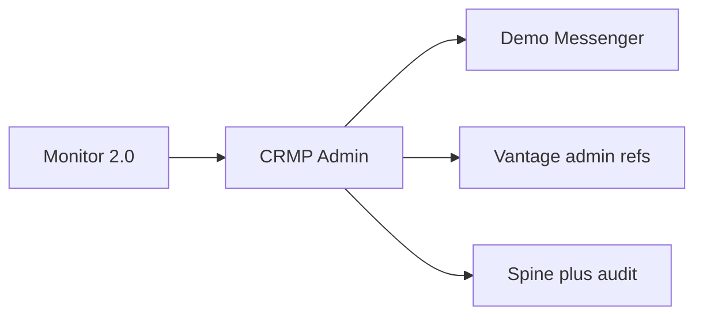
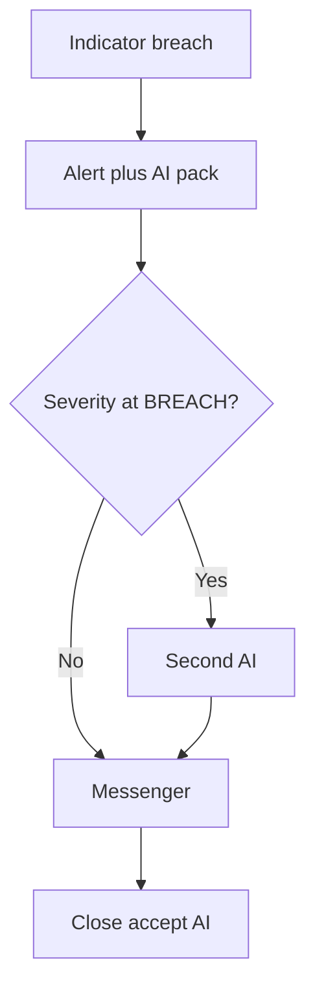
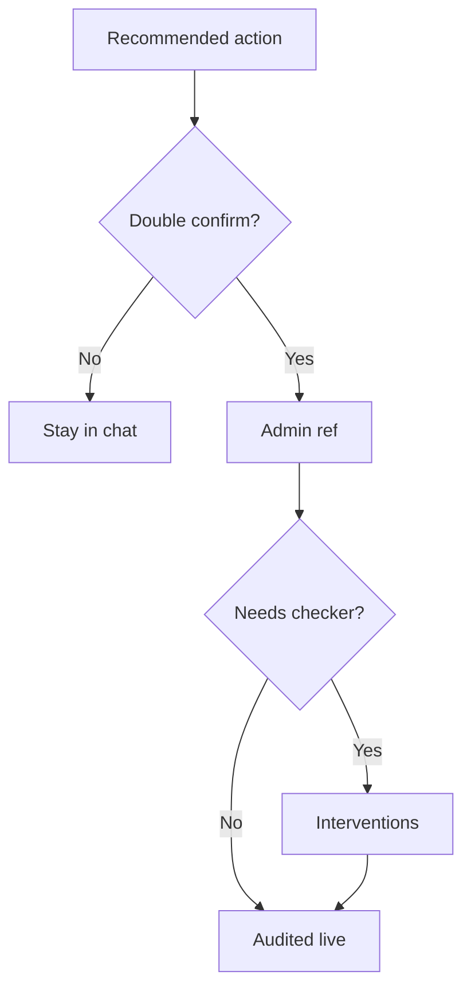
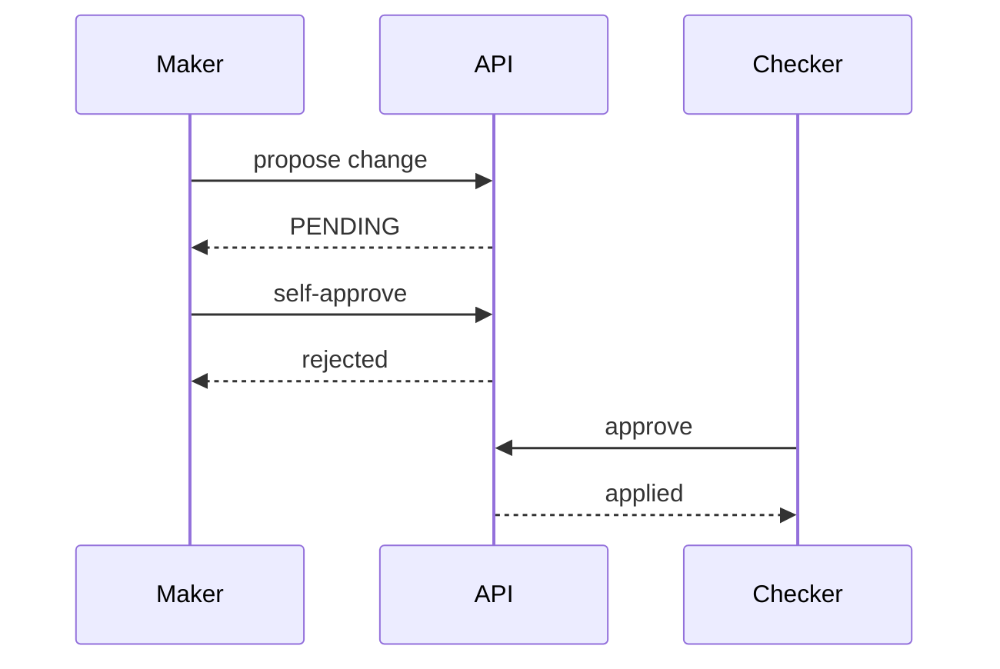
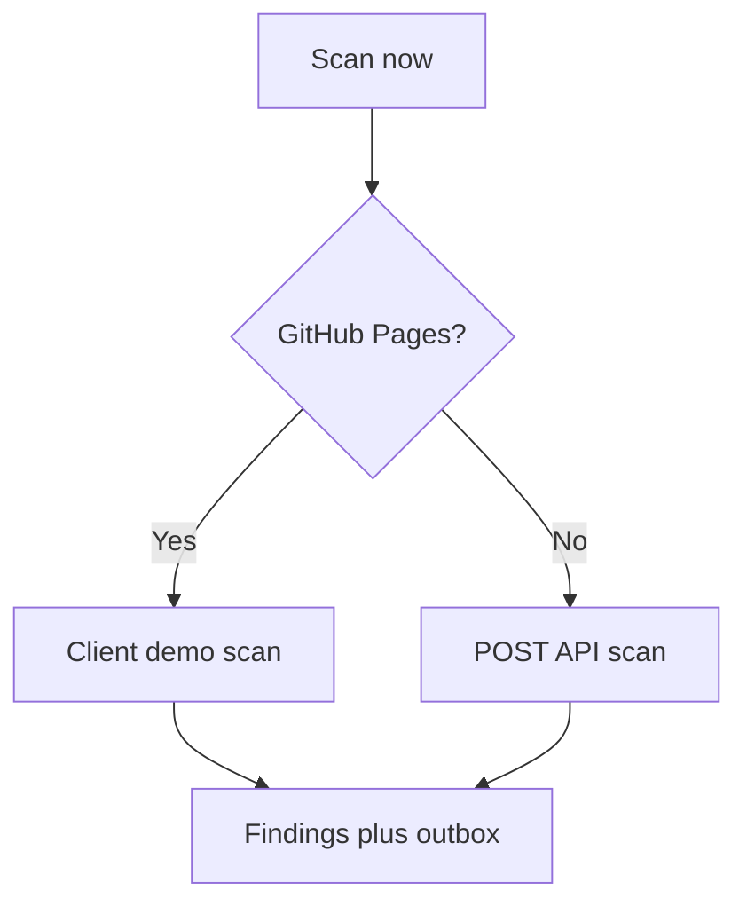
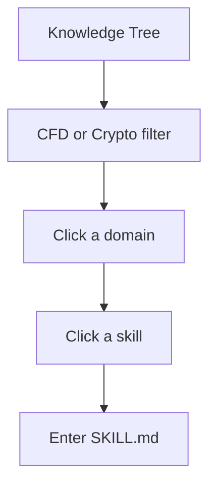
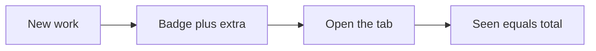
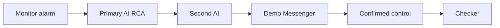

# CRMP Product Requirements Document (PRD)

**Document ID:** CRMP-PRD-001  
**Status:** Prototype / Demo-ready  
**Products in scope:** CFD + Crypto Exchange  
**Owner:** demo platform owner · **Approver:** Risk Owner  
**Related:** [TSD](/admin/docs/tsd) · [User Guide](/admin/docs/user-guide) · [UAT](/admin/docs/uat) · [Ecosystem Eval](/admin/docs/ecosystem)

This PRD is the product contract for **every screen and feature currently in CRMP Admin**. Operator how-tos live in the [User Guide](/admin/docs/user-guide). Build detail lives in the [TSD](/admin/docs/tsd). Sign-off cases are [UAT-01 … UAT-45](/admin/docs/uat).

---

## 1. Problem statement

Vantage Markets operates CFD and crypto risk across Monitor 2.0 indicators, desks, and messenger escalation. Today, alarm → root cause → action is fragmented: analysts re-derive context, AI suggestions (if any) lack an independent challenge, and irreversible controls are hard to audit end-to-end.

**We need a centralised risk management plane that:**
- Turns Monitor alarms into explainable AI RCA  
- Challenges high-severity RCA with a second independent AI  
- Lets operators act in messenger (evidence, escalate, dismiss, close, controls)  
- Enforces maker/checker and keeps AI off human-only surfaces  
- Leaves a single spine + audit trail  
- Gives every desk function a named admin page (home, performance, risk log, intel, org, settings, docs)

---

## 2. Goals

| # | Goal | Measurable outcome |
|---|---|---|
| G1 | One spine | Detect → Analyse → Challenge → Escalate → Intervene → Audit is visible in Spine Log |
| G2 | Certainty routing | Known skills auto-execute when certain; else RAG + human review |
| G3 | Dual-AI on high severity | 100% of BREACH/CRITICAL analyses have second-AI challenge |
| G4 | SoD on AI config | AI Admin changes require maker ≠ checker |
| G5 | Messenger-native ops | Operators can triage without leaving chat for core actions |
| G6 | Market awareness | 5-minute intel scan for LP-moving headlines (live on localhost; demo scan on Pages) |
| G7 | Safe AI boundary | Human-only pages/functions/fields listed and denied to AI |
| G8 | Complete admin map | Every left-nav group/page in §6.4 is shipped and documented |
| G9 | Unread awareness | New work on Alerts / Analyses / Messenger / Intel / Interventions / Spine / Audit / Monitor / Risk Log / Detectors shows a badge that clears when viewed |
| G10 | Public demo | GitHub Pages snapshot at `/PRD/crmp-admin/` walks the desk without 404/405 on login, messenger Open-in-admin, or Scan now |
| G11 | Named owner | Platform owner demo platform owner is a first-class persona; session persists in-browser |

---

## 3. Non-goals (this prototype)

| Non-goal | Rationale |
|---|---|
| Production Lark webhook delivery | Mocked via audit / outbox / in-app Demo Messenger |
| Billed production LLM APIs | Heuristic skill/RAG/challenger engines stand in |
| Full MT4/MT5/LP write adapters | Deep-links + mock admin refs only |
| Multi-brand tenancy at scale | Single demo tenancy |
| Replacing Monitor 2.0 | CRMP consumes Monitor; does not rebuild it |
| Production SSO / IdP | Demo personas + cookie / localStorage session |

---

## 4. Personas & jobs-to-be-done

| Persona | Primary jobs |
|---|---|
| **Platform Owner (demo platform owner)** | Own the desk and docs; default login on the public snapshot |
| **Risk Owner** | Accept/reject AI packs; escalate; approve irreversible controls; run UAT exit |
| **Risk Analyst** | Triage alerts; challenge AI in messenger; add context |
| **Ops Lead / Analyst** | Propose halt/block/widen/pause-copy; maker-confirm into admin |
| **AI Engineer** | Skills, RAG, detectors, second-opinion threshold, AI Admin proposals |
| **System Admin** | Users/roles, grouped settings, AI access blocklist, audit hygiene |
| **Viewer** | Read-only oversight (no AI Admin operate) |

---

## 5. User journeys (happy path)

### 5.1 High-severity alarm → dual-AI → messenger close
1. Monitor indicator breaches (e.g. COPY concentration).  
2. CRMP creates alert + AI analysis (`SKILL_MATCH` or `RAG_REASONING`).  
3. If severity ≥ `ai.second_opinion_severity` (default BREACH), run `crmp-challenger-v0`.  
4. Risk Analyst opens Demo Messenger thread; **Show evidence**; optionally challenges via chatbot.  
5. Risk Owner reviews primary + challenger; **Close (accept AI)** or escalates / requests control.

### 5.2 Control with double confirm + checker
1. Operator selects recommended action (e.g. Block user account).  
2. Double-confirm gate → mock Vantage admin ref + link.  
3. If `needs_checker`, Checker approves via Interventions / instructed path.  
4. Audit + Spine record maker/checker outcome.

### 5.3 AI Admin change
1. Maker proposes setting/model/policy in AI Admin.  
2. Distinct Checker approves.  
3. Self-approve is rejected.

### 5.4 Market intel on public snapshot
1. Operator opens Market Intelligence on GitHub Pages.  
2. **Scan now** runs the client demo scan (same templates as live).  
3. Findings, outbox and scan log update locally. No 405.

### 5.5 Knowledge tree drill-down
1. Operator opens Knowledge Tree, filter CFD or Crypto if needed.  
2. Clicks a domain (e.g. LP_HEDGE) to fan out skills.  
3. Clicks a skill; inspector fills; **Enter** opens the SKILL.md playbook.

### 5.6 Unread badge
1. A detector run / intel scan / AI simulate creates new work.  
2. Left-nav badge increments.  
3. Opening that tab stores “seen” and the badge drops to zero for this browser.

---

## 6. Functional requirements

### 6.1 P0 — must ship in prototype

| ID | Requirement | Acceptance sketch |
|---|---|---|
| FR-01 | Sync/display Monitor 2.0 indicators & raise alarms | Indicators EQ/MRG/COPY visible; simulate alarm works |
| FR-02 | Skill-match RCA with step execution log | COPY breach → `SKILL_MATCH` + skill run steps |
| FR-03 | RAG RCA when skill uncertain | EQ path can yield `RAG_REASONING` + evidence |
| FR-04 | Independent second-AI challenger ≥ threshold | BREACH/CRITICAL show panel + CHALLENGER evidence; WARN default skip |
| FR-05 | Demo Messenger: evidence / chat / escalate / dismiss / close | Each action mutates thread + audit |
| FR-06 | Recommended controls + double-confirm → admin ref | Block/halt/etc. produce admin_ref; checker note when required |
| FR-07 | AI Admin maker ≠ checker | Same user cannot approve own proposal |
| FR-08 | AI access blocklist (pages/functions/fields) | UI lists human-only targets with reasons |
| FR-09 | Spine + Audit for AI/messenger/intervention events | Events correlatable within ~1 minute |
| FR-10 | RBAC for admin surfaces | Viewer blocked from AI Admin operate paths |

### 6.2 P1 — should ship in prototype

| ID | Requirement | Acceptance sketch |
|---|---|---|
| FR-11 | Market intel 5-min scan + outbox card format | Scan runs on localhost; GitHub Pages uses a client demo scan (no 405). Findings/outbox/scan log update in the desk. |
| FR-12 | Risk Log analytics | Overview lists closed tracker cards (ticket closed, AI analysis, AI/BU action logs, mandated solution) plus timeline / loss vs prevented |
| FR-24 | Live Alerts ack queue | Open-only queue; Acknowledge mutates status; button to Risk Log for closed tickets |
| FR-13 | Bilingual product docs (EN / zh-Hant) | PRD, TSD, User Guide, UAT, Ecosystem, Roadmap toggle works |
| FR-14 | Responsive admin (web + mobile) | 390px: drawer + messenger master-detail; no page overflow |
| FR-15 | Enriched skill risk scenarios / chains | Skills board shows scenarios with thresholds & escalation; **Enter** opens `/admin/skills/{code}` |
| FR-16 | URL catalog for demo navigation | `/admin/docs/urls` lists admin/API/data paths + public Pages URLs |
| FR-21 | Admin Home snapshot | Every card/row is a link (stats, owner, messenger, jumps, departments, recent alerts, spine steps) |
| FR-22 | Daily Performance dashboard | CFD + crypto metric grids; refresh on localhost |
| FR-23 | Detectors run/toggle | Run all raises alarms + AI RCA; enable/disable persists on localhost |
| FR-24 | Live Alerts ack queue | Open-only queue; Acknowledge mutates status; button to Risk Log for closed tickets |
| FR-25 | Knowledge Tree visualisation | SVG map + outline; domain fan-out; Enter to playbook; RAG trunk |
| FR-26 | Grouped Platform Settings | Six groups (platform, monitor, AI, market intel, Lark, SLA); save on localhost / browser-only on Pages |
| FR-27 | Org directory | Departments, Teams, Roles (permission chips), Users (incl. demo platform owner; add/disable on localhost) |
| FR-28 | Escalation routes + Lark registry | Severity → team → SLA; channel enable; messenger Escalate follows route |
| FR-29 | Unread nav badges | Badge = max(0, total+extra−seen); clears on view; bumps on new work |
| FR-30 | Login persist on Pages | Sign in as named persona; session survives refresh; Sign in link under `/PRD/crmp-admin/login/` (no 404) |
| FR-31 | Grouped left nav + Vantage logo | Seven groups; EN/繁中 labels; owner line |
| FR-32 | UAT interactive pack | UAT-01…UAT-45 with why/steps/pass/evidence and screen coverage |
| FR-33 | Data sources registry | Internal + external catalogue; manage on localhost |
| FR-34 | Risk domains catalogue | CFD + crypto domains with owner / supporting BUs |

### 6.3 P2 — later (ecosystem phases)

| ID | Requirement |
|---|---|
| FR-17 | Production Lark interactive cards |
| FR-18 | Monitor bidirectional ticket write-back |
| FR-19 | Real trading control bus with dry-run |
| FR-20 | Production LLM + eval harness; diversified challenger vendor |

### 6.4 Feature catalogue — every admin surface

This table **is** the product scope of the admin. If a row is in the left nav, it is in scope for this PRD, the User Guide, the TSD, and UAT.

| Group | Feature | Path | Jobs to be done | Key acceptance |
|---|---|---|---|---|
| Overview | Admin Home | `/admin` | Orient; jump via cards | Every card/row is a link; owner visible; messenger CTA |
| Monitor & risk | Daily Performance | `/admin/dashboard` | Day-end CFD + crypto picture | Both product grids; WARN/BREACH counts |
| Monitor & risk | Risk Log Analytics | `/admin/risk-log` | Closed tracker packs, handling time, loss vs prevented, loopholes | Overview closed cards + category + domain + records |
| Monitor & risk | Market Intelligence | `/admin/market-intel` | LP-moving headlines | Scan now; Findings; outbox; scan log; Pages demo scan |
| Monitor & risk | Monitor 2.0 | `/admin/monitor-2` | Indicators / alerts / tickets | Three tabs; Sync now on localhost |
| Monitor & risk | Detectors | `/admin/detectors` | Threshold first stage | Run all; toggle; runs list |
| Monitor & risk | Live Alerts | `/admin/alerts` | Open queue | Open-only; ack; severity sort; button to Risk Log closed tickets |
| Monitor & risk | Risk Domains | `/admin/risk-domains` | Ownership catalogue | Owner + supporting BUs |
| AI & knowledge | AI Analyses | `/admin/ai-analyses` | RCA + second AI | Simulate COPY/EQ/CRITICAL; detail pack |
| AI & knowledge | AI Admin | `/admin/ai-admin` | Dual-control governance | Seven tabs; maker ≠ checker |
| AI & knowledge | AI Skills | `/admin/skills` | Playbooks + chains | Enter → SKILL.md page |
| AI & knowledge | Knowledge Tree | `/admin/knowledge-tree` | Visual map | Map/outline; trunks; Enter |
| AI & knowledge | RAG Knowledge Base | `/admin/rag` | Corpus retrieve | Search, retrieve top-K, create/retire (manage) |
| AI & knowledge | Spine Log | `/admin/spine` | End-to-end tape | Stage counts + event list |
| Response | Human Intervention | `/admin/interventions` | Runtime checker | Approve/Reject + note |
| Response | Demo Messenger | `/admin/messenger` | Chat-native triage | Sync, evidence, chat, escalate, dismiss, close, controls, Open in admin |
| Response | Lark Integration | `/admin/lark` | Channel registry | List + enable; mock notify localhost |
| Response | Escalation Routes | `/admin/escalation` | Severity → team → SLA | CRUD localhost; used by Escalate |
| Organisation | Departments | `/admin/departments` | RACI | Four BUs with responsibilities |
| Organisation | Teams | `/admin/teams` | On-call | Members, Lark chat, rotation |
| Organisation | Roles & Permissions | `/admin/roles` | RBAC | Permission chips per role |
| Organisation | Users | `/admin/users` | Directory | demo platform owner present; add/disable manage |
| Platform | Data Sources | `/admin/data-sources` | Feed registry | Category + status |
| Platform | AI Access Security | `/admin/security/ai-access` | Human-only inventory | Blocklist + allowed + forbidden perms |
| Platform | Audit Log | `/admin/audit` | Who changed what | Latest mutations listed |
| Platform | Platform Settings | `/admin/settings` | Flags | Grouped keys; save |
| Docs | User Guide | `/admin/docs/user-guide` | How to operate | EN + zh-Hant; every screen |
| Docs | PRD | `/admin/docs/prd` | Why / what / accept | This document |
| Docs | TSD | `/admin/docs/tsd` | How built | Surface map complete |
| Docs | UAT Checklist | `/admin/docs/uat` | Sign-off | 45 cases, interactive |
| Docs | Ecosystem Eval | `/admin/docs/ecosystem` | Adoption | Phases, budget, risks |
| Docs | Improvement Roadmap | `/admin/docs/roadmap` | Next | RM-01…15: today / build / done-when |
| Docs | URL Catalog | `/admin/docs/urls` | Navigation | Pages + APIs + tables |
| Shell | Login | `/login` | Named persona | Persist; Pages path; owner default |
| Shell | Language | cookie `crmp_ui_lang` | EN / 繁中 | Nav + docs switch |
| Shell | Unread badges | left nav | New work | Increment / clear-on-view |
| Shell | Mobile drawer | `< lg` | Phone use | Hamburger; messenger master-detail |

---

## 7. Non-functional requirements

| ID | Area | Requirement |
|---|---|---|
| NFR-01 | Latency | Prototype: alarm → dual-AI pack typically < 60s |
| NFR-02 | Auditability | Mutations to alerts/analyses/messenger/AI Admin emit audit |
| NFR-03 | Security | AI principals must not receive blocklisted rights |
| NFR-04 | SoD | Maker/checker enforced for AI Admin; checker for designated controls |
| NFR-05 | Availability | Demo single-node SQLite acceptable; production needs HA (see Ecosystem) |
| NFR-06 | i18n | Operator docs EN + zh-Hant; UI nav language toggle |
| NFR-07 | Accessibility (basic) | Touch targets usable on mobile; critical actions labeled |
| NFR-08 | Public snapshot | Static export under `basePath` `/PRD/crmp-admin`; no dead `/api` clicks (demo fallbacks) |
| NFR-09 | Session | Demo persona persists in `localStorage` + cookie on Pages |

---

## 8. Detailed acceptance criteria (prototype gate)

1. **Skill + challenger:** Simulate COPY BREACH → `SKILL_MATCH` + Second AI panel with ≥1 HIGH improvement when challenged.  
2. **Threshold:** WARN-only EQ simulate does **not** create challenge under default BREACH threshold.  
3. **Messenger path:** Show evidence posts vault; Escalate advances path; Dismiss/Close update statuses.  
4. **Controls:** Block account → double confirm → admin_ref; checker follow-up when required.  
5. **AI Admin:** Distinct checker required; self-approve blocked.  
6. **Coverage:** UAT window BREACH/CRITICAL samples 100% challenged (backfill allowed).  
7. **Docs:** PRD/TSD/User Guide/UAT/Ecosystem/Roadmap render EN and zh-Hant; User Guide has a how-to for every left-nav page.  
8. **Mobile:** Messenger list→thread→back works at ~390px without document overflow.  
9. **Pages:** Login, messenger Open-in-admin, and Market Intel Scan now succeed without 404/405.  
10. **Knowledge tree:** Domain fan-out + Enter opens a playbook.  
11. **Unread:** New simulate/scan bumps a badge; opening the tab clears it.  
12. **Owner login:** demo platform owner persona persists after refresh on Pages.

Formal execution: [UAT Checklist](/admin/docs/uat) (UAT-01 … UAT-45). The pack covers every admin screen plus the full messenger loop (inbox, evidence, challenge, escalate, dismiss, close, recommended controls, sync).

---

## 9. Success metrics (pilot)

| Metric | Target |
|---|---|
| Mean time alarm → dual-AI pack | < 60s (prototype) |
| % BREACH+ with challenger attached | 100% |
| False-alarm dismissals audited | 100% |
| AI Admin changes with distinct checker | 100% |
| Human-only surfaces documented in blocklist | 100% of agreed inventory |
| Critical UAT cases Pass | 100% |
| Left-nav pages with User Guide how-to | 100% |
| Public Scan now / Login / Open-in-admin | 0 hard 404/405 on happy path |

---

## 10. Scope boundaries & dependencies

**Depends on:** Monitor 2.0 indicator model; Lark as corporate messenger (future); Vantage admin for real controls; IdP for production SSO.  
**Provides to:** Risk/Ops desks a single control plane UI + audit spine.  
**Out of scope until Phase B/C:** Live webhooks, write adapters, Postgres HA (see [Ecosystem Eval](/admin/docs/ecosystem)).

---

## 11. Risks & open questions

| Risk / question | Mitigation |
|---|---|
| Heuristic AI overconfidence | Mandatory second AI on high severity; needs_human on PARTIAL/DISAGREE |
| Operators bypass messenger | Keep admin deep-links; audit both paths |
| Premature write automation | Shadow mode before control bus (ecosystem Phase C) |
| Which messenger is corporate standard? | Lark assumed; Teams adapter TBD |
| Data retention for evidence PII | Legal review before production identifiers |
| GitHub Pages empty DB | Fallback nav totals + client demo scan + demo session |

---

## 12. Release plan (prototype → production)

| Stage | Outcome |
|---|---|
| Prototype (now) | Full admin map, dual-AI, messenger, docs, UAT-01…45, public Pages snapshot |
| Phase A | Harden auth/hosting/observability |
| Phase B | Live Monitor + Lark notify (read path) |
| Phase C | Supervised write path + kill-switches |
| Phase D | Model ops / challenger diversity |

---

## 13. Traceability

| Product artefact | Where |
|---|---|
| Operator how-to per page | User Guide §6–§12 |
| Technical module per page | TSD §7 + §8–§17 |
| Test case per surface | UAT-01…UAT-45 `covers` field |
| Public and local URLs | URL Catalog |

---

## 14. Approvals

| Role | Name | Decision | Date |
|---|---|---|---|
| Platform owner / docs owner | demo platform owner | Named | 2026-10-04 |
| Risk Owner | Alex Chen (demo) | Demo persona | |
| Risk Platforms PM | demo platform owner | Named | 2026-10-04 |
| Engineering Lead | _TBD_ | | |
| Security / GRC | _TBD_ | | |

---

## 15. Document control

| Ver | Date | Notes |
|---|---|---|
| 1.0 | 2026-10-01 | Goals G1–G7, FR-01…16 |
| 1.5 | 2026-10-04 | Journey and SoD flowcharts for every P0 path |

**Owner:** demo platform owner
