# CRMP 產品需求文件（PRD）

**文件編號：** CRMP-PRD-001  
**狀態：** 原型／可示範  
**產品範圍：** CFD + 加密貨幣交易所  
**負責人：** demo platform owner · **核准人：** 風險負責人  
**相關文件：** [TSD](/admin/docs/tsd) · [使用手冊](/admin/docs/user-guide) · [UAT](/admin/docs/uat) · [生態導入評估](/admin/docs/ecosystem)

本 PRD 是 **CRMP Plus（原 CRMP 管理後台加上 24/7 客服與交易台）目前每一個畫面與功能** 的產品契約。範圍含公開客戶大門 [`/cs`](/cs)、三條即時連接器（C1 即時聊天、網站表單、官方信箱）、自動信件等待迴圈、**分類／嚴重度／AI 方案（直回或具名 POC 審閱）**、專用 CS／TR SKILL.md、**獨立的 CS／TR 儀表板與日誌**（不是每日績效／風險日誌）、**CS／TR 資料契約**（BU／團隊／升級關卡／`cs.*` 參數），以及 [網址目錄](/admin/docs/urls) 的 CS／TR 區段。操作說明見 [使用手冊](/admin/docs/user-guide)（§9.3）。實作細節見 [TSD](/admin/docs/tsd)（§17）。簽核案例見 [UAT-01 … UAT-53](/admin/docs/uat)（CS／TR：UAT-46…53）。

---

## 1. 問題陳述

Vantage Markets 的 CFD 與加密風險橫跨 Monitor 2.0 指標、各桌與即時通訊升級。現況「警報 → 根因 → 行動」分散：分析師重複重建脈絡、AI 建議缺乏獨立挑戰、不可逆控制難以端到端稽核。

**我們需要集中式風險管理平面，能夠：**
- 將 Monitor 警報轉為可解釋 AI RCA  
- 以獨立第二 AI 挑戰高嚴重度 RCA  
- 讓操作者在 messenger 完成證據／升級／排除／結案／控制  
- 在同一台面值守 24/7 客服（C1／表單／信箱經公開 `/cs` 與 `POST /api/cs/intake`）與交易台  
- 當問題不清楚或需核身時寄信給客戶並**等待回覆**（上限 3），而不是猜  
- 強制 Maker／Checker，並禁止 AI 觸及僅限人類介面  
- 留下單一脊柱與稽核軌跡（含 CS_* 動作）  
- 讓每個桌面功能都有具名管理頁（首頁、績效、風險日誌、情報、組織、設定、文件）加上公開客戶入口

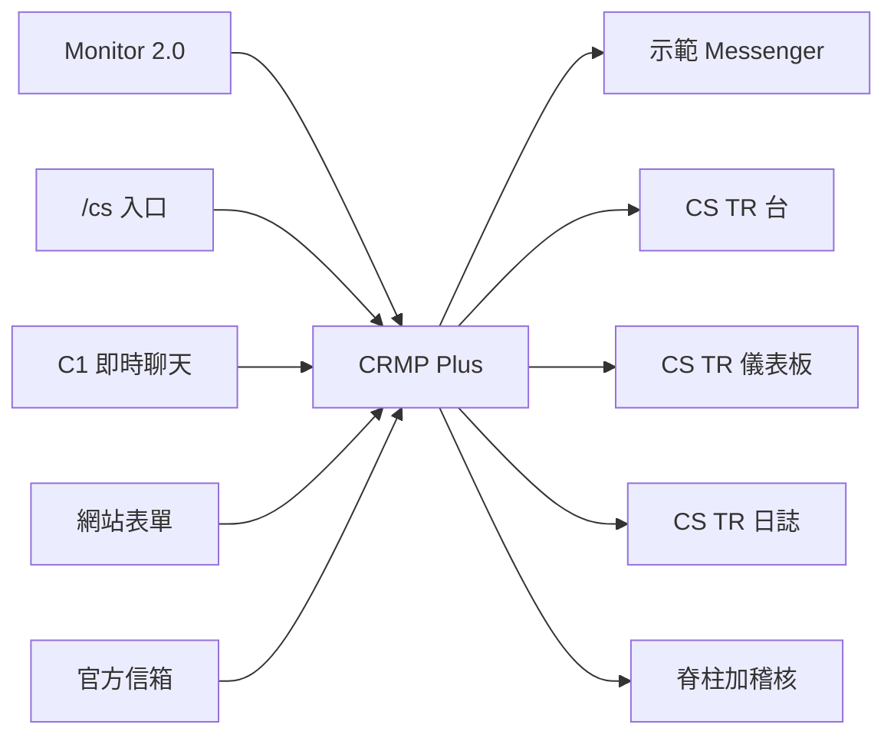

---

## 2. 目標

| # | 目標 | 可衡量結果 |
|---|---|---|
| G1 | 單一脊柱 | 偵測→分析→挑戰→升級→干預→稽核可在管理首頁脊柱（階段工單計數；脊柱日誌分頁已移除）看見 |
| G2 | 確定性路由 | 已知技能確定時自動執行；否則 RAG＋人工覆核 |
| G3 | 高嚴重度雙 AI | BREACH／CRITICAL 分析 100% 附第二 AI 挑戰 |
| G4 | AI 設定職能分離 | AI Admin 變更必須 Maker ≠ Checker |
| G5 | Messenger 原生作業 | 核心動作不必離開聊天 |
| G6 | 市場感知 | 每五分鐘情報掃描（localhost 即時；Pages 示範掃描） |
| G7 | 安全 AI 邊界 | 僅限人類的頁／功能／欄位列出並對 AI 拒絕 |
| G8 | 完整管理地圖 | §6.4 每個左側分組／頁都已交付並寫進文件 |
| G9 | 未讀感知 | 即時警報與追蹤／Messenger／情報／干預／首頁脊柱／稽核／Monitor 2.0／風險日誌的新工作顯示徽章，打開後清除 |
| G10 | 公開示範 | GitHub Pages 快照 `/PRD/crmp-plus/` 可走完後台，登入、Messenger「在管理後台開啟」、立即掃描不出現 404／405 |
| G11 | 具名負責人 | 平台負責人 demo platform owner 為一級角色；工作階段留在瀏覽器 |
| G12 | 雙公開網址 | 本升級平台為 `/PRD/crmp-plus/`；原 CRMP 管理後台凍結於 `/PRD/crmp-admin/` |
| G13 | 24/7 CS／TR 大門 | 三連接器＋`/cs` 共用 `POST /api/cs/intake`；不清楚／核身案件寄信並等待（上限 3、CSR-XXXX 對案）；五本 SKILL.md 蓋章；**專用儀表板＋日誌**；目錄列出此門 |

---

## 3. 本原型非目標

| 非目標 | 理由 |
|---|---|
| 正式 Lark Webhook 投遞 | 以稽核／寄件匣／應用內示範 Messenger 模擬 |
| 計費正式 LLM API | 以啟發式技能／RAG／挑戰者引擎代替 |
| 完整 MT4／MT5／LP 寫入適配 | 僅深連結＋模擬管理參照 |
| 大規模多品牌租戶 | 單一示範租戶 |
| 取代 Monitor 2.0 | CRMP 消費 Monitor，不重建它 |
| 正式 SSO／IdP | 示範角色＋ cookie／localStorage 工作階段 |
| 正式 IMAP／SMTP 信箱 | 官方信箱連接器經同一進件 webhook（示範寄出＋進件對案） |
| 把證件圖存進工單 | 核身經官方信箱追問；圖檔不進 `cs_requests`（流程庫，不是 blob） |
| CS 武裝交易緊急開關 | CS 絕不武裝 Monitor／交易控制；帳簿風險只經**升級風控**離開 |
| TR 全日值守 C1 | TR 在 CS 交接後負責成交／滑點；C1 由 CS 24/7 值守 |

---

## 4. 角色與待辦工作

| 角色 | 主要工作 |
|---|---|
| **平台負責人（demo platform owner）** | 擁有後台與文件；公開快照預設登入 |
| **風險負責人** | 接受／駁回 AI 包；升級；核准不可逆控制；跑 UAT 出口 |
| **風險分析師** | 分流警報；在 messenger 挑戰 AI；補充脈絡 |
| **營運主管／分析師** | 提案停交易／封鎖／加寬／暫停跟單；Maker 確認進管理後台 |
| **AI 工程師** | 技能、RAG、Monitor 2.0 偵測器登錄、第二意見門檻、AI Admin 提案 |
| **系統管理員** | 使用者／角色、分組設定、AI 存取黑名單、稽核衛生 |
| **客戶（公開 `/cs`）** | 以 C1 即時聊天、網站表單或官方信箱提問；回覆 CSR-XXXX／自動信直到台面資料足夠 |
| **CS L1（24/7 台）** | 分流進件；寄／等追問；用 RAG 答 FAQ；WAITING 時絕不結案 |
| **客服主管** | 等待迴圈達上限 3 後接手；核身庫例外；值守不清楚佇列 |
| **TR 成交支援** | CS 指派後負責成交、滑點、拒單；絕不從 C1 改價 |
| **檢視者** | 唯讀監督（不操作 AI Admin） |

---

## 5. 使用者旅程（快樂路徑）

### 5.1 高嚴重度警報 → 雙 AI → messenger 結案
1. Monitor 指標越線（例如 COPY 集中度）。  
2. CRMP 建立警報＋AI 分析（`SKILL_MATCH` 或 `RAG_REASONING`），並一律產出 **如何改進** 審查（資料源、休眠指標健康、推理缺口、新技能型態、門檻 X→Y、回應時間），可用聊天拉資料、補事實、挑戰、重產。  
3. 若嚴重度 ≥ `ai.second_opinion_severity`（預設 BREACH），跑 `crmp-challenger-v0`。  
4. 風險分析師打開示範 Messenger 執行緒；**顯示證據**；可選以聊天挑戰。  
5. 風險負責人審主 AI＋挑戰者；**結案（接受 AI）** 或升級／要求控制。

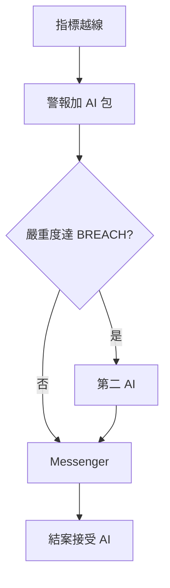

### 5.2 控制：雙重確認＋Checker
1. 操作者選建議動作（例如封鎖使用者帳號）。  
2. 雙重確認關卡 → 模擬 Vantage 管理參照＋連結。  
3. 若 `needs_checker`，Checker 經人工干預／指示路徑核准。  
4. 稽核＋脊柱記錄 Maker／Checker 結果。

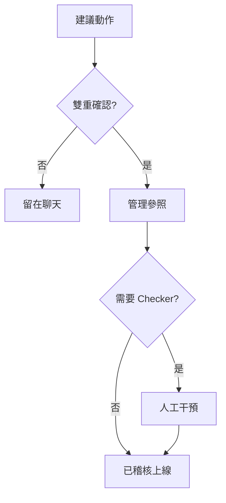

### 5.3 AI Admin 變更
1. Maker 在 AI Admin 提案設定／模型／政策。  
2. 不同的 Checker 核准。  
3. 自己核准自己被拒絕。

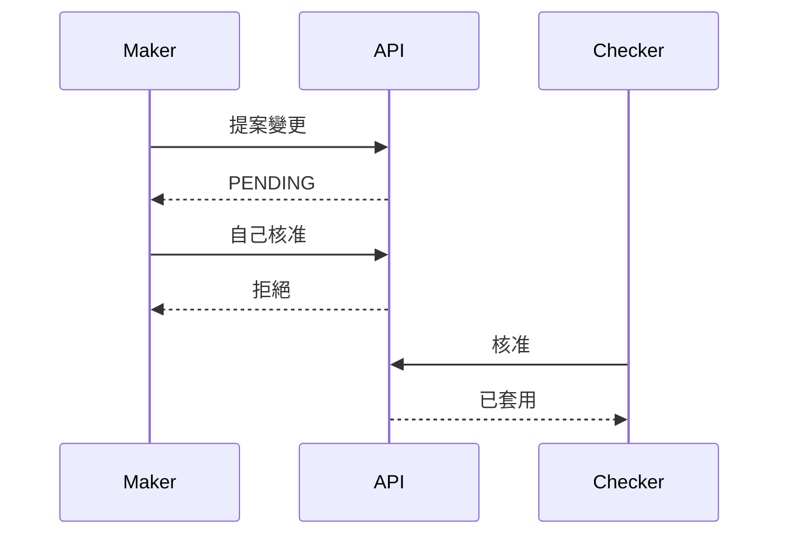

### 5.4 公開快照上的市場情報
1. 操作者在 GitHub Pages 打開市場情報。  
2. **立即掃描** 跑用戶端示範掃描（與即時同一批模板）。  
3. 發現、寄件匣、掃描紀錄在本機更新。沒有 405。

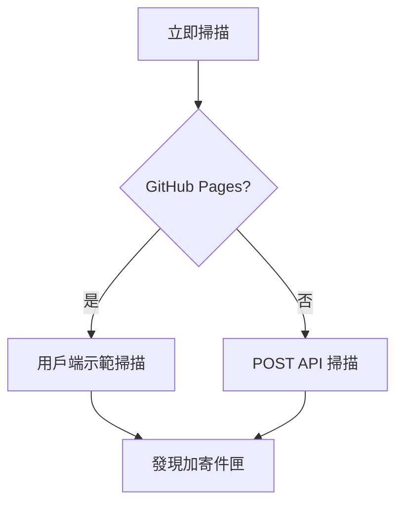

### 5.5 知識樹下鑽
1. 打開知識樹，必要時篩 CFD 或 Crypto。  
2. 點領域（例如 LP_HEDGE）展開技能。  
3. 點技能；檢視器填入；**進入** 打開 SKILL.md 劇本。

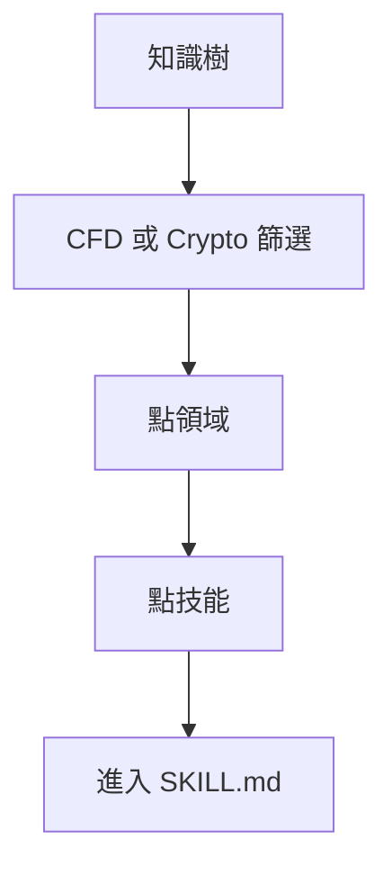

### 5.6 未讀徽章
1. Monitor 2.0 **執行全部指標**／情報掃描／AI 模擬產生新工作。  
2. 左側徽章增加（即時警報與追蹤、Messenger、情報等）。  
3. 打開該分頁寫入「已看」，本瀏覽器徽章降為零。

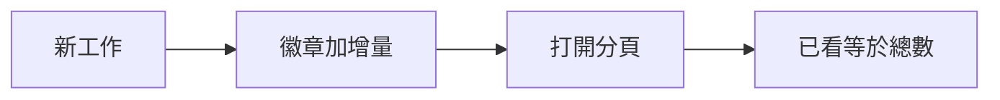

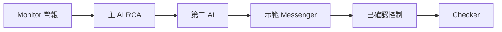

### 5.7 客戶進件 → 等待迴圈 → 回覆
1. 客戶開啟公開 [`/cs`](/cs)（或 C1／網站表單／官方信箱）。三條都打 `POST /api/cs/intake`。  
2. AI 蓋專用技能（過短或需核身時為 `SKILL-CS-CLARIFY` 或 `SKILL-CS-ID-VERIFY`）。  
3. 台面寄**一封**自動信（`EMAIL_OUT`），狀態 `AWAITING_CLIENT`／`ID_VERIFY`，追問 **WAITING**（上限 3）。WAITING 時禁止結案。  
4. 客戶以主旨 `CSR-XXXX`、同一 `channel_ref`、`in_reply_to` 或 `request_id` 回覆。進件**續辦**原案 — 不開第二張工單。  
5. AI 重新分流。仍過短則再寄（直到上限）；資料齊全則分類＋嚴重度＋AI 草稿（直回或 POC 審閱）。

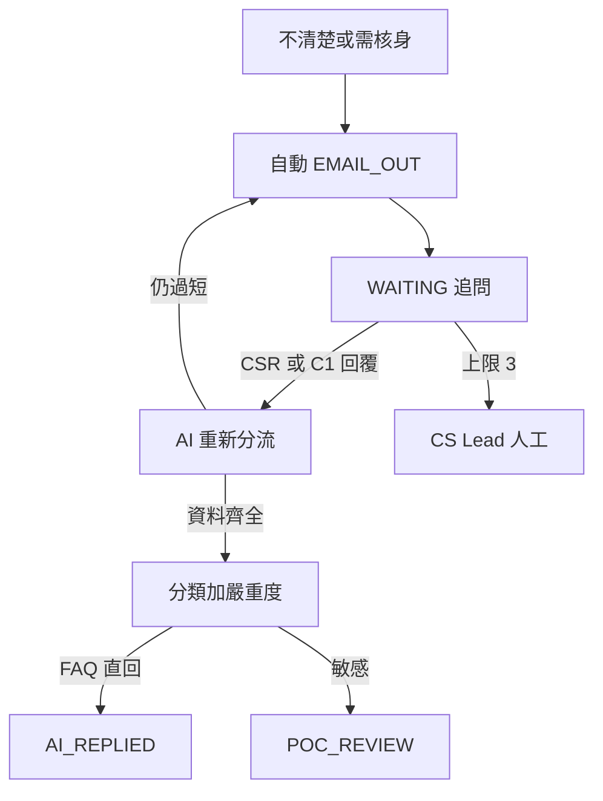

### 5.8 技能蓋章 → CS 自動回、TR 或風控
1. 清楚的隔夜利息／交易時段／UID 問題蓋 `SKILL-CS-ACCOUNT-FAQ` — CS 可從 RAG（`cs-swap-faq`）作答。  
2. 成交／滑點／MT4／MT5 蓋 `SKILL-TR-EXECUTION` — CS **指派 TR**，絕不改價。  
3. 疑詐欺／A-book／流動性蓋 `SKILL-CS-ESCALATE-RISK` — 經 `ESC-CS-RISK` 落入示範 Messenger。

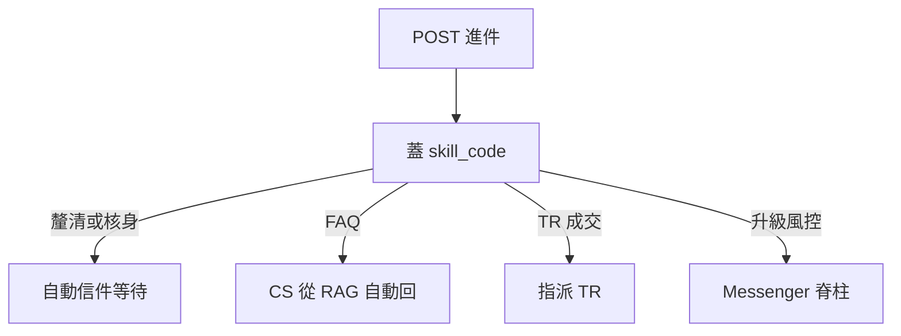

### 5.9 在網址目錄找到這扇門
1. 操作者開啟 [網址目錄](/admin/docs/urls)。  
2. 閱讀 CS／TR 速記（`/cs`、進件 API、CSR-XXXX）。  
3. 從 **CS／TR** 區段打開 `/cs`、`/admin/cs-desk`、SKILL-CS-* 劇本或 `GET /api/cs/intake`（UAT-25）。

### 5.10 資料齊全 → 分類、嚴重度、直回或 POC
1. 等待迴圈事實已齊（清晰度 `clear`，或回覆 ≥48 字且含 UID）。  
2. 啟發式 AI（`analyzeCsRequest`）分類並給 **LOW／MEDIUM／HIGH／CRITICAL**。  
3. 起草詳細方案與客戶回覆。  
4. 敏感度來自 `cs.auto_reply_max_severity`（預設 MEDIUM）與 `cs.sensitive_categories`（complaint, kyc, trading）：FAQ 未超上限**直回**（`AI_REPLIED`）；核身／投訴／成交**交具名 POC** 補細節後寄出（`POC_REVIEW` → `AI_REPLIED`）；CRITICAL／帳簿風險仍**升級風控**（不直寄客戶）。成交維持 `ASSIGNED_TR`。

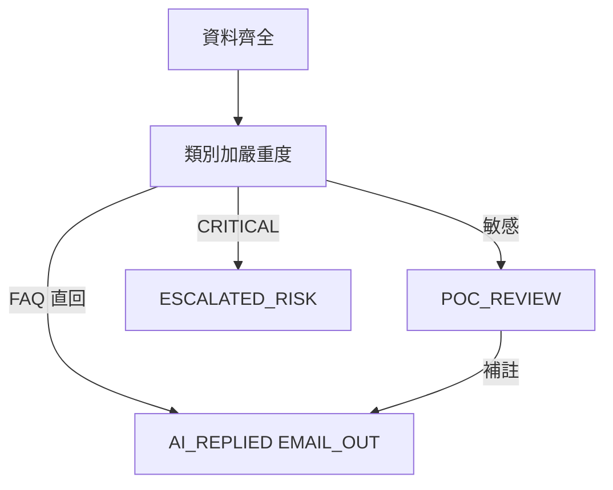

---

## 6. 功能需求

### 6.1 P0 — 原型必須交付

| ID | 需求 | 驗收草圖 |
|---|---|---|
| FR-01 | 同步／顯示 Monitor 2.0 指標並拉警報 | 統一指標＋偵測器登錄（EQ／MRG／COPY）；全部執行／暫停；模擬警報可用；Monitor 無警報／工單分頁 |
| FR-02 | 技能匹配 RCA 含步驟執行紀錄 | COPY 越線 → `SKILL_MATCH`＋技能執行步驟 |
| FR-03 | 技能不確定時 RAG RCA | EQ 路徑可產出 `RAG_REASONING`＋證據 |
| FR-04 | 達門檻之獨立第二 AI 挑戰者 | BREACH／CRITICAL 顯示面板＋CHALLENGER 證據；WARN 預設略過 |
| FR-05 | 示範 Messenger：證據／聊天／升級／排除／結案 | 每個動作變更執行緒＋稽核 |
| FR-06 | 建議控制＋雙重確認 → 管理參照 | 封鎖／停交易等產出 admin_ref；必要時 Checker 註記 |
| FR-07 | AI Admin Maker ≠ Checker | 同一使用者不能核准自己的提案 |
| FR-08 | AI 存取黑名單（頁／功能／欄位） | UI 列出僅限人類目標與理由 |
| FR-09 | AI／messenger／干預事件進首頁脊柱＋稽核 | 約 1 分鐘內可對上；脊柱日誌分頁已移除 |
| FR-10 | 管理介面 RBAC | 檢視者被擋在 AI Admin 操作路徑外；角色頁可經 `/api/roles` 編輯 |

### 6.2 P1 — 原型應交付

| ID | 需求 | 驗收草圖 |
|---|---|---|
| FR-11 | 市場情報 5 分鐘掃描＋寄件匣卡片格式 | localhost 可掃；GitHub Pages 用用戶端示範掃描（無 405）。發現／寄件匣／掃描紀錄會更新。 |
| FR-12 | 風險日誌分析 | 總覽含已關閉追蹤卡（工單已關閉、AI、BU／AI 動作、核定方案）＋90 天歷史圖表（已回填）＋時序／損失 vs 防損 |
| FR-13 | 雙語產品文件（英／繁中） | PRD、TSD、使用手冊、UAT、生態、路線圖、開放議題、進度、網址目錄可切換 |
| FR-14 | 響應式管理後台（網頁＋手機） | 390px：抽屜＋ messenger 主從；寬表改卡片列表；無整頁溢出 |
| FR-15 | 豐富技能風險情境／鏈 | 技能看板顯示門檻與升級；**進入** 打開 `/admin/skills/{code}` |
| FR-16 | 示範導覽網址目錄 | `/admin/docs/urls` 列出管理／API／資料路徑＋公開 Pages 網址，加上 CS／TR 區段（`/cs`、台面、五本 SKILL.md、RAG 葉、`/api/cs/intake`） |
| FR-21 | 管理首頁快照 | 每張卡／列皆為連結（數字、負責人、Messenger、跳轉、部門、最近警報、脊柱步驟）。虛擬警報／虛擬警報組走完 DETECT→結案；介面與儲存文案為英／繁中。 |
| FR-22 | 每日績效儀表板 | CFD＋加密指標格；localhost 可重新整理 |
| FR-23 | Monitor 2.0 登錄（指標＋偵測器） | 全部執行／同步／暫停；近期執行；localhost 可啟用／停用（`/admin/detectors` 轉址至此） |
| FR-24 | 即時警報與追蹤確認佇列 | 僅 OPEN；分組 AI 管線；Acknowledge 變更狀態；已關閉 → 風險日誌 |
| FR-25 | 知識樹視覺化 | SVG 圖＋大綱；領域展開（含 CS_SERVICE／TRADING_EXEC）；進入劇本；RAG 文件葉深連結 |
| FR-26 | 分組平台設定 | 七組（平台、monitor、AI、市場情報、Lark、SLA、**CS／TR** `cs.*`）；localhost 儲存／Pages 僅本機瀏覽器 |
| FR-27 | 組織目錄 | BU 與團隊合併中心（`/admin/departments`）、可編輯角色（`/admin/roles` · `/api/roles`）、使用者（含 demo platform owner／haixiang.yan@hytechc.com） |
| FR-28 | 升級路徑＋Lark 登錄 | 維度 × 係數；ESC-DEFAULT 兜底；技能綁一條路徑代碼；無「路徑」名稱欄；頻道啟用 |
| FR-36 | 稽核平面分流＋回滾 | `/admin/audit` CRMP 日誌 vs Vantage Markets 管理日誌分頁；回滾經 `POST /api/audit/rollback` 還原變更前快照 |
| FR-29 | 未讀導覽徽章 | 徽章 = max(0, 總數+增量−已看)；打開清除；新工作增加 |
| FR-30 | Pages 登入保持 | 以具名角色登入；重新整理仍在；登入連結在 `/PRD/crmp-plus/login/`（無 404） |
| FR-31 | 分組左側導覽＋Vantage 標誌 | 七組；英／繁中標籤；負責人列 |
| FR-32 | UAT 互動包 | UAT-01…UAT-53 含為什麼／步驟／通過／證據與畫面覆蓋 |
| FR-33 | 資料來源登錄 | 內部＋外部目錄；localhost 可管理 |
| FR-34 | 風險領域目錄 | CFD＋加密領域含 P0–P3 情境，並掛上 Monitor 2.0 指標 |
| FR-35 | 如何改進審查＋聊天 | 每次 AI 分析（各嚴重度）產 DATA_SOURCE／INDICATOR_HEALTH／REASONING_GAP／SKILL_PATTERN／THRESHOLD／RESPONSE_TIME；聊天可拉資料／補事實／挑戰／重產直到 SATISFIED |
| FR-37 | CS／TR 24/7 台 | `/admin/cs-desk` 收件匣：C1、網頁表單與官方信箱經 `POST /api/cs/intake`；公開 `/cs`；技能晶片；指派 TR；升級風控；simulate_c1／form／email。UAT-46。 |
| FR-38 | CRMP Plus 公開網址 | 永久快照 `https://hxyan2020.github.io/PRD/crmp-plus/`；原 CRMP 管理後台 `/PRD/crmp-admin/` 凍結且不被覆蓋 |
| FR-39 | CS／TR 專用技能＋RAG 樹 | 五份 SKILL.md：`SKILL-CS-CLARIFY`／`ID-VERIFY`／`ACCOUNT-FAQ`、`SKILL-TR-EXECUTION`、`SKILL-CS-ESCALATE-RISK` 蓋 `skill_code`；知識樹 `CS_SERVICE`／`TRADING_EXEC`；RAG `cs-*` 葉；路徑 `ESC-CS-24-7`／`ESC-CS-KYC`／`ESC-TR-DEAL`／`ESC-CS-RISK`。UAT-50。 |
| FR-40 | 公開 CS 進件入口＋進件回覆 | 客戶 `/cs` 分頁（C1、表單、官方信箱）打 `/api/cs/intake`；GET 連接器目錄；回覆以 `request_id`／`in_reply_to`／`channel_ref`／`CSR-XXXX` 續辦原案。永久網址 `https://hxyan2020.github.io/PRD/crmp-plus/cs/`。 |
| FR-41 | 自動信件等待迴圈 | 不清楚或需核身 → 一封 `EMAIL_OUT`，狀態 `AWAITING_CLIENT` 或 `ID_VERIFY`，追問 `WAITING`；上限來自 `cs.followup_cap`（預設 3）後客服主管；**WAITING 時禁止結案**。UAT-47。 |
| FR-42 | CS／TR 隱私＋公開狀態 | `GET /api/cs/intake?request_id=` 回傳無個資狀態；切勿把證件圖存進案件；核身庫是流程不是 blob。UAT-49。 |
| FR-43 | CS／TR 操作文件 | 使用手冊 §9.3；網址目錄 **CS／TR** 區段（`/cs`、台面、儀表板、日誌、資料、五本技能、RAG 葉、進件 API、`cs_*` 表）；UAT 目錄 v2.7（UAT-25＋UAT-46…53＋支援 17／22／27–29／36–40） |
| FR-44 | CS／TR 儀表板＋日誌 | 專用 `/admin/cs-dashboard`（指標：總數、未結／已結、WAITING、追問上限、TR、風控，依渠道／狀態／技能／台面）與 `/admin/cs-log`（CS_* 時間軸＋已結包）。**不是**每日績效（`/admin/dashboard`），**不是**風險日誌分析（`/admin/risk-log`）。`GET /api/cs?view=dashboard\|log`。UAT-51。 |
| FR-45 | CS／TR 配套資料 | 種子並呈現：CUSTOMER_SERVICE／TRADING BU；團隊 CS 24/7 台、**CS 核身庫**、TR 成交支援；具名 POC；路徑 `ESC-CS-24-7`／`ESC-CS-KYC`／`ESC-TR-DEAL`／`ESC-CS-RISK`；`cs.*` 參數（上限、SLA、進件 token、信箱、Lark）；C1／表單／信箱＋核身庫＋成交帶來源。頁面 `/admin/cs-data`，`GET /api/cs?view=data`。UAT-52。 |
| FR-46 | 分類、嚴重度、AI 方案，直回 vs POC | 資料齊全後：類別＋LOW\|MEDIUM\|HIGH\|CRITICAL；啟發式方案＋客戶草稿；敏感度 `auto` 時直回（`AI_REPLIED`）；否則具名 POC 補細節後寄出（`POC_REVIEW`）。閘道：`cs.auto_reply_max_severity`、`cs.sensitive_categories`。CRITICAL／帳簿風險仍升級。原型 — 此路徑無正式 LLM。UAT-53。 |

### 6.3 P2 — 之後（生態階段）

| ID | 需求 |
|---|---|
| FR-17 | 正式 Lark 互動卡片 |
| FR-18 | Monitor 雙向工單回寫 |
| FR-19 | 真實交易控制匯流排含 dry-run |
| FR-20 | 正式 LLM＋評測架；挑戰者供應商多樣化 |

### 6.4 功能目錄 — 每一個管理介面

此表**就是**管理後台的產品範圍。左側有的列，就在本 PRD、使用手冊、TSD 與 UAT 範圍內。

| 分組 | 功能 | 路徑 | 待辦工作 | 關鍵驗收 |
|---|---|---|---|---|
| 總覽 | 管理首頁 | `/admin` | 定向；用卡片跳轉；虛擬脊柱演練；脊柱階段計數 | 每張卡／列皆為連結；虛擬按鈕；脊柱視覺；messenger＋CS／TR CTA |
| 監控與風險 | 每日績效 | `/admin/dashboard` | 當日 CFD＋加密畫面 | 兩產品格；WARN／BREACH 數 |
| 監控與風險 | 風險日誌分析 | `/admin/risk-log` | 處理時間、損失 vs 防損、漏洞 | 摘要＋類別＋領域＋紀錄 |
| 監控與風險 | 市場情報 | `/admin/market-intel` | 會移動 LP 的頭條 | 立即掃描；發現；寄件匣；掃描紀錄；Pages 示範掃描 |
| 監控與風險 | Monitor 2.0 | `/admin/monitor-2` | 統一指標＋偵測器登錄 | 全部執行／同步／暫停；近期執行；未結警報連至即時警報與追蹤（無警報／工單分頁） |
| 監控與風險 | 偵測器（轉址） | `/admin/detectors` | 僅書籤 | 左側無此列 — 轉址 Monitor 2.0 |
| 監控與風險 | 即時警報與追蹤 | `/admin/alerts` | 未結佇列＋分組 AI 管線 | MonitorCode 提示；僅 OPEN；確認；`/admin/ai-analyses` 列表轉址至此 |
| 監控與風險 | 風險領域 | `/admin/risk-domains` | 權責＋P0–P3 情境對應 Monitor 2.0 | 展開情境；點 M2-* 晶片 |
| AI 與知識 | AI 分析（轉址） | `/admin/ai-analyses` → `/admin/alerts` | 列表併入即時警報與追蹤 | 分組管線＋排序說明；明細包在 `/admin/ai-analyses/[id]` |
| AI 與知識 | AI 管理 | `/admin/ai-admin` | 雙人治理＋第一／第二線卡片 | 七個分頁；propose_rag 人工閘道；Maker ≠ Checker |
| AI 與知識 | AI 技能 | `/admin/skills` | 劇本＋鏈 | 進入 → SKILL.md 頁 |
| AI 與知識 | 知識樹 | `/admin/knowledge-tree` | 視覺地圖 | 圖／大綱；CS_SERVICE／TRADING_EXEC；RAG 葉＋深連結 |
| AI 與知識 | RAG 知識庫 | `/admin/rag` | 語料檢索 | 人工閘道：AI 不能編輯 → 升級人類／propose_rag |
| 應變 | 人工干預 | `/admin/interventions` | 執行期 Checker | 核准／駁回＋備註；樣本顯示操作者信箱 |
| 應變 | 示範 Messenger | `/admin/messenger` | 聊天原生分流＋鳥瞰 POC 窗 | 路徑晶片、承辦窗、同步、證據、聊天、升級、排除、結案、控制、在管理後台開啟 |
| 應變 | CS／TR 台 | `/admin/cs-desk` | 24/7 C1、表單與信箱進件 | 三渠道；公開 `/cs` 入口；CSR-XXXX 進件回覆；專用技能晶片；等待迴圈上限 3；分類／嚴重度／直回 vs POC；TR 分流；升級風控 |
| 應變 | CS／TR 儀表板 | `/admin/cs-dashboard` | CS／TR 量與等待迴圈健康 | 獨立於每日績效；WAITING／上限 3／TR／風控指標；依渠道、狀態、技能、台面 |
| 應變 | CS／TR 日誌 | `/admin/cs-log` | CS_* 時間軸與已結包 | 獨立於風險日誌；篩選 CS_INTAKE … CS_RESOLVE；已結案件包 |
| 應變 | CS／TR 資料 | `/admin/cs-data` | BU、團隊、關卡、參數 | 即時契約；連到組織／升級／設定／來源／Lark |
| 應變 | Lark 整合 | `/admin/lark` | 頻道登錄 | 清單＋啟用；`oc_cs_c1`／`oc_tr_dealing`；localhost 模擬通知 |
| 應變 | 升級路徑 | `/admin/escalation` | 維度 × 係數 → 團隊 → SLA | ESC-DEFAULT 加上 ESC-CS-24-7／ESC-CS-KYC／ESC-TR-DEAL／ESC-CS-RISK；技能綁一條 |
| 組織 | BU 與團隊 | `/admin/departments` | RACI＋值班 | 合併中心；`/admin/teams` 轉址 |
| 組織 | 角色與權限 | `/admin/roles` | 可編輯 RBAC | `/api/roles`；權限晶片＋章程 |
| 組織 | 使用者 | `/admin/users` | 目錄 | demo platform owner／haixiang.yan@hytechc.com；管理可新增／停用 |
| 平台 | 資料來源 | `/admin/data-sources` | 來源登錄 | 分類＋狀態；C1 閘道、網站 CS 表單、官方信箱、CS 核身庫、MT4／MT5 成交帶 |
| 平台 | AI 存取安全 | `/admin/security/ai-access` | 僅限人類清單 | 黑名單＋允許＋禁止權限 |
| 平台 | 稽核日誌 | `/admin/audit` | CRMP／Vantage Markets 管理兩平面 | 兩個分頁；回滾還原變更前快照 |
| 平台 | 平台設定 | `/admin/settings` | 旗標 | 分組鍵含 **cs.***；儲存 |
| 文件 | 使用手冊 | `/admin/docs/user-guide` | 如何操作 | 英＋繁中；每一畫面加上 §9.3 CS／TR |
| 文件 | PRD | `/admin/docs/prd` | 為什麼／做什麼／怎麼過 | 本文件（FR-37…46、G13、§5.7–5.10、§6.5） |
| 文件 | TSD | `/admin/docs/tsd` | 怎麼做的 | 完整介面地圖 |
| 文件 | UAT 清單 | `/admin/docs/uat` | 簽核 | 52 案，可互動（UAT-46…53 CS／TR；目錄 v2.7） |
| 文件 | 生態導入評估 | `/admin/docs/ecosystem` | 導入 | 階段、預算、風險 |
| 文件 | 改進路線圖 | `/admin/docs/roadmap` | 下一步 | RM-01…15：今日／要做／完成標準 |
| 文件 | 開放議題 | `/admin/docs/open-issues` | 計畫缺口 | 20 項；CS／TR 目錄 v1.5 在 OI-19／20 |
| 文件 | 進度追蹤 | `/admin/docs/progress` | 時間軸看板 | X＝議題 Y＝現在→2027 |
| 文件 | 網址目錄 | `/admin/docs/urls` | 導覽 | 頁＋API＋表＋**CS／TR** 區段 |
| 殼層 | 登入 | `/login` | 具名角色 | 保持；Pages 路徑；負責人預設 |
| 殼層 | 語言 | cookie `crmp_ui_lang` | 英／繁中 | 導覽＋文件切換 |
| 殼層 | 未讀徽章 | 左側 | 新工作 | 增加／打開清除 |
| 殼層 | 手機抽屜 | `< lg` | 手機使用 | 漢堡；messenger 主從 |
| 公開 | CS 客戶入口 | `/cs` | 客戶 C1／表單／信箱 | 三個分頁；同一 `POST /api/cs/intake`；CSR-XXXX 等待迴圈；Pages 網址 `/PRD/crmp-plus/cs/` |

### 6.5 CS／TR 產品契約（僅 CRMP Plus）

此大門**只**交在 CRMP Plus（`/PRD/crmp-plus/`）。原 CRMP 管理後台 `/PRD/crmp-admin/` 保持凍結，不得接收這些路由。

#### 連接器 — 同一個 webhook

| 渠道 | 客戶面 | 產品行為 |
|---|---|---|
| `C1_LIVE_CHAT` | C1 元件＋`/cs` 即時聊天分頁 | `POST /api/cs/intake`（標頭 `x-cs-intake-token: demo-c1` 或工作階段）。`channel_ref`＝聊天工作階段。 |
| `WEB_FORM` | 網站／App 聯絡表單＋`/cs` 提交分頁 | 同一 webhook。`channel_ref`＝表單提交 id。 |
| `OFFICIAL_EMAIL` | 官方客服／投訴信箱＋`/cs` 官方信箱分頁 | 同一 webhook。主旨可帶 `CSR-XXXX`。 |

`GET /api/cs/intake` 回傳此目錄。操作者 `/api/cs` **不是**公開進件 — 那是台面動作（分流／分析／追問／客戶回覆／回覆／指派 TR／升級風控／結案／POC 放行／模擬_*）加上 `GET ?view=dashboard|log|data`。

#### 續辦 — 不得開第二張工單

進件內容在下列任一吻合時**續辦**既有 `CSR-XXXX`：`request_id`、`in_reply_to`、同一 `channel_ref`，或主旨 `CSR-[0-9A-F]{6}`。這會關閉 WAITING 追問，而不是再發一張工單。

#### 等待迴圈（FR-41）

AI 不清楚或需核身：寄**一封**自動信、卡住工單、等客戶。最多 **3** 封後改由客服主管親辦。追問仍為 WAITING 時禁止結案。

#### 技能蓋章（FR-39）

| 技能 | 何時 | 下一步 |
|---|---|---|
| `SKILL-CS-CLARIFY` | 過短／不清楚 | 自動信；`ESC-CS-24-7` |
| `SKILL-CS-ID-VERIFY` | KYC／護照／無法登入 | 官方信箱核身；`ESC-CS-KYC`；切勿存圖 |
| `SKILL-CS-ACCOUNT-FAQ` | 隔夜利息、時段、UID、入金 | CS 可從 RAG 自動回 |
| `SKILL-TR-EXECUTION` | 成交、滑點、拒單、MT4／MT5 | 指派 TR；CS 不改價 |
| `SKILL-CS-ESCALATE-RISK` | 詐欺／A-book／流動性 | 經 `ESC-CS-RISK` 進示範 Messenger |

知識樹樹幹：`CS_SERVICE`、`TRADING_EXEC`。時間鏈：`CHAIN-CS-TR-INTAKE`。RAG 葉：`cs-24-7-intake`、`cs-id-verify-policy`、`cs-swap-faq`、`tr-dealing-handoff`、`cs-escalate-to-risk`、`cs-skill-playbooks`。

#### 隱私（FR-42）

公開案件狀態**無個資**。證件圖不存進 `cs_requests`。稽核在 CRMP 平面記錄 `CS_*` 動作。

#### 文件（FR-43）

操作者不必猜路徑：網址目錄 CS／TR 區段、使用手冊 §9.3、UAT-25／UAT-46…53。

#### 專用儀表板＋日誌（FR-44）

CS／TR 量與等待迴圈健康在 `/admin/cs-dashboard`。CS_* 稽核加上已結包在 `/admin/cs-log`。每日績效仍是 CFD／加密日終指標。風險日誌分析仍是已關閉 Monitor 追蹤包。混在同一畫面是產品缺陷。

#### 配套資料（FR-45）

台面、儀表板與日誌必須讀同一套營運紀錄：CUSTOMER_SERVICE 與 TRADING BU；團隊 **CS 24/7 台**、**CS 核身庫**、**TR 成交支援**；具名 POC；路徑 `ESC-CS-24-7`（釐清／FAQ）、`ESC-CS-KYC`（核身）、`ESC-TR-DEAL`（成交）、`ESC-CS-RISK`（帳簿風險）；`cs.*` 參數（`followup_cap`、`auto_reply_max_severity`、`sensitive_categories`、等待／TR／風控 SLA、進件 token、support@／complaints@、Lark 頻道）。`/admin/cs-data` 是契約頁。`GET /api/cs?view=data` 回即時內容。證件圖不進 `cs_requests` — 核身庫只存狀態旗標。

#### 分類／嚴重度／直回 vs POC（FR-46）

等待迴圈資料齊全後，AI **必須**分類、給嚴重度，並起草方案與客戶回覆。低敏感 FAQ 可立刻寄出（`AI_REPLIED`）。敏感類別與嚴重度超過 `cs.auto_reply_max_severity` 時交**具名 POC** 補細節後才寄（`POC_REVIEW`）。CRITICAL／帳簿風險永不直寄客戶。原型啟發式 — 此路徑無正式 LLM。

---

## 7. 非功能需求

| ID | 領域 | 需求 |
|---|---|---|
| NFR-01 | 延遲 | 原型：警報 → 雙 AI 包通常 < 60 秒 |
| NFR-02 | 可稽核 | 警報／分析／messenger／AI Admin／CS_* 變更發出稽核 |
| NFR-03 | 安全 | AI 主體不得取得黑名單權限；公開 CS 狀態無個資 |
| NFR-04 | 職能分離 | AI Admin 強制 Maker／Checker；指定控制要 Checker |
| NFR-05 | 可用性 | 示範單節點 SQLite 可接受；正式需 HA（見生態） |
| NFR-06 | 國際化 | 操作文件英＋繁中；UI 導覽語言切換 |
| NFR-07 | 基本無障礙 | 手機可點；關鍵動作有標籤 |
| NFR-08 | 公開快照 | 靜態匯出 `basePath` `/PRD/crmp-plus`；原 CRMP 管理後台仍在 `/PRD/crmp-admin`；沒有死掉的 `/api` 點擊（示範後備） |
| NFR-09 | 工作階段 | 示範角色在 Pages 以 `localStorage`＋cookie 保持 |
| NFR-10 | CS 等待迴圈 | 自動信上限來自 `cs.followup_cap`（預設 3）；WAITING 時禁止結案；進件對案必須續辦、不得重複 |
| NFR-11 | CS 隱私 | `cs_requests` 不存證件圖；`/cs` 與公開 GET 狀態保持低個資 |
| NFR-12 | CS 敏感度閘道 | 僅當嚴重度 ≤ `cs.auto_reply_max_severity` 且類別不在 `cs.sensitive_categories` 時直回；否則需 POC 補註 |

---

## 8. 詳細驗收標準（原型關卡）

1. **技能＋挑戰者：** 模擬 COPY BREACH → `SKILL_MATCH`＋第二 AI 面板，被挑戰時至少 1 項 HIGH 改進。  
1b. **如何改進：** 同一分析（任何嚴重度）開啟如何改進面板（資料源／健康／推理／技能／X→Y／回應時間）與聊天（拉資料／補事實／挑戰／重產／標記滿意）；證據含 IMPROVEMENT 列。  
2. **門檻：** 僅 WARN 的 EQ 模擬在預設 BREACH 門檻下**不**建立挑戰。  
3. **Messenger 路徑：** 顯示證據貼上保險庫；升級前進路徑；排除／結案更新狀態。  
4. **控制：** 封鎖帳號 → 雙重確認 → admin_ref；必要時 Checker 後續。  
5. **AI Admin：** 需要不同 Checker；自己核准被擋。  
6. **覆蓋：** UAT 視窗 BREACH／CRITICAL 樣本 100% 已挑戰（允許回填）。  
7. **文件：** PRD／TSD／使用手冊／UAT／生態／路線圖／開放議題／進度英繁皆可渲染；使用手冊對左側每一頁都有操作說明。  
8. **手機：** Messenger 列表→執行緒→返回在約 390px 可用且無整頁溢出。  
9. **Pages：** 登入、messenger 在管理後台開啟、市場情報立即掃描不出現 404／405。  
10. **知識樹：** 領域展開＋進入打開劇本。  
11. **未讀：** 新模擬／掃描／Monitor 全部執行讓徽章增加；打開分頁清除。  
12. **負責人登入：** demo platform owner 角色在 Pages 重新整理後仍在。  
13. **選單真相：** 左側為即時警報與追蹤（非「即時警報」舊名）；無偵測器／AI 分析列表／脊柱日誌列；`/admin/detectors`→Monitor 2.0；`/admin/ai-analyses`→警報；`/admin/spine`→首頁。  
14. **CS 連接器：** C1、網站表單與官方信箱各經 `POST /api/cs/intake` 在台面開列（UAT-46），含 `/cs`。  
15. **等待迴圈：** 不清楚或需核身寄自動信並 WAITING；CSR-XXXX／`channel_ref` 回覆續辦同一工單；關閉前禁止結案（UAT-47）。上限 3 後客服主管。  
16. **技能＋樹：** 種子請求顯示 SKILL-CS-*／SKILL-TR-* 晶片並打開 SKILL.md；知識樹有 CS_SERVICE／TRADING_EXEC；RAG 有 `cs-24-7-intake`（UAT-50）。  
17. **目錄：** 網址目錄 CS／TR 區段列出 `/cs`、台面、儀表板、日誌、資料、五本劇本、RAG 葉與 `/api/cs/intake`（UAT-25）。  
18. **CS 儀表板＋日誌：** `/admin/cs-dashboard` 顯示 CS／TR 指標（不是每日績效）。`/admin/cs-log` 顯示 CS_* 事件與已結包（不是風險日誌）。UAT-51。  
19. **隱私：** 公開狀態 GET 無個資；證件圖不在工單上（UAT-49）。  
20. **配套資料：** `/admin/cs-data` 顯示 CS／TR BU、CS 核身庫、四條升級關卡（含 `ESC-CS-KYC`）與 `cs.*` 參數；平台設定有 CS／TR 分組；台面／儀表板讀即時上限。UAT-52。  
21. **齊全後分析：** 清楚 FAQ 直回（`AI_REPLIED`）。齊全核身交具名 POC 補註後寄出。TR 維持 `ASSIGNED_TR`。CRITICAL／帳簿風險仍升級。UAT-53。

正式執行：[UAT 清單](/admin/docs/uat)（UAT-01 … UAT-53）。此包覆蓋每一個管理畫面、完整 messenger 迴路（收件匣、證據、挑戰、升級、排除、結案、建議控制、同步），以及 CS／TR 大門（C1／表單／信箱、`/cs`、等待迴圈、分類／嚴重度／直回 vs POC、專用 SKILL.md、TR 分流、核身庫、目錄、儀表板、日誌、資料契約）。

---

## 9. 成功指標（試點）

| 指標 | 目標 |
|---|---|
| 警報 → 雙 AI 包平均時間 | < 60 秒（原型） |
| BREACH+ 附挑戰者比例 | 100% |
| 誤報排除已稽核 | 100% |
| AI Admin 變更有不同 Checker | 100% |
| 僅限人類介面已列入黑名單 | 約定清單 100% |
| Critical UAT 案例通過 | 100% |
| 左側頁面有使用手冊說明 | 100% |
| 公開立即掃描／登入／在管理後台開啟 | 快樂路徑 0 個硬 404／405 |
| 不清楚／核身案件寄信並等待（不結案） | 該分流結果 100% |
| 進件回覆續辦 CSR-XXXX（不重複） | 已對上進件 100% |
| 網址目錄 CS／TR 必列路徑 | 100%（`/cs`、台面、五本技能、進件 API） |

---

## 10. 範圍邊界與依賴

**依賴：** Monitor 2.0 指標模型；未來以 Lark 為企業即時通訊；真實控制靠 Vantage 管理後台；正式 SSO 靠 IdP；正式進件靠官方信箱＋C1 閘道。  
**提供給：** 風險／營運桌單一控制平面 UI＋稽核脊柱；CS／TR 在同一平面的 24/7 客戶大門。  
**B／C 階段前不在範圍：** 正式 C1／IMAP Webhook、寫入適配、Postgres HA（見 [生態導入評估](/admin/docs/ecosystem)）。

---

## 11. 風險與未決問題

| 風險／問題 | 緩解 |
|---|---|
| 啟發式 AI 過度自信 | 高嚴重度強制第二 AI；PARTIAL／DISAGREE 標需要人類 |
| 操作者繞過 messenger | 保留管理深連結；兩條路都稽核 |
| 過早自動寫入 | 生態 C 階段控制匯流排前先影子模式 |
| 企業標準即時通訊是哪個？ | 假設 Lark；Teams 適配待定 |
| 證據 PII 保存 | 正式識別資料前做法務檢視 |
| GitHub Pages 空資料庫 | 後備導覽總數＋用戶端示範掃描＋示範工作階段 |
| CS 工單重複（對案失敗） | 以 `request_id`／`in_reply_to`／`channel_ref`／`CSR-XXXX` 續辦；UAT-47 |
| 證件圖落到工單 | 產品規則：永不存；核身只經官方信箱（FR-42） |
| CS 武裝交易控制 | 只升級風控；CS／TR 台不能建議停交易／封鎖 |

---

## 12. 發行計畫（原型 → 正式）

| 階段 | 成果 |
|---|---|
| 原型（現在） | 完整管理地圖、雙 AI、messenger、**CS／TR 大門**（`/cs`、進件、等待迴圈、分析／POC、技能、資料契約）、文件、UAT-01…53、公開 Pages 快照 |
| A 階段 | 強化驗證／託管／可觀測 |
| B 階段 | 即時 Monitor＋Lark 通知（讀路徑） |
| C 階段 | 受監督寫入路徑＋緊急開關 |
| D 階段 | 模型營運／挑戰者多樣 |

---

## 13. 可追溯性

| 產品產物 | 在哪裡 |
|---|---|
| 每頁操作說明 | 使用手冊 §6–§12（CS／TR：§9.3） |
| 每頁技術模組 | TSD §7＋§8–§18（CS／TR：§17） |
| 每介面測試案例 | UAT 目錄 v2.7 — UAT-01…UAT-53 的 `covers` 欄（CS／TR 主案：UAT-25、UAT-46…53；支援：17／22／27–29／36–40） |
| 公開與本機網址 | 網址目錄（CS／TR 區段） |

---

## 14. 核准

| 角色 | 姓名 | 決策 | 日期 |
|---|---|---|---|
| 平台負責人／文件負責人 | demo platform owner | 具名 | 2026-10-04 |
| 風險負責人 | Alex Chen（示範） | 示範角色 | |
| 風險平台 PM | demo platform owner | 具名 | 2026-10-04 |
| 工程主管 | _待定_ | | |
| 資安／GRC | _待定_ | | |

---

## 15. 文件控制

| 版次 | 日期 | 說明 |
|---|---|---|
| 1.0 | 2026-10-01 | 目標 G1–G7、FR-01…16 |
| 1.5 | 2026-10-04 | 各旅程與職能分離流程圖 |
| 1.6 | 2026-10-05 | 首頁脊柱、BU 與團隊、AI 一線／二線、propose_rag、ESC-DEFAULT、開放議題／進度 |
| 1.7 | 2026-10-05 | 稽核 CRMP／Vantage Markets 管理分頁＋回滾；可編輯角色；升級維度 × 係數 |
| 1.8 | 2026-10-05 | 選單真相：即時警報與追蹤；偵測器→Monitor 2.0；AI 分析列表轉址；Monitor 中心無警報／工單分頁 |
| 1.9 | 2026-10-06 | FR-37 CS／TR 24/7 台；UAT-46…49；TSD §17 |
| 2.0 | 2026-10-06 | CRMP Plus 一體平台；G12／FR-38 雙網址（`/PRD/crmp-plus/` vs 凍結 `/PRD/crmp-admin/`） |
| 2.1 | 2026-10-06 | FR-39 CS／TR 專用技能＋知識樹 CS_SERVICE／TRADING_EXEC；UAT-50 |
| 2.2 | 2026-10-06 | FR-40 公開 `/cs` 入口＋`/api/cs/intake` 進件回覆對案 |
| 2.3 | 2026-10-06 | G13＋FR-41…43；旅程 5.7–5.9；§6.5 CS／TR 產品契約；等待迴圈／隱私／目錄驗收 |
| 2.4 | 2026-10-06 | FR-44 專用 CS／TR 儀表板＋日誌（不是每日績效／風險日誌）；UAT-51 |
| 2.5 | 2026-10-06 | FR-45 CS／TR 配套資料（BU／團隊／核身庫、ESC-CS-KYC、cs.* 參數）；UAT-52 |
| 2.6 | 2026-10-06 | FR-46 分類／嚴重度／AI 方案；直回 vs 具名 POC 補註；旅程 5.10；UAT-53 |

**負責人：** demo platform owner（`haixiang.yan@hytechc.com`）
