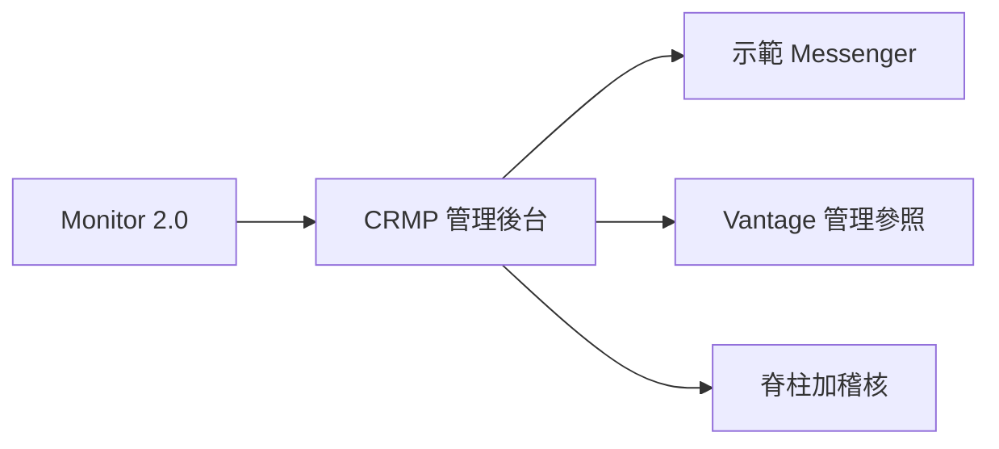
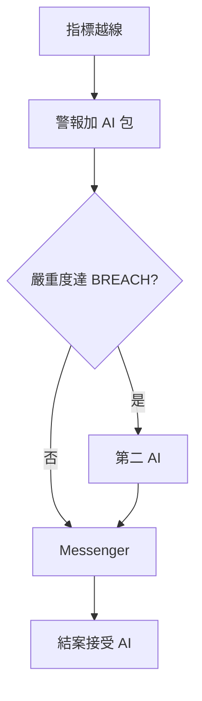
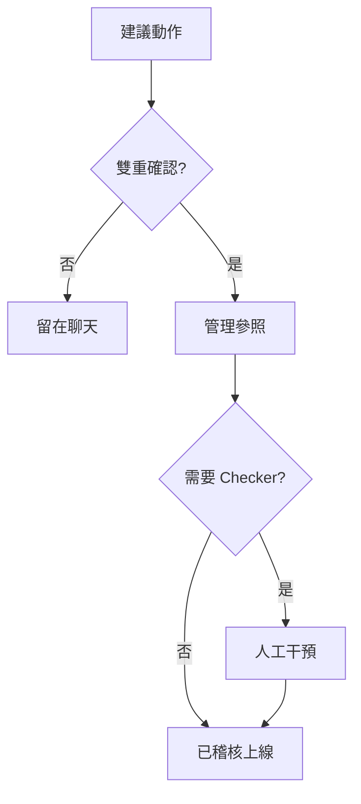
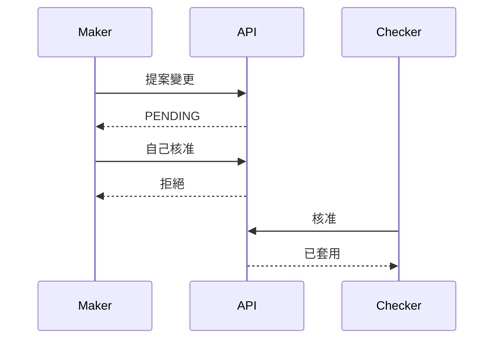
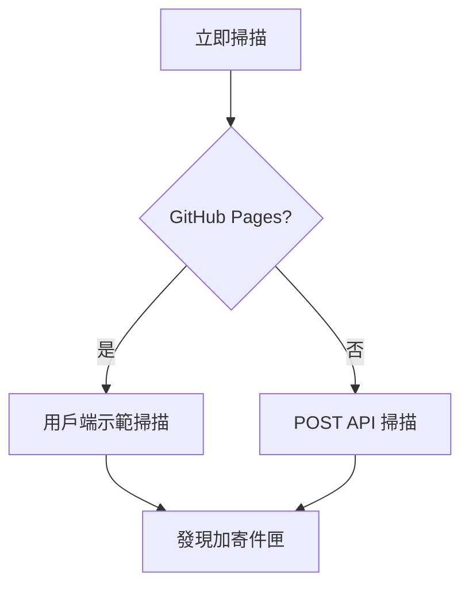
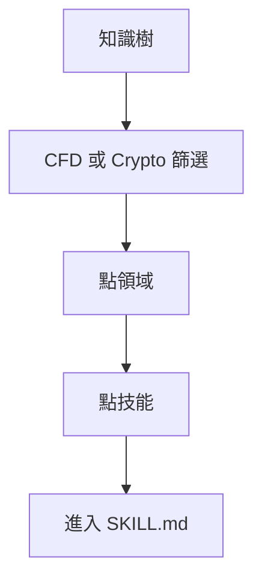
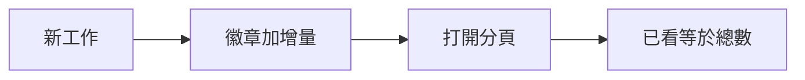
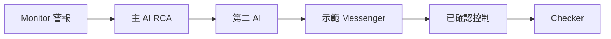

# CRMP 產品需求文件（PRD）

**文件編號：** CRMP-PRD-001  
**狀態：** 原型／可示範  
**產品範圍：** CFD + 加密貨幣交易所  
**負責人：** YAN Haixiang · **核准人：** 風險負責人  
**相關文件：** [TSD](/admin/docs/tsd) · [使用手冊](/admin/docs/user-guide) · [UAT](/admin/docs/uat) · [生態導入評估](/admin/docs/ecosystem)

本 PRD 是 **CRMP 管理後台目前每一個畫面與功能** 的產品契約。操作說明見 [使用手冊](/admin/docs/user-guide)。實作細節見 [TSD](/admin/docs/tsd)。簽核案例見 [UAT-01 … UAT-45](/admin/docs/uat)。

---

## 1. 問題陳述

Vantage Markets 的 CFD 與加密風險橫跨 Monitor 2.0 指標、各桌與即時通訊升級。現況「警報 → 根因 → 行動」分散：分析師重複重建脈絡、AI 建議缺乏獨立挑戰、不可逆控制難以端到端稽核。

**我們需要集中式風險管理平面，能夠：**
- 將 Monitor 警報轉為可解釋 AI RCA  
- 以獨立第二 AI 挑戰高嚴重度 RCA  
- 讓操作者在 messenger 完成證據／升級／排除／結案／控制  
- 強制 Maker／Checker，並禁止 AI 觸及僅限人類介面  
- 留下單一脊柱與稽核軌跡  
- 讓每個桌面功能都有具名管理頁（首頁、績效、風險日誌、情報、組織、設定、文件）

---

## 2. 目標

| # | 目標 | 可衡量結果 |
|---|---|---|
| G1 | 單一脊柱 | 偵測→分析→挑戰→升級→干預→稽核可在脊柱日誌看見 |
| G2 | 確定性路由 | 已知技能確定時自動執行；否則 RAG＋人工覆核 |
| G3 | 高嚴重度雙 AI | BREACH／CRITICAL 分析 100% 附第二 AI 挑戰 |
| G4 | AI 設定職能分離 | AI Admin 變更必須 Maker ≠ Checker |
| G5 | Messenger 原生作業 | 核心動作不必離開聊天 |
| G6 | 市場感知 | 每五分鐘情報掃描（localhost 即時；Pages 示範掃描） |
| G7 | 安全 AI 邊界 | 僅限人類的頁／功能／欄位列出並對 AI 拒絕 |
| G8 | 完整管理地圖 | §6.4 每個左側分組／頁都已交付並寫進文件 |
| G9 | 未讀感知 | 警報／分析／Messenger／情報／干預／脊柱／稽核／Monitor／風險日誌／偵測器的新工作顯示徽章，打開後清除 |
| G10 | 公開示範 | GitHub Pages 快照 `/PRD/crmp-admin/` 可走完後台，登入、Messenger「在管理後台開啟」、立即掃描不出現 404／405 |
| G11 | 具名負責人 | 平台負責人 YAN Haixiang 為一級角色；工作階段留在瀏覽器 |

---

## 3. 本原型非目標

| 非目標 | 理由 |
|---|---|
| 正式 Lark Webhook 投遞 | 以稽核／寄件匣／應用內示範 Messenger 模擬 |
| 計費正式 LLM API | 以啟發式技能／RAG／挑戰者引擎代替 |
| 完整 MT4／MT5／LP 寫入適配 | 僅深連結＋模擬管理參照 |
| 大規模多品牌租戶 | 單一示範租戶 |
| 取代 Monitor 2.0 | CRMP 消費 Monitor，不重建它 |
| 正式 SSO／IdP | 示範角色＋ cookie／localStorage 工作階段 |

---

## 4. 角色與待辦工作

| 角色 | 主要工作 |
|---|---|
| **平台負責人（YAN Haixiang）** | 擁有後台與文件；公開快照預設登入 |
| **風險負責人** | 接受／駁回 AI 包；升級；核准不可逆控制；跑 UAT 出口 |
| **風險分析師** | 分流警報；在 messenger 挑戰 AI；補充脈絡 |
| **營運主管／分析師** | 提案停交易／封鎖／加寬／暫停跟單；Maker 確認進管理後台 |
| **AI 工程師** | 技能、RAG、偵測器、第二意見門檻、AI Admin 提案 |
| **系統管理員** | 使用者／角色、分組設定、AI 存取黑名單、稽核衛生 |
| **檢視者** | 唯讀監督（不操作 AI Admin） |

---

## 5. 使用者旅程（快樂路徑）

### 5.1 高嚴重度警報 → 雙 AI → messenger 結案
1. Monitor 指標越線（例如 COPY 集中度）。  
2. CRMP 建立警報＋AI 分析（`SKILL_MATCH` 或 `RAG_REASONING`）。  
3. 若嚴重度 ≥ `ai.second_opinion_severity`（預設 BREACH），跑 `crmp-challenger-v0`。  
4. 風險分析師打開示範 Messenger 執行緒；**顯示證據**；可選以聊天挑戰。  
5. 風險負責人審主 AI＋挑戰者；**結案（接受 AI）** 或升級／要求控制。

### 5.2 控制：雙重確認＋Checker
1. 操作者選建議動作（例如封鎖使用者帳號）。  
2. 雙重確認關卡 → 模擬 Vantage 管理參照＋連結。  
3. 若 `needs_checker`，Checker 經人工干預／指示路徑核准。  
4. 稽核＋脊柱記錄 Maker／Checker 結果。

### 5.3 AI Admin 變更
1. Maker 在 AI Admin 提案設定／模型／政策。  
2. 不同的 Checker 核准。  
3. 自己核准自己被拒絕。

### 5.4 公開快照上的市場情報
1. 操作者在 GitHub Pages 打開市場情報。  
2. **立即掃描** 跑用戶端示範掃描（與即時同一批模板）。  
3. 發現、寄件匣、掃描紀錄在本機更新。沒有 405。

### 5.5 知識樹下鑽
1. 打開知識樹，必要時篩 CFD 或 Crypto。  
2. 點領域（例如 LP_HEDGE）展開技能。  
3. 點技能；檢視器填入；**進入** 打開 SKILL.md 劇本。

### 5.6 未讀徽章
1. 偵測器執行／情報掃描／AI 模擬產生新工作。  
2. 左側徽章增加。  
3. 打開該分頁寫入「已看」，本瀏覽器徽章降為零。

---

## 6. 功能需求

### 6.1 P0 — 原型必須交付

| ID | 需求 | 驗收草圖 |
|---|---|---|
| FR-01 | 同步／顯示 Monitor 2.0 指標並拉警報 | 看得到 EQ／MRG／COPY；模擬警報可用 |
| FR-02 | 技能匹配 RCA 含步驟執行紀錄 | COPY 越線 → `SKILL_MATCH`＋技能執行步驟 |
| FR-03 | 技能不確定時 RAG RCA | EQ 路徑可產出 `RAG_REASONING`＋證據 |
| FR-04 | 達門檻之獨立第二 AI 挑戰者 | BREACH／CRITICAL 顯示面板＋CHALLENGER 證據；WARN 預設略過 |
| FR-05 | 示範 Messenger：證據／聊天／升級／排除／結案 | 每個動作變更執行緒＋稽核 |
| FR-06 | 建議控制＋雙重確認 → 管理參照 | 封鎖／停交易等產出 admin_ref；必要時 Checker 註記 |
| FR-07 | AI Admin Maker ≠ Checker | 同一使用者不能核准自己的提案 |
| FR-08 | AI 存取黑名單（頁／功能／欄位） | UI 列出僅限人類目標與理由 |
| FR-09 | AI／messenger／干預事件進脊柱＋稽核 | 約 1 分鐘內可對上 |
| FR-10 | 管理介面 RBAC | 檢視者被擋在 AI Admin 操作路徑外 |

### 6.2 P1 — 原型應交付

| ID | 需求 | 驗收草圖 |
|---|---|---|
| FR-11 | 市場情報 5 分鐘掃描＋寄件匣卡片格式 | localhost 可掃；GitHub Pages 用用戶端示範掃描（無 405）。發現／寄件匣／掃描紀錄會更新。 |
| FR-12 | 風險日誌分析 | 頁面載入風險事件時間軸／分析 |
| FR-13 | 雙語產品文件（英／繁中） | PRD、TSD、使用手冊、UAT、生態、路線圖可切換 |
| FR-14 | 響應式管理後台（網頁＋手機） | 390px：抽屜＋ messenger 主從；無整頁溢出 |
| FR-15 | 豐富技能風險情境／鏈 | 技能看板顯示門檻與升級；**進入** 打開 `/admin/skills/{code}` |
| FR-16 | 示範導覽網址目錄 | `/admin/docs/urls` 列出管理／API／資料路徑＋公開 Pages 網址 |
| FR-21 | 管理首頁快照 | 每張卡／列皆為連結（數字、負責人、Messenger、跳轉、部門、最近警報、脊柱步驟） |
| FR-22 | 每日績效儀表板 | CFD＋加密指標格；localhost 可重新整理 |
| FR-23 | 偵測器執行／切換 | 全部執行會拉警報＋AI RCA；localhost 可啟用／停用 |
| FR-24 | 即時警報確認佇列 | OPEN 依嚴重度排序；Acknowledge 變更狀態 |
| FR-25 | 知識樹視覺化 | SVG 圖＋大綱；領域展開；進入劇本；RAG 幹 |
| FR-26 | 分組平台設定 | 六組（平台、monitor、AI、市場情報、Lark、SLA）；localhost 儲存／Pages 僅本機瀏覽器 |
| FR-27 | 組織目錄 | 部門、團隊、角色（權限晶片）、使用者（含 YAN Haixiang；localhost 可新增／停用） |
| FR-28 | 升級路徑＋Lark 登錄 | 嚴重度 → 團隊 → SLA；頻道啟用；messenger 升級跟隨路徑 |
| FR-29 | 未讀導覽徽章 | 徽章 = max(0, 總數+增量−已看)；打開清除；新工作增加 |
| FR-30 | Pages 登入保持 | 以具名角色登入；重新整理仍在；登入連結在 `/PRD/crmp-admin/login/`（無 404） |
| FR-31 | 分組左側導覽＋Vantage 標誌 | 七組；英／繁中標籤；負責人列 |
| FR-32 | UAT 互動包 | UAT-01…UAT-45 含為什麼／步驟／通過／證據與畫面覆蓋 |
| FR-33 | 資料來源登錄 | 內部＋外部目錄；localhost 可管理 |
| FR-34 | 風險領域目錄 | CFD＋加密領域含負責／支援 BU |

### 6.3 P2 — 之後（生態階段）

| ID | 需求 |
|---|---|
| FR-17 | 正式 Lark 互動卡片 |
| FR-18 | Monitor 雙向工單回寫 |
| FR-19 | 真實交易控制匯流排含 dry-run |
| FR-20 | 正式 LLM＋評測架；挑戰者供應商多樣化 |

### 6.4 功能目錄 — 每一個管理介面

此表**就是**管理後台的產品範圍。左側有的列，就在本 PRD、使用手冊、TSD 與 UAT 範圍內。

| 分組 | 功能 | 路徑 | 待辦工作 | 關鍵驗收 |
|---|---|---|---|---|
| 總覽 | 管理首頁 | `/admin` | 定向；用卡片跳轉 | 每張卡／列皆為連結；看得到負責人；messenger CTA |
| 監控與風險 | 每日績效 | `/admin/dashboard` | 當日 CFD＋加密畫面 | 兩產品格；WARN／BREACH 數 |
| 監控與風險 | 風險日誌分析 | `/admin/risk-log` | 處理時間、損失 vs 防損、漏洞 | 摘要＋類別＋領域＋紀錄 |
| 監控與風險 | 市場情報 | `/admin/market-intel` | 會移動 LP 的頭條 | 立即掃描；發現；寄件匣；掃描紀錄；Pages 示範掃描 |
| 監控與風險 | Monitor 2.0 | `/admin/monitor-2` | 指標／警報／工單 | 三分頁；localhost 立即同步 |
| 監控與風險 | 偵測器 | `/admin/detectors` | 門檻第一階段 | 全部執行；切換；執行清單 |
| 監控與風險 | 即時警報 | `/admin/alerts` | 未結佇列 | 確認；嚴重度排序；未讀清除 |
| 監控與風險 | 風險領域 | `/admin/risk-domains` | 權責目錄 | 負責＋支援 BU |
| AI 與知識 | AI 分析 | `/admin/ai-analyses` | RCA＋第二 AI | 模擬 COPY／EQ／CRITICAL；明細包 |
| AI 與知識 | AI 管理 | `/admin/ai-admin` | 雙人治理 | 七個分頁；Maker ≠ Checker |
| AI 與知識 | AI 技能 | `/admin/skills` | 劇本＋鏈 | 進入 → SKILL.md 頁 |
| AI 與知識 | 知識樹 | `/admin/knowledge-tree` | 視覺地圖 | 圖／大綱；樹幹；進入 |
| AI 與知識 | RAG 知識庫 | `/admin/rag` | 語料檢索 | 搜尋、top-K 檢索、新增／退役（管理） |
| AI 與知識 | 脊柱日誌 | `/admin/spine` | 端到端膠帶 | 階段計數＋事件清單 |
| 應變 | 人工干預 | `/admin/interventions` | 執行期 Checker | 核准／駁回＋備註 |
| 應變 | 示範 Messenger | `/admin/messenger` | 聊天原生分流 | 同步、證據、聊天、升級、排除、結案、控制、在管理後台開啟 |
| 應變 | Lark 整合 | `/admin/lark` | 頻道登錄 | 清單＋啟用；localhost 模擬通知 |
| 應變 | 升級路徑 | `/admin/escalation` | 嚴重度 → 團隊 → SLA | localhost CRUD；升級使用 |
| 組織 | 部門 | `/admin/departments` | RACI | 四個 BU 含職責 |
| 組織 | 團隊 | `/admin/teams` | 值班 | 成員、Lark chat、輪值 |
| 組織 | 角色與權限 | `/admin/roles` | RBAC | 每角色權限晶片 |
| 組織 | 使用者 | `/admin/users` | 目錄 | YAN Haixiang 在；管理可新增／停用 |
| 平台 | 資料來源 | `/admin/data-sources` | 來源登錄 | 分類＋狀態 |
| 平台 | AI 存取安全 | `/admin/security/ai-access` | 僅限人類清單 | 黑名單＋允許＋禁止權限 |
| 平台 | 稽核日誌 | `/admin/audit` | 誰改了什麼 | 列出最近變更 |
| 平台 | 平台設定 | `/admin/settings` | 旗標 | 分組鍵；儲存 |
| 文件 | 使用手冊 | `/admin/docs/user-guide` | 如何操作 | 英＋繁中；每一畫面 |
| 文件 | PRD | `/admin/docs/prd` | 為什麼／做什麼／怎麼過 | 本文件 |
| 文件 | TSD | `/admin/docs/tsd` | 怎麼做的 | 完整介面地圖 |
| 文件 | UAT 清單 | `/admin/docs/uat` | 簽核 | 45 案，可互動 |
| 文件 | 生態導入評估 | `/admin/docs/ecosystem` | 導入 | 階段、預算、風險 |
| 文件 | 改進路線圖 | `/admin/docs/roadmap` | 下一步 | 優先項目 |
| 文件 | 網址目錄 | `/admin/docs/urls` | 導覽 | 頁＋API＋表 |
| 殼層 | 登入 | `/login` | 具名角色 | 保持；Pages 路徑；負責人預設 |
| 殼層 | 語言 | cookie `crmp_ui_lang` | 英／繁中 | 導覽＋文件切換 |
| 殼層 | 未讀徽章 | 左側 | 新工作 | 增加／打開清除 |
| 殼層 | 手機抽屜 | `< lg` | 手機使用 | 漢堡；messenger 主從 |

---

## 7. 非功能需求

| ID | 領域 | 需求 |
|---|---|---|
| NFR-01 | 延遲 | 原型：警報 → 雙 AI 包通常 < 60 秒 |
| NFR-02 | 可稽核 | 警報／分析／messenger／AI Admin 變更發出稽核 |
| NFR-03 | 安全 | AI 主體不得取得黑名單權限 |
| NFR-04 | 職能分離 | AI Admin 強制 Maker／Checker；指定控制要 Checker |
| NFR-05 | 可用性 | 示範單節點 SQLite 可接受；正式需 HA（見生態） |
| NFR-06 | 國際化 | 操作文件英＋繁中；UI 導覽語言切換 |
| NFR-07 | 基本無障礙 | 手機可點；關鍵動作有標籤 |
| NFR-08 | 公開快照 | 靜態匯出 `basePath` `/PRD/crmp-admin`；沒有死掉的 `/api` 點擊（示範後備） |
| NFR-09 | 工作階段 | 示範角色在 Pages 以 `localStorage`＋cookie 保持 |

---

## 8. 詳細驗收標準（原型關卡）

1. **技能＋挑戰者：** 模擬 COPY BREACH → `SKILL_MATCH`＋第二 AI 面板，被挑戰時至少 1 項 HIGH 改進。  
2. **門檻：** 僅 WARN 的 EQ 模擬在預設 BREACH 門檻下**不**建立挑戰。  
3. **Messenger 路徑：** 顯示證據貼上保險庫；升級前進路徑；排除／結案更新狀態。  
4. **控制：** 封鎖帳號 → 雙重確認 → admin_ref；必要時 Checker 後續。  
5. **AI Admin：** 需要不同 Checker；自己核准被擋。  
6. **覆蓋：** UAT 視窗 BREACH／CRITICAL 樣本 100% 已挑戰（允許回填）。  
7. **文件：** PRD／TSD／使用手冊／UAT／生態／路線圖英繁皆可渲染；使用手冊對左側每一頁都有操作說明。  
8. **手機：** Messenger 列表→執行緒→返回在約 390px 可用且無整頁溢出。  
9. **Pages：** 登入、messenger 在管理後台開啟、市場情報立即掃描不出現 404／405。  
10. **知識樹：** 領域展開＋進入打開劇本。  
11. **未讀：** 新模擬／掃描讓徽章增加；打開分頁清除。  
12. **負責人登入：** YAN Haixiang 角色在 Pages 重新整理後仍在。

正式執行：[UAT 清單](/admin/docs/uat)（UAT-01 … UAT-45）。此包覆蓋每一個管理畫面以及完整 messenger 迴路（收件匣、證據、挑戰、升級、排除、結案、建議控制、同步）。

---

## 9. 成功指標（試點）

| 指標 | 目標 |
|---|---|
| 警報 → 雙 AI 包平均時間 | < 60 秒（原型） |
| BREACH+ 附挑戰者比例 | 100% |
| 誤報排除已稽核 | 100% |
| AI Admin 變更有不同 Checker | 100% |
| 僅限人類介面已列入黑名單 | 約定清單 100% |
| Critical UAT 案例通過 | 100% |
| 左側頁面有使用手冊說明 | 100% |
| 公開立即掃描／登入／在管理後台開啟 | 快樂路徑 0 個硬 404／405 |

---

## 10. 範圍邊界與依賴

**依賴：** Monitor 2.0 指標模型；未來以 Lark 為企業即時通訊；真實控制靠 Vantage 管理後台；正式 SSO 靠 IdP。  
**提供給：** 風險／營運桌單一控制平面 UI＋稽核脊柱。  
**B／C 階段前不在範圍：** 即時 Webhook、寫入適配、Postgres HA（見 [生態導入評估](/admin/docs/ecosystem)）。

---

## 11. 風險與未決問題

| 風險／問題 | 緩解 |
|---|---|
| 啟發式 AI 過度自信 | 高嚴重度強制第二 AI；PARTIAL／DISAGREE 標需要人類 |
| 操作者繞過 messenger | 保留管理深連結；兩條路都稽核 |
| 過早自動寫入 | 生態 C 階段控制匯流排前先影子模式 |
| 企業標準即時通訊是哪個？ | 假設 Lark；Teams 適配待定 |
| 證據 PII 保存 | 正式識別資料前做法務檢視 |
| GitHub Pages 空資料庫 | 後備導覽總數＋用戶端示範掃描＋示範工作階段 |

---

## 12. 發行計畫（原型 → 正式）

| 階段 | 成果 |
|---|---|
| 原型（現在） | 完整管理地圖、雙 AI、messenger、文件、UAT-01…45、公開 Pages 快照 |
| A 階段 | 強化驗證／託管／可觀測 |
| B 階段 | 即時 Monitor＋Lark 通知（讀路徑） |
| C 階段 | 受監督寫入路徑＋緊急開關 |
| D 階段 | 模型營運／挑戰者多樣 |

---

## 13. 可追溯性

| 產品產物 | 在哪裡 |
|---|---|
| 每頁操作說明 | 使用手冊 §6–§12 |
| 每頁技術模組 | TSD §7＋§8–§16 |
| 每介面測試案例 | UAT-01…UAT-45 的 `covers` 欄 |
| 公開與本機網址 | 網址目錄 |

---

## 14. 核准

| 角色 | 姓名 | 決策 | 日期 |
|---|---|---|---|
| 平台負責人／文件負責人 | YAN Haixiang | 具名 | 2026-10-04 |
| 風險負責人 | Alex Chen（示範） | 示範角色 | |
| 風險平台 PM | YAN Haixiang | 具名 | 2026-10-04 |
| 工程主管 | _待定_ | | |
| 資安／GRC | _待定_ | | |

---

## 15. 文件控制

| 版次 | 日期 | 說明 |
|---|---|---|
| 1.0 | 2026-10-01 | 目標 G1–G7、FR-01…16 |
| 1.5 | 2026-10-04 | 各旅程與職能分離流程圖 |

**負責人：** YAN Haixiang
