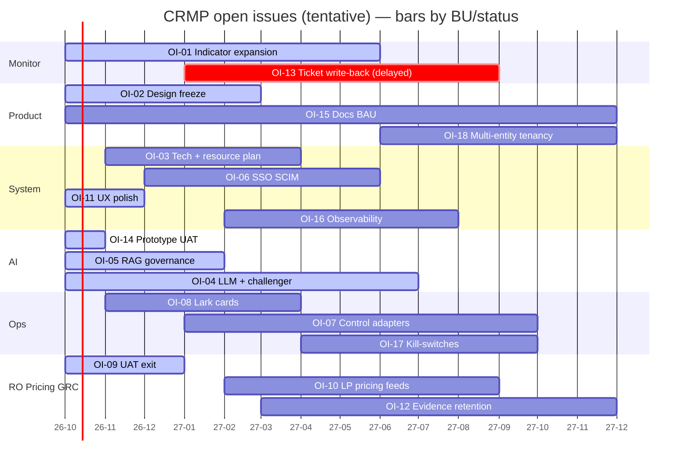

# CRMP Progress Tracker

**Document ID:** CRMP-PT-001 · **Version:** 1.4 · **Interactive board:** [/admin/docs/progress](/admin/docs/progress) · **Open issues:** [/admin/docs/open-issues](/admin/docs/open-issues)

Maps **every open issue** onto a tracker:

| Axis | Meaning |
|---|---|
| **X** | Open issues (one column each: OI-01 … OI-18) |
| **Y** | Timeline **now (2026-10) → end of 2027 (2027-12)** |

Each column header labels the **responsible BU**. Cell colour = status: **Planned · Started · WIP · Delayed · UAT · Go live · BAU**.

Interactive SVG + mobile cards: `/admin/docs/progress` (data: `platform/src/lib/docs/open-issues.ts` — 18 issues). Filter by status and BU on the board.

Shipped desk facts tracked as BAU (not separate bars): audit plane split (**CRMP logs** / **Vantage Markets Admin logs** + Roll back), editable Roles, escalation dimensions × coefficients + ESC-DEFAULT, home spine stage ticket counts (Spine Log tab removed), BU and Teams combined, **Realtime Alert & Tracker**, Detectors→**Monitor 2.0**.

### Issue → BU → status → window

| ID | BU | Status | Window (Y) |
|---|---|---|---|
| OI-01 | Monitor | WIP | 2026-10 → 2027-06 |
| OI-02 | Product | Started | 2026-10 → 2027-03 |
| OI-03 | System | Planned | 2026-11 → 2027-04 |
| OI-04 | AI | WIP | 2026-10 → 2027-07 |
| OI-05 | AI | Started | 2026-10 → 2027-02 |
| OI-06 | System | Planned | 2026-12 → 2027-06 |
| OI-07 | Ops | Planned | 2027-01 → 2027-10 |
| OI-08 | Ops | Planned | 2026-11 → 2027-04 |
| OI-09 | Risk Owner | Started | 2026-10 → 2027-01 |
| OI-10 | Pricing | Planned | 2027-02 → 2027-09 |
| OI-11 | System | WIP | 2026-10 → 2026-12 |
| OI-12 | GRC | Planned | 2027-03 → 2027-12 |
| OI-13 | Monitor | Delayed | 2027-01 → 2027-09 |
| OI-14 | AI | UAT | 2026-10 → 2026-11 |
| OI-15 | All | BAU | 2026-10 → 2027-12 |
| OI-16 | System | Planned | 2027-02 → 2027-08 |
| OI-17 | Ops | Planned | 2027-04 → 2027-10 |
| OI-18 | Product | Planned | 2027-06 → 2027-12 |

---

## Document control

| Ver | Date | Notes |
|---|---|---|
| 1.0 | 2026-10-05 | Progress tracker wired into admin docs |
| 1.1 | 2026-10-05 | Note audit plane split + Roles / escalation desk facts as BAU |
| 1.2 | 2026-10-05 | BAU note: Realtime Alert & Tracker; Detectors→Monitor 2.0 |
| 1.3 | 2026-10-05 | Bars for OI-16 / OI-17 / OI-18 |
| 1.4 | 2026-10-05 | Board axes: X = open issues, Y = timeline; BU on every column; BU filter; mobile cards |

**Owner:** demo platform owner (`haixiang.yan@hytechc.com`) · **中文:** [PROGRESS.zh-Hant.md](./PROGRESS.zh-Hant.md)
