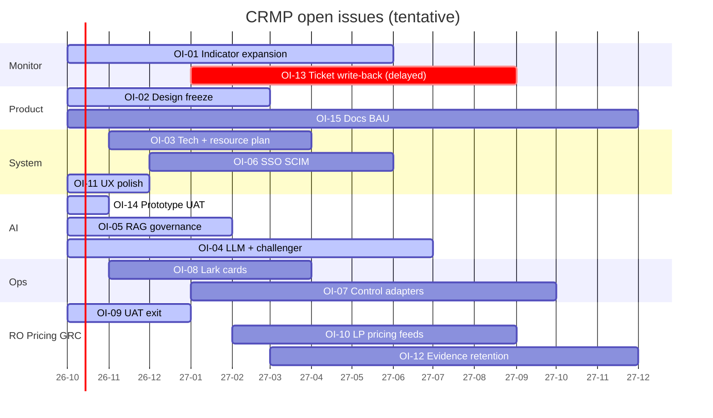

# CRMP Progress Tracker

**Document ID:** CRMP-PT-001 · **Interactive board:** [/admin/docs/progress](/admin/docs/progress) · **Open issues:** [/admin/docs/open-issues](/admin/docs/open-issues)

Progress view of every open issue (**X = issue row**, **Y = timeline now → end-2027**). Each bar is labelled with status and responsible **BU**.

Statuses: Planned · Started · WIP · Delayed · UAT · Go live · BAU.

Shipped desk facts tracked as BAU (not separate bars): audit plane split (**CRMP logs** / **Vantage Markets Admin logs** + Roll back), editable Roles, escalation dimensions × coefficients + ESC-DEFAULT, home spine stage ticket counts (Spine Log tab removed), BU and Teams combined, **Realtime Alert & Tracker** left-nav naming (`/admin/alerts`), Detectors merged into **Monitor 2.0** (`/admin/detectors` redirect).

Interactive SVG/table: `/admin/docs/progress` (data: `platform/src/lib/docs/open-issues.ts`).

| Ver | Date | Notes |
|---|---|---|
| 1.0 | 2026-10-05 | Progress tracker wired into admin docs |
| 1.1 | 2026-10-05 | Note audit plane split + Roles / escalation desk facts as BAU |
| 1.2 | 2026-10-05 | BAU note: Realtime Alert & Tracker; Detectors→Monitor 2.0; OI-11/13/14 detail sync with Ecosystem v1.8 |

**Owner:** demo platform owner (`haixiang.yan@hytechc.com`) · **中文:** [PROGRESS.zh-Hant.md](./PROGRESS.zh-Hant.md)
