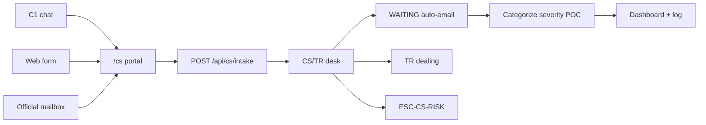
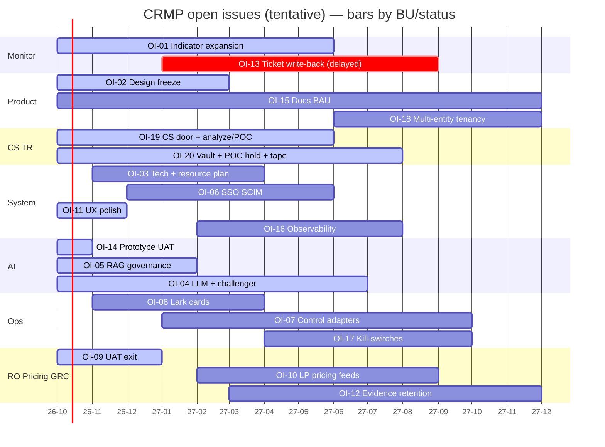

# CRMP Progress Tracker

**Document ID:** CRMP-PT-001 · **Version:** 1.6 · **Interactive board:** [/admin/docs/progress](/admin/docs/progress) · **Open issues:** [/admin/docs/open-issues](/admin/docs/open-issues)

Maps **every open issue** onto a tracker:

| Axis | Meaning |
|---|---|
| **X** | Open issues (one column each: OI-01 … OI-20) |
| **Y** | Timeline **now (2026-10) → end of 2027 (2027-12)** |

Each column header labels the **responsible BU**. Cell colour = status: **Planned · Started · WIP · Delayed · UAT · Go live · BAU**.

Interactive SVG + mobile cards: `/admin/docs/progress` (data: `platform/src/lib/docs/open-issues.ts` — 20 issues). Filter by status, BU, and **CS/TR**. Still **20 columns**. The CS/TR catalogue is an **index on those columns** (OI-19 / OI-20 + support OI-05 / 08 / 09 / 11 / 14 / 15), **not extra bars**. Twin of Open Issues v1.5.

Shipped desk facts tracked as BAU (not separate bars): audit plane split (**CRMP logs** / **Vantage Markets Admin logs** + Roll back), editable Roles, escalation dimensions × coefficients + ESC-DEFAULT, home spine stage ticket counts (Spine Log tab removed), BU and Teams combined, **Realtime Alert & Tracker**, Detectors→**Monitor 2.0**, CS/TR prototype door (`/cs`, desk, wait loop, skills, dashboard, log, data, hops, `cs.*`, categorize / severity / AI solution / auto vs named POC).

---

## CS/TR feature catalogue

Interactive twin: filter **CS/TR** on [/admin/docs/progress](/admin/docs/progress) (`data-testid="pt-cs-catalogue"`). Two **primary** bars own the door (OI-19) and the vault/tape (OI-20). Six **support** bars carry the RAG tree, Lark seeds, UAT pack, mobile, prototype UAT window, and docs. Prototype ticks vs production remaining — connectors, vault, tape, SMTP and live volume stay open. **FR-46 / UAT-53** (categorize, severity, heuristic AI solution, auto-reply vs named POC) sit on OI-19 / OI-20, not new columns.

### Functions on existing bars

| Function | Column (X) | Tracker status | Prototype proof |
|---|---|---|---|
| Public `/cs` portal + C1 / form / mailbox intake | OI-19 | Started | UAT-46 |
| Auto-email wait loop (`CSR-XXXX` / `In-Reply-To`) | OI-19 | Started | UAT-47 · `cs.followup_cap` |
| CS / TR Desk | OI-19 | Started | `/admin/cs-desk` |
| Dedicated SKILL.md + RAG leaves | OI-05 | Started | UAT-50 |
| Dashboard + log | OI-19 | Started | UAT-51 · `/admin/cs-dashboard` · `/admin/cs-log` |
| Supporting data: hops, `cs.*`, KYC vault team | OI-19 + OI-20 | Started | UAT-52 · `/admin/cs-data` · `ESC-CS-KYC` |
| Categorize / severity / AI solution / auto-reply vs named POC | OI-19 | Started | UAT-53 · FR-46 · `cs.auto_reply_max_severity` |
| KYC / trading named POC hold (not auto-reply) | OI-20 | Started | UAT-53 · `POC_REVIEW` |
| Lark messenger cards + CS/TR seeds | OI-08 | Started | UAT-36 · Ack/Escalate · `oc_cs_c1` |
| Risk Owner UAT pack including UAT-53 | OI-09 | Started | UAT Checklist v2.7 (52 cases) |
| Prototype UAT window includes CS/TR door | OI-14 | UAT | UAT-46…53 |
| Phone-width CS/TR | OI-11 | UAT | UAT-18 |
| Docs lockstep (UG / UAT / Open Issues / Progress) | OI-15 | BAU | UG §9.3.10 · UAT catalogue v2.7 |

### Catalogue (same eight issues as Open Issues)

| Kind | ID | Feature | Screens / URLs | Prototype shipped | Still open (production) |
|---|---|---|---|---|---|
| primary | OI-19 | Production C1 / form / mailbox connectors | `/cs`, desk, dashboard, log, data, `POST /api/cs/intake` | Portal, wait loop, dashboard/log/data, categorize+severity auto vs POC (UAT-46, UAT-51, UAT-52, UAT-53) | Signed C1, form HMAC, mailbox gateway, production SMTP, live volume, no-silent-drop SLA |
| primary | OI-20 | CS/TR ID vault and dealing-tape reconstruct | CS KYC Vault, desk, Data Sources, Demo Messenger | Vault team, ESC-CS-KYC flags-only, TR routing, named POC hold, MT4/MT5 tape listed (UAT-53) | Production vault, mailer with `cs.followup_cap`, live tape, live messenger escalate, CS Lead waiver audit |
| support | OI-05 | Knowledge tree + RAG corpus (`CS_SERVICE` / `TRADING_EXEC`) | Knowledge Tree, RAG, AI Skills | Trunks + `cs-*` leaves (UAT-50) | Corpus owners, retire cadence, skill↔doc binds, `propose_rag` SLA |
| support | OI-08 | Production Lark interactive cards (CS/TR channels) | Lark Integration | Mock Lark messenger cards for alert + escalate; Ack/Escalate/Dismiss/Close call CRMP (UAT-36) | Live Lark app / webhooks / SSO; production CS WAITING / cap cards |
| support | OI-09 | Risk Owner UAT exit including CS/TR catalogue | UAT Checklist v2.7 | Pack v2.7 (52 cases, skip UAT-45) indexes CS/TR including UAT-53 | Formal RO sign-off of UAT-25/46/47/48/50/51/52/53 + four CS hops |
| support | OI-11 | Admin UX polish — CS/TR phone-width | Desk, dashboard, log, data | List→thread desk; card twins for dashboard, log, data, /cs tabs, RAG gate (UAT-18) | Native phone apps; leftover dense boards as BAU |
| support | OI-14 | Prototype AI desk UAT window includes CS/TR door | `/cs`, desk, skills, wait loop, dashboard, log, data | CS/TR door shipped for UAT-46…53 | Formal UAT sign-off (OI-09) |
| support | OI-15 | Docs & URL catalog keep pace (UG §9.3 / UAT v2.7) | User Guide, URL Catalog, UAT, Open Issues, Progress | UG §9.3.10 + URL Catalog CS/TR + UAT catalogue v2.7 + Open Issues v1.5 | Keep Progress in lockstep after each ship |

### Public URLs (CS/TR)

Permanent Pages origin: `https://hxyan2020.github.io/PRD/crmp-plus/`.

| Surface | Path |
|---|---|
| Client portal | `/cs` |
| CS / TR Desk | `/admin/cs-desk` |
| CS / TR Dashboard | `/admin/cs-dashboard` |
| CS / TR Log | `/admin/cs-log` |
| CS / TR Data | `/admin/cs-data` |
| Intake API | `POST /api/cs/intake` · `GET /api/cs/intake` |
| Payloads | `GET /api/cs?view=dashboard` · `log` · `data` |

---

### Issue → BU → status → window

| ID | BU | Status | Window (Y) |
|---|---|---|---|
| OI-01 | Monitor | WIP | 2026-10 → 2027-06 |
| OI-02 | Product | Started | 2026-10 → 2027-03 |
| OI-03 | System | Planned | 2026-11 → 2027-04 |
| OI-04 | AI | WIP | 2026-10 → 2027-07 |
| OI-05 | AI | Started | 2026-10 → 2027-02 |
| OI-06 | System | Planned | 2026-12 → 2027-06 |
| OI-07 | Ops | Planned | 2027-01 → 2027-10 |
| OI-08 | Ops | Planned | 2026-11 → 2027-04 |
| OI-09 | Risk Owner | Started | 2026-10 → 2027-01 |
| OI-10 | Pricing | Planned | 2027-02 → 2027-09 |
| OI-11 | System | WIP | 2026-10 → 2026-12 |
| OI-12 | GRC | Planned | 2027-03 → 2027-12 |
| OI-13 | Monitor | Delayed | 2027-01 → 2027-09 |
| OI-14 | AI | UAT | 2026-10 → 2026-11 |
| OI-15 | All | BAU | 2026-10 → 2027-12 |
| OI-16 | System | Planned | 2027-02 → 2027-08 |
| OI-17 | Ops | Planned | 2027-04 → 2027-10 |
| OI-18 | Product | Planned | 2027-06 → 2027-12 |
| OI-19 | CS | Started | 2026-10 → 2027-06 |
| OI-20 | TR | Started | 2026-10 → 2027-08 |

---

## Document control

| Ver | Date | Notes |
|---|---|---|
| 1.0 | 2026-10-05 | Progress tracker wired into admin docs |
| 1.1 | 2026-10-05 | Note audit plane split + Roles / escalation desk facts as BAU |
| 1.2 | 2026-10-05 | BAU note: Realtime Alert & Tracker; Detectors→Monitor 2.0 |
| 1.3 | 2026-10-05 | Bars for OI-16 / OI-17 / OI-18 |
| 1.4 | 2026-10-05 | Board axes: X = open issues, Y = timeline; BU on every column; BU filter; mobile cards |
| 1.5 | 2026-10-06 | OI-19 / OI-20 CS+TR bars; 20 issue columns |
| 1.6 | 2026-10-06 | CS/TR feature catalogue on the same 20 columns (desk, /cs, wait loop, skills, dashboard, log, data, hops, cs.*, categorize/severity/POC); interactive CS/TR filter; FR-46 / UAT-53 |

**Owner:** demo platform owner (`haixiang.yan@hytechc.com`) · **中文:** [PROGRESS.zh-Hant.md](./PROGRESS.zh-Hant.md)
