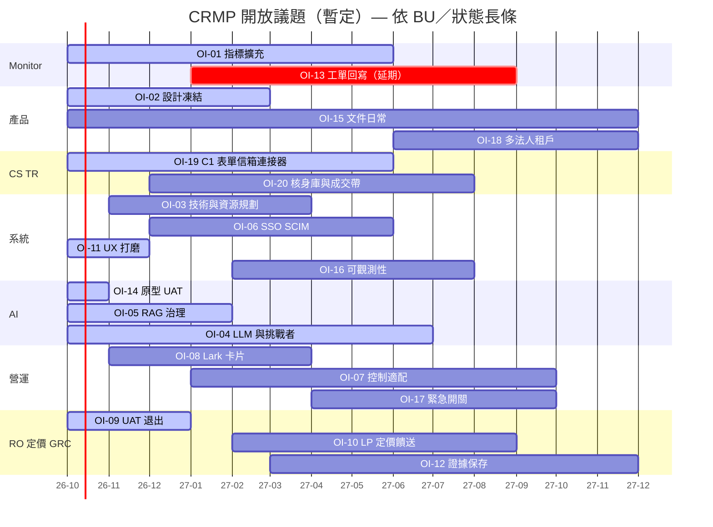

# CRMP 進度追蹤

**文件編號：** CRMP-PT-001 · **版本：** 1.5 · **互動看板：** [/admin/docs/progress](/admin/docs/progress) · **開放議題：** [/admin/docs/open-issues](/admin/docs/open-issues)

將**每一個開放議題**對映到追蹤板：

| 軸 | 意義 |
|---|---|
| **X** | 開放議題（每欄一個：OI-01 … OI-20） |
| **Y** | 時間軸 **現在（2026-10）→ 2027 年底（2027-12）** |

欄頂清楚標示**負責 BU**。色塊＝狀態：**已規劃 · 已啟動 · 進行中 · 延期 · UAT · 上線 · 日常**。

互動 SVG＋手機卡片：`/admin/docs/progress`（資料：`platform/src/lib/docs/open-issues.ts` — 20 項）。可依狀態與 BU 篩選。

已交付台面事實（日常，不另開長條）：稽核平面分流、可編輯角色、ESC-DEFAULT、首頁脊柱、BU 與團隊、**即時警報與追蹤**、偵測器→**Monitor 2.0**、**CS／TR 原型台**。

### 議題 → BU → 狀態 → 時間窗

| ID | BU | 狀態 | 時間窗（Y） |
|---|---|---|---|
| OI-01 | Monitor | 進行中 | 2026-10 → 2027-06 |
| OI-02 | Product | 已啟動 | 2026-10 → 2027-03 |
| OI-03 | System | 已規劃 | 2026-11 → 2027-04 |
| OI-04 | AI | 進行中 | 2026-10 → 2027-07 |
| OI-05 | AI | 已啟動 | 2026-10 → 2027-02 |
| OI-06 | System | 已規劃 | 2026-12 → 2027-06 |
| OI-07 | Ops | 已規劃 | 2027-01 → 2027-10 |
| OI-08 | Ops | 已規劃 | 2026-11 → 2027-04 |
| OI-09 | Risk Owner | 已啟動 | 2026-10 → 2027-01 |
| OI-10 | Pricing | 已規劃 | 2027-02 → 2027-09 |
| OI-11 | System | 進行中 | 2026-10 → 2026-12 |
| OI-12 | GRC | 已規劃 | 2027-03 → 2027-12 |
| OI-13 | Monitor | 延期 | 2027-01 → 2027-09 |
| OI-14 | AI | UAT | 2026-10 → 2026-11 |
| OI-15 | All | 日常 | 2026-10 → 2027-12 |
| OI-16 | System | 已規劃 | 2027-02 → 2027-08 |
| OI-17 | Ops | 已規劃 | 2027-04 → 2027-10 |
| OI-18 | Product | 已規劃 | 2027-06 → 2027-12 |
| OI-19 | CS | 已啟動 | 2026-10 → 2027-06 |
| OI-20 | TR | 已規劃 | 2026-12 → 2027-08 |

---

## 文件控制

| 版本 | 日期 | 說明 |
|---|---|---|
| 1.0 | 2026-10-05 | 進度追蹤接入管理文件 |
| 1.1 | 2026-10-05 | 註記稽核平面分流與角色／升級台面事實為日常 |
| 1.2 | 2026-10-05 | 日常註記：即時警報與追蹤；偵測器→Monitor 2.0 |
| 1.3 | 2026-10-05 | 新增 OI-16／17／18 |
| 1.4 | 2026-10-05 | 看板軸向：X＝開放議題、Y＝時間軸；每欄標 BU；BU 篩選；手機卡片 |
| 1.5 | 2026-10-06 | OI-19／OI-20 CS＋TR 長條；20 欄 |

**負責人：** demo platform owner（`haixiang.yan@hytechc.com`）
