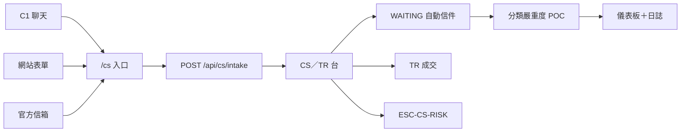
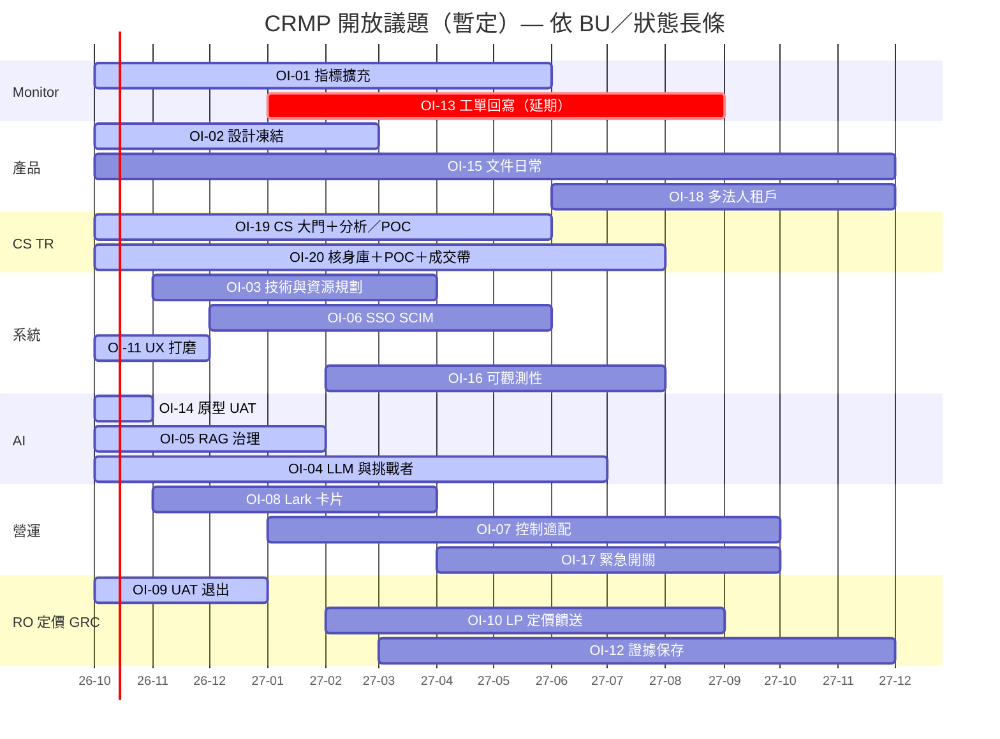

# CRMP 進度追蹤

**文件編號：** CRMP-PT-001 · **版本：** 1.6 · **互動看板：** [/admin/docs/progress](/admin/docs/progress) · **開放議題：** [/admin/docs/open-issues](/admin/docs/open-issues)

將**每一個開放議題**對映到追蹤板：

| 軸 | 意義 |
|---|---|
| **X** | 開放議題（每欄一個：OI-01 … OI-20） |
| **Y** | 時間軸 **現在（2026-10）→ 2027 年底（2027-12）** |

欄頂清楚標示**負責 BU**。色塊＝狀態：**已規劃 · 已啟動 · 進行中 · 延期 · UAT · 上線 · 日常**。

互動 SVG＋手機卡片：`/admin/docs/progress`（資料：`platform/src/lib/docs/open-issues.ts` — 20 項）。可依狀態、BU 與 **CS／TR** 篩選。仍為 **20 欄**。CS／TR 目錄是這些欄上的**索引**（OI-19／OI-20＋支援 OI-05／08／09／11／14／15），**不是額外長條**。與開放議題 v1.5 雙生。

已交付台面事實（日常，不另開長條）：稽核平面分流、可編輯角色、ESC-DEFAULT、首頁脊柱、BU 與團隊、**即時警報與追蹤**、偵測器→**Monitor 2.0**、CS／TR 原型大門（`/cs`、台面、等待迴圈、技能、儀表板、日誌、資料、關卡、`cs.*`、分類／嚴重度／AI 方案／直回 vs 具名 POC）。

---

## CS／TR 功能目錄

互動雙生：在 [/admin/docs/progress](/admin/docs/progress) 篩選 **CS／TR**（`data-testid="pt-cs-catalogue"`）。兩項**主案**長條負責大門（OI-19）與核身庫／成交帶（OI-20）。六項**支援**長條涵蓋 RAG 樹、Lark 種子、UAT 包、手機、原型 UAT 窗口與文件。原型已勾 vs 正式仍開放 — 連接器、核身庫、成交帶、SMTP 與即時量仍開著。**FR-46／UAT-53**（分類、嚴重度、啟發式 AI 方案、直回 vs 具名 POC）落在 OI-19／OI-20，不是新欄。

### 功能對應既有長條

| 功能 | 欄（X） | 追蹤狀態 | 原型證明 |
|---|---|---|---|
| 公開 `/cs` 入口＋C1／表單／信箱進件 | OI-19 | 已啟動 | UAT-46 |
| 自動信件等待迴圈（`CSR-XXXX`／`In-Reply-To`） | OI-19 | 已啟動 | UAT-47 · `cs.followup_cap` |
| CS／TR 台 | OI-19 | 已啟動 | `/admin/cs-desk` |
| 專用 SKILL.md＋RAG 葉 | OI-05 | 已啟動 | UAT-50 |
| 儀表板＋日誌 | OI-19 | 已啟動 | UAT-51 · `/admin/cs-dashboard` · `/admin/cs-log` |
| 配套資料：關卡、`cs.*`、核身庫團隊 | OI-19＋OI-20 | 已啟動 | UAT-52 · `/admin/cs-data` · `ESC-CS-KYC` |
| 分類／嚴重度／AI 方案／直回 vs 具名 POC | OI-19 | 已啟動 | UAT-53 · FR-46 · `cs.auto_reply_max_severity` |
| 核身／成交交具名 POC（不直回） | OI-20 | 已啟動 | UAT-53 · `POC_REVIEW` |
| Lark 即時通訊卡片＋CS／TR 種子 | OI-08 | 已啟動 | UAT-36 · 確認／升級 · `oc_cs_c1` |
| 風險負責人 UAT 包含 UAT-53 | OI-09 | 已啟動 | UAT 清單 v2.7（52 案） |
| 原型 UAT 窗口含 CS／TR 大門 | OI-14 | UAT | UAT-46…53 |
| CS／TR 手機寬 | OI-11 | UAT | UAT-18 |
| 文件同步（使用手冊／AI 使用手冊／UAT／開放議題／進度） | OI-15 | 日常 | 使用手冊 §9.3.10 · CRMP-AIU-001 · UAT 目錄 v2.7 |

### 目錄（與開放議題同一八項）

| 種類 | ID | 功能 | 畫面／網址 | 原型已交付 | 正式仍開放 |
|---|---|---|---|---|---|
| 主案 | OI-19 | 正式 C1／表單／信箱連接器 | `/cs`、台面、儀表板、日誌、資料、`POST /api/cs/intake` | 入口、等待迴圈、儀表板／日誌／資料、分類＋嚴重度直回 vs POC（UAT-46、UAT-51、UAT-52、UAT-53） | 簽章 C1、表單 HMAC、信箱閘道、正式 SMTP、即時量、無靜默丟失 SLA |
| 主案 | OI-20 | CS／TR 核身庫與成交帶還原 | CS 核身庫、台面、資料來源、示範 Messenger | 核身庫團隊、ESC-CS-KYC 僅旗標、TR 分流、具名 POC 暫扣、列出 MT4／MT5 成交帶（UAT-53） | 正式核身庫、`cs.followup_cap` 寄信、即時成交帶、即時 Messenger 升級、CS Lead 豁免稽核 |
| 支援 | OI-05 | 知識樹＋RAG 語料（`CS_SERVICE`／`TRADING_EXEC`） | 知識樹、RAG、AI 技能 | 樹幹＋`cs-*` 葉（UAT-50） | 語料負責人、退役節奏、技能↔文件綁定、`propose_rag` SLA |
| 支援 | OI-08 | 生產 Lark 互動卡片（CS／TR 頻道） | Lark 整合 | 模擬 Lark 即時通訊卡片（警報＋升級）；確認／升級／排除／結案呼叫 CRMP（UAT-36） | 正式 Lark 應用／webhook／SSO；正式 CS WAITING／上限卡片 |
| 支援 | OI-09 | 風險負責人 UAT 出口含 CS／TR 目錄 | UAT 清單 v2.7 | v2.7 包（52 案、跳過 UAT-45）已索引 CS／TR 含 UAT-53 | 正式 RO 簽核 UAT-25／46／47／48／50／51／52／53＋四條 CS 關卡 |
| 支援 | OI-11 | 管理後台 UX 打磨 — CS／TR 手機寬 | 台面、儀表板、日誌、資料 | 台面列表→案件；儀表板／日誌／資料／／cs 分頁／RAG 閘道卡片雙檔（UAT-18） | 原生手機 App；其餘密表作日常 |
| 支援 | OI-14 | 原型 AI 台面 UAT 窗口含 CS／TR 大門 | `/cs`、台面、技能、等待迴圈、儀表板、日誌、資料 | CS／TR 大門已交付供 UAT-46…53 | 正式 UAT 簽核（OI-09） |
| 支援 | OI-15 | 文件與網址目錄跟上（使用手冊 §9.3／AI 使用手冊／UAT v2.7） | 使用手冊、AI 使用手冊、網址目錄、UAT、開放議題、進度 | 使用手冊 §9.3.10＋AI 使用手冊 CRMP-AIU-001＋網址目錄 CS／TR＋UAT 目錄 v2.7＋開放議題 v1.5 | 每次交付後進度保持同步 |

### 公開網址（CS／TR）

永久 Pages 來源：`https://hxyan2020.github.io/PRD/crmp-plus/`。

| 畫面 | 路徑 |
|---|---|
| 客戶入口 | `/cs` |
| CS／TR 台 | `/admin/cs-desk` |
| CS／TR 儀表板 | `/admin/cs-dashboard` |
| CS／TR 日誌 | `/admin/cs-log` |
| CS／TR 資料 | `/admin/cs-data` |
| 進件 API | `POST /api/cs/intake` · `GET /api/cs/intake` |
| 負載 | `GET /api/cs?view=dashboard` · `log` · `data` |

---

### 議題 → BU → 狀態 → 時間窗

| ID | BU | 狀態 | 時間窗（Y） |
|---|---|---|---|
| OI-01 | Monitor | 進行中 | 2026-10 → 2027-06 |
| OI-02 | Product | 已啟動 | 2026-10 → 2027-03 |
| OI-03 | System | 已規劃 | 2026-11 → 2027-04 |
| OI-04 | AI | 進行中 | 2026-10 → 2027-07 |
| OI-05 | AI | 已啟動 | 2026-10 → 2027-02 |
| OI-06 | System | 已規劃 | 2026-12 → 2027-06 |
| OI-07 | Ops | 已規劃 | 2027-01 → 2027-10 |
| OI-08 | Ops | 已規劃 | 2026-11 → 2027-04 |
| OI-09 | Risk Owner | 已啟動 | 2026-10 → 2027-01 |
| OI-10 | Pricing | 已規劃 | 2027-02 → 2027-09 |
| OI-11 | System | 進行中 | 2026-10 → 2026-12 |
| OI-12 | GRC | 已規劃 | 2027-03 → 2027-12 |
| OI-13 | Monitor | 延期 | 2027-01 → 2027-09 |
| OI-14 | AI | UAT | 2026-10 → 2026-11 |
| OI-15 | All | 日常 | 2026-10 → 2027-12 |
| OI-16 | System | 已規劃 | 2027-02 → 2027-08 |
| OI-17 | Ops | 已規劃 | 2027-04 → 2027-10 |
| OI-18 | Product | 已規劃 | 2027-06 → 2027-12 |
| OI-19 | CS | 已啟動 | 2026-10 → 2027-06 |
| OI-20 | TR | 已啟動 | 2026-10 → 2027-08 |

---

## 文件控制

| 版本 | 日期 | 說明 |
|---|---|---|
| 1.0 | 2026-10-05 | 進度追蹤接入管理文件 |
| 1.1 | 2026-10-05 | 註記稽核平面分流與角色／升級台面事實為日常 |
| 1.2 | 2026-10-05 | 日常註記：即時警報與追蹤；偵測器→Monitor 2.0 |
| 1.3 | 2026-10-05 | 新增 OI-16／17／18 |
| 1.4 | 2026-10-05 | 看板軸向：X＝開放議題、Y＝時間軸；每欄標 BU；BU 篩選；手機卡片 |
| 1.5 | 2026-10-06 | OI-19／OI-20 CS＋TR 長條；20 欄 |
| 1.6 | 2026-10-06 | 同一 20 欄上的 CS／TR 功能目錄（台面、／cs、等待迴圈、技能、儀表板、日誌、資料、關卡、cs.*、分類／嚴重度／POC）；互動 CS／TR 篩選；FR-46／UAT-53 |

**負責人：** demo platform owner（`haixiang.yan@hytechc.com`）
