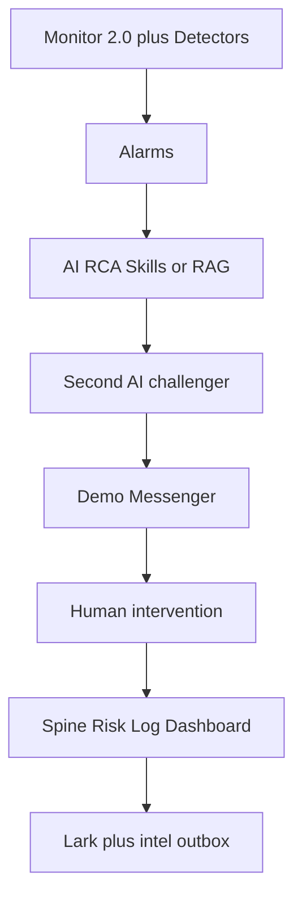
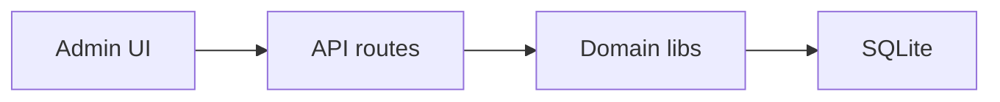
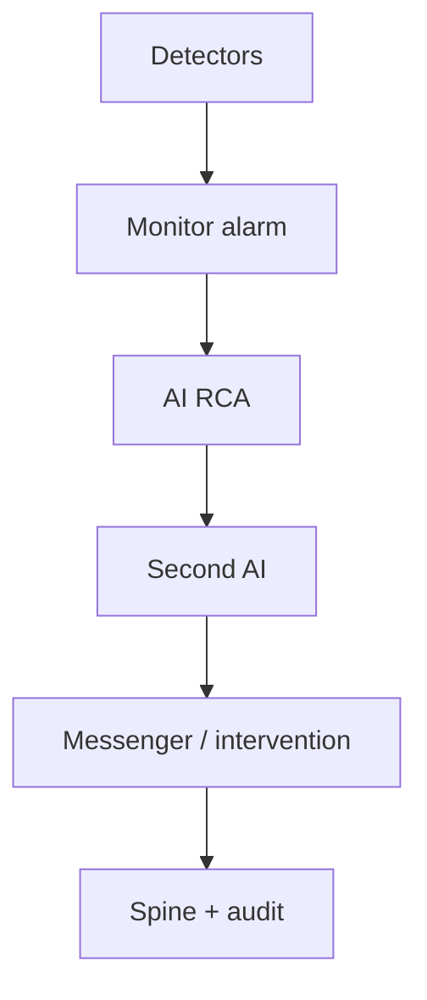
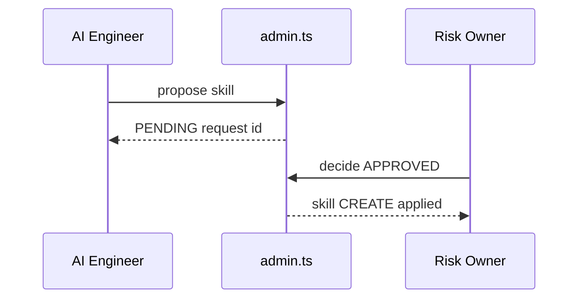
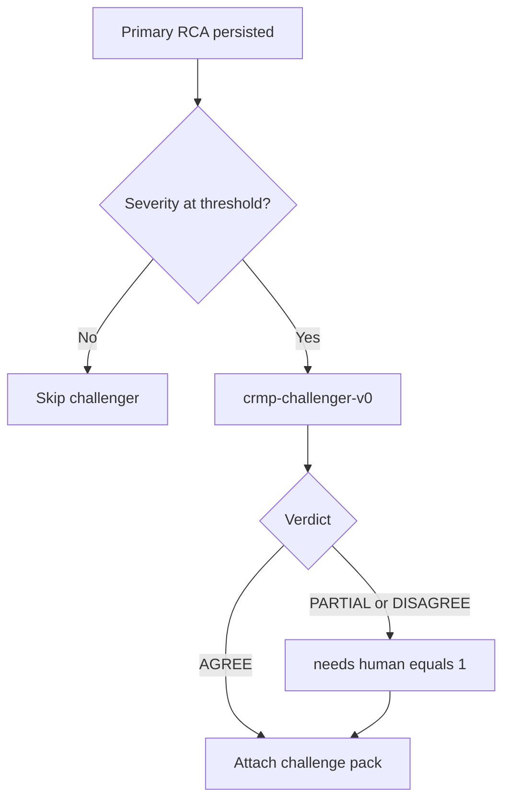
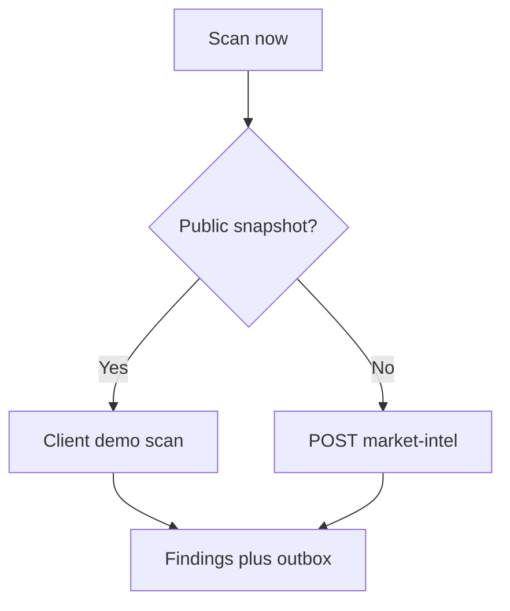

# Vantage CRMP — Technical Specification Design (TSD)

**Document ID:** CRMP-TSD-001  
**Version:** 1.5  
**Status:** Prototype / living spec  
**Products in scope:** CFD + Crypto Exchange  
**Primary stack:** Next.js 15 (App Router), React 19, SQLite (`better-sqlite3`), RBAC session auth  
**Owner:** demo platform owner  
**Companion:** [PRD](/admin/docs/prd) · [User Guide](/admin/docs/user-guide) · [UAT](/admin/docs/uat)

This TSD describes the technical design of the Centralised Risk Management Platform (CRMP) Admin Control Plane.  
**§8 AI Admin** and **§9 Second-AI Challenger** are first-class module specifications.

---

## 1. Purpose & scope

### 1.1 Purpose
Provide a single admin control plane where Risk, Ops, AI, and System operators can:
- Observe Monitor 2.0 indicators / alerts
- Run AI RCA (skills + RAG) with independent second-AI challenge on high severity
- Triage in Demo Messenger (evidence, chat, escalate, dismiss, close, controls)
- Enforce human gates on high-impact actions
- Govern AI configuration via maker/checker
- Review spine logs, risk analytics, market intel, and daily performance

### 1.2 In scope (prototype)
- Admin UI + SQLite persistence
- Detectors → Alarm → AI RCA → Second opinion → Messenger / Intervention → Spine → Dashboard
- AI Admin governance (parameters, skills, RAG, training, accuracy)
- Risk scenario playbooks and linked timeline chains
- Demo Messenger + Lark channel registry (mock webhooks)
- Market Intelligence 5-minute scanner + outbox
- Bilingual docs (EN / zh-Hant) and responsive admin shell

### 1.3 Out of scope (production wiring)
- Live SSO / IdP
- Real Lark interactive cards / oneZero / wallet write adapters
- Production LLM billing + training cluster

---

## 2. System context



**AI Admin** sits beside the runtime spine: it does **not** execute live trading actions; it governs models, playbooks, RAG corpus, and AI parameters under dual control.

---

## 3. Architecture overview

| Layer | Responsibility | Key paths |
|---|---|---|
| UI (App Router) | RBAC-gated admin pages | `platform/src/app/admin/**` |
| Client consoles | Interactive tabs / forms | `platform/src/components/*` |
| API routes | JSON mutations + reads | `platform/src/app/api/**` |
| Domain libs | Business logic | `platform/src/lib/ai/*`, `lib/db.ts`, `lib/auth.ts` |
| Persistence | SQLite file | `platform/data/vantage_risk.db` |




### 3.1 Runtime spine stages
1. **Detectors** sample indicators (`/admin/detectors`)
2. **Alarm** opens Monitor alert/ticket
3. **AI RCA** matches skill or RAG-reasons (`/admin/ai-analyses`)
4. **Second-AI Challenger** runs when severity ≥ threshold (`crmp-challenger-v0`)
5. **Demo Messenger / Human intervention** triage and gated controls
6. **Spine logging** records stage transitions (`/admin/spine`)


7. **Daily performance / Risk Log / Market Intel** aggregate outcomes

---

## 4. Data model (core)

### 4.1 Identity & RBAC
- `users`, `roles` (permission JSON), `departments`, `teams`, `sessions`
- Permissions are string codes; `SUPER_ADMIN` has `*`

### 4.2 Monitoring
- `monitor_indicators`, `monitor_alerts`, `monitor_tickets`
- `risk_domains`, `escalation_routes`, `lark_channels`

### 4.3 AI runtime
- `ai_skills` (+ `scenario_json`), `risk_scenario_chains`
- `rag_documents` (+ FTS)
- `ai_analyses` (+ `challenged`, `challenge_verdict`), `ai_analysis_evidence`, `ai_skill_runs`
- `ai_analysis_challenges` (second-opinion rows)
- `interventions`, spine tables

### 4.4 Messenger
- `messenger_threads`, `messenger_messages`, `messenger_pending_actions`

### 4.5 Market intelligence
- `market_intel_*` scan/findings/outbox tables (see `lib/market-intel/schema.ts`)

### 4.6 AI Admin governance
See **§8.4** — `ai_change_requests`, `ai_training_runs`, `ai_feedback`, `ai_accuracy_snapshots`, AI keys in `platform_settings`.

---

## 5. Security & RBAC (summary)

| Concern | Rule |
|---|---|
| Page access | `getCurrentUser()` + `hasPermission(role, code)` |
| Maker ≠ Checker | Proposer cannot approve own `ai_change_requests` when `ai.maker_checker_required=true` |
| AI Admin mutations | Only via `/api/ai-admin` with propose/approve permissions |
| Audit | `writeAudit` on propose, decide, feedback, training queue |
| **AI access blocklist** | Pages/functions/fields/data AI must never touch — see `/admin/security/ai-access` and `lib/security/ai-access-blocklist.ts` |

Detailed AI Admin permission matrix: **§8.3**.  
**Human-only surfaces (identity, secrets, dual-control approve, LP/wallet execute, role writes):** living list on **`/admin/security/ai-access`**.

---

## 6. Integration points

| System | Mode in prototype | Notes |
|---|---|---|
| Monitor 2.0 | Mirrored tables + sync / simulate alarm | Indicators/alerts/tickets |
| Demo Messenger | In-app threads + `/api/messenger` | Evidence, escalate, controls |
| Lark | Channel registry + mock webhook / intel outbox | Severity routing |
| Market intel feeds | Heuristic 5-min scanner | Card format i–vi |
| LP / Bridge / Wallets | Suggested actions + admin deep-links | Human gate before real adapters |
| Model training | Queued runs + seeded metrics | No GPU cluster in prototype |

---

## 7. Admin surface map

Source of truth for routes: `NAV_ITEMS` + `NAV_GROUPS` in `platform/src/lib/nav.ts`. Every row is specified in this TSD (this section + §8–§17) and has an operator how-to in the User Guide.

### 7.1 Shell (not a nav row)

| Surface | Route / store | Module | Permission |
|---|---|---|---|
| Login | `/login` | `app/login/page.tsx`, `lib/demo-session.ts` | public |
| Language | cookie `crmp_ui_lang` | `hooks/useUiLocale`, `lib/i18n.ts` | — |
| Unread badges | `crmp_nav_seen_v1` / `crmp_nav_extra_v1` | `AdminShell`, `lib/nav-badges.ts` | — |
| Demo session | `crmp_demo_session_v1` | persist named persona on Pages | — |
| Mobile drawer | `< lg` | `AdminShell` hamburger | — |
| Brand | Vantage logo + owner line | `VantageLogo`, `lib/platform-owner.ts` | — |

Unread formula: `max(0, mergeNavTotals(server) + extra − seen)`. Opening a href writes seen. `bumpNavBadge(href)` increments extra. Pages uses `FALLBACK_NAV_TOTALS` when SQLite counts are empty.

### 7.2 Pages

| Group | URL | UI / API | Permission | Spec |
|---|---|---|---|---|
| Overview | `/admin` | `app/admin/page.tsx` | `admin.access` | §17.1 |
| Monitor | `/admin/dashboard` | `DailyDashboardView`, `GET/POST /api/dashboard` | `dashboard.read` | §17.2 |
| Monitor | `/admin/risk-log` | `RiskLogDashboard`, `lib/ai/risk-log.ts` | `monitor.read` \| `audit.read` \| `dashboard.read` | §17.3 |
| Monitor | `/admin/market-intel` | `MarketIntelBoard` | `monitor.read` | **§12** |
| Monitor | `/admin/monitor-2` | tabs + `MonitorActions`, `/api/monitor` | `monitor.read` / `monitor.operate` | §17.4 |
| Monitor | `/admin/detectors` | `DetectorsBoard`, `/api/detectors` | `detectors.read` | §17.5 |
| Monitor | `/admin/alerts` | `AlertsBoard` | `monitor.read` / `monitor.operate` | §17.6 |
| Monitor | `/admin/risk-domains` | domain cards | `monitor.read` | §17.7 |
| AI | `/admin/ai-analyses` | `AiAnalysesBoard`, `/api/ai` | `ai.read` / `ai.operate` | §9 + §17.8 |
| AI | **`/admin/ai-admin`** | `AiAdminConsole`, `/api/ai-admin` | `ai.admin` | **§8** |
| AI | `/admin/skills` · `/admin/skills/[code]` | `SkillsScenariosBoard` | `skills.read` | §10 + §17.9 |
| AI | `/admin/knowledge-tree` | `KnowledgeTreeBoard` | `rag.read` | §17.10 |
| AI | `/admin/rag` | `RagManager`, `/api/rag` | `rag.read` / `rag.manage` | §17.11 |
| Response | `/admin/messenger` | `DemoMessenger`, `/api/messenger` | `lark.read` | **§11** |
| Response | `/admin/interventions` | `InterventionsBoard` | `intervene.operate` | §17.13 |
| Response | `/admin/escalation` | `EscalationManager` | `escalation.read` / `.manage` | §17.15 |
| Response | `/admin/lark` | `LarkManager`, `/api/lark` | `lark.read` / `lark.manage` | §17.14 |
| Response | `/admin/spine` | `listSpineEvents` | `spine.read` | §17.12 |
| Org | `/admin/departments` | department cards | `teams.read` | §17.16 |
| Org | `/admin/teams` | teams table | `teams.read` | §17.16 |
| Org | `/admin/roles` | permission chips | `users.read` | §17.16 |
| Org | `/admin/users` | `UsersManager`, `/api/users` | `users.read` / `users.manage` | §17.16 |
| Platform | `/admin/data-sources` | `DataSourcesManager` | `sources.read` / `.manage` | §17.17 |
| Platform | `/admin/security/ai-access` | `AiAccessSecurityBoard` | `audit.read` \| `settings.manage` \| `users.read` \| `ai.admin` | §5 + §17.18 |
| Platform | `/admin/audit` | `audit_logs` last 200 | `audit.read` | §17.19 |
| Platform | `/admin/settings` | `SettingsManager`, `PATCH /api/settings` | `settings.manage` | §17.20 |
| Docs | `/admin/docs/user-guide` · `/admin/docs/prd` · `/admin/docs/tsd` · `/admin/docs/uat` · `/admin/docs/ecosystem` · `/admin/docs/roadmap` · `/admin/docs/urls` | `lib/docs.ts`, `UatChecklistBoard` | `admin.access` | §13 + §16.21 |
| Auth | `/login` | persona buttons + form | public | §17.1 |

Static export: `next.config` `output: 'export'`, `basePath: '/PRD/crmp-admin'`, `trailingSlash: true`. Client detects `isPublicSnapshot()` / `NEXT_PUBLIC_STATIC_EXPORT` and uses demo fallbacks instead of `/api`.

---

## 8. AI Admin Management Page — full specification

### 8.1 Purpose
`/admin/ai-admin` is the **AI control plane**. Operators use it to:
1. Observe AI health KPIs and accuracy history
2. Propose changes to AI parameters, skills, and RAG documents
3. Approve/reject those changes under **maker/checker dual control**
4. Queue training / recalibration runs
5. Label RCA quality feedback (CORRECT / INCORRECT / PARTIAL)

It is **governance**, not the live RCA workbench (`/admin/ai-analyses`) and not the intervention desk (`/admin/interventions`).

### 8.2 Route & components

| Item | Spec |
|---|---|
| Page route | `GET /admin/ai-admin` → `platform/src/app/admin/ai-admin/page.tsx` |
| UI component | `AiAdminConsole` (`platform/src/components/AiAdminConsole.tsx`) client console |
| API | `GET/POST /api/ai-admin` → `platform/src/app/api/ai-admin/route.ts` |
| Domain logic | `platform/src/lib/ai/admin.ts` |
| Schema | `platform/src/lib/ai/admin-schema.ts` via `ensureAiAdminSchema` |
| Seed | `seedAiAdminIfEmpty` (params, training runs, accuracy snapshots, demo CRs) |

### 8.3 Access control

#### 8.3.1 Page view (any of)
- `ai.admin`
- `skills.manage`
- `rag.manage`
- `ai.read`

Unauthorized users redirect to `/admin`.

#### 8.3.2 Maker (propose) — any of
- `ai.propose`
- `skills.manage`
- `rag.manage`
- `settings.manage`

#### 8.3.3 Checker (approve/reject) — any of
- `ai.approve`
- `skills.approve`
- `rag.approve`

#### 8.3.4 Role mapping (prototype)

| Role | View AI Admin | Maker | Checker | Notes |
|---|---|---|---|---|
| `AI_ENGINEER` | Yes | Yes | No | Proposes skills/RAG/params/training |
| `RISK_OWNER` | Yes | Yes* | Yes | Primary checker; may also propose |
| `RISK_ANALYST` | Yes | Yes | No | Propose + operate feedback |
| `SUPER_ADMIN` | Yes | Yes | Yes | Full; still blocked from self-approve when maker≠checker enforced |
| `OPS_LEAD` / `SYSTEM_ADMIN` | Limited / via perms | Per ROLE_DEFS | Per ROLE_DEFS | See `ROLE_DEFS` in `db.ts` |
| `VIEWER` | No (unless granted) | No | No | Read-only elsewhere |

\* Risk Owner has both propose and approve; self-approval of own CR is still rejected.

#### 8.3.5 Maker ≠ Checker rule
When `platform_settings.ai.maker_checker_required != "false"`:
- `decideChangeRequest` throws if `proposed_by === decided_by`
- UI should only show Approve/Reject to checkers who are not the proposer

### 8.4 Data model

#### 8.4.1 `ai_change_requests`
| Column | Type | Notes |
|---|---|---|
| `id` | INTEGER PK | |
| `request_id` | TEXT UNIQUE | e.g. `CR-A1B2C3D4` |
| `entity_type` | TEXT | `PARAM` \| `SKILL` \| `RAG` \| `TRAINING` |
| `action` | TEXT | `UPDATE` \| `CREATE` \| `DISABLE` \| `RETIRE` \| … |
| `title`, `summary` | TEXT | Human-readable |
| `payload_json` | TEXT | After-state / create payload |
| `before_json` | TEXT NULL | Prior state for diffs |
| `status` | TEXT | `PENDING` \| `APPROVED` \| `REJECTED` |
| `proposed_by` / `proposed_at` | FK / timestamp | Maker |
| `decided_by` / `decided_at` / `decision_note` | FK / timestamp / TEXT | Checker |

#### 8.4.2 `ai_training_runs`
Tracks queued/running/completed recalibrations: `run_id`, `model_name`, `dataset_label`, metrics (`accuracy`, `precision_score`, `recall_score`, `f1_score`), `samples`, `status`, timestamps, `created_by`.

#### 8.4.3 `ai_feedback`
Per-analysis labels: `CORRECT` \| `INCORRECT` \| `PARTIAL`, optional note, `rated_by`.

#### 8.4.4 `ai_accuracy_snapshots`
Daily rollup: skill-match rate, human-agree rate, feedback-correct rate, analyses total, intervention approved/rejected counts. Overview refresh upserts `date('now')` live snapshot.

#### 8.4.5 Governed parameters (`platform_settings` keys)
| Key | Purpose | Default (seed) |
|---|---|---|
| `ai.rca_enabled` | Master RCA switch | `true` |
| `ai.auto_on_alarm` | Auto-trigger RCA on alarm | `true` |
| `ai.skill_certainty_only` | Auto-exec skills only on certainty match | `true` |
| `ai.min_confidence` | Min confidence before auto-complete | `0.55` |
| `ai.rag_top_k` | Top-K RAG docs | `6` |
| `ai.second_opinion_severity` | Severities for challenger AI | `BREACH` |
| `ai.maker_checker_required` | Enforce dual control | `true` |
| `detectors.auto_raise_alarms` | Detectors raise Monitor alarms | `true` |

Only keys starting with `ai.` or `detectors.auto_raise_alarms` may be applied via AI Admin PARAM changes.

### 8.5 UI specification (tabs)

Console tabs (client state):

| Tab ID | Label | Functions |
|---|---|---|
| `overview` | Overview | KPI cards: analyses total, skill-match %, avg confidence, needs-human, interventions pending, human-agree %, feedback-correct %, pending CRs. Recent analyses list with feedback labels. |
| `params` | Parameters | Editable drafts for AI settings; **Propose** creates PARAM CR (does not apply immediately). |
| `changes` | Maker / Checker | List CRs (PENDING first). Checker Approve / Reject with note. Shows maker name, before/after payload. Pending count badge on tab. |
| `skills` | Skills | List skills; form to **propose CREATE** skill (code, name, description, indicator patterns, owner dept, human step). Actual apply on approve. Link out to `/admin/skills` for scenario board. |
| `rag` | RAG | List documents (excerpt); form to **propose CREATE** RAG doc; apply on approve (+ FTS reindex). |
| `training` | Training | List runs + metrics; form to **queue training** (creates TRAINING CR). |
| `history` | History & accuracy | Accuracy snapshot table (14 days). |

Header badges show current `role_code`, **Maker**, and/or **Checker** capability.

### 8.6 API specification

#### 8.6.1 `GET /api/ai-admin`
Query:
- `tab` = `overview` (default) \| `params` \| `changes` \| `training` \| `skills` \| `rag`
- `status` (optional, for changes filter)

Auth: view permissions (§8.3.1).  
Default response includes `{ overview, params, changes, training, skills, rag, roles }`.

#### 8.6.2 `POST /api/ai-admin`
JSON body with `action`:

| `action` | Permission | Effect |
|---|---|---|
| `propose` | Maker | Generic CR insert |
| `propose_param` | Maker | PARAM UPDATE CR for `key`/`value` |
| `propose_skill` | `skills.manage` or `ai.propose` | SKILL CREATE/UPDATE/… CR |
| `propose_rag` | `rag.manage` or `ai.propose` | RAG CREATE/UPDATE/… CR |
| `decide` | Checker | `APPROVED` applies payload; `REJECTED` closes CR. Enforces maker≠checker |
| `queue_training` | Maker | TRAINING CREATE CR |
| `feedback` | `ai.operate` or `ai.admin` | Insert `ai_feedback` row |

Error model: `{ error: string }` with HTTP 400/403.

### 8.7 Apply semantics (on APPROVED)

| entity_type | action | Apply behaviour |
|---|---|---|
| `PARAM` | `UPDATE` | Update `platform_settings.value` |
| `SKILL` | `CREATE` | Insert `ai_skills` ACTIVE |
| `SKILL` | `UPDATE` | Patch fields (name, patterns, steps, status, …) |
| `SKILL` | `DISABLE` | `status='DISABLED'` |
| `RAG` | `CREATE` | Insert doc + `reindexRagFts` |
| `RAG` | `UPDATE` | Content/status update + reindex |
| `RAG` | `RETIRE` | `status='RETIRED'` + reindex |
| `TRAINING` | `CREATE` | Insert `ai_training_runs` QUEUED |

Unsupported pairs throw and leave CR undecided (transactional expectation for production: wrap apply+status update).

### 8.8 Audit events
| Event | When |
|---|---|
| `AI_CHANGE_PROPOSED` | Maker submits CR |
| `AI_CHANGE_APPROVED` / `AI_CHANGE_REJECTED` | Checker decides |
| `AI_FEEDBACK` | Feedback label submitted |

### 8.9 Non-functional requirements
| NFR | Spec |
|---|---|
| Latency | Page SSR + client tabs; API mutations < 500ms p95 in prototype |
| Durability | SQLite WAL; audit trail retained |
| Safety | No direct apply of PARAM/SKILL/RAG without CR when maker/checker required |
| Separation | Runtime interventions remain on `/admin/interventions` |
| Observability | Overview KPIs + accuracy snapshots |

### 8.10 UX / acceptance criteria
1. AI Engineer can open AI Admin and propose a skill; CR appears PENDING.
2. Same AI Engineer **cannot** approve that CR (error: maker/checker).
3. Risk Owner can approve; skill becomes ACTIVE and visible on `/admin/skills`.
4. Parameter propose does not change live value until APPROVED.
5. Training queue creates CR then TRAINING run on approve.
6. Overview shows pending CR count and accuracy history.
7. Feedback labels persist and affect feedback-correct rate.

### 8.11 Sequence — propose skill (happy path)



### 8.12 Related pages
| Page | Relationship |
|---|---|
| `/admin/skills` | Runtime playbook / scenario board (post-approve view) |
| `/admin/rag` | Corpus browser; create/update should prefer AI Admin CR path for governed changes |
| `/admin/ai-analyses` | Consumes skills/RAG/params governed here |
| `/admin/interventions` | Human gates for **runtime** actions (not config CRs) |
| `/admin/roles` | Defines permissions listed in §8.3 |

### 8.13 Future enhancements (not yet required)
- Diff UI for `before_json` vs `payload_json`
- Mandatory dual approval for CRITICAL severity param changes
- Webhook notify Lark `oc_ai_detection_lab` on PENDING CR
- Export CR pack for compliance

---

## 9. Independent Second-AI Challenger

### 9.1 Purpose
For alert severities at or above `ai.second_opinion_severity` (default **BREACH**), the platform runs an independent challenger model (`crmp-challenger-v0`) after the primary skill/RAG RCA. The challenger **must not** reuse the primary decision path (separate heuristics / future separate vendor).

**Code:** `platform/src/lib/ai/challenger.ts` · wired from `analyze.ts` after skill/RAG persist.

### 9.2 Trigger
| Setting | Default | Behaviour |
|---|---|---|
| `ai.second_opinion_severity` | `BREACH` | Run when alert severity rank ≥ setting (`WARN` &lt; `BREACH` &lt; `CRITICAL`) |




### 9.3 Outputs
| Field | Description |
|---|---|
| `verdict` | `AGREE` / `PARTIAL` / `DISAGREE` |
| `critiques` | Material gaps in primary narrative |
| `improvements` | Prioritised recommendations (`HYPOTHESIS` / `EVIDENCE` / `ACTION` / …) |
| `alternatives` | Competing hypotheses with confidence |

### 9.4 Persistence & side-effects
- Table `ai_analysis_challenges` (1:1 with `ai_analyses`)
- Evidence row type `CHALLENGER`
- Columns `ai_analyses.challenged`, `challenge_verdict`
- `PARTIAL` / `DISAGREE` forces `needs_human = 1`
- Spine stage `AI_RCA` event + audit `AI_SECOND_OPINION`
- Lazy backfill via `getAnalysisBundle` / `POST /api/ai` action `backfill_challenges`

### 9.5 UI
- List badges: `2nd AI · {verdict}`
- Detail panel: `AiChallengePanel`
- Controls: simulate CRITICAL, backfill challenges

---

## 10. Skills & risk scenarios (summary)

Skills store rich `scenario_json`: indicator, thresholds + why, fault areas, escalation, BU corrections, past cases.  
`risk_scenario_chains` link multi-indicator timelines. See `/admin/skills`, `risk-scenarios-catalog.ts`, `risk-scenarios-extra.ts`.

---

## 11. Demo Messenger

### 11.1 Purpose
In-app Lark-style inbox for alert + AI report threads with inline operator actions. Production transport remains Lark; this module proves UX and audit semantics.

### 11.2 Stack
| Item | Path |
|---|---|
| Page | `/admin/messenger` → `app/admin/messenger/page.tsx` |
| UI | `components/DemoMessenger.tsx` (mobile master-detail) |
| API | `GET/POST /api/messenger` |
| Domain | `lib/messenger/demo.ts` |

### 11.3 Actions
| Action | Effect |
|---|---|
| `show_evidence` | Post vault + challenger summary into thread |
| `chat` | User note / challenge; disagreement flags `needs_human` |
| `escalate` | Advance escalation path step |
| `dismiss` | False alarm → thread DISMISSED, alert CLOSED |
| `close` | Accept AI → thread CLOSED |
| `recommend` → `confirm_action` | Double-confirm control → admin_ref (+ checker if required) |

### 11.4 Data
`messenger_threads`, `messenger_messages`, `messenger_pending_actions` (see §4.4).

---

## 12. Market Intelligence

### 12.1 Purpose
Five-minute scan of news/social/official signals that can move LP prices; push formatted cards to a dedicated messenger/outbox channel; expose indicator `M2-MKT-INTEL`.

### 12.2 Key modules
- `lib/market-intel/scanner.ts`, `format.ts`, `schema.ts`, `demo-scan.ts`
- UI `/admin/market-intel`
- Settings: `market_intel.enabled`, `interval_minutes`, `lark_chat_id`

### 12.3 Public snapshot (GitHub Pages)
Pages has no Next.js API routes. `POST /api/market-intel` would return **405**. The desk therefore:
1. Detects `github.io` / `/PRD/crmp-admin` / `NEXT_PUBLIC_STATIC_EXPORT`.
2. Runs `runClientMarketIntelScan()` from the same `EVENT_TEMPLATES` as the live scanner.
3. Updates Findings, outbox, scan log and `M2-MKT-INTEL` in local state (persisted in `localStorage`).
4. Seeds three findings at SSG time so the first paint is not empty.



---

## 13. Docs, i18n & responsive shell

| Concern | Design |
|---|---|
| Docs | Markdown under `platform/docs/*` rendered via `lib/docs.ts` + `DocArticlePage` |
| Locales | `en` / `zh-Hant` query `?lang=` |
| UI chrome i18n | Cookie `crmp_ui_lang`; nav labels in `lib/i18n.ts` |
| Mobile | `AdminShell` drawer &lt; `lg`; messenger list/thread panes; safe-area CSS |

Interactive UAT board: `/admin/docs/uat` (`UatChecklistBoard` + `lib/docs/uat-cases.ts`).

---

## 14. Key API map (prototype)

Absent on GitHub Pages (static export). UI must degrade: demo session, client intel scan, local settings message.

| API | Role |
|---|---|
| `POST /api/auth/login` | Session cookie `crmp_session`; Pages falls back to `writeDemoSession` |
| `POST /api/auth/logout` | Clear cookie |
| `GET/POST /api/ai` | Analyses, simulate alarm, `backfill_challenges` |
| `GET/POST /api/ai-admin` | Propose/approve/training/feedback |
| `GET/POST /api/messenger` | Threads + inline actions |
| `GET/POST /api/lark` | Channel registry / mock notify |
| `GET/POST /api/market-intel` | Scan / findings / outbox |
| `GET/POST /api/detectors` | Run all, toggle enabled |
| `GET/POST /api/monitor` | `sync_monitor2`, `ack_alert`, `update_ticket` |
| `POST /api/dashboard` | Rebuild daily metrics |
| `GET/POST /api/rag` | List, retrieve, create, update |
| `GET/POST /api/users` | Directory + create/disable |
| `PATCH /api/settings` | Single key save |
| Interventions | Server action `decideInterventionAction` (approve/reject) |

---

## 15. Deployment (prototype)

```bash
cd platform
npm install
npm run dev   # http://localhost:3000
```

SQLite path: `platform/data/vantage_risk.db`.  
Reset: `npm run db:reset` then restart.

Demo logins: see User Guide §1 (e.g. `admin@vantagemarkets.com` / `admin123`).

---

## 16. Remaining admin modules

Modules not fully specified in §8–§13. Behaviour must match the User Guide how-to and PRD §6.4.

### 16.1 Login, session, shell, unread — §7.1

- Personas: `DEMO_PERSONAS` in `lib/demo-session.ts` (demo platform owner first).  
- Localhost: `POST /api/auth/login` sets `crmp_session` **and** writes demo session.  
- Pages / 404/405: skip API, `writeDemoSession` only.  
- `AdminShell` prefers demo session when `isPublicSnapshot()`. Sign out clears both.  
- Nav groups from `NAV_GROUPS`. Unread: `AdminShell` + `bumpNavBadge` from Market Intel, Detectors, AI Analyses, Messenger.

### 16.2 Admin Home

SSR counts (users, teams, sources, domains, open alerts/tickets, Lark channels, routes). Every tile is a `Link`: `StatCard` `href` (with icon + Open), owner → `/login`, messenger hero → `/admin/messenger`, jump grid, department cards to working pages (alerts / interventions / AI analyses / settings), recent alerts to `/admin/alerts#{alert_id}`, spine steps to monitor / alerts / escalation / AI / dashboard. `AlertsBoard` honours the hash.

### 16.3 Daily performance

`getDailyDashboard()` → CFD/crypto metric arrays + WARN/BREACH summary. `POST /api/dashboard` refresh.

### 16.4 Risk log

`getRiskLogDashboard()` aggregates: summary USD/times, `by_category`, `by_domain`, `loopholes`, chronological `records`. Read-only UI (`RiskLogDashboard`).

### 16.5 Monitor 2.0 hub

Query `tab=indicators|alerts|tickets`. `MonitorActions` `sync_monitor2` / `ack_alert` / `update_ticket`. Setting `monitor2.base_url` displayed.

### 16.6 Detectors

Table `detectors` + `detector_runs`. `POST /api/detectors` `{ raiseAlarms: true }` or `{ action: 'toggle' }`. Non-HEALTHY results bump nav badges for detectors/alerts/ai-analyses.

### 16.7 Live alerts

Join `monitor_alerts` × indicators. Sort CRITICAL/BREACH/WARN then time. `ack_alert` when `monitor.operate`.

### 16.8 Risk domains

`risk_domains` cards: priority, product_coverage, owner_department, supporting_departments_json. Read-only.

### 16.9 AI Analyses list/detail

List: `AiAnalysesBoard` simulate actions `simulate_copy_breach`, EQ drawdown, CRITICAL, `backfill_challenges`. Detail: `/admin/ai-analyses/[id]` evidence + `AiChallengePanel`. See §9.

### 16.10 Skills board + SKILL.md page

`SkillsScenariosBoard`: search, skills vs chains tabs, **Enter** → `/admin/skills/[code]` (`finalizeSkill` playbook: when to use/not, prechecks, steps, evidence, stop, success). Catalog: `risk-scenarios-catalog.ts` + extras.

### 16.11 Knowledge Tree

`KnowledgeTreeBoard` client SVG (`viewBox` width 1120). Trunks: `domains` | `chains` | `rag`. Product filter ALL/CFD/Crypto. Domain nodes wrap (5-col × 2). Click domain fans skills; click skill fills inspector; `router.push` playbook (do not use invalid SVG `<Link>`). RAG docs scored from `tags_json` + title. Outline mode is the same graph as a nested list.

### 16.12 RAG corpus

`RagManager`: category filter, search, retrieve `GET /api/rag?mode=retrieve&q=&limit=6`, create/update/retire when `rag.manage`. FTS via `reindexRagFts`. Governed creates should prefer AI Admin CR path (§8.7).

### 16.13 Spine log

Stages: DETECT, ALARM, AI_RCA, SKILL_EXECUTE, HUMAN_INTERVENTION, RESOLVED, DASHBOARD. 24h `StatCard` counts + last 150 events.

### 16.14 Interventions

`listInterventions()`. Pending: note + Approve/Reject via `decideInterventionAction`. Writes spine + audit. Distinct from AI Admin CRs.

### 16.15 Lark + escalation

`lark_channels` + `lark.*` settings. `escalation_routes` join teams + channel. Messenger `escalate` walks primary → secondary → owner → exec using this map.

### 16.16 Organisation

Departments (responsibilities JSON), teams (Lark chat, on-call, member_count), roles (`permissions_json` chips), users (`UsersManager` create/toggle when `users.manage`). Seed includes `PLATFORM_OWNER`.

### 16.17 Data sources

`data_sources` registry. `DataSourcesManager` CRUD when `sources.manage`.

### 16.18 AI access blocklist

`lib/security/ai-access-blocklist.ts` → `AI_ACCESS_BLOCKLIST`, `AI_ALLOWED_CAPABILITIES`, `AI_SERVICE_ROLE_FORBIDDEN_PERMISSIONS`. Read-only board + stats.

### 16.19 Audit log

`audit_logs` ORDER BY id DESC LIMIT 200. Actor, action, entity, details_json.

### 16.20 Platform settings

`SettingsManager` groups by key prefix: `platform.|products.`, `monitor2.`, `ai.`, `market_intel.`, `lark.`, `escalation.|detectors.`. `PATCH /api/settings`. Pages: message “stored in this browser only”.

### 16.21 Docs renderer

Markdown `platform/docs/*.md` + `*.zh-Hant.md`. `markdownToHtml`: headings h1–h4, tables, lists, mermaid `graph` / `flowchart` / `sequenceDiagram` → SVG (`.doc-diagram`, `lib/docs-mermaid.ts`). UAT: `UatChecklistBoard` + `UAT_CASES` (45). URL catalog: `lib/docs/urls.ts` `PLATFORM_URLS`, `PUBLIC_ADMIN_URL`, `PUBLIC_MESSENGER_URL`.

---

## 17. Document control

| Ver | Date | Notes |
|---|---|---|
| 1.0 | 2026-10-01 | Initial TSD skeleton |
| 1.1 | 2026-10-01 | Full §8 AI Admin Management Page specification |
| 1.2 | 2026-10-01 | §9 Challenger, §11 Messenger, §12 Market Intel, docs/i18n/mobile, renumber |
| 1.3 | 2026-10-04 | Public snapshot demo scan, grouped nav, demo platform owner, Pages login |
| 1.5 | 2026-10-04 | SVG flowcharts and sequence diagrams in TSD + mermaid renderer |

**Owner:** demo platform owner  
**Companion:** [繁體中文版 TSD](./TSD.zh-Hant.md) · rendered at `/admin/docs/tsd`
