# Vantage CRMP Plus — Technical Specification Design (TSD)

**Document ID:** CRMP-TSD-001  
**Version:** 2.6  
**Status:** Prototype / living spec  
**Products in scope:** CFD + Crypto Exchange  
**Primary stack:** Next.js 15 (App Router), React 19, SQLite (`better-sqlite3`), RBAC session auth  
**Owner:** demo platform owner  
**Companion:** [PRD](/admin/docs/prd) (G13, FR-37…48) · [User Guide](/admin/docs/user-guide) (§9.3) · [AI Use Manual](/admin/docs/ai-use) (CRMP-AIU-001) · [UAT](/admin/docs/uat) (UAT-46…53) · [URL Catalog](/admin/docs/urls)

This TSD describes the technical design of **CRMP Plus** — the upgraded Centralised Risk Management Platform (original CRMP Admin plus 24/7 CS/TR) on one control plane.  
**§8 AI Admin**, **§9 Second-AI Challenger** and **§17 CS/TR Desk** (public `/cs`, `POST /api/cs/intake`, wait loop, dedicated SKILL.md, **dashboard + log**) are first-class module specifications. Original CRMP Admin at `/PRD/crmp-admin/` is frozen and is not overwritten by this codebase.

---

## 1. Purpose & scope

### 1.1 Purpose
Provide a single admin control plane where Risk, Ops, AI, System, Customer Service (CS) and Trading (TR) operators can:
- Observe Monitor 2.0 indicators / alerts
- Run AI RCA (skills + RAG) with independent second-AI challenge on high severity
- Triage in Demo Messenger (evidence, chat, escalate, dismiss, close, controls)
- Staff 24/7 CS/TR intake: C1 live chat, website form and official email via public `/cs` and `POST /api/cs/intake`; AI emails the client when unclear or ID is needed and **waits for a reply** (cap 3, `CSR-XXXX` / `channel_ref` match); once facts are collected it **categorises, assigns severity, drafts a solution**, and either auto-replies or holds for a named POC
- Stamp dedicated CS/TR SKILL.md playbooks and escalate book-risk onto Demo Messenger
- Review CS/TR volume on a **dedicated dashboard**, CS_* history on a **dedicated log**, and BU/team/escalation/`cs.*` records on a **dedicated data page** (not Daily Performance / Risk Log)
- Enforce human gates on high-impact actions
- Govern AI configuration via maker/checker
- Review home spine stage ticket counts, risk analytics, market intel, and daily performance

### 1.2 In scope (prototype)
- Admin UI + SQLite persistence
- Monitor 2.0 (indicator + detector registry) → Alarm → AI RCA → Second opinion → Messenger / Intervention → home spine → Dashboard
- AI Admin governance (parameters, skills, RAG, training, accuracy)
- Risk scenario playbooks and linked timeline chains
- Demo Messenger + Lark channel registry (mock webhooks)
- CS / TR Desk: C1 live chat, submission form and official-email intake (`POST /api/cs/intake` + public `/cs`); inbound reply matching; auto-email wait loop (cap 3); five dedicated SKILL.md; dedicated dashboard + log; URL Catalog **CS / TR** section
- Market Intelligence 5-minute scanner + outbox
- Bilingual docs (EN / zh-Hant) and responsive admin shell

### 1.3 Out of scope (production wiring)
- Live SSO / IdP
- Real Lark interactive cards / oneZero / wallet write adapters
- Production LLM billing + training cluster
- Production IMAP / SMTP mailbox (official-email connector posts the same intake webhook)
- Storing ID document images on `cs_requests`

---

## 2. System context

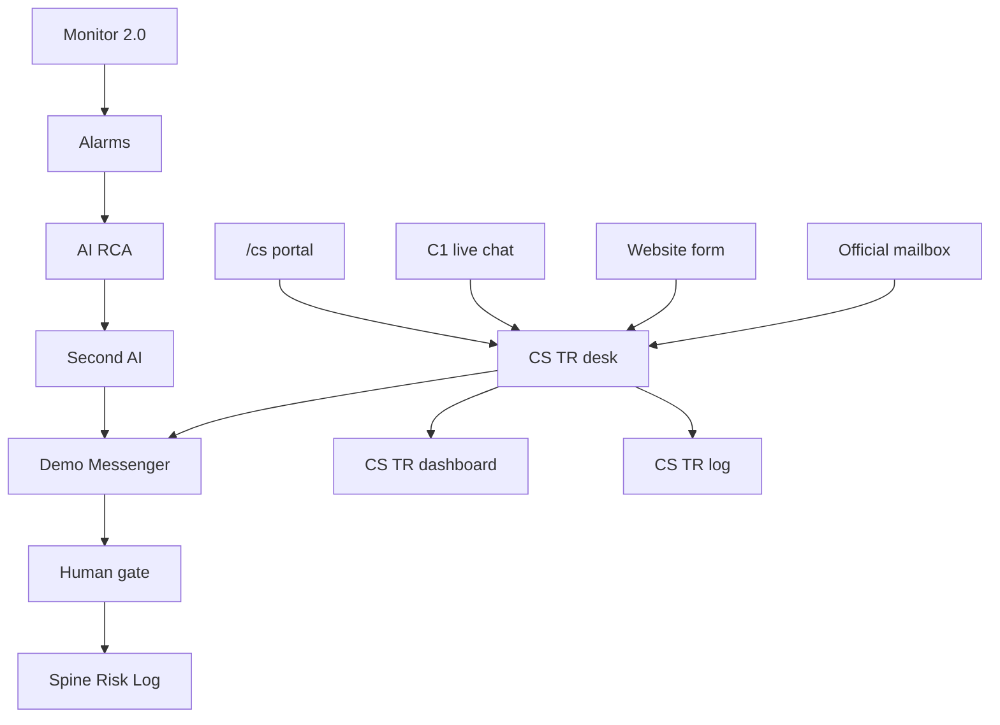

**AI Admin** sits beside the runtime spine: it does **not** execute live trading actions; it governs models, playbooks, RAG corpus, and AI parameters under dual control.

---

## 3. Architecture overview

| Layer | Responsibility | Key paths |
|---|---|---|
| UI (App Router) | RBAC-gated admin pages + public `/cs` | `platform/src/app/admin/**`, `app/cs/**` |
| Client consoles | Interactive tabs / forms | `platform/src/components/*` (`CsClientPortal`, `CsTrDesk`, `CsDashboardView`, `CsLogView`, `UrlCatalogBoard`) |
| API routes | JSON mutations + reads | `platform/src/app/api/**` (incl. `/api/cs`, `/api/cs/intake`) |
| Domain libs | Business logic | `platform/src/lib/ai/*`, `lib/cs/*`, `lib/db.ts`, `lib/auth.ts` |
| Persistence | SQLite file | `platform/data/vantage_risk.db` |

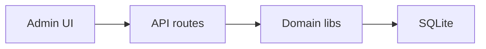


### 3.1 Runtime spine stages
1. **Monitor 2.0** runs detector sampling on the unified indicator + detector registry (`/admin/monitor-2`; `/admin/detectors` redirects)
2. **Alarm** opens Monitor alert/ticket
3. **AI RCA** matches skill or RAG-reasons (list on **Realtime Alert & Tracker** `/admin/alerts`; detail `/admin/ai-analyses/[id]`)
4. **Second-AI Challenger** runs when severity ≥ threshold (`crmp-challenger-v0`)
5. **Demo Messenger / Human intervention** triage and gated controls
6. **Home spine** records stage transitions with ticket counts on Admin Home (`/admin`; `/admin/spine` redirects — Spine Log tab removed)
7. **CS / TR door** (parallel to Monitor): `/cs` + C1/form/mailbox → `POST /api/cs/intake` → skill stamp → wait loop or TR / Risk → `CS_*` audit on the CRMP plane

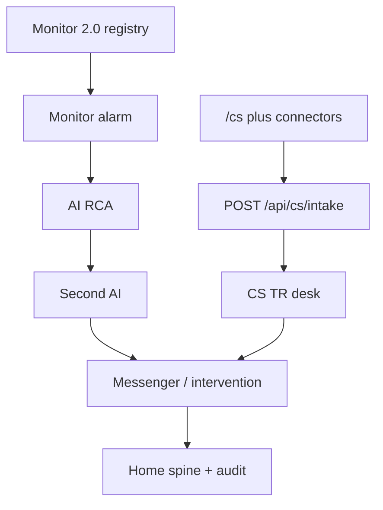
8. **Daily performance / Risk Log / Market Intel** aggregate outcomes

---

## 4. Data model (core)

### 4.1 Identity & RBAC
- `users`, `roles` (permission JSON), `departments`, `teams`, `sessions`
- Permissions are string codes; `SUPER_ADMIN` has `*`

### 4.2 Monitoring
- `monitor_indicators`, `monitor_alerts`, `monitor_tickets`
- `risk_domains`, `escalation_routes`, `lark_channels`

### 4.3 AI runtime
- `ai_skills` (+ `scenario_json`), `risk_scenario_chains`
- `rag_documents` (+ FTS)
- `ai_analyses` (+ `challenged`, `challenge_verdict`), `ai_analysis_evidence`, `ai_skill_runs`
- `ai_analysis_challenges` (second-opinion rows)
- `interventions`, spine tables

### 4.4 Messenger
- `messenger_threads`, `messenger_messages`, `messenger_pending_actions`

### 4.5 Market intelligence
- `market_intel_*` scan/findings/outbox tables (see `lib/market-intel/schema.ts`)

### 4.6 AI Admin governance
See **§8.4** — `ai_change_requests`, `ai_training_runs`, `ai_feedback`, `ai_accuracy_snapshots`, AI keys in `platform_settings`.

### 4.7 CS / TR intake
See **§17.5**. Tables: `cs_channels`, `cs_requests` (`request_id` CSR-XXXX, `channel_ref`, `skill_code`, `ai_clarity`, `followup_count`), `cs_messages`, `cs_followups` (`status=WAITING|CLOSED`). No ID-image blob column — identity stays off the ticket.

---

## 5. Security & RBAC (summary)

| Concern | Rule |
|---|---|
| Page access | `getCurrentUser()` + `hasPermission(role, code)` |
| Maker ≠ Checker | Proposer cannot approve own `ai_change_requests` when `ai.maker_checker_required=true` |
| AI Admin mutations | Only via `/api/ai-admin` with propose/approve permissions |
| Audit | `writeAudit` on propose, decide, feedback, training queue |
| **AI access blocklist** | Pages/functions/fields/data AI must never touch — see `/admin/security/ai-access` and `lib/security/ai-access-blocklist.ts` |

Detailed AI Admin permission matrix: **§8.3**.  
**Human-only surfaces (identity, secrets, dual-control approve, LP/wallet execute, role writes):** living list on **`/admin/security/ai-access`**.

---

## 6. Integration points

| System | Mode in prototype | Notes |
|---|---|---|
| Monitor 2.0 | Mirrored tables + sync / Run all / simulate | Indicator + detector registry on `/admin/monitor-2`; open alerts/tickets on Realtime Alert & Tracker |
| Demo Messenger | In-app threads + `/api/messenger` | Evidence, escalate, controls |
| Lark | Channel registry + mock webhook / intel outbox | Severity routing |
| Market intel feeds | Heuristic 5-min scanner | Card format i–vi |
| LP / Bridge / Wallets | Suggested actions + admin deep-links | Human gate before real adapters |
| C1 live chat | Webhook + `/cs` Live chat tab | `POST /api/cs/intake` (`x-cs-intake-token: demo-c1` or `portal: true`); `channel_ref` = session |
| Website / app form | Form post + `/cs` Submission tab | Same webhook; `channel_ref` = form id |
| Official mailbox | Gateway + `/cs` Official email tab | Same webhook; subject may carry `CSR-XXXX`; `In-Reply-To` continues |

---

## 7. Admin surface map

Source of truth for routes: `NAV_ITEMS` + `NAV_GROUPS` in `platform/src/lib/nav.ts`. Every row is specified in this TSD (this section + §8–§17) and has an operator how-to in the User Guide. Public `/cs` is **not** a left-nav row — it is the client door specified in **§17.8**.

### 7.1 Shell (not a nav row)

| Surface | Route / store | Module | Permission |
|---|---|---|---|
| Login | `/login` | `app/login/page.tsx`, `lib/demo-session.ts` | public |
| Language | cookie `crmp_ui_lang` | `hooks/useUiLocale`, `lib/i18n.ts` | — |
| Unread badges | `crmp_nav_seen_v1` / `crmp_nav_extra_v1` | `AdminShell`, `lib/nav-badges.ts` | — |
| Demo session | `crmp_demo_session_v1` | persist named persona on Pages | — |
| CS client portal | `/cs` | `CsClientPortal`, `POST /api/cs/intake` | public |
| Mobile drawer | `< lg` | `AdminShell` hamburger | — |
| Brand | Vantage logo + owner line | `VantageLogo`, `lib/platform-owner.ts` | — |

Unread formula: `max(0, mergeNavTotals(server) + extra − seen)`. Opening a href writes seen. `bumpNavBadge(href)` increments extra. Pages uses `FALLBACK_NAV_TOTALS` when SQLite counts are empty.

### 7.2 Pages

| Group | URL | UI / API | Permission | Spec |
|---|---|---|---|---|
| Overview | `/admin` | `app/admin/page.tsx` | `admin.access` | §16.2 |
| Monitor | `/admin/dashboard` | `DailyDashboardView`, `GET/POST /api/dashboard` | `dashboard.read` | §16.3 |
| Monitor | `/admin/risk-log` | `RiskLogDashboard`, `lib/ai/risk-log.ts` | `monitor.read` \| `audit.read` \| `dashboard.read` | §16.4 |
| Monitor | `/admin/market-intel` | `MarketIntelBoard` | `monitor.read` | **§12** |
| Monitor | `/admin/monitor-2` | unified registry + `MonitorActions`, `/api/monitor`, `/api/detectors` | `monitor.read` / `monitor.operate` | §16.5 |
| Monitor | `/admin/detectors` | redirects → Monitor 2.0 (bookmarks) | `detectors.read` | §16.5 |
| Monitor | `/admin/alerts` | **Realtime Alert & Tracker** · `AlertTrackerBoard` | `monitor.read` / `monitor.operate` | §16.7 |
| Monitor | `/admin/risk-domains` | domain cards | `monitor.read` | §16.8 |
| AI | `/admin/ai-analyses` | redirects → Realtime Alert & Tracker (list); detail `[id]` | `ai.read` / `ai.operate` | §9 + §16.9 |
| AI | **`/admin/ai-admin`** | `AiAdminConsole`, `/api/ai-admin` | `ai.admin` | **§8** |
| AI | `/admin/skills` · `/admin/skills/[code]` | `SkillsScenariosBoard` | `skills.read` | §10 + §16.10 |
| AI | `/admin/knowledge-tree` | `KnowledgeTreeBoard` | `rag.read` | §16.11 |
| AI | `/admin/rag` | `RagManager`, `/api/rag` | `rag.read` / `rag.manage` | §16.12 |
| Response | `/admin/messenger` | `DemoMessenger`, `/api/messenger` | `lark.read` | **§11** |
| Response | `/admin/cs-desk` | `CsTrDesk`, `/api/cs`, `/api/cs/intake` | `cs.read` / `cs.operate` | **§17** |
| Response | `/admin/cs-dashboard` | `CsDashboardView`, `lib/cs/analytics.ts`, `GET /api/cs?view=dashboard` | `cs.read` / `lark.read` | **§17.11** |
| Response | `/admin/cs-log` | `CsLogView`, `lib/cs/analytics.ts`, `GET /api/cs?view=log` | `cs.read` / `lark.read` | **§17.11** |
| Response | `/admin/cs-data` | `CsOpsDataView`, `lib/cs/ops-data.ts`, `GET /api/cs?view=data` | `cs.read` / `lark.read` | **§17.12** |
| Response | `/admin/interventions` | `InterventionsBoard` | `intervene.operate` | §16.14 |
| Response | `/admin/escalation` | `EscalationManager` | `escalation.read` / `.manage` | §16.15 |
| Response | `/admin/lark` | `LarkManager`, `/api/lark` | `lark.read` / `lark.manage` | §16.15 |
| Response | `/admin/spine` | redirects → Admin Home spine counts | `spine.read` | §16.13 |
| Org | `/admin/departments` | **BU and Teams** combined hub | `teams.read` | §16.16 |
| Org | `/admin/teams` | redirects → `/admin/departments` | `teams.read` | §16.16 |
| Org | `/admin/roles` | editable RBAC · `/api/roles` | `users.read` / `users.manage` | §16.16 |
| Org | `/admin/users` | `UsersManager`, `/api/users` | `users.read` / `users.manage` | §16.16 |
| Platform | `/admin/data-sources` | `DataSourcesManager` | `sources.read` / `.manage` | §16.17 |
| Platform | `/admin/security/ai-access` | `AiAccessSecurityBoard` | `audit.read` \| `settings.manage` \| `users.read` \| `ai.admin` | §5 + §16.18 |
| Platform | `/admin/audit` | `AuditBoard` — CRMP / Vantage Markets Admin tabs + Roll back | `audit.read` | §16.19 |
| Platform | `/admin/settings` | `SettingsManager`, `PATCH /api/settings` | `settings.manage` | §16.20 + **§17.12** `cs.*` |
| Docs | `/admin/docs/user-guide` · `ai-use` · `prd` · `tsd` · `uat` · `ecosystem` · `roadmap` · `open-issues` · `progress` · `urls` | `lib/docs.ts`, boards | `admin.access` | §13 + §16.21 |
| Shell | `SelectionChatbot` (select text → sparkle → chat) | `lib/ai/desk-chat.ts`, `POST /api/ai-chat` | public / `ai.read` | §12 |

Static export: `next.config` `output: 'export'`, `basePath: '/PRD/crmp-plus'`, `trailingSlash: true`. Client detects `isPublicSnapshot()` / `NEXT_PUBLIC_STATIC_EXPORT` and uses demo fallbacks instead of `/api`. Original CRMP Admin remains at `/PRD/crmp-admin/` (frozen; this workflow does not publish there).

---

## 8. AI Admin Management Page — full specification

### 8.1 Purpose
`/admin/ai-admin` is the **AI control plane**. Operators use it to:
1. Observe AI health KPIs and accuracy history
2. Propose changes to AI parameters, skills, and RAG documents
3. Approve/reject those changes under **maker/checker dual control**
4. Queue training / recalibration runs
5. Label RCA quality feedback (CORRECT / INCORRECT / PARTIAL)

It is **governance**, not the live RCA workbench (list on **Realtime Alert & Tracker** `/admin/alerts`; detail `/admin/ai-analyses/[id]`) and not the intervention desk (`/admin/interventions`).

### 8.2 Route & components

| Item | Spec |
|---|---|
| Page route | `GET /admin/ai-admin` → `platform/src/app/admin/ai-admin/page.tsx` |
| UI component | `AiAdminConsole` (`platform/src/components/AiAdminConsole.tsx`) client console |
| API | `GET/POST /api/ai-admin` → `platform/src/app/api/ai-admin/route.ts` |
| Domain logic | `platform/src/lib/ai/admin.ts` |
| Schema | `platform/src/lib/ai/admin-schema.ts` via `ensureAiAdminSchema` |
| Seed | `seedAiAdminIfEmpty` (params, training runs, accuracy snapshots, demo CRs) |

### 8.3 Access control

#### 8.3.1 Page view (any of)
- `ai.admin`
- `skills.manage`
- `rag.manage`
- `ai.read`

Unauthorized users redirect to `/admin`.

#### 8.3.2 Maker (propose) — any of
- `ai.propose`
- `skills.manage`
- `rag.manage`
- `settings.manage`

#### 8.3.3 Checker (approve/reject) — any of
- `ai.approve`
- `skills.approve`
- `rag.approve`

#### 8.3.4 Role mapping (prototype)

| Role | View AI Admin | Maker | Checker | Notes |
|---|---|---|---|---|
| `AI_ENGINEER` | Yes | Yes | No | Proposes skills/RAG/params/training |
| `RISK_OWNER` | Yes | Yes* | Yes | Primary checker; may also propose |
| `RISK_ANALYST` | Yes | Yes | No | Propose + operate feedback |
| `SUPER_ADMIN` | Yes | Yes | Yes | Full; still blocked from self-approve when maker≠checker enforced |
| `OPS_LEAD` / `SYSTEM_ADMIN` | Limited / via perms | Per ROLE_DEFS | Per ROLE_DEFS | See `ROLE_DEFS` in `db.ts` |
| `VIEWER` | No (unless granted) | No | No | Read-only elsewhere |

\* Risk Owner has both propose and approve; self-approval of own CR is still rejected.

#### 8.3.5 Maker ≠ Checker rule
When `platform_settings.ai.maker_checker_required != "false"`:
- `decideChangeRequest` throws if `proposed_by === decided_by`
- UI should only show Approve/Reject to checkers who are not the proposer

### 8.4 Data model

#### 8.4.1 `ai_change_requests`
| Column | Type | Notes |
|---|---|---|
| `id` | INTEGER PK | |
| `request_id` | TEXT UNIQUE | e.g. `CR-A1B2C3D4` |
| `entity_type` | TEXT | `PARAM` \| `SKILL` \| `RAG` \| `TRAINING` |
| `action` | TEXT | `UPDATE` \| `CREATE` \| `DISABLE` \| `RETIRE` \| … |
| `title`, `summary` | TEXT | Human-readable |
| `payload_json` | TEXT | After-state / create payload |
| `before_json` | TEXT NULL | Prior state for diffs |
| `status` | TEXT | `PENDING` \| `APPROVED` \| `REJECTED` |
| `proposed_by` / `proposed_at` | FK / timestamp | Maker |
| `decided_by` / `decided_at` / `decision_note` | FK / timestamp / TEXT | Checker |

#### 8.4.2 `ai_training_runs`
Tracks queued/running/completed recalibrations: `run_id`, `model_name`, `dataset_label`, metrics (`accuracy`, `precision_score`, `recall_score`, `f1_score`), `samples`, `status`, timestamps, `created_by`.

#### 8.4.3 `ai_feedback`
Per-analysis labels: `CORRECT` \| `INCORRECT` \| `PARTIAL`, optional note, `rated_by`.

#### 8.4.4 `ai_accuracy_snapshots`
Daily rollup: skill-match rate, human-agree rate, feedback-correct rate, analyses total, intervention approved/rejected counts. Overview refresh upserts `date('now')` live snapshot.

#### 8.4.5 Governed parameters (`platform_settings` keys)
| Key | Purpose | Default (seed) |
|---|---|---|
| `ai.rca_enabled` | Master RCA switch | `true` |
| `ai.auto_on_alarm` | Auto-trigger RCA on alarm | `true` |
| `ai.skill_certainty_only` | Auto-exec skills only on certainty match | `true` |
| `ai.min_confidence` | Min confidence before auto-complete | `0.55` |
| `ai.rag_top_k` | Top-K RAG docs | `6` |
| `ai.second_opinion_severity` | Severities for challenger AI | `BREACH` |
| `ai.maker_checker_required` | Enforce dual control | `true` |
| `detectors.auto_raise_alarms` | Detectors raise Monitor alarms | `true` |

Only keys starting with `ai.` or `detectors.auto_raise_alarms` may be applied via AI Admin PARAM changes.

### 8.5 UI specification (tabs)

Console tabs (client state):

| Tab ID | Label | Functions |
|---|---|---|
| `overview` | Overview | KPI cards: analyses total, skill-match %, avg confidence, needs-human, interventions pending, human-agree %, feedback-correct %, pending CRs. Recent analyses list with feedback labels. |
| `params` | Parameters | Editable drafts for AI settings; **Propose** creates PARAM CR (does not apply immediately). |
| `changes` | Maker / Checker | List CRs (PENDING first). Checker Approve / Reject with note. Shows maker name, before/after payload. Pending count badge on tab. |
| `skills` | Skills | List skills; form to **propose CREATE** skill (code, name, description, indicator patterns, owner dept, human step). Actual apply on approve. Link out to `/admin/skills` for scenario board. |
| `rag` | RAG | List documents (excerpt); form to **propose CREATE** RAG doc; apply on approve (+ FTS reindex). |
| `training` | Training | List runs + metrics; form to **queue training** (creates TRAINING CR). |
| `history` | History & accuracy | Accuracy snapshot table (14 days). |

Header badges show current `role_code`, **Maker**, and/or **Checker** capability.

### 8.6 API specification

#### 8.6.1 `GET /api/ai-admin`
Query:
- `tab` = `overview` (default) \| `params` \| `changes` \| `training` \| `skills` \| `rag`
- `status` (optional, for changes filter)

Auth: view permissions (§8.3.1).  
Default response includes `{ overview, params, changes, training, skills, rag, roles }`.

#### 8.6.2 `POST /api/ai-admin`
JSON body with `action`:

| `action` | Permission | Effect |
|---|---|---|
| `propose` | Maker | Generic CR insert |
| `propose_param` | Maker | PARAM UPDATE CR for `key`/`value` |
| `propose_skill` | `skills.manage` or `ai.propose` | SKILL CREATE/UPDATE/… CR |
| `propose_rag` | `rag.manage` or `ai.propose` | RAG CREATE/UPDATE/… CR |
| `decide` | Checker | `APPROVED` applies payload; `REJECTED` closes CR. Enforces maker≠checker |
| `queue_training` | Maker | TRAINING CREATE CR |
| `feedback` | `ai.operate` or `ai.admin` | Insert `ai_feedback` row |

Error model: `{ error: string }` with HTTP 400/403.

### 8.7 Apply semantics (on APPROVED)

| entity_type | action | Apply behaviour |
|---|---|---|
| `PARAM` | `UPDATE` | Update `platform_settings.value` |
| `SKILL` | `CREATE` | Insert `ai_skills` ACTIVE |
| `SKILL` | `UPDATE` | Patch fields (name, patterns, steps, status, …) |
| `SKILL` | `DISABLE` | `status='DISABLED'` |
| `RAG` | `CREATE` | Insert doc + `reindexRagFts` |
| `RAG` | `UPDATE` | Content/status update + reindex |
| `RAG` | `RETIRE` | `status='RETIRED'` + reindex |
| `TRAINING` | `CREATE` | Insert `ai_training_runs` QUEUED |

Unsupported pairs throw and leave CR undecided (transactional expectation for production: wrap apply+status update).

### 8.8 Audit events
| Event | When |
|---|---|
| `AI_CHANGE_PROPOSED` | Maker submits CR |
| `AI_CHANGE_APPROVED` / `AI_CHANGE_REJECTED` | Checker decides |
| `AI_FEEDBACK` | Feedback label submitted |

### 8.9 Non-functional requirements
| NFR | Spec |
|---|---|
| Latency | Page SSR + client tabs; API mutations < 500ms p95 in prototype |
| Durability | SQLite WAL; audit trail retained |
| Safety | No direct apply of PARAM/SKILL/RAG without CR when maker/checker required |
| Separation | Runtime interventions remain on `/admin/interventions` |
| Observability | Overview KPIs + accuracy snapshots |

### 8.10 UX / acceptance criteria
1. AI Engineer can open AI Admin and propose a skill; CR appears PENDING.
2. Same AI Engineer **cannot** approve that CR (error: maker/checker).
3. Risk Owner can approve; skill becomes ACTIVE and visible on `/admin/skills`.
4. Parameter propose does not change live value until APPROVED.
5. Training queue creates CR then TRAINING run on approve.
6. Overview shows pending CR count and accuracy history.
7. Feedback labels persist and affect feedback-correct rate.

### 8.11 Sequence — propose skill (happy path)

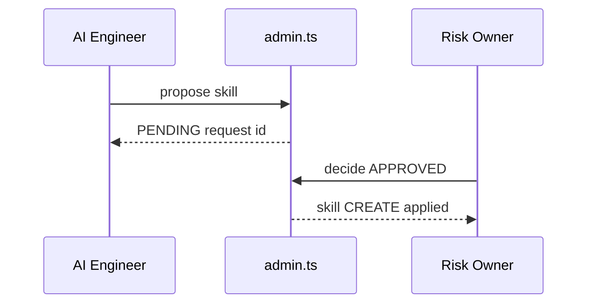

### 8.12 Related pages
| Page | Relationship |
|---|---|
| `/admin/skills` | Runtime playbook / scenario board (post-approve view) |
| `/admin/rag` | Corpus browser; create/update should prefer AI Admin CR path for governed changes |
| `/admin/ai-analyses` | Consumes skills/RAG/params governed here |
| `/admin/interventions` | Human gates for **runtime** actions (not config CRs) |
| `/admin/roles` | Defines permissions listed in §8.3 |

### 8.13 Future enhancements (not yet required)
- Diff UI for `before_json` vs `payload_json`
- Mandatory dual approval for CRITICAL severity param changes
- Webhook notify Lark `oc_ai_detection_lab` on PENDING CR
- Export CR pack for compliance

---

## 9. Independent Second-AI Challenger

### 9.1 Purpose
For alert severities at or above `ai.second_opinion_severity` (default **BREACH**), the platform runs an independent challenger model (`crmp-challenger-v0`) after the primary skill/RAG RCA. The challenger **must not** reuse the primary decision path (separate heuristics / future separate vendor).

**Code:** `platform/src/lib/ai/challenger.ts` · wired from `analyze.ts` after skill/RAG persist.

### 9.2 Trigger
| Setting | Default | Behaviour |
|---|---|---|
| `ai.second_opinion_severity` | `BREACH` | Run when alert severity rank ≥ setting (`WARN` &lt; `BREACH` &lt; `CRITICAL`) |

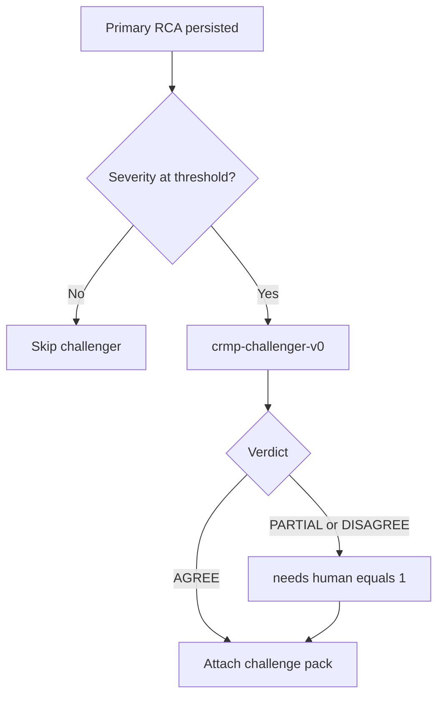


### 9.3 Outputs
| Field | Description |
|---|---|
| `verdict` | `AGREE` / `PARTIAL` / `DISAGREE` |
| `critiques` | Material gaps in primary narrative |
| `improvements` | Prioritised recommendations (`HYPOTHESIS` / `EVIDENCE` / `ACTION` / …) |
| `alternatives` | Competing hypotheses with confidence |

### 9.4 Persistence & side-effects
- Table `ai_analysis_challenges` (1:1 with `ai_analyses`)
- Evidence row type `CHALLENGER`
- Columns `ai_analyses.challenged`, `challenge_verdict`
- `PARTIAL` / `DISAGREE` forces `needs_human = 1`
- Spine stage `AI_RCA` event + audit `AI_SECOND_OPINION`
- Lazy backfill via `getAnalysisBundle` / `POST /api/ai` action `backfill_challenges`

### 9.5 UI
- List badges: `2nd AI · {verdict}`
- Detail panel: `AiChallengePanel`
- Controls: simulate CRITICAL, backfill challenges

---

## 10. Skills & risk scenarios (summary)

Skills store rich `scenario_json`: indicator, thresholds + why, fault areas, escalation, BU corrections, past cases.  
`risk_scenario_chains` link multi-indicator timelines. See `/admin/skills`, `risk-scenarios-catalog.ts`, `risk-scenarios-extra.ts`.

---

## 11. Demo Messenger

### 11.1 Purpose
In-app Lark-style inbox for alert + AI report threads with inline operator actions. Production transport remains Lark; this module proves UX and audit semantics.

### 11.2 Stack
| Item | Path |
|---|---|
| Page | `/admin/messenger` → `app/admin/messenger/page.tsx` |
| UI | `components/DemoMessenger.tsx` (mobile master-detail) |
| API | `GET/POST /api/messenger` |
| Domain | `lib/messenger/demo.ts` |

### 11.3 Actions
| Action | Effect |
|---|---|
| `show_evidence` | Post vault + challenger summary into thread |
| `chat` | User note / challenge; disagreement flags `needs_human` |
| `escalate` | Advance escalation path step; post hand-off in the current POC window and intake in the next |
| `dismiss` | False alarm → thread DISMISSED, alert CLOSED |
| `close` | Accept AI → thread CLOSED |
| `recommend` → `confirm_action` | Double-confirm control → admin_ref (+ checker if required) |

### 11.4 Data
`messenger_threads`, `messenger_messages`, `messenger_pending_actions` (see §4.4).

### 11.5 POC windows
`getMessengerThread` returns `poc_windows` — one Lark chat per hop on the matched route (primary team → secondary → Risk Owner → Exec) with named POC from `users`/`teams`. UI: bird-eye path chips + split columns (`data-testid=msg-poc-windows`).

---

## 12. Market Intelligence

### 12.1 Purpose
Five-minute scan of news/social/official signals that can move LP prices; push formatted cards to a dedicated messenger/outbox channel; expose indicator `M2-MKT-INTEL`.

### 12.2 Key modules
- `lib/market-intel/scanner.ts`, `format.ts`, `schema.ts`, `demo-scan.ts`
- UI `/admin/market-intel`
- Settings: `market_intel.enabled`, `interval_minutes`, `lark_chat_id`

### 12.3 Public snapshot (GitHub Pages)
Pages has no Next.js API routes. `POST /api/market-intel` would return **405**. The desk therefore:
1. Detects `github.io` / `/PRD/crmp-plus` / `NEXT_PUBLIC_STATIC_EXPORT`.
2. Runs `runClientMarketIntelScan()` from the same `EVENT_TEMPLATES` as the live scanner.
3. Updates Findings, outbox, scan log and `M2-MKT-INTEL` in local state (persisted in `localStorage`).
4. Seeds three findings at SSG time so the first paint is not empty.

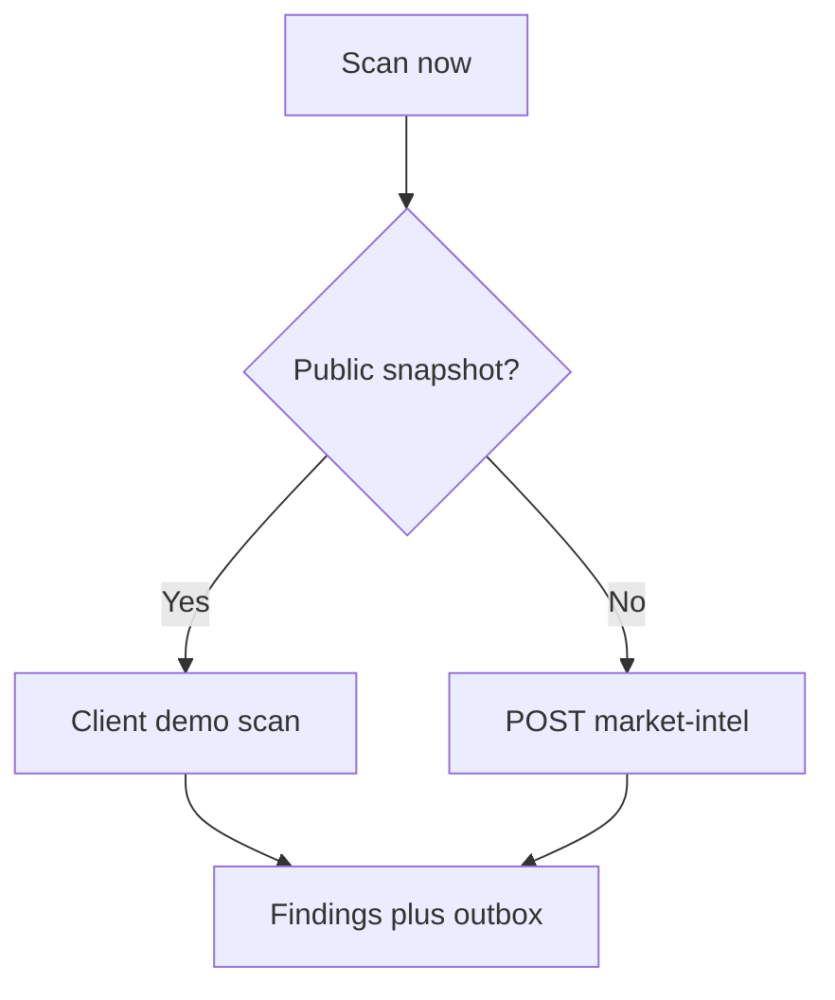

---

## 13. Docs, i18n & responsive shell

| Concern | Design |
|---|---|
| Docs | Markdown under `platform/docs/*` rendered via `lib/docs.ts` + `DocArticlePage` |
| Locales | `en` / `zh-Hant` query `?lang=` |
| UI chrome i18n | Cookie `crmp_ui_lang`; nav labels in `lib/i18n.ts` |
| Mobile | `AdminShell` drawer &lt; `lg`; messenger and CS/TR desk list→thread; dashboard/log/data card twins; `/cs` stacked tabs; safe-area CSS |

Interactive UAT board: `/admin/docs/uat` (`UatChecklistBoard` + `lib/docs/uat-cases.ts`).

---

## 14. Key API map (prototype)

Absent on GitHub Pages (static export). UI must degrade: demo session, client intel scan, local settings message.

| API | Role |
|---|---|
| `POST /api/auth/login` | Session cookie `crmp_session`; Pages falls back to `writeDemoSession` |
| `POST /api/auth/logout` | Clear cookie |
| `GET/POST /api/ai` | Analyses, simulate alarm, `backfill_challenges` |
| `GET/POST /api/ai-admin` | Propose/approve/training/feedback |
| `GET/POST /api/messenger` | Threads + inline actions |
| `GET/POST /api/cs` | CS/TR desk inbox + operator actions (`triage` / `analyze` / `followup` / `client_reply` / `reply` / `assign_tr` / `escalate_risk` / `resolve` / `poc_release` / `simulate_*`) |
| `GET/POST /api/cs/intake` | Public connector catalog + ticket status; C1/form/mailbox ingest or continue (`request_id` / `in_reply_to` / `channel_ref` / `CSR-XXXX`) |
| `GET/POST /api/lark` | Channel registry / mock notify |
| `GET/POST /api/market-intel` | Scan / findings / outbox |
| `GET/POST /api/monitor` | Primary Monitor hub API: `run_detectors`, `toggle_pause`, `update_thresholds`, `sync_monitor2`, `ack_alert`, `update_ticket` |
| `GET/POST /api/detectors` | Legacy detector CRUD / run (UI on Monitor 2.0) |
| `GET/POST /api/escalation` | Routes + dimension coefficients + ESC-DEFAULT probe |
| `GET/POST /api/roles` | Editable RBAC (`update_role`; AI actors forbidden) |
| `GET/POST /api/org` | Departments + teams; `update_team` mission / on-call |
| `POST /api/audit/rollback` | Restore before-state snapshot by `audit_id` |
| `GET/POST /api/ai-improve` | How-to-improve review chat |
| `POST /api/ai-chat` | Desk selection chatbot |
| `POST /api/dashboard` | Rebuild daily metrics |
| `GET/POST /api/rag` | List, retrieve; human write / propose_rag (AI blocked) |
| `GET/POST /api/users` | Directory + create/disable |
| `PATCH /api/settings` | Single key save |
| Interventions | Server action `decideInterventionAction` (approve/reject) |

---

## 15. Deployment (prototype)

```bash
cd platform
npm install
npm run dev   # http://localhost:3000
```

SQLite path: `platform/data/vantage_risk.db`.  
Reset: `npm run db:reset` then restart.

Demo logins: see User Guide §1 (e.g. `admin@vantagemarkets.com` / `admin123`).

---

## 16. Remaining admin modules

Modules not fully specified in §8–§13. Behaviour must match the User Guide how-to and PRD §6.4.

### 16.1 Login, session, shell, unread — §7.1

- Personas: `DEMO_PERSONAS` in `lib/demo-session.ts` (demo platform owner first).  
- Localhost: `POST /api/auth/login` sets `crmp_session` **and** writes demo session.  
- Pages / 404/405: skip API, `writeDemoSession` only.  
- `AdminShell` prefers demo session when `isPublicSnapshot()`. Sign out clears both.  
- Nav groups from `NAV_GROUPS`. Unread: `AdminShell` + `bumpNavBadge` from Market Intel, Monitor 2.0, Realtime Alert & Tracker, Messenger.

### 16.2 Admin Home

SSR counts (users, teams, sources, domains, open alerts/tickets, Lark channels, routes). Every tile is a `Link`: `StatCard` `href` (with icon + Open), owner → `/login`, messenger hero → `/admin/messenger`, jump grid, department cards to working pages (alerts / interventions / settings), recent alerts to `/admin/alerts#{alert_id}`, spine steps to monitor / alerts / escalation / AI / dashboard. `HomeDummyAlertButtons` POST `/api/ai` `dummy_spine` (single or group) walks DETECT→close; locale from `getUiLocale()` so messenger notes store zh-Hant when the UI is 繁中; stored English titles/messages still display via `phrase()`. `AlertTrackerBoard` honours the hash and `?dummy=` highlight.

### 16.3 Daily performance

`getDailyDashboard()` → CFD/crypto metric arrays + WARN/BREACH summary. `POST /api/dashboard` refresh.

### 16.4 Risk log

`getRiskLogDashboard()` aggregates: summary USD/times, `by_category`, `by_domain`, `loopholes`, chronological `records`. Read-only UI (`RiskLogDashboard`).

### 16.5 Monitor 2.0 hub (unified indicator + detector registry)

Single registry table: `monitor_indicators` LEFT JOIN `detectors` (per-indicator detector code, pause, last run). **Run all indicators** / **Sync** / **Pause** via `MonitorEngineActions` + `MonitorActions`; threshold edit via `IndicatorThresholdEditor`; **recent runs** from `detector_runs`. Legacy `tab=alerts|tickets` deep-links redirect to Realtime Alert & Tracker. `/admin/detectors` redirects here (not in left nav). Primary API: `POST /api/monitor` with `run_detectors` / `toggle_pause` / `update_thresholds` / `sync_monitor2`. Legacy `POST /api/detectors` still exists. Tables `detectors` + `detector_runs` remain in SQLite — UI lives on this page. Setting `monitor2.base_url` displayed. Open-ticket counts link to `/admin/alerts`. Mobile: `sm:hidden` card lists + `sm:block` tables.

### 16.6 Detectors URL (redirect)

Bookmarks only: `/admin/detectors` → `/admin/monitor-2`. See §16.5 for run/toggle/recent runs.

### 16.7 Realtime Alert & Tracker

`AlertTrackerBoard`: join `monitor_alerts` × indicators. Open cards only; sort CRITICAL/BREACH/WARN then time. **Grouped AI pipeline** controls + rank note; `MonitorCode` tooltips on M2-* codes. `/admin/ai-analyses` list redirects here. `ack_alert` when `monitor.operate`. Closed tickets leave this queue for Risk Log.

### 16.8 Risk domains

`risk_domains` cards: priority, product_coverage, owner_department, supporting_departments_json. Read-only.

### 16.9 AI Analyses list/detail

List merged into Realtime Alert (`AlertTrackerBoard`) with **grouped AI pipeline controls** + rank note. `MonitorCode` tooltips/links on M2-* codes. Detail: `/admin/ai-analyses/[id]` + `AiChallengePanel`. AI Admin Overview shows **first-line / second-line** cards (`ai.line1.*` / `ai.line2.*`).

### 16.10 Skills board + SKILL.md page

`SkillsScenariosBoard`: search, skills vs chains tabs, **Enter** → `/admin/skills/[code]` (`finalizeSkill` playbook: when to use/not, prechecks, steps, evidence, stop, success). Catalog: `risk-scenarios-catalog.ts` + extras + **`risk-scenarios-cs.ts`** (CS/TR 24/7 playbooks).

### 16.11 Knowledge Tree

`KnowledgeTreeBoard` client SVG (`viewBox` width 1120). Trunks: `domains` | `chains` | `rag`. Product filter ALL/CFD/Crypto. Domain nodes wrap (5-col × N). Click domain fans skills; click skill fills inspector; `router.push` playbook. **RAG documents render as leaves** with deep links to `/admin/rag?doc=…`. `MonitorCode` chips link to `/admin/monitor-2#M2-…`. Outline mode is the same graph as a nested list. CS/TR trunks: **CS_SERVICE**, **TRADING_EXEC**; linked chain `CHAIN-CS-TR-INTAKE`; RAG category `CS_POLICY`.

### 16.12 RAG corpus

`RagManager`: category filter, search, retrieve `GET /api/rag?mode=retrieve&q=&limit=6`. **Human-gate:** pages/fields AI cannot edit escalate to human — AI service actors cannot POST/PATCH; humans with `rag.manage` or AI Admin `propose_rag` maker-checker. FTS via `reindexRagFts`.

### 16.13 Spine (on Admin Home)

Dedicated Spine Log nav tab removed. Stages DETECT…DASHBOARD shown on Admin Home via `HomeSpineViz` with **stage ticket counts** (`spineStageCounts`). `/admin/spine` redirects to `/admin`.

### 16.14 Interventions

`listInterventions()`. Pending: note + Approve/Reject via `decideInterventionAction`. Samples show **actioner email**. Writes spine + audit. Distinct from AI Admin CRs.

### 16.15 Lark + escalation

`lark_channels` + `lark_cards` + `lark.*` settings (includes `oc_cs_c1`, `oc_cs_kyc`, `oc_tr_dealing`). Prototype interactive cards (`ALERT` / `ESCALATION` / `CS_ESCALATION`) post onto `/admin/lark`; Ack / Escalate / Dismiss / Close via `POST /api/lark` `card_*` call the same CRMP messenger / CS APIs (`lib/lark/cards.ts`, `lib/lark/actions.ts`). Audit `LARK_CARD_*` is the CRMP plane; `LARK_TEST_NOTIFY` stays Vantage. `escalation_routes` defined by **dimensions** (severity, involved teams, risk scenario, pending threshold, need-human) × editable **coefficients** (`coefficients_json`). No separate Path name column — route code identifies the path. Match order: exact domain+severity → domain wild → **ESC-DEFAULT**. Skills bind one route code (`skill-escalation-map.ts`); unbound → ESC-DEFAULT. CS/TR skills bind `ESC-CS-24-7` / `ESC-TR-DEAL` / `ESC-CS-RISK`. Cards route by matched `lark_chat_id`.

### 16.16 Organisation

**BU and Teams** combined hub at `/admin/departments` (`/admin/teams` redirects). Six BUs: Risk Control, Operations, AI, System, **Customer Service (CS)**, **Trading (TR)** — each with nested on-call teams (Lark chat, mission). **Roles & Permissions** editable via `/admin/roles` + `GET/POST /api/roles` (`permissions_json` chips + charters; `users.manage`; AI actors forbidden). Users (`UsersManager`) include CS Lead / CS Agent / TR Lead / TR Dealer demo personas. Seed includes `PLATFORM_OWNER` (demo platform owner / `haixiang.yan@hytechc.com`).

### 16.17 Data sources

`data_sources` registry. `DataSourcesManager` CRUD when `sources.manage`. Seed includes C1 live-chat gateway, website CS form and official support mailbox.

### 16.18 AI access blocklist

`lib/security/ai-access-blocklist.ts` → `AI_ACCESS_BLOCKLIST`, `AI_ALLOWED_CAPABILITIES`, `AI_SERVICE_ROLE_FORBIDDEN_PERMISSIONS`. Read-only board + stats.

### 16.19 Audit log

`AuditBoard` partitions `audit_logs` into two tabs via `classifyAuditPlane` (`lib/audit.ts`):

| Tab | Contents |
|---|---|
| **CRMP logs** | Changes inside this CRMP admin — alerts, AI, skills, escalation, interventions, messenger, **CS_*** |
| **Vantage Markets Admin logs** | Other admin pages — restrict user rights, pull transaction data, triggered Lark messages, BU POC risk-incident responses, settings / org / RAG |

Both tabs expose **Roll back** when `details_json` holds a before-state snapshot (`POST /api/audit/rollback` with `{ audit_id }`).

### 16.20 Platform settings

`SettingsManager` groups by key prefix: `platform.|products.`, `monitor2.`, `ai.`, `market_intel.`, `lark.`, `escalation.|detectors.`. `PATCH /api/settings`. Pages: message “stored in this browser only”.

### 16.21 Docs renderer

Markdown `platform/docs/*.md` + `*.zh-Hant.md`. Interactive boards: UAT (`UatChecklistBoard`), Roadmap (`RoadmapBoard`), Open Issues (`OpenIssuesBoard`), Progress (`ProgressTrackerBoard` — X=issues, Y=2026-10→2027-12; CS/TR catalogue v1.6 on the same 20 columns, not extra bars). URL catalog: `UrlCatalogBoard` + `lib/docs/urls.ts` (`PLATFORM_URLS` category **CS / TR** = `/cs`, desk, dashboard, log, five SKILL.md, six RAG leaves, GET/POST `/api/cs/intake`, `cs_*` tables; filter; `PUBLIC_*` = CRMP Plus `/PRD/crmp-plus/` including `PUBLIC_CS_PORTAL_URL` `/cs/`, `PUBLIC_CS_DASHBOARD_URL`, `PUBLIC_CS_LOG_URL`; `ORIGINAL_CRMP_*` = frozen `/PRD/crmp-admin/`). See **§17.9**.

---

## 17. CS / TR Desk

**Page:** `/admin/cs-desk` · `CsTrDesk` · permissions `cs.read` (view) / `cs.operate` (act). Guest/static snapshot is readable via `lark.read`.

### 17.1 Purpose
Customer Service is the **24/7** frontline for live **C1** chat (platform live chat), the website **submission form**, and **official support mailboxes**. Trading (TR) takes CS-routed execution complaints (orders, fills, slippage, stop-out, MT4/MT5). CS does not arm trading controls; TR does not staff C1 around the clock.

### 17.2 Intake API
Realtime connectors share one webhook:

| Channel | `channel` code | Typical actor |
|---|---|---|
| C1 live chat | `C1_LIVE_CHAT` | C1 webhook |
| Website / app form | `WEB_FORM` | form post |
| Official email | `OFFICIAL_EMAIL` | mailbox gateway |

`POST /api/cs/intake` accepts session (`cs.operate`), `mock_webhook: true`, `portal: true`, or header `x-cs-intake-token: demo-c1`. Body: `client_name` / `from_name`, `client_email` / `from_email`, `client_uid`, `subject`, `body` / `text` / `message`. C1 may send `c1_id` / `channel_ref`; the mailbox gateway may send `in_reply_to` or `CSR-XXXX` in the subject. **GET** `/api/cs/intake` returns the connector catalog; `?request_id=CSR-XXXX` returns public status (no PII). Desk actions: `POST /api/cs` (`triage`, `analyze`, `followup`, `client_reply`, `reply`, `assign_tr`, `escalate_risk`, `resolve`, `poc_release`, `simulate_c1|form|email`).

Inbound payloads **continue** an open ticket when they match, in order: `request_id`, `in_reply_to` (message id / channel_ref / CSR-XXXX), the same `channel_ref` on a live C1/form/mailbox thread, or `CSR-[0-9A-F]{6}` in the subject. A match that still has a WAITING follow-up is treated as the client reply — it closes the wait loop and re-triages instead of opening a duplicate.

Public client UI: `/cs` (`CsClientPortal`) — tabs for C1 live chat, submission form and official email, all posting to the same webhook. Permanent URL `PUBLIC_CS_PORTAL_URL`.

Tables: `cs_channels`, `cs_requests`, `cs_messages`, `cs_followups`. Audit actions `CS_*` land on the **CRMP** plane (`entity_type=cs_request`).

### 17.3 AI triage and follow-up loop
`triageText` is heuristic (prototype — no live LLM on this path):

- **need_id** — KYC / passport / verify-account / 核身 keywords, or cannot-login. Status `ID_VERIFY`.
- **unclear** — blob shorter than 48 chars or “help me / ??? / 不清楚”. Status `AWAITING_CLIENT`.
- **trading** — order / fill / slippage / MT4 / MT5 / 成交. Desk `TR`, status `ASSIGNED_TR`.
- **complaint** vs **question** otherwise. Book-risk complaints can `escalate_risk` onto Demo Messenger / Human Intervention (`ESCALATED_RISK`).

When clarity is `unclear` or `need_id`, AI **sends an automatic email** (`EMAIL_OUT` + `cs_followups.status=WAITING`) and **waits until the client replies** (`EMAIL_IN` / C1 `CLIENT` / form `FORM` via the same intake API → re-triage). Resolve is **blocked** while a follow-up is WAITING. Loop cap **3** mails, then CS Lead follows up in person.

### 17.4 Dedicated SKILL.md playbooks + Knowledge Tree
Triage is not only a heuristic. Each request stamps `cs_requests.skill_code` to a dedicated playbook (`platform/src/lib/ai/risk-scenarios-cs.ts`):

| Skill | When | Desk / status |
|---|---|---|
| `SKILL-CS-CLARIFY` | Thin / “help me ???” | CS · `AWAITING_CLIENT` |
| `SKILL-CS-ID-VERIFY` | KYC / passport / cannot-login | CS · `ID_VERIFY` |
| `SKILL-CS-ACCOUNT-FAQ` | Clear swap / hours / UID | CS · `OPEN` |
| `SKILL-TR-EXECUTION` | Fill / slippage / MT4/MT5 | TR · `ASSIGNED_TR` |
| `SKILL-CS-ESCALATE-RISK` | Book-risk / fraud / wallet | `ESCALATED_RISK` |

Each skill has when-to-use / when-not / prechecks / evidence / stop / success, Traditional Chinese overlays (`skill-zh.ts`), one escalation route (`ESC-CS-24-7` / `ESC-TR-DEAL` / `ESC-CS-RISK`), and explicit RAG leaves (`SKILL_RAG_DOCS`). Knowledge Tree domains **CS_SERVICE** and **TRADING_EXEC** fan out these skills; linked timeline `CHAIN-CS-TR-INTAKE`. Corpus keys: `cs-24-7-intake`, `cs-id-verify-policy`, `cs-swap-faq`, `tr-dealing-handoff`, `cs-escalate-to-risk`, `cs-skill-playbooks`. Queue monitors `M2-CS-UNCLEAR`, `M2-CS-ID`, `M2-CS-FAQ`, `M2-TR-EXEC`, `M2-CS-ESC`. The CS desk chip **Enter**s `/admin/skills/{code}`.

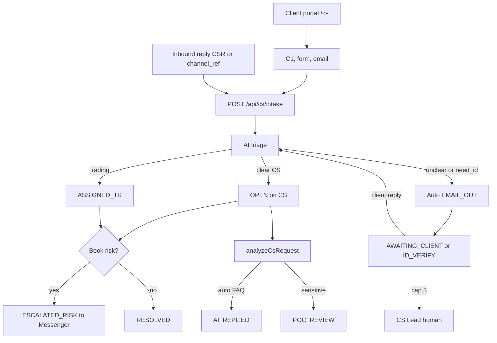

Seeded demo cases: clear C1 swap question, unclear C1 “help me ???”, TR slippage form, ID-verify official email.

### 17.5 Schema

`ensureCsSchema` (`lib/cs/desk.ts`) creates:

| Table | Key columns | Role |
|---|---|---|
| `cs_channels` | `code` unique, `kind`, `endpoint`, `enabled` | Seeded C1 / form / mailbox connectors |
| `cs_requests` | `request_id` CSR-XXXX unique, `channel`, `channel_ref`, `desk`, `status`, `ai_clarity`, `followup_count`, `skill_code`, `severity`, `sensitivity`, `ai_solution`, `ai_draft`, `poc_role`, `poc_name` | Client tickets |
| `cs_messages` | `msg_id`, `kind` (CLIENT / FORM / EMAIL_IN / EMAIL_OUT / AI / CS / TR / SYSTEM), `sender`, `body` | Transcript |
| `cs_followups` | `email_to`, `subject`, `reason`, `status` WAITING\|CLOSED, `sent_at`, `replied_at` | Auto-email wait loop |

Public `GET /api/cs/intake?request_id=` returns `request_id`, `status`, `ai_clarity`, `skill_code`, `channel`, `channel_ref` — **no** client name/email/body. There is **no** ID-image column.

### 17.6 Module map

| Path | Responsibility |
|---|---|
| `lib/cs/intake.ts` | `parseIntakePayload`, `inferIntakeChannel`, `ingestOrContinue`, `intakeConnectorCatalog`, `lookupPublicCsStatus` |
| `lib/cs/desk.ts` | Schema, `findCsRequestMatch`, `ingestCsRequest`, `continueCsRequest`, `recordClientReply`, `applyTriage`, `applyCsAnalysis`, `releasePocDraft`, `sendFollowupEmail` |
| `lib/cs/analyze.ts` | `analyzeCsRequest`, `scoreSeverity`, `scoreSensitivity`, `isCollectedReply` — heuristic, no live LLM |
| `lib/cs/skills.ts` | Heuristic → `SKILL-CS-*` / `SKILL-TR-*` |
| `lib/ai/risk-scenarios-cs.ts` | Five playbooks + `CHAIN-CS-TR-INTAKE` |
| `lib/cs/analytics.ts` | `getCsDashboard`, `getCsLog` |
| `lib/cs/ops-data.ts` | `getCsOpsContract`, `getCsFollowupCap`, `getCsIntakeToken` |
| `lib/cs/params.ts` | Seed catalog: teams, POCs, Lark, sources, `cs.*` keys, hops |
| `app/api/cs/intake/route.ts` | GET catalog/status · POST ingest |
| `app/api/cs/route.ts` | Desk operator actions + `GET ?view=dashboard\|log\|data` |
| `app/cs/page.tsx` + `CsClientPortal` | Public three-tab portal |
| `components/CsTrDesk.tsx` | Operator inbox |
| `components/CsDashboardView.tsx` | CS/TR KPIs |
| `components/CsLogView.tsx` | CS_* timeline + resolved packs |
| `components/CsOpsDataView.tsx` | BU / team / hop / parameter contract |
| `lib/docs/urls.ts` + `UrlCatalogBoard` | CS / TR catalog section |

Auth for POST intake: session `cs.operate`, `mock_webhook: true`, `portal: true`, or header `x-cs-intake-token: demo-c1`.

### 17.7 Wait-loop state

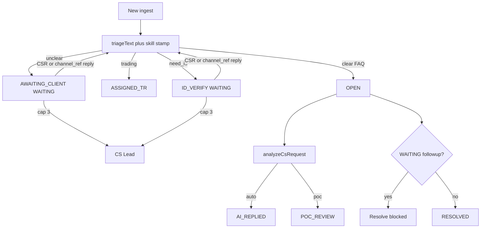

Match order for continuation: `request_id` → `in_reply_to` → live `channel_ref` → `CSR-[0-9A-F]{6}` in subject.

### 17.8 Public `/cs` portal

`CsClientPortal` tabs: Live chat (`C1_LIVE_CHAT`), Submission form (`WEB_FORM`), Official email (`OFFICIAL_EMAIL`). Each POST sets `portal: true` and persists `channel_ref` in the browser so the next message continues the same `CSR-XXXX`. Status badges poll `GET /api/cs/intake?request_id=`. Permanent Pages URL: `https://hxyan2020.github.io/PRD/crmp-plus/cs/`.

### 17.9 URL Catalog (technical)

`PLATFORM_URLS` category **CS / TR** lists `/cs`, `/admin/cs-desk`, `/admin/cs-dashboard`, `/admin/cs-log`, `/admin/cs-data`, five `/admin/skills/SKILL-CS-*` / `SKILL-TR-*` paths, six `/admin/rag?doc=cs-*` leaves, `/api/cs`, `/api/cs?view=dashboard`, `/api/cs?view=log`, `/api/cs?view=data`, `/api/cs/intake`, `/api/cs/intake?request_id=`, and `tables:cs_*`. Board: filter, `#url-cat-cs-tr` jump, bilingual `phrase()` titles. Guard: `scripts/verify-url-catalog.ts`.

### 17.10 Traceability

| Product | Spec |
|---|---|
| PRD | G13, FR-37, FR-40, FR-41, FR-42, FR-43, FR-44, FR-45, FR-46, journeys 5.7–5.10, §6.5 |
| User Guide | §9.3 portal / connectors / wait loop / daily roles / dashboard / log / data / analyze |
| AI Use Manual | CRMP-AIU-001 `/admin/docs/ai-use` literacy for Risk + CS/TR (LLM, skill, agent, MCP, named function + gateway DB path, detect/correct/prevent) |
| UAT | UAT catalogue v2.7: UAT-25 catalog; UAT-46 connectors; UAT-47 wait loop; UAT-48 TR/Risk; UAT-50 skills + tree; UAT-51 dashboard + log; UAT-52 supporting data; UAT-53 analyze / POC; support UAT-17/22/27–29/36–40; sign-off UAT-49 |

### 17.11 Dedicated dashboard + log

**Pages:** `/admin/cs-dashboard` (`CsDashboardView`) and `/admin/cs-log` (`CsLogView`). Permissions `cs.read` / `lark.read` (same as desk view). Guest/static snapshot readable.

These surfaces are **not** Daily Performance (`/admin/dashboard`, CFD/crypto day-end) and **not** Risk Log Analytics (`/admin/risk-log`, closed Monitor tracker packs). Mixing them is a product defect.

| Surface | Source | Functions |
|---|---|---|
| Dashboard | `getCsDashboard()` in `lib/cs/analytics.ts` from `cs_requests` + WAITING `cs_followups` | Totals, open/resolved, WAITING, cap-3 (`followup_count ≥ 3`), TR / Risk, POC review, AI replied, buckets by channel / status / skill / desk / clarity / **severity**, waiting list, recent rows |
| Log | `getCsLog()` from `audit_logs` (`entity_type=cs_request` or `CS_*`) plus resolved request packs | Timeline of `CS_INTAKE`, `CS_INTAKE_CONTINUE`, `CS_FOLLOWUP_EMAIL`, `CS_CLIENT_REPLY`, `CS_AGENT_REPLY`, `CS_AI_ANALYZE`, `CS_AI_REPLY`, `CS_POC_REVIEW`, `CS_POC_RELEASE`, `CS_ASSIGN_TR`, `CS_ESCALATE_RISK`, `CS_RESOLVE`; filter; resolved packs |

`GET /api/cs?view=dashboard` and `GET /api/cs?view=log` return the same payloads. Nav badges: dashboard uses open CS tickets; log uses CS_* audit count. Guard: `scripts/verify-cs-analytics.ts`.

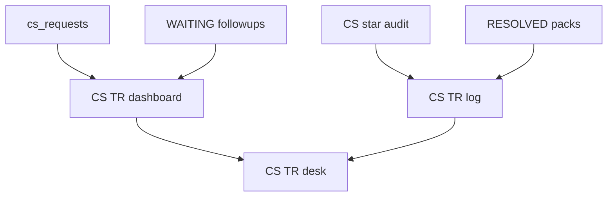

### 17.12 Supporting data (BU / team / hops / parameters)

**Page:** `/admin/cs-data` (`CsOpsDataView`). **API:** `GET /api/cs?view=data`. Source: `getCsOpsContract()` in `lib/cs/ops-data.ts` over seed catalog `lib/cs/params.ts`.

`ensureCsOrg` (in `db.ts`) upserts:

| Kind | Records |
|---|---|
| BUs | `CUSTOMER_SERVICE`, `TRADING` |
| Teams | CS 24/7 Desk (`oc_cs_c1`), **CS KYC Vault** (`oc_cs_kyc`), TR Dealing Support (`oc_tr_dealing`) |
| POCs | Maya Santos CS_LEAD, Elena Rossi CS_AGENT, Nadia Okonkwo CS_AGENT (KYC), Kenji Watanabe TR_LEAD, Omar Haddad TR_DEALER |
| Routes | `ESC-CS-24-7`, **`ESC-CS-KYC`**, `ESC-TR-DEAL`, `ESC-CS-RISK` with hops + SLA |
| Settings | `cs.followup_cap`, `cs.auto_reply_max_severity`, `cs.sensitive_categories`, `cs.wait_sla_minutes`, `cs.id_verify_sla_minutes`, `cs.tr_sla_minutes`, `cs.risk_sla_minutes`, `cs.intake_token`, `cs.mailbox_support`, `cs.mailbox_complaints`, `cs.lark_cs` / `_kyc` / `_tr` |
| Sources | C1 gateway, website form, official mailbox, support@, complaints@, CS KYC Vault (flags only), MT4/MT5 dealing tape |

Desk `sendFollowupEmail` reads `getCsFollowupCap()`. Intake header matches `getCsIntakeToken()`. `cs_requests.assigned_bu` stamps CUSTOMER_SERVICE / TRADING / RISK_CONTROL. Platform Settings group **CS / TR operations**. Guard: `scripts/verify-cs-data.ts`.

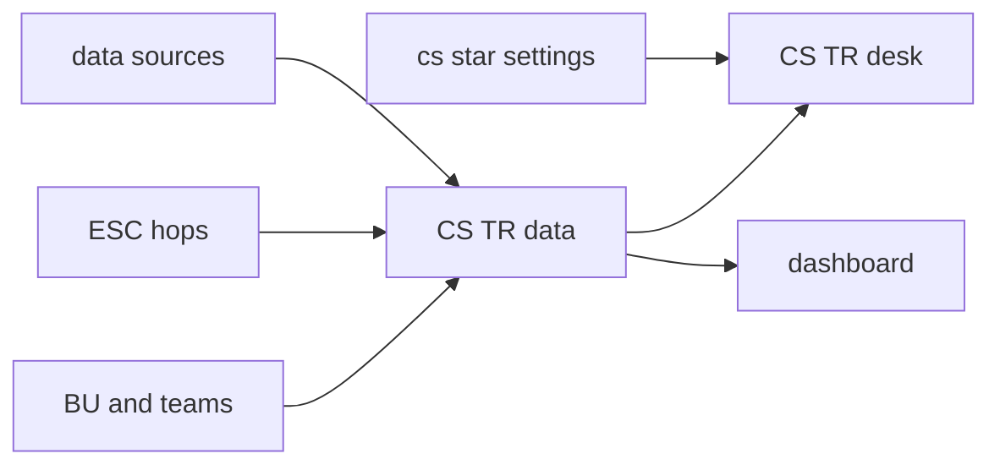

### 17.13 Analyze after collected (categorize / severity / auto vs POC)

**Code:** `lib/cs/analyze.ts` (`analyzeCsRequest`, `scoreSeverity`, `scoreSensitivity`, `isCollectedReply`) plus `applyCsAnalysis` / `releasePocDraft` in `lib/cs/desk.ts`. **API:** `POST /api/cs` actions `analyze` and `poc_release`. Prototype heuristic — **no live LLM** on this path (same as `triageText`). Guard: `scripts/verify-cs-analyze.ts`.

`applyTriage` only calls analysis when facts are **collected**: clarity `clear`, or a wait-loop reply ≥48 characters that names a UID (`isCollectedReply`). Thin tickets stay `AWAITING_CLIENT` / `ID_VERIFY`. KYC keywords on a long UID reply no longer re-open need-ID forever.

| Output | Values |
|---|---|
| `severity` | `LOW` / `MEDIUM` / `HIGH` / `CRITICAL` |
| `sensitivity` | `auto` or `poc` |
| `ai_solution` / `ai_draft` | Heuristic copy from category + skill (FAQ / KYC / complaint / trading / critical) |
| `poc_role` / `poc_name` | From `CS_POC_SPECS` when sensitivity is `poc` |

Gates: `cs.auto_reply_max_severity` (default `MEDIUM`) and `cs.sensitive_categories` (default `complaint,kyc,trading`). Skills `SKILL-CS-ID-VERIFY`, `SKILL-TR-EXECUTION`, `SKILL-CS-ESCALATE-RISK` always `poc` (or escalate).

| Path | CS status | Client mail |
|---|---|---|
| FAQ, severity ≤ auto-max | `AI_REPLIED` | `EMAIL_OUT` immediately (`CS_AI_REPLY`) |
| KYC / complaint | `POC_REVIEW` | Hold; POC addendum then `poc_release` (`CS_POC_RELEASE`) |
| Trading | stays `ASSIGNED_TR` | Hold for TR Dealer addendum |
| CRITICAL / book-risk | `ESCALATED_RISK` | No client auto-mail |

Audit: `CS_AI_ANALYZE`, `CS_AI_REPLY`, `CS_POC_REVIEW`, `CS_POC_RELEASE`. Dashboard buckets `poc_review`, `ai_replied`, `by_severity`.

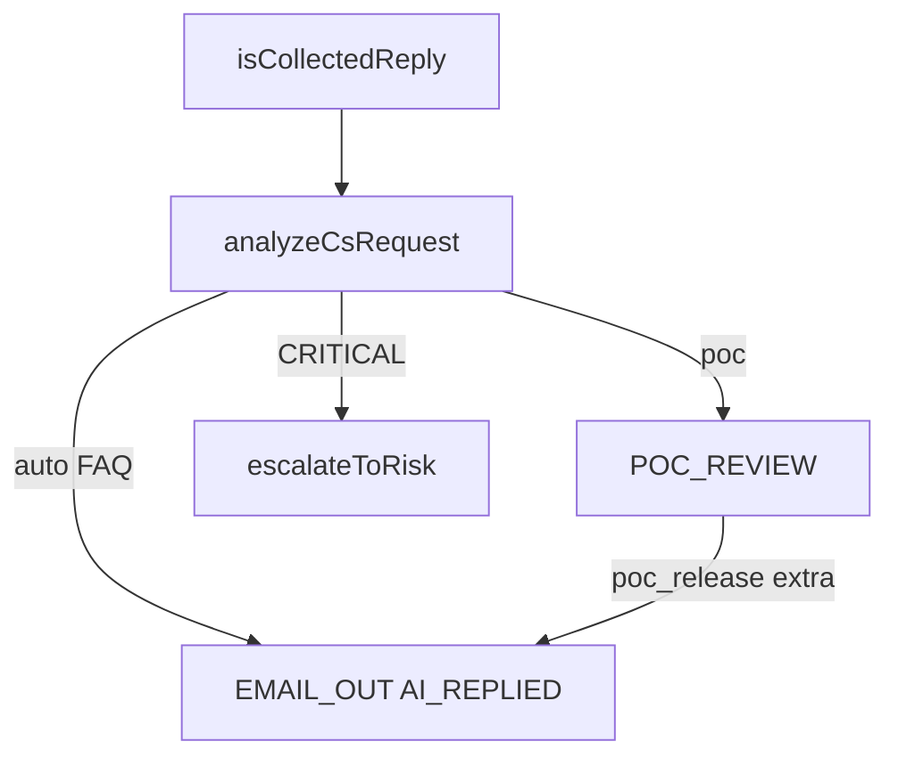

---

## 18. Document control

| Ver | Date | Notes |
|---|---|---|
| 1.0 | 2026-10-01 | Initial TSD skeleton |
| 1.1 | 2026-10-01 | Full §8 AI Admin Management Page specification |
| 1.2 | 2026-10-01 | §9 Challenger, §11 Messenger, §12 Market Intel, docs/i18n/mobile, renumber |
| 1.3 | 2026-10-04 | Public snapshot demo scan, grouped nav, demo platform owner, Pages login |
| 1.5 | 2026-10-04 | SVG flowcharts and sequence diagrams in TSD + mermaid renderer |
| 1.6 | 2026-10-05 | Home spine; BU and Teams; MonitorCode; propose_rag; ESC-DEFAULT; Open Issues / Progress |
| 1.7 | 2026-10-05 | Audit plane split (CRMP / Vantage Markets Admin) + rollback API; editable roles; escalation dimensions × coefficients |
| 1.8 | 2026-10-05 | Monitor hub API (`run_detectors`/`toggle_pause`/`update_thresholds`); Realtime Alert & Tracker surface labels; Key API map adds roles/org/rollback/escalation/ai-chat |
| 1.9 | 2026-10-06 | §17 CS/TR Desk: C1/form/email intake, AI follow-up until client reply (cap 3), TR routing, escalate to Risk |
| 2.0 | 2026-10-06 | CRMP Plus coherent platform; public `basePath` `/PRD/crmp-plus/`; original CRMP Admin frozen at `/PRD/crmp-admin/` |
| 2.1 | 2026-10-06 | §17.4 dedicated CS/TR SKILL.md playbooks; Knowledge Tree CS_SERVICE / TRADING_EXEC; RAG cs-* leaves; UAT-50 |
| 2.2 | 2026-10-06 | §17.2 public `/cs` portal + inbound reply matching (CSR-XXXX / channel_ref / In-Reply-To); GET intake catalog; FR-40 |
| 2.3 | 2026-10-06 | §17.5–17.10 schema, module map, wait-loop state, `/cs` portal, URL catalog, PRD FR-37…43 traceability |
| 2.4 | 2026-10-06 | §17.11 dedicated CS/TR dashboard + log; FR-44; UAT-51 |
| 2.5 | 2026-10-06 | §17.12 CS/TR supporting data (BU/KYC vault/hops/`cs.*`); FR-45; UAT-52 |
| 2.6 | 2026-10-06 | §17.13 analyze after collected (categorize / severity / auto vs POC); FR-46; UAT-53 |
| 2.7 | 2026-10-07 | §13 mobile: CS/TR desk list→thread + dashboard/log/data card twins; FR-14; UAT-18 |

**Owner:** demo platform owner (`haixiang.yan@hytechc.com`)  
**Companion:** [繁體中文版 TSD](./TSD.zh-Hant.md) · rendered at `/admin/docs/tsd`
