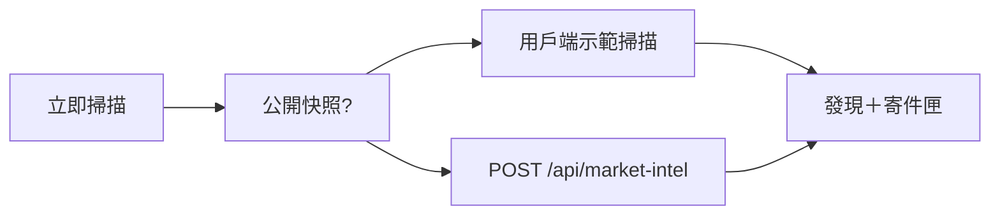

# Vantage CRMP — 技術規格設計（TSD）

**文件編號：** CRMP-TSD-001  
**版本：** 1.4  
**狀態：** 原型／持續更新  
**產品範圍：** CFD + 加密貨幣交易所  
**主要技術棧：** Next.js 15（App Router）、React 19、SQLite（`better-sqlite3`）、RBAC Session 驗證  
**負責人：** YAN Haixiang  
**相關文件：** [PRD](/admin/docs/prd) · [使用手冊](/admin/docs/user-guide) · [UAT](/admin/docs/uat)

本 TSD 描述中央風險管理平台（CRMP）管理控制平面之技術設計。  
**§8 AI Admin** 與 **§9 第二 AI 挑戰者**為一級模組規格。

---

## 1. 目的與範圍

### 1.1 目的
提供單一管理控制平面，讓風險、營運、AI、系統人員可以：
- 監看 Monitor 2.0 指標／警報
- 執行 AI 根因分析（Skills + RAG），並於高嚴重度執行獨立第二 AI 挑戰
- 於 Demo Messenger 分流（證據、聊天、升級、排除、結案、控制）
- 對高影響動作強制人工關卡
- 以 Maker/Checker 治理 AI 設定
- 檢視 Spine、風險分析、市場情報與每日績效

### 1.2 原型範圍內
- 管理 UI + SQLite 持久化
- Detectors → Alarm → AI RCA → 第二意見 → Messenger／Intervention → Spine → Dashboard
- AI Admin 治理（參數、Skills、RAG、訓練、準確率）
- 風險情境劇本與多指標時間鏈
- Demo Messenger + Lark 頻道登錄（模擬 Webhook）
- 市場情報 5 分鐘掃描與 outbox
- 雙語文件（英／繁中）與響應式管理殼層

### 1.3 原型範圍外（正式接線）
- 正式 SSO／IdP
- 真實 Lark 互動卡片／oneZero／錢包寫入適配
- 正式 LLM 計費與訓練叢集

---

## 2. 系統脈絡

```
Monitor 2.0 / Detectors ──► 警報 ──► AI RCA（Skills | RAG）
                                      │
                                      ▼
                           第二 AI 挑戰者（≥ BREACH）
                                      │
                                      ▼
                 Demo Messenger ◄──► 人工介入（Human Intervention）
                                      │
                                      ▼
                           Spine 日誌 + Risk Log + 每日儀表板
                                      │
                                      ▼
                      Lark 頻道／市場情報 outbox（模擬）
```

**AI Admin** 位於執行期 Spine 旁側：不直接執行交易動作；在雙人管控下治理模型、劇本、RAG 語料與 AI 參數。

---

## 3. 架構總覽

| 層級 | 職責 | 主要路徑 |
|---|---|---|
| UI（App Router） | RBAC 控管管理頁 | `platform/src/app/admin/**` |
| 前端主控台 | 互動分頁／表單 | `platform/src/components/*` |
| API | JSON 讀寫 | `platform/src/app/api/**` |
| 領域邏輯 | 業務規則 | `platform/src/lib/ai/*`、`lib/db.ts`、`lib/auth.ts` |
| 持久化 | SQLite 檔 | `platform/data/vantage_risk.db` |

### 3.1 執行期 Spine 階段
1. **Detectors** 採樣指標（`/admin/detectors`）
2. **Alarm** 建立 Monitor 警報／工單
3. **AI RCA** 匹配 Skill 或 RAG 推論（`/admin/ai-analyses`）
4. **第二 AI 挑戰者** 於嚴重度達門檻時執行（`crmp-challenger-v0`）
5. **Demo Messenger／人工介入** 分流與關卡控制
6. **Spine 日誌** 記錄階段轉換（`/admin/spine`）
7. **每日績效／Risk Log／市場情報** 彙總結果

---

## 4. 資料模型（核心）

### 4.1 身分與 RBAC
- `users`、`roles`（權限 JSON）、`departments`、`teams`、`sessions`
- 權限為字串代碼；`SUPER_ADMIN` 擁有 `*`

### 4.2 監控
- `monitor_indicators`、`monitor_alerts`、`monitor_tickets`
- `risk_domains`、`escalation_routes`、`lark_channels`

### 4.3 AI 執行期
- `ai_skills`（含 `scenario_json`）、`risk_scenario_chains`
- `rag_documents`（含 FTS）
- `ai_analyses`（含 `challenged`、`challenge_verdict`）、`ai_analysis_evidence`、`ai_skill_runs`
- `ai_analysis_challenges`（第二意見）
- `interventions`、Spine 相關表

### 4.4 Messenger
- `messenger_threads`、`messenger_messages`、`messenger_pending_actions`

### 4.5 市場情報
- `market_intel_*` 掃描／發現／outbox 表（見 `lib/market-intel/schema.ts`）

### 4.6 AI Admin 治理
見 **§8.4** — `ai_change_requests`、`ai_training_runs`、`ai_feedback`、`ai_accuracy_snapshots`，以及 `platform_settings` 中的 AI 鍵值。

---

## 5. 安全與 RBAC（摘要）

| 議題 | 規則 |
|---|---|
| 頁面存取 | `getCurrentUser()` + `hasPermission(role, code)` |
| Maker ≠ Checker | 當 `ai.maker_checker_required=true` 時，提案者不可核准自己的變更單 |
| AI Admin 變更 | 僅能經 `/api/ai-admin` 且具備 propose／approve 權限 |
| 稽核 | 提案、裁決、回饋、訓練排隊皆 `writeAudit` |
| **AI 存取封鎖清單** | AI 不得觸及之頁面／功能／欄位／資料 — 見 `/admin/security/ai-access` 與 `lib/security/ai-access-blocklist.ts` |

AI Admin 權限矩陣詳見 **§8.3**。  
**僅限人工操作之表面（身分、密鑰、雙人核准、LP／錢包執行、角色寫入）：** 動態清單見 **`/admin/security/ai-access`**。

---

## 6. 整合點

| 系統 | 原型模式 | 說明 |
|---|---|---|
| Monitor 2.0 | 鏡像表 + 同步／模擬警報 | 指標／警報／工單 |
| Demo Messenger | 站內執行緒 + `/api/messenger` | 證據、升級、控制 |
| Lark | 頻道登錄 + 模擬 Webhook／情報 outbox | 依嚴重度路由 |
| 市場情報來源 | 啟發式 5 分鐘掃描 | 卡片格式 i–vi |
| LP／Bridge／錢包 | 建議動作 + 管理深連結 | 真實適配前需人工關卡 |
| 模型訓練 | 排隊執行 + 種子指標 | 原型無 GPU 叢集 |

---

## 7. 管理介面地圖

路由真實來源：`platform/src/lib/nav.ts` 的 `NAV_ITEMS`＋`NAV_GROUPS`。每一列都在本 TSD（本節＋§8–§16）有規格，使用手冊有操作說明。

### 7.1 殼層（不是導覽列）

| 介面 | 路由／儲存 | 模組 | 權限 |
|---|---|---|---|
| 登入 | `/login` | `app/login/page.tsx`、`lib/demo-session.ts` | 公開 |
| 語言 | cookie `crmp_ui_lang` | `hooks/useUiLocale`、`lib/i18n.ts` | — |
| 未讀徽章 | `crmp_nav_seen_v1`／`crmp_nav_extra_v1` | `AdminShell`、`lib/nav-badges.ts` | — |
| 示範工作階段 | `crmp_demo_session_v1` | Pages 上保持具名角色 | — |
| 手機抽屜 | `< lg` | `AdminShell` 漢堡 | — |
| 品牌 | Vantage 標誌＋負責人列 | `VantageLogo`、`lib/platform-owner.ts` | — |

未讀公式：`max(0, mergeNavTotals(server) + extra − seen)`。打開 href 寫入 seen。`bumpNavBadge(href)` 增加 extra。Pages 在 SQLite 計數為空時用 `FALLBACK_NAV_TOTALS`。

### 7.2 頁面

| 分組 | URL | UI／API | 權限 | 規格 |
|---|---|---|---|---|
| 總覽 | `/admin` | `app/admin/page.tsx` | `admin.access` | §16.2 |
| 監控 | `/admin/dashboard` | `DailyDashboardView`、`GET/POST /api/dashboard` | `dashboard.read` | §16.3 |
| 監控 | `/admin/risk-log` | `RiskLogDashboard`、`lib/ai/risk-log.ts` | `monitor.read` \| `audit.read` \| `dashboard.read` | §16.4 |
| 監控 | `/admin/market-intel` | `MarketIntelBoard` | `monitor.read` | **§12** |
| 監控 | `/admin/monitor-2` | 分頁＋`MonitorActions`、`/api/monitor` | `monitor.read`／`monitor.operate` | §16.5 |
| 監控 | `/admin/detectors` | `DetectorsBoard`、`/api/detectors` | `detectors.read` | §16.6 |
| 監控 | `/admin/alerts` | `AlertsBoard` | `monitor.read`／`monitor.operate` | §16.7 |
| 監控 | `/admin/risk-domains` | 領域卡 | `monitor.read` | §16.8 |
| AI | `/admin/ai-analyses` | `AiAnalysesBoard`、`/api/ai` | `ai.read`／`ai.operate` | §9＋§16.9 |
| AI | **`/admin/ai-admin`** | `AiAdminConsole`、`/api/ai-admin` | `ai.admin` | **§8** |
| AI | `/admin/skills` · `/admin/skills/[code]` | `SkillsScenariosBoard` | `skills.read` | §10＋§16.10 |
| AI | `/admin/knowledge-tree` | `KnowledgeTreeBoard` | `rag.read` | §16.11 |
| AI | `/admin/rag` | `RagManager`、`/api/rag` | `rag.read`／`rag.manage` | §16.12 |
| AI | `/admin/spine` | `listSpineEvents` | `spine.read` | §16.13 |
| 應變 | `/admin/interventions` | `InterventionsBoard` | `intervene.operate` | §16.14 |
| 應變 | **`/admin/messenger`** | `DemoMessenger`、`/api/messenger` | `lark.read` | **§11** |
| 應變 | `/admin/lark` | `LarkManager`、`/api/lark` | `lark.read`／`lark.manage` | §16.15 |
| 應變 | `/admin/escalation` | `EscalationManager` | `escalation.read`／`.manage` | §16.15 |
| 組織 | `/admin/departments` | 部門卡 | `teams.read` | §16.16 |
| 組織 | `/admin/teams` | 團隊表 | `teams.read` | §16.16 |
| 組織 | `/admin/roles` | 權限晶片 | `users.read` | §16.16 |
| 組織 | `/admin/users` | `UsersManager`、`/api/users` | `users.read`／`users.manage` | §16.16 |
| 平台 | `/admin/data-sources` | `DataSourcesManager` | `sources.read`／`.manage` | §16.17 |
| 平台 | `/admin/security/ai-access` | `AiAccessSecurityBoard` | `audit.read` \| `settings.manage` \| `users.read` \| `ai.admin` | §5＋§16.18 |
| 平台 | `/admin/audit` | `audit_logs` 最近 200 | `audit.read` | §16.19 |
| 平台 | `/admin/settings` | `SettingsManager`、`PATCH /api/settings` | `settings.manage` | §16.20 |
| 文件 | `/admin/docs/user-guide` · `/admin/docs/prd` · `/admin/docs/tsd` · `/admin/docs/uat` · `/admin/docs/ecosystem` · `/admin/docs/roadmap` · `/admin/docs/urls` | `lib/docs.ts`、`UatChecklistBoard` | `admin.access` | §13＋§16.21 |
| 驗證 | `/login` | 角色按鈕＋表單 | 公開 | §16.1 |

靜態匯出：`next.config` `output: 'export'`、`basePath: '/PRD/crmp-admin'`、`trailingSlash: true`。用戶端偵測 `isPublicSnapshot()`／`NEXT_PUBLIC_STATIC_EXPORT`，以示範後備代替 `/api`。

---

## 8. AI Admin 管理頁 — 完整規格

### 8.1 目的
`/admin/ai-admin` 為 **AI 控制平面**。操作人員用它來：
1. 監看 AI 健康 KPI 與準確率歷史
2. 提案變更 AI 參數、Skills、RAG 文件
3. 在 **Maker/Checker 雙人管控** 下核准／駁回變更
4. 排隊訓練／重新校正工作
5. 標註 RCA 品質回饋（CORRECT／INCORRECT／PARTIAL）

此頁是**治理**，不是即時 RCA 工作台（`/admin/ai-analyses`），也不是介入櫃檯（`/admin/interventions`）。

### 8.2 路由與元件

| 項目 | 規格 |
|---|---|
| 頁面路由 | `GET /admin/ai-admin` → `platform/src/app/admin/ai-admin/page.tsx` |
| UI 元件 | `AiAdminConsole`（`platform/src/components/AiAdminConsole.tsx`）客戶端主控台 |
| API | `GET/POST /api/ai-admin` → `platform/src/app/api/ai-admin/route.ts` |
| 領域邏輯 | `platform/src/lib/ai/admin.ts` |
| Schema | `platform/src/lib/ai/admin-schema.ts`（`ensureAiAdminSchema`） |
| 種子資料 | `seedAiAdminIfEmpty`（參數、訓練、準確率快照、示範變更單） |

### 8.3 存取控制

#### 8.3.1 頁面檢視（符合任一即可）
- `ai.admin`
- `skills.manage`
- `rag.manage`
- `ai.read`

未授權使用者重導向 `/admin`。

#### 8.3.2 Maker（提案）— 符合任一即可
- `ai.propose`
- `skills.manage`
- `rag.manage`
- `settings.manage`

#### 8.3.3 Checker（核准／駁回）— 符合任一即可
- `ai.approve`
- `skills.approve`
- `rag.approve`

#### 8.3.4 角色對照（原型）

| 角色 | 檢視 AI Admin | Maker | Checker | 說明 |
|---|---|---|---|---|
| `AI_ENGINEER` | 是 | 是 | 否 | 提案 Skills／RAG／參數／訓練 |
| `RISK_OWNER` | 是 | 是* | 是 | 主要 Checker；亦可提案 |
| `RISK_ANALYST` | 是 | 是 | 否 | 提案 + 回饋操作 |
| `SUPER_ADMIN` | 是 | 是 | 是 | 完整權限；啟用雙人制時仍不可自核 |
| `OPS_LEAD`／`SYSTEM_ADMIN` | 依權限 | 依 ROLE_DEFS | 依 ROLE_DEFS | 見 `db.ts` 之 `ROLE_DEFS` |
| `VIEWER` | 否（除非另授） | 否 | 否 | 其他頁唯讀 |

\* Risk Owner 同時具備提案與核准；仍不可核准自己的變更單。

#### 8.3.5 Maker ≠ Checker 規則
當 `platform_settings.ai.maker_checker_required != "false"`：
- 若 `proposed_by === decided_by`，`decideChangeRequest` 拋錯
- UI 僅應對非提案者之 Checker 顯示核准／駁回

### 8.4 資料模型

#### 8.4.1 `ai_change_requests`
| 欄位 | 型別 | 說明 |
|---|---|---|
| `id` | INTEGER PK | |
| `request_id` | TEXT UNIQUE | 如 `CR-A1B2C3D4` |
| `entity_type` | TEXT | `PARAM` \| `SKILL` \| `RAG` \| `TRAINING` |
| `action` | TEXT | `UPDATE` \| `CREATE` \| `DISABLE` \| `RETIRE` 等 |
| `title`、`summary` | TEXT | 人讀說明 |
| `payload_json` | TEXT | 變更後／建立內容 |
| `before_json` | TEXT NULL | 變更前狀態（diff） |
| `status` | TEXT | `PENDING` \| `APPROVED` \| `REJECTED` |
| `proposed_by`／`proposed_at` | FK／時間 | Maker |
| `decided_by`／`decided_at`／`decision_note` | FK／時間／TEXT | Checker |

#### 8.4.2 `ai_training_runs`
追蹤排隊／執行中／完成之重新校正：`run_id`、`model_name`、`dataset_label`、指標（`accuracy`、`precision_score`、`recall_score`、`f1_score`）、`samples`、`status`、時間戳、`created_by`。

#### 8.4.3 `ai_feedback`
每筆分析標籤：`CORRECT` \| `INCORRECT` \| `PARTIAL`，可附註記、`rated_by`。

#### 8.4.4 `ai_accuracy_snapshots`
每日彙總：Skill 匹配率、人工同意率、回饋正確率、分析總數、介入核准／駁回數。Overview 重新整理時會 upsert 當日 live 快照。

#### 8.4.5 受治理參數（`platform_settings` 鍵）
| 鍵 | 用途 | 預設（種子） |
|---|---|---|
| `ai.rca_enabled` | RCA 總開關 | `true` |
| `ai.auto_on_alarm` | 警報時自動觸發 RCA | `true` |
| `ai.skill_certainty_only` | 僅在確定匹配時自動執行 Skill | `true` |
| `ai.min_confidence` | 自動完成最低信心度 | `0.55` |
| `ai.rag_top_k` | RAG Top-K | `6` |
| `ai.second_opinion_severity` | 觸發第二意見 AI 的嚴重度 | `BREACH` |
| `ai.maker_checker_required` | 強制雙人管控 | `true` |
| `detectors.auto_raise_alarms` | 偵測器是否產生 Monitor 警報 | `true` |

僅 `ai.*` 或 `detectors.auto_raise_alarms` 可經 AI Admin PARAM 變更套用。

### 8.5 UI 規格（分頁）

| 分頁 ID | 標籤 | 功能 |
|---|---|---|
| `overview` | Overview | KPI：分析總數、Skill 匹配%、平均信心、需人工、待介入、人工同意%、回饋正確%、待決 CR；近期分析與回饋 |
| `params` | Parameters | AI 設定草稿；**Propose** 建立 PARAM CR（不立即生效） |
| `changes` | Maker / Checker | CR 清單（PENDING 優先）。Checker 核准／駁回並填註記；顯示 Maker、before/after；分頁顯示待決數 |
| `skills` | Skills | Skill 清單；表單**提案建立** Skill；核准後才套用；可連至 `/admin/skills` 情境板 |
| `rag` | RAG | 文件清單（摘要）；表單提案建立；核准後套用並重建 FTS |
| `training` | Training | 訓練執行清單與指標；表單排隊訓練（建立 TRAINING CR） |
| `history` | History & accuracy | 準確率快照表（14 日） |

頁首徽章顯示目前 `role_code`、**Maker** 與／或 **Checker** 能力。

### 8.6 API 規格

#### 8.6.1 `GET /api/ai-admin`
查詢參數：
- `tab` = `overview`（預設）\| `params` \| `changes` \| `training` \| `skills` \| `rag`
- `status`（可選，篩選變更單）

驗證：§8.3.1 檢視權限。  
預設回應含 `{ overview, params, changes, training, skills, rag, roles }`。

#### 8.6.2 `POST /api/ai-admin`
JSON `action`：

| `action` | 權限 | 效果 |
|---|---|---|
| `propose` | Maker | 通用 CR 寫入 |
| `propose_param` | Maker | PARAM UPDATE CR |
| `propose_skill` | `skills.manage` 或 `ai.propose` | SKILL CR |
| `propose_rag` | `rag.manage` 或 `ai.propose` | RAG CR |
| `decide` | Checker | `APPROVED` 套用；`REJECTED` 結案；強制 Maker≠Checker |
| `queue_training` | Maker | TRAINING CREATE CR |
| `feedback` | `ai.operate` 或 `ai.admin` | 寫入 `ai_feedback` |

錯誤：`{ error: string }`，HTTP 400／403。

### 8.7 核准後套用語意

| entity_type | action | 行為 |
|---|---|---|
| `PARAM` | `UPDATE` | 更新 `platform_settings.value` |
| `SKILL` | `CREATE` | 插入 ACTIVE `ai_skills` |
| `SKILL` | `UPDATE` | 更新欄位 |
| `SKILL` | `DISABLE` | `status='DISABLED'` |
| `RAG` | `CREATE` | 插入文件 + `reindexRagFts` |
| `RAG` | `UPDATE` | 內容／狀態更新 + 重建索引 |
| `RAG` | `RETIRE` | `status='RETIRED'` + 重建索引 |
| `TRAINING` | `CREATE` | 插入 QUEUED `ai_training_runs` |

### 8.8 稽核事件
| 事件 | 時機 |
|---|---|
| `AI_CHANGE_PROPOSED` | Maker 提交 CR |
| `AI_CHANGE_APPROVED`／`AI_CHANGE_REJECTED` | Checker 裁決 |
| `AI_FEEDBACK` | 提交回饋標籤 |

### 8.9 非功能需求
| NFR | 規格 |
|---|---|
| 延遲 | SSR + 客戶端分頁；原型突變 API p95 < 500ms |
| 耐久性 | SQLite WAL；稽核保留 |
| 安全 | 啟用雙人制時 PARAM／SKILL／RAG 不可直接套用 |
| 分離 | 執行期介入仍在 `/admin/interventions` |
| 可觀測性 | Overview KPI + 準確率快照 |

### 8.10 驗收標準
1. AI Engineer 可開啟 AI Admin 並提案 Skill；CR 為 PENDING。
2. 同一 AI Engineer **不可**核准該 CR（Maker/Checker 錯誤）。
3. Risk Owner 可核准；Skill 變 ACTIVE 並出現於 `/admin/skills`。
4. 參數提案在 APPROVED 前不改即時值。
5. 訓練排隊先建 CR，核准後建立 TRAINING run。
6. Overview 顯示待決 CR 數與準確率歷史。
7. 回饋標籤持久化並影響回饋正確率。

### 8.11 序列 — 提案 Skill（成功路徑）

```
AI Engineer（Maker）              API / admin.ts                 Risk Owner（Checker）
       │ propose_skill                  │                                │
       ├───────────────────────────────►│ 插入 PENDING CR                │
       │◄──────── request_id ───────────┤                                │
       │                                │◄──── decide APPROVED ──────────┤
       │                                │ applyChange SKILL/CREATE       │
       │                                │ 稽核 AI_CHANGE_APPROVED        │
       │                                ├──────── ok + applied ─────────►│
```

### 8.12 相關頁面
| 頁面 | 關係 |
|---|---|
| `/admin/skills` | 核准後之劇本／情境板 |
| `/admin/rag` | 語料瀏覽；受治理變更應走 AI Admin CR |
| `/admin/ai-analyses` | 消費此處治理之 Skills／RAG／參數 |
| `/admin/interventions` | **執行期**動作關卡（非設定 CR） |
| `/admin/roles` | 定義 §8.3 權限 |

### 8.13 後續強化（尚未必做）
- `before_json` vs `payload_json` Diff UI
- CRITICAL 參數變更強制雙重核准
- PENDING CR 通知 Lark `oc_ai_detection_lab`
- 匯出 CR 包供合規

---

## 9. 獨立第二 AI 挑戰者

### 9.1 目的
當警報嚴重度達到或超過 `ai.second_opinion_severity`（預設 **BREACH**）時，平台在主要 Skill/RAG RCA 之後執行獨立挑戰模型（`crmp-challenger-v0`）。挑戰者**不得**重用主要決策路徑。

**程式：** `platform/src/lib/ai/challenger.ts` · 於 `analyze.ts` 持久化後掛接。

### 9.2 觸發
| 設定 | 預設 | 行為 |
|---|---|---|
| `ai.second_opinion_severity` | `BREACH` | 警報嚴重度等級 ≥ 設定時執行（`WARN` &lt; `BREACH` &lt; `CRITICAL`） |

### 9.3 輸出
| 欄位 | 說明 |
|---|---|
| `verdict` | `AGREE`／`PARTIAL`／`DISAGREE` |
| `critiques` | 主要敘事之重大缺口 |
| `improvements` | 優先改進建議 |
| `alternatives` | 替代假說與信心分數 |

### 9.4 持久化與副作用
- 資料表 `ai_analysis_challenges`（與 `ai_analyses` 1:1）
- 證據類型 `CHALLENGER`
- 欄位 `challenged`、`challenge_verdict`
- `PARTIAL`／`DISAGREE` 強制 `needs_human = 1`
- Spine `AI_RCA` 事件＋稽核 `AI_SECOND_OPINION`
- 可經 `backfill_challenges` 回填

### 9.5 介面
- 列表徽章：`2nd AI · {verdict}`
- 詳情面板：`AiChallengePanel`
- 控制：模擬 CRITICAL、回填挑戰

---

## 10. Skills 與風險情境（摘要）

Skills 儲存完整 `scenario_json`：指標、門檻與理由、故障區域、升級路徑、BU 矯正、歷史案件。  
`risk_scenario_chains` 連結多指標時間線。見 `/admin/skills`、`risk-scenarios-catalog.ts`、`risk-scenarios-extra.ts`。

---

## 11. Demo Messenger

### 11.1 目的
站內 Lark 風格收件匣，承載警報＋AI 報告執行緒與內嵌操作。正式傳輸仍為 Lark；本模組驗證 UX 與稽核語意。

### 11.2 技術棧
| 項目 | 路徑 |
|---|---|
| 頁面 | `/admin/messenger` |
| UI | `components/DemoMessenger.tsx`（手機主從） |
| API | `GET/POST /api/messenger` |
| 領域 | `lib/messenger/demo.ts` |

### 11.3 動作
| 動作 | 效果 |
|---|---|
| `show_evidence` | 貼上證據庫＋挑戰摘要 |
| `chat` | 使用者備註／挑戰；不同意標記 `needs_human` |
| `escalate` | 升級路徑前進一步 |
| `dismiss` | 誤報 → DISMISSED／警報關閉 |
| `close` | 接受 AI → CLOSED |
| `recommend` → `confirm_action` | 雙重確認控制 → admin_ref（必要時 Checker） |

### 11.4 資料
見 §4.4。

---

## 12. 市場情報

### 12.1 目的
每五分鐘掃描可能影響 LP 報價之新聞／社群／官方訊號；推送格式化卡片至專用 outbox；暴露指標 `M2-MKT-INTEL`。

### 12.2 主要模組
- `lib/market-intel/scanner.ts`、`format.ts`、`schema.ts`、`demo-scan.ts`
- UI `/admin/market-intel`
- 設定：`market_intel.enabled`、`interval_minutes`、`lark_chat_id`

### 12.3 公開快照（GitHub Pages）
Pages 沒有 Next.js API。`POST /api/market-intel` 會回 **405**。工作台因此：
1. 偵測 `github.io`／`/PRD/crmp-admin`／`NEXT_PUBLIC_STATIC_EXPORT`。
2. 以與正式掃描相同的 `EVENT_TEMPLATES` 執行 `runClientMarketIntelScan()`。
3. 在本機狀態更新發現、寄件匣、掃描紀錄與 `M2-MKT-INTEL`（存 `localStorage`）。
4. SSG 時先種三筆發現，避免第一次畫面是 0。



---

## 13. 文件、i18n 與響應式殼層

| 議題 | 設計 |
|---|---|
| 文件 | `platform/docs/*` Markdown，經 `lib/docs.ts`＋`DocArticlePage` 渲染 |
| 語系 | `en`／`zh-Hant` 查詢參數 `?lang=` |
| UI 語系 | Cookie `crmp_ui_lang`；導覽字串於 `lib/i18n.ts` |
| 行動裝置 | `AdminShell` 抽屜 &lt; `lg`；messenger 主從；safe-area CSS |

互動 UAT 看板：`/admin/docs/uat`。

---

## 14. 主要 API 地圖（原型）

GitHub Pages（靜態匯出）沒有這些 API。UI 必須降級：示範工作階段、用戶端情報掃描、本機設定訊息。

| API | 角色 |
|---|---|
| `POST /api/auth/login` | Session cookie `crmp_session`；Pages 改走 `writeDemoSession` |
| `POST /api/auth/logout` | 清除 cookie |
| `GET/POST /api/ai` | 分析、模擬警報、`backfill_challenges` |
| `GET/POST /api/ai-admin` | 提案／核准／訓練／回饋 |
| `GET/POST /api/messenger` | 執行緒＋內嵌動作 |
| `GET/POST /api/lark` | 頻道登錄／模擬通知 |
| `GET/POST /api/market-intel` | 掃描／發現／寄件匣 |
| `GET/POST /api/detectors` | 全部執行、切換啟用 |
| `GET/POST /api/monitor` | `sync_monitor2`、`ack_alert`、`update_ticket` |
| `POST /api/dashboard` | 重建每日指標 |
| `GET/POST /api/rag` | 清單、檢索、新增、更新 |
| `GET/POST /api/users` | 目錄＋新增／停用 |
| `PATCH /api/settings` | 單一鍵儲存 |
| 干預 | 伺服器動作 `decideInterventionAction`（核准／駁回） |

---

## 15. 部署（原型）

```bash
cd platform
npm install
npm run dev   # http://localhost:3000
```

SQLite：`platform/data/vantage_risk.db`。  
重置：`npm run db:reset` 後重啟。

示範帳號見使用手冊 §1（例如 `admin@vantagemarkets.com`／`admin123`）。

---

## 16. 其餘管理模組

§8–§13 未完整寫出的模組。行為必須對齊使用手冊操作說明與 PRD §6.4。

### 16.1 登入、工作階段、殼層、未讀 — §7.1

- 角色：`lib/demo-session.ts` 的 `DEMO_PERSONAS`（YAN Haixiang 第一）。  
- localhost：`POST /api/auth/login` 設 `crmp_session` **並**寫入示範工作階段。  
- Pages／404／405：略過 API，只 `writeDemoSession`。  
- `AdminShell` 在 `isPublicSnapshot()` 時優先示範工作階段。登出兩者都清。  
- 導覽分組來自 `NAV_GROUPS`。未讀：`AdminShell`＋市場情報、偵測器、AI 分析、Messenger 的 `bumpNavBadge`。

### 16.2 管理首頁

SSR 計數（使用者、團隊、來源、領域、未結警報／工單、Lark 頻道、路徑）。`StatCard` 的 `href` 連到子頁。負責人面板。Messenger 永久網址。最近 5 則警報。

### 16.3 每日績效

`getDailyDashboard()` → CFD／加密指標陣列＋WARN／BREACH 摘要。`POST /api/dashboard` 重新整理。

### 16.4 風險日誌

`getRiskLogDashboard()` 彙總：摘要美元／時間、`by_category`、`by_domain`、`loopholes`、時序 `records`。唯讀 UI（`RiskLogDashboard`）。

### 16.5 Monitor 2.0 中心

查詢 `tab=indicators|alerts|tickets`。`MonitorActions` 的 `sync_monitor2`／`ack_alert`／`update_ticket`。顯示設定 `monitor2.base_url`。

### 16.6 偵測器

表 `detectors`＋`detector_runs`。`POST /api/detectors` `{ raiseAlarms: true }` 或 `{ action: 'toggle' }`。非 HEALTHY 結果會增加偵測器／警報／AI 分析的導覽徽章。

### 16.7 即時警報

`monitor_alerts` 聯結指標。排序 CRITICAL／BREACH／WARN 再依時間。有 `monitor.operate` 時可 `ack_alert`。

### 16.8 風險領域

`risk_domains` 卡片：priority、product_coverage、owner_department、supporting_departments_json。唯讀。

### 16.9 AI 分析清單／明細

清單：`AiAnalysesBoard` 模擬動作 `simulate_copy_breach`、EQ 回撤、CRITICAL、`backfill_challenges`。明細：`/admin/ai-analyses/[id]` 證據＋`AiChallengePanel`。見 §9。

### 16.10 技能看板＋SKILL.md 頁

`SkillsScenariosBoard`：搜尋、技能 vs 鏈分頁、**進入** → `/admin/skills/[code]`（`finalizeSkill` 劇本：何時用／不用、前置、步驟、證據、停止、成功）。目錄：`risk-scenarios-catalog.ts`＋額外。

### 16.11 Knowledge Tree（知識樹）

`KnowledgeTreeBoard` 用戶端 SVG（`viewBox` 寬 1120）。樹幹：`domains`｜`chains`｜`rag`。產品篩選 ALL／CFD／Crypto。領域節點換行（5 欄 × 2）。點領域展開技能；點技能填檢視器；`router.push` 劇本（不要用無效的 SVG `<Link>`）。RAG 文件依 `tags_json`＋標題計分。大綱模式是同一張圖的巢狀清單。

### 16.12 RAG 語料

`RagManager`：分類篩選、搜尋、檢索 `GET /api/rag?mode=retrieve&q=&limit=6`，有 `rag.manage` 可新增／更新／退役。FTS 經 `reindexRagFts`。受治理新增應優先走 AI Admin 變更單路徑（§8.7）。

### 16.13 脊柱日誌

階段：DETECT、ALARM、AI_RCA、SKILL_EXECUTE、HUMAN_INTERVENTION、RESOLVED、DASHBOARD。24 小時 `StatCard` 計數＋最近 150 事件。

### 16.14 干預

`listInterventions()`。待決：備註＋核准／駁回經 `decideInterventionAction`。寫入脊柱＋稽核。與 AI Admin 變更單分開。

### 16.15 Lark＋升級

`lark_channels`＋`lark.*` 設定。`escalation_routes` 聯結團隊＋頻道。Messenger `escalate` 依此圖走主 → 次 → 負責人 → 高階。

### 16.16 組織

部門（職責 JSON）、團隊（Lark chat、值班、member_count）、角色（`permissions_json` 晶片）、使用者（有 `users.manage` 時 `UsersManager` 新增／切換）。種子含 `PLATFORM_OWNER`。

### 16.17 資料來源

`data_sources` 登錄。有 `sources.manage` 時 `DataSourcesManager` CRUD。

### 16.18 AI 存取黑名單

`lib/security/ai-access-blocklist.ts` → `AI_ACCESS_BLOCKLIST`、`AI_ALLOWED_CAPABILITIES`、`AI_SERVICE_ROLE_FORBIDDEN_PERMISSIONS`。唯讀看板＋統計。

### 16.19 稽核日誌

`audit_logs` ORDER BY id DESC LIMIT 200。執行者、動作、實體、details_json。

### 16.20 平台設定

`SettingsManager` 依鍵前綴分組：`platform.|products.`、`monitor2.`、`ai.`、`market_intel.`、`lark.`、`escalation.|detectors.`。`PATCH /api/settings`。Pages：訊息「僅存在此瀏覽器」。

### 16.21 文件渲染

Markdown `platform/docs/*.md`＋`*.zh-Hant.md`。`markdownToHtml`：標題 h1–h4、表格、清單、mermaid `graph LR/TD` → `.doc-flow`。UAT：`UatChecklistBoard`＋`UAT_CASES`（45）。網址目錄：`lib/docs/urls.ts` 的 `PLATFORM_URLS`、`PUBLIC_ADMIN_URL`、`PUBLIC_MESSENGER_URL`。

---

## 17. 文件控制

| 版次 | 日期 | 說明 |
|---|---|---|
| 1.0 | 2026-10-01 | 初版骨架 |
| 1.1 | 2026-10-01 | 完整 §8 AI Admin 管理頁規格 |
| 1.2 | 2026-10-01 | §9 挑戰者、§11 Messenger、§12 市場情報、文件／i18n／行動、重編號 |
| 1.3 | 2026-10-04 | 公開快照示範掃描、導覽分組、YAN Haixiang 負責人、Pages 登入 |
| 1.4 | 2026-10-04 | 完整 §7 介面地圖；§16 涵蓋左側每一頁；未讀／登入／知識樹／設定分組 |

**負責人：** YAN Haixiang  
**對應文件：** [English TSD](./TSD.md) · 渲染於 `/admin/docs/tsd`
