# Vantage CRMP Plus — 技術規格設計（TSD）

**文件編號：** CRMP-TSD-001  
**版本：** 2.6  
**狀態：** 原型／持續更新  
**產品範圍：** CFD + 加密貨幣交易所  
**主要技術棧：** Next.js 15（App Router）、React 19、SQLite（`better-sqlite3`）、RBAC Session 驗證  
**負責人：** demo platform owner  
**相關文件：** [PRD](/admin/docs/prd)（G13、FR-37…48）· [使用手冊](/admin/docs/user-guide)（§9.3）· [AI 使用手冊](/admin/docs/ai-use)（CRMP-AIU-001）· [UAT](/admin/docs/uat)（UAT-46…53）· [網址目錄](/admin/docs/urls)

本 TSD 描述 **CRMP Plus**（原 CRMP 管理後台加上 24/7 客服與交易台）之技術設計。  
**§8 AI Admin**、**§9 第二 AI 挑戰者**與 **§17 CS／TR 台**（公開 `/cs`、`POST /api/cs/intake`、等待迴圈、專用 SKILL.md、**儀表板＋日誌**）為一級模組規格。原 CRMP 管理後台 `/PRD/crmp-admin/` 凍結，本程式庫不覆蓋它。

---

## 1. 目的與範圍

### 1.1 目的
提供單一管理控制平面，讓風險、營運、AI、系統、客服（CS）與交易（TR）人員可以：
- 監看 Monitor 2.0 指標／警報
- 執行 AI 根因分析（Skills + RAG），並於高嚴重度執行獨立第二 AI 挑戰
- 於 Demo Messenger 分流（證據、聊天、升級、排除、結案、控制）
- 值守 24/7 CS／TR 進件：C1 即時聊天、網站表單與官方信箱經公開 `/cs` 與 `POST /api/cs/intake`；AI 在不清楚或需核身時寄信並**等待客戶回覆**（上限 3、`CSR-XXXX`／`channel_ref` 對案）；資料齊全後**分類、給嚴重度、起草方案**，並直回或交具名 POC
- 蓋專用 CS／TR SKILL.md 劇本，帳簿風險升級至示範 Messenger
- 在**專用儀表板**看 CS／TR 量、在**專用日誌**看 CS_* 歷史、在**專用資料頁**看 BU／團隊／升級／`cs.*` 紀錄（不是每日績效／風險日誌）
- 對高影響動作強制人工關卡
- 以 Maker/Checker 治理 AI 設定
- 檢視首頁脊柱階段工單計數、風險分析、市場情報與每日績效

### 1.2 原型範圍內
- 管理 UI + SQLite 持久化
- Monitor 2.0（指標＋偵測器登錄）→ Alarm → AI RCA → 第二意見 → Messenger／Intervention → 首頁脊柱 → Dashboard
- AI Admin 治理（參數、Skills、RAG、訓練、準確率）
- 風險情境劇本與多指標時間鏈
- Demo Messenger + Lark 頻道登錄（模擬 Webhook）
- CS／TR 台：C1 即時聊天、提交表單與官方信箱進件（`POST /api/cs/intake`＋公開 `/cs`）；進件回覆對案；自動信件等待迴圈（上限 3）；五本專用 SKILL.md；專用儀表板＋日誌；網址目錄 **CS／TR** 區段
- 市場情報 5 分鐘掃描與 outbox
- 雙語文件（英／繁中）與響應式管理殼層

### 1.3 原型範圍外（正式接線）
- 正式 SSO／IdP
- 真實 Lark 互動卡片／oneZero／錢包寫入適配
- 正式 LLM 計費與訓練叢集
- 正式 IMAP／SMTP 信箱（官方信箱連接器打同一進件 webhook）
- 把證件圖存進 `cs_requests`

---

## 2. 系統脈絡

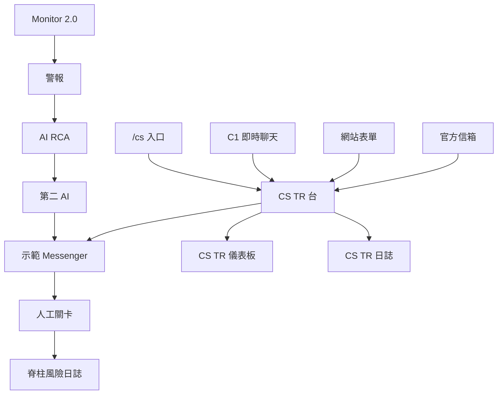

**AI Admin** 位於執行期 Spine 旁側：不直接執行交易動作；在雙人管控下治理模型、劇本、RAG 語料與 AI 參數。

---

## 3. 架構總覽

| 層級 | 職責 | 主要路徑 |
|---|---|---|
| UI（App Router） | RBAC 控管管理頁＋公開 `/cs` | `platform/src/app/admin/**`、`app/cs/**` |
| 前端主控台 | 互動分頁／表單 | `platform/src/components/*`（`CsClientPortal`、`CsTrDesk`、`CsDashboardView`、`CsLogView`、`UrlCatalogBoard`） |
| API | JSON 讀寫 | `platform/src/app/api/**`（含 `/api/cs`、`/api/cs/intake`） |
| 領域邏輯 | 業務規則 | `platform/src/lib/ai/*`、`lib/cs/*`、`lib/db.ts`、`lib/auth.ts` |
| 持久化 | SQLite 檔 | `platform/data/vantage_risk.db` |

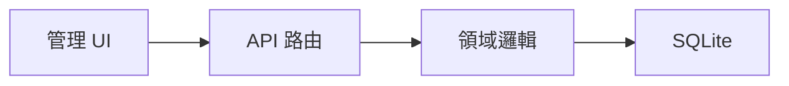


### 3.1 執行期 Spine 階段
1. **Monitor 2.0** 在統一指標＋偵測器登錄上執行採樣（`/admin/monitor-2`；`/admin/detectors` 轉址）
2. **Alarm** 建立 Monitor 警報／工單
3. **AI RCA** 匹配 Skill 或 RAG 推論（列表在**即時警報與追蹤** `/admin/alerts`；明細 `/admin/ai-analyses/[id]`）
4. **第二 AI 挑戰者** 於嚴重度達門檻時執行（`crmp-challenger-v0`）
5. **Demo Messenger／人工介入** 分流與關卡控制
6. **首頁脊柱** 記錄階段轉換與工單計數（`/admin`；`/admin/spine` 轉址 — 脊柱日誌分頁已移除）
7. **CS／TR 大門**（與 Monitor 平行）：`/cs`＋C1／表單／信箱 → `POST /api/cs/intake` → 技能蓋章 → 等待迴圈或 TR／風控 → CRMP 平面 `CS_*` 稽核

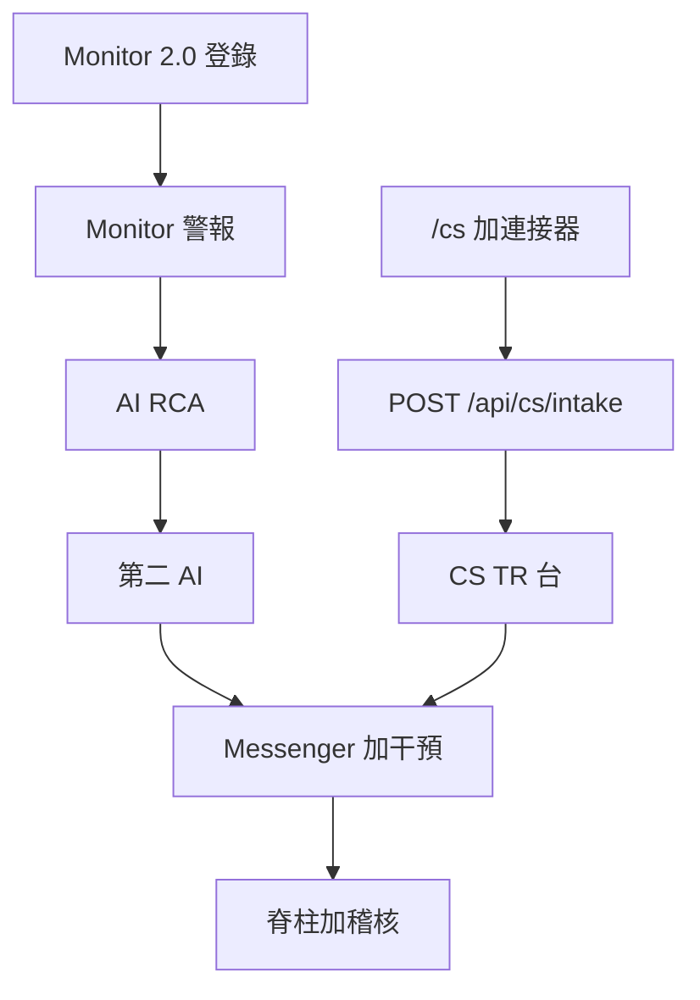
8. **每日績效／Risk Log／市場情報** 彙總結果

---

## 4. 資料模型（核心）

### 4.1 身分與 RBAC
- `users`、`roles`（權限 JSON）、`departments`、`teams`、`sessions`
- 權限為字串代碼；`SUPER_ADMIN` 擁有 `*`

### 4.2 監控
- `monitor_indicators`、`monitor_alerts`、`monitor_tickets`
- `risk_domains`、`escalation_routes`、`lark_channels`

### 4.3 AI 執行期
- `ai_skills`（含 `scenario_json`）、`risk_scenario_chains`
- `rag_documents`（含 FTS）
- `ai_analyses`（含 `challenged`、`challenge_verdict`）、`ai_analysis_evidence`、`ai_skill_runs`
- `ai_analysis_challenges`（第二意見）
- `interventions`、Spine 相關表

### 4.4 Messenger
- `messenger_threads`、`messenger_messages`、`messenger_pending_actions`

### 4.5 市場情報
- `market_intel_*` 掃描／發現／outbox 表（見 `lib/market-intel/schema.ts`）

### 4.6 AI Admin 治理
見 **§8.4** — `ai_change_requests`、`ai_training_runs`、`ai_feedback`、`ai_accuracy_snapshots`，以及 `platform_settings` 中的 AI 鍵值。

### 4.7 CS／TR 進件
見 **§17.5**。資料表：`cs_channels`、`cs_requests`（`request_id` CSR-XXXX、`channel_ref`、`skill_code`、`ai_clarity`、`followup_count`）、`cs_messages`、`cs_followups`（`status=WAITING|CLOSED`）。沒有證件圖欄 — 身分不存工單。

---

## 5. 安全與 RBAC（摘要）

| 議題 | 規則 |
|---|---|
| 頁面存取 | `getCurrentUser()` + `hasPermission(role, code)` |
| Maker ≠ Checker | 當 `ai.maker_checker_required=true` 時，提案者不可核准自己的變更單 |
| AI Admin 變更 | 僅能經 `/api/ai-admin` 且具備 propose／approve 權限 |
| 稽核 | 提案、裁決、回饋、訓練排隊皆 `writeAudit` |
| **AI 存取封鎖清單** | AI 不得觸及之頁面／功能／欄位／資料 — 見 `/admin/security/ai-access` 與 `lib/security/ai-access-blocklist.ts` |

AI Admin 權限矩陣詳見 **§8.3**。  
**僅限人工操作之表面（身分、密鑰、雙人核准、LP／錢包執行、角色寫入）：** 動態清單見 **`/admin/security/ai-access`**。

---

## 6. 整合點

| 系統 | 原型模式 | 說明 |
|---|---|---|
| Monitor 2.0 | 鏡像表 + 同步／全部執行／模擬 | 指標＋偵測器登錄在 `/admin/monitor-2`；未結警報／工單在即時警報與追蹤 |
| Demo Messenger | 站內執行緒 + `/api/messenger` | 證據、升級、控制 |
| Lark | 頻道登錄 + 模擬 Webhook／情報 outbox | 依嚴重度路由 |
| 市場情報來源 | 啟發式 5 分鐘掃描 | 卡片格式 i–vi |
| LP／Bridge／錢包 | 建議動作 + 管理深連結 | 真實適配前需人工關卡 |
| C1 即時聊天 | Webhook＋`/cs` 即時聊天分頁 | `POST /api/cs/intake`（`x-cs-intake-token: demo-c1` 或 `portal: true`）；`channel_ref`＝工作階段 |
| 網站／App 表單 | 表單送出＋`/cs` 提交分頁 | 同一 webhook；`channel_ref`＝表單 id |
| 官方信箱 | 閘道＋`/cs` 官方信箱分頁 | 同一 webhook；主旨可帶 `CSR-XXXX`；`In-Reply-To` 續辦 |

---

## 7. 管理介面地圖

路由真實來源：`platform/src/lib/nav.ts` 的 `NAV_ITEMS`＋`NAV_GROUPS`。每一列都在本 TSD（本節＋§8–§17）有規格，使用手冊有操作說明。公開 `/cs` **不是**左側導覽列 — 那是 **§17.8** 規格的客戶大門。

### 7.1 殼層（不是導覽列）

| 介面 | 路由／儲存 | 模組 | 權限 |
|---|---|---|---|
| 登入 | `/login` | `app/login/page.tsx`、`lib/demo-session.ts` | 公開 |
| 語言 | cookie `crmp_ui_lang` | `hooks/useUiLocale`、`lib/i18n.ts` | — |
| 未讀徽章 | `crmp_nav_seen_v1`／`crmp_nav_extra_v1` | `AdminShell`、`lib/nav-badges.ts` | — |
| 示範工作階段 | `crmp_demo_session_v1` | Pages 上保持具名角色 | — |
| CS 客戶入口 | `/cs` | `CsClientPortal`、`POST /api/cs/intake` | 公開 |
| 手機抽屜 | `< lg` | `AdminShell` 漢堡 | — |
| 品牌 | Vantage 標誌＋負責人列 | `VantageLogo`、`lib/platform-owner.ts` | — |

未讀公式：`max(0, mergeNavTotals(server) + extra − seen)`。打開 href 寫入 seen。`bumpNavBadge(href)` 增加 extra。Pages 在 SQLite 計數為空時用 `FALLBACK_NAV_TOTALS`。

### 7.2 頁面

| 分組 | URL | UI／API | 權限 | 規格 |
|---|---|---|---|---|
| 總覽 | `/admin` | `app/admin/page.tsx` | `admin.access` | §16.2 |
| 監控 | `/admin/dashboard` | `DailyDashboardView`、`GET/POST /api/dashboard` | `dashboard.read` | §16.3 |
| 監控 | `/admin/risk-log` | `RiskLogDashboard`、`lib/ai/risk-log.ts` | `monitor.read` \| `audit.read` \| `dashboard.read` | §16.4 |
| 監控 | `/admin/market-intel` | `MarketIntelBoard` | `monitor.read` | **§12** |
| 監控 | `/admin/monitor-2` | 統一登錄＋`MonitorActions`、`/api/monitor`、`/api/detectors` | `monitor.read`／`monitor.operate` | §16.5 |
| 監控 | `/admin/detectors` | 轉址 → Monitor 2.0（書籤） | `detectors.read` | §16.5 |
| 監控 | `/admin/alerts` | **即時警報與追蹤** · `AlertTrackerBoard` | `monitor.read`／`monitor.operate` | §16.7 |
| 監控 | `/admin/risk-domains` | 領域卡 | `monitor.read` | §16.8 |
| AI | `/admin/ai-analyses` | 列表轉址 → 即時警報與追蹤；明細 `[id]` | `ai.read`／`ai.operate` | §9＋§16.9 |
| AI | **`/admin/ai-admin`** | `AiAdminConsole`、`/api/ai-admin` | `ai.admin` | **§8** |
| AI | `/admin/skills` · `/admin/skills/[code]` | `SkillsScenariosBoard` | `skills.read` | §10＋§16.10 |
| AI | `/admin/knowledge-tree` | `KnowledgeTreeBoard` | `rag.read` | §16.11 |
| AI | `/admin/rag` | `RagManager`、`/api/rag` | `rag.read`／`rag.manage` | §16.12 |
| 應變 | `/admin/messenger` | `DemoMessenger`、`/api/messenger` | `lark.read` | **§11** |
| 應變 | `/admin/cs-desk` | `CsTrDesk`、`/api/cs`、`/api/cs/intake` | `cs.read`／`cs.operate` | **§17** |
| 應變 | `/admin/cs-dashboard` | `CsDashboardView`、`lib/cs/analytics.ts`、`GET /api/cs?view=dashboard` | `cs.read`／`lark.read` | **§17.11** |
| 應變 | `/admin/cs-log` | `CsLogView`、`lib/cs/analytics.ts`、`GET /api/cs?view=log` | `cs.read`／`lark.read` | **§17.11** |
| 應變 | `/admin/cs-data` | `CsOpsDataView`、`lib/cs/ops-data.ts`、`GET /api/cs?view=data` | `cs.read`／`lark.read` | **§17.12** |
| 應變 | `/admin/interventions` | `InterventionsBoard` | `intervene.operate` | §16.14 |
| 應變 | `/admin/escalation` | `EscalationManager` | `escalation.read`／`.manage` | §16.15 |
| 應變 | `/admin/lark` | `LarkManager`、`/api/lark` | `lark.read`／`lark.manage` | §16.15 |
| 應變 | `/admin/spine` | 轉址 → 管理首頁脊柱計數 | `spine.read` | §16.13 |
| 組織 | `/admin/departments` | **BU 與團隊**合併中心 | `teams.read` | §16.16 |
| 組織 | `/admin/teams` | 轉址 → `/admin/departments` | `teams.read` | §16.16 |
| 組織 | `/admin/roles` | 可編輯 RBAC · `/api/roles` | `users.read`／`users.manage` | §16.16 |
| 組織 | `/admin/users` | `UsersManager`、`/api/users` | `users.read`／`users.manage` | §16.16 |
| 平台 | `/admin/data-sources` | `DataSourcesManager` | `sources.read`／`.manage` | §16.17 |
| 平台 | `/admin/security/ai-access` | `AiAccessSecurityBoard` | `audit.read` \| `settings.manage` \| `users.read` \| `ai.admin` | §5＋§16.18 |
| 平台 | `/admin/audit` | `AuditBoard` — CRMP／Vantage Markets 管理分頁＋回滾 | `audit.read` | §16.19 |
| 平台 | `/admin/settings` | `SettingsManager`、`PATCH /api/settings` | `settings.manage` | §16.20 |
| 文件 | `/admin/docs/user-guide` · `ai-use` · `prd` · `tsd` · `uat` · `ecosystem` · `roadmap` · `open-issues` · `progress` · `urls` | `lib/docs.ts`、看板 | `admin.access` | §13＋§16.21 |
| 殼層 | `SelectionChatbot`（劃選文字 → 火花 → 聊天） | `lib/ai/desk-chat.ts`、`POST /api/ai-chat` | 公開／`ai.read` | §12 |

靜態匯出：`next.config` `output: 'export'`、`basePath: '/PRD/crmp-plus'`、`trailingSlash: true`。用戶端偵測 `isPublicSnapshot()`／`NEXT_PUBLIC_STATIC_EXPORT`，以示範後備代替 `/api`。原 CRMP 管理後台仍在 `/PRD/crmp-admin/`（凍結；本工作流程不發佈到該路徑）。

---

## 8. AI Admin 管理頁 — 完整規格

### 8.1 目的
`/admin/ai-admin` 為 **AI 控制平面**。操作人員用它來：
1. 監看 AI 健康 KPI 與準確率歷史
2. 提案變更 AI 參數、Skills、RAG 文件
3. 在 **Maker/Checker 雙人管控** 下核准／駁回變更
4. 排隊訓練／重新校正工作
5. 標註 RCA 品質回饋（CORRECT／INCORRECT／PARTIAL）

此頁是**治理**，不是即時 RCA 工作台（列表在**即時警報與追蹤** `/admin/alerts`；明細 `/admin/ai-analyses/[id]`），也不是介入櫃檯（`/admin/interventions`）。

### 8.2 路由與元件

| 項目 | 規格 |
|---|---|
| 頁面路由 | `GET /admin/ai-admin` → `platform/src/app/admin/ai-admin/page.tsx` |
| UI 元件 | `AiAdminConsole`（`platform/src/components/AiAdminConsole.tsx`）客戶端主控台 |
| API | `GET/POST /api/ai-admin` → `platform/src/app/api/ai-admin/route.ts` |
| 領域邏輯 | `platform/src/lib/ai/admin.ts` |
| Schema | `platform/src/lib/ai/admin-schema.ts`（`ensureAiAdminSchema`） |
| 種子資料 | `seedAiAdminIfEmpty`（參數、訓練、準確率快照、示範變更單） |

### 8.3 存取控制

#### 8.3.1 頁面檢視（符合任一即可）
- `ai.admin`
- `skills.manage`
- `rag.manage`
- `ai.read`

未授權使用者重導向 `/admin`。

#### 8.3.2 Maker（提案）— 符合任一即可
- `ai.propose`
- `skills.manage`
- `rag.manage`
- `settings.manage`

#### 8.3.3 Checker（核准／駁回）— 符合任一即可
- `ai.approve`
- `skills.approve`
- `rag.approve`

#### 8.3.4 角色對照（原型）

| 角色 | 檢視 AI Admin | Maker | Checker | 說明 |
|---|---|---|---|---|
| `AI_ENGINEER` | 是 | 是 | 否 | 提案 Skills／RAG／參數／訓練 |
| `RISK_OWNER` | 是 | 是* | 是 | 主要 Checker；亦可提案 |
| `RISK_ANALYST` | 是 | 是 | 否 | 提案 + 回饋操作 |
| `SUPER_ADMIN` | 是 | 是 | 是 | 完整權限；啟用雙人制時仍不可自核 |
| `OPS_LEAD`／`SYSTEM_ADMIN` | 依權限 | 依 ROLE_DEFS | 依 ROLE_DEFS | 見 `db.ts` 之 `ROLE_DEFS` |
| `VIEWER` | 否（除非另授） | 否 | 否 | 其他頁唯讀 |

\* Risk Owner 同時具備提案與核准；仍不可核准自己的變更單。

#### 8.3.5 Maker ≠ Checker 規則
當 `platform_settings.ai.maker_checker_required != "false"`：
- 若 `proposed_by === decided_by`，`decideChangeRequest` 拋錯
- UI 僅應對非提案者之 Checker 顯示核准／駁回

### 8.4 資料模型

#### 8.4.1 `ai_change_requests`
| 欄位 | 型別 | 說明 |
|---|---|---|
| `id` | INTEGER PK | |
| `request_id` | TEXT UNIQUE | 如 `CR-A1B2C3D4` |
| `entity_type` | TEXT | `PARAM` \| `SKILL` \| `RAG` \| `TRAINING` |
| `action` | TEXT | `UPDATE` \| `CREATE` \| `DISABLE` \| `RETIRE` 等 |
| `title`、`summary` | TEXT | 人讀說明 |
| `payload_json` | TEXT | 變更後／建立內容 |
| `before_json` | TEXT NULL | 變更前狀態（diff） |
| `status` | TEXT | `PENDING` \| `APPROVED` \| `REJECTED` |
| `proposed_by`／`proposed_at` | FK／時間 | Maker |
| `decided_by`／`decided_at`／`decision_note` | FK／時間／TEXT | Checker |

#### 8.4.2 `ai_training_runs`
追蹤排隊／執行中／完成之重新校正：`run_id`、`model_name`、`dataset_label`、指標（`accuracy`、`precision_score`、`recall_score`、`f1_score`）、`samples`、`status`、時間戳、`created_by`。

#### 8.4.3 `ai_feedback`
每筆分析標籤：`CORRECT` \| `INCORRECT` \| `PARTIAL`，可附註記、`rated_by`。

#### 8.4.4 `ai_accuracy_snapshots`
每日彙總：Skill 匹配率、人工同意率、回饋正確率、分析總數、介入核准／駁回數。Overview 重新整理時會 upsert 當日 live 快照。

#### 8.4.5 受治理參數（`platform_settings` 鍵）
| 鍵 | 用途 | 預設（種子） |
|---|---|---|
| `ai.rca_enabled` | RCA 總開關 | `true` |
| `ai.auto_on_alarm` | 警報時自動觸發 RCA | `true` |
| `ai.skill_certainty_only` | 僅在確定匹配時自動執行 Skill | `true` |
| `ai.min_confidence` | 自動完成最低信心度 | `0.55` |
| `ai.rag_top_k` | RAG Top-K | `6` |
| `ai.second_opinion_severity` | 觸發第二意見 AI 的嚴重度 | `BREACH` |
| `ai.maker_checker_required` | 強制雙人管控 | `true` |
| `detectors.auto_raise_alarms` | 偵測器是否產生 Monitor 警報 | `true` |

僅 `ai.*` 或 `detectors.auto_raise_alarms` 可經 AI Admin PARAM 變更套用。

### 8.5 UI 規格（分頁）

| 分頁 ID | 標籤 | 功能 |
|---|---|---|
| `overview` | Overview | KPI：分析總數、Skill 匹配%、平均信心、需人工、待介入、人工同意%、回饋正確%、待決 CR；近期分析與回饋 |
| `params` | Parameters | AI 設定草稿；**Propose** 建立 PARAM CR（不立即生效） |
| `changes` | Maker / Checker | CR 清單（PENDING 優先）。Checker 核准／駁回並填註記；顯示 Maker、before/after；分頁顯示待決數 |
| `skills` | Skills | Skill 清單；表單**提案建立** Skill；核准後才套用；可連至 `/admin/skills` 情境板 |
| `rag` | RAG | 文件清單（摘要）；表單提案建立；核准後套用並重建 FTS |
| `training` | Training | 訓練執行清單與指標；表單排隊訓練（建立 TRAINING CR） |
| `history` | History & accuracy | 準確率快照表（14 日） |

頁首徽章顯示目前 `role_code`、**Maker** 與／或 **Checker** 能力。

### 8.6 API 規格

#### 8.6.1 `GET /api/ai-admin`
查詢參數：
- `tab` = `overview`（預設）\| `params` \| `changes` \| `training` \| `skills` \| `rag`
- `status`（可選，篩選變更單）

驗證：§8.3.1 檢視權限。  
預設回應含 `{ overview, params, changes, training, skills, rag, roles }`。

#### 8.6.2 `POST /api/ai-admin`
JSON `action`：

| `action` | 權限 | 效果 |
|---|---|---|
| `propose` | Maker | 通用 CR 寫入 |
| `propose_param` | Maker | PARAM UPDATE CR |
| `propose_skill` | `skills.manage` 或 `ai.propose` | SKILL CR |
| `propose_rag` | `rag.manage` 或 `ai.propose` | RAG CR |
| `decide` | Checker | `APPROVED` 套用；`REJECTED` 結案；強制 Maker≠Checker |
| `queue_training` | Maker | TRAINING CREATE CR |
| `feedback` | `ai.operate` 或 `ai.admin` | 寫入 `ai_feedback` |

錯誤：`{ error: string }`，HTTP 400／403。

### 8.7 核准後套用語意

| entity_type | action | 行為 |
|---|---|---|
| `PARAM` | `UPDATE` | 更新 `platform_settings.value` |
| `SKILL` | `CREATE` | 插入 ACTIVE `ai_skills` |
| `SKILL` | `UPDATE` | 更新欄位 |
| `SKILL` | `DISABLE` | `status='DISABLED'` |
| `RAG` | `CREATE` | 插入文件 + `reindexRagFts` |
| `RAG` | `UPDATE` | 內容／狀態更新 + 重建索引 |
| `RAG` | `RETIRE` | `status='RETIRED'` + 重建索引 |
| `TRAINING` | `CREATE` | 插入 QUEUED `ai_training_runs` |

### 8.8 稽核事件
| 事件 | 時機 |
|---|---|
| `AI_CHANGE_PROPOSED` | Maker 提交 CR |
| `AI_CHANGE_APPROVED`／`AI_CHANGE_REJECTED` | Checker 裁決 |
| `AI_FEEDBACK` | 提交回饋標籤 |

### 8.9 非功能需求
| NFR | 規格 |
|---|---|
| 延遲 | SSR + 客戶端分頁；原型突變 API p95 < 500ms |
| 耐久性 | SQLite WAL；稽核保留 |
| 安全 | 啟用雙人制時 PARAM／SKILL／RAG 不可直接套用 |
| 分離 | 執行期介入仍在 `/admin/interventions` |
| 可觀測性 | Overview KPI + 準確率快照 |

### 8.10 驗收標準
1. AI Engineer 可開啟 AI Admin 並提案 Skill；CR 為 PENDING。
2. 同一 AI Engineer **不可**核准該 CR（Maker/Checker 錯誤）。
3. Risk Owner 可核准；Skill 變 ACTIVE 並出現於 `/admin/skills`。
4. 參數提案在 APPROVED 前不改即時值。
5. 訓練排隊先建 CR，核准後建立 TRAINING run。
6. Overview 顯示待決 CR 數與準確率歷史。
7. 回饋標籤持久化並影響回饋正確率。

### 8.11 序列 — 提案 Skill（成功路徑）

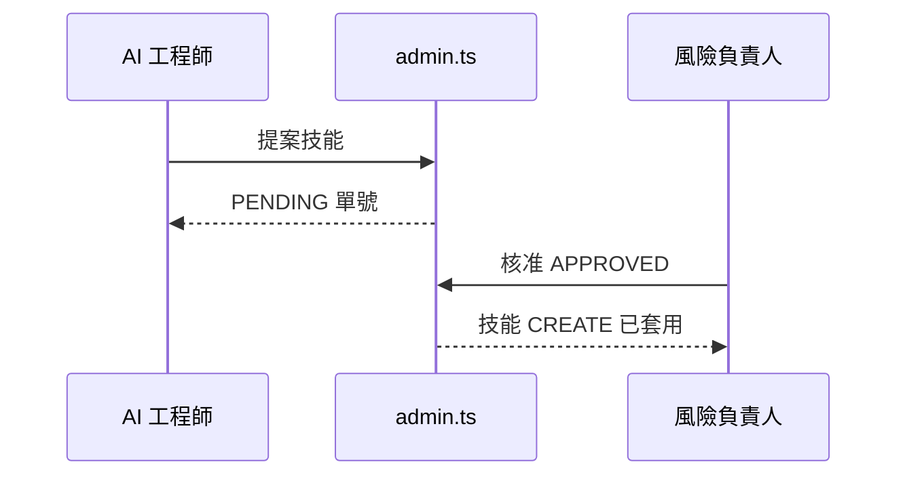

### 8.12 相關頁面
| 頁面 | 關係 |
|---|---|
| `/admin/skills` | 核准後之劇本／情境板 |
| `/admin/rag` | 語料瀏覽；受治理變更應走 AI Admin CR |
| `/admin/ai-analyses` | 消費此處治理之 Skills／RAG／參數 |
| `/admin/interventions` | **執行期**動作關卡（非設定 CR） |
| `/admin/roles` | 定義 §8.3 權限 |

### 8.13 後續強化（尚未必做）
- `before_json` vs `payload_json` Diff UI
- CRITICAL 參數變更強制雙重核准
- PENDING CR 通知 Lark `oc_ai_detection_lab`
- 匯出 CR 包供合規

---

## 9. 獨立第二 AI 挑戰者

### 9.1 目的
當警報嚴重度達到或超過 `ai.second_opinion_severity`（預設 **BREACH**）時，平台在主要 Skill/RAG RCA 之後執行獨立挑戰模型（`crmp-challenger-v0`）。挑戰者**不得**重用主要決策路徑。

**程式：** `platform/src/lib/ai/challenger.ts` · 於 `analyze.ts` 持久化後掛接。

### 9.2 觸發
| 設定 | 預設 | 行為 |
|---|---|---|
| `ai.second_opinion_severity` | `BREACH` | 警報嚴重度等級 ≥ 設定時執行（`WARN` &lt; `BREACH` &lt; `CRITICAL`） |

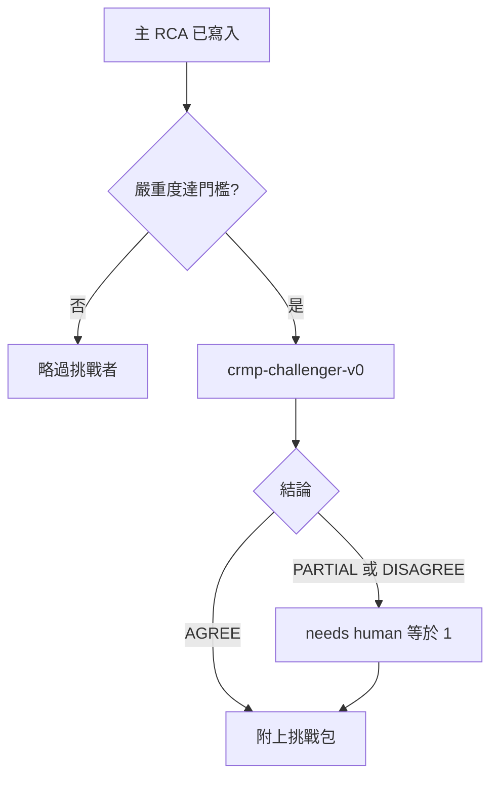


### 9.3 輸出
| 欄位 | 說明 |
|---|---|
| `verdict` | `AGREE`／`PARTIAL`／`DISAGREE` |
| `critiques` | 主要敘事之重大缺口 |
| `improvements` | 優先改進建議 |
| `alternatives` | 替代假說與信心分數 |

### 9.4 持久化與副作用
- 資料表 `ai_analysis_challenges`（與 `ai_analyses` 1:1）
- 證據類型 `CHALLENGER`
- 欄位 `challenged`、`challenge_verdict`
- `PARTIAL`／`DISAGREE` 強制 `needs_human = 1`
- Spine `AI_RCA` 事件＋稽核 `AI_SECOND_OPINION`
- 可經 `backfill_challenges` 回填

### 9.5 介面
- 列表徽章：`2nd AI · {verdict}`
- 詳情面板：`AiChallengePanel`
- 控制：模擬 CRITICAL、回填挑戰

---

## 10. Skills 與風險情境（摘要）

Skills 儲存完整 `scenario_json`：指標、門檻與理由、故障區域、升級路徑、BU 矯正、歷史案件。  
`risk_scenario_chains` 連結多指標時間線。見 `/admin/skills`、`risk-scenarios-catalog.ts`、`risk-scenarios-extra.ts`、`risk-scenarios-cs.ts`。

---

## 11. Demo Messenger

### 11.1 目的
站內 Lark 風格收件匣，承載警報＋AI 報告執行緒與內嵌操作。正式傳輸仍為 Lark；本模組驗證 UX 與稽核語意。

### 11.2 技術棧
| 項目 | 路徑 |
|---|---|
| 頁面 | `/admin/messenger` |
| UI | `components/DemoMessenger.tsx`（手機主從） |
| API | `GET/POST /api/messenger` |
| 領域 | `lib/messenger/demo.ts` |

### 11.3 動作
| 動作 | 效果 |
|---|---|
| `show_evidence` | 貼上證據庫＋挑戰摘要 |
| `chat` | 使用者備註／挑戰；不同意標記 `needs_human` |
| `escalate` | 升級路徑前進一步；目前承辦窗貼轉交、下一窗貼接收 |
| `dismiss` | 誤報 → DISMISSED／警報關閉 |
| `close` | 接受 AI → CLOSED |
| `recommend` → `confirm_action` | 雙重確認控制 → admin_ref（必要時 Checker） |

### 11.4 資料
見 §4.4。

### 11.5 POC 窗
`getMessengerThread` 回傳 `poc_windows` — 匹配路徑每一跳一個 Lark 聊天（一線團隊 → 二線 → 風險負責人 → 高階），承辦來自 `users`／`teams`。UI：鳥瞰路徑晶片＋分欄（`data-testid=msg-poc-windows`）。

---

## 12. 市場情報

### 12.1 目的
每五分鐘掃描可能影響 LP 報價之新聞／社群／官方訊號；推送格式化卡片至專用 outbox；暴露指標 `M2-MKT-INTEL`。

### 12.2 主要模組
- `lib/market-intel/scanner.ts`、`format.ts`、`schema.ts`、`demo-scan.ts`
- UI `/admin/market-intel`
- 設定：`market_intel.enabled`、`interval_minutes`、`lark_chat_id`

### 12.3 公開快照（GitHub Pages）
Pages 沒有 Next.js API。`POST /api/market-intel` 會回 **405**。工作台因此：
1. 偵測 `github.io`／`/PRD/crmp-plus`／`NEXT_PUBLIC_STATIC_EXPORT`。
2. 以與正式掃描相同的 `EVENT_TEMPLATES` 執行 `runClientMarketIntelScan()`。
3. 在本機狀態更新發現、寄件匣、掃描紀錄與 `M2-MKT-INTEL`（存 `localStorage`）。
4. SSG 時先種三筆發現，避免第一次畫面是 0。

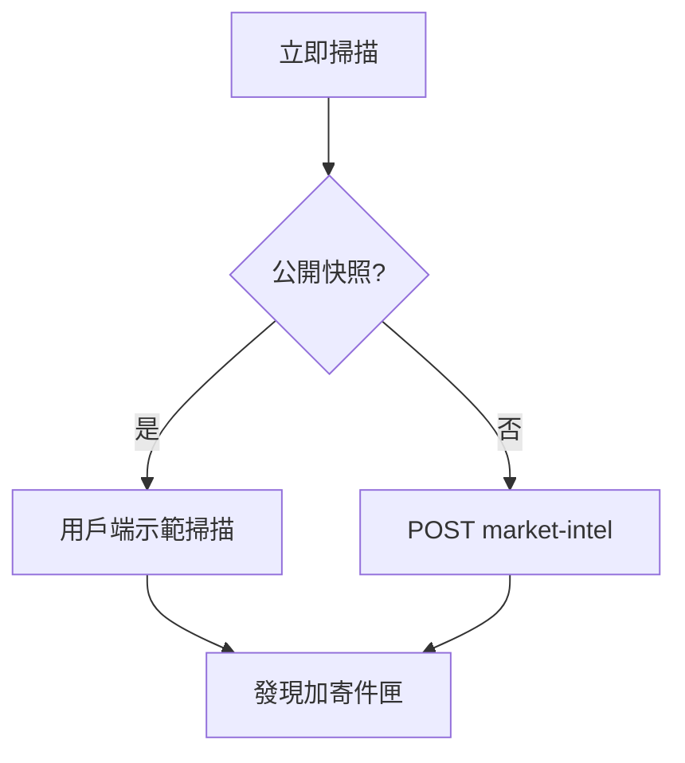

---

## 13. 文件、i18n 與響應式殼層

| 議題 | 設計 |
|---|---|
| 文件 | `platform/docs/*` Markdown，經 `lib/docs.ts`＋`DocArticlePage` 渲染 |
| 語系 | `en`／`zh-Hant` 查詢參數 `?lang=` |
| UI 語系 | Cookie `crmp_ui_lang`；導覽字串於 `lib/i18n.ts` |
| 行動裝置 | `AdminShell` 抽屜 &lt; `lg`；messenger 與 CS／TR 台列表→案件；儀表板／日誌／資料卡片雙檔；`／cs` 分頁直向；safe-area CSS |

互動 UAT 看板：`/admin/docs/uat`。

---

## 14. 主要 API 地圖（原型）

GitHub Pages（靜態匯出）沒有這些 API。UI 必須降級：示範工作階段、用戶端情報掃描、本機設定訊息。

| API | 角色 |
|---|---|
| `POST /api/auth/login` | Session cookie `crmp_session`；Pages 改走 `writeDemoSession` |
| `POST /api/auth/logout` | 清除 cookie |
| `GET/POST /api/ai` | 分析、模擬警報、`backfill_challenges` |
| `GET/POST /api/ai-admin` | 提案／核准／訓練／回饋 |
| `GET/POST /api/messenger` | 執行緒＋內嵌動作 |
| `GET/POST /api/cs` | CS／TR 台收件匣＋操作動作（`triage`／`analyze`／`followup`／`client_reply`／`reply`／`assign_tr`／`escalate_risk`／`resolve`／`poc_release`／`simulate_*`） |
| `GET/POST /api/cs/intake` | 公開連接器目錄＋案件狀態；C1／表單／信箱進件或續辦（`request_id`／`in_reply_to`／`channel_ref`／`CSR-XXXX`） |
| `GET/POST /api/lark` | 頻道登錄／模擬通知 |
| `GET/POST /api/market-intel` | 掃描／發現／寄件匣 |
| `GET/POST /api/monitor` | Monitor 中心主 API：`run_detectors`、`toggle_pause`、`update_thresholds`、`sync_monitor2`、`ack_alert`、`update_ticket` |
| `GET/POST /api/detectors` | 舊版偵測器 CRUD／執行（UI 在 Monitor 2.0） |
| `GET/POST /api/escalation` | 路徑＋維度係數＋ESC-DEFAULT 探測 |
| `GET/POST /api/roles` | 可編輯 RBAC（`update_role`；禁止 AI 寫入） |
| `GET/POST /api/org` | 部門＋團隊；`update_team` 任務／值班 |
| `POST /api/audit/rollback` | 依 `audit_id` 還原變更前快照 |
| `GET/POST /api/ai-improve` | 如何改進審查聊天 |
| `POST /api/ai-chat` | 劃選 AI 聊天 |
| `POST /api/dashboard` | 重建每日指標 |
| `GET/POST /api/rag` | 清單、檢索；人類寫入／propose_rag（AI 封鎖） |
| `GET/POST /api/users` | 目錄＋新增／停用 |
| `PATCH /api/settings` | 單一鍵儲存 |
| 干預 | 伺服器動作 `decideInterventionAction`（核准／駁回） |

---

## 15. 部署（原型）

```bash
cd platform
npm install
npm run dev   # http://localhost:3000
```

SQLite：`platform/data/vantage_risk.db`。  
重置：`npm run db:reset` 後重啟。

示範帳號見使用手冊 §1（例如 `admin@vantagemarkets.com`／`admin123`）。

---

## 16. 其餘管理模組

§8–§13 未完整寫出的模組。行為必須對齊使用手冊操作說明與 PRD §6.4。

### 16.1 登入、工作階段、殼層、未讀 — §7.1

- 角色：`lib/demo-session.ts` 的 `DEMO_PERSONAS`（demo platform owner 第一）。  
- localhost：`POST /api/auth/login` 設 `crmp_session` **並**寫入示範工作階段。  
- Pages／404／405：略過 API，只 `writeDemoSession`。  
- `AdminShell` 在 `isPublicSnapshot()` 時優先示範工作階段。登出兩者都清。  
- 導覽分組來自 `NAV_GROUPS`。未讀：`AdminShell`＋市場情報、Monitor 2.0、即時警報與追蹤、Messenger 的 `bumpNavBadge`。

### 16.2 管理首頁

SSR 計數（使用者、團隊、來源、領域、未結警報／工單、Lark 頻道、路徑）。每塊磁磚都是 `Link`：`StatCard` 的 `href`（含圖示＋開啟）、負責人 → `/login`、Messenger 主卡 → `/admin/messenger`、跳轉格、部門卡到工作頁（警報／干預／設定）、最近警報到 `/admin/alerts#{alert_id}`、脊柱步驟到 monitor／alerts／escalation／AI／dashboard。`HomeDummyAlertButtons` POST `/api/ai` `dummy_spine`（單則或組）走完 DETECT→結案；語系來自 `getUiLocale()`，介面為繁中時 Messenger 備註存中文；儲存的英文標題／訊息顯示時仍經 `phrase()` 翻譯。`AlertTrackerBoard` 會對 hash 與 `?dummy=` 醒目顯示。

### 16.3 每日績效

`getDailyDashboard()` → CFD／加密指標陣列＋WARN／BREACH 摘要。`POST /api/dashboard` 重新整理。

### 16.4 風險日誌

`getRiskLogDashboard()` 彙總：摘要美元／時間、`by_category`、`by_domain`、`loopholes`、時序 `records`。唯讀 UI（`RiskLogDashboard`）。

### 16.5 Monitor 2.0 中心（統一指標＋偵測器登錄）

單一登錄表：`monitor_indicators` LEFT JOIN `detectors`（每指標偵測器代碼、暫停、上次執行）。**執行全部指標**／**同步**／**暫停**；門檻編輯經 `IndicatorThresholdEditor`；**近期執行**來自 `detector_runs`。舊 `tab=alerts|tickets` 深連結轉至即時警報與追蹤。`/admin/detectors` 轉址至此（左側無偵測器列）。主 API：`POST /api/monitor`（`run_detectors`／`toggle_pause`／`update_thresholds`／`sync_monitor2`）。舊 `POST /api/detectors` 仍在。表 `detectors`／`detector_runs` 仍在 SQLite — UI 在本頁。顯示 `monitor2.base_url`。未結工單數連至 `/admin/alerts`。手機：`sm:hidden` 卡片＋`sm:block` 表格。

### 16.6 偵測器網址（轉址）

僅書籤：`/admin/detectors` → `/admin/monitor-2`。執行／切換／近期執行見 §16.5。

### 16.7 即時警報與追蹤

`AlertTrackerBoard`：`monitor_alerts` 聯結指標。僅未結卡片；排序 CRITICAL／BREACH／WARN 再依時間。**分組 AI 管線**控制＋排序說明；M2-* 為 `MonitorCode` 提示。`/admin/ai-analyses` 列表轉址至此。有 `monitor.operate` 時可 `ack_alert`。已關閉工單離開此佇列進風險日誌。

### 16.8 風險領域

`risk_domains` 卡片：priority、product_coverage、owner_department、supporting_departments_json。唯讀。

### 16.9 AI 分析清單／明細

清單併入即時警報與追蹤（`AlertTrackerBoard`）：**分組 AI 管線**＋排序說明；localhost 五顆示範按鈕（分析未結／模擬技能／RAG／危急／補跑第二 AI）。M2-* 為 `MonitorCode` 提示／連結。明細：`/admin/ai-analyses/[id]`＋`AiChallengePanel`。AI 管理總覽有**第一／第二線**卡片（`ai.line1.*`／`ai.line2.*`）。見 §9。

### 16.10 技能看板＋SKILL.md 頁

`SkillsScenariosBoard`：搜尋、技能 vs 鏈分頁、**進入** → `/admin/skills/[code]`（`finalizeSkill` 劇本：何時用／不用、前置、步驟、證據、停止、成功）。目錄：`risk-scenarios-catalog.ts`＋額外＋**`risk-scenarios-cs.ts`**（CS／TR 24/7 劇本）。

### 16.11 Knowledge Tree（知識樹）

`KnowledgeTreeBoard` 用戶端 SVG（`viewBox` 寬 1120）。樹幹：`domains`｜`chains`｜`rag`。產品篩選 ALL／CFD／Crypto。領域節點換行（5 欄 × N）。點領域展開技能；點技能填檢視器；`router.push` 劇本（不要用無效的 SVG `<Link>`）。**RAG 文件葉**深連結 `/admin/rag?doc=…`。`MonitorCode` 連到 Monitor 2.0。大綱模式是同一張圖的巢狀清單。CS／TR 樹幹：**CS_SERVICE**、**TRADING_EXEC**；連結鏈 `CHAIN-CS-TR-INTAKE`；RAG 分類 `CS_POLICY`。

### 16.12 RAG 語料

`RagManager`：分類篩選、搜尋、檢索 `GET /api/rag?mode=retrieve&q=&limit=6`。**人工閘道：** AI 不能編輯的頁／欄位升級給人類 — AI 服務角色不可 POST／PATCH；具 `rag.manage` 的人類或 AI Admin `propose_rag` Maker-Checker。FTS 經 `reindexRagFts`。

### 16.13 脊柱（管理首頁）

專屬脊柱日誌左側分頁已移除。階段 DETECT…DASHBOARD 顯示於管理首頁 `HomeSpineViz`，含**階段工單計數**（`spineStageCounts`）。`/admin/spine` 轉址至 `/admin`。

### 16.14 干預

`listInterventions()`。待決：備註＋核准／駁回經 `decideInterventionAction`。樣本顯示**操作者信箱**。寫入脊柱＋稽核。與 AI Admin 變更單分開。

### 16.15 Lark＋升級

`lark_channels`＋`lark_cards`＋`lark.*` 設定（含 `oc_cs_c1`、`oc_cs_kyc`、`oc_tr_dealing`）。原型互動卡片（`ALERT`／`ESCALATION`／`CS_ESCALATION`）送到 `/admin/lark`；確認／升級／排除／結案經 `POST /api/lark` `card_*` 呼叫與 Messenger／CS 同一套 CRMP API（`lib/lark/cards.ts`、`lib/lark/actions.ts`）。稽核 `LARK_CARD_*` 屬 CRMP 平面；`LARK_TEST_NOTIFY` 仍屬 Vantage。`escalation_routes` 以**維度**（嚴重度、涉入團隊、風險情境、待處理門檻、需人工干預）× 可編輯**係數**（`coefficients_json`）定義。無獨立「路徑」名稱欄 — 以路徑代碼識別。比對順序：精確領域＋嚴重度 → 領域萬用 → **ESC-DEFAULT**。技能綁定一條路徑代碼；未綁定 → ESC-DEFAULT。CS／TR 技能綁 `ESC-CS-24-7`／`ESC-TR-DEAL`／`ESC-CS-RISK`。卡片依匹配 `lark_chat_id` 路由。

### 16.16 組織

**BU 與團隊**合併中心：`/admin/departments`（`/admin/teams` 轉址）。六個 BU：風險控管、營運、AI、系統、**客服（CS）**、**交易（TR）** — 各含嵌套值班團隊（Lark chat、任務）。**角色與權限**可編輯：`/admin/roles`＋`GET/POST /api/roles`（`permissions_json` 晶片＋章程；`users.manage`；禁止 AI 寫入）。使用者（`UsersManager`）含 CS Lead／CS Agent／TR Lead／TR Dealer 示範角色。種子含 `PLATFORM_OWNER`（demo platform owner／`haixiang.yan@hytechc.com`）。

### 16.17 資料來源

`data_sources` 登錄。有 `sources.manage` 時 `DataSourcesManager` CRUD。種子含 C1 即時聊天閘道、網站 CS 表單與官方客服信箱。

### 16.18 AI 存取黑名單

`lib/security/ai-access-blocklist.ts` → `AI_ACCESS_BLOCKLIST`、`AI_ALLOWED_CAPABILITIES`、`AI_SERVICE_ROLE_FORBIDDEN_PERMISSIONS`。唯讀看板＋統計。

### 16.19 稽核日誌

`AuditBoard` 經 `classifyAuditPlane`（`lib/audit.ts`）將 `audit_logs` 分為兩個分頁：

| 分頁 | 內容 |
|---|---|
| **CRMP 日誌** | 本 CRMP 管理介面內變更 — 警報、AI、技能、升級、干預、Messenger、**CS_*** |
| **Vantage Markets 管理日誌** | 其他管理頁 — 限制權限、拉取交易、觸發 Lark、BU POC 風險事件回應、設定／組織／RAG |

兩個分頁在有變更前快照時提供**回滾**（`POST /api/audit/rollback`，`{ audit_id }`）。

### 16.20 平台設定

`SettingsManager` 依鍵前綴分組：`platform.|products.`、`monitor2.`、`ai.`、`market_intel.`、`lark.`、`escalation.|detectors.`。`PATCH /api/settings`。Pages：訊息「僅存在此瀏覽器」。

### 16.21 文件渲染

Markdown `platform/docs/*.md`＋`*.zh-Hant.md`。`markdownToHtml`：標題 h1–h4、表格、清單、mermaid `graph`／`flowchart`／`sequenceDiagram` → SVG（`.doc-diagram`，`lib/docs-mermaid.ts`）。互動看板：UAT（`UatChecklistBoard`）、路線圖、開放議題、進度（`ProgressTrackerBoard` — X＝議題、Y＝2026-10→2027-12；CS／TR 目錄 v1.6 在同一 20 欄，不是額外長條）。網址目錄：`UrlCatalogBoard`＋`lib/docs/urls.ts` 的 `PLATFORM_URLS`（**CS／TR** 區段＝`/cs`、台面、儀表板、日誌、五本 SKILL.md、六片 RAG 葉、GET／POST `/api/cs/intake`、`cs_*` 表；篩選；`PUBLIC_*`＝CRMP Plus `/PRD/crmp-plus/` 含 `PUBLIC_CS_PORTAL_URL` `/cs/`、`PUBLIC_CS_DASHBOARD_URL`、`PUBLIC_CS_LOG_URL`；`ORIGINAL_CRMP_*`＝凍結 `/PRD/crmp-admin/`）。見 **§17.9**。

---

## 17. CS／TR 台

**頁面：** `/admin/cs-desk` · `CsTrDesk` · 權限 `cs.read`（檢視）／`cs.operate`（操作）。訪客／靜態快照可經 `lark.read` 閱讀。

### 17.1 目的
客服是 **24/7** 第一線：平台 **C1** 即時聊天、網站**提交表單**與**官方客服信箱**。交易（TR）承接 CS 分流的成交投訴（訂單、成交、滑點、強平、MT4／MT5）。CS 不啟動交易管制；TR 不值班 C1。

### 17.2 進件 API
即時連接器共用一個 webhook：

| 渠道 | `channel` 代碼 | 典型來源 |
|---|---|---|
| C1 即時聊天 | `C1_LIVE_CHAT` | C1 webhook |
| 網站／App 表單 | `WEB_FORM` | 表單送出 |
| 官方信箱 | `OFFICIAL_EMAIL` | 信箱閘道 |

`POST /api/cs/intake` 接受工作階段（`cs.operate`）、`mock_webhook: true`、`portal: true`，或標頭 `x-cs-intake-token: demo-c1`。內文：`client_name`／`from_name`、`client_email`／`from_email`、`client_uid`、`subject`、`body`／`text`／`message`。C1 可帶 `c1_id`／`channel_ref`；信箱閘道可帶 `in_reply_to` 或主旨中的 `CSR-XXXX`。**GET** `/api/cs/intake` 回傳連接器目錄；`?request_id=CSR-XXXX` 回傳公開狀態（不含個資）。台面動作：`POST /api/cs`（`triage`、`analyze`、`followup`、`client_reply`、`reply`、`assign_tr`、`escalate_risk`、`resolve`、`poc_release`、`simulate_c1|form|email`）。

進件若對得上既有未結案件則**續辦**，順序：`request_id`、`in_reply_to`（訊息 id／channel_ref／CSR-XXXX）、同一個 C1／表單／信箱 `channel_ref`，或主旨中的 `CSR-[0-9A-F]{6}`。若該案仍有 WAITING 追問，視為客戶回覆 — 關閉等待迴圈並重新分流，不另開重複案件。

公開客戶畫面：`/cs`（`CsClientPortal`）— C1 即時聊天、提交表單、官方信箱分頁，皆打同一 webhook。永久網址 `PUBLIC_CS_PORTAL_URL`。

資料表：`cs_channels`、`cs_requests`、`cs_messages`、`cs_followups`。稽核動作 `CS_*` 落在 **CRMP** 平面（`entity_type=cs_request`）。

### 17.3 AI 分流與追問迴圈
`triageText` 為啟發式（原型 — 此路徑無正式 LLM）：

- **need_id** — KYC／護照／核身／登不進去。狀態 `ID_VERIFY`。
- **unclear** — 內文短於 48 字或「help me／???／不清楚」。狀態 `AWAITING_CLIENT`。
- **trading** — 訂單／成交／滑點／MT4／MT5。台面 `TR`，狀態 `ASSIGNED_TR`。
- 其餘為 **complaint** 或 **question**。帳簿風險投訴可 `escalate_risk` 進入示範 Messenger／人工干預（`ESCALATED_RISK`）。

清晰度為 `unclear` 或 `need_id` 時，AI **自動寄信**（`EMAIL_OUT`＋`cs_followups.status=WAITING`）並**等待客戶回覆**（同一進件 API 的 `EMAIL_IN`／C1 `CLIENT`／表單 `FORM` → 重新分流）。追問仍為 WAITING 時**禁止結案**。迴圈上限 **3** 封，其後由 CS Lead 人工跟進。

### 17.4 專用 SKILL.md 劇本＋知識樹
分流不只是啟發式。每則請求在 `cs_requests.skill_code` 蓋上專用劇本（`platform/src/lib/ai/risk-scenarios-cs.ts`）：

| 技能 | 何時 | 台面／狀態 |
|---|---|---|
| `SKILL-CS-CLARIFY` | 過短／「help me ???」 | CS · `AWAITING_CLIENT` |
| `SKILL-CS-ID-VERIFY` | KYC／護照／登不進去 | CS · `ID_VERIFY` |
| `SKILL-CS-ACCOUNT-FAQ` | 清楚的隔夜利息／時段／UID | CS · `OPEN` |
| `SKILL-TR-EXECUTION` | 成交／滑點／MT4／MT5 | TR · `ASSIGNED_TR` |
| `SKILL-CS-ESCALATE-RISK` | 帳簿風險／詐欺／錢包 | `ESCALATED_RISK` |

每個技能含何時使用／何時不用／預檢／證據／停止／成功條件、繁中覆寫（`skill-zh.ts`）、一條升級路徑（`ESC-CS-24-7`／`ESC-TR-DEAL`／`ESC-CS-RISK`），以及明確 RAG 葉（`SKILL_RAG_DOCS`）。知識樹領域 **CS_SERVICE** 與 **TRADING_EXEC** 展開這些技能；連結時間鏈 `CHAIN-CS-TR-INTAKE`。語料鍵：`cs-24-7-intake`、`cs-id-verify-policy`、`cs-swap-faq`、`tr-dealing-handoff`、`cs-escalate-to-risk`、`cs-skill-playbooks`。佇列監控 `M2-CS-UNCLEAR`、`M2-CS-ID`、`M2-CS-FAQ`、`M2-TR-EXEC`、`M2-CS-ESC`。CS 台晶片 **進入** `/admin/skills/{code}`。

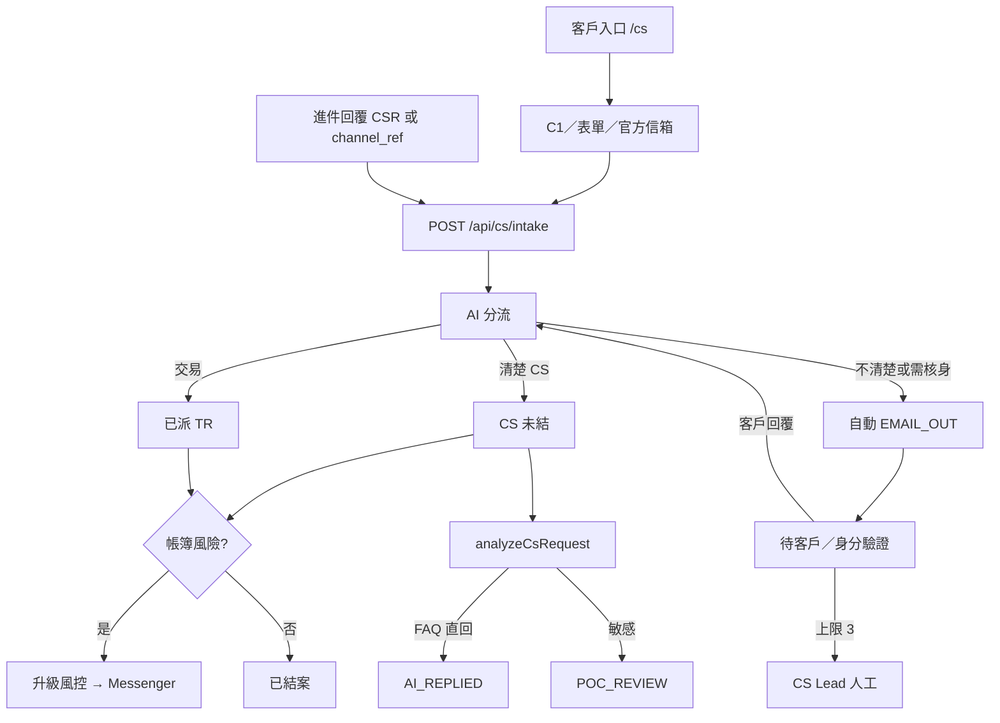

種子示範案件：清楚的 C1 隔夜利息詢問、不清楚的 C1「help me ???」、TR 滑點表單、官方信箱核身。

### 17.5 資料綱要

`ensureCsSchema`（`lib/cs/desk.ts`）建立：

| 資料表 | 關鍵欄 | 角色 |
|---|---|---|
| `cs_channels` | `code` 唯一、`kind`、`endpoint`、`enabled` | 種子 C1／表單／信箱連接器 |
| `cs_requests` | `request_id` CSR-XXXX 唯一、`channel`、`channel_ref`、`desk`、`status`、`ai_clarity`、`followup_count`、`skill_code`、`severity`、`sensitivity`、`ai_solution`、`ai_draft`、`poc_role`、`poc_name` | 客戶工單 |
| `cs_messages` | `msg_id`、`kind`（CLIENT／FORM／EMAIL_IN／EMAIL_OUT／AI／CS／TR／SYSTEM）、`sender`、`body` | 逐字稿 |
| `cs_followups` | `email_to`、`subject`、`reason`、`status` WAITING\|CLOSED、`sent_at`、`replied_at` | 自動信件等待迴圈 |

公開 `GET /api/cs/intake?request_id=` 回傳 `request_id`、`status`、`ai_clarity`、`skill_code`、`channel`、`channel_ref` — **不含**客戶姓名／信箱／內文。**沒有**證件圖欄。

### 17.6 模組地圖

| 路徑 | 職責 |
|---|---|
| `lib/cs/intake.ts` | `parseIntakePayload`、`inferIntakeChannel`、`ingestOrContinue`、`intakeConnectorCatalog`、`lookupPublicCsStatus` |
| `lib/cs/desk.ts` | 綱要、`findCsRequestMatch`、`ingestCsRequest`、`continueCsRequest`、`recordClientReply`、`applyTriage`、`applyCsAnalysis`、`releasePocDraft`、`sendFollowupEmail` |
| `lib/cs/analyze.ts` | `analyzeCsRequest`、`scoreSeverity`、`scoreSensitivity`、`isCollectedReply` — 啟發式，無正式 LLM |
| `lib/cs/skills.ts` | 啟發式 → `SKILL-CS-*`／`SKILL-TR-*` |
| `lib/ai/risk-scenarios-cs.ts` | 五本劇本＋`CHAIN-CS-TR-INTAKE` |
| `lib/cs/analytics.ts` | `getCsDashboard`、`getCsLog` |
| `lib/cs/ops-data.ts` | `getCsOpsContract`、`getCsFollowupCap`、`getCsIntakeToken` |
| `lib/cs/params.ts` | 種子目錄：團隊、POC、Lark、來源、`cs.*` 鍵、關卡 |
| `app/api/cs/intake/route.ts` | GET 目錄／狀態 · POST 進件 |
| `app/api/cs/route.ts` | 台面操作動作＋`GET ?view=dashboard\|log\|data` |
| `app/cs/page.tsx`＋`CsClientPortal` | 公開三分頁入口 |
| `components/CsTrDesk.tsx` | 操作收件匣 |
| `components/CsDashboardView.tsx` | CS／TR 指標 |
| `components/CsLogView.tsx` | CS_* 時間軸＋已結包 |
| `components/CsOpsDataView.tsx` | BU／團隊／關卡／參數契約 |
| `lib/docs/urls.ts`＋`UrlCatalogBoard` | CS／TR 目錄區段 |

POST 進件驗證：工作階段 `cs.operate`、`mock_webhook: true`、`portal: true`，或標頭 `x-cs-intake-token: demo-c1`。

### 17.7 等待迴圈狀態

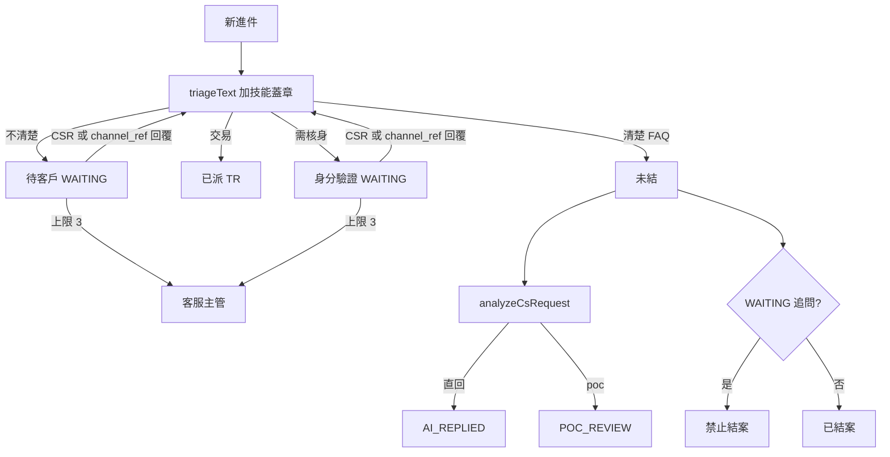

續辦比對順序：`request_id` → `in_reply_to` → 進行中 `channel_ref` → 主旨 `CSR-[0-9A-F]{6}`。

### 17.8 公開 `/cs` 入口

`CsClientPortal` 分頁：即時聊天（`C1_LIVE_CHAT`）、提交表單（`WEB_FORM`）、官方信箱（`OFFICIAL_EMAIL`）。每次 POST 設 `portal: true`，並把 `channel_ref` 留在瀏覽器，下一則訊息續辦同一 `CSR-XXXX`。狀態徽章輪詢 `GET /api/cs/intake?request_id=`。永久 Pages 網址：`https://hxyan2020.github.io/PRD/crmp-plus/cs/`。

### 17.9 網址目錄（技術）

`PLATFORM_URLS` 類別 **CS／TR** 列出 `/cs`、`/admin/cs-desk`、`/admin/cs-dashboard`、`/admin/cs-log`、`/admin/cs-data`、五條 `/admin/skills/SKILL-CS-*`／`SKILL-TR-*`、六片 `/admin/rag?doc=cs-*` 葉、`/api/cs`、`/api/cs?view=dashboard`、`/api/cs?view=log`、`/api/cs?view=data`、`/api/cs/intake`、`/api/cs/intake?request_id=` 與 `tables:cs_*`。看板：篩選、`#url-cat-cs-tr` 跳轉、雙語 `phrase()` 標題。守門：`scripts/verify-url-catalog.ts`。

### 17.10 可追溯性

| 產品 | 規格 |
|---|---|
| PRD | G13、FR-37、FR-40、FR-41、FR-42、FR-43、FR-44、FR-45、FR-46、旅程 5.7–5.10、§6.5 |
| 使用手冊 | §9.3 入口／連接器／等待迴圈／每日角色／儀表板／日誌／資料／分析 |
| AI 使用手冊 | CRMP-AIU-001 `/admin/docs/ai-use` 風控＋CS／TR 識字（LLM、技能、代理、MCP、具名函式＋閘道資料庫路徑、偵測／改正／預防） |
| UAT | UAT 目錄 v2.7：UAT-25 目錄；UAT-46 連接器；UAT-47 等待迴圈；UAT-48 TR／風控；UAT-50 技能＋樹；UAT-51 儀表板＋日誌；UAT-52 配套資料；UAT-53 分析／POC；支援 UAT-17／22／27–29／36–40；簽核 UAT-49 |

### 17.11 專用儀表板＋日誌

**頁面：** `/admin/cs-dashboard`（`CsDashboardView`）與 `/admin/cs-log`（`CsLogView`）。權限 `cs.read`／`lark.read`（與台面檢視相同）。訪客／靜態快照可讀。

這些畫面**不是**每日績效（`/admin/dashboard`，CFD／加密日終）也**不是**風險日誌分析（`/admin/risk-log`，已關閉 Monitor 追蹤包）。混在一起是產品缺陷。

| 畫面 | 來源 | 功能 |
|---|---|---|
| 儀表板 | `lib/cs/analytics.ts` 的 `getCsDashboard()`，來自 `cs_requests`＋WAITING `cs_followups` | 總數、未結／已結、WAITING、上限 3（`followup_count ≥ 3`）、TR／風控、POC 審閱、AI 已回、依渠道／狀態／技能／台面／清晰度／**嚴重度**分桶、等待清單、最近列 |
| 日誌 | `getCsLog()` 來自 `audit_logs`（`entity_type=cs_request` 或 `CS_*`）加上已結案件包 | `CS_INTAKE`、`CS_INTAKE_CONTINUE`、`CS_FOLLOWUP_EMAIL`、`CS_CLIENT_REPLY`、`CS_AGENT_REPLY`、`CS_AI_ANALYZE`、`CS_AI_REPLY`、`CS_POC_REVIEW`、`CS_POC_RELEASE`、`CS_ASSIGN_TR`、`CS_ESCALATE_RISK`、`CS_RESOLVE` 時間軸；篩選；已結包 |

`GET /api/cs?view=dashboard` 與 `GET /api/cs?view=log` 回傳相同內容。導覽徽章：儀表板用未結 CS 工單；日誌用 CS_* 稽核數。守門：`scripts/verify-cs-analytics.ts`。

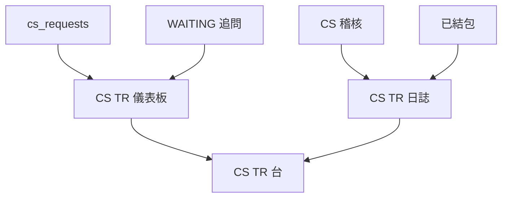

### 17.12 配套資料（BU／團隊／關卡／參數）

**頁面：** `/admin/cs-data`（`CsOpsDataView`）。**API：** `GET /api/cs?view=data`。來源：`lib/cs/ops-data.ts` 的 `getCsOpsContract()`，種子目錄 `lib/cs/params.ts`。

`ensureCsOrg`（`db.ts`）會 upsert：

| 種類 | 紀錄 |
|---|---|
| BU | `CUSTOMER_SERVICE`、`TRADING` |
| 團隊 | CS 24/7 台（`oc_cs_c1`）、**CS 核身庫**（`oc_cs_kyc`）、TR 成交支援（`oc_tr_dealing`） |
| POC | Maya Santos CS_LEAD、Elena Rossi CS_AGENT、Nadia Okonkwo CS_AGENT（核身）、Kenji Watanabe TR_LEAD、Omar Haddad TR_DEALER |
| 路徑 | `ESC-CS-24-7`、**`ESC-CS-KYC`**、`ESC-TR-DEAL`、`ESC-CS-RISK` 含關卡＋SLA |
| 設定 | `cs.followup_cap`、`cs.auto_reply_max_severity`、`cs.sensitive_categories`、`cs.wait_sla_minutes`、`cs.id_verify_sla_minutes`、`cs.tr_sla_minutes`、`cs.risk_sla_minutes`、`cs.intake_token`、`cs.mailbox_support`、`cs.mailbox_complaints`、`cs.lark_cs`／`_kyc`／`_tr` |
| 來源 | C1 閘道、網站表單、官方信箱、support@、complaints@、CS 核身庫（僅旗標）、MT4／MT5 成交帶 |

台面 `sendFollowupEmail` 讀 `getCsFollowupCap()`。進件標頭比對 `getCsIntakeToken()`。`cs_requests.assigned_bu` 蓋 CUSTOMER_SERVICE／TRADING／RISK_CONTROL。平台設定分組 **CS／TR 營運**。守門：`scripts/verify-cs-data.ts`。

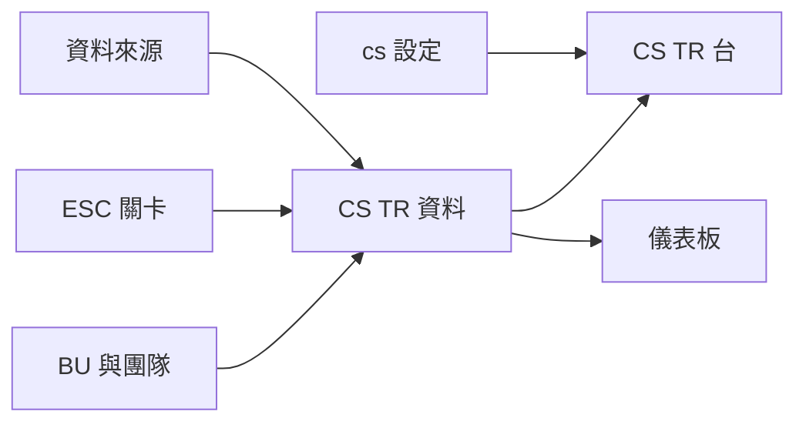

### 17.13 資料齊全後分析（分類／嚴重度／直回 vs POC）

**程式：** `lib/cs/analyze.ts`（`analyzeCsRequest`、`scoreSeverity`、`scoreSensitivity`、`isCollectedReply`）加上 `lib/cs/desk.ts` 的 `applyCsAnalysis`／`releasePocDraft`。**API：** `POST /api/cs` 動作 `analyze` 與 `poc_release`。原型啟發式 — **此路徑無正式 LLM**（與 `triageText` 相同）。守門：`scripts/verify-cs-analyze.ts`。

`applyTriage` 只在事實**齊全**時才分析：清晰度 `clear`，或等待迴圈回覆 ≥48 字且含 UID（`isCollectedReply`）。過短維持 `AWAITING_CLIENT`／`ID_VERIFY`。長 UID 回覆即使仍有核身關鍵字，也不再永遠重開 need-ID。

| 輸出 | 值 |
|---|---|
| `severity` | `LOW`／`MEDIUM`／`HIGH`／`CRITICAL` |
| `sensitivity` | `auto` 或 `poc` |
| `ai_solution`／`ai_draft` | 依類別＋技能的啟發式文案（FAQ／核身／投訴／成交／CRITICAL） |
| `poc_role`／`poc_name` | 敏感度為 `poc` 時來自 `CS_POC_SPECS` |

閘道：`cs.auto_reply_max_severity`（預設 `MEDIUM`）與 `cs.sensitive_categories`（預設 `complaint,kyc,trading`）。技能 `SKILL-CS-ID-VERIFY`、`SKILL-TR-EXECUTION`、`SKILL-CS-ESCALATE-RISK` 一律 `poc`（或升級）。

| 路徑 | CS 狀態 | 客戶信 |
|---|---|---|
| FAQ，嚴重度 ≤ 直回上限 | `AI_REPLIED` | 立刻 `EMAIL_OUT`（`CS_AI_REPLY`） |
| 核身／投訴 | `POC_REVIEW` | 暫扣；POC 補註後 `poc_release`（`CS_POC_RELEASE`） |
| 成交 | 維持 `ASSIGNED_TR` | 交 TR Dealer 補註 |
| CRITICAL／帳簿風險 | `ESCALATED_RISK` | 不直寄客戶 |

稽核：`CS_AI_ANALYZE`、`CS_AI_REPLY`、`CS_POC_REVIEW`、`CS_POC_RELEASE`。儀表板桶 `poc_review`、`ai_replied`、`by_severity`。

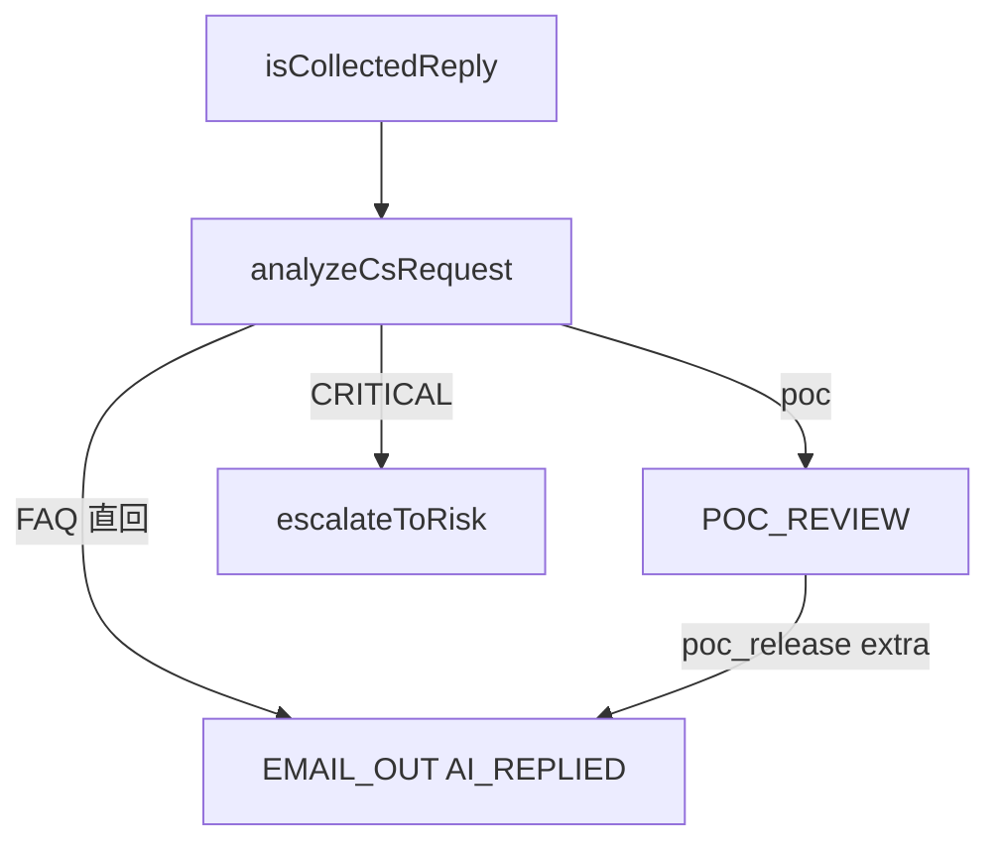

---

## 18. 文件控制

| 版次 | 日期 | 說明 |
|---|---|---|
| 1.0 | 2026-10-01 | 初版骨架 |
| 1.1 | 2026-10-01 | 完整 §8 AI Admin 管理頁規格 |
| 1.2 | 2026-10-01 | §9 挑戰者、§11 Messenger、§12 市場情報、文件／i18n／行動、重編號 |
| 1.3 | 2026-10-04 | 公開快照示範掃描、導覽分組、demo platform owner 負責人、Pages 登入 |
| 1.5 | 2026-10-04 | TSD 流程圖與序列圖；mermaid 改 SVG 渲染 |
| 1.6 | 2026-10-05 | 首頁脊柱、BU 與團隊、MonitorCode、propose_rag、ESC-DEFAULT、開放議題／進度 |
| 1.7 | 2026-10-05 | 稽核平面分流（CRMP／Vantage Markets 管理）＋回滾 API；可編輯角色；升級維度 × 係數 |
| 1.8 | 2026-10-05 | Monitor 中心 API（`run_detectors`／`toggle_pause`／`update_thresholds`）；即時警報與追蹤標籤；Key API 補 roles／org／rollback／escalation／ai-chat |
| 1.9 | 2026-10-06 | §17 CS／TR 台：C1／表單／信箱進件、AI 追問直到客戶回覆（上限 3）、TR 分流、升級風控 |
| 2.0 | 2026-10-06 | CRMP Plus 一體平台；公開 `basePath` `/PRD/crmp-plus/`；原 CRMP 管理後台凍結於 `/PRD/crmp-admin/` |
| 2.1 | 2026-10-06 | §17.4 CS／TR 專用 SKILL.md；知識樹 CS_SERVICE／TRADING_EXEC；RAG cs-* 葉；UAT-50 |
| 2.2 | 2026-10-06 | §17.2 公開 `/cs` 入口＋進件回覆對案（CSR-XXXX／channel_ref／In-Reply-To）；GET 進件目錄；FR-40 |
| 2.3 | 2026-10-06 | §17.5–17.10 綱要、模組地圖、等待迴圈狀態、`/cs` 入口、網址目錄、PRD FR-37…43 追溯 |
| 2.4 | 2026-10-06 | §17.11 專用 CS／TR 儀表板＋日誌；FR-44；UAT-51 |
| 2.5 | 2026-10-06 | §17.12 CS／TR 配套資料（BU／核身庫／關卡／`cs.*`）；FR-45；UAT-52 |
| 2.6 | 2026-10-06 | §17.13 資料齊全後分析（分類／嚴重度／直回 vs POC）；FR-46；UAT-53 |
| 2.7 | 2026-10-07 | §13 行動：CS／TR 台列表→案件＋儀表板／日誌／資料卡片雙檔；FR-14；UAT-18 |

**負責人：** demo platform owner（`haixiang.yan@hytechc.com`）  
**對應文件：** [English TSD](./TSD.md) · 渲染於 `/admin/docs/tsd`
