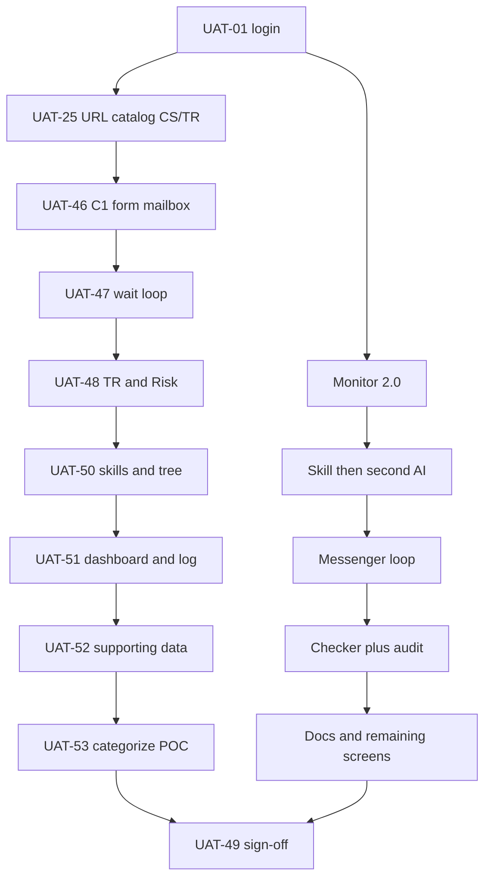

# CRMP UAT Pack — Risk Owner

**Document ID:** CRMP-UAT-001 · **Version:** 2.7 · **Date:** 2026-10-06 · **Interactive demo:** [/admin/docs/uat](/admin/docs/uat)

**Scope:** CRMP Plus at `/PRD/crmp-plus/` only. Original CRMP Admin at `/PRD/crmp-admin/` stays frozen.

In plain English: this is not a developer smoke test. It is the Risk Owner script for walking the whole admin desk and the Lark-style messenger, with evidence. The **CS/TR feature catalogue** below is the index of the new 24/7 door — not extra numbered cases.

Execute **in sequence**. Critical predecessors must Pass before later Critical cases. Record PASS / FAIL / WAIVE plus evidence in Audit notes. The on-page tally lives only in this browser session; formal sign-off is the last case (UAT-49). There is **no UAT-45**.

## Timing model
- `T+0` = Risk Owner starts UAT session.
- Each case has a suggested start offset and duration.
- Full pack suggested window ≈ **10.3 hours** (52 cases; UAT-45 is unused).

## Coverage

Messenger (inbox, evidence, chatbot challenge, escalate, false alarm, close, recommended controls, sync, closed-thread persistence) plus **CS / TR Desk** (C1 live chat, web form, official email intake; dedicated SKILL.md playbooks; AI follow-up until the client replies, cap from `cs.followup_cap`; **categorize / severity / auto-reply vs named POC**; TR routing; **dashboard, log and supporting data**) plus every left-nav admin screen: Home (spine stage ticket counts — no Spine Log tab), Daily Performance (**not** CS/TR dashboard), Risk Log (**not** CS_* log), Monitor 2.0, Market Intelligence, Realtime Alert & Tracker, Risk Domains, AI Admin, Skills, Knowledge Tree, RAG (human-gate), Human Intervention, Lark (`oc_cs_c1` / `oc_cs_kyc` / `oc_tr_dealing`), Escalation Routes (dimensions × coefficients · ESC-DEFAULT · ESC-CS-24-7 · ESC-CS-KYC · ESC-TR-DEAL · ESC-CS-RISK), BU and Teams (CS KYC Vault nested under Customer Service) / editable Roles / Users, Data Sources (KYC vault flags + MT4/MT5 tape), AI Access, Audit (CRMP / Vantage Markets Admin tabs + Roll back), Platform Settings (`cs.*` group including `cs.auto_reply_max_severity`), User Guide §9.3 / PRD §6.5 / TSD §17 / UAT / Ecosystem / Roadmap / Open Issues / Progress / URL Catalog, login, and unread badges including CS/TR surfaces.

## CS/TR feature catalogue

Interactive twin: filter **CS/TR** on [/admin/docs/uat](/admin/docs/uat) (`data-testid="uat-cs-catalogue"`). Eight **primary** cases prove the new functions. Ten **support** cases prove the rest of the desk still names those surfaces.

| Kind | ID | Feature | Screens / URLs | FR |
|---|---|---|---|---|
| primary | UAT-25 | URL Catalog CS/TR section + public Pages URLs | `/cs`, desk, dashboard, log, data, five SKILL.md, RAG leaves, intake API | FR-43 |
| primary | UAT-46 | C1 live chat, website form, official mailbox, `/cs` portal | CS / TR Desk, CS client portal, URL Catalog, BU and Teams | FR-37, FR-40 |
| primary | UAT-47 | Auto-email wait loop and ID verify (cap from `cs.followup_cap`) | CS / TR Desk, Audit Log, CS KYC Vault | FR-41 |
| primary | UAT-48 | TR dealing handoff and book-risk escalate | CS / TR Desk, Demo Messenger | FR-38 |
| primary | UAT-50 | Dedicated SKILL.md playbooks, `CS_SERVICE` / `TRADING_EXEC` tree | CS / TR Desk, AI Skills, Knowledge Tree, RAG | FR-39 |
| primary | UAT-51 | Dedicated CS/TR dashboard and log (not Daily Performance / Risk Log) | `/admin/cs-dashboard`, `/admin/cs-log` | FR-44 |
| primary | UAT-52 | Supporting data: BUs, CS KYC Vault, four hops, `cs.*` parameters | `/admin/cs-data`, Settings, BU and Teams, Escalation Routes | FR-45 |
| primary | UAT-53 | Categorize, severity, AI solution, auto-reply vs named POC review | CS / TR Desk, CS / TR Dashboard, Platform Settings | FR-46 |
| support | UAT-17 | EN / 繁中 docs including UG §9.3 and this catalogue | User Guide, PRD, TSD, UAT Checklist | FR-43 |
| support | UAT-22 | Unread badges on CS/TR desk, dashboard, log and data | Admin Home, CS / TR surfaces | FR-37 |
| support | UAT-27 | Home shortcuts to CS/TR desk, dashboard, log, data and `/cs` | Admin Home | FR-37 |
| support | UAT-28 | Daily Performance stays CFD/crypto — not the CS/TR dashboard | Daily Performance vs `/admin/cs-dashboard` | FR-44 |
| support | UAT-29 | Risk Log stays Monitor closures — not the CS_* log | Risk Log vs `/admin/cs-log` | FR-44 |
| support | UAT-36 | Lark channels `oc_cs_c1` / `oc_cs_kyc` / `oc_tr_dealing` | Lark Integration | FR-45 |
| support | UAT-37 | Hops `ESC-CS-24-7` / `ESC-CS-KYC` / `ESC-TR-DEAL` / `ESC-CS-RISK` | Escalation Routes, CS / TR Data | FR-39, FR-45 |
| support | UAT-38 | BU and Teams — CS KYC Vault nested under Customer Service | BU and Teams, CS / TR Data | FR-45 |
| support | UAT-39 | Data sources — KYC vault flags + MT4/MT5 dealing tape | Data Sources, CS / TR Data | FR-45 |
| support | UAT-40 | Platform Settings CS / TR operations group (`cs.*`) | Platform Settings `#settings-cs`, CS / TR Data | FR-45 |

### Public URLs (CS/TR)

Permanent Pages origin: `https://hxyan2020.github.io/PRD/crmp-plus/`.

| Surface | Path |
|---|---|
| Client portal | `/cs` |
| CS / TR Desk | `/admin/cs-desk` |
| CS / TR Dashboard | `/admin/cs-dashboard` |
| CS / TR Log | `/admin/cs-log` |
| CS / TR Data | `/admin/cs-data` |
| Intake API | `POST /api/cs/intake` · `GET /api/cs/intake` |
| Payloads | `GET /api/cs?view=dashboard` · `log` · `data` |

## Summary matrix

| Seq | ID | T+ start | Dur | Severity | Responsible BU | Dependency | Title | Covers |
|---|---|---|---|---|---|---|---|---|
| 01 | UAT-01 | 0m | 12m | Critical | System + Risk Owner | Seeded users; app running | Sign in and check who is allowed to do what | Admin Home, Login, Roles |
| 02 | UAT-02 | 12m | 10m | Critical | Risk | UAT-01; Monitor indicators seeded | Monitor 2.0 indicators that feed the demo alarms | Monitor 2.0, Realtime Alert & Tracker |
| 03 | UAT-03 | 22m | 15m | Critical | AI + Risk | UAT-02; AI skills seeded | Run a skill playbook on a copy-trading breach | Realtime Alert & Tracker, AI Skills |
| 04 | UAT-04 | 37m | 15m | Critical | AI + Risk Owner | UAT-03 or any BREACH/CRITICAL analysis | Second AI challenges the first AI on serious alarms | Realtime Alert & Tracker |
| 05 | UAT-05 | 52m | 10m | High | AI | UAT-02; default second-AI threshold = BREACH | A WARN-only case must not call the second AI | Realtime Alert & Tracker |
| 06 | UAT-06 | 62m | 12m | High | AI + Risk | RAG corpus seeded | When no skill fits, the AI reasons from the knowledge base | Realtime Alert & Tracker, RAG Knowledge Base |
| 07 | UAT-07 | 74m | 12m | High | Risk | UAT-03/04; Demo Messenger | Messenger — pull the evidence pack into the chat | Demo Messenger, Realtime Alert & Tracker |
| 08 | UAT-08 | 86m | 10m | High | Risk Analyst + Risk Owner | UAT-07; open messenger thread | Messenger — argue with the bot in the same thread | Demo Messenger, Realtime Alert & Tracker |
| 09 | UAT-09 | 96m | 10m | High | Risk | Escalation routes seeded; open thread | Messenger — escalate up the decision chain | Demo Messenger, Escalation Routes |
| 10 | UAT-10 | 106m | 8m | Medium | Risk | Separate OPEN WARN thread (do not use the Critical sample) | Messenger — dismiss a false alarm | Demo Messenger, Realtime Alert & Tracker |
| 11 | UAT-11 | 114m | 10m | Critical | Risk Owner | UAT-04 dual-AI pack reviewed on a BREACH thread | Messenger — close the case after accepting the AI pack | Demo Messenger, Realtime Alert & Tracker |
| 12 | UAT-12 | 124m | 15m | Critical | Ops + Risk Owner | OPEN thread; Human Intervention page | Messenger — propose a control, double-check, then send to admin | Demo Messenger, Human Intervention |
| 13 | UAT-13 | 139m | 20m | Critical | AI Engineer + Risk Owner | Two distinct users with ai.admin / checker capability | AI Admin — the person who proposes a change cannot approve it | AI Admin, Users, Audit Log |
| 14 | UAT-14 | 159m | 12m | Medium | Risk + AI | market_intel.enabled=true | Market Intelligence — Scan now must finish (including on GitHub Pages) | Market Intelligence, Demo Messenger |
| 15 | UAT-15 | 171m | 10m | High | System + Security | AI access blocklist seeded | AI must not be allowed near human-only data | AI Access Security |
| 16 | UAT-16 | 181m | 15m | High | System | UAT-07 through UAT-12 performed | Audit Log and home spine tell the same story as messenger | Audit Log, Admin Home spine |
| 17 | UAT-17 | 196m | 10m | Low | All | Docs published under /admin/docs/* | English and Traditional Chinese documentation both render | User Guide, PRD, TSD, UAT Checklist, Ecosystem Eval |
| 18 | UAT-18 | 206m | 15m | Medium | All | Responsive admin shell | Phone-width smoke test (~390px) | Admin Home, Demo Messenger, Realtime Alert & Tracker, CS / TR Desk |
| 19 | UAT-19 | 221m | 10m | Medium | Risk Owner | UAT-04 samples in window | Every serious analysis in this UAT window has a second AI | Realtime Alert & Tracker |
| 20 | UAT-20 | 231m | 12m | High | Risk + AI | Skills catalog seeded | Skill cards stay short; Enter opens the full playbook | AI Skills |
| 21 | UAT-21 | 243m | 8m | High | Risk | UAT-07; public Pages URL | Messenger “Open in admin” lands on a real analysis | Demo Messenger, AI analysis detail (/admin/ai-analyses/[id]) |
| 22 | UAT-22 | 251m | 8m | Medium | All | Left nav shell | Unread counts on the left pane (messenger-style) | Admin Home, Realtime Alert & Tracker, Demo Messenger, Market Intelligence, CS / TR Desk, CS / TR Dashboard, CS / TR Log, CS / TR Data |
| 23 | UAT-23 | 259m | 10m | Medium | AI + Risk | RAG + skills seeded | Knowledge tree shows how domains, skills and documents connect | Knowledge Tree, AI Skills, RAG Knowledge Base |
| 24 | UAT-24 | 269m | 12m | High | All | EN / 繁中 toggle in shell | Traditional Chinese covers chrome, messenger, skills and docs | Admin Home, Demo Messenger, AI Skills, UAT Checklist |
| 25 | UAT-25 | 281m | 8m | Medium | System | URL catalog | URL catalog lists the public pages (including CS/TR door and playbooks) | URL Catalog, CS / TR Desk, CS client portal, CS / TR Dashboard, CS / TR Log, CS / TR Data, AI Skills, Knowledge Tree, Demo Messenger |
| 26 | UAT-26 | 289m | 12m | Medium | Risk + System | Messenger + alerts + spine | Tell the messenger loop out loud, in plain English | Demo Messenger, Admin Home spine, Audit Log, Realtime Alert & Tracker |
| 27 | UAT-27 | 301m | 10m | Medium | System + Risk Owner | UAT-01 | Admin Home — cards, shortcuts and platform owner | Admin Home, Daily Performance, Users, URL Catalog, CS / TR Desk, CS / TR Dashboard, CS / TR Log, CS / TR Data |
| 28 | UAT-28 | 311m | 10m | Medium | Risk | UAT-01; daily dashboard seeded | Daily Performance — CFD and Crypto desk numbers | Daily Performance, CS / TR Dashboard |
| 29 | UAT-29 | 321m | 10m | Medium | Risk | UAT-02 | Risk Log Analytics — what actually moved P&L / clients | Risk Log Analytics, CS / TR Log |
| 30 | UAT-30 | 331m | 10m | High | Risk | UAT-02; Realtime Alert & Tracker queue | Realtime Alert & Tracker — read the queue and acknowledge one | Realtime Alert & Tracker |
| 31 | UAT-31 | 341m | 12m | High | Risk + AI | UAT-02; detectors seeded | Monitor 2.0 — run indicators and see WARN/BREACH land | Monitor 2.0, Realtime Alert & Tracker |
| 32 | UAT-32 | 353m | 8m | Low | Risk | UAT-01 | Risk domains catalogue with P0–P3 scenarios | Risk Domains |
| 33 | UAT-33 | 361m | 12m | High | Risk | UAT-07 | Messenger inbox — channels, kinds and Sync | Demo Messenger |
| 34 | UAT-34 | 373m | 12m | High | Ops + Risk | UAT-12; OPEN thread with recommended actions | Messenger — other recommended actions and cancel | Demo Messenger, Human Intervention |
| 35 | UAT-35 | 385m | 10m | High | Ops + Risk Owner | UAT-12 or UAT-34 | Human Intervention queue (the admin side of messenger controls) | Human Intervention |
| 36 | UAT-36 | 395m | 10m | Medium | System + Risk | UAT-01; lark channels seeded | Lark Integration — channels vs the in-app messenger demo | Lark Integration, Demo Messenger |
| 37 | UAT-37 | 405m | 8m | Medium | Risk | UAT-09 | Escalation routes registry | Escalation Routes, CS / TR Data |
| 38 | UAT-38 | 413m | 15m | Medium | System + Risk Owner | UAT-01 | Organisation — BU and Teams, users and roles | BU and Teams, Users, Roles & Permissions, CS / TR Data |
| 39 | UAT-39 | 428m | 8m | Low | System | UAT-01 | Data sources registry (internal and external) | Data Sources, CS / TR Data |
| 40 | UAT-40 | 436m | 10m | Medium | System | UAT-01; settings.manage or read | Platform settings are grouped (not a flat dump) | Platform Settings, CS / TR Data |
| 41 | UAT-41 | 446m | 10m | Medium | AI + Risk | UAT-06; RAG seeded | RAG Knowledge Base — browse the corpus the AI cites | RAG Knowledge Base |
| 42 | UAT-42 | 456m | 8m | Low | All | Docs published | Improvement roadmap is readable | Improvement Roadmap |
| 43 | UAT-43 | 464m | 10m | Critical | System + Platform owner | Public snapshot or local login | Public snapshot — Sign in works and stays on demo platform owner | Login, Admin Home |
| 44 | UAT-44 | 474m | 10m | High | Risk + System | UAT-11 or UAT-10 | Messenger — closed threads stay closed after refresh | Demo Messenger |
| 46 | UAT-46 | 484m | 12m | High | CS + System | UAT-01; CS/TR desk seeded | CS/TR — C1, form and official email land in realtime | CS / TR Desk, URL Catalog, BU and Teams |
| 47 | UAT-47 | 496m | 15m | Critical | CS | UAT-46; follow-up seed cases | CS/TR — AI emails when unclear or ID is needed, then waits | CS / TR Desk, Audit Log, CS KYC Vault |
| 48 | UAT-48 | 511m | 12m | High | CS + TR | UAT-46; trading seed case | CS/TR — trading cases go to TR; book-risk escalates to Risk | CS / TR Desk, Demo Messenger |
| 50 | UAT-50 | 523m | 12m | High | CS + AI | UAT-46; skills + RAG seeded | CS/TR — dedicated SKILL.md playbooks stamp the desk and enrich the tree | CS / TR Desk, AI Skills, Knowledge Tree, RAG Knowledge Base |
| 51 | UAT-51 | 535m | 12m | High | CS | UAT-46; CS/TR dashboard + log seeded | CS/TR — dedicated dashboard and log, not Daily Performance or Risk Log | CS / TR Dashboard, CS / TR Log |
| 52 | UAT-52 | 547m | 12m | High | CS + System | UAT-46; CS/TR org + settings seeded | CS/TR — supporting data: BUs, KYC vault, hops and cs.* parameters | CS / TR Data, Platform Settings, BU and Teams, Escalation Routes |
| 53 | UAT-53 | 559m | 12m | High | CS + TR | UAT-47; facts collected after wait loop | CS/TR — categorize, severity, AI solution, auto-reply vs POC review | CS / TR Desk, CS / TR Dashboard, Platform Settings |
| 49 | UAT-49 | 571m | 15m | Critical | Risk Owner | UAT-01–53 results recorded | Risk Owner exit sign-off | UAT Checklist, Audit Log |

## Cases (step by step)

### UAT-01 — Sign in and check who is allowed to do what

- **Severity:** Critical · **BU:** System + Risk Owner · **Depends:** Seeded users; app running · **Window:** T+0m / 12m
- **Covers:** Admin Home, Login, Roles
- **Why:** If the wrong person can open AI Admin or a Risk Owner cannot get in, the rest of UAT is unsafe.
- **Goal:** Prove the Risk Owner can enter admin, and a read-only Viewer cannot open privileged screens.

**Steps**

1. Open the Sign in page from the left pane (or go to /login). On the public GitHub Pages snapshot the address is /PRD/crmp-plus/login/ — it must not be a 404.
2. Sign in as risk.owner@vantagemarkets.com with password risk123. You should land on Admin Home, not an error page.
3. Look at the left pane: your name and role RISK_OWNER (or similar) should show. Department cards / RACI should be visible on Home.
4. Sign out. Sign in as viewer@vantagemarkets.com with password view123.
5. Try to open AI Admin from the left pane or by typing /admin/ai-admin. You should be sent away or told you are not allowed — you must not see the maker/checker form.
6. Sign back in as the Risk Owner (or Super Admin if your session was delegated) before the next cases.

**Pass:** Risk Owner reaches Admin Home. Viewer cannot operate AI Admin. Login page never 404s.
**Evidence:** Screenshot of Admin Home while signed in as Risk Owner, plus Viewer denied; Audit LOGIN rows if you are on localhost.

### UAT-02 — Monitor 2.0 indicators that feed the demo alarms

- **Severity:** Critical · **BU:** Risk · **Depends:** UAT-01; Monitor indicators seeded · **Window:** T+12m / 10m
- **Covers:** Monitor 2.0, Realtime Alert & Tracker
- **Why:** Messenger and AI RCA are useless if the underlying CFD/Crypto indicators are missing.
- **Goal:** Confirm the demo desk has the equity, margin and copy-trading indicators, and that Realtime Alert & Tracker actually lists alarms.

**Steps**

1. Open Monitor 2.0 from the left pane (Monitor & risk group). Confirm it is a single indicator + detector registry (Run all / Sync / Pause) — there are no Alerts/Tickets tabs here; open work lives on Realtime Alert & Tracker.
2. Find these codes (search on the page or scroll): M2-EQ-001 (equity/drawdown), M2-MRG-014 (margin), M2-COPY-009 (copy concentration). Note the product (CFD or Crypto), risk domain, and detector code next to each.
3. Open Realtime Alert & Tracker (left nav — not a Monitor 2.0 tab). You should see a list of cards with severity (CRITICAL / BREACH / WARN), status (OPEN and so on), and a Monitor ticket id.
4. Write down how many OPEN (or ACKNOWLEDGED) alerts you see. That number is your baseline for later cases.

**Pass:** At least one indicator each for equity, margin and copy concentration. Monitor has no Alerts/Tickets tabs. Realtime Alert & Tracker page loads with real rows.
**Evidence:** The three indicator IDs in your notes; baseline open-alert count.

### UAT-03 — Run a skill playbook on a copy-trading breach

- **Severity:** Critical · **BU:** AI + Risk · **Depends:** UAT-02; AI skills seeded · **Window:** T+22m / 15m
- **Covers:** Realtime Alert & Tracker, AI Skills
- **Why:** When we already know the failure pattern, the first AI should follow the written skill — not invent a story. Every new analysis also needs a how-to-improve review you can argue with.
- **Goal:** Prove the COPY breach simulation uses the matching skill playbook, stores evidence, and opens an improvement chatbot.

**Steps**

1. Open Realtime Alert & Tracker.
2. Use the AI pipeline controls to click “Simulate COPY breach (skill path)”. Wait until a new analysis opens (or the list refreshes with a new row).
3. On the detail page, the mode badge should say SKILL_MATCH (this means “we used a known playbook”, not free-form guessing). Confidence should look certain (around 100%).
4. Scroll to Evidence vault. You must see at least a SKILL row (which playbook ran) and a MONITOR row (the alarm snapshot).
5. Find the panel **AI analysis — how to improve**. It must list items such as add a data source, check a dormant indicator, missing reasoning, a new skill pattern, tighten limit X→Y, and/or faster manual response. Evidence vault should also have an IMPROVEMENT row.
6. In the chatbot: **Pull data**, then **Add fact** (e.g. feed was stale 9 minutes), **Challenge reasoning**, **Regenerate**, and confirm the plan updates. You may **Mark satisfactory** when done.
7. Copy the analysis id from the title (looks like ANL-…). You will paste it into messenger and audit cases later.

**Pass:** Mode is SKILL_MATCH; evidence includes SKILL, MONITOR and IMPROVEMENT; how-to-improve chatbot can pull/add/challenge/regenerate; analysis id is written in your notes.
**Evidence:** analysis id; screenshot of the mode badge, evidence types, and the how-to-improve chatbot.

### UAT-04 — Second AI challenges the first AI on serious alarms

- **Severity:** Critical · **BU:** AI + Risk Owner · **Depends:** UAT-03 or any BREACH/CRITICAL analysis · **Window:** T+37m / 15m
- **Covers:** Realtime Alert & Tracker
- **Why:** One model can be over-confident. On BREACH or CRITICAL we need an independent second opinion before a human accepts the story.
- **Goal:** Open a high-severity analysis and confirm the challenger panel, verdict, and at least one high-priority improvement are present.

**Steps**

1. Stay on Realtime Alert & Tracker. Expand a card or open a BREACH or CRITICAL row (or click Simulate CRITICAL if you need a fresh one).
2. In the list, the row should show a “2nd AI” badge with a verdict such as AGREE, PARTIAL or DISAGREE.
3. On the detail page find the panel titled Second AI challenger (model name crmp-challenger-v0).
4. Read it in plain language: what it likes, what it doubts, and the suggested improvements. If the verdict is PARTIAL or DISAGREE, it should say a human must review (needs_human).
5. Evidence vault must contain a CHALLENGER row so the debate is stored, not only shown on screen.

**Pass:** Challenger panel is visible with a verdict; at least one HIGH improvement; CHALLENGER evidence row exists.
**Evidence:** challenge id and verdict; screenshot of the improvements list.

### UAT-05 — A WARN-only case must not call the second AI

- **Severity:** High · **BU:** AI · **Depends:** UAT-02; default second-AI threshold = BREACH · **Window:** T+52m / 10m
- **Covers:** Realtime Alert & Tracker
- **Why:** Second AI costs time. It should stay quiet on ordinary warnings so operators are not flooded.
- **Goal:** Simulate a WARN equity/drawdown path and confirm the challenger did not run.

**Steps**

1. On Realtime Alert & Tracker, use the AI pipeline controls to click “Simulate EQ drawdown (RAG path)” (WARN).
2. Open the new analysis.
3. The Second AI panel should say it was not run (or there is no 2nd AI verdict badge).
4. Evidence vault should not have a CHALLENGER row for this WARN-only sample.

**Pass:** No challenger row on the WARN sample while the threshold is still BREACH.
**Evidence:** analysis id; screenshot of the “Not run” challenger panel.

### UAT-06 — When no skill fits, the AI reasons from the knowledge base

- **Severity:** High · **BU:** AI + Risk · **Depends:** RAG corpus seeded · **Window:** T+62m / 12m
- **Covers:** Realtime Alert & Tracker, RAG Knowledge Base
- **Why:** Not every alarm has a canned playbook. The desk still needs a readable explanation plus sources.
- **Goal:** Run the RAG path and confirm the analysis is marked RAG_REASONING with at least one explanation and some evidence.

**Steps**

1. Use the EQ WARN / RAG simulate button, or open an analysis whose indicator has no certain skill match.
2. Confirm the mode badge is RAG_REASONING (meaning “we retrieved documents and reasoned”, not a skill hit).
3. Read at least one explanation / hypothesis in ordinary language.
4. Evidence vault is not empty — expect MONITOR and/or EXTERNAL/RAG document rows. Optionally open RAG Knowledge Base and confirm those document titles exist.

**Pass:** Mode RAG_REASONING; at least one explanation; evidence present.
**Evidence:** analysis id; mode badge; evidence list screenshot.

### UAT-07 — Messenger — pull the evidence pack into the chat

- **Severity:** High · **BU:** Risk · **Depends:** UAT-03/04; Demo Messenger · **Window:** T+74m / 12m
- **Covers:** Demo Messenger, Realtime Alert & Tracker
- **Why:** Risk staff should not have to leave the conversation to see why the AI said what it said.
- **Goal:** From Demo Messenger, put the evidence vault into the same thread and prove the admin link works.

**Steps**

1. Open Demo Messenger (left pane → Response). On GitHub Pages the URL is /PRD/crmp-plus/admin/messenger/.
2. The left column is the inbox. You should already see seeded chats. If it is empty, click Sync alerts and wait until at least one OPEN thread appears.
3. Click a serious (BREACH/CRITICAL) thread. In the transcript you should see coloured bubbles: ALERT (the alarm), often AI_REPORT (the first AI write-up), sometimes ESCALATION.
4. Click Show evidence. A new EVIDENCE bubble must appear in the same thread within about 10 seconds.
5. Read that bubble: it should list vault lines (monitor snapshot, RAG, or external). Click Open in admin — it must open the matching AI analysis, not a 404, and not drop the /PRD/crmp-plus prefix on Pages.

**Pass:** EVIDENCE message appears; Open in admin shows the matching analysis pack.
**Evidence:** thread id; screenshot of the EVIDENCE bubble and the analysis page it opened.

### UAT-08 — Messenger — argue with the bot in the same thread

- **Severity:** High · **BU:** Risk Analyst + Risk Owner · **Depends:** UAT-07; open messenger thread · **Window:** T+86m / 10m
- **Covers:** Demo Messenger, Realtime Alert & Tracker
- **Why:** Operators must be able to say “I disagree” without opening a separate ticket system.
- **Goal:** Type a challenge in the composer and confirm the bot replies and flags the case for a human.

**Steps**

1. Stay in the same OPEN thread.
2. In the chat box at the bottom type exactly this idea in your own words, e.g. “I disagree with the AI — please review feed integrity”. Click Send.
3. Your message appears on the right (USER). A CHATBOT reply should appear underneath, acknowledging the challenge.
4. If the thread is linked to an analysis, open that analysis (Open in admin) and confirm it is flagged for human review (needs_human, or explicit “human review” wording).

**Pass:** USER + CHATBOT pair recorded; linked analysis asks for human review.
**Evidence:** Screenshot of the USER/CHATBOT pair; analysis human-review state.

### UAT-09 — Messenger — escalate up the decision chain

- **Severity:** High · **BU:** Risk · **Depends:** Escalation routes seeded; open thread · **Window:** T+96m / 10m
- **Covers:** Demo Messenger, Escalation Routes
- **Why:** Serious cases must move to the next accountable team with a visible SLA, not a private phone call.
- **Goal:** Click Escalate twice and show that the bird-eye POC windows relay the case to the next named owner.

**Steps**

1. On an OPEN thread, read the bird-eye path chips (POC 1 → 2 → 3 → 4). The first hop chat should hold the alert + AI report.
2. Click Escalate. The live window moves to the next POC. The previous hop shows a hand-off bubble; the next hop shows a received bubble.
3. Click Escalate again. The step index must increase and a third POC window becomes Live.
4. Optional: open Escalation Routes in the left pane and confirm the same path name exists as a configured route.

**Pass:** Two escalations move Live from hop to hop; each window keeps its own chat; path chips name the POCs.
**Evidence:** Screenshots after step 1 and step 2; route name in notes.

### UAT-10 — Messenger — dismiss a false alarm

- **Severity:** Medium · **BU:** Risk · **Depends:** Separate OPEN WARN thread (do not use the Critical sample) · **Window:** T+106m / 8m
- **Covers:** Demo Messenger, Realtime Alert & Tracker
- **Why:** Noise must be closable in one click, with an audit trail, so real breaches are not buried.
- **Goal:** On a disposable WARN thread, dismiss it as a false alarm and confirm the chat and the linked alert both close.

**Steps**

1. Pick a different OPEN WARN thread — not the BREACH you still need for later cases.
2. Click Dismiss (false alarm).
3. The thread status badge becomes DISMISSED. The action buttons (Show evidence, Escalate, Dismiss, Close) should disable.
4. If you are on localhost, open Realtime Alert & Tracker and confirm the linked alarm is CLOSED (or equivalent). On the public snapshot, the SYSTEM bubble saying the alert closed is enough.

**Pass:** Thread DISMISSED; linked alert closed or SYSTEM message says so; action audited on localhost.
**Evidence:** thread id before/after; Audit MESSENGER_DISMISS on localhost.

### UAT-11 — Messenger — close the case after accepting the AI pack

- **Severity:** Critical · **BU:** Risk Owner · **Depends:** UAT-04 dual-AI pack reviewed on a BREACH thread · **Window:** T+114m / 10m
- **Covers:** Demo Messenger, Realtime Alert & Tracker
- **Why:** The Risk Owner needs a clean “we accept this explanation” button that does not delete the evidence.
- **Goal:** Close a reviewed BREACH thread and confirm the AI analysis still holds the challenger pack.

**Steps**

1. Open a BREACH thread whose dual-AI pack you already read (not the dismissed WARN).
2. Click Close (accept AI).
3. Status becomes CLOSED. Buttons for evidence/escalate/dismiss/close disable.
4. Click Open in admin (or reopen the analysis from Realtime Alert & Tracker — expand the alert card). Evidence vault and the second-AI panel must still be there — closing the chat must not wipe the science pack.

**Pass:** Thread CLOSED; analysis evidence retained; localhost Audit shows MESSENGER_CLOSE.
**Evidence:** thread id; analysis detail still showing the challenger panel.

### UAT-12 — Messenger — propose a control, double-check, then send to admin

- **Severity:** Critical · **BU:** Ops + Risk Owner · **Depends:** OPEN thread; Human Intervention page · **Window:** T+124m / 15m
- **Covers:** Demo Messenger, Human Intervention
- **Why:** Freezing an account is dangerous. The chat must ask “are you sure?” and may need a second person (checker) before anything is sent to Vantage admin.
- **Goal:** From Recommended actions, block an account with a two-step confirm and follow the checker path when the system asks.

**Steps**

1. Open (or Sync) an OPEN thread that still shows Recommended actions at the bottom: Block user account, Halt trading, Cut max leverage, and similar.
2. Click Block user account. A proposal card appears (ACTION_PROPOSAL / “Confirm …”).
3. Click Double-confirm… then Yes, send to Vantage admin. You should get an ACTION_RESULT with an admin reference number and a link to Human Intervention.
4. If the card says a checker is needed, either click Checker approve (demo) or Open admin and finish it on Human Intervention.
5. Open Human Intervention from the left pane and find the same reference. Prototype note: a simulated admin_ref is acceptable; a real freeze is out of scope.

**Pass:** Admin ref created; confirm gate shown before send; checker follow-up when required.
**Evidence:** admin_ref; screenshots of proposal → confirm → result.

### UAT-13 — AI Admin — the person who proposes a change cannot approve it

- **Severity:** Critical · **BU:** AI Engineer + Risk Owner · **Depends:** Two distinct users with ai.admin / checker capability · **Window:** T+139m / 20m
- **Covers:** AI Admin, Users, Audit Log
- **Why:** A single engineer must not silently retune models or thresholds that drive live RCA.
- **Goal:** Propose a harmless setting as Maker, fail to self-approve, then approve as a different Checker.

**Steps**

1. Sign in as the AI Engineer (ai.engineer@vantagemarkets.com / ai123) if that seed user exists; otherwise use a second admin account.
2. Open AI Admin. Propose a harmless change (for example a comment on a model row, or a threshold you will revert).
3. Try to approve the same change while still that user. The UI must refuse.
4. Sign in as a different checker-capable user (Risk Owner or Super Admin).
5. Approve the pending change. Confirm it applies only after that second approval.
6. On localhost, open Audit Log and find both the propose and the approve rows (two different actors).

**Pass:** Self-approve blocked; distinct checker succeeds; audit shows maker and checker.
**Evidence:** Change request id; Audit entries for propose + approve.

### UAT-14 — Market Intelligence — Scan now must finish (including on GitHub Pages)

- **Severity:** Medium · **BU:** Risk + AI · **Depends:** market_intel.enabled=true · **Window:** T+159m / 12m
- **Covers:** Market Intelligence, Demo Messenger
- **Why:** The 5-minute news scan is how LP-moving headlines reach messenger. A stuck “Failed” button hides risk.
- **Goal:** Click Scan now and get either a scan id (localhost) or a clear read-only snapshot message (Pages) — never a blank failure.

**Steps**

1. Open Market Intelligence.
2. Confirm the pulse panel: a past-hour headline, a past-24h headline, and sentiment bars for core Vantage instruments (EURUSD, XAUUSD, NAS100, BTCUSD and the rest of the desk book).
3. Click Scan now.
4. On localhost: a success line with a scan_id should appear even if zero new findings (duplicates in the 5-minute bucket are OK). If a source times out, the scan still finishes or shows a plain-English error — not a silent fail.
5. On the GitHub Pages snapshot: Scan now must explain that the snapshot is read-only and still show seeded findings. It must not sit on HTTP 405/404 from a missing /api. Pulse windows may be anchored to the latest finding if the snapshot is older than 24h.
6. Open the Findings tab and the Messenger outbox tab. Cards should still render (headline, product, impact — not “violation”). Each card shows a region flag, timestamp, and source **article** URLs (not a channel homepage). Clicking a pulse headline should jump to that finding.

**Pass:** Scan produces a scan_id locally, or a clear snapshot message on Pages; the board never stays on “Failed”.
**Evidence:** scan_id or snapshot message; screenshot of findings or the empty-scan log.

### UAT-15 — AI must not be allowed near human-only data

- **Severity:** High · **BU:** System + Security · **Depends:** AI access blocklist seeded · **Window:** T+171m / 10m
- **Covers:** AI Access Security
- **Why:** Passwords, HR fields and similar must stay on a blocklist so a future agent cannot read them.
- **Goal:** Review the AI Access Security page and confirm pages, functions and fields each list human-only items with a reason.

**Steps**

1. Open AI Access Security (Platform group).
2. Look at the three sections: pages, functions, fields.
3. Search or scan for a sensitive example such as users.password (or equivalent).
4. Every blocked item should have a short reason in plain English (why AI is denied).
5. Record that production IAM must not grant these to any AI identity.

**Pass:** Blocklist UI lists human-only items with reason text; at least one sensitive field example is present.
**Evidence:** Screenshot of blocklist rows; counts of page/function/field items.

### UAT-16 — Audit Log and home spine tell the same story as messenger

- **Severity:** High · **BU:** System · **Depends:** UAT-07 through UAT-12 performed · **Window:** T+181m / 15m
- **Covers:** Audit Log, Admin Home spine
- **Why:** If chat actions vanish from the audit trail, we cannot reconstruct a decision after the fact.
- **Goal:** Match at least one escalate and one control-confirm from messenger to home spine and/or Audit; confirm the two audit tabs and Roll back affordance.

**Steps**

1. Open Audit Log. Confirm two tabs: **CRMP logs** and **Vantage Markets Admin logs**. Messenger escalate/dismiss/close and AI actions should land under CRMP logs; rights / settings / RAG / Lark under Vantage Markets Admin logs.
2. On Admin Home, open the integration spine (stage ticket counts — there is no Spine Log tab). Look for stages such as AI_RCA, ESCALATION / HUMAN_INTERVENTION.
3. Pick one messenger escalate and one “send to admin” confirm from earlier cases. Find matching timestamps (within about one minute) and reference ids.
4. On a row with a before-state snapshot, confirm **Roll back** is available (`POST /api/audit/rollback`). You should be able to explain in one sentence: “this chat action became that spine/audit row”.

**Pass:** At least one escalate and one control confirm visible in Audit and/or home spine with matching refs; both audit tabs render; Roll back button present where snapshot exists.
**Evidence:** Event ids; screenshot pair Audit tabs + Admin Home spine.

### UAT-17 — English and Traditional Chinese documentation both render

- **Severity:** Low · **BU:** All · **Depends:** Docs published under /admin/docs/* · **Window:** T+196m / 10m
- **Covers:** User Guide, PRD, TSD, UAT Checklist, Ecosystem Eval
- **Why:** The Hong Kong desk must be able to run UAT and read the handbook in 繁中.
- **Goal:** Toggle EN / 繁體中文 on User Guide (including §9.3 CS/TR), PRD, TSD, Ecosystem Eval and this UAT catalogue without 404s.

**Steps**

1. Open User Guide. Use the English / 繁體中文 buttons on the article (and the left-pane EN / 繁中 if you want chrome translated too).
2. In the User Guide, open §9.3 CS/TR door. Confirm desk, /cs portal, dashboard, log, data, wait loop and skills are described in both languages.
3. Repeat for PRD (§6.5 / FR-37…45), TSD (§17), Ecosystem Eval, and this UAT page — including the CS/TR feature catalogue table above the case list.
4. Body text must actually switch — not only the page title. A missing-file stub fails the case.

**Pass:** Both languages render for each listed doc; UG §9.3 and this UAT CS/TR catalogue switch for real; no missing-file stub.
**Evidence:** Tick-list of URLs tested in EN and ZH, including UG §9.3 and the UAT CS/TR catalogue.

### UAT-18 — Phone-width smoke test (~390px)

- **Severity:** Medium · **BU:** All · **Depends:** Responsive admin shell · **Window:** T+206m / 15m
- **Covers:** Admin Home, Demo Messenger, Realtime Alert & Tracker, CS / TR Desk
- **Why:** On-call staff will open messenger from a phone. Overflow or a broken drawer makes the desk unusable.
- **Goal:** At about 390px width, open the menu, use messenger list→thread→back, read an AI analysis, and open CS / TR Desk.

**Steps**

1. Resize the browser to about 390px wide (or use device emulation).
2. On Admin Home, tap the hamburger. The left drawer opens. The page itself must not scroll sideways.
3. Open Demo Messenger. You should see the thread list first. Open a thread, then tap Threads (back) to return to the list.
4. Open an AI analysis detail. The second-AI sections should stack vertically. Primary buttons must still be tappable.
5. Open CS / TR Desk. Inbox cards stack; Simulate / Assign to TR / Escalate stay tappable; no document-level horizontal overflow.

**Pass:** Drawer works; messenger master-detail works; CS / TR Desk is usable at 390px; no document-level horizontal overflow.
**Evidence:** Mobile screenshots of drawer, messenger list, messenger thread, AI detail, CS / TR Desk.

### UAT-19 — Every serious analysis in this UAT window has a second AI

- **Severity:** Medium · **BU:** Risk Owner · **Depends:** UAT-04 samples in window · **Window:** T+221m / 10m
- **Covers:** Realtime Alert & Tracker
- **Why:** A single unchallenged BREACH is an exit-criteria miss, even if yesterday’s samples were fine.
- **Goal:** Count BREACH/CRITICAL analyses created during UAT and prove each has a challenger verdict (backfill allowed).

**Steps**

1. On Realtime Alert & Tracker, list items with severity BREACH or CRITICAL that you created (or that appeared) during this sitting.
2. Each row must show a 2nd AI badge that is not “pending”.
3. If any are pending, click Backfill 2nd AI challenges, wait, and re-check.

**Pass:** 100% of BREACH/CRITICAL samples in the UAT window have a challenger verdict.
**Evidence:** Count of BREACH/CRITICAL vs challenged count.

### UAT-20 — Skill cards stay short; Enter opens the full playbook

- **Severity:** High · **BU:** Risk + AI · **Depends:** Skills catalog seeded · **Window:** T+231m / 12m
- **Covers:** AI Skills
- **Why:** A wall of SKILL.md on every card is unreadable. Operators need a compact list plus a real handbook page.
- **Goal:** From AI Skills, Enter two skills and read when-to-use, prechecks, evidence, stop and success.

**Steps**

1. Open AI Skills. Cards should still show the linked indicator, thresholds, fault areas and escalation — not the full essay.
2. Find SKILL-ABOOK-RATIO (A-book ratio drift). Click Enter (do not rely on expand-in-place alone).
3. On the detail page read: When to use, When not to use, Prechecks, Playbook steps, Evidence, Stop conditions, Success criteria, and a worked example.
4. Go back to the list and Enter a second skill (for example SKILL-MARGIN-SPIKE).

**Pass:** Enter navigates to /admin/skills/{code}/; both skills show the full playbook sections; the list stays usable.
**Evidence:** Screenshot of a card plus two detail pages.

### UAT-21 — Messenger “Open in admin” lands on a real analysis

- **Severity:** High · **BU:** Risk · **Depends:** UAT-07; public Pages URL · **Window:** T+243m / 8m
- **Covers:** Demo Messenger, AI analysis detail (/admin/ai-analyses/[id])
- **Why:** A 404 here is how the public snapshot broke last time — the operator cannot see RCA or the second AI.
- **Goal:** From a BREACH thread, follow Open in admin and see explanations, evidence and the challenger.

**Steps**

1. In Demo Messenger open a BREACH thread.
2. Click Open in admin (or the analysis link inside the ALERT / AI_REPORT bubble).
3. The address must be under /admin/ai-analyses/{id}/ (on Pages: /PRD/crmp-plus/admin/ai-analyses/{id}/).
4. Explanations, Evidence vault and the 2nd AI panel must render. An empty “snapshot missing” page fails unless you used a fake id.

**Pass:** No 404; analysis pack visible; Pages URL keeps the /PRD/crmp-plus prefix.
**Evidence:** URL-bar screenshot plus analysis detail.

### UAT-22 — Unread counts on the left pane (messenger-style)

- **Severity:** Medium · **BU:** All · **Depends:** Left nav shell · **Window:** T+251m / 8m
- **Covers:** Admin Home, Realtime Alert & Tracker, Demo Messenger, Market Intelligence, CS / TR Desk, CS / TR Dashboard, CS / TR Log, CS / TR Data
- **Why:** Operators should see “something new happened” without opening every tab.
- **Goal:** Show rose badges on tabs with new/open work; opening a tab clears only that tab’s number.

**Steps**

1. Hard-refresh Admin Home, or use a private window, so previous “I already saw this” marks are empty.
2. Rose numbers should appear next to Realtime Alert & Tracker, Demo Messenger, Market Intelligence and other tabs that have open work.
3. CS / TR Desk, CS / TR Dashboard, CS / TR Log and CS / TR Data should also show rose badges when seeded CS tickets / CS_* events exist (desk = open tickets, dashboard = open, log = CS_* count).
4. Open Realtime Alert & Tracker — that badge drops to zero. Other badges stay.
5. Open Demo Messenger — that badge drops to zero. Open CS / TR Desk — that CS badge drops; dashboard / log / data stay until opened.
6. Go away and come back: cleared badges stay at zero unless a new Scan / Analyse / Sync / CS intake created more work.

**Pass:** Badges match open/new work including CS/TR surfaces; viewing a tab clears that tab only.
**Evidence:** Before/after screenshots of the left pane including CS/TR badges.

### UAT-23 — Knowledge tree shows how domains, skills and documents connect

- **Severity:** Medium · **BU:** AI + Risk · **Depends:** RAG + skills seeded · **Window:** T+259m / 10m
- **Covers:** Knowledge Tree, AI Skills, RAG Knowledge Base
- **Why:** A flat skill list hides whether COPY, margin and LP hedge knowledge actually link together.
- **Goal:** Open the tree, expand a domain, Enter a skill, and follow a RAG document into the library.

**Steps**

1. Open Knowledge Tree from the left pane (AI & knowledge).
2. Confirm counts for domains, skills, linked timelines and RAG docs are non-zero. CS_SERVICE and TRADING_EXEC trunks must appear.
3. Expand CS_SERVICE (or LP_HEDGE) and click a skill code. It must open the full playbook (same as UAT-20).
4. Click a RAG document leaf (cs-24-7-intake or a risk policy) and land on RAG Knowledge Base.

**Pass:** Tree renders; CS_SERVICE / TRADING_EXEC present; skill links open playbooks; RAG links open the library.
**Evidence:** Screenshot of the tree plus the destination playbook.

### UAT-24 — Traditional Chinese covers chrome, messenger, skills and docs

- **Severity:** High · **BU:** All · **Depends:** EN / 繁中 toggle in shell · **Window:** T+269m / 12m
- **Covers:** Admin Home, Demo Messenger, AI Skills, UAT Checklist
- **Why:** Switching to 繁中 used to translate only the login screen. Operators need the whole desk.
- **Goal:** Click 繁中 and walk Home, Alerts, Skills, Messenger, Market Intelligence, Knowledge Tree, UAT and PRD.

**Steps**

1. Click 繁中 in the left pane.
2. Walk Admin Home, Realtime Alert & Tracker, AI Skills, a skill Enter page, Demo Messenger, Market Intelligence, Knowledge Tree, this UAT page and PRD.
3. Titles, subtitles and primary buttons should be Traditional Chinese.
4. On docs, click 繁體中文 if a second toggle exists; the markdown body must switch.
5. Switch back to EN. English returns without a refresh loop.

**Pass:** No page stays fully English while 繁中 is selected, except raw monitor IDs, codes and seeded event titles.
**Evidence:** Screenshot pair EN vs 繁中 on Home, Skills, Messenger, a doc.

### UAT-25 — URL catalog lists the public pages (including CS/TR door and playbooks)

- **Severity:** Medium · **BU:** System · **Depends:** URL catalog · **Window:** T+281m / 8m
- **Covers:** URL Catalog, CS / TR Desk, CS client portal, CS / TR Dashboard, CS / TR Log, CS / TR Data, AI Skills, Knowledge Tree, Demo Messenger
- **Why:** Operators should not have to guess paths for /cs, the desk, dashboard, log, data, skill detail, knowledge tree or messenger.
- **Goal:** From the URL catalog, find the CS/TR section, Skills, Knowledge Tree, Demo Messenger and Market Intel.

**Steps**

1. Open URL Catalog (Docs group). Read the CS/TR cheat: /cs, POST /api/cs/intake, CSR-XXXX wait loop.
2. Find the CS / TR section: /cs, /admin/cs-desk, /admin/cs-dashboard, /admin/cs-log, /admin/cs-data, SKILL-CS-CLARIFY (and four sibling playbooks), RAG leaves cs-24-7-intake / cs-id-verify-policy, GET /api/cs/intake and GET /api/cs?view=dashboard|log|data.
3. Open a skill detail from the CS/TR row (SKILL-CS-CLARIFY) or replace [code] under AI Skills. Open dashboard / log / data from the same section.
4. Confirm the catalog states this platform’s origin (hxyan2020.github.io/PRD/crmp-plus), the client portal (…/cs/), and still lists original CRMP Admin as frozen (hxyan2020.github.io/PRD/crmp-admin).

**Pass:** CS/TR routes (desk, dashboard, log, data), five playbooks and intake API are listed and reachable; CRMP Plus origin and /cs are visible; original CRMP Admin is listed as frozen.
**Evidence:** Catalog rows screenshot (CS / TR section + public URLs including dashboard, log, data).

### UAT-26 — Tell the messenger loop out loud, in plain English

- **Severity:** Medium · **BU:** Risk + System · **Depends:** Messenger + alerts + spine · **Window:** T+289m / 12m
- **Covers:** Demo Messenger, Admin Home spine, Audit Log, Realtime Alert & Tracker
- **Why:** If a Risk Owner cannot narrate alarm → inbox → AI pack → control → audit, the demo is only a screenshot.
- **Goal:** Using only the seeded demo, point at each bubble and then find the same case on Spine and Audit.

**Steps**

1. Start at Demo Messenger. Point at the ALERT bubble and say which Monitor indicator fired (code or name).
2. Point at the AI_REPORT bubble. Open it in admin. Say whether this was a skill playbook or RAG reasoning.
3. If BREACH/CRITICAL, point at the 2nd AI verdict (AGREE / DISAGREE / MIXED).
4. Run Show evidence, then Escalate once. On a disposable WARN you may Dismiss; on a reviewed BREACH you may Close.
5. Open Admin Home spine and Audit Log (CRMP logs tab) and find the matching events. Describe them in ordinary language, not only raw codes.

**Pass:** Operator can explain the loop without Lark API credentials; spine/audit show the same case.
**Evidence:** Notes of thread id, analysis id, spine event ids.

### UAT-27 — Admin Home — cards, shortcuts and platform owner

- **Severity:** Medium · **BU:** System + Risk Owner · **Depends:** UAT-01 · **Window:** T+301m / 10m
- **Covers:** Admin Home, Daily Performance, Users, URL Catalog, CS / TR Desk, CS / TR Dashboard, CS / TR Log, CS / TR Data
- **Why:** Home is the map of the desk. Dead cards and a missing owner make the prototype look unowned.
- **Goal:** Click through Home stats and confirm they open the right pages; owner line names demo platform owner.

**Steps**

1. Open Admin Home.
2. Read the platform owner line (demo platform owner / haixiang.yan@hytechc.com) on the home panel and in the left-pane footer.
3. Click these stat cards and confirm the destination: Users, Teams, Data Sources, Risk Domains, Open Alerts (Realtime Alert & Tracker), Open Tickets (Monitor 2.0), Lark channels, Escalation routes.
4. Click a department card (should open that team’s working page), a recent-alert row (Realtime Alert & Tracker, that alarm highlighted), and a jump tile. Header shortcuts: Demo Messenger, User Guide, Daily Performance, CS / TR Desk, CS / TR Dashboard, CS / TR Log, CS / TR Data, /cs. None should 404.
5. If you are still a public visitor, the guest banner and Sign in control should be visible; after login they should change.
6. On localhost, click Dummy alert (and once Dummy alert group). The new card(s) highlight on Recent Alerts with a Dummy run badge, spine nodes mark DETECT→DASHBOARD, and Audit / Risk Log / Messenger show the closed walk.

**Pass:** Every Home card/shortcut that claims a page actually opens it, including CS/TR desk / dashboard / log / data and /cs; owner attribution is visible.
**Evidence:** Screenshot of Home plus one CS/TR card destination; owner line visible.

### UAT-28 — Daily Performance — CFD and Crypto desk numbers

- **Severity:** Medium · **BU:** Risk · **Depends:** UAT-01; daily dashboard seeded · **Window:** T+311m / 10m
- **Covers:** Daily Performance, CS / TR Dashboard
- **Why:** The morning meeting needs yesterday’s CFD vs Crypto health in one place, not a spreadsheet.
- **Goal:** Open Daily Performance and confirm a report date, CFD block, Crypto block and a short summary exist — and that this is not the CS/TR dashboard.

**Steps**

1. Open Daily Performance from the left pane (or the Home shortcut). The path is /admin/dashboard — not /admin/cs-dashboard.
2. Note the report date at the top. It must be a real date, not blank.
3. Confirm two product blocks: CFD and Crypto. Each should list metrics (value, target or status such as OK/WARN/BREACH).
4. Read the summary counts of WARN/BREACH per product. They should match the colour of the metric rows at a glance. There must be no CS WAITING mail, follow-up cap or SKILL-CS-* tiles here.
5. Open CS / TR Dashboard once to prove the two pages are different (UAT-51). Come back: Daily Performance still shows CFD/crypto only.
6. On localhost, if a Refresh control exists, click it once and confirm the page still renders (Pages may explain read-only).

**Pass:** Report date present; CFD and Crypto sections populated; summary counts visible; page is not /admin/cs-dashboard.
**Evidence:** Screenshot of Daily Performance with both product blocks (not CS/TR dashboard).

### UAT-29 — Risk Log Analytics — what actually moved P&L / clients

- **Severity:** Medium · **BU:** Risk · **Depends:** UAT-02 · **Window:** T+321m / 10m
- **Covers:** Risk Log Analytics, CS / TR Log
- **Why:** Alarms without impact are noise. This page is where we judge whether a breach hurt anyone — and read the closed tracker pack, with a full-quarter historical view.
- **Goal:** Open Risk Log Analytics Overview and confirm 90-day historical charts (backfilled), closed-ticket cards (status, AI analysis, BU/AI action log, mandated solution), plus impact rows with product/domain context — and that this is not the CS_* log.

**Steps**

1. Open Risk Log Analytics (Overview). The path is /admin/risk-log — not /admin/cs-log.
2. You should see summary tiles, **historical charts spanning ~90 days** (alerts/open book, loss vs prevented, handling latency — not a flat single-day spike), domain bars, and a Closed alerts & tickets list — not a blank white page.
3. Optionally open the Historical charts tab and confirm the same series.
4. Expand one closed card. Write down: ticket-closed status, the AI analysis summary, at least one AI or BU action-log line, and the mandated final solution (who mandated it).
5. Confirm the same alert id is not still sitting on Realtime Alert & Tracker as an open card. There must be no CS_INTAKE / CS_FOLLOWUP_EMAIL timeline here.
6. Open CS / TR Log once to prove the two pages are different (UAT-51). Come back: Risk Log still shows Monitor closures only.

**Pass:** Overview shows ~90-day charts plus closed tracker cards with ticket-closed + AI + action log + mandated solution; at least one card can be explained in plain English; page is not /admin/cs-log.
**Evidence:** Screenshot of Risk Log Overview showing historical charts and one closed card expanded (not CS/TR log).

### UAT-30 — Realtime Alert & Tracker — read the queue and acknowledge one

- **Severity:** High · **BU:** Risk · **Depends:** UAT-02; Realtime Alert & Tracker queue · **Window:** T+331m / 10m
- **Covers:** Realtime Alert & Tracker
- **Why:** The operational queue is not messenger. Someone on the desk must be able to ack an alarm in admin.
- **Goal:** Find an OPEN alert, read its Monitor id and ticket, and acknowledge it (localhost) or explain why Pages is read-only.

**Steps**

1. Open Realtime Alert & Tracker. Confirm only still-open cards show, with severity, status, product, domain, Monitor id, ticket id and a short message. Closed tickets must not appear here.
2. Find an OPEN row. Read the message out loud: what broke, and which indicator.
3. Confirm a button/link “View closed alerts in Risk Log Analytics” is visible and opens `/admin/risk-log`.
4. On localhost, click Acknowledge. After refresh the status should become ACKNOWLEDGED (or similar) and the button should disappear for that row.
5. On the GitHub Pages snapshot, Acknowledge may not persist (no API). Pass if the button is present for operators and the list still shows seeded OPEN alarms; fail if the page is empty or mixes in closed tickets.

**Pass:** Open-only queue is readable. Closed-log button reaches Risk Log. Localhost ack changes status. Pages still shows seeded open alerts.
**Evidence:** Screenshot before/after ack (localhost) or the seeded queue (Pages).

### UAT-31 — Monitor 2.0 — run indicators and see WARN/BREACH land

- **Severity:** High · **BU:** Risk + AI · **Depends:** UAT-02; detectors seeded · **Window:** T+341m / 12m
- **Covers:** Monitor 2.0, Realtime Alert & Tracker
- **Why:** Detectors are merged into Monitor 2.0. If “Run all indicators” does nothing, the demo cannot create fresh work.
- **Goal:** Open Monitor 2.0, run all indicators, and confirm last-run status plus a new alert and/or analysis when a rule fires.

**Steps**

1. Open Monitor 2.0 (`/admin/detectors` redirects here — there is no Detectors left-nav row). You should see the unified indicator + detector table with detector codes, thresholds, Pause, and recent runs.
2. On localhost click **Run all indicators**. Wait until the page refreshes or a success line appears.
3. At least some rows should show last status OK, WARN or BREACH — not all blank. Recent sampling runs should list below.
4. If any WARN/BREACH fired, open Realtime Alert & Tracker (not a Monitor tab) and look for a matching new row. The left-nav unread badge may also tick up.
5. On Pages, Run all may be demo/read-only. Pass if the registry is populated and the control explains itself; fail if the page is empty.

**Pass:** Indicator registry populated; no Detectors nav row; localhost run completes; WARN/BREACH (if any) show up on Realtime Alert & Tracker.
**Evidence:** Screenshot of Monitor 2.0 table plus a downstream alert/analysis if one fired.

### UAT-32 — Risk domains catalogue with P0–P3 scenarios

- **Severity:** Low · **BU:** Risk · **Depends:** UAT-01 · **Window:** T+353m / 8m
- **Covers:** Risk Domains
- **Why:** Every alarm is tagged with a domain. Domains must break into concrete scenarios hooked to Monitor 2.0 indicators — otherwise RACI and telemetry are fiction.
- **Goal:** Open Risk Domains; confirm P0–P3 colours, detailed scenarios, and Monitor 2.0 indicator links.

**Steps**

1. Open Risk Domains.
2. Confirm domains include the original set plus SYSTEMIC_FIRM (P0), THIRD_PARTY_VENDOR (P3), REPUTATION_COMMS (P3).
3. Confirm priority pills use distinct colours: P0 rose, P1 orange, P2 amber, P3 slate.
4. Expand one scenario under Credit & Client Risk (e.g. margin utilisation). Read How it works, Participants, Impacts.
5. Click a primary indicator chip (e.g. M2-MRG-014) and confirm it opens Monitor 2.0 anchored to that monitor.
6. From Home, the Risk Domains stat card should land here.

**Pass:** ≥13 domains with owners; scenarios show P0–P3 colours; every expanded scenario lists Monitor 2.0 chips that navigate correctly.
**Evidence:** Screenshot of an expanded scenario with coloured priority and indicator chips.

### UAT-33 — Messenger inbox — channels, kinds and Sync

- **Severity:** High · **BU:** Risk · **Depends:** UAT-07 · **Window:** T+361m / 12m
- **Covers:** Demo Messenger
- **Why:** The first 10 seconds in messenger decide whether this feels like Lark or like a random log dump.
- **Goal:** Show a working inbox: multiple threads, severity/status chips, channel names, ALERT/AI_REPORT/ESCALATION bubbles, and Sync.

**Steps**

1. Open Demo Messenger. Left column lists threads. Each row should show a severity chip, a status chip (OPEN/CLOSED/…), a title, a channel name (for example Risk Control Desk) and a message count.
2. Click two different threads. The right pane title and channel badge must change.
3. In at least one transcript, point to an ALERT bubble, an AI_REPORT bubble, and (if present) an ESCALATION bubble. Say in one sentence what each colour means.
4. Click Sync alerts. You should get a status line such as “Synced N new alert(s)…” or a calm “nothing new”. The list must not wipe existing threads.
5. If the list was empty before Sync, it must not stay empty after Sync on localhost (seeded alerts exist).

**Pass:** Inbox looks like a messenger: chips, channels, at least two thread kinds, Sync does not destroy history.
**Evidence:** Screenshot of the inbox plus one open transcript showing ALERT and AI_REPORT.

### UAT-34 — Messenger — other recommended actions and cancel

- **Severity:** High · **BU:** Ops + Risk · **Depends:** UAT-12; OPEN thread with recommended actions · **Window:** T+373m / 12m
- **Covers:** Demo Messenger, Human Intervention
- **Why:** Block account is not the only lever. Halt, leverage, spread and copy-pause must be visible, and a mistaken proposal must be cancellable.
- **Goal:** Propose Halt trading or Cut max leverage, cancel one proposal, and confirm a second proposal can still be double-confirmed.

**Steps**

1. On an OPEN thread, look at Recommended actions. You should see more than one button: Block user account, Halt trading (symbol), Cut max leverage, Pre-widen spreads, Pause copy joining — whichever the skill attached.
2. Click Halt trading (symbol) or Cut max leverage. A confirm card appears. Click Cancel (do not send). The card should disappear or show cancelled; no admin_ref is created.
3. Click a different action. This time proceed through Double-confirm… and Yes, send to Vantage admin (or Checker approve if asked).
4. Human Intervention should list the sent control, not the cancelled one.

**Pass:** At least two distinct recommended actions are offered; cancel does not send; a second action can still be confirmed.
**Evidence:** Screenshot of the recommended-action row plus cancel vs sent cards.

### UAT-35 — Human Intervention queue (the admin side of messenger controls)

- **Severity:** High · **BU:** Ops + Risk Owner · **Depends:** UAT-12 or UAT-34 · **Window:** T+385m / 10m
- **Covers:** Human Intervention
- **Why:** Checker and Ops need a dedicated queue, not only the chat card, when several controls are in flight.
- **Goal:** Open Human Intervention and find the control you sent from messenger, with status and a way to act.

**Steps**

1. Open Human Intervention from the left pane (Response group).
2. The list should show proposed or pending controls (account block, halt, leverage, …) with status such as PENDING, AWAITING_CHECKER, AWAITING_HUMAN.
3. Find the admin_ref or action from UAT-12/34. Confirm the same account/symbol/leverage detail is visible.
4. If a checker action is still open and you are allowed, complete or reject it. On Pages, read-only rows still count as Pass if the queue is populated.

**Pass:** Queue shows messenger-originated controls; at least one row matches a chat admin_ref.
**Evidence:** Screenshot of Human Intervention with the matching reference highlighted.

### UAT-36 — Lark Integration — channels vs the in-app messenger demo

- **Severity:** Medium · **BU:** System + Risk · **Depends:** UAT-01; lark channels seeded · **Window:** T+395m / 10m
- **Covers:** Lark Integration, Demo Messenger
- **Why:** Demo Messenger is the in-browser Lark. The Lark Integration page is where real channel names, webhooks and on/off live.
- **Goal:** Open Lark Integration, list enabled channels, and explain how they relate to the messenger inbox channel names.

**Steps**

1. Open Lark Integration (Response group).
2. You should see named channels (for example Risk Control Desk, oc_market_intelligence) with purpose, department, minimum severity and enabled flag.
3. Find the CS/TR channels: oc_cs_c1 (C1 live chat), oc_cs_kyc (CS KYC Vault) and oc_tr_dealing (TR dealing). They must be listed and enabled in the seed.
4. Match at least one channel name to a thread’s channel badge in Demo Messenger.
5. Read the Lark settings block (webhook / app id placeholders). On localhost, Test notify may send a simulated ping; on Pages it should fail gracefully, not 404 the whole page.
6. Write one sentence: “Demo Messenger is the UI; this page is the channel directory for when real Lark is wired.”

**Pass:** At least three channels listed including oc_cs_c1 / oc_cs_kyc / oc_tr_dealing; one name matches messenger; the page does not crash on Pages.
**Evidence:** Screenshot of channel table (including CS/TR ids) plus a matching messenger badge.

### UAT-37 — Escalation routes registry

- **Severity:** Medium · **BU:** Risk · **Depends:** UAT-09 · **Window:** T+405m / 8m
- **Covers:** Escalation Routes, CS / TR Data
- **Why:** Messenger Escalate is only trustworthy if the path is a configured object with SLA, not free text.
- **Goal:** Open Escalation Routes and confirm dimension-defined paths (ESC-DEFAULT catch-all plus the four CS/TR hops), coefficients, and that skills bind one route code — no separate Path name column.

**Steps**

1. Open Escalation Routes.
2. Confirm rows are defined by dimensions (severity, involved teams, risk scenario, pending threshold, need-human) with editable coefficients — not a free-text Path name column.
3. Find `ESC-DEFAULT` (catch-all for unmatched / exotic events) and at least one enabled non-default route with SLA.
4. Find the four CS/TR hops: `ESC-CS-24-7`, `ESC-CS-KYC`, `ESC-TR-DEAL` and `ESC-CS-RISK`. `SKILL-CS-ID-VERIFY` binds `ESC-CS-KYC` (not `ESC-CS-24-7`). CS / TR Data lists the same four hops.
5. Compare with the ESCALATION bubble from UAT-09. Route codes / teams should match in spirit (desk → credit → owner → exec).

**Pass:** ESC-DEFAULT present; four CS/TR hops including ESC-CS-KYC; at least one enabled dimension-based route with coefficients + SLA; no Path name column; matches messenger escalate text.
**Evidence:** Screenshot of the dimensions table (four CS/TR hops) plus the messenger ESCALATION bubble.

### UAT-38 — Organisation — BU and Teams, users and roles

- **Severity:** Medium · **BU:** System + Risk Owner · **Depends:** UAT-01 · **Window:** T+413m / 15m
- **Covers:** BU and Teams, Users, Roles & Permissions, CS / TR Data
- **Why:** RACI, on-call and RBAC all come from these org pages. Empty org data makes Home counts a lie.
- **Goal:** Walk BU and Teams → Users → editable Roles and confirm seeded people, including the Risk Owner, Viewer, platform owner, and the CS KYC Vault team.

**Steps**

1. Open BU and Teams (`/admin/departments`). Each BU should show mandate plus Owns / Accountable / Collaborates / Out of scope / Escalates to, with nested on-call teams (no separate Teams nav tab).
2. Under Customer Service, find CS 24/7 Desk and CS KYC Vault (nested). Under Trading, find TR Dealing Support. CS / TR Data (`/admin/cs-data`) must list the same teams.
3. Open Users. Find risk.owner@vantagemarkets.com and viewer@vantagemarkets.com (and haixiang.yan@hytechc.com as demo platform owner). Roles must differ.
4. Open Roles & Permissions. Confirm the matrix is **editable** (name / description / BU / permission pills via `/api/roles`), RISK_OWNER can enter admin, and VIEWER cannot operate AI Admin — this is the policy behind UAT-01.
5. Home Users/Teams counts should match what you just counted (allowing for seed size).

**Pass:** BU and Teams + Users + editable Roles populated; CS KYC Vault nested under Customer Service; Risk Owner, Viewer, and platform owner exist with different roles; Home counts are in the same ballpark.
**Evidence:** Screenshots of Users, Roles, and CS KYC Vault on BU and Teams.

### UAT-39 — Data sources registry (internal and external)

- **Severity:** Low · **BU:** System · **Depends:** UAT-01 · **Window:** T+428m / 8m
- **Covers:** Data Sources, CS / TR Data
- **Why:** Market intel, Monitor and RAG all claim sources. This page is the inventory.
- **Goal:** Open Data Sources and confirm named feeds with type (internal/external) and a status, including CS KYC Vault flags and the MT4/MT5 dealing tape.

**Steps**

1. Open Data Sources (or click the Home card).
2. The list should include both internal systems (Monitor 2.0, trading DB) and external/public sources used by Market Intelligence.
3. Find CS KYC Vault (flags only — no ID images) and the MT4/MT5 dealing tape. CS / TR Data lists the same two CS/TR sources.
4. Pick one internal and one external row. Write name, type and whether it is enabled.
5. A totally empty registry fails — Home advertised a non-zero count.

**Pass:** Non-empty registry with at least one internal and one external source, plus CS KYC Vault flags and MT4/MT5 dealing tape.
**Evidence:** Screenshot of the source list with CS KYC Vault and dealing tape marked.

### UAT-40 — Platform settings are grouped (not a flat dump)

- **Severity:** Medium · **BU:** System · **Depends:** UAT-01; settings.manage or read · **Window:** T+436m / 10m
- **Covers:** Platform Settings, CS / TR Data
- **Why:** A single alphabetical list of keys is how operators miss lark.* vs ai.* vs monitor2.* vs cs.*.
- **Goal:** Open Platform Settings and confirm logical groups such as Platform identity, Monitor 2.0, AI analysis, Market intelligence, Messenger/Lark, Escalation & SLA, and CS / TR operations (cs.*).

**Steps**

1. Open Platform Settings.
2. You should see section headings, not one undifferentiated table. Expected groups include Platform identity, Monitor 2.0, AI analysis, Market intelligence, Messenger / Lark, Escalation & SLA, and CS / TR operations (`#settings-cs`).
3. Inside AI analysis, find the second-AI severity threshold (ai.second_opinion_severity). It should be BREACH unless someone changed it in UAT-13 — that is the switch behind UAT-05.
4. Inside CS / TR operations, find `cs.followup_cap` (default 3) plus wait / KYC / TR / Risk SLA keys. CS / TR Data KPIs must show the same cap.
5. Do not save a production-unsafe value. If you change anything, revert it.

**Pass:** Settings render in named groups; second-AI threshold and cs.followup_cap are findable; cs.* matches CS / TR Data.
**Evidence:** Screenshot of the grouped settings page with the AI section and CS / TR operations visible.

### UAT-41 — RAG Knowledge Base — browse the corpus the AI cites

- **Severity:** Medium · **BU:** AI + Risk · **Depends:** UAT-06; RAG seeded · **Window:** T+446m / 10m
- **Covers:** RAG Knowledge Base
- **Why:** If evidence says “see document X” but the library is empty, the RCA is theatre.
- **Goal:** Open RAG Knowledge Base, find at least two documents, confirm the AI write human-gate, and open one body or summary.

**Steps**

1. Open RAG Knowledge Base (AI & knowledge).
2. You should see a list or cards of documents (policies, playbooks, market notes) and an AI write block / human-gate banner (pages AI cannot edit escalate to human / `propose_rag`).
3. Open one document (or expand it). Confirm a title and some body/summary text, not only a filename.
4. If search exists, search for a word you saw in a UAT-06 evidence row and confirm a hit or a clear no-results state.

**Pass:** At least two documents visible; human-gate / AI write block visible; one opens with readable text.
**Evidence:** Screenshot of the library plus one open document.

### UAT-42 — Improvement roadmap is readable

- **Severity:** Low · **BU:** All · **Depends:** Docs published · **Window:** T+456m / 8m
- **Covers:** Improvement Roadmap
- **Why:** UAT should know what is prototype vs later (live Lark webhooks, write adapters, HA).
- **Goal:** Open Improvement Roadmap and confirm phased items in plain English (and 繁中 if toggled).

**Steps**

1. Open Improvement Roadmap (Docs group). Counts should show 16 items and Critical / High tallies.
2. The scan list is expandable cards RM-01…RM-16 — each collapsed line says what operators get, plus effort and severity.
3. Expand RM-01 (Lark cards): Why, Today’s prototype (mock webhooks, POST /api/lark mock:true), What to build, Done when, If we skip, and links to Demo Messenger / Lark.
4. Expand RM-16 (CS/TR connectors): Today’s prototype is mock demo-c1 intake; production needs signed C1 / form / mailbox. Expand RM-09: it must be tagged UAT out of scope (EXECUTED_MOCK — no live trading-bus write). Same for RM-05 (SSO).

**Pass:** Roadmap page renders with at least one phase and one out-of-scope note.
**Evidence:** Screenshot of the roadmap.

### UAT-43 — Public snapshot — Sign in works and stays on demo platform owner

- **Severity:** Critical · **BU:** System + Platform owner · **Depends:** Public snapshot or local login · **Window:** T+464m / 10m
- **Covers:** Login, Admin Home
- **Why:** The live github.io Sign in used to 404. The platform owner must be able to stay logged in on the snapshot.
- **Goal:** From the public guest banner, Sign in without 404 and remain signed in as demo platform owner after a refresh.

**Steps**

1. If you are on https://hxyan2020.github.io/PRD/crmp-plus/admin/, confirm the left pane says Public visitor / PUBLIC_GUEST before login.
2. Click Sign in. You must land on a Sign in form under /PRD/crmp-plus/login/ — never github.io/login and never 404.
3. Sign in as haixiang.yan@hytechc.com / yan123 (platform owner). Admin Home should show demo platform owner, not Public visitor.
4. Refresh the page. You should still be demo platform owner (demo session persist). Navigate to Demo Messenger and back; the name must not reset to guest.
5. On localhost the same accounts should work against the live API; a 401 with a readable error is a Fail.

**Pass:** Sign in URL is basePath-safe; session shows demo platform owner and survives refresh on the snapshot.
**Evidence:** URL-bar screenshot of /login plus Home showing demo platform owner after refresh.

### UAT-44 — Messenger — closed threads stay closed after refresh

- **Severity:** High · **BU:** Risk + System · **Depends:** UAT-11 or UAT-10 · **Window:** T+474m / 10m
- **Covers:** Demo Messenger
- **Why:** A chat that re-opens itself after reload is not a messenger; operators will duplicate Dismiss/Close.
- **Goal:** After Dismiss or Close, refresh (localhost) or switch threads and come back; status and disabled buttons must persist in the demo catalogue.

**Steps**

1. Use a thread you already Dismissed or Closed.
2. Confirm Show evidence / Escalate / Dismiss / Close are disabled, and Recommended actions / composer are hidden.
3. Click another thread, then click this one again. Status must still be DISMISSED or CLOSED.
4. On localhost, reload the browser. The same thread should still be closed (database). On Pages, the in-memory demo may reset after a full reload — note that as a snapshot limitation, but in-session switching must still persist.
5. Sync alerts must not resurrect the closed thread as a duplicate OPEN copy of the same alarm (one OPEN per alert is enough).

**Pass:** Closed/dismissed state survives thread switching; localhost survives reload; Sync does not clone a closed case.
**Evidence:** Screenshot of the disabled toolbar on a CLOSED thread after switching away and back.

### UAT-46 — CS/TR — C1, form and official email land in realtime

- **Severity:** High · **BU:** CS + System · **Depends:** UAT-01; CS/TR desk seeded · **Window:** T+484m / 12m
- **Covers:** CS / TR Desk, URL Catalog, BU and Teams
- **Why:** CS is the 24/7 door. If live chat, the website form or official mail never appear on the desk, clients wait in a personal inbox and Risk never sees the complaint.
- **Goal:** Prove the three public channels create CRMP requests through the same intake API, including the /cs client portal.

**Steps**

1. Open CS / TR Desk (/admin/cs-desk). You should see seeded cases from C1 live chat, a web form and official email (Swap / Something wrong / Slippage / Verify my account).
2. Confirm BU and Teams lists Customer Service (CS) and Trading (TR) with CS 24/7 Desk, CS KYC Vault and TR Dealing Support.
3. Open the client portal /cs. Tabs: C1 live chat, Submission form, Official email. On localhost send a short C1 chat — a new desk row appears with channel C1 live chat.
4. Submit the form and an official email (optional CSR-XXXX in subject to continue). Each uses POST /api/cs/intake with header x-cs-intake-token: demo-c1 (same connector as desk Simulate C1/form/email).
5. GET /api/cs/intake returns the three-connector catalog. URL Catalog lists /cs, PUBLIC_CS_PORTAL_URL and /api/cs/intake.
6. On GitHub Pages the live POST may stay static — still read the seeded three-channel inbox and the portal chrome.
7. Toggle 繁中: inbox, portal tabs and channel labels must be Traditional Chinese.

**Pass:** Three channels visible on desk and portal. Localhost /cs and simulate create new rows. zh-Hant chrome is present.
**Evidence:** Screenshot of CS/TR inbox with C1 + form + email and of /cs portal; optional intake JSON.

### UAT-47 — CS/TR — AI emails when unclear or ID is needed, then waits

- **Severity:** Critical · **BU:** CS · **Depends:** UAT-46; follow-up seed cases · **Window:** T+496m / 15m
- **Covers:** CS / TR Desk, Audit Log, CS KYC Vault
- **Why:** If AI guesses a thin “help me ???” or closes an ID-verify because the client went quiet, CS invents facts and KYC is skipped.
- **Goal:** Unclear and need-ID cases send an automatic email, stay AWAITING_CLIENT / ID_VERIFY until a reply, block resolve while WAITING, and cap from `cs.followup_cap` (default 3).

**Steps**

1. Open the seeded C1 case “Something wrong with my account” (Sofia Mendes). Status should be AWAITING_CLIENT with an EMAIL_OUT follow-up waiting.
2. Do not Resolve yet. If localhost allows, Resolve must fail while a follow-up is WAITING.
3. Click Simulate client email reply, or POST /api/cs/intake with the CSR-XXXX in the subject / In-Reply-To (same as a real mailbox reply). The WAITING follow-up becomes REPLIED, AI re-triages, and the case leaves AWAITING_CLIENT if the reply is clear enough.
4. Open “Please verify my account — cannot withdraw” (Priya Shah). Status ID_VERIFY. The hop is `ESC-CS-KYC` (CS KYC Vault), not `ESC-CS-24-7`. Simulate the ID reply (passport + UID last four).
5. On a still-unclear thread, click Email: need more detail until you hit the cap. The cap is `cs.followup_cap` (default 3, visible on Platform Settings `#settings-cs` and CS / TR Data); a SYSTEM note must say CS Lead follows up in person.
6. Audit Log (CRMP tab) shows CS_FOLLOWUP_EMAIL and CS_CLIENT_REPLY.

**Pass:** Unclear/ID cases wait for a reply; resolve blocked while WAITING; cap from cs.followup_cap (default 3); ID-verify uses CS KYC Vault; audit rows exist on localhost.
**Evidence:** Screenshot of waiting auto-email + after simulated reply; optional audit rows; cap matches Settings.

### UAT-48 — CS/TR — trading cases go to TR; book-risk escalates to Risk

- **Severity:** High · **BU:** CS + TR · **Depends:** UAT-46; trading seed case · **Window:** T+511m / 12m
- **Covers:** CS / TR Desk, Demo Messenger
- **Why:** CS must not guess fills. TR owns the tape. Complaints that are really credit/fraud/book risk must leave CS and enter the existing messenger/risk spine.
- **Goal:** Slippage / MT5 cases stamp desk=TR (ASSIGNED_TR). Escalate to Risk marks ESCALATED_RISK.

**Steps**

1. Open the seeded form case “Slippage on EURUSD market order” (Chen Wei). Desk should already be TR and status ASSIGNED_TR.
2. Filter the inbox to TR. Only trading-desk rows remain.
3. On a CS question (the XAUUSD swap chat), click Assign to TR. Desk becomes TR.
4. On a complaint-style row (or the same case), click Escalate to Risk. Status ESCALATED_RISK. The note says CS/TR no longer handles it alone — Risk uses Demo Messenger / Human Intervention.
5. Simulate C1 with body mentioning MT5 fill/slippage; the new row should route to TR.
6. Switch 繁中: Assign to TR / Escalate to Risk / Assigned TR labels are Traditional Chinese.

**Pass:** Trading keywords → TR. Assign to TR works. Escalate to Risk leaves CS. zh-Hant action labels present.
**Evidence:** Screenshot of TR-filtered inbox + ESCALATED_RISK note.

### UAT-50 — CS/TR — dedicated SKILL.md playbooks stamp the desk and enrich the tree

- **Severity:** High · **BU:** CS + AI · **Depends:** UAT-46; skills + RAG seeded · **Window:** T+523m / 12m
- **Covers:** CS / TR Desk, AI Skills, Knowledge Tree, RAG Knowledge Base
- **Why:** Heuristic routing without a named playbook leaves CS guessing. The knowledge tree must show CS_SERVICE / TRADING_EXEC with RAG leaves.
- **Goal:** Seeded requests show dedicated skill chips that open SKILL.md. Tree has CS_SERVICE and TRADING_EXEC; RAG includes cs-24-7-intake.

**Steps**

1. Open CS / TR Desk. Seeded swap chat → SKILL-CS-ACCOUNT-FAQ; “help me ???” → SKILL-CS-CLARIFY; slippage form → SKILL-TR-EXECUTION; verify-account email → SKILL-CS-ID-VERIFY.
2. Click the skill chip. It opens `/admin/skills/{code}` with when-to-use / prechecks / evidence / stop / success.
3. Open Knowledge Tree. Expand CS_SERVICE — CS skills appear. TRADING_EXEC holds SKILL-TR-EXECUTION. RAG leaves include cs-24-7-intake / cs-swap-faq.
4. Open RAG, search “C1 intake”. cs-24-7-intake and related CS_POLICY docs are present.
5. Escalate to Risk restamps SKILL-CS-ESCALATE-RISK. Assign to TR restamps SKILL-TR-EXECUTION.
6. Switch 繁中: playbook names and CS_SERVICE on the tree are Traditional Chinese.

**Pass:** Four seeded skills match. Chip opens playbook. Tree has CS_SERVICE / TRADING_EXEC with RAG leaves. zh-Hant present.
**Evidence:** CS desk skill chip + Knowledge Tree CS_SERVICE fan-out + one RAG leaf.

### UAT-51 — CS/TR — dedicated dashboard and log, not Daily Performance or Risk Log

- **Severity:** High · **BU:** CS · **Depends:** UAT-46; CS/TR dashboard + log seeded · **Window:** T+535m / 12m
- **Covers:** CS / TR Dashboard, CS / TR Log, Daily Performance, Risk Log Analytics
- **Why:** If CS volume hides inside Daily Performance or Risk Log, CS Lead cannot see WAITING mail or the follow-up cap, and Risk thinks client tickets are Monitor closures.
- **Goal:** Prove `/admin/cs-dashboard` and `/admin/cs-log` exist, show CS/TR KPIs and CS_* events, and stay separate from Daily Performance and Risk Log Analytics.

**Steps**

1. Open CS / TR Dashboard (`/admin/cs-dashboard`). Confirm it is not Daily Performance (no CFD/crypto spheres). KPIs include total, open, WAITING mail, TR/assigned, Escalated Risk, follow-up cap.
2. Seeded channels C1 / form / email appear in By channel. SKILL-CS-* / SKILL-TR-* appear in By skill.
3. Open CS / TR Log (`/admin/cs-log`). Confirm it is not Risk Log Analytics. Timeline shows CS_INTAKE and CS_FOLLOWUP_EMAIL.
4. GET `/api/cs?view=dashboard` and GET `/api/cs?view=log` on localhost return the same payloads.
5. Daily Performance and Risk Log Analytics must not host CS WAITING counts or CS_* timelines.
6. Toggle 繁中: dashboard and log titles are Traditional Chinese.

**Pass:** Dashboard KPIs are CS/TR-only. Log shows CS_* events. Daily Performance and Risk Log stay separate. zh-Hant chrome present.
**Evidence:** Screenshot of CS/TR dashboard KPIs + CS/TR log timeline.

### UAT-52 — CS/TR — supporting data: BUs, KYC vault, hops and cs.* parameters

- **Severity:** High · **BU:** CS + System · **Depends:** UAT-46; CS/TR org + settings seeded · **Window:** T+547m / 12m
- **Covers:** CS / TR Data, Platform Settings, BU and Teams, Escalation Routes, Data Sources, Lark Integration
- **Why:** If the desk claims a KYC vault and four hops but those records are missing, operators cannot staff ID-verify, and dashboard cap/SLA drift from Settings.
- **Goal:** Prove `/admin/cs-data`, `GET /api/cs?view=data`, CS KYC Vault, `ESC-CS-KYC` and the `cs.*` settings group exist and match what the desk already reads.

**Steps**

1. Open CS / TR Data (`/admin/cs-data`). CUSTOMER_SERVICE and TRADING BUs appear. Teams include CS 24/7 Desk, CS KYC Vault and TR Dealing Support with named POCs.
2. Escalation hops list `ESC-CS-24-7`, `ESC-CS-KYC`, `ESC-TR-DEAL` and `ESC-CS-RISK`. `SKILL-CS-ID-VERIFY` binds `ESC-CS-KYC`.
3. KPIs show follow-up cap (default 3), wait / KYC / TR / Risk SLAs, intake token, support@ and complaints@. Sources include CS KYC Vault (flags only) and MT4/MT5 dealing tape.
4. Jump to Platform Settings `#settings-cs` — group CS / TR operations lists `cs.followup_cap`. Jump to BU and Teams — CS KYC Vault is nested under Customer Service.
5. GET `/api/cs?view=data` on localhost returns the same contract. URL Catalog lists `/admin/cs-data`.
6. Toggle 繁中: page title CS／TR 資料; team CS 核身庫.

**Pass:** cs-data shows both BUs, CS KYC Vault, four hops including ESC-CS-KYC, and cs.* values that match Settings. GET ?view=data agrees. zh-Hant chrome present.
**Evidence:** Screenshot of `/admin/cs-data` BUs + hops + cs.* KPIs, plus Settings CS/TR group.

### UAT-53 — CS/TR — categorize, severity, AI solution, auto-reply vs POC review

- **Severity:** High · **BU:** CS + TR · **Depends:** UAT-47; facts collected after wait loop · **Window:** T+559m / 12m
- **Covers:** CS / TR Desk, CS / TR Dashboard, Platform Settings, CS / TR Data, CS / TR Log
- **Why:** Once facts are collected the desk must not guess. It must classify the issue, assign severity, draft a solution and a client reply, then either send (low-sensitivity FAQ) or hold for a named POC who adds detail before send.
- **Goal:** Prove collected facts trigger heuristic AI analysis: category + LOW|MEDIUM|HIGH|CRITICAL, a solution and draft, then auto-reply or POC_REVIEW from `cs.auto_reply_max_severity` and `cs.sensitive_categories`.

**Steps**

1. Open a clear FAQ (seeded Liam swap, or ingest a collected swap/hours question). Desk shows category, severity LOW, sensitivity auto, status `AI_REPLIED`, and an official EMAIL_OUT with the FAQ draft. Dashboard counts AI replied and a LOW severity bucket.
2. A thin “help me ???” stays AWAITING CLIENT with WAITING mail. Analyze / re-triage must not auto-send a solution until facts are collected.
3. On an ID-verify ticket, simulate a client reply ≥48 characters that names a UID. Status becomes `POC_REVIEW` with a named CS Agent POC. The draft must not echo ID-image contents. KYC stays flags-only.
4. On that ticket, type a POC addendum and send (`poc_release`). EMAIL_OUT includes “POC addendum”, status `AI_REPLIED`, audit `CS_POC_RELEASE`.
5. Trading seed (Chen Wei slippage) stays `ASSIGNED_TR` with poc sensitivity — TR Dealer named; CS does not reprice. Book-risk / CRITICAL still Escalate to Risk (no client auto-mail).
6. Platform Settings `#settings-cs` lists `cs.auto_reply_max_severity` (MEDIUM) and `cs.sensitive_categories` (complaint,kyc,trading). CS / TR Data tiles match. Toggle 繁中: 嚴重度 / POC 審閱 labels.

**Pass:** FAQ auto-replies at LOW. Thin still waits. Collected KYC holds for a named POC who can add detail then send. TR stays assigned. CRITICAL/book-risk escalates. zh-Hant chrome present.
**Evidence:** Screenshot of AI_REPLIED FAQ, POC_REVIEW KYC with addendum, Settings `cs.auto_reply_max_severity` + `cs.sensitive_categories`.

### UAT-49 — Risk Owner exit sign-off

- **Severity:** Critical · **BU:** Risk Owner · **Depends:** UAT-01–53 results recorded · **Window:** T+571m / 15m
- **Covers:** UAT Checklist, Audit Log
- **Why:** UAT is not finished until someone accountable writes ACCEPT, ACCEPT WITH WAIVERS, or REJECT.
- **Goal:** Tally Critical/High results against the exit rules and file a signed decision.

**Steps**

1. Count Critical cases (including login, dual-AI, messenger close, maker≠checker, public Sign in, CS/TR follow-up loop). All must be Pass.
2. Count High cases. At most two may be WAIVE, each with a written sentence of risk acceptance.
3. Confirm dual-AI coverage (UAT-19), skill Enter (UAT-20), messenger evidence (UAT-07), public Sign in (UAT-43), CS/TR intake + follow-up (UAT-46, UAT-47), CS/TR dedicated skills + tree (UAT-50), CS/TR dashboard + log (UAT-51), CS/TR supporting data (UAT-52), and CS/TR analyze + POC gate (UAT-53) passed.
4. Record the overall decision: ACCEPT / ACCEPT WITH WAIVERS / REJECT, with today’s date and the name demo platform owner (or the delegated Risk Owner).
5. File the evidence pack link in Audit notes / share with PM. Session PASS/FAIL buttons on this page are only a live tally — they are not the sign-off.

**Pass:** Signed decision recorded; Critical 100% Pass; High waivers ≤2 if any.
**Evidence:** Sign-off note with date, Risk Owner name, waiver list (if any).

## Exit criteria

1. All **Critical** cases Pass.
2. At most **2 High** waived with written Risk Owner acceptance.
3. **100%** BREACH/CRITICAL samples in the UAT window have second-AI challenge (UAT-19).
4. **UAT-49** sign-off filed (ACCEPT / ACCEPT WITH WAIVERS / REJECT).
5. CS/TR primary cases (UAT-25, 46, 47, 48, 50, 51, 52, 53) Pass; support cases (17 / 22 / 27–29 / 36–40) still hit the new surfaces.

## Document control

| Ver | Date | Notes |
|---|---|---|
| 2.6 | 2026-10-06 | CS/TR feature catalogue: desk, /cs, wait loop, skills, dashboard, log, data, hops, cs.*; interactive CS/TR filter; EN/zh-Hant |
| 2.7 | 2026-10-06 | UAT-53 categorize / severity / AI solution / auto vs named POC; pack 52 cases; catalogue primary 8; FR-46 |
