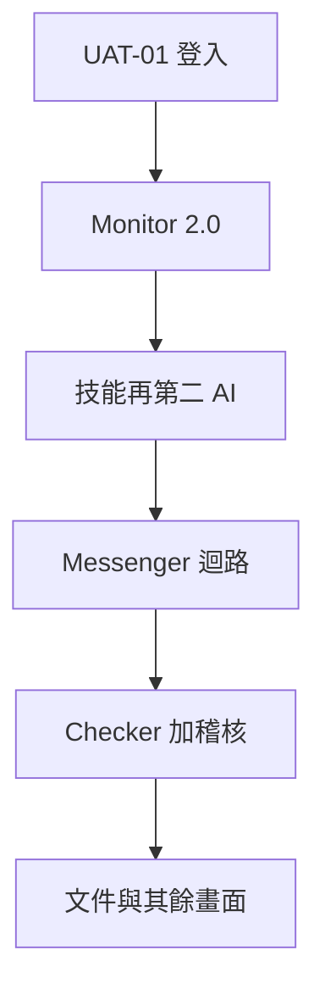

# CRMP UAT 驗收包 — 風險負責人

**文件編號：** CRMP-UAT-001 · **互動示範頁：** [/admin/docs/uat](/admin/docs/uat)

用白話說：這不是開發自測清單，而是風險負責人帶著證據走完整張管理桌與 Lark 風格 Messenger 的驗收劇本。

請**依序**執行。Critical 前置未通過前勿跳號。於稽核備註記錄 PASS／FAIL／WAIVE 與證據。本頁互動勾選只存在瀏覽器工作階段，正式簽核是最後一案。

## 時間模型
- `T+0` = 風險負責人開始 UAT。
- 各案有建議起始偏移與工期。
- Full pack suggested window ≈ **10.1 小時**（52 案）。

## 涵蓋範圍

Messenger（收件匣、證據、聊天挑戰、升級、誤報、結案、建議控制、同步、結案後狀態）以及 **CS／TR 台**（C1 即時聊天、網頁表單、官方信箱進件；專用 SKILL.md 劇本；AI 追問直到客戶回覆；TR 分流）以及管理後台每一個左側頁：首頁（脊柱階段工單計數 — 無脊柱日誌分頁）、每日績效、風險日誌、Monitor 2.0、市場情報、即時警報與追蹤、風險領域、AI Admin、技能、知識樹、RAG（人工閘道）、人工介入、Lark、升級路徑（維度 × 係數 · ESC-DEFAULT）、BU 與團隊／可編輯角色／使用者、資料來源、AI 存取、稽核（CRMP／Vantage Markets 管理分頁＋回滾）、平台設定、使用手冊／PRD／TSD／UAT／生態／路線圖／開放議題／進度／網址目錄、登入與未讀數字。

## 摘要矩陣

| 序 | ID | 起始 | 工期 | 嚴重度 | 負責 BU | 依賴 | 標題 | 涵蓋 |
|---|---|---|---|---|---|---|---|---|
| 01 | UAT-01 | 0m | 12m | Critical | System + Risk Owner | Seeded users; app running | 登入並確認誰可以做什麼 | Admin Home, Login, Roles |
| 02 | UAT-02 | 12m | 10m | Critical | Risk | UAT-01; Monitor indicators seeded | Monitor 2.0 示範警報所用指標 | Monitor 2.0, Realtime Alert & Tracker |
| 03 | UAT-03 | 22m | 15m | Critical | AI + Risk | UAT-02; AI skills seeded | 對跟單違規跑技能劇本 | Realtime Alert & Tracker, AI Skills |
| 04 | UAT-04 | 37m | 15m | Critical | AI + Risk Owner | UAT-03 or any BREACH/CRITICAL analysis | 嚴重警報由第二個 AI 挑戰第一個 AI | Realtime Alert & Tracker |
| 05 | UAT-05 | 52m | 10m | High | AI | UAT-02; default second-AI threshold = BREACH | 純 WARN 案例不可呼叫第二 AI | Realtime Alert & Tracker |
| 06 | UAT-06 | 62m | 12m | High | AI + Risk | RAG corpus seeded | 沒有技能可套時，AI 從知識庫推理 | Realtime Alert & Tracker, RAG Knowledge Base |
| 07 | UAT-07 | 74m | 12m | High | Risk | UAT-03/04; Demo Messenger | Messenger — 把證據包拉進程式對話 | Demo Messenger, Realtime Alert & Tracker |
| 08 | UAT-08 | 86m | 10m | High | Risk Analyst + Risk Owner | UAT-07; open messenger thread | Messenger — 在同一則對話挑戰機器人 | Demo Messenger, Realtime Alert & Tracker |
| 09 | UAT-09 | 96m | 10m | High | Risk | Escalation routes seeded; open thread | Messenger — 沿決策鏈升級 | Demo Messenger, Escalation Routes |
| 10 | UAT-10 | 106m | 8m | Medium | Risk | Separate OPEN WARN thread (do not use the Critical sample) | Messenger — 排除誤報 | Demo Messenger, Realtime Alert & Tracker |
| 11 | UAT-11 | 114m | 10m | Critical | Risk Owner | UAT-04 dual-AI pack reviewed on a BREACH thread | Messenger — 接受 AI 包後結案 | Demo Messenger, Realtime Alert & Tracker |
| 12 | UAT-12 | 124m | 15m | Critical | Ops + Risk Owner | OPEN thread; Human Intervention page | Messenger — 提出控制、雙重確認、再送到管理端 | Demo Messenger, Human Intervention |
| 13 | UAT-13 | 139m | 20m | Critical | AI Engineer + Risk Owner | Two distinct users with ai.admin / checker capability | AI Admin — 提出變更的人不能自己核准 | AI Admin, Users, Audit Log |
| 14 | UAT-14 | 159m | 12m | Medium | Risk + AI | market_intel.enabled=true | 市場情報 —「立即掃描」必須跑完（含 GitHub Pages） | Market Intelligence, Demo Messenger |
| 15 | UAT-15 | 171m | 10m | High | System + Security | AI access blocklist seeded | AI 不可靠近僅限人類的資料 | AI Access Security |
| 16 | UAT-16 | 181m | 15m | High | System | UAT-07 through UAT-12 performed | 稽核與首頁脊柱說的故事要和 Messenger 同一件 | Audit Log, Admin Home spine |
| 17 | UAT-17 | 196m | 10m | Low | All | Docs published under /admin/docs/* | 英文與繁中文件都能顯示 | User Guide, PRD, TSD, UAT Checklist, Ecosystem Eval |
| 18 | UAT-18 | 206m | 15m | Medium | All | Responsive admin shell | 手機寬度煙測（約 390px） | Admin Home, Demo Messenger, Realtime Alert & Tracker |
| 19 | UAT-19 | 221m | 10m | Medium | Risk Owner | UAT-04 samples in window | 本輪 UAT 每個嚴重分析都有第二 AI | Realtime Alert & Tracker |
| 20 | UAT-20 | 231m | 12m | High | Risk + AI | Skills catalog seeded | 技能卡片保持精簡；「進入」打開完整劇本 | AI Skills |
| 21 | UAT-21 | 243m | 8m | High | Risk | UAT-07; public Pages URL | Messenger「在管理後台開啟」落到真實分析 | Demo Messenger, AI analysis detail (/admin/ai-analyses/[id]) |
| 22 | UAT-22 | 251m | 8m | Medium | All | Left nav shell | 左側未讀數字（Messenger 風格） | Admin Home, Realtime Alert & Tracker, Demo Messenger, Market Intelligence |
| 23 | UAT-23 | 259m | 10m | Medium | AI + Risk | RAG + skills seeded | 知識樹顯示領域、技能與文件如何串接 | Knowledge Tree, AI Skills, RAG Knowledge Base |
| 24 | UAT-24 | 269m | 12m | High | All | EN / 繁中 toggle in shell | 繁中覆蓋介面、Messenger、技能與文件 | Admin Home, Demo Messenger, AI Skills, UAT Checklist |
| 25 | UAT-25 | 281m | 8m | Medium | System | URL catalog | 網址目錄列出公開頁（含 CS／TR 大門與劇本） | URL Catalog, CS / TR Desk, CS client portal, AI Skills, Knowledge Tree, Demo Messenger |
| 26 | UAT-26 | 289m | 12m | Medium | Risk + System | Messenger + alerts + spine | 用白話把 Messenger 迴路講一遍 | Demo Messenger, Admin Home spine, Audit Log, Realtime Alert & Tracker |
| 27 | UAT-27 | 301m | 10m | Medium | System + Risk Owner | UAT-01 | 管理首頁 — 卡片、捷徑與平台負責人 | Admin Home, Daily Performance, Users, URL Catalog |
| 28 | UAT-28 | 311m | 10m | Medium | Risk | UAT-01; daily dashboard seeded | 每日績效 — CFD 與 Crypto 桌數字 | Daily Performance |
| 29 | UAT-29 | 321m | 10m | Medium | Risk | UAT-02 | 風險日誌分析 — 實際動到損益／客戶的是什麼 | Risk Log Analytics |
| 30 | UAT-30 | 331m | 10m | High | Risk | UAT-02; Realtime Alert & Tracker queue | 即時警報與追蹤 — 讀佇列並確認一則 | Realtime Alert & Tracker |
| 31 | UAT-31 | 341m | 12m | High | Risk + AI | UAT-02; detectors seeded | Monitor 2.0 — 執行指標並看到 WARN／BREACH 落地 | Monitor 2.0, Realtime Alert & Tracker |
| 32 | UAT-32 | 353m | 8m | Low | Risk | UAT-01 | 風險領域目錄（含 P0–P3 情境） | Risk Domains |
| 33 | UAT-33 | 361m | 12m | High | Risk | UAT-07 | Messenger 收件匣 — 頻道、訊息種類與同步 | Demo Messenger |
| 34 | UAT-34 | 373m | 12m | High | Ops + Risk | UAT-12; OPEN thread with recommended actions | Messenger — 其他建議動作與取消 | Demo Messenger, Human Intervention |
| 35 | UAT-35 | 385m | 10m | High | Ops + Risk Owner | UAT-12 or UAT-34 | 人工介入佇列（Messenger 控制的管理端） | Human Intervention |
| 36 | UAT-36 | 395m | 10m | Medium | System + Risk | UAT-01; lark channels seeded | Lark 整合 — 頻道 vs 應用內 Messenger 示範 | Lark Integration, Demo Messenger |
| 37 | UAT-37 | 405m | 8m | Medium | Risk | UAT-09 | 升級路徑登錄 | Escalation Routes |
| 38 | UAT-38 | 413m | 15m | Medium | System + Risk Owner | UAT-01 | 組織 — BU 與團隊、使用者與角色 | BU and Teams, Users, Roles & Permissions |
| 39 | UAT-39 | 428m | 8m | Low | System | UAT-01 | 資料來源登錄（內部與外部） | Data Sources |
| 40 | UAT-40 | 436m | 10m | Medium | System | UAT-01; settings.manage or read | 平台設定已分組（不是扁平清單） | Platform Settings |
| 41 | UAT-41 | 446m | 10m | Medium | AI + Risk | UAT-06; RAG seeded | RAG 知識庫 — 瀏覽 AI 引用的語料 | RAG Knowledge Base |
| 42 | UAT-42 | 456m | 8m | Low | All | Docs published | 改進路線圖可讀 | Improvement Roadmap |
| 43 | UAT-43 | 464m | 10m | Critical | System + Platform owner | Public snapshot or local login | 公開快照 — 登入可用並維持 demo platform owner | Login, Admin Home |
| 44 | UAT-44 | 474m | 10m | High | Risk + System | UAT-11 or UAT-10 | Messenger — 結案後重新整理仍保持關閉 | Demo Messenger |
| 46 | UAT-46 | 484m | 12m | High | CS + System | UAT-01; CS/TR desk seeded | CS／TR — C1、表單與官方信箱即時進件 | CS / TR Desk, URL Catalog, BU and Teams |
| 47 | UAT-47 | 496m | 15m | Critical | CS | UAT-46; follow-up seed cases | CS／TR — AI 在不清楚或需核身時寄信並等待 | CS / TR Desk, Audit Log |
| 48 | UAT-48 | 511m | 12m | High | CS + TR | UAT-46; trading seed case | CS／TR — 交易案件給 TR；帳簿風險升級風控 | CS / TR Desk, Demo Messenger |
| 50 | UAT-50 | 523m | 12m | High | CS + AI | UAT-46; skills + RAG seeded | CS／TR — 專用 SKILL.md 劇本蓋台面並豐富知識樹 | CS / TR Desk, AI Skills, Knowledge Tree, RAG Knowledge Base |
| 51 | UAT-51 | 535m | 12m | High | CS | UAT-46; CS/TR dashboard + log seeded | CS／TR — 專用儀表板與日誌，不是每日績效或風險日誌 | CS / TR Dashboard, CS / TR Log |
| 52 | UAT-52 | 547m | 12m | High | CS + System | UAT-46; CS/TR org + settings seeded | CS／TR — 配套資料：BU、核身庫、關卡與 cs.* 參數 | CS / TR Data, Platform Settings, BU and Teams, Escalation Routes |
| 49 | UAT-49 | 559m | 15m | Critical | Risk Owner | UAT-01–52 results recorded | 風險負責人退出簽核 | UAT Checklist, Audit Log |

## 逐步案例

### UAT-01 — 登入並確認誰可以做什麼

- **嚴重度：** Critical · **負責：** System + Risk Owner · **依賴：** Seeded users; app running · **建議：** T+0m / 12m
- **涵蓋：** Admin Home, Login, Roles
- **為何測：** 若錯誤角色能進入 AI Admin，或風險負責人進不去，後續 UAT 都不安全。
- **目的：** 證明風險負責人可進入後台，唯讀 Viewer 打不開高權限畫面。

**步驟**

1. 由左側「登入」開啟登入頁（或 /login）。公開 GitHub Pages 網址為 /PRD/crmp-plus/login/，不可出現 404。
2. 以 risk.owner@vantagemarkets.com / risk123 登入，應進入管理首頁而非錯誤頁。
3. 左側應顯示姓名與 RISK_OWNER 角色；首頁可見部門／RACI。
4. 登出後以 viewer@vantagemarkets.com / view123 登入。
5. 嘗試開啟 AI Admin（左側或直接輸入 /admin/ai-admin）。應被導離或拒絕，不可看到 Maker／Checker 表單。
6. 改回風險負責人（或授權之超級管理員）再繼續下一案。

**通過：** 風險負責人可進首頁；Viewer 無法操作 AI Admin；登入頁無 404。
**證據：** 風險負責人首頁截圖＋Viewer 被拒；本機可附稽核 LOGIN。

### UAT-02 — Monitor 2.0 示範警報所用指標

- **嚴重度：** Critical · **負責：** Risk · **依賴：** UAT-01; Monitor indicators seeded · **建議：** T+12m / 10m
- **涵蓋：** Monitor 2.0, Realtime Alert & Tracker
- **為何測：** 若 CFD／Crypto 指標不存在，Messenger 與 AI 根因分析沒有來源。
- **目的：** 確認股權、保證金、跟單集中度指標存在，且即時警報與追蹤有資料。

**步驟**

1. 由左側「監控與風險」開啟 Monitor 2.0。確認是單一指標＋偵測器登錄（全部執行／同步／暫停）— 這裡沒有警報／工單分頁；未結工作在「即時警報與追蹤」。
2. 找到 M2-EQ-001（股權／回撤）、M2-MRG-014（保證金）、M2-COPY-009（跟單集中度），記下產品、風險領域與偵測器代碼。
3. 開啟即時警報與追蹤（左側選單 — 不是 Monitor 2.0 分頁）。應看到嚴重度、狀態與 Monitor 工單編號的卡片列表。
4. 記下目前 OPEN（或已確認）筆數，作為後續基線。

**通過：** 股權／保證金／跟單各至少一項指標；Monitor 無警報／工單分頁；即時警報與追蹤有真實列。
**證據：** 三個指標 ID；基線 OPEN 數量。

### UAT-03 — 對跟單違規跑技能劇本

- **嚴重度：** Critical · **負責：** AI + Risk · **依賴：** UAT-02; AI skills seeded · **建議：** T+22m / 15m
- **涵蓋：** Realtime Alert & Tracker, AI Skills
- **為何測：** 已知故障型態時，第一個 AI 應照書面技能走，而不是自行編故事。每次新分析也要有可對話的「如何改進」審查。
- **目的：** 證明 COPY breach 模擬會套用對應技能、存證據，並打開改進聊天機器人。

**步驟**

1. 開啟即時警報與追蹤。
2. 點「Simulate COPY breach (skill path)」，等到新分析打開或列表出現新列。
3. 詳情頁模式徽章應為 SKILL_MATCH（代表使用已知劇本，而非自由推理），信心接近確定。
4. 證據庫至少要有 SKILL（跑了哪份劇本）與 MONITOR（警報快照）。
5. 找到 **AI 分析 — 如何改進** 面板，應列出補資料源、休眠指標健康、推理缺口、新技能型態、門檻 X→Y、加快人工回應等項；證據庫也應有 IMPROVEMENT 列。
6. 在聊天機器人：**拉資料**、**新增事實**（例如饋送過期 9 分鐘）、**挑戰推理**、**重產**，確認方案有更新。滿意後可 **標記滿意**。
7. 從標題抄下 analysis id（如 ANL-…），後續 Messenger／稽核會用到。

**通過：** 模式為 SKILL_MATCH；證據含 SKILL、MONITOR 與 IMPROVEMENT；改進聊天可拉資料／補事實／挑戰／重產；已記錄 analysis id。
**證據：** analysis id；模式徽章、證據類型與如何改進聊天截圖。

### UAT-04 — 嚴重警報由第二個 AI 挑戰第一個 AI

- **嚴重度：** Critical · **負責：** AI + Risk Owner · **依賴：** UAT-03 or any BREACH/CRITICAL analysis · **建議：** T+37m / 15m
- **涵蓋：** Realtime Alert & Tracker
- **為何測：** 單一模型可能過度自信。BREACH／CRITICAL 需要獨立第二意見，人類才能接受敘事。
- **目的：** 打開高嚴重度分析，確認挑戰面板、結論與至少一項高優先改進。

**步驟**

1. 在即時警報與追蹤開啟 BREACH 或 CRITICAL（或點 Simulate CRITICAL）。
2. 列表列上應有「2nd AI」徽章與 AGREE／PARTIAL／DISAGREE 等結論。
3. 詳情頁找到「第二 AI 挑戰者」面板（crmp-challenger-v0）。
4. 用白話讀完：同意什麼、懷疑什麼、改進建議。若為 PARTIAL／DISAGREE，應標示需要人工覆核。
5. 證據庫須有 CHALLENGER 列，辯論要入庫而不只是畫面。

**通過：** 有挑戰面板與結論；至少一項 HIGH 改進；有 CHALLENGER 證據。
**證據：** challenge id 與 verdict；改進清單截圖。

### UAT-05 — 純 WARN 案例不可呼叫第二 AI

- **嚴重度：** High · **負責：** AI · **依賴：** UAT-02; default second-AI threshold = BREACH · **建議：** T+52m / 10m
- **涵蓋：** Realtime Alert & Tracker
- **為何測：** 第二 AI 耗時。普通預警不應觸發，以免操作者被灌爆。
- **目的：** 模擬 WARN 股權／回撤路徑，確認挑戰者沒有執行。

**步驟**

1. 於即時警報與追蹤點「Simulate EQ drawdown (RAG path)」（WARN）。
2. 打開新分析。
3. 第二 AI 面板應顯示未執行（或沒有 2nd AI 結論徽章）。
4. 此 WARN 樣本證據庫不應有 CHALLENGER 列。

**通過：** 門檻仍為 BREACH 時，WARN 樣本沒有挑戰列。
**證據：** analysis id；Not run 面板截圖。

### UAT-06 — 沒有技能可套時，AI 從知識庫推理

- **嚴重度：** High · **負責：** AI + Risk · **依賴：** RAG corpus seeded · **建議：** T+62m / 12m
- **涵蓋：** Realtime Alert & Tracker, RAG Knowledge Base
- **為何測：** 不是每則警報都有現成劇本。仍需要可讀說明與來源。
- **目的：** 跑 RAG 路徑，確認模式為 RAG_REASONING，且有說明與證據。

**步驟**

1. 使用 EQ WARN／RAG 模擬，或打開沒有確定技能匹配的分析。
2. 模式徽章應為 RAG_REASONING（代表檢索文件後推理，而非技能命中）。
3. 用白話讀完至少一則說明／假說。
4. 證據庫非空（MONITOR 與／或 EXTERNAL／RAG）。可選：到 RAG 知識庫核對文件標題存在。

**通過：** 模式為 RAG_REASONING；至少一則說明；有證據。
**證據：** analysis id；模式與證據截圖。

### UAT-07 — Messenger — 把證據包拉進程式對話

- **嚴重度：** High · **負責：** Risk · **依賴：** UAT-03/04; Demo Messenger · **建議：** T+74m / 12m
- **涵蓋：** Demo Messenger, Realtime Alert & Tracker
- **為何測：** 風險人員不應離開對話才能看 AI 為何這樣說。
- **目的：** 在示範 Messenger 把證據庫貼進同一則對話，並證明管理連結可用。

**步驟**

1. 開啟示範 Messenger。GitHub Pages 網址為 /PRD/crmp-plus/admin/messenger/。
2. 左欄是收件匣。應已有種子對話；若空白，點「同步警報」，等到至少一則 OPEN。
3. 點一則 BREACH／CRITICAL。對話中應有彩色氣泡：ALERT（警報）、常有 AI_REPORT（第一 AI 說明）、有時有 ESCALATION。
4. 點「顯示證據」。約 10 秒內同一則對話須出現 EVIDENCE 氣泡。
5. 閱讀內容（監控快照、RAG 或外部）。點「在管理後台開啟」須打開對應 AI 分析，不可 404，Pages 上不可丢掉 /PRD/crmp-plus 前綴。

**通過：** 出現 EVIDENCE；「在管理後台開啟」顯示對應分析包。
**證據：** thread id；EVIDENCE 氣泡與分析頁截圖。

### UAT-08 — Messenger — 在同一則對話挑戰機器人

- **嚴重度：** High · **負責：** Risk Analyst + Risk Owner · **依賴：** UAT-07; open messenger thread · **建議：** T+86m / 10m
- **涵蓋：** Demo Messenger, Realtime Alert & Tracker
- **為何測：** 操作者必須能說「我不同意」，而不另外開工單系統。
- **目的：** 在輸入框提出挑戰，確認機器人回覆並標記人工覆核。

**步驟**

1. 留在同一則 OPEN 對話。
2. 在底部輸入例如：「我不同意 AI，請覆核報價完整性」，點送出。
3. 右側出現 USER 訊息，下方出現 CHATBOT 回覆並承認挑戰。
4. 若對話已連到分析，點「在管理後台開啟」，確認已標記人工覆核（needs_human 或明確「人工覆核」字樣）。

**通過：** 已記錄 USER＋CHATBOT；連結分析要求人工覆核。
**證據：** USER／CHATBOT 截圖；分析之人工覆核狀態。

### UAT-09 — Messenger — 沿決策鏈升級

- **嚴重度：** High · **負責：** Risk · **依賴：** Escalation routes seeded; open thread · **建議：** T+96m / 10m
- **涵蓋：** Demo Messenger, Escalation Routes
- **為何測：** 嚴重案件必須帶到下一負責團隊並顯示 SLA，而不是私下打電話。
- **目的：** 連點兩次「升級」，證明鳥瞰 POC 窗把案件轉給下一具名負責人。

**步驟**

1. 於 OPEN 對話讀鳥瞰路徑晶片（承辦 1→2→3→4）。第一窗應有警報＋AI 報告。
2. 點「升級」。進行中視窗移到下一承辦。上一窗出現轉交氣泡，下一窗出現接收氣泡。
3. 再點一次「升級」。步驟須遞增，第三承辦窗變為進行中。
4. 可選：開啟左側「升級路徑」，確認同一路徑名稱存在。

**通過：** 兩次升級讓「進行中」 hop 往下移；每窗保留自己的聊天；晶片寫出承辦姓名。
**證據：** 步驟 1／2 截圖；路線名稱。

### UAT-10 — Messenger — 排除誤報

- **嚴重度：** Medium · **負責：** Risk · **依賴：** Separate OPEN WARN thread (do not use the Critical sample) · **建議：** T+106m / 8m
- **涵蓋：** Demo Messenger, Realtime Alert & Tracker
- **為何測：** 雜訊必須一鍵關掉並留稽核，真正違規才不會被淹沒。
- **目的：** 在可拋棄的 WARN 對話排除誤報，確認對話與關聯警報都關閉。

**步驟**

1. 選另一則 OPEN WARN（不要用稍後還要用的 BREACH）。
2. 點「排除（誤報）」。
3. 狀態變為 DISMISSED；顯示證據／升級／排除／結案按鈕應停用。
4. 本機可到即時警報與追蹤確認關聯警報已 CLOSED；公開快照則以 SYSTEM 氣泡寫明已關閉即可。

**通過：** 對話 DISMISSED；警報關閉或 SYSTEM 已說明；本機有稽核。
**證據：** 前後 thread id；本機 Audit MESSENGER_DISMISS。

### UAT-11 — Messenger — 接受 AI 包後結案

- **嚴重度：** Critical · **負責：** Risk Owner · **依賴：** UAT-04 dual-AI pack reviewed on a BREACH thread · **建議：** T+114m / 10m
- **涵蓋：** Demo Messenger, Realtime Alert & Tracker
- **為何測：** 風險負責人需要乾淨的「我們接受此說明」按鈕，且不可刪掉證據。
- **目的：** 對已覆核的 BREACH 結案，並確認 AI 分析仍保留挑戰包。

**步驟**

1. 開啟已讀過雙 AI 包的 BREACH（不是已排除的 WARN）。
2. 點「結案（接受 AI）」。
3. 狀態變 CLOSED；證據／升級／排除／結案按鈕停用。
4. 再開分析頁。證據庫與第二 AI 面板必須還在——關掉聊天不可清掉科學包。

**通過：** 對話 CLOSED；分析證據保留；本機有 Audit MESSENGER_CLOSE。
**證據：** thread id；分析詳情仍顯示挑戰面板。

### UAT-12 — Messenger — 提出控制、雙重確認、再送到管理端

- **嚴重度：** Critical · **負責：** Ops + Risk Owner · **依賴：** OPEN thread; Human Intervention page · **建議：** T+124m / 15m
- **涵蓋：** Demo Messenger, Human Intervention
- **為何測：** 凍結帳戶很危險。聊天必須問「確定嗎？」，必要時要第二人（Checker）才送到 Vantage admin。
- **目的：** 從建議動作封鎖帳戶，走兩步確認，系統要求時走 Checker。

**步驟**

1. 開啟（或同步）一則仍顯示建議動作的 OPEN 對話：封鎖帳戶、暫停交易、調降槓桿等。
2. 點「封鎖使用者帳戶」。出現提案卡（ACTION_PROPOSAL／確認…）。
3. 點「雙重確認…」再「是，送到 Vantage admin」。應出現 ACTION_RESULT、管理參考號與「人工介入」連結。
4. 若卡片說需要 Checker，點 Checker 核准（示範）或到人工介入頁完成。
5. 由左側開啟人工介入，找到同一參考號。原型可用模擬 admin_ref；真正凍結不在範圍。

**通過：** 已產生 admin_ref；送出前有確認閘道；需要時有 Checker。
**證據：** admin_ref；提案→確認→結果截圖。

### UAT-13 — AI Admin — 提出變更的人不能自己核准

- **嚴重度：** Critical · **負責：** AI Engineer + Risk Owner · **依賴：** Two distinct users with ai.admin / checker capability · **建議：** T+139m / 20m
- **涵蓋：** AI Admin, Users, Audit Log
- **為何測：** 單一工程師不可默默改驅動即時 RCA 的模型或門檻。
- **目的：** 以 Maker 提出無害變更，自我核准失敗，再以另一 Checker 核准。

**步驟**

1. 以 AI 工程師登入（ai.engineer@vantagemarkets.com / ai123，若種子存在），否則用第二個管理員。
2. 開啟 AI Admin，提出無害變更（例如模型列備註，或稍後會還原的門檻）。
3. 同一使用者嘗試核准，介面必須拒絕。
4. 改以不同 Checker 能力使用者登入（風險負責人或超級管理員）。
5. 核准待審變更，確認只有第二次核准後才生效。
6. 本機開啟稽核日誌，找到提出與核准兩列（兩個不同操作者）。

**通過：** 自我核准被擋；不同 Checker 成功；稽核含 Maker 與 Checker。
**證據：** 變更單號；提出＋核准稽核。

### UAT-14 — 市場情報 —「立即掃描」必須跑完（含 GitHub Pages）

- **嚴重度：** Medium · **負責：** Risk + AI · **依賴：** market_intel.enabled=true · **建議：** T+159m / 12m
- **涵蓋：** Market Intelligence, Demo Messenger
- **為何測：** 5 分鐘新聞掃描是 LP 相關頭條進 Messenger 的路徑。卡住的 Failed 會把風險藏起來。
- **目的：** 點立即掃描，本機拿到 scan id，或 Pages 上得到清楚的唯讀說明——不可空白失敗。

**步驟**

1. 開啟市場情報。
2. 確認脈動面板：過去一小時頭條、過去 24 小時頭條，以及 Vantage 主要商品（EURUSD、XAUUSD、NAS100、BTCUSD 等）的情緒氣壓計。
3. 點「立即掃描」。
4. 本機：即使零新增也應出現 scan_id（5 分鐘桶重複可接受）。來源逾時仍須完成或顯示白話錯誤。
5. GitHub Pages：須說明快照唯讀且仍顯示種子發現，不可因沒有 /api 停在 405／404。若快照超過 24 小時，時間窗可錨定在最新發現。
6. 開啟 Findings 與 Messenger outbox。卡片須顯示標題、產品、影響（不是「違規」）、地區國旗、時間戳，以及來源**文章**網址（不是頻道首頁）。點脈動頭條應跳到該發現。

**通過：** 本機有 scan_id，或 Pages 有清楚說明；畫面不停留 Failed。
**證據：** scan_id 或快照訊息；發現或空掃描截圖。

### UAT-15 — AI 不可靠近僅限人類的資料

- **嚴重度：** High · **負責：** System + Security · **依賴：** AI access blocklist seeded · **建議：** T+171m / 10m
- **涵蓋：** AI Access Security
- **為何測：** 密碼、人事欄位等必須在黑名單，未來 agent 才讀不到。
- **目的：** 覆核 AI 存取安全頁，確認頁面／功能／欄位都列出僅限人類項目與理由。

**步驟**

1. 開啟 AI 存取安全（平台分組）。
2. 查看頁面、功能、欄位三區。
3. 搜尋 users.password 或同等敏感欄位。
4. 每一列應有白話理由（為何拒絕 AI）。
5. 記錄正式 IAM 不得把這些授給任何 AI 身分。

**通過：** 黑名單含理由；可見至少一個敏感欄位範例。
**證據：** 黑名單截圖；各區數量。

### UAT-16 — 稽核與首頁脊柱說的故事要和 Messenger 同一件

- **嚴重度：** High · **負責：** System · **依賴：** UAT-07 through UAT-12 performed · **建議：** T+181m / 15m
- **涵蓋：** Audit Log, Admin Home spine
- **為何測：** 若聊天動作從稽核消失，事後無法還原決策。
- **目的：** 把至少一次升級與一次控制確認對到首頁脊柱與／或稽核；確認兩個稽核分頁與回滾。

**步驟**

1. 開啟稽核日誌。確認兩個分頁：**CRMP 日誌**與 **Vantage Markets 管理日誌**。Messenger 升級／排除／結案與 AI 動作應在 CRMP 日誌；權限／設定／RAG／Lark 在 Vantage Markets 管理日誌。
2. 在管理首頁打開整合脊柱（階段工單計數 — 無脊柱日誌分頁），找 AI_RCA、ESCALATION／HUMAN_INTERVENTION 等階段。
3. 從前案挑一次升級與一次「送到 admin」確認，找到約一分鐘內的時間戳與參考號。
4. 有變更前快照的列應可見**回滾**（`POST /api/audit/rollback`）。能用一句話說明：「這個聊天動作變成那一列首頁脊柱／稽核」。

**通過：** Audit 與／或首頁脊柱可見至少一次升級與一次控制確認；兩個稽核分頁可渲染；有快照時可見回滾。
**證據：** 事件 id；稽核分頁＋首頁脊柱截圖。

### UAT-17 — 英文與繁中文件都能顯示

- **嚴重度：** Low · **負責：** All · **依賴：** Docs published under /admin/docs/* · **建議：** T+196m / 10m
- **涵蓋：** User Guide, PRD, TSD, UAT Checklist, Ecosystem Eval
- **為何測：** 香港桌必須能用繁中跑 UAT 與讀手冊。
- **目的：** 在使用手冊、PRD、TSD、生態評估與本 UAT 頁切換英／繁，不可 404。

**步驟**

1. 開啟使用手冊，點文章上的 English／繁體中文（左側 EN／繁中可一併翻譯介面）。
2. 對 PRD、TSD、生態評估、本 UAT 頁重複。
3. 內文必須真的切換，不能只有標題變。缺檔 stub 算失敗。

**通過：** 所列文件兩語皆可渲染；非缺檔 stub。
**證據：** 已測 URL 清單。

### UAT-18 — 手機寬度煙測（約 390px）

- **嚴重度：** Medium · **負責：** All · **依賴：** Responsive admin shell · **建議：** T+206m / 15m
- **涵蓋：** Admin Home, Demo Messenger, Realtime Alert & Tracker
- **為何測：** 值班人員會用手機開 Messenger。溢出或抽屜壞掉會讓桌面不可用。
- **目的：** 約 390px 寬時能開選單、走 Messenger 列表→對話→返回，並讀 AI 分析。

**步驟**

1. 瀏覽器寬度約 390px（或裝置模擬）。
2. 首頁點漢堡，左側抽屜打開，整頁不可左右滑。
3. 開啟示範 Messenger，先看到列表；進對話後點「對話」返回。
4. 開啟 AI 分析詳情，第二 AI 區塊直向堆疊，主要按鈕仍可點。

**通過：** 抽屜可用；messenger 主從可用；無文件級橫向溢出。
**證據：** 抽屜／列表／對話／AI 詳情手機截圖。

### UAT-19 — 本輪 UAT 每個嚴重分析都有第二 AI

- **嚴重度：** Medium · **負責：** Risk Owner · **依賴：** UAT-04 samples in window · **建議：** T+221m / 10m
- **涵蓋：** Realtime Alert & Tracker
- **為何測：** 即使昨天的樣本沒問題，這一輪只要有一則未挑戰的 BREACH 就不算過關。
- **目的：** 清點本輪 BREACH／CRITICAL，證明皆有挑戰結論（允許回補）。

**步驟**

1. 在即時警報與追蹤列出本輪出現的 BREACH／CRITICAL。
2. 每列須有非 pending 的 2nd AI 徽章。
3. 若有 pending，點 Backfill 2nd AI challenges 後再查。

**通過：** UAT 視窗內 BREACH／CRITICAL 100% 有挑戰結論。
**證據：** BREACH／CRITICAL 數量 vs 已挑戰數量。

### UAT-20 — 技能卡片保持精簡；「進入」打開完整劇本

- **嚴重度：** High · **負責：** Risk + AI · **依賴：** Skills catalog seeded · **建議：** T+231m / 12m
- **涵蓋：** AI Skills
- **為何測：** 每張卡片塞滿 SKILL.md 無法閱讀。需要精簡列表加上真正的手冊頁。
- **目的：** 從 AI 技能進入兩項，讀何時用、前置檢查、證據、停止與成功標準。

**步驟**

1. 開啟 AI 技能。卡片仍應顯示指標、門檻、故障區域與升級，而不是整篇長文。
2. 找到 SKILL-ABOOK-RATIO，點「進入」。
3. 詳情頁須含何時用／何時不用、前置檢查、步驟、證據、停止條件、成功標準與案例。
4. 返回列表再開第二項（如 SKILL-MARGIN-SPIKE）。

**通過：** 進入導向 /admin/skills/{code}/；兩項皆有完整章節；列表仍可用。
**證據：** 卡片＋兩項詳情截圖。

### UAT-21 — Messenger「在管理後台開啟」落到真實分析

- **嚴重度：** High · **負責：** Risk · **依賴：** UAT-07; public Pages URL · **建議：** T+243m / 8m
- **涵蓋：** Demo Messenger, AI analysis detail (/admin/ai-analyses/[id])
- **為何測：** 上次公開快照就是這裡 404——操作者看不到 RCA 與第二 AI。
- **目的：** 從 BREACH 對話跟著開啟，看到說明、證據與挑戰者。

**步驟**

1. 於示範 Messenger 開啟 BREACH 對話。
2. 點「在管理後台開啟」（或 ALERT／AI_REPORT 裡的分析連結）。
3. 網址須為 /admin/ai-analyses/{id}/（Pages 含 /PRD/crmp-plus）。
4. 說明、證據庫與第二 AI 面板須有內容。

**通過：** 無 404；分析包可見；Pages 網址保留前綴。
**證據：** 網址列＋分析詳情截圖。

### UAT-22 — 左側未讀數字（Messenger 風格）

- **嚴重度：** Medium · **負責：** All · **依賴：** Left nav shell · **建議：** T+251m / 8m
- **涵蓋：** Admin Home, Realtime Alert & Tracker, Demo Messenger, Market Intelligence
- **為何測：** 操作者不應每個分頁都打開才知道有新事件。
- **目的：** 有新／未處理工作的分頁顯示玫瑰色數字；打開後只清該分頁。

**步驟**

1. 強制重新整理管理首頁，或用無痕視窗，清掉「已看過」標記。
2. 即時警報與追蹤、示範 Messenger、市場情報等有未處理工作的分頁應出現紅色數字。
3. 開啟即時警報與追蹤 — 該數字歸零，其他仍在。
4. 開啟示範 Messenger — 該數字歸零。
5. 離開再回來：已看過的維持零，除非掃描／分析／同步又產生新工作。

**通過：** 數字對應未處理工作；僅所看分頁歸零。
**證據：** 左側欄前後截圖。

### UAT-23 — 知識樹顯示領域、技能與文件如何串接

- **嚴重度：** Medium · **負責：** AI + Risk · **依賴：** RAG + skills seeded · **建議：** T+259m / 10m
- **涵蓋：** Knowledge Tree, AI Skills, RAG Knowledge Base
- **為何測：** 扁平技能列表看不出 COPY、保證金、LP 對沖知識是否真的連在一起。
- **目的：** 打開樹、展開領域、進入技能，並跟著 RAG 文件進知識庫。

**步驟**

1. 由左側開啟知識樹。
2. 領域、技能、時間鏈、RAG 文件數量皆非零。必須看見 CS_SERVICE 與 TRADING_EXEC 樹幹。
3. 展開 CS_SERVICE（或 LP_HEDGE）並點技能代碼，應打開完整劇本。
4. 點 RAG 文件葉（cs-24-7-intake 或風險政策）進入知識庫。

**通過：** 樹可渲染；CS_SERVICE／TRADING_EXEC 存在；技能連到劇本；RAG 連到知識庫。
**證據：** 知識樹＋劇本截圖。

### UAT-24 — 繁中覆蓋介面、Messenger、技能與文件

- **嚴重度：** High · **負責：** All · **依賴：** EN / 繁中 toggle in shell · **建議：** T+269m / 12m
- **涵蓋：** Admin Home, Demo Messenger, AI Skills, UAT Checklist
- **為何測：** 以前切換繁中只翻譯登入頁。操作者需要整張桌。
- **目的：** 點繁中後走訪首頁、警報、技能、Messenger、市場情報、知識樹、UAT 與 PRD。

**步驟**

1. 於左側點 繁中。
2. 走訪首頁、即時警報與追蹤、AI 技能、技能詳情、Messenger、市場情報、知識樹、本 UAT、PRD。
3. 標題／副標與主要按鈕應為繁中。
4. 文件若有第二切換，點繁體中文後內文須切換。
5. 改回 EN，英文須恢復且無重整迴圈。

**通過：** 繁中模式下沒有整頁停留英文（監控代碼與種子事件標題除外）。
**證據：** 首頁／技能／Messenger／文件之 EN vs 繁中截圖。

### UAT-25 — 網址目錄列出公開頁（含 CS／TR 大門與劇本）

- **嚴重度：** Medium · **負責：** System · **依賴：** URL catalog · **建議：** T+281m / 8m
- **涵蓋：** URL Catalog, CS / TR Desk, CS client portal, AI Skills, Knowledge Tree, Demo Messenger
- **為何測：** 操作者不應靠猜路徑才找得到 /cs、台面、技能詳情、知識樹或 Messenger。
- **目的：** 從網址目錄找到 CS／TR 區段、技能、知識樹、示範 Messenger 與市場情報。

**步驟**

1. 開啟網址目錄。閱讀 CS／TR 速記：/cs、POST /api/cs/intake、CSR-XXXX 等待迴圈。
2. 找到 CS／TR 區段：/cs、/admin/cs-desk、SKILL-CS-CLARIFY（及四本姊妹劇本）、RAG 葉 cs-24-7-intake／cs-id-verify-policy、GET /api/cs/intake。
3. 從 CS／TR 列打開技能詳情（SKILL-CS-CLARIFY），或在 AI 技能以代碼取代 [code]。
4. 目錄標示本平台來源（hxyan2020.github.io/PRD/crmp-plus）、客戶入口（…/cs/），並仍列出原 CRMP 管理後台為凍結（hxyan2020.github.io/PRD/crmp-admin）。

**通過：** CS／TR 路由、五本劇本與進件 API 已列出且可開；CRMP Plus 來源與 /cs 可見；原 CRMP 管理後台標為凍結。
**證據：** 目錄列截圖（CS／TR 區段＋公開網址）。

### UAT-26 — 用白話把 Messenger 迴路講一遍

- **嚴重度：** Medium · **負責：** Risk + System · **依賴：** Messenger + alerts + spine · **建議：** T+289m / 12m
- **涵蓋：** Demo Messenger, Admin Home spine, Audit Log, Realtime Alert & Tracker
- **為何測：** 若風險負責人不能口述警報→收件匣→AI 包→控制→稽核，示範就只是截圖。
- **目的：** 只用種子示範，指著每個氣泡，再到脊柱與稽核找到同一案件。

**步驟**

1. 從示範 Messenger 指出 ALERT 氣泡與觸發的 Monitor 指標。
2. 指出 AI_REPORT，在管理後台開啟，說明這是技能劇本還是 RAG 推理。
3. 若 BREACH／CRITICAL，指出第二 AI 結論。
4. 執行顯示證據、升級一次；可拋棄 WARN 可排除，已覆核 BREACH 可結案。
5. 於管理首頁脊柱與稽核日誌（CRMP 日誌分頁）找到對應事件，用白話而不是只念代碼。

**通過：** 無需 Lark API 即可說明迴路；首頁脊柱／稽核可見同一案件。
**證據：** thread id、analysis id、脊柱事件 id。

### UAT-27 — 管理首頁 — 卡片、捷徑與平台負責人

- **嚴重度：** Medium · **負責：** System + Risk Owner · **依賴：** UAT-01 · **建議：** T+301m / 10m
- **涵蓋：** Admin Home, Daily Performance, Users, URL Catalog
- **為何測：** 首頁是整張桌的地圖。卡片失效或沒有負責人會讓原型看起來沒人管。
- **目的：** 點進首頁數字卡確認開到正確頁；負責人列為 demo platform owner。

**步驟**

1. 開啟管理首頁。
2. 首頁面板與左側頁尾可見平台負責人 demo platform owner／haixiang.yan@hytechc.com。
3. 點這些數字卡並確認目的地：使用者、BU 與團隊、資料來源、風險領域、即時警報與追蹤、Monitor 2.0、Lark 頻道、升級路徑。
4. 點一張部門卡（應開該組工作頁）、一列最近警報（即時警報與追蹤，該筆醒目）、一塊跳轉磁磚。頁首捷徑：示範 Messenger、使用手冊、每日績效。皆不可 404。
5. 若仍是公開訪客，應看到訪客橫幅與登入；登入後應改變。
6. 本機點「虛擬警報」（以及一次「虛擬警報組」）。最近警報卡片應標「虛擬演練」、脊柱標出 DETECT→DASHBOARD，稽核／風險日誌／Messenger 可見已結案走線。

**通過：** 宣稱有頁面的卡片／捷徑都能打開；負責人資訊可見。
**證據：** 首頁截圖＋一張卡片目的地；負責人列可見。

### UAT-28 — 每日績效 — CFD 與 Crypto 桌數字

- **嚴重度：** Medium · **負責：** Risk · **依賴：** UAT-01; daily dashboard seeded · **建議：** T+311m / 10m
- **涵蓋：** Daily Performance
- **為何測：** 早會需要在同一頁看到昨天 CFD 與 Crypto 健康，而不是試算表。
- **目的：** 開啟每日績效，確認報告日、CFD 區、Crypto 區與摘要都在。

**步驟**

1. 由左側或首頁捷徑開啟每日績效。
2. 頂部報告日期須為真實日期，不可空白。
3. 確認 CFD 與 Crypto 兩塊，各有指標（數值、目標或 OK／WARN／BREACH）。
4. 閱讀各產品 WARN／BREACH 摘要，應與列的顏色大致相符。
5. 本機若有重新整理，點一次後頁面仍能顯示（Pages 可說明唯讀）。

**通過：** 有報告日；CFD 與 Crypto 有資料；摘要可見。
**證據：** 每日績效兩產品區塊截圖。

### UAT-29 — 風險日誌分析 — 實際動到損益／客戶的是什麼

- **嚴重度：** Medium · **負責：** Risk · **依賴：** UAT-02 · **建議：** T+321m / 10m
- **涵蓋：** Risk Log Analytics
- **為何測：** 沒有影響的警報是雜訊。這頁用來判斷違規有沒有傷到人，並讀已結追蹤包，同時看完整一季歷史。
- **目的：** 開啟風險日誌分析總覽，確認 90 天歷史圖表（已回填）、已結工單卡片（狀態、AI 分析、BU／AI 動作紀錄、核定方案）以及含產品／領域的影響列。

**步驟**

1. 開啟風險日誌分析（總覽）。
2. 應看到摘要磚、**約 90 天的歷史圖表**（警報／未結帳本、損失 vs 防損、處理延遲 — 不是單日尖峰）、領域長條，以及「已關閉警報與工單」列表，不是空白頁。
3. 可選開「歷史圖表」分頁確認同一序列。
4. 展開一張已結卡片。記下：工單已關閉狀態、AI 分析摘要、至少一筆 AI 或 BU 動作紀錄，以及核定最終方案（誰核定）。
5. 確認同一個警報編號不再出現在即時警報與追蹤的未結佇列。

**通過：** 總覽有約 90 天圖表，以及已結追蹤卡片（工單已關閉、AI、動作紀錄與核定方案）；至少一張能用白話解釋。
**證據：** 風險日誌總覽截圖（含歷史圖表），並展開一張已結卡片。

### UAT-30 — 即時警報與追蹤 — 讀佇列並確認一則

- **嚴重度：** High · **負責：** Risk · **依賴：** UAT-02; Realtime Alert & Tracker queue · **建議：** T+331m / 10m
- **涵蓋：** Realtime Alert & Tracker
- **為何測：** 營運佇列不是 Messenger。桌上必須有人能在後台確認警報。
- **目的：** 找到 OPEN 警報，讀 Monitor 與工單編號；本機按確認，或說明 Pages 為何唯讀。

**步驟**

1. 開啟即時警報與追蹤。應只看到仍未結的卡片，含嚴重度、狀態、產品、領域、Monitor id、工單編號與短訊。已關閉工單不可出現在此。
2. 找一則 OPEN，大聲讀出：壞了什麼、哪個指標。
3. 確認可見「至風險日誌分析查看已關閉警報」按鈕／連結，並會打開 `/admin/risk-log`。
4. 本機點 Acknowledge，重新整理後狀態應變 ACKNOWLEDGED，該列按鈕消失。
5. GitHub Pages 可能無法寫入。若操作者看得到按鈕且列表仍有種子 OPEN 即算過；空白頁或混入已結工單算失敗。

**通過：** 未結佇列可讀。已結日誌按鈕可到風險日誌。本機確認會改狀態。Pages 仍顯示種子未結警報。
**證據：** 本機確認前後截圖，或 Pages 種子佇列。

### UAT-31 — Monitor 2.0 — 執行指標並看到 WARN／BREACH 落地

- **嚴重度：** High · **負責：** Risk + AI · **依賴：** UAT-02; detectors seeded · **建議：** T+341m / 12m
- **涵蓋：** Monitor 2.0, Realtime Alert & Tracker
- **為何測：** 偵測器已合併至 Monitor 2.0。「執行全部指標」沒反應，示範就無法產生新工作。
- **目的：** 開啟 Monitor 2.0、執行全部指標，確認上次狀態；規則觸發時有新警報或分析。

**步驟**

1. 開啟 Monitor 2.0（`/admin/detectors` 會導向此頁 — 左側無偵測器列），應有統一指標＋偵測器表（代碼、門檻、暫停、近期執行）。
2. 本機點 **執行全部指標**，等到重新整理或成功列。
3. 列上應有 OK／WARN／BREACH，不可全空白；下方應有最近採樣紀錄。
4. 若有 WARN／BREACH，到即時警報與追蹤（不是 Monitor 分頁）找對應新列；左側未讀數字也可能增加。
5. Pages 上可能唯讀。登錄有資料且控制項有說明即過；空白頁失敗。

**通過：** 指標登錄有資料；左側無偵測器列；本機執行完成；若有 WARN／BREACH 出現在即時警報與追蹤。
**證據：** Monitor 2.0 表截圖；若觸發則附下游警報／分析。

### UAT-32 — 風險領域目錄（含 P0–P3 情境）

- **嚴重度：** Low · **負責：** Risk · **依賴：** UAT-01 · **建議：** T+353m / 8m
- **涵蓋：** Risk Domains
- **為何測：** 每則警報都打領域標籤。領域必須拆成掛上 Monitor 2.0 指標的具體情境，否則 RACI 與遙測都是假的。
- **目的：** 開啟風險領域；確認 P0–P3 色標、詳細情境與 Monitor 2.0 指標連結。

**步驟**

1. 開啟風險領域。
2. 確認除原有領域外，還有 SYSTEMIC_FIRM（P0）、THIRD_PARTY_VENDOR（P3）、REPUTATION_COMMS（P3）。
3. 確認優先級色標不同：P0 玫紅、P1 橘、P2 琥珀、P3 石板灰。
4. 展開信貸與客戶風險下一則情境（例如保證金使用率），閱讀運作方式、參與者、影響。
5. 點一顆主指標晶片（例如 M2-MRG-014），確認進到 Monitor 2.0 並錨定該指標。
6. 從首頁風險領域數字卡應能進到這裡。

**通過：** ≥13 個領域含負責人；情境有 P0–P3 色標；展開後每則列出可正確導航的 Monitor 2.0 晶片。
**證據：** 展開情境截圖，含色標優先級與指標晶片。

### UAT-33 — Messenger 收件匣 — 頻道、訊息種類與同步

- **嚴重度：** High · **負責：** Risk · **依賴：** UAT-07 · **建議：** T+361m / 12m
- **涵蓋：** Demo Messenger
- **為何測：** 進 Messenger 的前 10 秒決定這像 Lark 還是像雜亂 log。
- **目的：** 展示可用收件匣：多則對話、嚴重度／狀態、頻道名、ALERT／AI_REPORT／ESCALATION 氣泡，以及同步。

**步驟**

1. 開啟示範 Messenger。左欄每列應有嚴重度、狀態、標題、頻道名（如 Risk Control Desk）與訊息數。
2. 點兩則不同對話，右欄標題與頻道徽章須改變。
3. 在至少一則逐字稿指出 ALERT、AI_REPORT，以及若有的 ESCALATION，並用一句話說明顏色意義。
4. 點「同步警報」。應出現「已同步 N 則…」或平靜的沒有新訊。列表不可把舊對話清掉。
5. 若同步前是空的，本機同步後不可仍空（有種子警報）。

**通過：** 收件匣像 Messenger：徽章、頻道、至少兩種氣泡；同步不摧毀歷史。
**證據：** 收件匣截圖＋一則含 ALERT 與 AI_REPORT 的對話。

### UAT-34 — Messenger — 其他建議動作與取消

- **嚴重度：** High · **負責：** Ops + Risk · **依賴：** UAT-12; OPEN thread with recommended actions · **建議：** T+373m / 12m
- **涵蓋：** Demo Messenger, Human Intervention
- **為何測：** 封鎖帳戶不是唯一槓桿。暫停交易、槓桿、點差、暫停跟單都要看得到，且誤提案要能取消。
- **目的：** 提出暫停交易或調降槓桿，取消一次，再確認第二次仍可雙重確認。

**步驟**

1. 在 OPEN 對話看建議動作。應不只一個按鈕：封鎖帳戶、暫停交易、調降槓桿、擴大點差、暫停跟單（視技能附掛）。
2. 點暫停交易或調降槓桿。出現確認卡後點取消。卡片應消失或顯示已取消，不可產生 admin_ref。
3. 再點另一個動作，走完雙重確認並送到 admin（或 Checker）。
4. 人工介入應列出已送出的控制，而不是已取消的。

**通過：** 至少兩種建議動作；取消不送出；第二次仍可確認。
**證據：** 建議動作列截圖＋取消 vs 已送出卡片。

### UAT-35 — 人工介入佇列（Messenger 控制的管理端）

- **嚴重度：** High · **負責：** Ops + Risk Owner · **依賴：** UAT-12 or UAT-34 · **建議：** T+385m / 10m
- **涵蓋：** Human Intervention
- **為何測：** 同時有多筆控制時，Checker 與營運需要專用佇列，不能只靠聊天卡片。
- **目的：** 開啟人工介入，找到從 Messenger 送出的控制、狀態與可操作方式。

**步驟**

1. 由左側「回應」開啟人工介入。
2. 列表應顯示提案或待處理控制（封鎖、暫停、槓桿等）與 PENDING／AWAITING_CHECKER／AWAITING_HUMAN。
3. 找到 UAT-12／34 的 admin_ref 或動作，確認帳戶／商品／槓桿細節一致。
4. 若 Checker 仍開著且你有權限，完成或拒絕。Pages 上唯讀但佇列有資料仍算過。

**通過：** 佇列顯示來自 Messenger 的控制；至少一列對得上聊天 admin_ref。
**證據：** 人工介入截圖並標出對應參考號。

### UAT-36 — Lark 整合 — 頻道 vs 應用內 Messenger 示範

- **嚴重度：** Medium · **負責：** System + Risk · **依賴：** UAT-01; lark channels seeded · **建議：** T+395m / 10m
- **涵蓋：** Lark Integration, Demo Messenger
- **為何測：** 示範 Messenger 是瀏覽器裡的 Lark。Lark 整合頁才是真實頻道名、webhook 與開關。
- **目的：** 開啟 Lark 整合、列出已啟用頻道，並說明與 Messenger 收件匣頻道名的關係。

**步驟**

1. 開啟 Lark 整合。
2. 應看到具名頻道（如 Risk Control Desk、oc_market_intelligence），含用途、部門、最低嚴重度與啟用。
3. 至少一個頻道名對得上示範 Messenger 對話的頻道徽章。
4. 閱讀 Lark 設定（webhook／app id 佔位）。本機測試通知可模擬；Pages 應溫和失敗，不可整頁 404。
5. 寫一句：「示範 Messenger 是介面；本頁是接上真實 Lark 時的頻道目錄。」

**通過：** 至少三個頻道；一個名稱對得上 Messenger；Pages 上頁面不崩。
**證據：** 頻道表截圖＋對應的 Messenger 徽章。

### UAT-37 — 升級路徑登錄

- **嚴重度：** Medium · **負責：** Risk · **依賴：** UAT-09 · **建議：** T+405m / 8m
- **涵蓋：** Escalation Routes
- **為何測：** Messenger 的升級只有在路徑是有 SLA 的設定物件時才可信，而不是自由文字。
- **目的：** 開啟升級路徑，確認維度定義路徑（ESC-DEFAULT 兜底）、係數，以及技能只綁一條路徑代碼 — 無獨立「路徑」名稱欄。

**步驟**

1. 開啟升級路徑。
2. 確認列以維度定義（嚴重度、涉入團隊、風險情境、待處理門檻、需人工干預）並可編輯係數 — 不是自由文字「路徑」名稱欄。
3. 找到 `ESC-DEFAULT`（未匹配／特殊事件兜底）與至少一條已啟用、含 SLA 的非預設路徑。
4. 與 UAT-09 的 ESCALATION 氣泡比對，路徑代碼／團隊精神應相符。

**通過：** ESC-DEFAULT 存在；至少一條維度路徑含係數＋SLA；無「路徑」名稱欄；與 Messenger 升級文字相符。
**證據：** 維度表截圖＋ Messenger ESCALATION 氣泡。

### UAT-38 — 組織 — BU 與團隊、使用者與角色

- **嚴重度：** Medium · **負責：** System + Risk Owner · **依賴：** UAT-01 · **建議：** T+413m / 15m
- **涵蓋：** BU and Teams, Users, Roles & Permissions
- **為何測：** RACI、值班與 RBAC 都來自這些組織頁。組織資料是空的，首頁數字就是謊言。
- **目的：** 走訪 BU 與團隊→使用者→可編輯角色，確認種子人員含風險負責人、Viewer 與平台負責人。

**步驟**

1. 開啟 BU 與團隊（`/admin/departments`）。每個 BU 應有使命與擁有／課責／協作／範圍外／升級至，並含嵌套值班團隊（左側無獨立團隊分頁）。
2. 開啟使用者。找到 risk.owner@…、viewer@…，以及 haixiang.yan@hytechc.com（demo platform owner）。角色必須不同。
3. 開啟角色與權限。確認矩陣**可編輯**（名稱／說明／BU／權限晶片經 `/api/roles`）、RISK_OWNER 可進後台、VIEWER 不能操作 AI Admin——這是 UAT-01 背後的政策。
4. 首頁使用者／團隊數字應與剛數的大致相符。

**通過：** BU 與團隊＋使用者＋可編輯角色有資料；風險負責人、Viewer 與平台負責人存在且角色不同；首頁數字同一量級。
**證據：** 使用者與角色截圖，標出測試帳號。

### UAT-39 — 資料來源登錄（內部與外部）

- **嚴重度：** Low · **負責：** System · **依賴：** UAT-01 · **建議：** T+428m / 8m
- **涵蓋：** Data Sources
- **為何測：** 市場情報、Monitor 與 RAG 都宣稱有來源。本頁是清單。
- **目的：** 開啟資料來源，確認具名來源、類型（內部／外部）與狀態。

**步驟**

1. 開啟資料來源（或點首頁卡片）。
2. 列表應含內部系統（Monitor 2.0、交易庫）與市場情報用的外部／公開來源。
3. 各挑一列內部與外部，記下名稱、類型、是否啟用。
4. 完全空白算失敗——首頁已顯示非零。

**通過：** 登錄非空；至少一內一外。
**證據：** 來源列表截圖並標兩列。

### UAT-40 — 平台設定已分組（不是扁平清單）

- **嚴重度：** Medium · **負責：** System · **依賴：** UAT-01; settings.manage or read · **建議：** T+436m / 10m
- **涵蓋：** Platform Settings
- **為何測：** 單一字母排序很容易讓人漏掉 lark.*、ai.*、monitor2.*。
- **目的：** 開啟平台設定，確認有平台身分、Monitor 2.0、AI 分析、市場情報、Messenger／Lark、升級與 SLA 等分組。

**步驟**

1. 開啟平台設定。
2. 應看到分節標題，不是一張無差別表。預期分組含平台身分、Monitor 2.0、AI 分析、市場情報、Messenger／Lark、升級與 SLA。
3. 在即時警報與追蹤找到第二 AI 嚴重度門檻（ai.second_opinion_severity），預設 BREACH（UAT-05 的開關）；UAT-13 若改過則另計。
4. 不要存不安全值。若有改，請還原。

**通過：** 設定以具名分組呈現；找得到第二 AI 門檻鍵。
**證據：** 分組設定頁截圖，AI 區可見。

### UAT-41 — RAG 知識庫 — 瀏覽 AI 引用的語料

- **嚴重度：** Medium · **負責：** AI + Risk · **依賴：** UAT-06; RAG seeded · **建議：** T+446m / 10m
- **涵蓋：** RAG Knowledge Base
- **為何測：** 證據寫「見文件 X」但知識庫是空的，RCA 就是演戲。
- **目的：** 開啟 RAG 知識庫，找到至少兩份文件，並打開一份正文或摘要。

**步驟**

1. 開啟 RAG 知識庫。
2. 應看到文件列表或卡片（政策、劇本、市場筆記）。
3. 打開一份，確認有標題與內文／摘要，不只檔名。
4. 若有搜尋，用 UAT-06 證據列看過的詞搜尋，應有命中或清楚的無結果。

**通過：** 至少兩份文件可見；一份打得開且有可讀文字。
**證據：** 知識庫截圖＋一份開啟的文件。

### UAT-42 — 改進路線圖可讀

- **嚴重度：** Low · **負責：** All · **依賴：** Docs published · **建議：** T+456m / 8m
- **涵蓋：** Improvement Roadmap
- **為何測：** UAT 要能分清什麼是原型、什麼是以後（真實 Lark webhook、寫入、HA）。
- **目的：** 開啟改進路線圖，確認分階段項目為白話（切換繁中亦然）。

**步驟**

1. 開啟改進路線圖。計數應顯示 16 項與 Critical／High 彙總。
2. 清單是可展開卡片 RM-01…RM-16 — 收合列寫操作員拿到什麼，加上工期與嚴重度。
3. 展開 RM-01（Lark 卡片）：為何要做、今日原型（模擬 webhook、POST /api/lark mock:true）、要做什麼、完成標準、不做的風險，以及示範 Messenger／Lark 連結。
4. 展開 RM-16（CS／TR 連接器）：今日原型是模擬 demo-c1 進件；正式環境需要簽章 C1／表單／信箱。展開 RM-09：必須標「UAT 範圍外」（EXECUTED_MOCK — 沒有真實交易匯流排寫入）。RM-05（SSO）同理。

**通過：** 路線圖有至少一個階段與一項範圍外說明。
**證據：** 路線圖截圖。

### UAT-43 — 公開快照 — 登入可用並維持 demo platform owner

- **嚴重度：** Critical · **負責：** System + Platform owner · **依賴：** Public snapshot or local login · **建議：** T+464m / 10m
- **涵蓋：** Login, Admin Home
- **為何測：** 線上 github.io 的登入曾經 404。平台負責人必須能在快照上保持登入。
- **目的：** 從公開訪客橫幅登入不 404，重新整理後仍是 demo platform owner。

**步驟**

1. 若在 https://hxyan2020.github.io/PRD/crmp-plus/admin/，登入前左側應為 Public visitor／PUBLIC_GUEST。
2. 點登入。必須落到 /PRD/crmp-plus/login/ 的表單，絕不是 github.io/login，也不可 404。
3. 以 haixiang.yan@hytechc.com / yan123 登入。首頁應顯示 demo platform owner，不是訪客。
4. 重新整理後仍是 demo platform owner。再到示範 Messenger 再回來，名字不可變回訪客。
5. 本機同一帳號應對著即時 API 可用；可讀的 401 仍算失敗。

**通過：** 登入網址含 basePath；快照工作階段顯示 demo platform owner 且重整後仍在。
**證據：** ／login 網址列＋重整後首頁顯示 demo platform owner。

### UAT-44 — Messenger — 結案後重新整理仍保持關閉

- **嚴重度：** High · **負責：** Risk + System · **依賴：** UAT-11 or UAT-10 · **建議：** T+474m / 10m
- **涵蓋：** Demo Messenger
- **為何測：** 重新載入又自己打開的聊天不算 Messenger；操作者會重複排除／結案。
- **目的：** 排除或結案後重新整理（本機）或改點其他對話再回來；狀態與停用按鈕必須還在。

**步驟**

1. 使用已排除或已結案的對話。
2. 確認顯示證據／升級／排除／結案已停用，建議動作與輸入框隱藏。
3. 點另一則再點回來，狀態仍須為 DISMISSED 或 CLOSED。
4. 本機重新載入後仍關閉（資料庫）。Pages 完整重整可能重置——記為快照限制，但同一工作階段內切換必須記住。
5. 同步警報不可把已關案件再複製成另一則 OPEN（同一警報一則 OPEN 即可）。

**通過：** 關閉／排除狀態在切換後仍在；本機重整後仍在；同步不複製已結案。
**證據：** CLOSED 對話停用工具列截圖（離開再回來後）。

### UAT-46 — CS／TR — C1、表單與官方信箱即時進件

- **嚴重度：** High · **負責：** CS + System · **依賴：** UAT-01; CS/TR desk seeded · **建議：** T+484m / 12m
- **涵蓋：** CS / TR Desk, CS client portal, URL Catalog, BU and Teams
- **為何測：** CS 是 24/7 大門。若即時聊天、網站表單或官方信箱從未出現在台面，客戶只會等在個人收件匣，風控也看不到投訴。
- **目的：** 證明三個公開渠道（含 /cs 客戶入口）都經同一進件 API 變成 CRMP 請求。

**步驟**

1. 開啟 CS／TR 台（/admin/cs-desk）。應看到種子案件來自 C1 即時聊天、網頁表單與官方信箱。
2. 確認 BU 與團隊列出客服（CS）與交易（TR），含 CS 24/7 台與 TR 成交支援。
3. 開啟客戶入口 /cs。分頁：C1 即時聊天、提交表單、官方信箱。本機送出短句 C1 聊天 — 台面應出現新列，渠道為 C1 即時聊天。
4. 送出表單與官方信件（主旨可含 CSR-XXXX 以續辦）。皆走 POST /api/cs/intake、標頭 x-cs-intake-token: demo-c1（與台面模擬 C1／表單／信件同一連接器）。
5. GET /api/cs/intake 回傳三連接器目錄。網址目錄列出 /cs、PUBLIC_CS_PORTAL_URL 與 /api/cs/intake。
6. GitHub Pages 上即時 POST 可能維持靜態 — 仍須讀種子三渠道收件匣與入口介面。
7. 切換繁中：收件匣、入口分頁與渠道標籤必須是繁體中文。

**通過：** 台面與入口可見三渠道。本機 /cs 與模擬會開新列。繁中介面齊全。
**證據：** CS／TR 收件匣截圖（C1＋表單＋信箱）與 /cs 入口；可附進件 JSON。

### UAT-47 — CS／TR — AI 在不清楚或需核身時寄信並等待

- **嚴重度：** Critical · **負責：** CS · **依賴：** UAT-46; follow-up seed cases · **建議：** T+496m / 15m
- **涵蓋：** CS / TR Desk, Audit Log
- **為何測：** 若 AI 對短句「help me ???」臆測結案，或客戶沒回就把核身關掉，CS 會捏造事實、KYC 被跳過。
- **目的：** 不清楚與需核身案件自動寄信，維持待客戶／身分驗證直到回覆；WAITING 時不可結案；最多三封。

**步驟**

1. 開啟種子 C1 案件「Something wrong with my account」（Sofia Mendes）。狀態應為待客戶，並有 EMAIL_OUT 追問等待中。
2. 先不要結案。本機若允許操作，在追問仍為 WAITING 時結案必須失敗。
3. 點「模擬客戶回信」，或對 POST /api/cs/intake 主旨／In-Reply-To 帶 CSR-XXXX（與真實信箱回信相同）。WAITING 變 REPLIED，AI 重新分流；回覆足夠清楚時離開待客戶。
4. 開啟「Please verify my account — cannot withdraw」（Priya Shah）。狀態身分驗證。模擬核身回覆（護照＋UID 後四碼）。
5. 仍不清楚的對話可再點「寄信：請補充」；第三封是上限，SYSTEM 註記須說明由 CS Lead 人工跟進。
6. 稽核日誌（CRMP 分頁）出現 CS_FOLLOWUP_EMAIL 與 CS_CLIENT_REPLY。

**通過：** 不清楚／核身案件等待回覆；WAITING 時不可結案；上限 3 封；本機有稽核列。
**證據：** 等待自動信件與模擬回覆後截圖；可附稽核列。

### UAT-48 — CS／TR — 交易案件給 TR；帳簿風險升級風控

- **嚴重度：** High · **負責：** CS + TR · **依賴：** UAT-46; trading seed case · **建議：** T+511m / 12m
- **涵蓋：** CS / TR Desk, Demo Messenger
- **為何測：** CS 不可臆測成交。TR 擁有成交帶。真正的信貸／詐欺／帳簿風險必須離開 CS，進入既有 Messenger／風控脊柱。
- **目的：** 滑點／MT5 案件蓋 desk=TR（已派 TR）。升級風控標 ESCALATED_RISK。

**步驟**

1. 開啟種子表單案件「Slippage on EURUSD market order」（Chen Wei）。台面應已是 TR，狀態已派 TR。
2. 收件匣篩選 TR，只剩成交台列。
3. 在 CS 詢問（XAUUSD 隔夜利息聊天）點「指派至 TR」。台面變 TR。
4. 在投訴列（或同一案件）點「升級至風控」。狀態已升級風控。註記說明 CS／TR 不再單獨處理 — 風控走示範 Messenger／人工干預。
5. 模擬 C1 內文提到 MT5 成交／滑點；新列應分流至 TR。
6. 切換繁中：指派至 TR／升級至風控／已派 TR 標籤為繁體中文。

**通過：** 交易關鍵字 → TR。指派至 TR 可用。升級風控離開 CS。繁中動作標籤齊全。
**證據：** TR 篩選收件匣＋已升級風控註記截圖。

### UAT-50 — CS／TR — 專用 SKILL.md 劇本蓋台面並豐富知識樹

- **嚴重度：** High · **負責：** CS + AI · **依賴：** UAT-46; skills + RAG seeded · **建議：** T+523m / 12m
- **涵蓋：** CS / TR Desk, AI Skills, Knowledge Tree, RAG Knowledge Base
- **為何測：** 只有啟發式分流沒有具名劇本，CS 仍在猜。知識樹必須出現 CS_SERVICE／TRADING_EXEC 與 RAG 葉。
- **目的：** 種子請求顯示專用技能晶片並打開 SKILL.md。樹有 CS_SERVICE 與 TRADING_EXEC；RAG 含 cs-24-7-intake。

**步驟**

1. 開啟 CS／TR 台。隔夜利息 → SKILL-CS-ACCOUNT-FAQ；「help me ???」→ SKILL-CS-CLARIFY；滑點表單 → SKILL-TR-EXECUTION；核身信件 → SKILL-CS-ID-VERIFY。
2. 點技能晶片，打開 `/admin/skills/{code}`，含何時使用／預檢／證據／停止／成功。
3. 開啟知識樹。展開 CS_SERVICE — CS 技能出現。TRADING_EXEC 有 SKILL-TR-EXECUTION。RAG 葉含 cs-24-7-intake／cs-swap-faq。
4. 開啟 RAG，搜尋「C1 進件」。cs-24-7-intake 與相關 CS_POLICY 文件都在。
5. 升級至風控重蓋 SKILL-CS-ESCALATE-RISK。指派至 TR 重蓋 SKILL-TR-EXECUTION。
6. 切換繁中：劇本名稱與樹上 CS_SERVICE 為繁體中文。

**通過：** 四則種子技能相符。晶片打開劇本。樹有 CS_SERVICE／TRADING_EXEC 與 RAG 葉。繁中齊全。
**證據：** CS 台技能晶片＋知識樹 CS_SERVICE 展開＋一則 RAG 葉。

### UAT-51 — CS／TR — 專用儀表板與日誌，不是每日績效或風險日誌

- **嚴重度：** High · **負責：** CS · **依賴：** UAT-46; CS/TR dashboard + log seeded · **建議：** T+535m / 12m
- **涵蓋：** CS / TR Dashboard, CS / TR Log, Daily Performance, Risk Log Analytics
- **為何測：** 若 CS 量藏在每日績效或風險日誌裡，客服主管看不到 WAITING 信件或追問上限，風控也會把客戶工單當成 Monitor 結案。
- **目的：** 證明 `/admin/cs-dashboard` 與 `/admin/cs-log` 存在、顯示 CS／TR 指標與 CS_* 事件，且與每日績效、風險日誌分析分開。

**步驟**

1. 開啟 CS／TR 儀表板（`/admin/cs-dashboard`）。確認不是每日績效。指標含總數、未結、WAITING 信件、TR／已派、已升級風控、追問上限。
2. 種子渠道 C1／表單／信箱出現在依渠道。SKILL-CS-*／SKILL-TR-* 出現在依技能。
3. 開啟 CS／TR 日誌（`/admin/cs-log`）。確認不是風險日誌分析。時間軸有 CS_INTAKE 與 CS_FOLLOWUP_EMAIL。
4. 本機 GET `/api/cs?view=dashboard` 與 GET `/api/cs?view=log` 回同一包。
5. 每日績效與風險日誌分析不可承載 CS WAITING 計數或 CS_* 時間軸。
6. 切換繁中：儀表板與日誌標題為繁體中文。

**通過：** 儀表板指標只屬 CS／TR。日誌顯示 CS_* 事件。每日績效與風險日誌保持分開。繁中介面齊全。
**證據：** CS／TR 儀表板指標＋CS／TR 日誌時間軸截圖。

### UAT-52 — CS／TR — 配套資料：BU、核身庫、關卡與 cs.* 參數

- **嚴重度：** High · **負責：** CS + System · **依賴：** UAT-46; CS/TR org + settings seeded · **建議：** T+547m / 12m
- **涵蓋：** CS / TR Data, Platform Settings, BU and Teams, Escalation Routes, Data Sources, Lark Integration
- **為何測：** 若台面宣稱有核身庫與四條關卡但紀錄不存在，操作者無法值守核身，儀表板上限／SLA 也會與設定漂移。
- **目的：** 證明 `/admin/cs-data`、`GET /api/cs?view=data`、CS 核身庫、`ESC-CS-KYC` 與 `cs.*` 設定分組存在，且與台面已讀內容相符。

**步驟**

1. 開啟 CS／TR 資料（`/admin/cs-data`）。出現 CUSTOMER_SERVICE 與 TRADING BU。團隊含 CS 24/7 台、CS 核身庫與 TR 成交支援，並有具名 POC。
2. 升級關卡列出 `ESC-CS-24-7`、`ESC-CS-KYC`、`ESC-TR-DEAL`、`ESC-CS-RISK`。`SKILL-CS-ID-VERIFY` 綁 `ESC-CS-KYC`。
3. 指標顯示追問上限（預設 3）、等待／核身／TR／風控 SLA、進件 token、support@ 與 complaints@。來源含 CS 核身庫（僅旗標）與 MT4／MT5 成交帶。
4. 跳到平台設定 `#settings-cs` — CS／TR 營運分組列出 `cs.followup_cap`。跳到 BU 與團隊 — CS 核身庫嵌在客服底下。
5. 本機 GET `/api/cs?view=data` 回同一契約。網址目錄列出 `/admin/cs-data`。
6. 切換繁中：頁名 CS／TR 資料；團隊 CS 核身庫。

**通過：** cs-data 顯示兩個 BU、CS 核身庫、四條關卡（含 ESC-CS-KYC），cs.* 與設定相符。GET ?view=data 一致。繁中介面齊全。
**證據：** `/admin/cs-data` 的 BU＋關卡＋cs.* 指標截圖，加上設定的 CS／TR 分組。

### UAT-49 — 風險負責人退出簽核

- **嚴重度：** Critical · **負責：** Risk Owner · **依賴：** UAT-01–52 results recorded · **建議：** T+559m / 15m
- **涵蓋：** UAT Checklist, Audit Log
- **為何測：** 在有權的人寫下 ACCEPT／ACCEPT WITH WAIVERS／REJECT 之前，UAT 不算結束。
- **目的：** 依退出規則統計 Critical／High，並存簽署決策。

**步驟**

1. 統計 Critical（含登入、雙 AI、Messenger 結案、Maker≠Checker、公開登入、CS／TR 追問迴圈）必須全過。
2. 統計 High：最多兩項 WAIVE，每項附一句書面風險接受。
3. 確認雙 AI 覆蓋（UAT-19）、技能進入（UAT-20）、Messenger 證據（UAT-07）、公開登入（UAT-43）、CS／TR 進件與追問（UAT-46、UAT-47）、CS／TR 專用技能與知識樹（UAT-50）、CS／TR 儀表板與日誌（UAT-51）、CS／TR 配套資料（UAT-52）通過。
4. 記錄總決：ACCEPT／ACCEPT WITH WAIVERS／REJECT，日期與 demo platform owner（或授權風險負責人）。
5. 將證據包連結記入稽核備註／交给 PM。本頁 PASS／FAIL 只是現場勾選，不是簽核。

**通過：** 已簽署決策；Critical 100% Pass；High 豁免≤2。
**證據：** 簽核註記（日期、風險負責人、豁免清單）。

## 退出標準

1. 所有 **Critical** 必須 Pass。
2. **High** 豁免不超過 2 項，且須書面風險接受。
3. UAT 視窗內 BREACH／CRITICAL **100%** 附第二 AI（UAT-19）。
4. 完成 **UAT-49** 簽核（ACCEPT／ACCEPT WITH WAIVERS／REJECT）。
