# CRMP User Guide

**Document ID:** CRMP-UG-001 · **Audience:** anyone who opens the admin desk  
**Languages:** English (this page) · [繁體中文](/admin/docs/user-guide?lang=zh-Hant)  
**Docs & platform owner:** demo platform owner (`haixiang.yan@hytechc.com`)

This handbook is written in everyday language. It covers **every page in the left menu**, plus login, language, unread numbers, the public GitHub Pages snapshot, and the **24/7 CS / TR client door** (live C1 chat, website form, official email, auto-email wait loop, dedicated skills, **dedicated dashboard, log and data**).

---

## 1. What this desk is

Vantage **CRMP Plus** is the upgraded control room for CFD and crypto risk: the original CRMP spine plus 24/7 CS / TR. Monitor 2.0 raises an alarm. This desk then:

1. Finds a matching skill playbook, or searches the RAG knowledge base if no skill is certain.  
2. On high severity (BREACH or CRITICAL), runs a **second, independent AI** that may agree, partly agree, or disagree.  
3. Puts the pack into a **Lark-style messenger** so you can show evidence, chat, escalate, dismiss, close, or send a control.  
4. Asks a human checker before irreversible controls go live.  
5. Staffs **CS / TR Desk** for 24/7 C1 live chat, web form and official email — clients use public **`/cs`**; AI emails when unclear or ID is needed and **waits until they reply** (cap from `cs.followup_cap`, default 3). Once facts are collected it **categorises, assigns severity, drafts a solution**, and either replies or holds the draft for a named POC. CS/TR volume lives on a **separate dashboard**; CS_* history lives on a **separate log**; BU / team / hops / `cs.*` live on a **separate data page**.  
6. Writes the whole story into the **Audit Log** and the **home spine** (stage ticket counts — the dedicated Spine Log tab is gone).

You do not need to be an engineer to use it. Click the left menu, read the cards, and follow the buttons on the page.

**Two stories, one desk.** Risk alarms still walk Monitor → AI → messenger → human gate (section 5). Client questions and complaints walk **C1 / form / mailbox → `/cs` or webhook → CS/TR desk → skill + auto-email → TR or Risk** (section 9.3). CS does not arm trading controls. TR does not staff C1 around the clock.

**Permanent public demo (CRMP Plus):** [https://hxyan2020.github.io/PRD/crmp-plus/admin/](https://hxyan2020.github.io/PRD/crmp-plus/admin/)  
**Messenger demo:** [https://hxyan2020.github.io/PRD/crmp-plus/admin/messenger/](https://hxyan2020.github.io/PRD/crmp-plus/admin/messenger/)  
**CS / TR desk:** [https://hxyan2020.github.io/PRD/crmp-plus/admin/cs-desk/](https://hxyan2020.github.io/PRD/crmp-plus/admin/cs-desk/)  
**CS / TR dashboard:** [https://hxyan2020.github.io/PRD/crmp-plus/admin/cs-dashboard/](https://hxyan2020.github.io/PRD/crmp-plus/admin/cs-dashboard/)  
**CS / TR log:** [https://hxyan2020.github.io/PRD/crmp-plus/admin/cs-log/](https://hxyan2020.github.io/PRD/crmp-plus/admin/cs-log/)  
**CS / TR data:** [https://hxyan2020.github.io/PRD/crmp-plus/admin/cs-data/](https://hxyan2020.github.io/PRD/crmp-plus/admin/cs-data/)  
**CS client portal:** [https://hxyan2020.github.io/PRD/crmp-plus/cs/](https://hxyan2020.github.io/PRD/crmp-plus/cs/)  
**Original CRMP Admin (frozen):** [https://hxyan2020.github.io/PRD/crmp-admin/admin/](https://hxyan2020.github.io/PRD/crmp-admin/admin/)  
**Full URL list:** [URL Catalog](/admin/docs/urls)  
**Open programme issues / progress:** [Open Issues](/admin/docs/open-issues) · [Progress Tracker](/admin/docs/progress)

On GitHub Pages there is **no live `/api`**. You can still walk every screen. Buttons that would save to the server keep a copy in this browser instead. Live writes (real scans, dual-control applies, user create) belong on `localhost:3000`.

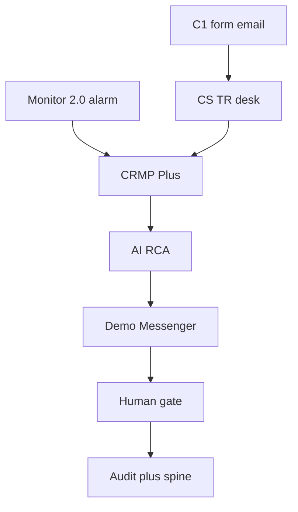

---

## 2. Sign in, stay signed in, switch language

### 2.1 Open the login page

1. Click **Sign in** in the left pane (safest on GitHub Pages).  
2. Or open [`/admin/login`](/admin/login) (safest). The old [`/login`](/login) page still exists, but on GitHub Pages you must use `/PRD/crmp-plus/login/` or `/PRD/crmp-plus/admin/login/` — plain `github.io/login` is a 404.

The admin is public in this prototype. Sign in only when you want a **named role** (so maker/checker and permissions behave like production).

### 2.2 Accounts you can use

Click a **Quick fill demo role** button, or type the email and password, then **Sign in**.

| Who | Email | Password | Use this when |
|---|---|---|---|
| Platform Owner | `haixiang.yan@hytechc.com` | `yan123` | You are demo platform owner, the named owner of this desk and these docs |
| Risk Owner | `risk.owner@vantagemarkets.com` | `risk123` | Approving AI packs and checker steps |
| Risk Analyst | `risk.analyst@vantagemarkets.com` | `risk123` | Triage and messenger challenge |
| Ops Lead | `ops.lead@vantagemarkets.com` | `ops123` | Proposing halt / block / widen / pause-copy |
| AI Engineer | `ai.engineer@vantagemarkets.com` | `ai123` | Skills, RAG, detectors, AI Admin proposals |
| System Admin | `system.admin@vantagemarkets.com` | `sys123` | Users, settings, audit, AI access blocklist |
| Super Admin | `admin@vantagemarkets.com` | `admin123` | Full demo rights (still cannot self-approve AI Admin when dual control is on) |
| CS Lead | `cs.lead@vantagemarkets.com` | `cs123` | 24/7 CS desk, follow-up waivers, assign to TR |
| CS Agent | `cs.agent@vantagemarkets.com` | `cs123` | C1 / form / mailbox first response |
| TR Lead | `tr.lead@vantagemarkets.com` | `tr123` | Execution-complaint quality |
| TR Dealer | `tr.dealer@vantagemarkets.com` | `tr123` | Reconstruct fills vs LP |

After Sign in you land on **Admin Home**. The name stays in this browser (`crmp_demo_session_v1`). Refreshing the public Pages site does not drop you back to a blank guest. Click **Sign out** in the left pane to clear it.

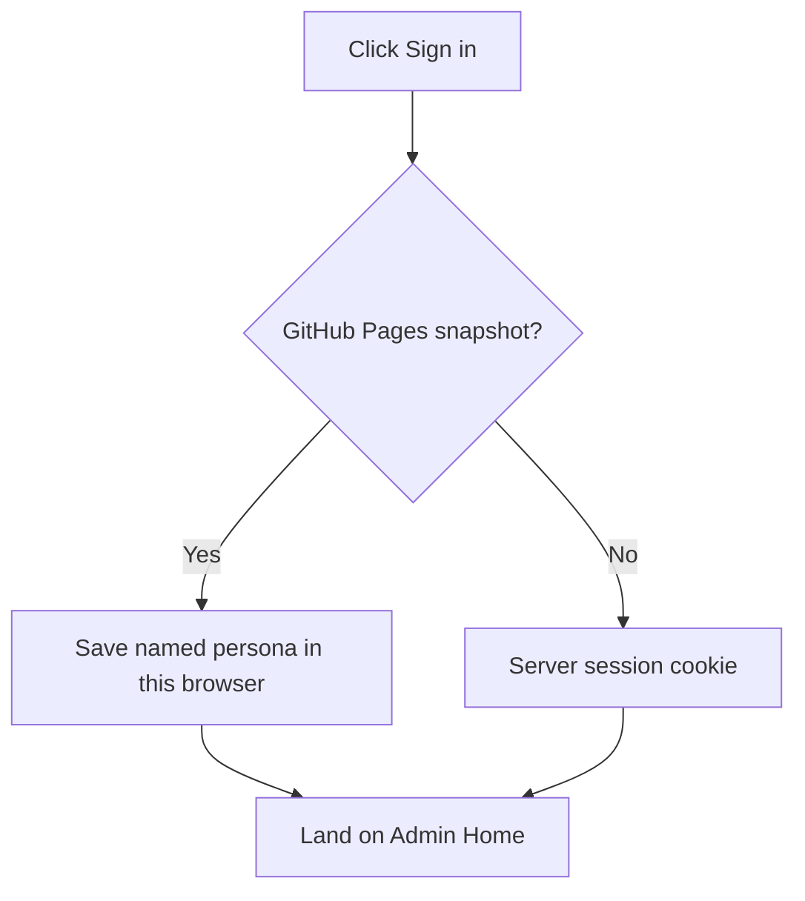

### 2.3 Language

Use **EN / 繁中** (sidebar on desktop; header on a phone). The choice is stored in the `crmp_ui_lang` cookie. Every left-nav label (including Demo Messenger), page title, URL Catalog row, and product doc (User Guide, PRD, TSD, UAT, Ecosystem, Roadmap, Open Issues, Progress) can switch. Open a doc with `?lang=zh-Hant` if you want to share a Chinese link. Public `/cs` chrome is Traditional Chinese too.

### 2.4 Phones

Tap the **hamburger** (Menu) to open the left nav. Messenger is list-first: tap a thread, then **Threads** to go back. Language sits in the header. Tables on Monitor 2.0, Realtime Alert & Tracker, and Audit scroll sideways when needed; the selection AI chatbot (below) also works with a long-press highlight.

### 2.5 Selection AI chatbot

On any admin page, **select text** (or long-press on a phone). A teal sparkle icon appears next to the highlight. Tap it: a chat drawer explains that passage in this CRMP’s terms (Monitor vs mock Lark, EXECUTED_MOCK, who can approve, which page to open). You can keep asking follow-ups. It is read-only — it cannot approve an intervention or change settings. On GitHub Pages it uses the same grounded glossary (no live LLM required).

---

## 3. The left menu (groups and unread numbers)

The left pane is grouped so you are not staring at one long list:

| Group | What lives there |
|---|---|
| **Overview** | Admin Home (includes spine stage ticket counts) |
| **Monitor & risk** | Daily Performance → Monitor 2.0 → Realtime Alert & Tracker → Market Intelligence → Risk Log → Risk Domains |
| **AI & knowledge** | AI Skills → Knowledge Tree → RAG → AI Admin (AI Analyses list lives on Realtime Alert & Tracker; Detectors left-nav removed → Monitor 2.0) |
| **Response** | Demo Messenger → CS / TR Desk → CS / TR Dashboard → CS / TR Log → CS / TR Data → Human Intervention → Escalation Routes → Lark |
| **Organisation** | BU and Teams → Users → Roles |
| **Platform** | Data Sources → Platform Settings → Audit Log → AI Access Security |
| **Docs** | User Guide → URL Catalog → UAT → PRD → TSD → Roadmap → Ecosystem → Open Issues → Progress Tracker |

The Vantage logo sits at the top. Your role badge (and **Public prototype** on GitHub Pages) sit under your name. Owner line: demo platform owner.

### Unread numbers

Some rows show a **teal badge** (Realtime Alert & Tracker, Demo Messenger, CS / TR Desk, CS / TR Dashboard, CS / TR Log, CS / TR Data, Market Intelligence, Human Intervention, Audit, Monitor 2.0, Risk Log).

- The number is **new things since you last opened that tab** in this browser.  
- Formula: `unread = max(0, (known total + extra bumps) − last seen)`.  
- Opening the page **clears** that badge for you (stored in `crmp_nav_seen_v1`).  
- When a scan, detector run on Monitor 2.0, or AI simulate creates new work, the badge **goes up** (`crmp_nav_extra_v1`).  
- On GitHub Pages the first paint uses fallback totals so you still see numbers even if the snapshot database looks empty.

The badge is a nudge, not a lock. You can always open the page.

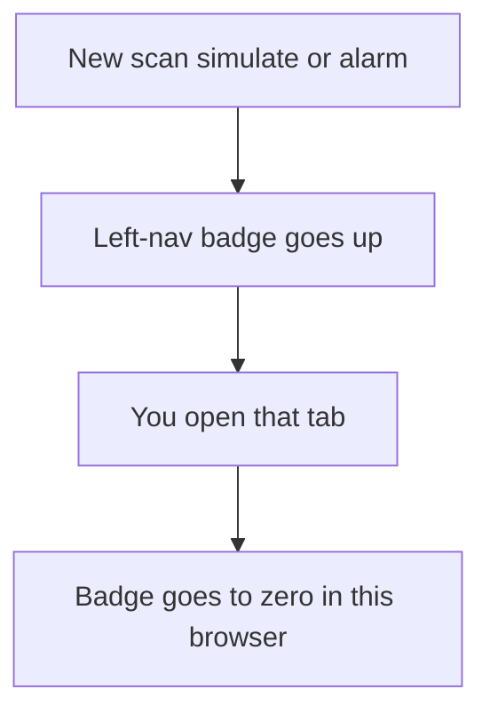

---

## 4. What each role does every day

### Risk Owner

1. Open [Realtime Alert & Tracker](/admin/alerts). Look for BREACH / CRITICAL (expand the card for the AI pack; detail packs stay at `/admin/ai-analyses/[id]` — the list URL redirects here).  
2. Open the dual-AI pack. If the second AI is `PARTIAL` or `DISAGREE`, do **not** approve an irreversible control yet.  
3. In [Demo Messenger](/admin/messenger): escalate, **Close (accept AI)**, or **Dismiss** a false alarm.  
4. On [Human Intervention](/admin/interventions), approve checker steps after Ops has maker-confirmed a control.  
5. Run the [UAT Checklist](/admin/docs/uat) when you sign off a release.

### Risk Analyst

1. Work the OPEN queue on Realtime Alert & Tracker.  
2. Expand the card / open the AI analysis. Read summary, evidence, and second-AI verdict.  
3. In messenger, **Show evidence**, then type in **Chatbot** if you disagree or have extra context.  
4. Escalate to Risk Owner when the pack is ready.

### Ops Lead / Analyst

1. From messenger **Recommended actions**, pick block / halt / cut leverage / pre-widen / pause-copy.  
2. Click **Double-confirm…** then **Yes, send to Vantage admin**. You get an admin reference and a link.  
3. If the thread says checker is needed, wait for Risk Owner on Human Intervention.

### AI Engineer

1. Keep [AI Skills](/admin/skills), [RAG](/admin/rag), and the indicator/detector registry on [Monitor 2.0](/admin/monitor-2) healthy (`/admin/detectors` redirects there).  
2. Propose setting/model/skill/RAG changes on [AI Admin](/admin/ai-admin). You cannot approve your own change.  
3. Tune `ai.second_opinion_severity` (default BREACH) under AI Admin parameters or Platform Settings.

### System Admin

1. Users, roles, **BU and Teams**, grouped settings.  
2. Review [AI Access Security](/admin/security/ai-access) — pages, functions and fields AI must never touch (includes RAG write blocklist / `propose_rag`).  
3. Watch [Audit Log](/admin/audit) (CRMP / Vantage Markets Admin tabs + Roll back) and the **home spine** stage ticket counts on Admin Home (`/admin/spine` redirects here).

### CS Lead (`cs.lead@vantagemarkets.com` / `cs123`)

1. Open [CS / TR Desk](/admin/cs-desk). Filter **CS**. Watch AWAITING CLIENT and ID VERIFY.  
2. Do **not** Resolve while a follow-up is WAITING. After `cs.followup_cap` auto-mails (default 3), follow up in person (the thread shows a SYSTEM cap note).  
3. Confirm the public portal [`/cs`](/cs) still posts into this inbox.  
4. Hand execution complaints to TR. Escalate book-risk / fraud to Risk (messenger spine). ID-verify stays on **CS KYC Vault** (`ESC-CS-KYC`).  
5. Check [CS / TR Dashboard](/admin/cs-dashboard) for WAITING / cap / TR / Risk counts. Check [CS / TR Log](/admin/cs-log) for CS_* events. Check [CS / TR Data](/admin/cs-data) for BUs, hops and `cs.*`. These are **not** Daily Performance or Risk Log.  
6. Sign [UAT-46](/admin/docs/uat) (three channels), [UAT-47](/admin/docs/uat) (wait loop), [UAT-51](/admin/docs/uat) (dashboard + log), [UAT-52](/admin/docs/uat) (supporting data) and [UAT-53](/admin/docs/uat) (categorize / severity / auto vs POC) when you accept a release.

### CS Agent (`cs.agent@vantagemarkets.com` / `cs123`)

1. First response on C1, the form and official email. Type in the desk composer as CS.  
2. If the case is thin (“help me ???”), let AI send **Email: need more detail** and wait.  
3. If the client cannot log in or asks to verify identity, let AI send **Email: ID verification** (passport + UID last four + selfie). Do not process a withdrawal on a verbal “it’s me”.  
4. When the client replies (portal, same C1 thread, or mail with `CSR-XXXX` in the subject), AI re-triages. If facts are still thin, wait again. If facts are collected, AI categorises, assigns severity and drafts a reply — FAQ may go out; KYC / complaint / trading hold for you or the named POC to **add detail before send**.

### TR Lead / Dealer (`tr.lead@…` / `tr.dealer@…` / `tr123`)

1. Filter the CS/TR inbox to **TR**. Seeded slippage / fill / MT4 / MT5 cases land as ASSIGNED TR with skill `SKILL-TR-EXECUTION`.  
2. Reconstruct the fill vs LP on the transcript. CS has already collected UID / ticket / time.  
3. Do not staff C1. If the case is really a CS FAQ, send it back. If it is book-risk, **Escalate to Risk**.

---

## 5. The main story: alarm → AI → chat → close

This is the path you will use most. Later sections explain every other page.

1. A detector run or Monitor 2.0 indicator breaches.  
2. An **OPEN** alert appears on Realtime Alert & Tracker (open-ticket count on Monitor 2.0 links here).  
3. Realtime Alert & Tracker gets an AI pack: `SKILL_MATCH` if a playbook fits, otherwise `RAG_REASONING`. Every analysis also opens a **How to improve** panel (data source, dormant indicator health, missing reasoning, new skill pattern, tighten limit X→Y, manual response time) with a chatbot to pull data, add facts, challenge, and regenerate until you mark it satisfactory.  
4. If severity is BREACH or CRITICAL, a **Second AI** panel appears (`AGREE` / `PARTIAL` / `DISAGREE`).  
5. Click **Sync alerts** on Demo Messenger so the pack is a chat thread.  
6. **Show evidence** posts the vault into the thread. Chat if you challenge the story.  
7. **Escalate**, **Dismiss** (false alarm), or **Close (accept AI)**.  
8. For a control: pick a recommended action → double-confirm → checker if required.  
9. Confirm the same events in **Audit Log** and on the **home spine** (stage ticket counts).

**Demo shortcuts on Realtime Alert & Tracker** (localhost **grouped AI pipeline** panel + rank note): Analyze all open alarms, Simulate COPY breach (skill path), Simulate EQ drawdown (RAG path), Simulate CRITICAL (2nd AI challenge), Backfill 2nd AI challenges. `M2-*` codes are clickable **MonitorCode** chips with tooltips → Monitor 2.0.

**Decision rule:** `AGREE` may follow the playbook under policy. `PARTIAL` / `DISAGREE` means **needs human** — no irreversible control until a person has read both AIs.

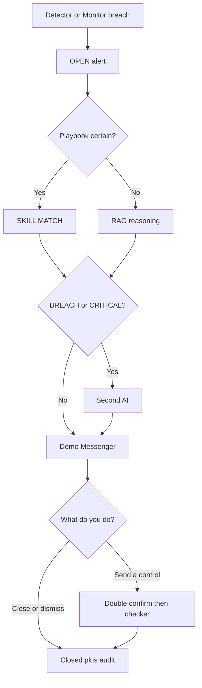

---

## 6. Overview

### 6.1 Admin Home — `/admin`

**What it is.** The landing page after login. A snapshot of how busy the desk is.

**What you see.**

- Owner card for **demo platform owner**. The whole card opens Sign in as platform owner.  
- A Lark-style messenger promo. The whole card opens the messenger demo (permanent GitHub Pages URL is on the card).  
- A **CS / TR desk** promo. The whole card opens `/admin/cs-desk`; the client portal URL (`/cs`) is printed on the card.  
- Clickable count cards: Users, Teams (opens **BU and Teams**), Data Sources, Risk Domains, Open Alerts, Open Tickets, Lark Channels, Escalation Routes. Each card jumps to that page.  
- **Jump to a page** tiles for Daily Performance, Market Intelligence, Monitor 2.0, Realtime Alert & Tracker, AI Skills, Knowledge Tree, Human Intervention, Messenger, Settings, User Guide, PRD.  
- Recent alerts. Each row opens that alarm on Realtime Alert & Tracker. **View all** lists every alarm.  
- **Dummy spine run** buttons: **Dummy alert** (one) and **Dummy alert group** (three linked). On localhost they walk DETECT → AI (skill or RAG) → messenger maker/checker → escalate → close, then highlight the new cards and spine. Audit `DUMMY_SPINE_RUN` and Risk Log keep the trail. Chrome and stored English copy display in 繁中 when the UI language is zh-Hant.  
- **Integration spine** with **stage ticket counts** (Detect → Alarm → AI RCA → Skill → Human → Resolved → Dashboard). Each step opens the matching page. There is **no separate Spine Log tab** — `/admin/spine` redirects here.  
- Header shortcuts: Messenger, User Guide, Daily Performance.

**What to click.** Use the cards as a map. If Open Alerts is not zero, go there first.

**Good looks like.** Counts match the other pages. Cards are links, not dead tiles.

---

## 7. Monitor & risk

### 7.1 Daily Performance — `/admin/dashboard`

**What it is.** End-of-day CFD and crypto risk picture — the last stage of the spine.

**What you see.** Report date, WARN/BREACH counts for CFD and crypto, then metric cards (value, target, notes, health).

**What to click.** **Refresh** (localhost) rebuilds live metrics from `/api/dashboard`. On Pages the numbers are the seeded snapshot.

**Good looks like.** Both product columns present. Status badges are readable (HEALTHY / WARN / BREACH).

### 7.2 Risk Log Analytics — `/admin/risk-log`

**What it is.** The history book: closed tickets, what fired, how long humans took, money lost vs money prevented, and where loopholes cluster.

**What you see.**

- Summary tiles: open alerts, loss vs prevented vs exposure, average ack/resolve/handling minutes, SLA breaches, pending vs decided interventions.  
- **Historical charts (90 days)** on Overview / Historical charts — alerts & open book, loss vs prevented, handling latency. Days before the live demo window are backfilled so the series reads as a full quarter.  
- **Closed alerts & tickets** on Overview — the same tracker cards as Realtime Alert, but only after the ticket is closed: realtime status (ticket closed), AI analysis, AI/BU action logs, and the final solution mandated by AI or the business-unit POC.  
- Tables by category and by domain.  
- Loophole tags (repeat weak spots).  
- Chronological records (alert, ticket, outcome, USD).

**What to click.** Read the charts, then expand a closed card for the full pack. Filter / scan the tables. Open work still lives on Realtime Alert.

**Good looks like.** Charts span ~90 days (not a flat spike on one day). Closed cards show ticket-closed, an AI report, a BU/AI action log, and a mandated solution. Totals add up. Handling times are filled for closed work. Loophole tags are not empty on the seeded demo.

### 7.3 Market Intelligence — `/admin/market-intel`

**What it is.** A five-minute look at news, social, official and exchange posts that can move LP prices. Findings feed indicator `M2-MKT-INTEL` and a messenger outbox (Lark group `oc_market_intelligence` in production).

**What you see.** After the four summary cards: **past hour** and **past 24 hours** headline events, then a **sentiment barometer** for core Vantage CFD instruments (forex, metals/energy, indices, crypto). Tabs: **Findings**, **Messenger outbox**, **Sources**, **Scan log**. Cards show products and direction, region flags, impact (not “violation”), source **article URLs**, and timestamp. Scheduler on/off. Skill playbook link.

**What to click.**

1. Turn the feature on in Platform Settings (`market_intel.enabled`) if the desk looks idle.  
2. Read the pulse cards (hour / 24h) and the instrument barometer. Click a headline to jump to that finding; click a symbol to filter findings to that product.  
3. Click **Scan now**.  
4. Read new Findings, then the outbox, then the scan log.

**GitHub Pages:** there is no `/api`, so **Scan now** runs a **local demo scan** from the same event templates as the live scanner. New cards appear at once and are stored in this browser (`crmp_mi_demo_v1`). Real HTTP scrapes still belong on `localhost:3000`. You will **not** get a 405 error.

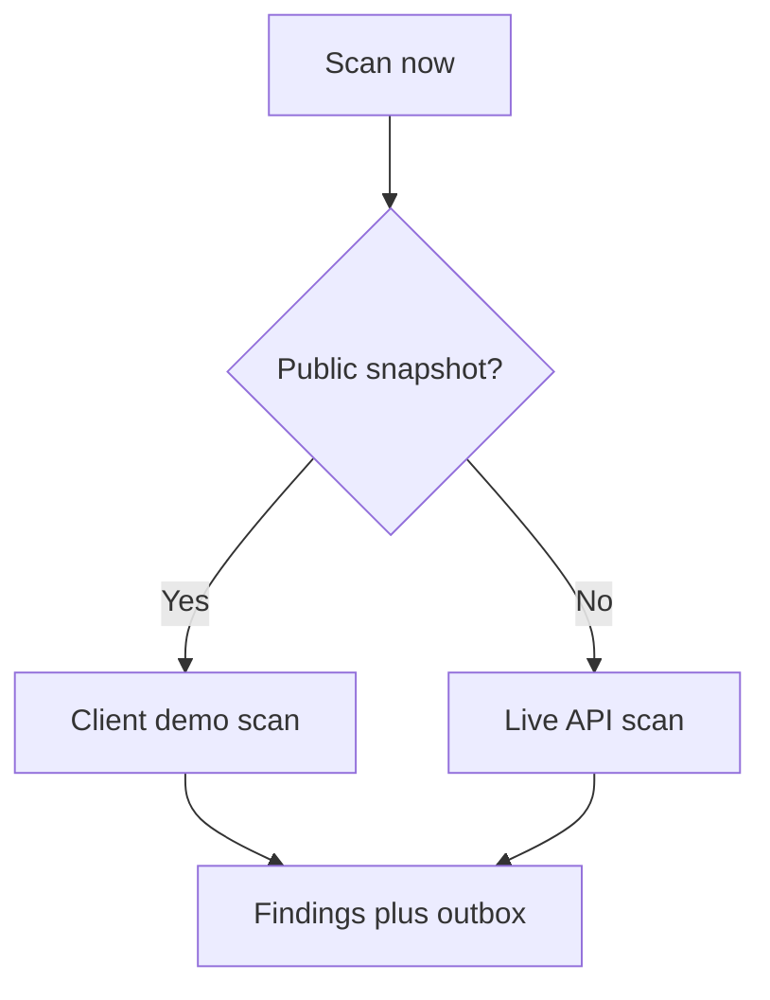

**Good looks like.** Scan finishes with a count. Findings, outbox and scan log all update. The Realtime Alert & Tracker / Market Intelligence unread badge may tick up.

### 7.4 Monitor 2.0 — `/admin/monitor-2`

**What it is.** The integration hub for the existing indicator platform **and** the detector registry. CRMP does not replace Monitor 2.0; it syncs from it. Detectors are no longer a separate left-nav page.

**What you see.**

- Upstream panel: `monitor2.base_url`, a note that detectors are merged here, and that **alerts / tickets live on Realtime Alert & Tracker**.  
- **Run all** (samples every enabled detector; warn/breach auto-raise alarms and kick AI RCA) and **Sync now (prototype)** when you have operate rights.  
- One **indicator + detector** table: name, `M2-*` MonitorCode, detector code / comparator, description, domain, product, editable warn/breach, sampling frequency, risk scenarios, combinations (sequence / together), status, last refreshed, open-ticket count (links to Realtime Alert filtered by monitor id), and **Pause** (paused indicators skip AI).  
- **Recent runs** — observed value, severity, linked alert and analysis.

Legacy `?tab=alerts` / `?tab=tickets` deep-links bounce to Realtime Alert & Tracker.

**What to click.** **Run all** or Sync on localhost. Pause a noisy indicator. Click an open-ticket count or `M2-*` chip. On Pages, treat the catalogue as read-oriented (no live `/api`).

**Good looks like.** Indicators EQ / MRG / COPY (and others) are present with detector codes. Run all can produce a BREACH and tick Realtime Alert / Monitor 2.0 badges. Paused rows show IDLE and do not fire AI. Home spine DETECT → ALARM moves after a real run.

### 7.5 Detectors URL — `/admin/detectors` (redirect)

**Bookmarks only.** `/admin/detectors` redirects to [Monitor 2.0](/admin/monitor-2). There is **no Detectors row** in the left nav. Run sampling, thresholds, pause, and recent runs on Monitor 2.0; open alarms on Realtime Alert & Tracker.

### 7.6 Realtime Alert & Tracker — `/admin/alerts`

**What it is.** The operational queue: what is still open right now, plus the **grouped AI pipeline** controls. Closed tickets leave this page and land in Risk Log Analytics. The AI Analyses list URL (`/admin/ai-analyses`) redirects here; per-analysis evidence packs stay at `/admin/ai-analyses/[id]`.

**What you see.** Open cards only, sorted CRITICAL → BREACH → WARN, newest first. Each card: severity, status, product, domain, title, message, alert id, `M2-*` MonitorCode (tooltip → Monitor 2.0), observed value, ticket id, time. Expand for AI RCA, how-to-improve, second-AI verdict, POC, gates, escalation and action log. Localhost also shows the five demo AI buttons (analyze open / simulate skill / RAG / CRITICAL / backfill 2nd AI).

**What to click.** **Acknowledge** on an OPEN alert if you have operate rights. Expand the card or open the analysis detail for the pack; use Messenger for evidence and controls. Use **View closed alerts in Risk Log Analytics** to read tickets that already closed. The unread badge clears when you visit this page.

**Good looks like.** Only still-open items. Ack moves status to ACKNOWLEDGED. Closed work is not mixed into this queue. BREACH/CRITICAL show a second-AI badge when challenged.

### 7.7 Risk Domains — `/admin/risk-domains`

**What it is.** The catalogue of CFD and crypto risk areas — original domains plus **Firm-wide Systemic & Contagion (P0)**, **Third-party & Vendor Dependency (P3)**, and **Reputation & Client Communications (P3)**. Each domain breaks into concrete risk scenarios.

**What you see.** Coloured priority pills (**P0** rose, **P1** orange, **P2** amber, **P3** slate), code, product coverage, owner / supporting BUs, owned Monitor 2.0 indicator chips, and expandable scenarios with plain-English **How it works**, **Participants**, **Impacts**, plus primary and related Monitor 2.0 links.

**What to click.** Expand a scenario. Click any `M2-*` chip to jump to Monitor 2.0 anchored on that indicator.

**Good looks like.** Every domain has an owner. Every scenario lists at least one Monitor 2.0 indicator. Product coverage is CFD, Crypto, or both.

---

## 8. AI & knowledge

### 8.1 AI Analyses — merged into Realtime Alert & Tracker (detail `/admin/ai-analyses/[id]`)

**What it is.** The RCA workbench is merged into **Realtime Alert & Tracker** (`/admin/alerts`). `/admin/ai-analyses` redirects there — it is **not** a left-nav page. Per-analysis evidence packs stay at `/admin/ai-analyses/[id]`.

**What you see on Realtime Alert & Tracker.** A **grouped AI pipeline controls** panel (with rank/ordering note) and five working buttons, then open tracker cards. `M2-*` monitor ids are **MonitorCode** chips — hover for tooltip, click to open Monitor 2.0 anchored on that indicator. Expand a card for mode (`SKILL_MATCH` or `RAG_REASONING`), confidence, **2nd AI · verdict**, the **how to improve** panel (chatbot: Pull data / Add fact / Challenge / Regenerate / Mark satisfactory), and the action log.

**What to click (demo, localhost).**

- Analyze all open alarms — ensures every open alert has an AI pack (fast; reuses existing).  
- Simulate COPY breach — skill path + second AI.  
- Simulate EQ drawdown — forced RAG path; WARN usually skips second AI.  
- Simulate CRITICAL — margin skill + second AI.  
- Backfill 2nd AI challenges — attaches challenger rows to older high-severity packs.

**Good looks like.** All five buttons respond with a status line (not stuck disabled). Every analysis has a how-to-improve review. BREACH/CRITICAL get a second-AI badge. `PARTIAL` / `DISAGREE` sets needs-human.

### 8.2 AI Admin — `/admin/ai-admin`

**What it is.** Governance for AI, **not** the live RCA list. Maker proposes; a **different** person checks.

**Tabs / cards.**

| Tab | What you do |
|---|---|
| Overview | KPIs plus **first-line** and **second-line** AI Admin cards (models, confidence gate, RAG top-K, challenger) |
| Parameters | Draft `ai.*` / `ai.line1.*` / `ai.line2.*` settings. **Propose** does not apply yet |
| Maker / Checker | Pending change requests first. Approve or reject with a note. You cannot approve your own |
| Skills | Propose create/update/disable of a playbook. Applied only after approve |
| RAG | Propose create/update/retire via **`propose_rag`** (AI cannot write the corpus directly) |
| Training | Queue a recalibration run (becomes a TRAINING change request) |
| History | Accuracy snapshots (about 14 days) |

Header badges show whether you are Maker, Checker, or both. Risk Owner can be both, but **self-approve is still blocked**.

**Good looks like.** A proposed skill stays PENDING until another user approves. After approve it appears on AI Skills. Parameter values on the live desk do not move until APPROVED.

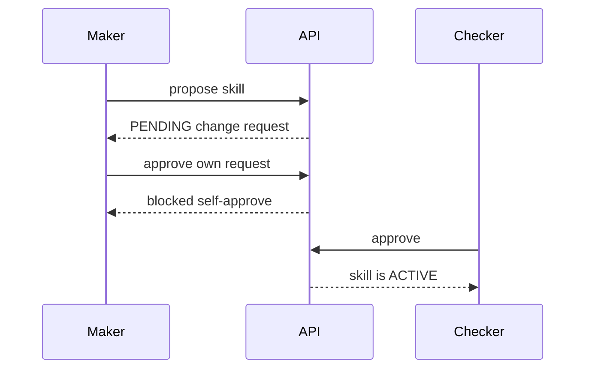

### 8.3 AI Skills — `/admin/skills`

**What it is.** Playbooks in SKILL.md style: when to use, when not to, prechecks, steps, evidence, stop conditions, success criteria, thresholds and why, fault areas, escalation, BU corrections, past cases.

**What you see.** Search box. Two tabs: **Single-indicator skills** and **Linked timelines** (multi-indicator chains). Cards stay compact (code, name, product, domain, auto vs manual).

**What to click.** **Enter** opens `/admin/skills/{code}` — the full playbook page (not a tiny card). From there: back to skills, knowledge tree, AI analyses, risk log. CS/TR desk chips jump here for `SKILL-CS-CLARIFY`, `SKILL-CS-ID-VERIFY`, `SKILL-CS-ACCOUNT-FAQ`, `SKILL-TR-EXECUTION`, `SKILL-CS-ESCALATE-RISK`. Linked timeline **CHAIN-CS-TR-INTAKE** is the intake path.

**Good looks like.** Enter never 404s for a seeded skill (including the five CS/TR playbooks). Linked timelines show sequence, causes, linked skills. Each CS/TR skill binds one route: `ESC-CS-24-7`, `ESC-TR-DEAL` or `ESC-CS-RISK`.

### 8.4 Knowledge Tree — `/admin/knowledge-tree`

**What it is.** A picture of how knowledge hangs together: CRMP → risk domains (including **CS_SERVICE** and **TRADING_EXEC**) → skill playbooks, with linked timelines and **RAG document leaves** (deep links into `/admin/rag?doc=`). CS/TR intake skills (`SKILL-CS-CLARIFY`, `SKILL-CS-ID-VERIFY`, `SKILL-CS-ACCOUNT-FAQ`, `SKILL-TR-EXECUTION`, `SKILL-CS-ESCALATE-RISK`) hang off those two trunks with `cs-*` RAG leaves.

**What you see.**

- **Tree map** (default) or **Outline**.  
- Product filter: All / CFD / Crypto.  
- Trunk switch: Risk domains, Linked timelines, RAG corpus.  
- Click a **domain** to fan out its skills. Click a **skill** to fill the inspector.  
- **Enter** / **Enter full playbook** opens the SKILL.md page.  
- **RAG document leaves** open the RAG library on that doc. Docs are matched by tags and title; `MonitorCode` chips link to Monitor 2.0.

Domains wrap on two rows so labels stay readable. There is no sideways-only strip of ten tiny boxes.

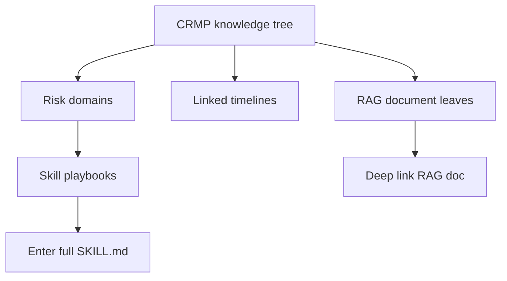

**Good looks like.** LP_HEDGE expands to hedge skills. **CS_SERVICE** expands to CS 24/7 playbooks; **TRADING_EXEC** to TR dealing. RAG trunk groups documents by category (including CS_POLICY) and shows clickable leaves. Enter navigates; it is not a dead SVG link.

### 8.5 RAG Knowledge Base — `/admin/rag`

**What it is.** The internal corpus used when a skill is not certain: policies, products, entities, platforms.

**What you see.** Filter by category, search box, document cards (key, title, tags, status, excerpt). A **retrieve** box to try a query (top-K hits with scores). An **AI write block / human-gate** banner: pages and corpus fields AI cannot edit escalate to a human — humans with `rag.manage` write, or AI Admin **`propose_rag`** for maker-checker.

**What to click.** Retrieve with a phrase like “copy trading concentration gold margin” and confirm hits look relevant. Production-like creates should go through AI Admin `propose_rag`; this page is the corpus browser (and human write when permitted).

**Good looks like.** Retrieve returns ranked hits. Retired docs drop out of search. AI cannot POST/PATCH `/api/rag` as a service actor; blocked edits surface as a human gate.

### 8.6 Spine on Admin Home — `/admin` ( `/admin/spine` redirects )

**What it is.** The end-to-end tape lives on **Admin Home** as the integration spine with **stage ticket counts**: DETECT → ALARM → AI_RCA → SKILL_EXECUTE → HUMAN_INTERVENTION → RESOLVED → DASHBOARD. The dedicated **Spine Log** left-nav tab was removed.

**What you see.** Per-stage counts (open work + 24h activity) and latest event titles; each step links to the matching page.

**What to click.** Read-only orientation. After you **Run all** on Monitor 2.0 or close a messenger thread, confirm matching stages move on localhost.

**Good looks like.** A COPY breach demo moves Detect / Alarm / AI RCA counts. No silent gaps on the happy path.

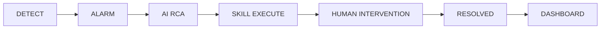

---

## 9. Response

### 9.1 Human Intervention — `/admin/interventions`

**What it is.** The checker desk for runtime actions (not AI Admin config). Maker already asked for a control; you approve or reject.

**What you see.** Cards: action code, status, analysis, indicator, alert title/severity, skill step, requested time, and **actioner email** on samples. Pending items have a note box plus **Approve** and **Reject**.

**What to click.** Type a short reason. Approve to go live (prototype records the decision). Reject to stop. Both write spine + audit.

**Good looks like.** Pending count matches the home / AI Admin KPI. Decided rows show who (email) and when.

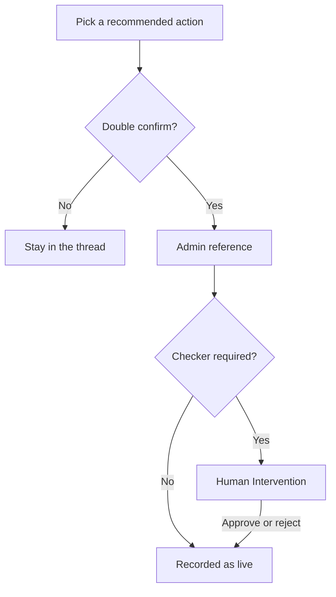

### 9.2 Demo Messenger — `/admin/messenger`

**What it is.** In-app Lark-style inbox. Production will use real Lark; this page proves the buttons and the audit trail.

**Layout.** Desktop: thread list + **bird-eye POC windows** side by side. Phone: list → tap thread → path chips → one POC chat at a time. Each hop on the escalation path (primary desk → secondary → Risk Owner → Exec) is its own Lark window with the named POC. Escalate **hands the case to the next window** so you can see the relay.

**Toolbar.** **Sync alerts** pulls new Monitor alarms into threads.

**On an open thread you can:**

| Button | What it does |
|---|---|
| **Show evidence** | Posts the evidence vault and second-AI summary into the chat |
| **Chatbot** (type + Send) | Challenge the AI or add facts. Disagreement flags `needs_human` |
| **Escalate** | Moves Primary → Secondary → Risk Owner → Exec along the route |
| **Dismiss** | False alarm. Closes the thread and the alert |
| **Close (accept AI)** | Accepts the analysis and closes the ticket |
| **Recommended actions** | Block user, halt trading, cut max leverage, pre-widen spreads, pause copy joining |
| **Double-confirm…** then **Yes, send to Vantage admin** | Creates an admin reference + link (often Interventions) |
| **Checker approve (go live)** | When the system says a checker is required |
| **Open in admin** | Jumps to the matching admin page (must stay under `/PRD/crmp-plus/` on Pages) |

**Good looks like.** Sync creates threads. Evidence posts a vault, not an empty bubble. Escalate advances the path. Dismiss/Close change statuses. Double-confirm yields an admin_ref. Open in admin does not 404 on GitHub Pages.

Permanent URL: [https://hxyan2020.github.io/PRD/crmp-plus/admin/messenger/](https://hxyan2020.github.io/PRD/crmp-plus/admin/messenger/)

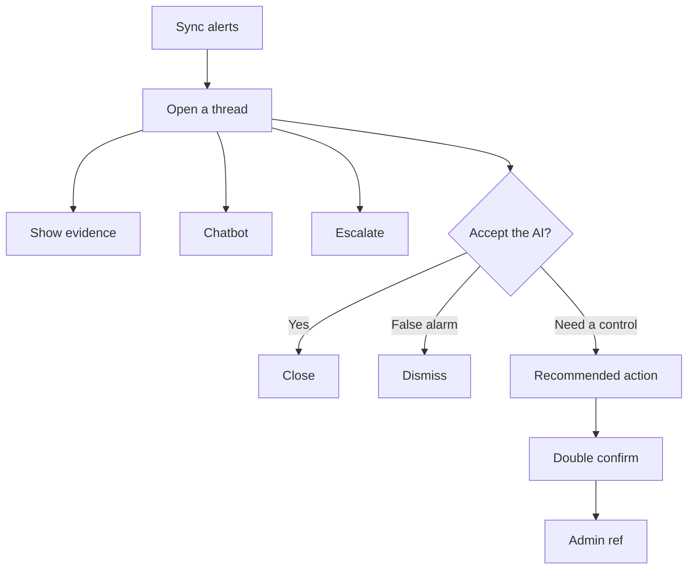

### 9.3 CS / TR Desk — `/admin/cs-desk`

**What it is.** 24/7 Customer Service and Trading Support — the client door on CRMP Plus. Three public channels land here in realtime through one webhook (`POST /api/cs/intake`, header `x-cs-intake-token: demo-c1`):

| Channel | Code | Who sends it |
|---|---|---|
| Platform **C1 live chat** | `C1_LIVE_CHAT` | C1 widget / `/cs` chat tab / C1 webhook |
| Website / app **submission form** | `WEB_FORM` | `/cs` form tab / website contact form |
| **Official email** (support@, complaints@) | `OFFICIAL_EMAIL` | `/cs` mailbox tab / mailbox gateway |

Clients use the public portal **[`/cs`](/cs)** (permanent: [https://hxyan2020.github.io/PRD/crmp-plus/cs/](https://hxyan2020.github.io/PRD/crmp-plus/cs/)). Staff work the inbox on this page. Original CRMP Admin has **no** CS/TR desk — that snapshot stays frozen.

**What you see.** Inbox filter All / CS / TR. Each request shows channel, desk, AI clarity (clear / unclear / need ID), **severity** (LOW / MEDIUM / HIGH / CRITICAL), **sensitivity** (AI may reply / POC review), a **dedicated skill chip** and status (OPEN, AWAITING CLIENT, ID VERIFY, ASSIGNED TR, POC REVIEW, AI REPLIED, ESCALATED RISK, RESOLVED). The chip **Enter**s `/admin/skills/{code}`. The thread mixes client chat, AI routing notes, **automatic follow-up emails**, the AI solution + draft, and POC addenda. Unread badge on this left-nav row ticks when new intake lands.

#### 9.3.1 Client portal — `/cs`

**Who uses it.** The client, not the operator. No login. Language toggle EN / 繁中 (same `crmp_ui_lang` cookie).

**Three tabs**

1. **C1 live chat** — type a message. Follow-ups in the same browser stay on one C1 `channel_ref` (shown under the send button).  
2. **Submission form** — name, email, optional UID, subject, message. Posts `channel=WEB_FORM`.  
3. **Official email** — same fields plus optional **In-Reply-To / ticket**. Put `CSR-XXXX` in the subject or that box to continue a waiting auto-email.

**What happens after Send.** A result card shows the public ticket id (`CSR-XXXX`), status, skill, and — if AI is unclear or needs ID — the automatic official email that is now WAITING. GitHub Pages has no live `/api`; the tabs still render and explain that live POST belongs on `localhost:3000`.

**Good looks like.** A short “help me ???” on the chat tab produces AWAITING CLIENT plus a yellow “automatic official email is waiting”. A later chat in the same tab, or a mailbox tab with that `CSR-XXXX` in the subject, continues the ticket instead of opening a duplicate.

#### 9.3.2 How replies find the same ticket

Inbound C1 / form / mailbox payloads **continue** an open request when they match, in this order:

1. `request_id` (`CSR-XXXX`)  
2. `In-Reply-To` (message id, channel_ref, or CSR-XXXX)  
3. The same C1 / form / mailbox `channel_ref` on a live thread  
4. `CSR-[0-9A-F]{6}` in the email subject (what the auto-mail already prints: “request CSR-A1B2C3”)

A match that still has a WAITING follow-up is treated as the **client reply**: WAITING becomes REPLIED, AI re-triages. A resolved thread with the same C1 session starts a **new** ticket.

`GET /api/cs/intake` returns the connector catalog. `GET /api/cs/intake?request_id=CSR-XXXX` returns public status only (no email or name).

#### 9.3.3 When AI emails and waits

If AI cannot tell what the client needs, or KYC/ID is required, it **must not guess**. It sends an official `EMAIL_OUT`, keeps the case open, and waits.

| Clarity | Status | What the auto-mail asks | Skill |
|---|---|---|---|
| **Unclear** — shorter than ~48 characters, or “help me / ??? / 不清楚” | AWAITING CLIENT | What happened, when (timezone), UID, symbol / order / screenshot, what they want | `SKILL-CS-CLARIFY` |
| **Need ID** — KYC / passport / verify account / cannot login / 核身 | ID VERIFY | Passport or ID photo, UID last four, selfie that matches the holder | `SKILL-CS-ID-VERIFY` |

**Until the client replies.** Resolve is **blocked** while any follow-up is WAITING. The loop repeats on each thin reply. Cap **3** automatic mails, then a SYSTEM note tells CS Lead to follow up in person — no more auto-mail.

**How the client replies (any of these close WAITING):**

- Same C1 chat tab (`channel_ref`)  
- Official-email tab or real mailbox with `CSR-XXXX` in the subject / In-Reply-To  
- Desk button **Simulate client email reply** (demo only)

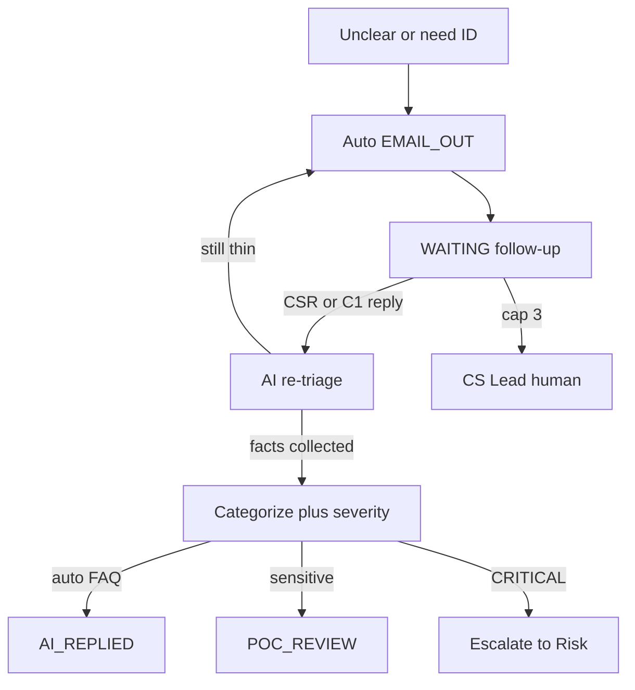

#### 9.3.4 Dedicated SKILL.md playbooks

Triage stamps `skill_code`. Click the chip to read when-to-use / stop / success. Knowledge Tree trunks **CS_SERVICE** and **TRADING_EXEC**; linked timeline `CHAIN-CS-TR-INTAKE`; RAG leaves `cs-24-7-intake`, `cs-id-verify-policy`, `cs-swap-faq`, `tr-dealing-handoff`, `cs-escalate-to-risk`, `cs-skill-playbooks`.

| Skill | When you see it | Desk / status | Escalation route |
|---|---|---|---|
| `SKILL-CS-CLARIFY` | Thin “help me ???” | CS · AWAITING CLIENT | `ESC-CS-24-7` |
| `SKILL-CS-ID-VERIFY` | KYC / cannot login | CS · ID VERIFY | `ESC-CS-24-7` |
| `SKILL-CS-ACCOUNT-FAQ` | Clear swap / hours / UID question | CS · OPEN | `ESC-CS-24-7` |
| `SKILL-TR-EXECUTION` | Fill / slippage / MT4 / MT5 | TR · ASSIGNED TR | `ESC-TR-DEAL` |
| `SKILL-CS-ESCALATE-RISK` | Book-risk / fraud / wallet | ESCALATED RISK → messenger | `ESC-CS-RISK` |

CS does **not** arm trading controls. TR does **not** staff C1. Book-risk leaves this desk and joins Demo Messenger / Human Intervention.

#### 9.3.5 What to click (operators)

| Button | What it does |
|---|---|
| **AI triage** | Re-run routing (CS vs TR, category, clarity) and stamp the dedicated SKILL.md |
| **AI analyse + draft** | After facts are collected: categorise, assign severity, draft a solution and a client reply, then auto-send or hold for a named POC |
| **Email: need more detail** | AI sends an official mail asking what happened / UID / screenshot; status AWAITING CLIENT |
| **Email: ID verification** | AI asks for passport/ID + UID last four + selfie; status ID VERIFY |
| **Simulate client email reply** | Demo stand-in for a real mailbox / portal reply; AI re-triages; collected facts trigger analysis |
| **Assign to TR** | Hands execution complaints to TR Dealing Support (`SKILL-TR-EXECUTION`) |
| **Escalate to Risk** | Leaves CS/TR; skill `SKILL-CS-ESCALATE-RISK`; messenger spine |
| **POC addendum + send** | Named POC adds detail to the AI draft, then the official mail goes out; status AI REPLIED |
| **Resolve** | Close — blocked while a follow-up is still WAITING |
| **Simulate C1 / form / email** | Posts through the same intake API the portal uses |
| **Open client intake portal** | `/cs` — the three public connectors a real user would see |
| Desk composer + Send | Reply as CS / TR on the transcript |

Need `cs.operate` (CS Lead, CS Agent, Super Admin, …) to act. `cs.read` / `lark.read` can watch. Audit (CRMP tab) writes `CS_INTAKE`, `CS_FOLLOWUP_EMAIL`, `CS_CLIENT_REPLY`, `CS_INTAKE_CONTINUE`, `CS_AI_ANALYZE`, `CS_AI_REPLY`, `CS_POC_REVIEW`, `CS_POC_RELEASE`, `CS_ASSIGN_TR`, `CS_ESCALATE_RISK`, `CS_RESOLVE`.

#### 9.3.6 Seeded cases — good looks like

| Seed | Channel | Skill | What you should see |
|---|---|---|---|
| Liam Okafor — swap on XAUUSD overnight | C1 | `SKILL-CS-ACCOUNT-FAQ` | OPEN, clear |
| Sofia Mendes — “help me something wrong ???” | C1 | `SKILL-CS-CLARIFY` | AWAITING CLIENT + WAITING auto-mail |
| Chen Wei — EURUSD slippage on MT5 | Form | `SKILL-TR-EXECUTION` | ASSIGNED TR |
| Priya Shah — verify my account, cannot withdraw | Official email | `SKILL-CS-ID-VERIFY` | ID VERIFY + WAITING ID pack |

Trading keywords go to TR. Skill chips open playbooks. 繁中 labels the chrome. UAT-46 (three channels + `/cs`), UAT-47 (wait loop), UAT-48 (TR / Risk), UAT-50 (skills + tree), UAT-51 (dashboard + log), UAT-52 (BU / hops / `cs.*`), UAT-53 (categorize / severity / auto vs POC).

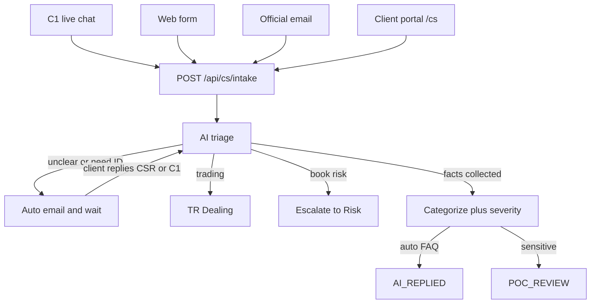

#### 9.3.7 CS / TR Dashboard — `/admin/cs-dashboard`

**What it is.** The CS/TR volume board. It is **not** [Daily Performance](/admin/dashboard) (CFD / crypto day-end) and **not** [Risk Log Analytics](/admin/risk-log) (closed Monitor tickets).

**What you see.** Totals, open vs resolved, WAITING auto-mail, cap-3, TR / assigned, Escalated Risk, ID verify, awaiting client, **POC review**, **AI replied**, CS vs TR desk, **by severity**. Bars by channel, status, skill, desk, AI clarity. A waiting list and recently updated requests.

**What to click.** Open a `CSR-XXXX` to jump to the desk. Open CS / TR log for the CS_* timeline. `GET /api/cs?view=dashboard` returns the same payload on localhost.

**Good looks like.** Seeded inbox: at least one WAITING row (Sofia / Priya), a TR bucket (Chen Wei slippage), C1 + form + email channels, SKILL-CS-* / SKILL-TR-* bars. 繁中 labels the chrome.

#### 9.3.8 CS / TR Log — `/admin/cs-log`

**What it is.** The CS_* story for this door: intake, continue, follow-up email, client reply, agent reply, assign TR, escalate risk, resolve — plus resolved request packs. The generic [Audit Log](/admin/audit) still has CRMP / Vantage tabs; Risk Log still holds Monitor closures.

**What you see.** Filter chips per `CS_*` action, a search box (actor / CSR-XXXX), a timeline, and a resolved-packs table.

**What to click.** Filter `CS_FOLLOWUP_EMAIL` to see the wait loop. Filter `CS_RESOLVE` after you close a clear FAQ. Open the desk from a request id.

**Good looks like.** Seeded intake writes `CS_INTAKE` (and often `CS_FOLLOWUP_EMAIL`). Resolving a clear case adds `CS_RESOLVE` and a pack on this page, **not** on Risk Log.

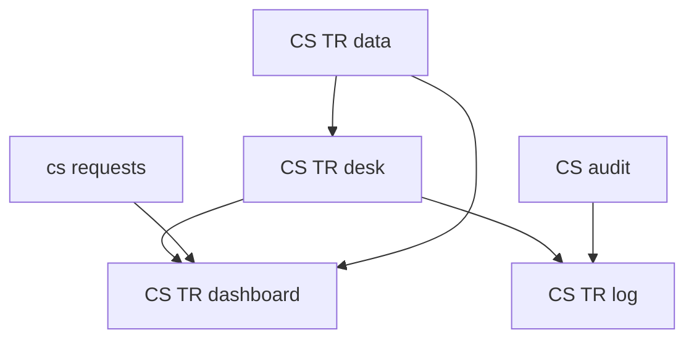

#### 9.3.9 CS / TR Data — `/admin/cs-data`

**What it is.** The live operational contract the desk, dashboard and log already consume: Customer Service and Trading BUs, nested teams, named POCs, four escalation hops, `cs.*` parameters, KYC vault and dealing-tape sources. Permanent URL: [https://hxyan2020.github.io/PRD/crmp-plus/admin/cs-data/](https://hxyan2020.github.io/PRD/crmp-plus/admin/cs-data/). Edit the records on [BU and Teams](/admin/departments), [Escalation Routes](/admin/escalation), [Platform Settings](/admin/settings#settings-cs), [Data Sources](/admin/data-sources) and [Lark](/admin/lark) — this page is the read-out.

**What you see.** Follow-up cap, **AI auto-reply max severity**, **sensitive categories**, wait / KYC / TR / Risk SLAs, intake token, support@ and complaints@. Two BUs. Teams **CS 24/7 Desk**, **CS KYC Vault**, **TR Dealing Support** with on-call and POC names. Hops `ESC-CS-24-7` (clarify / FAQ), `ESC-CS-KYC` (ID verify), `ESC-TR-DEAL` (execution), `ESC-CS-RISK` (book-risk). Seeded C1 / form / mailbox plus KYC vault and MT4/MT5 tape. Lark chats `oc_cs_c1`, `oc_cs_kyc`, `oc_tr_dealing`.

**What to click.** Jump to org / hops / `cs.*` / sources / Lark / desk. `GET /api/cs?view=data` on localhost returns the same payload.

**Good looks like.** CS KYC Vault exists (not only claimed on the BU card). `SKILL-CS-ID-VERIFY` binds `ESC-CS-KYC`. Cap on this page matches Platform Settings `cs.followup_cap` and the dashboard. Auto-max and sensitive-categories tiles match `cs.auto_reply_max_severity` / `cs.sensitive_categories`. ID images are not a data source — the vault is status flags only. 繁中 labels the chrome.

#### 9.3.10 After facts are collected — categorize, severity, AI draft

**What it is.** The wait loop must **stop guessing** once the client has given enough. AI then categorises the issue, assigns **LOW / MEDIUM / HIGH / CRITICAL**, writes a detailed solution and a client draft, and decides **auto-reply** vs **named POC review** from sensitivity.

**When it runs.** After a collected reply (≥48 characters and a UID on a wait-loop ticket, or clarity already `clear`). Thin “help me ???” stays AWAITING CLIENT. KYC keywords on a long UID reply no longer re-open need-ID forever.

**Sensitivity gate** (Platform Settings `#settings-cs`):

| Gate | Default | Effect |
|---|---|---|
| `cs.auto_reply_max_severity` | `MEDIUM` | Severity above this always holds for a POC |
| `cs.sensitive_categories` | `complaint,kyc,trading` | These categories always hold for a POC |
| Skill `SKILL-CS-ID-VERIFY` / `SKILL-TR-EXECUTION` / `SKILL-CS-ESCALATE-RISK` | — | Always POC (or escalate to Risk) |

**What happens**

| Path | Status | Who sends the client mail |
|---|---|---|
| Clear FAQ, severity ≤ auto-max | `AI_REPLIED` | AI sends the draft immediately |
| KYC / complaint / trading | `POC_REVIEW` (TR stays `ASSIGNED_TR`) | Named POC (CS Agent / CS Lead / TR Dealer) **adds detail**, then Send |
| CRITICAL / book-risk | `ESCALATED_RISK` | No client auto-mail — Demo Messenger / Human Intervention |

POC names come from the CS/TR roster (Maya Santos CS Lead, Elena Rossi CS Agent, Omar Haddad TR Dealer). The addendum is labelled **POC addendum** on the official mail. Prototype path is heuristic (`analyzeCsRequest`) — no live LLM, same as `triageText`.

**Good looks like.** Liam swap FAQ → `AI_REPLIED` / LOW / auto. Sofia thin stays waiting. Priya ID reply → `POC_REVIEW`; after addendum → `AI_REPLIED`. Chen Wei slippage stays `ASSIGNED_TR` / poc. UAT-53.

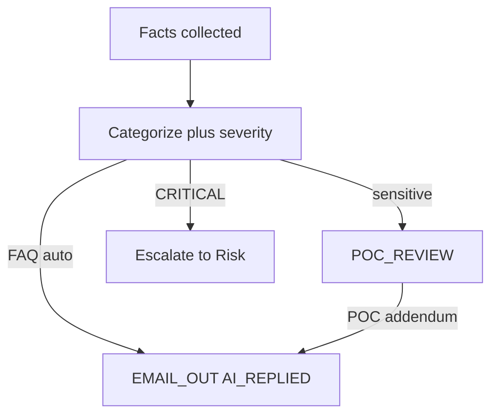

### 9.4 Lark Integration — `/admin/lark`

**What it is.** Channel registry for severity-routed notify, on-call pages, and dual-control pings. Webhooks are mocked in the prototype.

**What you see.** Channel list (name, chat id, purpose, enabled). Lark-related settings (`lark.*`).

**What to click.** Enable/disable a channel if you have manage rights. Send a mock notify on localhost. On Pages, treat as a directory.

**Good looks like.** Market intel, risk, and AI lab channels exist. Disabled channels are not used by escalation routes.

### 9.5 Escalation Routes — `/admin/escalation`

**What it is.** Paths are defined by **dimensions** (severity, involved teams, risk scenario, pending time, need human intervention) with editable **coefficients**. Demo Messenger **Escalate** follows this map. Every alert gets a path: exact domain+severity → domain wild → **ESC-DEFAULT**. Each skill binds **one** route code; unbound skills fall back to ESC-DEFAULT. There is **no separate Path name column** — the route code plus dimensions identify the path.

**What you see.** Route code (including `ESC-DEFAULT`), dimension fields, coefficient editors, teams, channel, SLA, default flag, enabled.

**What to click.** Create/edit/disable if you have manage rights (localhost). Edit dimension coefficients. Confirm the catch-all default exists. On Skills, confirm each playbook binds exactly one path.

**Good looks like.** CRITICAL has a tighter SLA than WARN. Exotic / unmatched events still resolve via ESC-DEFAULT. Skills never show a free-text “路徑” column — only the bound route code. CS/TR playbooks bind `ESC-CS-24-7` (clarify / FAQ), `ESC-CS-KYC` (ID verify), `ESC-TR-DEAL` (execution), `ESC-CS-RISK` (book-risk escalate). Confirm those four exist on this page, on [CS / TR Data](/admin/cs-data), and on the skill chip.

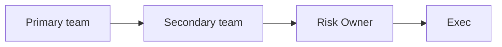

---

## 10. Organisation

### 10.1 BU and Teams — `/admin/departments` ( `/admin/teams` redirects here )

**Combined hub.** Risk Control, Operations, AI, System, **Customer Service (CS)** and **Trading (TR)** BUs with nested on-call teams. Expand CS for **CS 24/7 Desk** and **CS KYC Vault**; expand TR for **TR Dealing Support**. Each BU shows mandate / Owns / Accountable / Collaborates / Out of scope / Escalates to, plus team mission and rotation (editable when authorised). There is no separate Teams left-nav tab. The same roster is summarised on [CS / TR Data](/admin/cs-data).

### 10.2 Roles & Permissions — `/admin/roles` (editable)

**Editable** RBAC matrix at `/admin/roles` (API: `GET/POST /api/roles`). Each role (Risk Owner, Analyst, Ops, AI Engineer, System Admin, Super Admin, Viewer, …) shows name, description, BU, permission chips (`monitor.read`, `ai.approve`, `settings.manage`, …), plus Owns / Day-to-day / Does not / Escalates to. Super Admin has `*`. Operators with `users.manage` can update roles; AI actors are blocked. Use this page to see why a button is missing for a persona.

### 10.3 Users — `/admin/users`

Directory of operators and demo personas, including **demo platform owner**. Columns: name, email, role, department, team, status, last login.

If you have `users.manage` (localhost): **Add user** (name, email, password, role, department, team) and toggle ACTIVE / DISABLED. On Pages, creating users is a demo no-op or browser-only.

**Good looks like.** demo platform owner is present as platform owner. Disabled users cannot be a live maker/checker in the localhost API.

---

## 11. Platform

### 11.1 Data Sources — `/admin/data-sources`

Registry of internal platforms and external verification feeds (category, name, type, status). Manage on localhost if you have `sources.manage`. This is the catalogue AI and Monitor 2.0 detectors are allowed to name in evidence. CS connectors are listed here as **C1 Live Chat Gateway**, **Website CS submission form**, **Official support mailbox**, named **support@** / **complaints@**, **CS KYC Vault** (status flags only) and **MT4/MT5 dealing tape** (TR-owned).

### 11.2 AI Access Security — `/admin/security/ai-access`

The **human-only** inventory. AI service accounts must never receive these pages, functions, fields or data (identity writes, secrets, dual-control approve, LP/wallet execute, role writes, session cookies).

**What you see.** Stats, the blocklist (target, reason, severity), allowed AI capabilities, and forbidden permission codes.

**Good looks like.** Approve paths, user/role writes, and trading execute are on the blocklist. The allowed list is narrow (read evidence, draft RCA, retrieve RAG).

### 11.3 Audit Log — `/admin/audit`

Two tabs:

| Tab | What it records |
|---|---|
| **CRMP logs** | All changes done inside this CRMP admin — alerts, AI, skills, escalation, interventions, messenger, **CS/TR intake** (`CS_INTAKE`, `CS_FOLLOWUP_EMAIL`, `CS_CLIENT_REPLY`, `CS_INTAKE_CONTINUE`, `CS_ASSIGN_TR`, `CS_ESCALATE_RISK`, `CS_RESOLVE`) |
| **Vantage Markets Admin logs** | Changes on other admin pages — restrict user rights, pull transaction data, triggered Lark messages, received risk incident response by BU POC, settings / org / RAG |

Each row: time, actor, action, entity, details. Both tabs have a **Roll back** button — restores the before-state snapshot when available (`POST /api/audit/rollback`). Newest rows per plane.

### 11.4 Platform Settings — `/admin/settings`

Grouped flags (not one giant alphabetical dump):

| Group | Keys like |
|---|---|
| Platform identity | `platform.*`, `products.*` |
| Monitor 2.0 | `monitor2.*` |
| AI analysis | `ai.*` (RCA, confidence, second-opinion severity, maker/checker) |
| Market intelligence | `market_intel.*` (enabled, interval, Lark chat) |
| Messenger / Lark | `lark.*` |
| Escalation & SLA | `escalation.*`, `detectors.*` |
| CS / TR operations | `cs.*` (follow-up cap, auto-reply max severity, sensitive categories, wait / KYC / TR / Risk SLA, intake token, mailboxes, Lark chat ids) |

Edit a value and **Save**. Localhost writes SQLite. GitHub Pages stores the change in this browser only and says so.

---

## 12. Docs (in the left menu)

All of these toggle **EN / 繁中** like the rest of the desk.

| Page | Path | What it is |
|---|---|---|
| User Guide | `/admin/docs/user-guide` | This handbook |
| PRD | `/admin/docs/prd` | What we are building and why, with acceptance tests |
| TSD | `/admin/docs/tsd` | How it is built (architecture, APIs, data model) |
| UAT Checklist | `/admin/docs/uat` | Interactive 52-case sign-off (UAT-01 … UAT-53, skip UAT-45): why, steps, pass, evidence, screen coverage. **CS/TR catalogue v2.7:** UAT-25 catalog, UAT-46 channels + `/cs`, UAT-47 wait loop, UAT-48 TR/Risk, UAT-50 skills + tree, UAT-51 dashboard + log, UAT-52 BU / hops / `cs.*`, UAT-53 categorize / severity / auto vs POC, plus support UAT-17/22/27–29/36–40 |
| Ecosystem Eval | `/admin/docs/ecosystem` | People, budget bands, phases, risks to adopt CRMP for real |
| Improvement Roadmap | `/admin/docs/roadmap` | RM-01…15 cards: today / build / done-when / skip risk |
| Open Issues | `/admin/docs/open-issues` | Programme checklist: **20 issues** (OI-01…20). **CS/TR catalogue v1.5:** primary OI-19/OI-20 plus support OI-05/08/09/11/14/15 — prototype ticks vs production connectors/vault/tape |
| Progress Tracker | `/admin/docs/progress` | Interactive board: X=issues, Y=timeline now→end-2027. **CS/TR catalogue v1.6** on the same **20 columns** (desk, `/cs`, wait loop, skills, dashboard, log, data, hops, `cs.*`, categorize / severity / POC on OI-19/20 — not extra bars) |
| URL Catalog | `/admin/docs/urls` | Every admin page, API, and table, plus the public Pages URLs. **CS / TR** section: `/cs` portal, desk, dashboard, log, data, five SKILL.md playbooks, RAG leaves, POST `/api/cs/intake`, `GET /api/cs?view=data`, `cs_*` tables |

On UAT: walk cases in order. Do not skip Critical predecessors. Tick Pass/Fail on the board; coverage chips show which screens each case hits.

---

## 13. Safety habits (do these every time)

1. Open AI Access Security once per release and confirm the blocklist still matches “humans only”.  
2. Never give a production AI service account those rights.  
3. Treat messenger **Dismiss** and **Close** as real decisions — they are audited.  
4. For BREACH/CRITICAL, keep primary + second AI on screen before any irreversible control.  
5. After a control, check **Audit Log** and the **home spine** for the same ids.  
6. Maker and checker must be **two different people** on AI Admin and on designated controls.  
7. On CS/TR: never Resolve while a follow-up is WAITING; never skip ID-verify on a verbal “it’s me”; cap auto-mail at `cs.followup_cap` (default 3) then CS Lead in person. After facts are collected, never auto-send KYC / complaint / trading / CRITICAL — hold for the named POC who **adds detail before reply**.  
8. CS does not arm trading controls. TR does not staff C1. Book-risk leaves this desk via **Escalate to Risk**.

---

## 14. Quick map of every left-nav page

| Group | Page | You come here to… |
|---|---|---|
| Overview | Admin Home | See counts; dummy spine buttons; home spine stage ticket counts; click every card and alert row |
| Monitor & risk | Daily Performance | Day-end CFD + crypto metrics |
| Monitor & risk | Monitor 2.0 | Unified indicator + detector registry; Run all / Sync / Pause; recent runs; M2-* deep links (alerts → Realtime Alert) |
| Monitor & risk | Realtime Alert & Tracker | Ack the open queue; grouped AI pipeline; MonitorCode tooltips; AI Analyses list redirects here |
| Monitor & risk | Market Intelligence | Scan news/social; read findings and outbox |
| Monitor & risk | Risk Log Analytics | 90-day charts, closed packs, loss vs prevented, loopholes |
| Monitor & risk | Risk Domains | P0–P3 scenarios hooked to Monitor 2.0 |
| AI & knowledge | AI Skills | Browse playbooks; Enter the full SKILL.md; one escalation bind |
| AI & knowledge | Knowledge Tree | Domains, skills, RAG document leaves + deep links |
| AI & knowledge | RAG Knowledge Base | Search / retrieve; AI write blocked — `propose_rag` |
| AI & knowledge | AI Admin | First/second-line cards; propose/approve models, params, skills, RAG |
| Response | Demo Messenger | Evidence, chat, escalate, dismiss, close, controls |
| Response | CS / TR Desk | C1 / form / mailbox via `/cs` + `/api/cs/intake`; CSR-XXXX replies close WAITING; dedicated SKILL.md chip; AI follow-up until reply; then categorize / severity / auto vs POC |
| Response | CS / TR Dashboard | CS/TR KPIs — not Daily Performance |
| Response | CS / TR Log | CS_* timeline + resolved packs — not Risk Log |
| Response | CS / TR Data | BU / team / hops / `cs.*` contract the desk already reads |
| Response | Human Intervention | Checker approve/reject; actioner email on samples |
| Response | Escalation Routes | Dimensions × coefficients; ESC-DEFAULT; skill binds one path; no Path name column |
| Response | Lark Integration | Channel registry |
| Organisation | BU and Teams | Combined BU RACI + nested on-call teams (`/admin/departments`) |
| Organisation | Users | Directory, including demo platform owner / haixiang.yan@hytechc.com |
| Organisation | Roles & Permissions | Editable RBAC (`/api/roles`) |
| Platform | Data Sources | Internal + external registry |
| Platform | Platform Settings | Grouped flags |
| Platform | Audit Log | CRMP vs Vantage Markets Admin tabs + Roll back |
| Platform | AI Access Security | Human-only pages/functions/fields |
| Docs | User Guide / URLs / UAT / PRD / TSD / Roadmap / Ecosystem / Open Issues / Progress | Product and operator documents |

---

## 15. Document control

| Ver | Date | Notes |
|---|---|---|
| 1.0 | 2026-10-01 | Operator handbook |
| 1.3 | 2026-10-04 | All admin screens, public Scan demo, demo platform owner, login on Pages |
| 1.5 | 2026-10-04 | Flowcharts for login, unread, RCA path, messenger, maker/checker, intel scan, knowledge tree, spine |
| 1.6 | 2026-10-05 | Spine on home; BU and Teams; AI line1/2; propose_rag; ESC-DEFAULT; Open Issues / Progress |
| 1.7 | 2026-10-05 | Audit CRMP / Vantage Markets Admin tabs + Roll back; editable Roles; escalation dimensions × coefficients |
| 1.8 | 2026-10-05 | Nav truth: Realtime Alert & Tracker; Detectors merged into Monitor 2.0 (redirect); AI Analyses list not left-nav; Monitor hub = indicator+detector table (no Alerts/Tickets tabs); mobile polish note |
| 1.9 | 2026-10-06 | Home dummy spine: Dummy alert / Dummy alert group; bilingual EN / zh-Hant chrome and stored copy |
| 1.10 | 2026-10-06 | Demo Messenger bird-eye POC windows along the escalation path |
| 1.11 | 2026-10-06 | CS / TR Desk: C1, form, official email; AI follow-up until reply; TR routing |
| 2.0 | 2026-10-06 | CRMP Plus coherent platform; public URL `/PRD/crmp-plus/`; original CRMP Admin frozen at `/PRD/crmp-admin/` |
| 2.1 | 2026-10-06 | CS/TR dedicated SKILL.md chips; Knowledge Tree CS_SERVICE / TRADING_EXEC; RAG cs-* leaves |
| 2.2 | 2026-10-06 | Handbook: public `/cs` portal, three connectors, inbound CSR-XXXX matching, auto-email wait loop, CS/TR daily roles, skills + routes |
| 2.3 | 2026-10-06 | §9.3.7 dashboard + §9.3.8 log (not Daily Performance / Risk Log) |
| 2.4 | 2026-10-06 | §9.3.9 CS/TR Data: BU / CS KYC Vault / four hops / `cs.*`; UAT-52 |
| 2.5 | 2026-10-06 | §9.3.10 after collected facts: categorize, severity, AI solution, auto-reply vs named POC addendum; UAT-53 |

**Owner:** demo platform owner (`haixiang.yan@hytechc.com`)
