# CRMP User Guide

**Document ID:** CRMP-UG-001 · **Audience:** anyone who opens the admin desk  
**Languages:** English (this page) · [繁體中文](/admin/docs/user-guide?lang=zh-Hant)  
**Docs & platform owner:** YAN Haixiang (`yan.haixiang@vantagemarkets.com`)

This handbook is written in everyday language. It covers **every page in the left menu**, plus login, language, unread numbers, and the public GitHub Pages snapshot.

---

## 1. What this desk is

Vantage **CRMP Admin** is the control room for CFD and crypto risk. Monitor 2.0 raises an alarm. This desk then:

1. Finds a matching skill playbook, or searches the RAG knowledge base if no skill is certain.  
2. On high severity (BREACH or CRITICAL), runs a **second, independent AI** that may agree, partly agree, or disagree.  
3. Puts the pack into a **Lark-style messenger** so you can show evidence, chat, escalate, dismiss, close, or send a control.  
4. Asks a human checker before irreversible controls go live.  
5. Writes the whole story into the **Spine Log** and **Audit Log**.

You do not need to be an engineer to use it. Click the left menu, read the cards, and follow the buttons on the page.

**Permanent public demo:** [https://hxyan2020.github.io/PRD/crmp-admin/admin/](https://hxyan2020.github.io/PRD/crmp-admin/admin/)  
**Messenger demo:** [https://hxyan2020.github.io/PRD/crmp-admin/admin/messenger/](https://hxyan2020.github.io/PRD/crmp-admin/admin/messenger/)  
**Full URL list:** [URL Catalog](/admin/docs/urls)

On GitHub Pages there is **no live `/api`**. You can still walk every screen. Buttons that would save to the server keep a copy in this browser instead. Live writes (real scans, dual-control applies, user create) belong on `localhost:3000`.

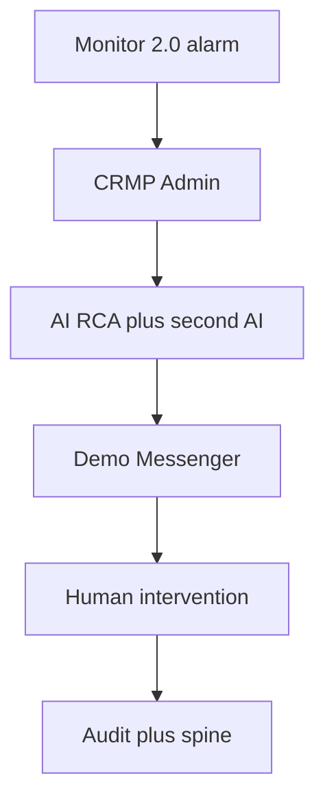

---

## 2. Sign in, stay signed in, switch language

### 2.1 Open the login page

1. Click **Sign in** in the left pane (safest on GitHub Pages).  
2. Or open [`/login`](/login). On the public snapshot that is `/PRD/crmp-admin/login/` — do not type `/login` on `github.io` without the `/PRD/crmp-admin` prefix, or you will get a 404.

The admin is public in this prototype. Sign in only when you want a **named role** (so maker/checker and permissions behave like production).

### 2.2 Accounts you can use

Click a **Quick fill demo role** button, or type the email and password, then **Sign in**.

| Who | Email | Password | Use this when |
|---|---|---|---|
| Platform Owner | `yan.haixiang@vantagemarkets.com` | `yan123` | You are YAN Haixiang, the named owner of this desk and these docs |
| Risk Owner | `risk.owner@vantagemarkets.com` | `risk123` | Approving AI packs and checker steps |
| Risk Analyst | `risk.analyst@vantagemarkets.com` | `risk123` | Triage and messenger challenge |
| Ops Lead | `ops.lead@vantagemarkets.com` | `ops123` | Proposing halt / block / widen / pause-copy |
| AI Engineer | `ai.engineer@vantagemarkets.com` | `ai123` | Skills, RAG, detectors, AI Admin proposals |
| System Admin | `system.admin@vantagemarkets.com` | `sys123` | Users, settings, audit, AI access blocklist |
| Super Admin | `admin@vantagemarkets.com` | `admin123` | Full demo rights (still cannot self-approve AI Admin when dual control is on) |

After Sign in you land on **Admin Home**. The name stays in this browser (`crmp_demo_session_v1`). Refreshing the public Pages site does not drop you back to a blank guest. Click **Sign out** in the left pane to clear it.

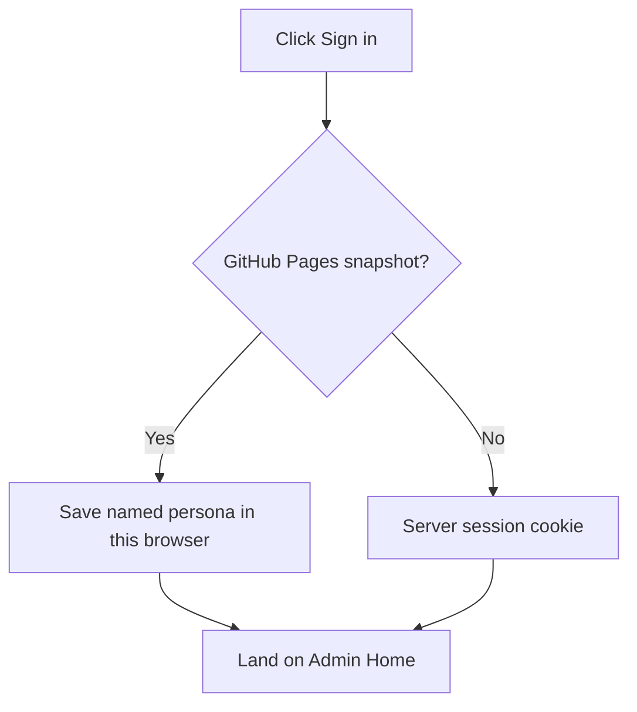

### 2.3 Language

Use **EN / 繁中** (sidebar on desktop; header on a phone). The choice is stored in the `crmp_ui_lang` cookie. Every left-nav label, page title, and product doc can switch. Open a doc with `?lang=zh-Hant` if you want to share a Chinese link.

### 2.4 Phones

Tap the **hamburger** (Menu) to open the left nav. Messenger is list-first: tap a thread, then **Threads** to go back. Language sits in the header.

---

## 3. The left menu (groups and unread numbers)

The left pane is grouped so you are not staring at one long list:

| Group | What lives there |
|---|---|
| **Overview** | Admin Home |
| **Monitor & risk** | Daily Performance, Risk Log, Market Intelligence, Monitor 2.0, Detectors, Live Alerts, Risk Domains |
| **AI & knowledge** | AI Analyses, AI Admin, AI Skills, Knowledge Tree, RAG, Spine Log |
| **Response** | Human Intervention, Demo Messenger, Lark, Escalation Routes |
| **Organisation** | Departments, Teams, Roles, Users |
| **Platform** | Data Sources, AI Access Security, Audit Log, Platform Settings |
| **Docs** | User Guide, PRD, TSD, UAT, Ecosystem, Roadmap, URL Catalog |

The Vantage logo sits at the top. Your role badge (and **Public prototype** on GitHub Pages) sit under your name. Owner line: YAN Haixiang.

### Unread numbers

Some rows show a **teal badge** (Live Alerts, AI Analyses, Demo Messenger, Market Intelligence, Human Intervention, Spine, Audit, Monitor 2.0, Risk Log, Detectors).

- The number is **new things since you last opened that tab** in this browser.  
- Formula: `unread = max(0, (known total + extra bumps) − last seen)`.  
- Opening the page **clears** that badge for you (stored in `crmp_nav_seen_v1`).  
- When a scan, detector run, or AI simulate creates new work, the badge **goes up** (`crmp_nav_extra_v1`).  
- On GitHub Pages the first paint uses fallback totals so you still see numbers even if the snapshot database looks empty.

The badge is a nudge, not a lock. You can always open the page.

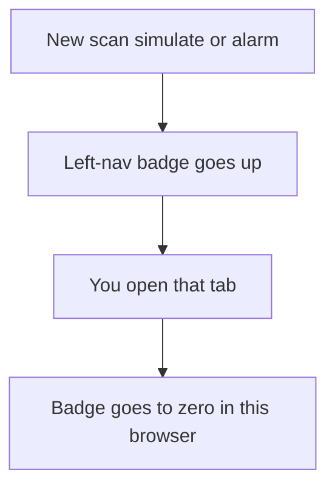

---

## 4. What each role does every day

### Risk Owner

1. Open [Live Alerts](/admin/alerts) and [AI Analyses](/admin/ai-analyses). Look for BREACH / CRITICAL.  
2. Open the dual-AI pack. If the second AI is `PARTIAL` or `DISAGREE`, do **not** approve an irreversible control yet.  
3. In [Demo Messenger](/admin/messenger): escalate, **Close (accept AI)**, or **Dismiss** a false alarm.  
4. On [Human Intervention](/admin/interventions), approve checker steps after Ops has maker-confirmed a control.  
5. Run the [UAT Checklist](/admin/docs/uat) when you sign off a release.

### Risk Analyst

1. Work the OPEN queue on Live Alerts.  
2. Open the AI analysis. Read summary, evidence, and second-AI verdict.  
3. In messenger, **Show evidence**, then type in **Chatbot** if you disagree or have extra context.  
4. Escalate to Risk Owner when the pack is ready.

### Ops Lead / Analyst

1. From messenger **Recommended actions**, pick block / halt / cut leverage / pre-widen / pause-copy.  
2. Click **Double-confirm…** then **Yes, send to Vantage admin**. You get an admin reference and a link.  
3. If the thread says checker is needed, wait for Risk Owner on Human Intervention.

### AI Engineer

1. Keep [AI Skills](/admin/skills), [RAG](/admin/rag), and [Detectors](/admin/detectors) healthy.  
2. Propose setting/model/skill/RAG changes on [AI Admin](/admin/ai-admin). You cannot approve your own change.  
3. Tune `ai.second_opinion_severity` (default BREACH) under AI Admin parameters or Platform Settings.

### System Admin

1. Users, roles, teams, departments, grouped settings.  
2. Review [AI Access Security](/admin/security/ai-access) — pages, functions and fields AI must never touch.  
3. Watch [Audit Log](/admin/audit) and [Spine Log](/admin/spine).

---

## 5. The main story: alarm → AI → chat → close

This is the path you will use most. Later sections explain every other page.

1. A detector or Monitor 2.0 indicator breaches.  
2. An **OPEN** alert appears on Live Alerts (and a ticket on Monitor 2.0).  
3. AI Analyses gets a pack: `SKILL_MATCH` if a playbook fits, otherwise `RAG_REASONING`.  
4. If severity is BREACH or CRITICAL, a **Second AI** panel appears (`AGREE` / `PARTIAL` / `DISAGREE`).  
5. Click **Sync alerts** on Demo Messenger so the pack is a chat thread.  
6. **Show evidence** posts the vault into the thread. Chat if you challenge the story.  
7. **Escalate**, **Dismiss** (false alarm), or **Close (accept AI)**.  
8. For a control: pick a recommended action → double-confirm → checker if required.  
9. Confirm the same events in Spine Log and Audit Log.

**Demo shortcuts on AI Analyses** (localhost): Simulate COPY breach (skill path), Simulate EQ drawdown (RAG, often WARN so second AI is skipped), Simulate CRITICAL (forces second AI), Backfill 2nd AI challenges.

**Decision rule:** `AGREE` may follow the playbook under policy. `PARTIAL` / `DISAGREE` means **needs human** — no irreversible control until a person has read both AIs.

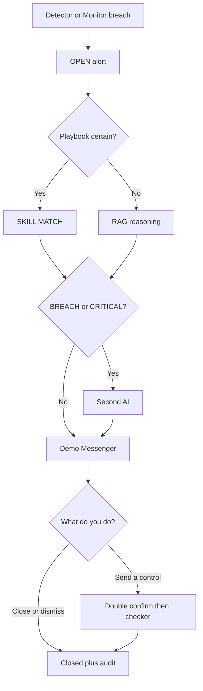

---

## 6. Overview

### 6.1 Admin Home — `/admin`

**What it is.** The landing page after login. A snapshot of how busy the desk is.

**What you see.**

- Owner card for **YAN Haixiang**, with **Sign in as platform owner**.  
- A Lark-style messenger promo with the permanent GitHub Pages URL and **Open messenger demo**.  
- Clickable count cards: Users, Teams, Data Sources, Risk Domains, Open Alerts, Open Tickets, Lark Channels, Escalation Routes. Each card jumps to that page.  
- Department division (RACI-style ownership).  
- Recent alerts, with **View all** into Live Alerts.  
- Shortcut buttons: Messenger, URL Catalog, PRD, User Guide, UAT, AI Admin, AI Access, Daily Performance.

**What to click.** Use the cards as a map. If Open Alerts is not zero, go there first.

**Good looks like.** Counts match the other pages. Cards are links, not dead tiles.

---

## 7. Monitor & risk

### 7.1 Daily Performance — `/admin/dashboard`

**What it is.** End-of-day CFD and crypto risk picture — the last stage of the spine.

**What you see.** Report date, WARN/BREACH counts for CFD and crypto, then metric cards (value, target, notes, health).

**What to click.** **Refresh** (localhost) rebuilds live metrics from `/api/dashboard`. On Pages the numbers are the seeded snapshot.

**Good looks like.** Both product columns present. Status badges are readable (HEALTHY / WARN / BREACH).

### 7.2 Risk Log Analytics — `/admin/risk-log`

**What it is.** The history book: what fired, how long humans took, money lost vs money prevented, and where loopholes cluster.

**What you see.**

- Summary tiles: open alerts, loss vs prevented vs exposure, average ack/resolve/handling minutes, SLA breaches, pending vs decided interventions.  
- Tables by category and by domain.  
- Loophole tags (repeat weak spots).  
- Chronological records (alert, ticket, outcome, USD).

**What to click.** Filter / scan the tables. Follow a row back to Live Alerts or AI Analyses when you need the pack.

**Good looks like.** Totals add up. Handling times are filled for closed work. Loophole tags are not empty on the seeded demo.

### 7.3 Market Intelligence — `/admin/market-intel`

**What it is.** A five-minute look at news, social, official and exchange posts that can move LP prices. Findings feed indicator `M2-MKT-INTEL` and a messenger outbox (Lark group `oc_market_intelligence` in production).

**What you see.** Tabs: **Findings**, **Messenger outbox**, **Sources**, **Scan log**. Cards use the i–vi format (what happened, product, why it can move LP, severity, source, suggested next step). Scheduler on/off. Skill playbook link.

**What to click.**

1. Turn the feature on in Platform Settings (`market_intel.enabled`) if the desk looks idle.  
2. Click **Scan now**.  
3. Read new Findings, then the outbox, then the scan log.

**GitHub Pages:** there is no `/api`, so **Scan now** runs a **local demo scan** from the same event templates as the live scanner. New cards appear at once and are stored in this browser (`crmp_mi_demo_v1`). Real HTTP scrapes still belong on `localhost:3000`. You will **not** get a 405 error.

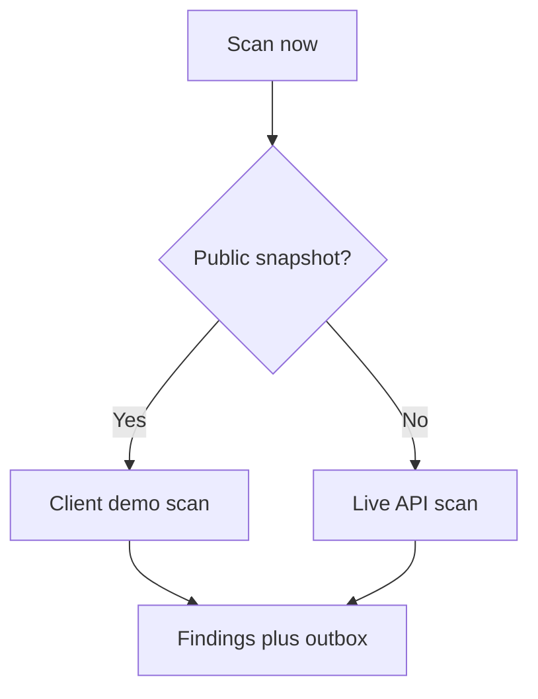

**Good looks like.** Scan finishes with a count. Findings, outbox and scan log all update. The Live Alerts / Market Intelligence unread badge may tick up.

### 7.4 Monitor 2.0 — `/admin/monitor-2`

**What it is.** The integration hub for the existing indicator platform. CRMP does not replace Monitor 2.0; it syncs from it.

**What you see.** Three tabs:

- **Indicators** — monitor id, name, domain, product, warn/breach thresholds, last value, open ticket count.  
- **Alerts** — the same events as Live Alerts, with Monitor ticket ids.  
- **Tickets** — case tracking, assignee, department, Lark message id.

A panel shows `monitor2.base_url` and **Sync now (prototype)**.

**What to click.** Sync on localhost to refresh mirrored tables. Acknowledge an OPEN alert. Update a ticket status. On Pages, treat this as a read-only catalogue.

**Good looks like.** Indicators EQ / MRG / COPY (and others) are present. Sync reports how many rows refreshed.

### 7.5 Detectors — `/admin/detectors`

**What it is.** Threshold watches that sit in front of Monitor. They are the first stage of the spine.

**What you see.** Each detector: code, product, domain, monitor id, warn/breach, comparator, enabled, last run, last status/value. A recent **runs** list (observed value, severity, linked alert and analysis).

**What to click.**

- **Run all** (localhost) samples every enabled detector. Warn/breach auto-raise alarms and kick AI RCA. Unread badges on Detectors, Live Alerts and AI Analyses go up.  
- **Enable / disable** a single detector.

**Good looks like.** A COPY-style detector can produce a BREACH. Disabled detectors do not fire. Runs appear in Spine as DETECT → ALARM.

### 7.6 Live Alerts — `/admin/alerts`

**What it is.** The operational queue: what is on fire right now.

**What you see.** Cards sorted CRITICAL → BREACH → WARN, newest first. Each card: severity, status, product, domain, title, message, alert id, monitor id, observed value, ticket id, time.

**What to click.** **Acknowledge** on an OPEN alert if you have operate rights. Then open AI Analyses or Messenger for the pack. The unread badge clears when you visit this page.

**Good looks like.** OPEN items are at the top of your day. Ack moves status to ACKNOWLEDGED. Nothing here is a silent drop.

### 7.7 Risk Domains — `/admin/risk-domains`

**What it is.** The catalogue of CFD and crypto risk areas (credit, LP hedge, market pricing, crypto exchange, fraud, product config, model/AI, ops, capital, tech).

**What you see.** Cards with priority, code, product coverage, owner department, supporting departments, description.

**What to click.** Read-only in the prototype. Use it to see who owns a domain before you escalate.

**Good looks like.** Every domain has an owner. Product coverage is CFD, Crypto, or both.

---

## 8. AI & knowledge

### 8.1 AI Analyses — `/admin/ai-analyses`

**What it is.** The RCA workbench. Auto-runs when an alarm fires.

**What you see.** A list of analyses: mode (`SKILL_MATCH` or `RAG_REASONING`), confidence, summary, status, needs-human flag, skill code, indicator, **2nd AI · verdict** badge. Open one id for the full pack: explanations, evidence vault, skill run steps, and the **Second AI challenger** panel (critiques, improvements, alternative hypotheses).

**What to click (demo, localhost).**

- Simulate COPY breach — skill path.  
- Simulate EQ drawdown — RAG; WARN usually skips second AI.  
- Simulate CRITICAL — forces second AI.  
- Backfill 2nd AI challenges — attaches challenger rows to older high-severity packs.

Click through to the skill playbook or the messenger thread.

**Good looks like.** Every BREACH/CRITICAL row has a second-AI badge. WARN under the default threshold does not. `PARTIAL` / `DISAGREE` sets needs-human.

### 8.2 AI Admin — `/admin/ai-admin`

**What it is.** Governance for AI, **not** the live RCA list. Maker proposes; a **different** person checks.

**Tabs.**

| Tab | What you do |
|---|---|
| Overview | KPIs: analyses, skill-match %, confidence, needs-human, pending interventions, human-agree %, feedback-correct %, pending change requests |
| Parameters | Draft `ai.*` settings (RCA on/off, auto-on-alarm, min confidence, RAG top-K, second-opinion severity, maker/checker). **Propose** does not apply yet |
| Maker / Checker | Pending change requests first. Approve or reject with a note. You cannot approve your own |
| Skills | Propose create/update/disable of a playbook. Applied only after approve |
| RAG | Propose create/update/retire of a corpus doc |
| Training | Queue a recalibration run (becomes a TRAINING change request) |
| History | Accuracy snapshots (about 14 days) |

Header badges show whether you are Maker, Checker, or both. Risk Owner can be both, but **self-approve is still blocked**.

**Good looks like.** A proposed skill stays PENDING until another user approves. After approve it appears on AI Skills. Parameter values on the live desk do not move until APPROVED.

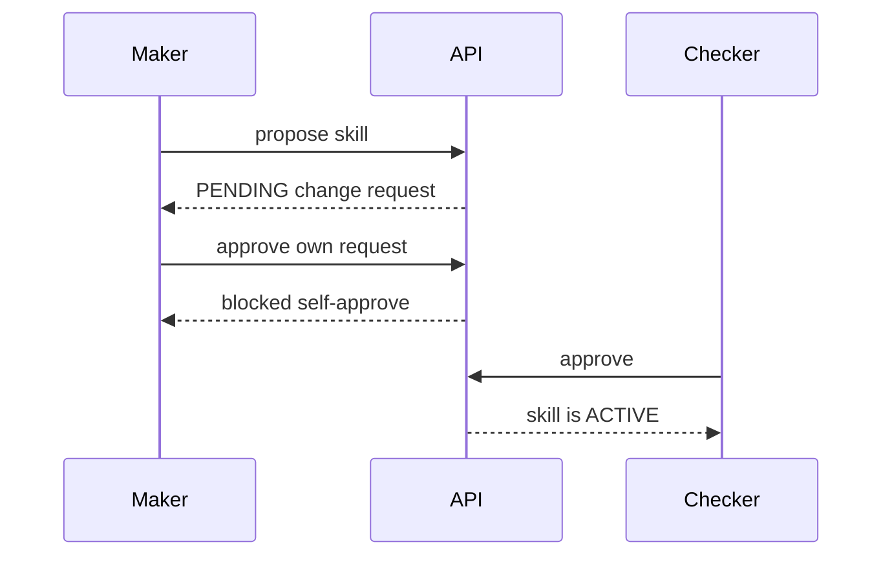

### 8.3 AI Skills — `/admin/skills`

**What it is.** Playbooks in SKILL.md style: when to use, when not to, prechecks, steps, evidence, stop conditions, success criteria, thresholds and why, fault areas, escalation, BU corrections, past cases.

**What you see.** Search box. Two tabs: **Single-indicator skills** and **Linked timelines** (multi-indicator chains). Cards stay compact (code, name, product, domain, auto vs manual).

**What to click.** **Enter** opens `/admin/skills/{code}` — the full playbook page (not a tiny card). From there: back to skills, knowledge tree, AI analyses, risk log.

**Good looks like.** Enter never 404s for a seeded skill. Linked timelines show sequence, causes, linked skills.

### 8.4 Knowledge Tree — `/admin/knowledge-tree`

**What it is.** A picture of how knowledge hangs together: CRMP → risk domains → skill playbooks, with linked timelines and RAG on the side trunks.

**What you see.**

- **Tree map** (default) or **Outline**.  
- Product filter: All / CFD / Crypto.  
- Trunk switch: Risk domains, Linked timelines, RAG corpus.  
- Click a **domain** to fan out its skills. Click a **skill** to fill the inspector.  
- **Enter** / **Enter full playbook** opens the SKILL.md page.  
- RAG nodes open the RAG library. Docs are matched by tags and title.

Domains wrap on two rows so labels stay readable. There is no sideways-only strip of ten tiny boxes.

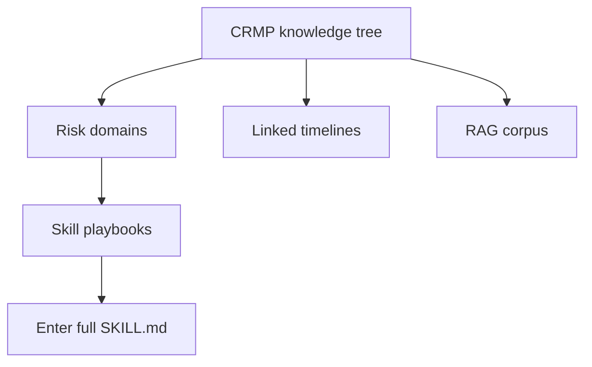

**Good looks like.** LP_HEDGE expands to hedge skills. RAG trunk groups documents by category. Enter navigates; it is not a dead SVG link.

### 8.5 RAG Knowledge Base — `/admin/rag`

**What it is.** The internal corpus used when a skill is not certain: policies, products, entities, platforms.

**What you see.** Filter by category, search box, document cards (key, title, tags, status, excerpt). A **retrieve** box to try a query (top-K hits with scores). If you can manage: create a doc, edit content, retire.

**What to click.** Retrieve with a phrase like “copy trading concentration gold margin” and confirm hits look relevant. Governed production-like creates should go through AI Admin; this page is the corpus browser.

**Good looks like.** Retrieve returns ranked hits. Retired docs drop out of search.

### 8.6 Spine Log — `/admin/spine`

**What it is.** The end-to-end tape: DETECT → ALARM → AI_RCA → SKILL_EXECUTE → HUMAN_INTERVENTION → RESOLVED → DASHBOARD.

**What you see.** 24-hour counts per stage, then a timeline of events (id, stage, product, severity, title, actor, time, detail).

**What to click.** Read-only. After you run a detector or close a messenger thread, confirm matching stages appear within about a minute (localhost).

**Good looks like.** A COPY breach demo produces DETECT, ALARM, AI_RCA (and SKILL_EXECUTE / HUMAN_INTERVENTION if those ran). No silent gaps on the happy path.

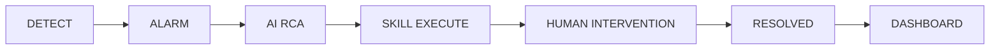

---

## 9. Response

### 9.1 Human Intervention — `/admin/interventions`

**What it is.** The checker desk for runtime actions (not AI Admin config). Maker already asked for a control; you approve or reject.

**What you see.** Cards: action code, status, analysis, indicator, alert title/severity, skill step, requested time. Pending items have a note box plus **Approve** and **Reject**.

**What to click.** Type a short reason. Approve to go live (prototype records the decision). Reject to stop. Both write spine + audit.

**Good looks like.** Pending count matches the home / AI Admin KPI. Decided rows show who and when.

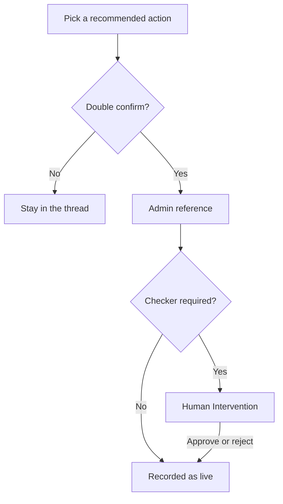

### 9.2 Demo Messenger — `/admin/messenger`

**What it is.** In-app Lark-style inbox. Production will use real Lark; this page proves the buttons and the audit trail.

**Layout.** Desktop: thread list + chat side by side. Phone: list → tap thread → **Threads** to go back.

**Toolbar.** **Sync alerts** pulls new Monitor alarms into threads.

**On an open thread you can:**

| Button | What it does |
|---|---|
| **Show evidence** | Posts the evidence vault and second-AI summary into the chat |
| **Chatbot** (type + Send) | Challenge the AI or add facts. Disagreement flags `needs_human` |
| **Escalate** | Moves Primary → Secondary → Risk Owner → Exec along the route |
| **Dismiss** | False alarm. Closes the thread and the alert |
| **Close (accept AI)** | Accepts the analysis and closes the ticket |
| **Recommended actions** | Block user, halt trading, cut max leverage, pre-widen spreads, pause copy joining |
| **Double-confirm…** then **Yes, send to Vantage admin** | Creates an admin reference + link (often Interventions) |
| **Checker approve (go live)** | When the system says a checker is required |
| **Open in admin** | Jumps to the matching admin page (must stay under `/PRD/crmp-admin/` on Pages) |

**Good looks like.** Sync creates threads. Evidence posts a vault, not an empty bubble. Escalate advances the path. Dismiss/Close change statuses. Double-confirm yields an admin_ref. Open in admin does not 404 on GitHub Pages.

Permanent URL: [https://hxyan2020.github.io/PRD/crmp-admin/admin/messenger/](https://hxyan2020.github.io/PRD/crmp-admin/admin/messenger/)

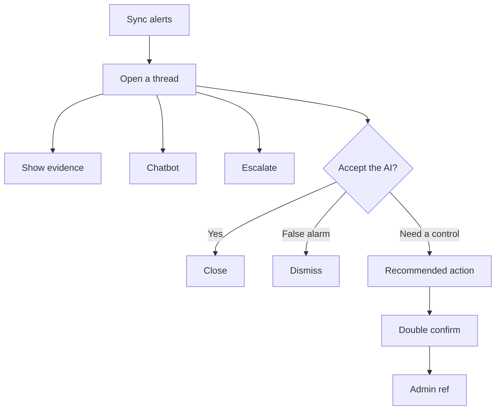

### 9.3 Lark Integration — `/admin/lark`

**What it is.** Channel registry for severity-routed notify, on-call pages, and dual-control pings. Webhooks are mocked in the prototype.

**What you see.** Channel list (name, chat id, purpose, enabled). Lark-related settings (`lark.*`).

**What to click.** Enable/disable a channel if you have manage rights. Send a mock notify on localhost. On Pages, treat as a directory.

**Good looks like.** Market intel, risk, and AI lab channels exist. Disabled channels are not used by escalation routes.

### 9.4 Escalation Routes — `/admin/escalation`

**What it is.** The map: severity → primary team → secondary team → Lark channel → SLA minutes. Demo Messenger **Escalate** follows this map.

**What you see.** Route name, severity, domain, teams, channel, SLA, enabled flag.

**What to click.** Create/edit/disable if you have manage rights (localhost). Read the SLA before you escalate a CRITICAL.

**Good looks like.** CRITICAL has a tighter SLA than WARN. Every route has a primary team.

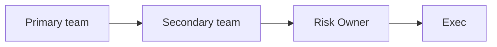

---

## 10. Organisation

### 10.1 Departments — `/admin/departments`

Cards for Risk Control, Operations, AI, System: description, team count, user count, primary responsibilities (RACI). Read-only catalogue.

### 10.2 Teams — `/admin/teams`

Table: team name, department, members, Lark chat id, on-call rotation, mission. This is who wakes up when a route fires.

### 10.3 Roles & Permissions — `/admin/roles`

Each role (Risk Owner, Analyst, Ops, AI Engineer, System Admin, Super Admin, Viewer, …) with its permission chips (`monitor.read`, `ai.approve`, `settings.manage`, …). Super Admin has `*`. Use this page to see why a button is missing for a persona.

### 10.4 Users — `/admin/users`

Directory of operators and demo personas, including **YAN Haixiang**. Columns: name, email, role, department, team, status, last login.

If you have `users.manage` (localhost): **Add user** (name, email, password, role, department, team) and toggle ACTIVE / DISABLED. On Pages, creating users is a demo no-op or browser-only.

**Good looks like.** YAN Haixiang is present as platform owner. Disabled users cannot be a live maker/checker in the localhost API.

---

## 11. Platform

### 11.1 Data Sources — `/admin/data-sources`

Registry of internal platforms and external verification feeds (category, name, type, status). Manage on localhost if you have `sources.manage`. This is the catalogue AI and detectors are allowed to name in evidence.

### 11.2 AI Access Security — `/admin/security/ai-access`

The **human-only** inventory. AI service accounts must never receive these pages, functions, fields or data (identity writes, secrets, dual-control approve, LP/wallet execute, role writes, session cookies).

**What you see.** Stats, the blocklist (target, reason, severity), allowed AI capabilities, and forbidden permission codes.

**Good looks like.** Approve paths, user/role writes, and trading execute are on the blocklist. The allowed list is narrow (read evidence, draft RCA, retrieve RAG).

### 11.3 Audit Log — `/admin/audit`

Who did what: time, actor, action, entity, details. Messenger dismiss/close, AI Admin propose/approve, interventions, logins, setting saves should appear here on localhost. Newest 200 rows.

### 11.4 Platform Settings — `/admin/settings`

Grouped flags (not one giant alphabetical dump):

| Group | Keys like |
|---|---|
| Platform identity | `platform.*`, `products.*` |
| Monitor 2.0 | `monitor2.*` |
| AI analysis | `ai.*` (RCA, confidence, second-opinion severity, maker/checker) |
| Market intelligence | `market_intel.*` (enabled, interval, Lark chat) |
| Messenger / Lark | `lark.*` |
| Escalation & SLA | `escalation.*`, `detectors.*` |

Edit a value and **Save**. Localhost writes SQLite. GitHub Pages stores the change in this browser only and says so.

---

## 12. Docs (in the left menu)

All of these toggle **EN / 繁中** like the rest of the desk.

| Page | Path | What it is |
|---|---|---|
| User Guide | `/admin/docs/user-guide` | This handbook |
| PRD | `/admin/docs/prd` | What we are building and why, with acceptance tests |
| TSD | `/admin/docs/tsd` | How it is built (architecture, APIs, data model) |
| UAT Checklist | `/admin/docs/uat` | Interactive 45-case sign-off (UAT-01 … UAT-45): why, steps, pass, evidence, screen coverage |
| Ecosystem Eval | `/admin/docs/ecosystem` | People, budget bands, phases, risks to adopt CRMP for real |
| Improvement Roadmap | `/admin/docs/roadmap` | Prioritised follow-ups |
| URL Catalog | `/admin/docs/urls` | Every admin page, API, and table, plus the public Pages URLs |

On UAT: walk cases in order. Do not skip Critical predecessors. Tick Pass/Fail on the board; coverage chips show which screens each case hits.

---

## 13. Safety habits (do these every time)

1. Open AI Access Security once per release and confirm the blocklist still matches “humans only”.  
2. Never give a production AI service account those rights.  
3. Treat messenger **Dismiss** and **Close** as real decisions — they are audited.  
4. For BREACH/CRITICAL, keep primary + second AI on screen before any irreversible control.  
5. After a control, check **Audit Log** and **Spine Log** for the same ids.  
6. Maker and checker must be **two different people** on AI Admin and on designated controls.

---

## 14. Quick map of every left-nav page

| Group | Page | You come here to… |
|---|---|---|
| Overview | Admin Home | See counts; click cards; jump to messenger or docs |
| Monitor & risk | Daily Performance | Day-end CFD + crypto metrics |
| Monitor & risk | Risk Log Analytics | Timeline, handling time, loss vs prevented, loopholes |
| Monitor & risk | Market Intelligence | Scan news/social; read findings and outbox |
| Monitor & risk | Monitor 2.0 | Indicators, alerts, tickets; sync from upstream |
| Monitor & risk | Detectors | Run or pause threshold monitors |
| Monitor & risk | Live Alerts | Ack the open queue |
| Monitor & risk | Risk Domains | See who owns each risk area |
| AI & knowledge | AI Analyses | Read RCA + second AI; run demo simulates |
| AI & knowledge | AI Admin | Propose/approve models, params, skills, RAG |
| AI & knowledge | AI Skills | Browse playbooks; Enter the full SKILL.md |
| AI & knowledge | Knowledge Tree | Visual map of domains, skills, RAG |
| AI & knowledge | RAG Knowledge Base | Search and retrieve evidence docs |
| AI & knowledge | Spine Log | Follow Detect → … → Dashboard |
| Response | Human Intervention | Checker approve/reject runtime gates |
| Response | Demo Messenger | Evidence, chat, escalate, dismiss, close, controls |
| Response | Lark Integration | Channel registry |
| Response | Escalation Routes | Severity → team → SLA |
| Organisation | Departments | RACI ownership |
| Organisation | Teams | On-call and Lark chat ids |
| Organisation | Roles & Permissions | RBAC chips |
| Organisation | Users | Directory, including YAN Haixiang |
| Platform | Data Sources | Internal + external registry |
| Platform | AI Access Security | Human-only pages/functions/fields |
| Platform | Audit Log | Who changed what |
| Platform | Platform Settings | Grouped flags |
| Docs | User Guide / PRD / TSD / UAT / Ecosystem / Roadmap / URL Catalog | Product and operator documents |

---

## 15. Document control

| Ver | Date | Notes |
|---|---|---|
| 1.0 | 2026-10-01 | Operator handbook |
| 1.3 | 2026-10-04 | All admin screens, public Scan demo, YAN Haixiang owner, login on Pages |
| 1.5 | 2026-10-04 | Flowcharts for login, unread, RCA path, messenger, maker/checker, intel scan, knowledge tree, spine |

**Owner:** YAN Haixiang
