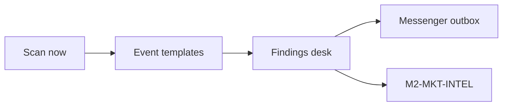
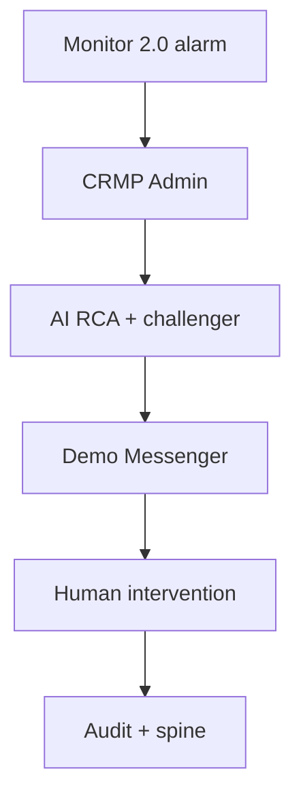

# CRMP User Guide

**Document ID:** CRMP-UG-001 · **Audience:** Risk Owner, Risk Analyst, Ops, AI Engineer, System Admin  
**Languages:** English (this page) · [繁體中文](/admin/docs/user-guide?lang=zh-Hant)  
**Docs & platform owner:** YAN Haixiang (`yan.haixiang@vantagemarkets.com`)

## 0. What this platform is

Vantage **CRMP Admin** is the control plane that turns Monitor 2.0 alarms into:

1. AI root-cause analysis (skill match or RAG)  
2. Independent **second-AI challenge** on high severity  
3. Messenger-native triage (evidence, escalate, dismiss, close, controls)  
4. Maker/checker interventions with audit + spine trail  

Demo entry: [Admin Home](/admin) · [URL Catalog](/admin/docs/urls)

---

## 1. Sign in & language

1. Open [`/login`](/login). On the public GitHub Pages snapshot this page lives at `/PRD/crmp-admin/login/` — use the **Sign in** link in the left pane (do not type `/login` on github.io by itself).  
2. Pick a persona button or enter credentials. The account created for you is **YAN Haixiang** (platform owner). The session stays in this browser after you click Sign in.

| Role | Email | Password |
|---|---|---|
| Platform Owner | `yan.haixiang@vantagemarkets.com` | `yan123` |
| Risk Owner | `risk.owner@vantagemarkets.com` | `risk123` |
| Risk Analyst | `risk.analyst@vantagemarkets.com` | `risk123` |
| Ops Lead | `ops.lead@vantagemarkets.com` | `ops123` |
| AI Engineer | `ai.engineer@vantagemarkets.com` | `ai123` |
| System Admin | `system.admin@vantagemarkets.com` | `sys123` |
| Super Admin | `admin@vantagemarkets.com` | `admin123` |

3. After login you land on **Admin Home**.  
4. Switch UI language with **EN / 繁中** (sidebar on desktop; header on mobile).  
5. On phones, use the **hamburger** menu to open navigation.

---

## 2. Daily path by role

### Risk Owner
1. Check [Live Alerts](/admin/alerts) and [AI Analyses](/admin/ai-analyses) for BREACH/CRITICAL.  
2. Open dual-AI pack; if second AI is `PARTIAL`/`DISAGREE`, do not approve irreversible controls yet.  
3. Use [Demo Messenger](/admin/messenger) to escalate, close (accept AI), or dismiss false alarms.  
4. Approve Checker steps on [Human Intervention](/admin/interventions) when Ops maker-confirmed a control.  
5. Run [UAT Checklist](/admin/docs/uat) when validating a release.

### Risk Analyst
1. Triage OPEN alerts → open AI evidence.  
2. Challenge or add context via messenger chatbot.  
3. Attach notes before escalating to Risk Owner.

### Ops Lead / Analyst
1. From messenger **Recommended actions**, propose block / halt / leverage / widen / pause-copy.  
2. **Double-confirm** → receive admin ref + link.  
3. If status is awaiting checker, ask Risk Owner / designated checker to approve.

### AI Engineer
1. Maintain [AI Skills](/admin/skills), [RAG](/admin/rag), [Detectors](/admin/detectors).  
2. Use [AI Admin](/admin/ai-admin) for settings/models (maker ≠ checker).  
3. Tune `ai.second_opinion_severity` (default BREACH) under platform settings / AI Admin.

### System Admin
1. Users, roles, teams, departments, settings.  
2. Review [AI Access Security](/admin/security/ai-access) blocklist.  
3. Monitor [Audit Log](/admin/audit) and [Spine Log](/admin/spine).

---

## 3. Triage an alarm (desk workflow)

1. Open **Live Alerts** or **Monitor 2.0**.  
2. Find an `OPEN` / `ACKNOWLEDGED` item.  
3. Go to **AI Analyses** (or wait for auto-analysis on alarm).  
4. Open the analysis → read:  
   - Mode (`SKILL_MATCH` vs `RAG_REASONING`)  
   - Confidence & summary  
   - Explanations  
   - Evidence vault  
5. If severity is **BREACH** or **CRITICAL** (or at/above `ai.second_opinion_severity`):  
   - Review **Second AI challenger** panel  
   - Read critiques, recommended improvements, alternative hypotheses  
6. Decision rule:  
   - Challenger `AGREE` → may proceed with playbook under policy  
   - `PARTIAL` / `DISAGREE` → **needs human**; no irreversible control until reviewed  

**Simulate for demo (AI Analyses page):**
- Simulate COPY breach (skill path)  
- Simulate EQ drawdown (RAG / WARN — challenger usually skipped)  
- Simulate CRITICAL (forces second AI)  
- Backfill 2nd AI challenges  

---

## 4. Demo Messenger

Path: [`/admin/messenger`](/admin/messenger)

### Layout
- **Desktop:** thread list + chat side-by-side  
- **Mobile:** list first → tap thread → detail; use **Threads** to go back  

### Inline actions
| Action | Effect |
|---|---|
| **Show evidence** | Posts evidence vault + second-AI summary into the thread |
| **Chatbot** | Type to challenge AI or add info; disagreement flags `needs_human` |
| **Escalate** | Advances Primary → Secondary → Risk Owner → Exec path |
| **Dismiss** | False alarm; closes thread + alert |
| **Close (accept AI)** | Accepts analysis; closes ticket |

### Recommended controls (below AI report)
1. Choose e.g. **Block user account**, **Halt trading**, **Cut max leverage**, **Pre-widen spreads**, **Pause copy joining**.  
2. Click **Double-confirm…** then **Yes, send to Vantage admin**.  
3. Thread shows admin ref + link (e.g. Interventions).  
4. If checker required, follow the system message for Checker approval.

### Sync
Use **Sync alerts** to pull new Monitor alarms into messenger threads.

---

## 5. AI Admin (maker / checker)

Path: [`/admin/ai-admin`](/admin/ai-admin)

1. **Maker** proposes a setting, model, or policy change.  
2. A **different user** with checker permission approves or rejects.  
3. Self-approve is blocked by design.  
4. Spec reference: TSD §8 (see [TSD](/admin/docs/tsd)).

---

## 6. Market Intelligence

Path: [`/admin/market-intel`](/admin/market-intel)

1. Enablement via settings (`market_intel.enabled`).  
2. Click **Scan now** (or wait for the 5-minute scheduler on localhost).  
3. Review **Findings**, **Messenger outbox**, sources, and scan history.  
4. Cards follow the i–vi format and can raise indicator `M2-MKT-INTEL`.

**Public GitHub Pages:** there is no `/api` on the snapshot. **Scan now** runs a local demo scan from the same event templates as the live scanner. New findings appear immediately in Findings / outbox / scan log. Live HTTP scrapes still belong on `localhost:3000`.

---

## 7. Skills, RAG, detectors, risk log

| Area | Path | What to do |
|---|---|---|
| AI Skills | `/admin/skills` | Browse playbooks & enriched risk scenarios / chains |
| RAG KB | `/admin/rag` | Internal + external evidence corpus used when skill is uncertain |
| Detectors | `/admin/detectors` | Threshold monitors that raise alarms |
| Risk Log | `/admin/risk-log` | Analytics timeline of risk events & BU corrections |
| Spine | `/admin/spine` | End-to-end stage log (Detect → AI RCA → Escalation → …) |
| Interventions | `/admin/interventions` | Human gates from skill/RAG/messenger actions |

---

## 8. Safety & compliance habits

1. Open [AI Access Security](/admin/security/ai-access) — AI must not operate human-only pages/functions/fields.  
2. Never grant production AI service accounts those rights.  
3. Treat messenger dismiss/close as auditable decisions.  
4. For BREACH/CRITICAL, keep primary + challenger packs side-by-side before irreversible controls.  
5. Verify outcomes in **Audit Log** and **Spine Log**.

---

## 9. Mobile tips

- Use hamburger nav; language toggle sits in the header.  
- Messenger is master–detail: list → thread → **Threads** back.  
- Primary buttons are full-width; scroll tables horizontally inside panels if needed.  
- Prefer landscape only when reviewing wide docs tables.

---

## 10. Quick links

| Page | URL |
|---|---|
| Admin Home | `/admin` |
| AI Analyses | `/admin/ai-analyses` |
| Demo Messenger | `/admin/messenger` |
| AI Admin | `/admin/ai-admin` |
| Market Intelligence | `/admin/market-intel` |
| UAT Checklist | `/admin/docs/uat` |
| Ecosystem Eval | `/admin/docs/ecosystem` |
| PRD / TSD | `/admin/docs/prd` · `/admin/docs/tsd` |
| All URLs | `/admin/docs/urls` |

---

## 11. Every admin screen (plain English)

Use this table as the map of what each left-nav group is for. Click the home-page cards to jump to the same places.

| Group | Page | What you do there |
|---|---|---|
| Overview | Admin Home | Counts, departments, recent alerts. Cards are clickable. |
| Monitor & risk | Daily Performance | Day-end CFD + crypto risk picture. |
| Monitor & risk | Risk Log Analytics | Timeline of events, handling time, loss vs prevented. |
| Monitor & risk | Market Intelligence | 5-minute news/social scan; Scan now; messenger cards. |
| Monitor & risk | Monitor 2.0 | Indicator registry, tickets, sync from the upstream monitor. |
| Monitor & risk | Detectors | Thresholds that raise alarms. |
| Monitor & risk | Live Alerts | Open queue: ack, escalate, open AI. |
| Monitor & risk | Risk Domains | Catalogue of CFD + crypto domains. |
| AI & knowledge | AI Analyses | Primary RCA + second-AI challenge. |
| AI & knowledge | AI Admin | Maker/checker settings, models, skills, RAG. |
| AI & knowledge | AI Skills | Playbook cards; Enter opens the full SKILL.md page. |
| AI & knowledge | Knowledge Tree | Visual map of domains, skills, RAG. |
| AI & knowledge | RAG Knowledge Base | Evidence corpus used when a skill is uncertain. |
| AI & knowledge | Spine Log | Detect → AI → escalate → intervene trail. |
| Response | Human Intervention | Approve or reject gates (checker). |
| Response | Demo Messenger | Lark-style inbox: evidence, chat, escalate, dismiss, close, controls. |
| Response | Lark Integration | Channel registry (mock webhooks in the prototype). |
| Response | Escalation Routes | Severity → team → SLA. |
| Organisation | Departments / Teams / Roles / Users | RACI, on-call, RBAC, directory (includes YAN Haixiang). |
| Platform | Data Sources | Internal + external registry. |
| Platform | AI Access Security | Human-only pages/functions/fields. |
| Platform | Audit Log | Who changed what. |
| Platform | Platform Settings | Grouped flags (platform, Monitor, AI, market intel, Lark, SLA). |
| Docs | User Guide / PRD / TSD / UAT / Ecosystem / Roadmap / URL Catalog | Product and operator documentation. |

---

## 12. Document control

| Ver | Date | Notes |
|---|---|---|
| 1.0 | 2026-10-01 | Operator handbook |
| 1.3 | 2026-10-04 | All admin screens, public Scan demo, YAN Haixiang owner, login on Pages |

**Owner:** YAN Haixiang
