# CRMP 使用手冊

**文件編號：** CRMP-UG-001 · **對象：** 任何會打開管理後台的人  
**語言：** 繁體中文（本頁）· [English](/admin/docs/user-guide?lang=en)  
**文件與平台負責人：** YAN Haixiang（`yan.haixiang@vantagemarkets.com`）

這本手冊用白話寫。涵蓋左側選單**每一頁**，以及登入、語言、未讀數字、公開 GitHub Pages 快照。

---

## 1. 這個後台是做什麼的

Vantage **CRMP 管理後台** 是 CFD 與加密風險的控制室。Monitor 2.0 發出警報後，這裡會：

1. 找到對應的技能劇本；若不確定，就搜尋 RAG 知識庫。  
2. 高嚴重度（BREACH 或 CRITICAL）時，再跑一輪**獨立的第二 AI**，可能同意、部分同意或不同意。  
3. 把整包放進 **Lark 風格 Messenger**，讓你顯示證據、聊天、升級、排除、結案或送出控制。  
4. 不可逆控制上線前，要有人類 Checker。  
5. 整段故事寫進**脊柱日誌**與**稽核日誌**。

不必是工程師。點左側選單、讀卡片、跟畫面上的按鈕走即可。

**永久公開示範：** [https://hxyan2020.github.io/PRD/crmp-admin/admin/](https://hxyan2020.github.io/PRD/crmp-admin/admin/)  
**Messenger 示範：** [https://hxyan2020.github.io/PRD/crmp-admin/admin/messenger/](https://hxyan2020.github.io/PRD/crmp-admin/admin/messenger/)  
**完整網址：** [網址目錄](/admin/docs/urls)

GitHub Pages **沒有即時 `/api`**。每一頁仍可走完。本來要寫進伺服器的按鈕，會改存在這個瀏覽器。真正寫入（即時掃描、雙人核准套用、新增使用者）請用 `localhost:3000`。

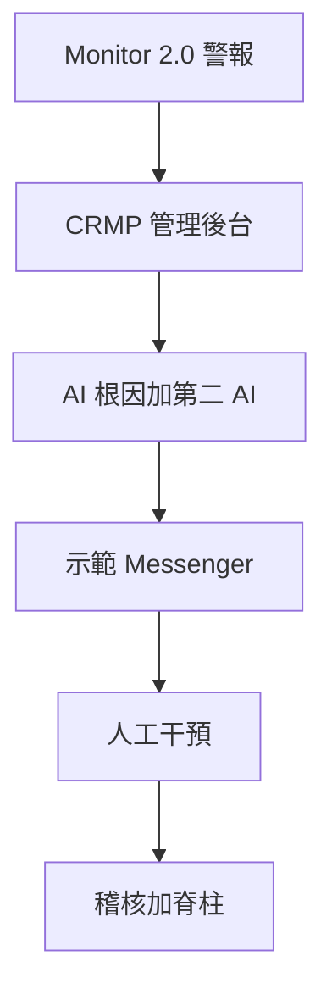

---

## 2. 登入、保持登入、切換語言

### 2.1 打開登入頁

1. 點左側 **登入**（在 GitHub Pages 最穩妥）。  
2. 或開啟 [`/admin/login`](/admin/login)（最穩）。舊的 [`/login`](/login) 仍在，但 GitHub Pages 要用 `/PRD/crmp-admin/login/` 或 `/PRD/crmp-admin/admin/login/` — 只打 `github.io/login` 會 404。

本原型管理後台是公開的。只有要用**具名角色**（讓 Maker／Checker 與權限像正式環境）時才需登入。

### 2.2 可用帳號

點 **快速填入示範角色**，或自行輸入帳密，再按 **登入**。

| 身分 | Email | 密碼 | 什麼時候用 |
|---|---|---|---|
| 平台負責人 | `yan.haixiang@vantagemarkets.com` | `yan123` | 你是 YAN Haixiang，本後台與文件的具名負責人 |
| 風險負責人 | `risk.owner@vantagemarkets.com` | `risk123` | 核准 AI 包與 Checker 步驟 |
| 風險分析師 | `risk.analyst@vantagemarkets.com` | `risk123` | 分流與 Messenger 挑戰 |
| 營運主管 | `ops.lead@vantagemarkets.com` | `ops123` | 提案停交易／封鎖／加寬／暫停跟單 |
| AI 工程師 | `ai.engineer@vantagemarkets.com` | `ai123` | 技能、RAG、偵測器、AI Admin 提案 |
| 系統管理員 | `system.admin@vantagemarkets.com` | `sys123` | 使用者、設定、稽核、AI 存取黑名單 |
| 超級管理員 | `admin@vantagemarkets.com` | `admin123` | 完整示範權限（雙人管控開啟時仍不能自己核准自己的 AI Admin 變更） |

登入後進入 **管理首頁**。姓名會留在這個瀏覽器（`crmp_demo_session_v1`）。重新整理公開 Pages 不會變回空白訪客。點左側 **登出** 才會清除。

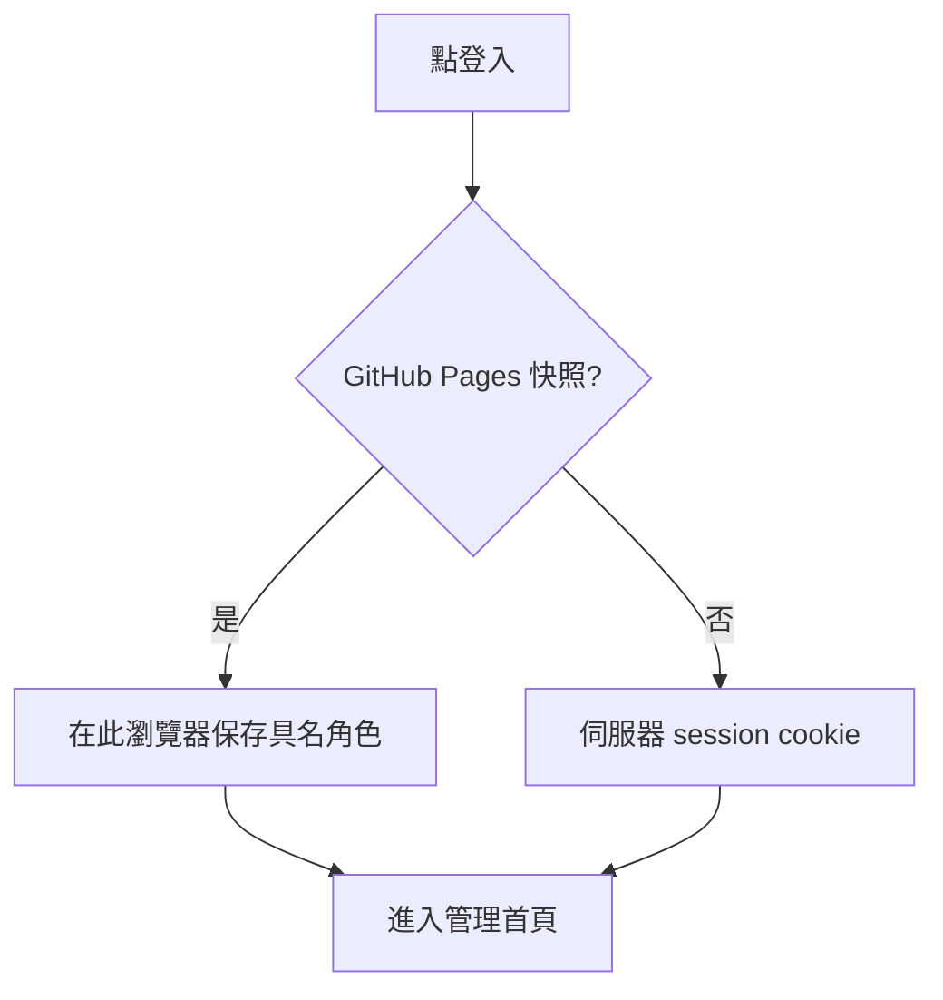

### 2.3 語言

用 **EN／繁中**（桌面在側欄；手機在頂部）。選擇存在 `crmp_ui_lang` cookie。所有左側標籤、頁標題、產品文件都可切換。若要分享中文連結，文件可加 `?lang=zh-Hant`。

### 2.4 手機

點 **漢堡選單**（選單）打開左側導覽。Messenger 先列表：點執行緒，再按 **執行緒** 返回。語言在頂部。

---

## 3. 左側選單（分組與未讀數字）

左側依組分開，避免一條超長清單：

| 分組 | 裡面有什麼 |
|---|---|
| **總覽** | 管理首頁 |
| **監控與風險** | 每日績效 → Monitor 2.0 → 偵測器 → 即時警報 → 市場情報 → 風險日誌 → 風險領域 |
| **AI 與知識** | AI 分析 → AI 技能 → 知識樹 → RAG → AI 管理 |
| **應變** | 示範 Messenger → 人工干預 → 升級路徑 → Lark → 脊柱日誌 |
| **組織** | 部門 → 團隊 → 使用者 → 角色 |
| **平台** | 資料來源 → 平台設定 → 稽核日誌 → AI 存取安全 |
| **文件** | 使用手冊 → 網址目錄 → UAT → PRD → TSD → 路線圖 → 生態 |

最上方是 Vantage 標誌。姓名下方是角色徽章（GitHub Pages 另有 **公開原型**）。負責人：YAN Haixiang。

### 未讀數字

部分列會出現 **青色徽章**（即時警報、AI 分析、示範 Messenger、市場情報、人工干預、脊柱、稽核、Monitor 2.0、風險日誌、偵測器）。

- 數字是**你上次打開該分頁之後的新事項**（本瀏覽器）。  
- 公式：`未讀 = max(0,（已知總數 + 額外增量）− 上次已看）`。  
- 打開該頁就會**清掉**徽章（存在 `crmp_nav_seen_v1`）。  
- 掃描、偵測器執行、AI 模擬產生新工作時，徽章**會增加**（`crmp_nav_extra_v1`）。  
- GitHub Pages 第一次畫面用後備總數，即使快照資料庫看起來是空的也仍有數字。

徽章只是提醒，不是鎖。隨時可以打開該頁。

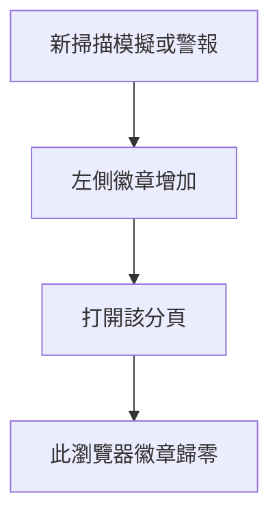

---

## 4. 各角色每天做什麼

### 風險負責人

1. 打開 [即時警報](/admin/alerts) 與 [AI 分析](/admin/ai-analyses)，找 BREACH／CRITICAL。  
2. 打開雙 AI 包。若第二 AI 是 `PARTIAL` 或 `DISAGREE`，**先不要**核准不可逆控制。  
3. 在 [示範 Messenger](/admin/messenger) 升級、**結案（接受 AI）**，或 **排除** 誤報。  
4. Ops 已 Maker 確認控制後，到 [人工干預](/admin/interventions) 做 Checker。  
5. 版本驗收時跑 [UAT 清單](/admin/docs/uat)。

### 風險分析師

1. 處理即時警報的 OPEN 佇列。  
2. 打開 AI 分析，讀摘要、證據、第二 AI 結論。  
3. 在 Messenger **顯示證據**，若不同意或有補充就打 **聊天**。  
4. 包就緒後升級給風險負責人。

### 營運主管／分析師

1. 從 Messenger **建議動作** 選封鎖／停交易／降槓桿／預先加寬／暫停跟單。  
2. 點 **雙重確認…** 再 **是，送至 Vantage 管理後台**。會得到管理參照與連結。  
3. 若執行緒說需要 Checker，等風險負責人在人工干預核准。

### AI 工程師

1. 維護 [AI 技能](/admin/skills)、[RAG](/admin/rag)、[偵測器](/admin/detectors)。  
2. 在 [AI 管理](/admin/ai-admin) 提案設定／模型／技能／RAG。不能核准自己的變更。  
3. 在 AI 管理參數或平台設定調整 `ai.second_opinion_severity`（預設 BREACH）。

### 系統管理員

1. 使用者、角色、團隊、部門、分組設定。  
2. 檢視 [AI 存取安全](/admin/security/ai-access) — AI 絕不可碰的頁／功能／欄位。  
3. 監看 [稽核日誌](/admin/audit) 與 [脊柱日誌](/admin/spine)。

---

## 5. 主流程：警報 → AI → 聊天 → 結案

這是最常用的路。後面章節再講其他頁。

1. 偵測器或 Monitor 2.0 指標越線。  
2. 即時警報出現 **OPEN**（Monitor 2.0 同時有工單）。  
3. AI 分析產生一包：劇本對得上就是 `SKILL_MATCH`，否則 `RAG_REASONING`。  
4. 嚴重度是 BREACH 或 CRITICAL 時，出現 **第二 AI** 面板（`AGREE`／`PARTIAL`／`DISAGREE`）。  
5. 在示範 Messenger 點 **同步警報**，讓這包變成聊天執行緒。  
6. **顯示證據** 把保險庫貼進對話。若要挑戰故事就聊天。  
7. **升級**、**排除**（誤報）或 **結案（接受 AI）**。  
8. 若要控制：選建議動作 → 雙重確認 → 必要時 Checker。  
9. 到脊柱日誌與稽核日誌核對同一批事件。

**AI 分析頁的示範捷徑**（localhost）：模擬 COPY 越線（技能路徑）、模擬 EQ 回撤（RAG，常為 WARN 故略過第二 AI）、模擬 CRITICAL（強制第二 AI）、回填第二 AI 挑戰。

**決策規則：** `AGREE` 可依政策走劇本。`PARTIAL`／`DISAGREE` 代表 **需要人類** — 兩份 AI 都讀過之前，不要做不可逆控制。

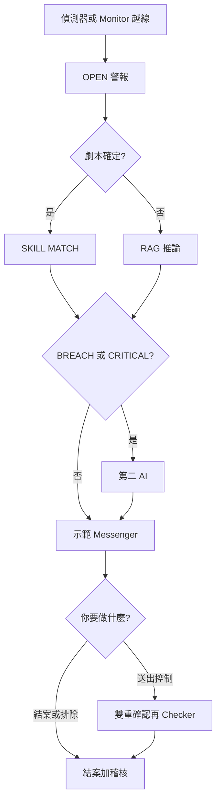

---

## 6. 總覽

### 6.1 管理首頁 — `/admin`

**這頁是什麼。** 登入後的落地頁。看後台現在有多忙。

**會看到什麼。**

- **YAN Haixiang** 負責人卡。整張卡開啟「以平台負責人登入」。  
- Lark 風格 Messenger 宣傳。整張卡開啟 Messenger 示範（卡上有永久 GitHub Pages 網址）。  
- 可點擊的數字卡：使用者、團隊、資料來源、風險領域、未結警報、未結工單、Lark 頻道、升級路徑。每張卡跳到對應頁。  
- **跳至頁面** 磁磚：每日績效、市場情報、Monitor 2.0、即時警報、AI 分析、AI 技能、知識樹、人工干預、Messenger、設定、使用手冊、PRD。  
- 部門分工。每張部門卡開啟該組工作頁（風險控管 → 即時警報、營運 → 人工干預、AI → AI 分析、系統 → 平台設定）。**查看全部** 開部門目錄。  
- 最近警報。每一列開啟即時警報中該筆警報。**查看全部** 列出全部。  
- 整合脊柱步驟。每一步開啟對應頁（Monitor 2.0、即時警報、升級路徑、AI 分析、每日績效）。**脊柱日誌** 開啟膠帶。  
- 頁首捷徑：Messenger、使用手冊、每日績效。

**要點什麼。** 把卡片當地圖。未結警報不是零就先去那裡。

**怎樣算正常。** 數字與其他頁一致。卡片是連結，不是死磚。

---

## 7. 監控與風險

### 7.1 每日績效 — `/admin/dashboard`

**這頁是什麼。** 當日結束的 CFD 與加密風險畫面 — 脊柱最後一環。

**會看到什麼。** 報表日、CFD／加密的 WARN／BREACH 數，以及指標卡（數值、目標、備註、健康）。

**要點什麼。** **重新整理**（localhost）會從 `/api/dashboard` 重建即時指標。Pages 上是種子快照。

**怎樣算正常。** 兩個產品欄都在。狀態徽章可讀（HEALTHY／WARN／BREACH）。

### 7.2 風險日誌分析 — `/admin/risk-log`

**這頁是什麼。** 歷史帳：什麼觸發、人處理多久、損失 vs 防損金額、漏洞集中在哪。

**會看到什麼。**

- 摘要磚：未結警報、損失 vs 防損 vs 曝險、平均確認／結案／人工分鐘、SLA 逾時、待決 vs 已決干預。  
- 依類別、依領域的表。  
- 漏洞標籤（反覆弱點）。  
- 時序紀錄（警報、工單、結果、美元）。

**要點什麼。** 篩選／掃表。需要整包時跟列回到即時警報或 AI 分析。

**怎樣算正常。** 合計對得上。已結案件有處理時間。示範種子的漏洞標籤不是空的。

### 7.3 市場情報 — `/admin/market-intel`

**這頁是什麼。** 每五分鐘看新聞、社群、官方與交易所貼文，找出可能移動 LP 報價的訊息。發現餵給指標 `M2-MKT-INTEL` 與 Messenger 寄件匣（正式環境 Lark 群 `oc_market_intelligence`）。

**會看到什麼。** 分頁：**發現**、**Messenger 寄件匣**、**來源**、**掃描紀錄**。卡片用 i–vi 格式（發生什麼、產品、為何可能移動 LP、嚴重度、來源、建議下一步）。排程開／關。技能劇本連結。

**要點什麼。**

1. 若畫面閒置，先在平台設定打開 `market_intel.enabled`。  
2. 點 **立即掃描**。  
3. 讀新發現，再看出件匣，再看掃描紀錄。

**GitHub Pages：** 沒有 `/api`，所以 **立即掃描** 會跑**本機示範掃描**（與正式掃描同一批事件模板）。新卡片立刻出現，存在這個瀏覽器（`crmp_mi_demo_v1`）。真正 HTTP 抓取仍屬 `localhost:3000`。**不會**出現 405。

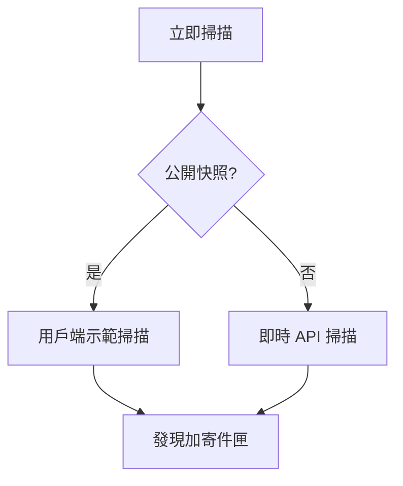

**怎樣算正常。** 掃描結束有筆數。發現、寄件匣、掃描紀錄都更新。即時警報／市場情報未讀徽章可能加一。

### 7.4 Monitor 2.0 — `/admin/monitor-2`

**這頁是什麼。** 既有指標平台的整合中心。CRMP 不取代 Monitor 2.0，只從它同步。

**會看到什麼。** 三個分頁：

- **指標** — monitor id、名稱、領域、產品、警告／越線門檻、最後數值、未結工單數。  
- **警報** — 與即時警報同一批事件，含 Monitor 工單 id。  
- **工單** — 案件追蹤、承辦、部門、Lark 訊息 id。

面板顯示 `monitor2.base_url` 與 **立即同步（原型）**。

**要點什麼。** 在 localhost 同步以刷新鏡像表。確認 OPEN 警報。更新工單狀態。Pages 上當唯讀目錄。

**怎樣算正常。** 看得到 EQ／MRG／COPY 等指標。同步會回報刷新了幾列。

### 7.5 偵測器 — `/admin/detectors`

**這頁是什麼。** 坐在 Monitor 前面的門檻監視。脊柱第一階段。

**會看到什麼。** 每個偵測器：代碼、產品、領域、monitor id、警告／越線、比較子、啟用、上次執行、上次狀態／數值。近期 **執行紀錄**（觀測值、嚴重度、連結的警報與分析）。

**要點什麼。**

- **全部執行**（localhost）對每個啟用偵測器取樣。警告／越線會自動拉警報並啟動 AI RCA。偵測器、即時警報、AI 分析的未讀徽章會增加。  
- **啟用／停用** 單一偵測器。

**怎樣算正常。** COPY 類偵測器能產出 BREACH。停用的不會開火。脊柱出現 DETECT → ALARM。

### 7.6 即時警報 — `/admin/alerts`

**這頁是什麼。** 營運佇列：現在什麼在燒。

**會看到什麼。** 卡片依 CRITICAL → BREACH → WARN、再依新到舊。每張：嚴重度、狀態、產品、領域、標題、說明、警報 id、monitor id、觀測值、工單 id、時間。

**要點什麼。** 有操作權時對 OPEN 點 **確認（Acknowledge）**。再到 AI 分析或 Messenger 看整包。進入本頁會清掉未讀徽章。

**怎樣算正常。** OPEN 排在一天的最前面。Ack 後狀態變 ACKNOWLEDGED。沒有默默消失。

### 7.7 風險領域 — `/admin/risk-domains`

**這頁是什麼。** CFD 與加密風險領域目錄（信用、LP 對沖、市場定價、加密交易所、詐欺、產品設定、模型／AI、營運、資本、技術）。

**會看到什麼。** 卡片含優先序、代碼、產品覆蓋、負責部門、支援部門、說明。

**要點什麼。** 原型為唯讀。升級前用來確認誰負責該領域。

**怎樣算正常。** 每個領域都有負責人。產品覆蓋是 CFD、Crypto 或兩者。

---

## 8. AI 與知識

### 8.1 AI 分析 — `/admin/ai-analyses`

**這頁是什麼。** RCA 工作台。警報觸發時自動跑。

**會看到什麼。** 分析清單：模式（`SKILL_MATCH` 或 `RAG_REASONING`）、信心、摘要、狀態、需要人類旗標、技能代碼、指標、**第二 AI · 結論** 徽章。點進一筆看完整包：解釋、證據庫、技能執行步驟、**第二 AI 挑戰者**面板（批評、改進、替代假說）。

**要點什麼（示範，localhost）。**

- 模擬 COPY 越線 — 技能路徑。  
- 模擬 EQ 回撤 — RAG；WARN 通常略過第二 AI。  
- 模擬 CRITICAL — 強制第二 AI。  
- 回填第二 AI 挑戰 — 幫較舊的高嚴重度包補上挑戰列。

可連到技能劇本或 Messenger 執行緒。

**怎樣算正常。** 每筆 BREACH／CRITICAL 都有第二 AI 徽章。預設門檻下 WARN 沒有。`PARTIAL`／`DISAGREE` 會設需要人類。

### 8.2 AI 管理 — `/admin/ai-admin`

**這頁是什麼。** AI 的治理，**不是**即時 RCA 清單。Maker 提案；**另一個人** Checker。

**分頁。**

| 分頁 | 你做什麼 |
|---|---|
| 總覽 | KPI：分析數、技能匹配％、信心、需要人類、待決干預、人類同意％、回饋正確％、待決變更單 |
| 參數 | 起草 `ai.*` 設定（RCA 開／關、警報自動、最低信心、RAG top-K、第二意見嚴重度、Maker／Checker）。**提案**不會立刻套用 |
| Maker／Checker | 待決變更單在前。核准或駁回並寫備註。不能核准自己的 |
| 技能 | 提案新增／更新／停用劇本。核准後才套用 |
| RAG | 提案新增／更新／退役語料 |
| 訓練 | 排隊重新校正（會變成 TRAINING 變更單） |
| 歷史 | 準確率快照（約 14 天） |

標題徽章顯示你是 Maker、Checker 或兩者。風險負責人可以兩者都是，但**自己核准自己仍然被擋**。

**怎樣算正常。** 提案的技能在另一人核准前維持 PENDING。核准後出現在 AI 技能。即時桌上的參數在 APPROVED 之前不會動。

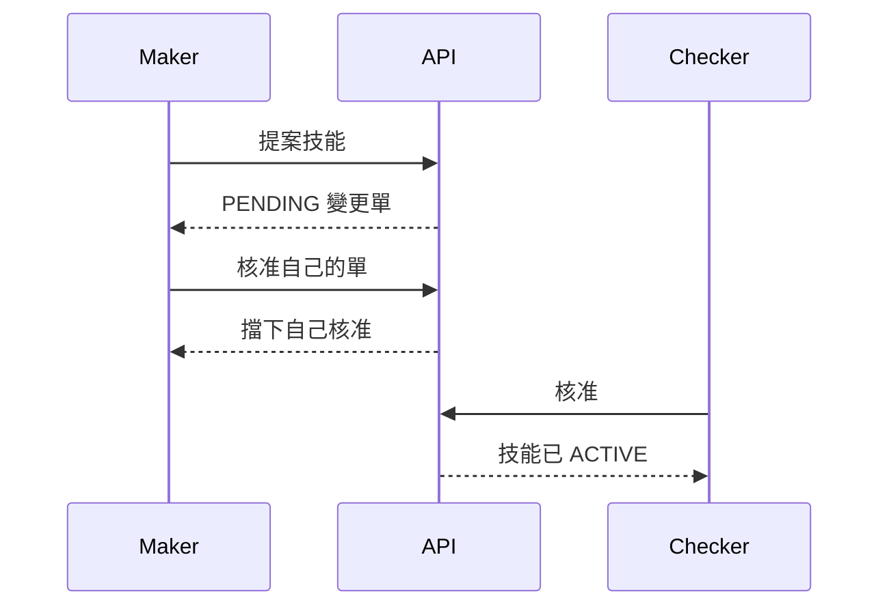

### 8.3 AI 技能 — `/admin/skills`

**這頁是什麼。** SKILL.md 風格劇本：何時用、何時不用、前置檢查、步驟、證據、停止條件、成功標準、門檻與理由、故障區域、升級、BU 矯正、過往案例。

**會看到什麼。** 搜尋框。兩個分頁：**單指標技能** 與 **連結時間鏈**（多指標鏈）。卡片保持精簡（代碼、名稱、產品、領域、自動 vs 人工）。

**要點什麼。** **進入** 打開 `/admin/skills/{code}` — 完整劇本頁（不是小卡片）。從那裡可回技能、知識樹、AI 分析、風險日誌。

**怎樣算正常。** 種子技能的進入不會 404。連結時間鏈看得到順序、原因、連結技能。

### 8.4 知識樹 — `/admin/knowledge-tree`

**這頁是什麼。** 知識怎麼掛在一起的圖：CRMP → 風險領域 → 技能劇本，側幹是連結時間鏈與 RAG。

**會看到什麼。**

- 預設 **樹狀圖**，或 **大綱**。  
- 產品篩選：全部／CFD／Crypto。  
- 樹幹切換：風險領域、連結時間鏈、RAG 語料。  
- 點**領域**展開技能。點**技能**填入檢視器。  
- **進入**／**進入完整劇本** 打開 SKILL.md 頁。  
- RAG 節點打開 RAG 知識庫。文件依標籤與標題匹配。

領域排成兩列，標籤保持可讀。不是十個小盒子橫向擠成一條。

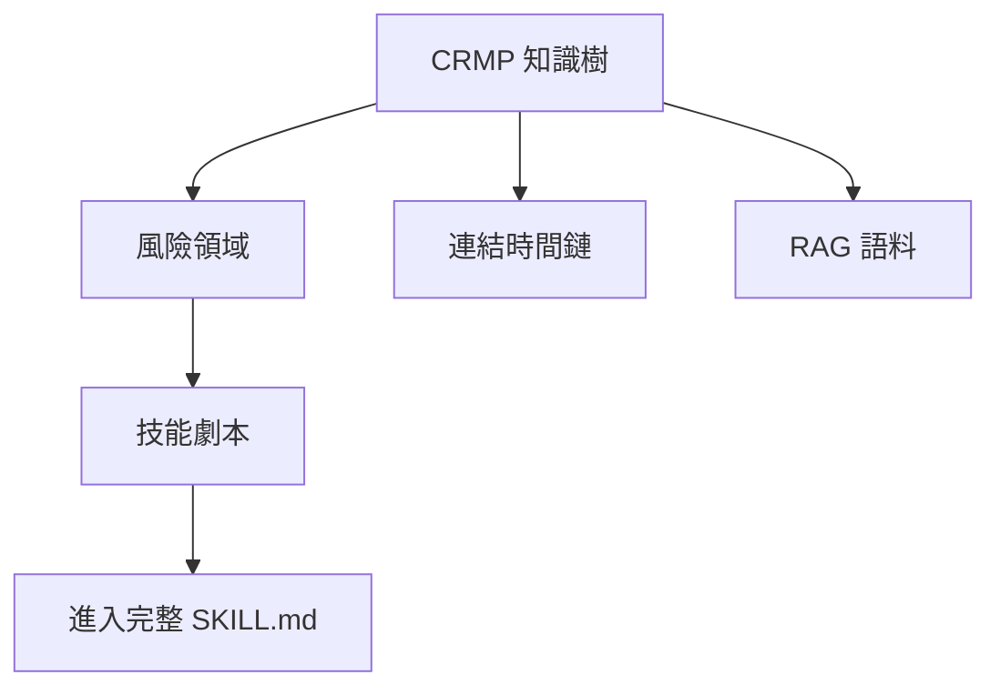

**怎樣算正常。** LP_HEDGE 會展開對沖技能。RAG 幹依分類群組文件。進入會導頁，不是失效的 SVG 連結。

### 8.5 RAG 知識庫 — `/admin/rag`

**這頁是什麼。** 技能不確定時用的內部語料：政策、產品、實體、平台。

**會看到什麼。** 依分類篩選、搜尋框、文件卡（鍵、標題、標籤、狀態、摘要）。**檢索**框可試查詢（top-K 命中與分數）。有管理權可新增、改內容、退役。

**要點什麼。** 用「copy trading concentration gold margin」這類句子檢索，確認命中相關。較像正式環境的新增應走 AI 管理；本頁是語料瀏覽器。

**怎樣算正常。** 檢索回傳排序命中。退役文件不再出現在搜尋。

### 8.6 脊柱日誌 — `/admin/spine`

**這頁是什麼。** 端到端膠帶：DETECT → ALARM → AI_RCA → SKILL_EXECUTE → HUMAN_INTERVENTION → RESOLVED → DASHBOARD。

**會看到什麼。** 各階段 24 小時計數，再來事件時間軸（id、階段、產品、嚴重度、標題、執行者、時間、明細）。

**要點什麼。** 唯讀。跑完偵測器或結案 Messenger 後，在 localhost 約一分鐘內核對對應階段出現。

**怎樣算正常。** COPY 越線示範會產出 DETECT、ALARM、AI_RCA（若有執行則含 SKILL_EXECUTE／HUMAN_INTERVENTION）。快樂路徑沒有無聲缺口。

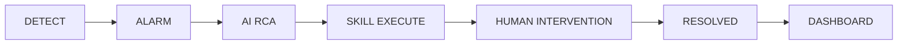

---

## 9. 應變

### 9.1 人工干預 — `/admin/interventions`

**這頁是什麼。** 執行期動作的 Checker 桌（不是 AI 管理設定）。Maker 已要求控制；你核准或駁回。

**會看到什麼。** 卡片：動作代碼、狀態、分析、指標、警報標題／嚴重度、技能步驟、請求時間。待決項有備註框與 **核准**、**駁回**。

**要點什麼。** 寫一句理由。核准即上線（原型記錄決策）。駁回即停止。兩者都寫脊柱與稽核。

**怎樣算正常。** 待決數與首頁／AI 管理 KPI 一致。已決列看得出誰、何時。

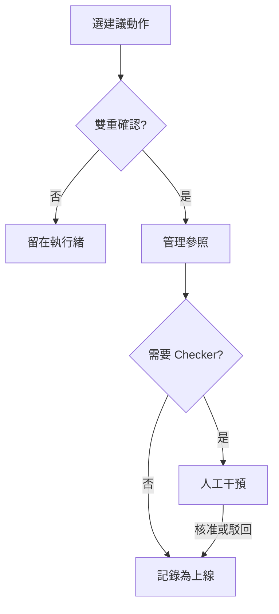

### 9.2 示範 Messenger — `/admin/messenger`

**這頁是什麼。** 應用內 Lark 風格收件匣。正式環境會用真 Lark；本頁證明按鈕與稽核軌跡。

**版面。** 桌面：執行緒列表 + 聊天並排。手機：列表 → 點執行緒 → **執行緒** 返回。

**工具列。** **同步警報** 把新 Monitor 警報拉成執行緒。

**打開執行緒後可以：**

| 按鈕 | 做什麼 |
|---|---|
| **顯示證據** | 把證據庫與第二 AI 摘要貼進聊天 |
| **聊天**（輸入 + 傳送） | 挑戰 AI 或補充事實。不同意會標 `needs_human` |
| **升級** | 沿路徑 Primary → Secondary → 風險負責人 → 高階 |
| **排除** | 誤報。關閉執行緒與警報 |
| **結案（接受 AI）** | 接受分析並關閉工單 |
| **建議動作** | 封鎖使用者、停交易、降最高槓桿、預先加寬點差、暫停跟單加入 |
| **雙重確認…** 再 **是，送至 Vantage 管理後台** | 產生管理參照 + 連結（常是人工干預） |
| **Checker 核准（上線）** | 系統說需要 Checker 時 |
| **在管理後台開啟** | 跳到對應管理頁（Pages 上必須留在 `/PRD/crmp-admin/` 底下） |

**怎樣算正常。** 同步會產生執行緒。證據貼的是保險庫，不是空白泡泡。升級會前進路徑。排除／結案會改狀態。雙重確認產出 admin_ref。在 GitHub Pages「開啟管理後台」不會 404。

永久網址：[https://hxyan2020.github.io/PRD/crmp-admin/admin/messenger/](https://hxyan2020.github.io/PRD/crmp-admin/admin/messenger/)

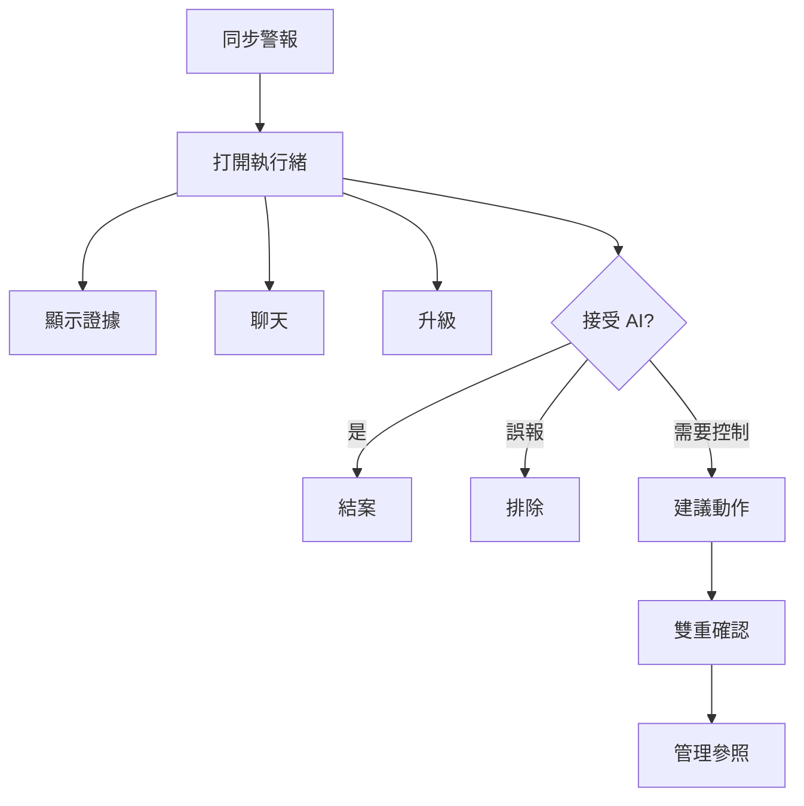

### 9.3 Lark 整合 — `/admin/lark`

**這頁是什麼。** 依嚴重度通知、值班叫應、雙人核准 ping 的頻道登錄。原型 Webhook 為模擬。

**會看到什麼。** 頻道清單（名稱、chat id、用途、啟用）。Lark 相關設定（`lark.*`）。

**要點什麼。** 有管理權可啟用／停用頻道。localhost 可送模擬通知。Pages 上當目錄。

**怎樣算正常。** 市場情報、風險、AI 實驗室頻道存在。停用頻道不會被升級路徑使用。

### 9.4 升級路徑 — `/admin/escalation`

**這頁是什麼。** 地圖：嚴重度 → 主團隊 → 次團隊 → Lark 頻道 → SLA 分鐘。示範 Messenger **升級** 跟這張地圖走。

**會看到什麼。** 路徑名稱、嚴重度、領域、團隊、頻道、SLA、啟用旗標。

**要點什麼。** 有管理權可在 localhost 新增／編輯／停用。升級 CRITICAL 前先看 SLA。

**怎樣算正常。** CRITICAL 的 SLA 比 WARN 緊。每條路徑都有主團隊。

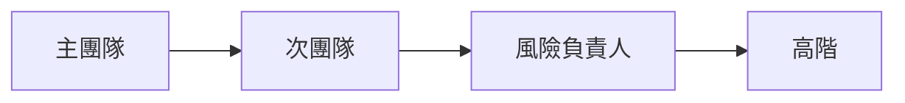

---

## 10. 組織

### 10.1 部門 — `/admin/departments`

風險控管、營運、AI、系統的卡片：說明、團隊數、使用者數、主要職責（RACI）。唯讀目錄。

### 10.2 團隊 — `/admin/teams`

表：團隊名、部門、成員、Lark chat id、值班輪值、任務。路徑開火時叫醒的就是這些人。

### 10.3 角色與權限 — `/admin/roles`

每個角色（風險負責人、分析師、營運、AI 工程師、系統管理員、超級管理員、檢視者…）及其權限晶片（`monitor.read`、`ai.approve`、`settings.manage`…）。超級管理員有 `*`。用這頁理解某個角色為什麼少一顆按鈕。

### 10.4 使用者 — `/admin/users`

操作員與示範角色目錄，含 **YAN Haixiang**。欄位：姓名、email、角色、部門、團隊、狀態、上次登入。

有 `users.manage`（localhost）可 **新增使用者**（姓名、email、密碼、角色、部門、團隊）並切換 ACTIVE／DISABLED。Pages 上新增多半是示範空操作或僅本機瀏覽器。

**怎樣算正常。** YAN Haixiang 以平台負責人存在。停用使用者在 localhost API 不能當即時 Maker／Checker。

---

## 11. 平台

### 11.1 資料來源 — `/admin/data-sources`

內部平台與外部驗證來源登錄（分類、名稱、類型、狀態）。localhost 有 `sources.manage` 可管理。這是 AI 與偵測器在證據裡可以點名的目錄。

### 11.2 AI 存取安全 — `/admin/security/ai-access`

**僅限人類** 清單。AI 服務帳號絕不可取得這些頁、功能、欄位或資料（身分寫入、祕密、雙人核准、LP／錢包執行、角色寫入、session cookie）。

**會看到什麼。** 統計、黑名單（目標、理由、嚴重度）、允許的 AI 能力、禁止的權限代碼。

**怎樣算正常。** 核准路徑、使用者／角色寫入、交易執行都在黑名單。允許清單很窄（讀證據、起草 RCA、檢索 RAG）。

### 11.3 稽核日誌 — `/admin/audit`

誰做了什麼：時間、執行者、動作、實體、明細。localhost 上 Messenger 排除／結案、AI Admin 提案／核准、干預、登入、設定儲存應出現於此。最新 200 列。

### 11.4 平台設定 — `/admin/settings`

分組旗標（不是一大本按字母排）：

| 分組 | 例如這些鍵 |
|---|---|
| 平台身分 | `platform.*`、`products.*` |
| Monitor 2.0 | `monitor2.*` |
| AI 分析 | `ai.*`（RCA、信心、第二意見嚴重度、Maker／Checker） |
| 市場情報 | `market_intel.*`（啟用、間隔、Lark chat） |
| Messenger／Lark | `lark.*` |
| 升級與 SLA | `escalation.*`、`detectors.*` |

改一個值再 **儲存**。localhost 寫入 SQLite。GitHub Pages 只存在這個瀏覽器，並會這樣說明。

---

## 12. 文件（左側選單）

以下都可像其餘後台一樣切 **EN／繁中**。

| 頁 | 路徑 | 這是什麼 |
|---|---|---|
| 使用手冊 | `/admin/docs/user-guide` | 本手冊 |
| PRD | `/admin/docs/prd` | 我們在做什麼、為什麼、怎麼算過關 |
| TSD | `/admin/docs/tsd` | 怎麼做的（架構、API、資料模型） |
| UAT 清單 | `/admin/docs/uat` | 互動式 45 案簽核（UAT-01 … UAT-45）：為什麼、步驟、通過、證據、畫面覆蓋 |
| 生態導入評估 | `/admin/docs/ecosystem` | 真要導入的人力、預算帶、階段、風險 |
| 改進路線圖 | `/admin/docs/roadmap` | RM-01…15 卡片：今日／要做／完成標準／不做風險 |
| 網址目錄 | `/admin/docs/urls` | 每個管理頁、API、資料表，加上公開 Pages 網址 |

UAT：依序走案例。不要跳過 Critical 前置。在看板上勾 Pass／Fail；覆蓋晶片顯示每案打到哪些畫面。

---

## 13. 每次都要做的安全習慣

1. 每個版本打開一次 AI 存取安全，確認黑名單仍是「僅限人類」。  
2. 正式 AI 服務帳號絕不要拿到那些權限。  
3. 把 Messenger **排除** 與 **結案** 當真正決策 — 會被稽核。  
4. BREACH／CRITICAL 時，不可逆控制前主 AI 與第二 AI 都要留在畫面上。  
5. 控制之後，用同一組 id 核對 **稽核日誌** 與 **脊柱日誌**。  
6. AI 管理與指定控制的 Maker 與 Checker 必須是**兩個人**。

---

## 14. 左側每一頁速查

| 分組 | 頁 | 來這裡是為了… |
|---|---|---|
| 總覽 | 管理首頁 | 看數字；點每一張卡與警報列 |
| 監控與風險 | 每日績效 | 當日 CFD＋加密指標 |
| 監控與風險 | Monitor 2.0 | 指標、警報、工單；從上游同步 |
| 監控與風險 | 偵測器 | 執行或暫停門檻監視 |
| 監控與風險 | 即時警報 | 確認未結佇列 |
| 監控與風險 | 市場情報 | 掃描新聞／社群；讀發現與寄件匣 |
| 監控與風險 | 風險日誌分析 | 時間軸、處理時間、損失 vs 防損、漏洞 |
| 監控與風險 | 風險領域 | 看誰負責每個風險區 |
| AI 與知識 | AI 分析 | 讀 RCA＋第二 AI；跑示範模擬 |
| AI 與知識 | AI 技能 | 瀏覽劇本；進入完整 SKILL.md |
| AI 與知識 | 知識樹 | 領域、技能、RAG 的視覺地圖 |
| AI 與知識 | RAG 知識庫 | 搜尋與檢索證據文件 |
| AI 與知識 | AI 管理 | 提案／核准模型、參數、技能、RAG |
| 應變 | 示範 Messenger | 證據、聊天、升級、排除、結案、控制 |
| 應變 | 人工干預 | Checker 核准／駁回執行期關卡 |
| 應變 | 升級路徑 | 嚴重度 → 團隊 → SLA |
| 應變 | Lark 整合 | 頻道登錄 |
| 應變 | 脊柱日誌 | 跟隨 Detect → … → Dashboard |
| 組織 | 部門 | RACI 權責 |
| 組織 | 團隊 | 值班與 Lark chat id |
| 組織 | 使用者 | 目錄，含 YAN Haixiang |
| 組織 | 角色與權限 | RBAC 晶片 |
| 平台 | 資料來源 | 內部＋外部登錄 |
| 平台 | 平台設定 | 分組旗標 |
| 平台 | 稽核日誌 | 誰改了什麼 |
| 平台 | AI 存取安全 | 僅限人類的頁／功能／欄位 |
| 文件 | 使用手冊／網址目錄／UAT／PRD／TSD／路線圖／生態 | 產品與操作文件 |

---

## 15. 文件控制

| 版次 | 日期 | 說明 |
|---|---|---|
| 1.0 | 2026-10-01 | 操作手冊 |
| 1.3 | 2026-10-04 | 全部管理畫面、公開掃描示範、YAN Haixiang 負責人、Pages 登入 |
| 1.5 | 2026-10-04 | 登入、未讀、RCA、Messenger、Maker／Checker、情報掃描、知識樹、脊柱流程圖 |

**負責人：** YAN Haixiang
