# CRMP 使用手冊

**文件編號：** CRMP-UG-001 · **對象：** 任何會打開管理後台的人  
**語言：** 繁體中文（本頁）· [English](/admin/docs/user-guide?lang=en)  
**文件與平台負責人：** demo platform owner（`haixiang.yan@hytechc.com`）

這本手冊用白話寫。涵蓋左側選單**每一頁**，以及登入、語言、未讀數字、公開 GitHub Pages 快照，還有 **24/7 CS／TR 客戶大門**（C1 即時聊天、網站表單、官方信箱、自動信件等待迴圈、專用技能、**專用儀表板、日誌與資料**）。

---

## 1. 這個後台是做什麼的

Vantage **CRMP Plus** 是升級控制室：原 CRMP 風險脊柱加上 24/7 客服與交易台。Monitor 2.0 發出警報後，這裡會：

1. 找到對應的技能劇本；若不確定，就搜尋 RAG 知識庫。  
2. 高嚴重度（BREACH 或 CRITICAL）時，再跑一輪**獨立的第二 AI**，可能同意、部分同意或不同意。  
3. 把整包放進 **Lark 風格 Messenger**，讓你顯示證據、聊天、升級、排除、結案或送出控制。  
4. 不可逆控制上線前，要有人類 Checker。  
5. **CS／TR 台**值守 24/7：C1 即時聊天、網頁表單與官方信箱 — 客戶走公開 **`/cs`**；AI 在不清楚或需核身時寄信並**等到客戶回覆**（上限來自 `cs.followup_cap`，預設 3 封）。CS／TR 量在**獨立儀表板**；CS_* 歷史在**獨立日誌**；BU／團隊／關卡／`cs.*` 在**獨立資料頁**。  
6. 整段故事寫進**稽核日誌**與**首頁脊柱**（各階段工單計數 — 專屬脊柱日誌分頁已移除）。

不必是工程師。點左側選單、讀卡片、跟畫面上的按鈕走即可。

**兩個故事、同一後台。** 風險警報仍走 Monitor → AI → Messenger → 人工關卡（第 5 節）。客戶問題與投訴走 **C1／表單／信箱 → `/cs` 或 webhook → CS／TR 台 → 技能＋自動信件 → TR 或風控**（第 9.3 節）。CS 不啟動交易管制；TR 不值班 C1。

**永久公開示範（CRMP Plus）：** [https://hxyan2020.github.io/PRD/crmp-plus/admin/](https://hxyan2020.github.io/PRD/crmp-plus/admin/)  
**Messenger 示範：** [https://hxyan2020.github.io/PRD/crmp-plus/admin/messenger/](https://hxyan2020.github.io/PRD/crmp-plus/admin/messenger/)  
**CS／TR 台：** [https://hxyan2020.github.io/PRD/crmp-plus/admin/cs-desk/](https://hxyan2020.github.io/PRD/crmp-plus/admin/cs-desk/)  
**CS／TR 儀表板：** [https://hxyan2020.github.io/PRD/crmp-plus/admin/cs-dashboard/](https://hxyan2020.github.io/PRD/crmp-plus/admin/cs-dashboard/)  
**CS／TR 日誌：** [https://hxyan2020.github.io/PRD/crmp-plus/admin/cs-log/](https://hxyan2020.github.io/PRD/crmp-plus/admin/cs-log/)  
**CS／TR 資料：** [https://hxyan2020.github.io/PRD/crmp-plus/admin/cs-data/](https://hxyan2020.github.io/PRD/crmp-plus/admin/cs-data/)  
**CS 客戶入口：** [https://hxyan2020.github.io/PRD/crmp-plus/cs/](https://hxyan2020.github.io/PRD/crmp-plus/cs/)  
**原 CRMP 管理後台（凍結）：** [https://hxyan2020.github.io/PRD/crmp-admin/admin/](https://hxyan2020.github.io/PRD/crmp-admin/admin/)  
**完整網址：** [網址目錄](/admin/docs/urls)  
**開放議題／進度：** [開放議題](/admin/docs/open-issues) · [進度追蹤](/admin/docs/progress)

GitHub Pages **沒有即時 `/api`**。每一頁仍可走完。本來要寫進伺服器的按鈕，會改存在這個瀏覽器。真正寫入（即時掃描、雙人核准套用、新增使用者）請用 `localhost:3000`。

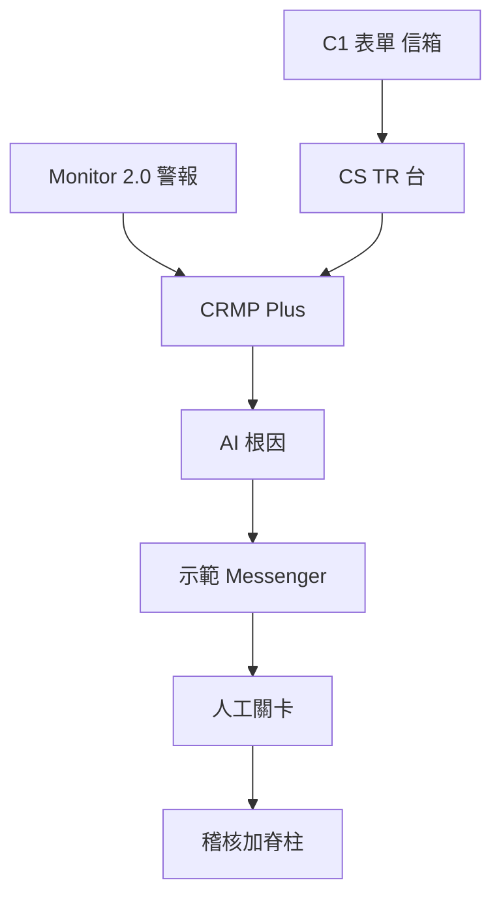

---

## 2. 登入、保持登入、切換語言

### 2.1 打開登入頁

1. 點左側 **登入**（在 GitHub Pages 最穩妥）。  
2. 或開啟 [`/admin/login`](/admin/login)（最穩）。舊的 [`/login`](/login) 仍在，但 GitHub Pages 要用 `/PRD/crmp-plus/login/` 或 `/PRD/crmp-plus/admin/login/` — 只打 `github.io/login` 會 404。

本原型管理後台是公開的。只有要用**具名角色**（讓 Maker／Checker 與權限像正式環境）時才需登入。

### 2.2 可用帳號

點 **快速填入示範角色**，或自行輸入帳密，再按 **登入**。

| 身分 | Email | 密碼 | 什麼時候用 |
|---|---|---|---|
| 平台負責人 | `haixiang.yan@hytechc.com` | `yan123` | 你是 demo platform owner，本後台與文件的具名負責人 |
| 風險負責人 | `risk.owner@vantagemarkets.com` | `risk123` | 核准 AI 包與 Checker 步驟 |
| 風險分析師 | `risk.analyst@vantagemarkets.com` | `risk123` | 分流與 Messenger 挑戰 |
| 營運主管 | `ops.lead@vantagemarkets.com` | `ops123` | 提案停交易／封鎖／加寬／暫停跟單 |
| AI 工程師 | `ai.engineer@vantagemarkets.com` | `ai123` | 技能、RAG、偵測器、AI Admin 提案 |
| 系統管理員 | `system.admin@vantagemarkets.com` | `sys123` | 使用者、設定、稽核、AI 存取黑名單 |
| 超級管理員 | `admin@vantagemarkets.com` | `admin123` | 完整示範權限（雙人管控開啟時仍不能自己核准自己的 AI Admin 變更） |
| 客服主管 | `cs.lead@vantagemarkets.com` | `cs123` | 24/7 CS 台、追問豁免、指派 TR |
| 客服專員 | `cs.agent@vantagemarkets.com` | `cs123` | C1／表單／信箱第一回應 |
| 交易主管 | `tr.lead@vantagemarkets.com` | `tr123` | 成交投訴品質 |
| 交易員 | `tr.dealer@vantagemarkets.com` | `tr123` | 還原成交 vs LP |

登入後進入 **管理首頁**。姓名會留在這個瀏覽器（`crmp_demo_session_v1`）。重新整理公開 Pages 不會變回空白訪客。點左側 **登出** 才會清除。

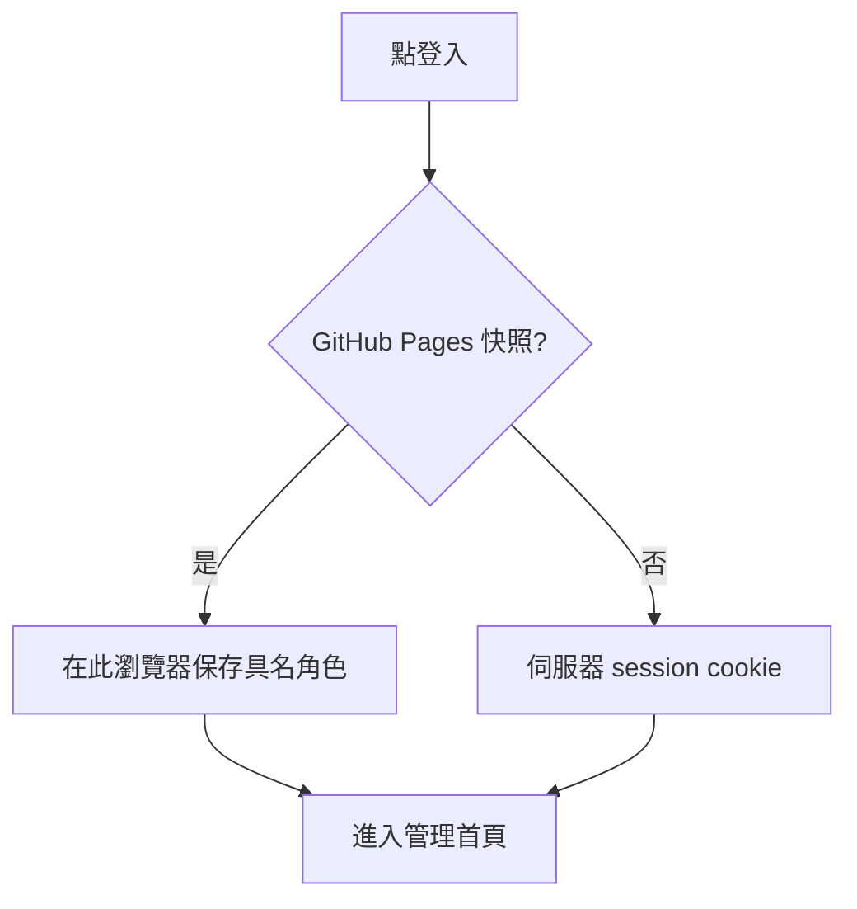

### 2.3 語言

用 **EN／繁中**（桌面在側欄；手機在頂部）。選擇存在 `crmp_ui_lang` cookie。所有左側標籤、頁標題、產品文件都可切換。若要分享中文連結，文件可加 `?lang=zh-Hant`。

### 2.4 手機

點 **漢堡選單**（選單）打開左側導覽。Messenger 先列表：點執行緒，再按 **執行緒** 返回。語言在頂部。Monitor 2.0、即時警報與追蹤、稽核等寬表必要時可橫向捲動；下方的劃選 AI 聊天在手機長按選取後同樣可用。

### 2.5 劃選 AI 聊天

在任何管理頁 **劃選文字**（手機長按）。亮青色火花圖示會出現在選取旁邊。點它：聊天抽屜用本 CRMP 的詞解釋該段（Monitor vs 模擬 Lark、EXECUTED_MOCK、誰能核准、該開哪一頁）。可以繼續追問。唯讀 — 不能核准干預或改設定。GitHub Pages 用同一套接地詞彙（不必線上 LLM）。

---

## 3. 左側選單（分組與未讀數字）

左側依組分開，避免一條超長清單：

| 分組 | 裡面有什麼 |
|---|---|
| **總覽** | 管理首頁（含脊柱階段工單計數） |
| **監控與風險** | 每日績效 → Monitor 2.0 → 即時警報與追蹤 → 市場情報 → 風險日誌 → 風險領域 |
| **AI 與知識** | AI 技能 → 知識樹 → RAG → AI 管理（AI 分析列表已併入即時警報與追蹤；偵測器左側分頁已移除 → Monitor 2.0） |
| **應變** | 示範 Messenger → CS／TR 台 → CS／TR 儀表板 → CS／TR 日誌 → CS／TR 資料 → 人工干預 → 升級路徑 → Lark |
| **組織** | BU 與團隊 → 使用者 → 角色 |
| **平台** | 資料來源 → 平台設定 → 稽核日誌 → AI 存取安全 |
| **文件** | 使用手冊 → 網址目錄 → UAT → PRD → TSD → 路線圖 → 生態 → 開放議題 → 進度追蹤 |

最上方是 Vantage 標誌。姓名下方是角色徽章（GitHub Pages 另有 **公開原型**）。負責人：demo platform owner。

### 未讀數字

部分列會出現 **青色徽章**（即時警報與追蹤、示範 Messenger、CS／TR 台、CS／TR 儀表板、CS／TR 日誌、CS／TR 資料、市場情報、人工干預、稽核、Monitor 2.0、風險日誌）。

- 數字是**你上次打開該分頁之後的新事項**（本瀏覽器）。  
- 公式：`未讀 = max(0,（已知總數 + 額外增量）− 上次已看）`。  
- 打開該頁就會**清掉**徽章（存在 `crmp_nav_seen_v1`）。  
- 掃描、在 Monitor 2.0 執行偵測器、或 AI 模擬產生新工作時，徽章**會增加**（`crmp_nav_extra_v1`）。  
- GitHub Pages 第一次畫面用後備總數，即使快照資料庫看起來是空的也仍有數字。

徽章只是提醒，不是鎖。隨時可以打開該頁。

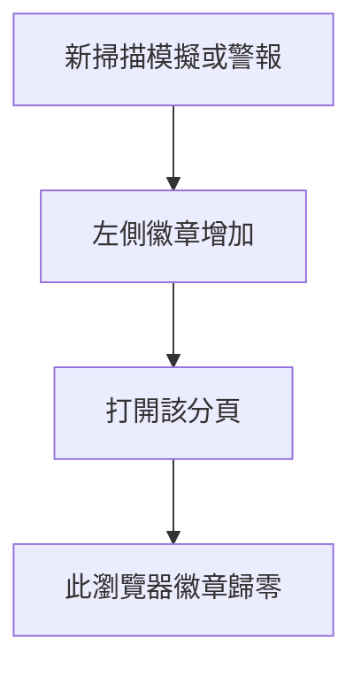

---

## 4. 各角色每天做什麼

### 風險負責人

1. 打開 [即時警報與追蹤](/admin/alerts)，找 BREACH／CRITICAL（展開卡片看 AI 包；詳情仍在 `/admin/ai-analyses/[id]` — 列表網址會轉址至此）。  
2. 打開雙 AI 包。若第二 AI 是 `PARTIAL` 或 `DISAGREE`，**先不要**核准不可逆控制。  
3. 在 [示範 Messenger](/admin/messenger) 升級、**結案（接受 AI）**，或 **排除** 誤報。  
4. Ops 已 Maker 確認控制後，到 [人工干預](/admin/interventions) 做 Checker。  
5. 版本驗收時跑 [UAT 清單](/admin/docs/uat)。

### 風險分析師

1. 處理即時警報與追蹤的 OPEN 佇列。  
2. 展開卡片／打開 AI 分析，讀摘要、證據、第二 AI 結論。  
3. 在 Messenger **顯示證據**，若不同意或有補充就打 **聊天**。  
4. 包就緒後升級給風險負責人。

### 營運主管／分析師

1. 從 Messenger **建議動作** 選封鎖／停交易／降槓桿／預先加寬／暫停跟單。  
2. 點 **雙重確認…** 再 **是，送至 Vantage 管理後台**。會得到管理參照與連結。  
3. 若執行緒說需要 Checker，等風險負責人在人工干預核准。

### AI 工程師

1. 維護 [AI 技能](/admin/skills)、[RAG](/admin/rag)，以及 [Monitor 2.0](/admin/monitor-2) 上的指標／偵測器登錄（`/admin/detectors` 會轉址至此）。  
2. 在 [AI 管理](/admin/ai-admin) 提案設定／模型／技能／RAG。不能核准自己的變更。  
3. 在 AI 管理參數或平台設定調整 `ai.second_opinion_severity`（預設 BREACH）。

### 系統管理員

1. 使用者、角色、**BU 與團隊**、分組設定。  
2. 檢視 [AI 存取安全](/admin/security/ai-access) — AI 絕不可碰的頁／功能／欄位（含 RAG 寫入封鎖／`propose_rag`）。  
3. 監看 [稽核日誌](/admin/audit)（CRMP／Vantage Markets 管理分頁＋回滾）與管理首頁的 **首頁脊柱** 階段工單計數（`/admin/spine` 會轉址至此）。

### 客服主管（`cs.lead@vantagemarkets.com`／`cs123`）

1. 打開 [CS／TR 台](/admin/cs-desk)。篩選 **CS**。盯待客戶與身分驗證。  
2. 追問仍為 WAITING 時**不要結案**。`cs.followup_cap` 封自動信件之後（預設 3）改由你本人跟進（對話會出現 SYSTEM 上限註記）。  
3. 確認公開入口 [`/cs`](/cs) 仍會進到這個收件匣。  
4. 成交投訴交給 TR。帳簿風險／詐欺升級風控（Messenger 脊柱）。核身留在 **CS 核身庫**（`ESC-CS-KYC`）。  
5. 到 [CS／TR 儀表板](/admin/cs-dashboard) 看 WAITING／上限／TR／風控計數。到 [CS／TR 日誌](/admin/cs-log) 看 CS_* 事件。到 [CS／TR 資料](/admin/cs-data) 看 BU、關卡與 `cs.*`。這**不是**每日績效或風險日誌。  
6. 簽核版本時過 [UAT-46](/admin/docs/uat)（三渠道）、[UAT-47](/admin/docs/uat)（等待迴圈）、[UAT-51](/admin/docs/uat)（儀表板＋日誌）與 [UAT-52](/admin/docs/uat)（配套資料）。

### 客服專員（`cs.agent@vantagemarkets.com`／`cs123`）

1. C1、表單、官方信箱的第一回應。在台面輸入框以 CS 回覆。  
2. 案件過短（「help me ???」）時讓 AI 寄 **寄信：請補充** 並等待。  
3. 客戶登不進去或要求核身時讓 AI 寄 **寄信：身分驗證**（護照＋UID 後四碼＋自拍）。不要只憑口頭「是我」做出金。  
4. 客戶回覆後（入口、同一個 C1 對話、或主旨含 `CSR-XXXX` 的信），AI 重新分流。已清楚的 FAQ 依技能／RAG 晶片作答。

### 交易主管／交易員（`tr.lead@…`／`tr.dealer@…`／`tr123`）

1. 把 CS／TR 收件匣篩成 **TR**。種子滑點／成交／MT4／MT5 案件會以已派 TR、技能 `SKILL-TR-EXECUTION` 進來。  
2. 依逐字稿還原成交 vs LP。CS 已收集 UID／票號／時間。  
3. 不要去值班 C1。若其實是 CS FAQ，退回。若是帳簿風險，**升級至風控**。

---

## 5. 主流程：警報 → AI → 聊天 → 結案

這是最常用的路。後面章節再講其他頁。

1. 偵測器執行或 Monitor 2.0 指標越線。  
2. **即時警報與追蹤**出現 **OPEN**（Monitor 2.0 的未結工單數會連到此頁）。  
3. 即時警報與追蹤產生 AI 包：劇本對得上就是 `SKILL_MATCH`，否則 `RAG_REASONING`。每次分析都會另開 **如何改進** 面板（補資料源、休眠指標健康、推理缺口、新技能型態、門檻 X→Y、人工回應時間），可用聊天機器人拉資料、補事實、挑戰推理、重產直到標記滿意。  
4. 嚴重度是 BREACH 或 CRITICAL 時，出現 **第二 AI** 面板（`AGREE`／`PARTIAL`／`DISAGREE`）。  
5. 在示範 Messenger 點 **同步警報**，讓這包變成聊天執行緒。  
6. **顯示證據** 把保險庫貼進對話。若要挑戰故事就聊天。  
7. **升級**、**排除**（誤報）或 **結案（接受 AI）**。  
8. 若要控制：選建議動作 → 雙重確認 → 必要時 Checker。  
9. 到 **稽核日誌** 與 **首頁脊柱**（階段工單計數）核對同一批事件。

**即時警報與追蹤上的示範捷徑**（localhost **分組 AI 管線**面板＋排序說明）：分析全部未結警報、模擬跟單違規（技能路徑）、模擬權益回撤（RAG 路徑）、模擬危急（第二 AI 挑戰）、補跑第二 AI 挑戰。`M2-*` 為可點 MonitorCode 晶片（提示 → Monitor 2.0）。

**決策規則：** `AGREE` 可依政策走劇本。`PARTIAL`／`DISAGREE` 代表 **需要人類** — 兩份 AI 都讀過之前，不要做不可逆控制。

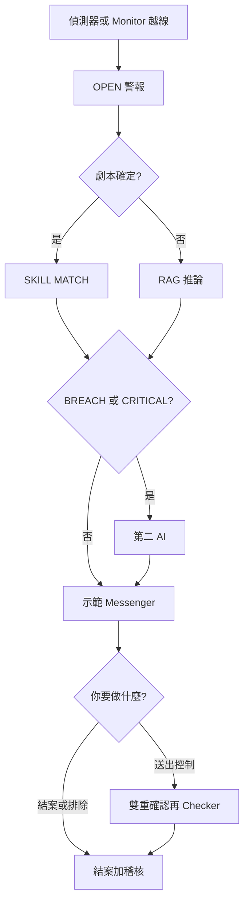

---

## 6. 總覽

### 6.1 管理首頁 — `/admin`

**這頁是什麼。** 登入後的落地頁。看後台現在有多忙。

**會看到什麼。**

- **demo platform owner** 負責人卡。整張卡開啟「以平台負責人登入」。  
- Lark 風格 Messenger 宣傳。整張卡開啟 Messenger 示範（卡上有永久 GitHub Pages 網址）。  
- **CS／TR 台**宣傳。整張卡開啟 `/admin/cs-desk`；卡上印客戶入口網址（`/cs`）。  
- 可點擊的數字卡：使用者、團隊（開 **BU 與團隊**）、資料來源、風險領域、未結警報、未結工單、Lark 頻道、升級路徑。每張卡跳到對應頁。  
- **跳至頁面** 磁磚：每日績效、市場情報、Monitor 2.0、即時警報與追蹤、AI 技能、知識樹、人工干預、Messenger、設定、使用手冊、PRD。  
- 最近警報。每一列開啟即時警報與追蹤中該筆警報。**查看全部** 列出全部。  
- **虛擬脊柱演練**按鈕：**虛擬警報**（單則）與 **虛擬警報組**（三則連動）。本機會走完 DETECT → AI（技能或 RAG）→ Messenger Maker／Checker → 升級 → 結案，並標出新卡片與脊柱。稽核 `DUMMY_SPINE_RUN` 與風險日誌留下紀錄。介面為繁中時，按鈕與儲存的英文文案會翻成中文。  
- **整合脊柱** 附 **階段工單計數**（Detect → … → Dashboard）。每一步開啟對應頁。**沒有**獨立脊柱日誌分頁 — `/admin/spine` 轉址至此。  
- 頁首捷徑：Messenger、使用手冊、每日績效。

**要點什麼。** 把卡片當地圖。未結警報不是零就先去那裡。

**怎樣算正常。** 數字與其他頁一致。卡片是連結，不是死磚。

---

## 7. 監控與風險

### 7.1 每日績效 — `/admin/dashboard`

**這頁是什麼。** 當日結束的 CFD 與加密風險畫面 — 脊柱最後一環。

**會看到什麼。** 報表日、CFD／加密的 WARN／BREACH 數，以及指標卡（數值、目標、備註、健康）。

**要點什麼。** **重新整理**（localhost）會從 `/api/dashboard` 重建即時指標。Pages 上是種子快照。

**怎樣算正常。** 兩個產品欄都在。狀態徽章可讀（HEALTHY／WARN／BREACH）。

### 7.2 風險日誌分析 — `/admin/risk-log`

**這頁是什麼。** 歷史帳：已關閉工單、什麼觸發、人處理多久、損失 vs 防損金額、漏洞集中在哪。

**會看到什麼。**

- 摘要磚：未結警報、損失 vs 防損 vs 曝險、平均確認／結案／人工分鐘、SLA 逾時、待決 vs 已決干預。  
- **歷史圖表（90 天）**（總覽／歷史圖表分頁）— 警報與未結帳本、損失 vs 防損、處理延遲。即時示範視窗之前的天數已回填，讓序列讀起來像完整一季。  
- 總覽上的**已關閉警報與工單** — 與即時警報與追蹤同一套追蹤卡片，但只在工單關閉後出現：即時狀態（工單已關閉）、AI 分析、AI／各 BU 動作紀錄，以及 AI 或業務單位 POC 核定的最終方案。  
- 依類別、依領域的表。  
- 漏洞標籤（反覆弱點）。  
- 時序紀錄（警報、工單、結果、美元）。

**要點什麼。** 先讀圖表，再展開已結卡片看完整包。篩選／掃表。未結工作仍在即時警報與追蹤。

**怎樣算正常。** 圖表跨約 90 天（不是單日尖峰）。已結卡片有工單已關閉、AI 報告、BU／AI 動作紀錄與核定方案。合計對得上。已結案件有處理時間。示範種子的漏洞標籤不是空的。

### 7.3 市場情報 — `/admin/market-intel`

**這頁是什麼。** 每五分鐘看新聞、社群、官方與交易所貼文，找出可能移動 LP 報價的訊息。發現餵給指標 `M2-MKT-INTEL` 與 Messenger 寄件匣（正式環境 Lark 群 `oc_market_intelligence`）。

**會看到什麼。** 四張摘要卡之後是**過去一小時**與**過去 24 小時**的頭條事件，以及 Vantage 主要 CFD 商品（外匯、金屬／能源、指數、加密）的**情緒氣壓計**。分頁：**發現**、**Messenger 寄件匣**、**來源**、**掃描紀錄**。卡片顯示產品與方向、地區國旗、影響（不是「違規」）、來源**文章網址**與時間戳。排程開／關。技能劇本連結。

**要點什麼。**

1. 若畫面閒置，先在平台設定打開 `market_intel.enabled`。  
2. 讀脈動卡（一小時／24 小時）與商品氣壓計。點頭條跳到該發現；點商品可依該商品篩選發現。  
3. 點 **立即掃描**。  
4. 讀新發現，再看出件匣，再看掃描紀錄。

**GitHub Pages：** 沒有 `/api`，所以 **立即掃描** 會跑**本機示範掃描**（與正式掃描同一批事件模板）。新卡片立刻出現，存在這個瀏覽器（`crmp_mi_demo_v1`）。真正 HTTP 抓取仍屬 `localhost:3000`。**不會**出現 405。

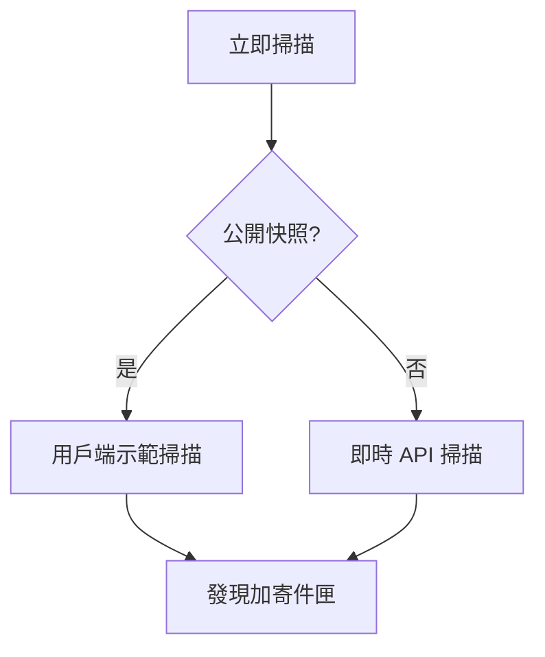

**怎樣算正常。** 掃描結束有筆數。發現、寄件匣、掃描紀錄都更新。即時警報與追蹤／市場情報未讀徽章可能加一。

### 7.4 Monitor 2.0 — `/admin/monitor-2`

**這頁是什麼。** 既有指標平台**與**偵測器登錄的整合中心。CRMP 不取代 Monitor 2.0，只從它同步。偵測器不再是獨立左側分頁。

**會看到什麼。**

- 上游面板：`monitor2.base_url`、偵測器已合併至此的說明，以及**警報／工單請至即時警報與追蹤**。  
- 有操作權時：**全部執行**（對每個啟用偵測器取樣；警告／越線自動拉警報並啟動 AI RCA）與 **立即同步（原型）**。  
- 一張**指標＋偵測器**表：名稱、`M2-*` MonitorCode、偵測器代碼／比較子、說明、領域、產品、可編輯警告／越線、採樣頻率、風險情境、組合（序列／同時）、狀態、上次刷新、未結工單數（連到依 monitor id 篩選的即時警報與追蹤）、以及 **暫停**（暫停的指標略過 AI）。  
- **近期執行** — 觀測值、嚴重度、連結的警報與分析。

舊的 `?tab=alerts`／`?tab=tickets` 深連結會轉到即時警報與追蹤。

**要點什麼。** 在 localhost 點 **全部執行** 或同步。暫停吵鬧的指標。點未結工單數或 `M2-*` 晶片。Pages 上當唯讀目錄（無即時 `/api`）。

**怎樣算正常。** 看得到 EQ／MRG／COPY 等指標與偵測器代碼。全部執行可產出 BREACH，並推高即時警報與追蹤／Monitor 2.0 徽章。暫停列顯示 IDLE、不開火。真實執行後首頁脊柱 DETECT → ALARM 會動。

### 7.5 偵測器網址 — `/admin/detectors`（轉址）

**僅供書籤。** `/admin/detectors` 會轉址到 [Monitor 2.0](/admin/monitor-2)。左側**沒有**偵測器列。取樣、門檻、暫停與近期執行都在 Monitor 2.0；未結警報在即時警報與追蹤。

### 7.6 即時警報與追蹤 — `/admin/alerts`

**這頁是什麼。** 營運佇列：現在仍未結的警報，加上**分組 AI 管線**控制。已關閉工單離開本頁，改在風險日誌分析。AI 分析列表網址（`/admin/ai-analyses`）會轉址至此；單筆證據包仍在 `/admin/ai-analyses/[id]`。

**會看到什麼。** 僅未結卡片，依 CRITICAL → BREACH → WARN、再依新到舊。每張：嚴重度、狀態、產品、領域、標題、說明、警報 id、`M2-*` MonitorCode（提示 → Monitor 2.0）、觀測值、工單 id、時間。展開可看 AI 根因、如何改進、第二 AI 結論、承辦、關卡、升級路徑與動作紀錄。localhost 另有五顆示範 AI 按鈕（分析未結／模擬技能／RAG／危急／補跑第二 AI）。

**要點什麼。** 有操作權時對 OPEN 點 **確認（Acknowledge）**。展開卡片或打開分析詳情看整包；控制與證據用 Messenger。點 **至風險日誌分析查看已關閉警報** 讀已結工單。進入本頁會清掉未讀徽章。

**怎樣算正常。** 只剩仍未結的項目。Ack 後狀態變 ACKNOWLEDGED。已結工作不會混在這個佇列。BREACH／CRITICAL 在有挑戰時顯示第二 AI 徽章。

### 7.7 風險領域 — `/admin/risk-domains`

**這頁是什麼。** CFD 與加密風險領域目錄 — 原有領域加上 **全公司系統性與傳染（P0）**、**第三方與供應商依賴（P3）**、**聲譽與客戶通訊（P3）**。每個領域拆成具體風險情境。

**會看到什麼。** 色標優先級（**P0** 玫紅、**P1** 橘、**P2** 琥珀、**P3** 石板灰）、代碼、產品覆蓋、負責／支援 BU、所屬 Monitor 2.0 指標晶片，以及可展開的情境：白話 **運作方式**、**參與者**、**影響**，加上主指標與相關 Monitor 2.0 連結。

**要點什麼。** 展開一則情境。點任何 `M2-*` 晶片跳到 Monitor 2.0 並錨定該指標。

**怎樣算正常。** 每個領域都有負責人。每則情境至少列出一個 Monitor 2.0 指標。產品覆蓋是 CFD、Crypto 或兩者。

---

## 8. AI 與知識

### 8.1 AI 分析 — 已合併到即時警報與追蹤（詳情 `/admin/ai-analyses/[id]`）

**這頁是什麼。** RCA 工作台已合併到**即時警報與追蹤**（`/admin/alerts`）。`/admin/ai-analyses` 會轉址過去 — **不是**左側分頁。單筆證據包仍在 `/admin/ai-analyses/[id]`。

**在即時警報與追蹤會看到什麼。** **分組 AI 管線控制**面板（含排序說明）與五顆可運作按鈕，下方是未結追蹤卡。`M2-*` 為 **MonitorCode** 晶片（提示／連到 Monitor 2.0）。展開卡片可看模式、信心、**第二 AI · 結論**、**如何改進**面板與動作紀錄。

**要點什麼（示範，localhost）。**

- 分析全部未結警報 — 確保每則未結警報都有 AI 包（快速；沿用既有）。  
- 模擬跟單違規 — 技能路徑＋第二 AI。  
- 模擬權益回撤 — 強制 RAG 路徑；WARN 通常略過第二 AI。  
- 模擬危急 — 保證金技能＋第二 AI。  
- 補跑第二 AI 挑戰 — 幫較舊的高嚴重度包補上挑戰列。

**怎樣算正常。** 五顆按鈕都會回傳狀態列（不會卡在 disabled）。每筆分析都有如何改進審查。BREACH／CRITICAL 有第二 AI 徽章。`PARTIAL`／`DISAGREE` 會設需要人類。

### 8.2 AI 管理 — `/admin/ai-admin`

**這頁是什麼。** AI 的治理，**不是**即時 RCA 清單。Maker 提案；**另一個人** Checker。

**分頁。**

| 分頁 | 你做什麼 |
|---|---|
| 總覽 | KPI，加上**一線**與**二線** AI 管理卡片（模型、信心閘、RAG top-K、挑戰者） |
| 參數 | 起草 `ai.*`／`ai.line1.*`／`ai.line2.*`。**提案**不會立刻套用 |
| Maker／Checker | 待決變更單在前。核准或駁回並寫備註。不能核准自己的 |
| 技能 | 提案新增／更新／停用劇本。核准後才套用 |
| RAG | 經 **`propose_rag`** 提案新增／更新／退役（AI 不可直接寫語料） |
| 訓練 | 排隊重新校正（會變成 TRAINING 變更單） |
| 歷史 | 準確率快照（約 14 天） |

標題徽章顯示你是 Maker、Checker 或兩者。風險負責人可以兩者都是，但**自己核准自己仍然被擋**。

**怎樣算正常。** 提案的技能在另一人核准前維持 PENDING。核准後出現在 AI 技能。即時桌上的參數在 APPROVED 之前不會動。

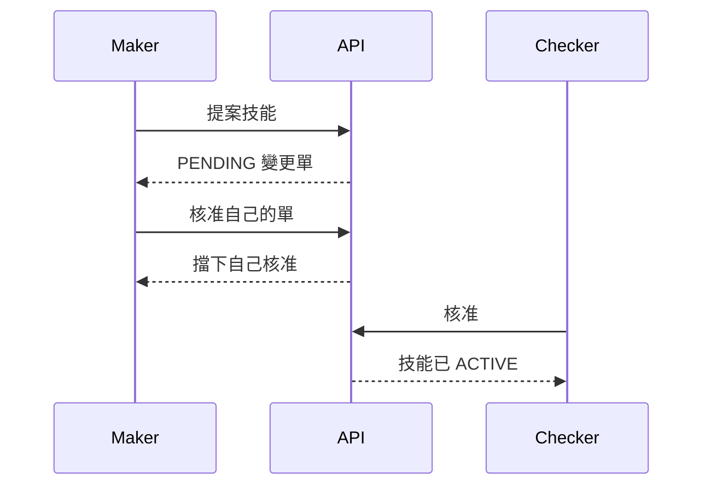

### 8.3 AI 技能 — `/admin/skills`

**這頁是什麼。** SKILL.md 風格劇本：何時用、何時不用、前置檢查、步驟、證據、停止條件、成功標準、門檻與理由、故障區域、升級、BU 矯正、過往案例。

**會看到什麼。** 搜尋框。兩個分頁：**單指標技能** 與 **連結時間鏈**（多指標鏈）。卡片保持精簡（代碼、名稱、產品、領域、自動 vs 人工）。

**要點什麼。** **進入** 打開 `/admin/skills/{code}` — 完整劇本頁（不是小卡片）。從那裡可回技能、知識樹、AI 分析、風險日誌。CS／TR 台晶片會跳到 `SKILL-CS-CLARIFY`、`SKILL-CS-ID-VERIFY`、`SKILL-CS-ACCOUNT-FAQ`、`SKILL-TR-EXECUTION`、`SKILL-CS-ESCALATE-RISK`。連結時間鏈 **CHAIN-CS-TR-INTAKE** 就是進件路徑。

**怎樣算正常。** 種子技能的進入不會 404（含五份 CS／TR 劇本）。連結時間鏈看得到順序、原因、連結技能。每個 CS／TR 技能綁一條路徑：`ESC-CS-24-7`、`ESC-TR-DEAL` 或 `ESC-CS-RISK`。

### 8.4 知識樹 — `/admin/knowledge-tree`

**這頁是什麼。** 知識怎麼掛在一起的圖：CRMP → 風險領域（含 **CS_SERVICE** 與 **TRADING_EXEC**）→ 技能劇本，側幹是連結時間鏈與 **RAG 文件葉**（深連結 `/admin/rag?doc=`）。CS／TR 進件技能（`SKILL-CS-CLARIFY`、`SKILL-CS-ID-VERIFY`、`SKILL-CS-ACCOUNT-FAQ`、`SKILL-TR-EXECUTION`、`SKILL-CS-ESCALATE-RISK`）掛在這兩條樹幹，RAG 葉為 `cs-*`。

**會看到什麼。**

- 預設 **樹狀圖**，或 **大綱**。  
- 產品篩選：全部／CFD／Crypto。  
- 樹幹切換：風險領域、連結時間鏈、RAG 語料。  
- 點**領域**展開技能。點**技能**填入檢視器。  
- **進入**／**進入完整劇本** 打開 SKILL.md 頁。  
- **RAG 文件葉**打開該文件的 RAG 知識庫。文件依標籤與標題匹配；MonitorCode 連到 Monitor 2.0。

領域排成兩列，標籤保持可讀。不是十個小盒子橫向擠成一條。

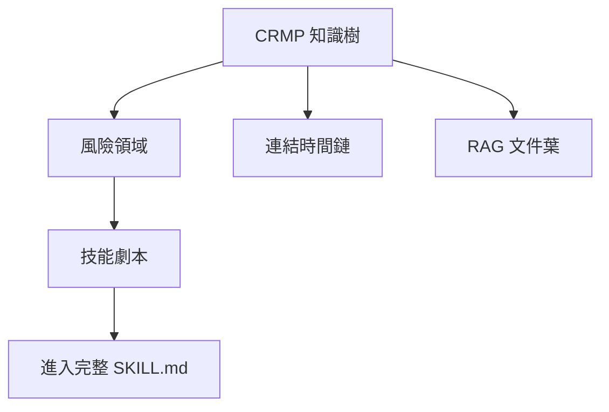

**怎樣算正常。** LP_HEDGE 會展開對沖技能。**CS_SERVICE** 展開 CS 24/7 劇本；**TRADING_EXEC** 展開 TR 成交。RAG 幹依分類群組文件（含 CS_POLICY）。進入會導頁，不是失效的 SVG 連結。

### 8.5 RAG 知識庫 — `/admin/rag`

**這頁是什麼。** 技能不確定時用的內部語料：政策、產品、實體、平台。

**會看到什麼。** 依分類篩選、搜尋框、文件卡（鍵、標題、標籤、狀態、摘要）。**檢索**框可試查詢（top-K 命中與分數）。**AI 寫入封鎖／人工閘道**橫幅：AI 不能編輯的頁與語料欄位會升級給人類 — 具 `rag.manage` 的人類可寫，或經 AI Admin **`propose_rag`** 走 Maker-Checker。

**要點什麼。** 用「copy trading concentration gold margin」這類句子檢索，確認命中相關。正式新增應走 `propose_rag`；本頁是語料瀏覽器（授權人類可寫）。

**怎樣算正常。** 檢索回傳排序命中。退役文件不再出現在搜尋。AI 服務角色不可 POST／PATCH `/api/rag`；被封鎖的編輯會以人工閘道呈現。

### 8.6 首頁脊柱 — `/admin`（`/admin/spine` 轉址）

**這頁是什麼。** 端到端膠帶改掛在**管理首頁**整合脊柱，並顯示**階段工單計數**：DETECT → ALARM → AI_RCA → SKILL_EXECUTE → HUMAN_INTERVENTION → RESOLVED → DASHBOARD。專屬**脊柱日誌**左側分頁已移除。

**會看到什麼。** 各階段計數（未結＋24h）與最新事件標題；每一步連結到對應頁。

**要點什麼。** 唯讀導覽。在 Monitor 2.0 **全部執行**或結案 Messenger 後，在 localhost 核對階段計數變動。

**怎樣算正常。** COPY 越線示範會推動 Detect／Alarm／AI RCA 計數。快樂路徑沒有無聲缺口。

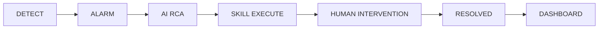

---

## 9. 應變

### 9.1 人工干預 — `/admin/interventions`

**這頁是什麼。** 執行期動作的 Checker 桌（不是 AI 管理設定）。Maker 已要求控制；你核准或駁回。

**會看到什麼。** 卡片：動作代碼、狀態、分析、指標、警報標題／嚴重度、技能步驟、請求時間，以及樣本上的 **操作者信箱**。待決項有備註框與 **核准**、**駁回**。

**要點什麼。** 寫一句理由。核准即上線（原型記錄決策）。駁回即停止。兩者都寫脊柱與稽核。

**怎樣算正常。** 待決數與首頁／AI 管理 KPI 一致。已決列看得出誰、何時。

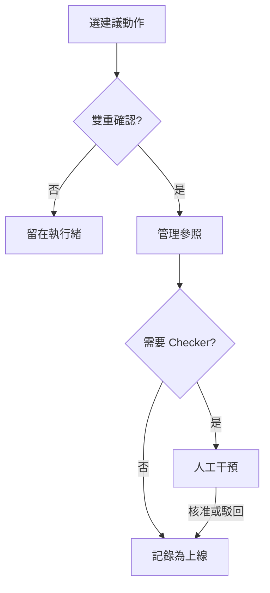

### 9.2 示範 Messenger — `/admin/messenger`

**這頁是什麼。** 應用內 Lark 風格收件匣。正式環境會用真 Lark；本頁證明按鈕與稽核軌跡。

**版面。** 桌面：執行緒列表 + **鳥瞰 POC 聊天窗**並排。手機：列表 → 點執行緒 → 路徑晶片 → 一次一個承辦窗。升級路徑每一跳（一線台 → 二線 → 風險負責人 → 高階）都是獨立 Lark 窗，掛具名承辦。點**升級**會把案件轉進下一窗，方便看轉遞。

**工具列。** **同步警報** 把新 Monitor 警報拉成執行緒。

**打開執行緒後可以：**

| 按鈕 | 做什麼 |
|---|---|
| **顯示證據** | 把證據庫與第二 AI 摘要貼進聊天 |
| **聊天**（輸入 + 傳送） | 挑戰 AI 或補充事實。不同意會標 `needs_human` |
| **升級** | 沿路徑 Primary → Secondary → 風險負責人 → 高階 |
| **排除** | 誤報。關閉執行緒與警報 |
| **結案（接受 AI）** | 接受分析並關閉工單 |
| **建議動作** | 封鎖使用者、停交易、降最高槓桿、預先加寬點差、暫停跟單加入 |
| **雙重確認…** 再 **是，送至 Vantage 管理後台** | 產生管理參照 + 連結（常是人工干預） |
| **Checker 核准（上線）** | 系統說需要 Checker 時 |
| **在管理後台開啟** | 跳到對應管理頁（Pages 上必須留在 `/PRD/crmp-plus/` 底下） |

**怎樣算正常。** 同步會產生執行緒。證據貼的是保險庫，不是空白泡泡。升級會前進路徑。排除／結案會改狀態。雙重確認產出 admin_ref。在 GitHub Pages「開啟管理後台」不會 404。

永久網址：[https://hxyan2020.github.io/PRD/crmp-plus/admin/messenger/](https://hxyan2020.github.io/PRD/crmp-plus/admin/messenger/)

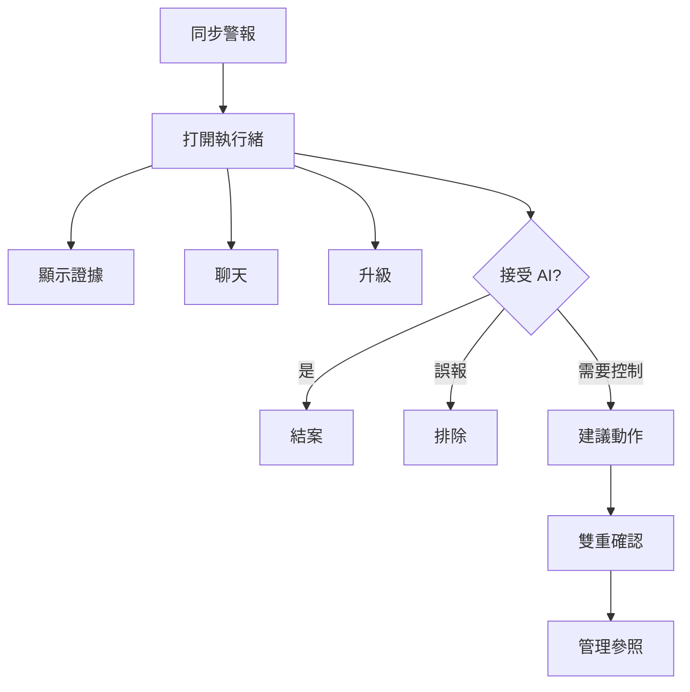

### 9.3 CS／TR 台 — `/admin/cs-desk`

**這頁是什麼。** 24/7 客服與交易支援 — CRMP Plus 的客戶大門。三個公開渠道經同一個 webhook（`POST /api/cs/intake`，標頭 `x-cs-intake-token: demo-c1`）即時進件：

| 渠道 | 代碼 | 誰送來 |
|---|---|---|
| 平台 **C1 即時聊天** | `C1_LIVE_CHAT` | C1 視窗／`/cs` 聊天分頁／C1 webhook |
| 網站／App **提交表單** | `WEB_FORM` | `/cs` 表單分頁／網站聯絡表單 |
| **官方信箱**（support@、complaints@） | `OFFICIAL_EMAIL` | `/cs` 信箱分頁／信箱閘道 |

客戶走公開入口 **[`/cs`](/cs)**（永久網址：[https://hxyan2020.github.io/PRD/crmp-plus/cs/](https://hxyan2020.github.io/PRD/crmp-plus/cs/)）。值班在這一頁看收件匣。原 CRMP 管理後台**沒有** CS／TR 台 — 那個快照保持凍結。

**會看到什麼。** 收件匣篩選全部／CS／TR。每則請求顯示渠道、台面、AI 清晰度（清楚／不清楚／需核身）、**專用技能晶片**與狀態（未結、待客戶、身分驗證、已派 TR、已升級風控、已結案）。晶片 **進入** `/admin/skills/{code}`。對話混合客戶聊天、AI 分流註記與**自動追問信**。左側此列未讀徽章會在新進件時跳動。

#### 9.3.1 客戶入口 — `/cs`

**誰用。** 客戶，不是值班。不必登入。語言切換 EN／繁中（同一個 `crmp_ui_lang` cookie）。

**三個分頁**

1. **C1 即時聊天** — 輸入訊息。同一個瀏覽器後續訊息留在同一個 C1 `channel_ref`（送出鈕下方會顯示）。  
2. **提交表單** — 姓名、email、選填 UID、主旨、內文。送出 `channel=WEB_FORM`。  
3. **官方信箱** — 同樣欄位，加上選填 **回覆對象／案件號**。主旨或該欄填 `CSR-XXXX` 即可續辦等待中的自動信件。

**送出之後。** 結果卡顯示公開案件號（`CSR-XXXX`）、狀態、技能；若 AI 不清楚或需核身，會標出正在 WAITING 的自動官方信件。GitHub Pages 沒有即時 `/api`；分頁仍會顯示，並說明即時 POST 請用 `localhost:3000`。

**怎樣算正常。** 聊天分頁打短句「help me ???」會得到待客戶，以及黃色「自動官方信件正在等你回覆」。同一個分頁再聊、或信箱分頁主旨帶該 `CSR-XXXX`，會續辦而不是另開一案。

#### 9.3.2 回覆怎麼對上同一案件

C1／表單／信箱進件若對得上未結案件就**續辦**，順序：

1. `request_id`（`CSR-XXXX`）  
2. `In-Reply-To`（訊息 id、channel_ref 或 CSR-XXXX）  
3. 同一個尚未結案的 C1／表單／信箱 `channel_ref`  
4. 主旨中的 `CSR-[0-9A-F]{6}`（自動信件本來就會印「案件 CSR-A1B2C3」）

若該案仍有 WAITING 追問，視為**客戶回覆**：WAITING 變 REPLIED，AI 重新分流。已結案的同一 C1 工作階段會**另開**新案。

`GET /api/cs/intake` 回傳連接器目錄。`GET /api/cs/intake?request_id=CSR-XXXX` 只回公開狀態（不含 email 或姓名）。

#### 9.3.3 AI 何時寄信並等待

AI 若無法判斷客戶要什麼、或需要 KYC／核身，**不可以臆測**。它會寄官方 `EMAIL_OUT`、維持案件開啟、並等待。

| 清晰度 | 狀態 | 自動信件要什麼 | 技能 |
|---|---|---|---|
| **不清楚** — 短於約 48 字，或「help me／???／不清楚」 | 待客戶 | 發生什麼、何時（時區）、UID、商品／訂單／截圖、希望我們做什麼 | `SKILL-CS-CLARIFY` |
| **需核身** — KYC／護照／核對帳戶／登不進去／核身 | 身分驗證 | 護照或證件照片、UID 後四碼、與持有人一致的自拍 | `SKILL-CS-ID-VERIFY` |

**直到客戶回覆。** 任何追問仍為 WAITING 時**禁止結案**。每次過短回覆都會再問。上限 **3** 封自動信件，之後 SYSTEM 註記請 CS Lead 人工跟進 — 不再自動寄。

**客戶怎麼回（任一方式都會關閉 WAITING）：**

- 同一個 C1 聊天分頁（`channel_ref`）  
- 官方信箱分頁或真實信箱，主旨／In-Reply-To 帶 `CSR-XXXX`  
- 台面按鈕 **模擬客戶回信**（僅示範）

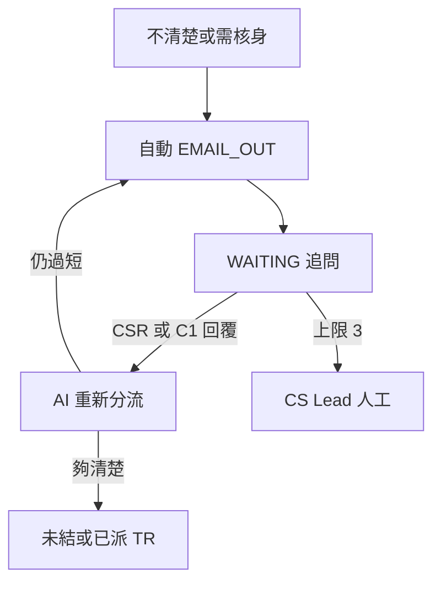

#### 9.3.4 專用 SKILL.md 劇本

分流會蓋上 `skill_code`。點晶片看何時使用／停止／成功。知識樹樹幹 **CS_SERVICE** 與 **TRADING_EXEC**；連結時間鏈 `CHAIN-CS-TR-INTAKE`；RAG 葉 `cs-24-7-intake`、`cs-id-verify-policy`、`cs-swap-faq`、`tr-dealing-handoff`、`cs-escalate-to-risk`、`cs-skill-playbooks`。

| 技能 | 何時出現 | 台面／狀態 | 升級路徑 |
|---|---|---|---|
| `SKILL-CS-CLARIFY` | 過短「help me ???」 | CS · 待客戶 | `ESC-CS-24-7` |
| `SKILL-CS-ID-VERIFY` | KYC／登不進去 | CS · 身分驗證 | `ESC-CS-24-7` |
| `SKILL-CS-ACCOUNT-FAQ` | 清楚的隔夜利息／時段／UID | CS · 未結 | `ESC-CS-24-7` |
| `SKILL-TR-EXECUTION` | 成交／滑點／MT4／MT5 | TR · 已派 TR | `ESC-TR-DEAL` |
| `SKILL-CS-ESCALATE-RISK` | 帳簿風險／詐欺／錢包 | 已升級風控 → Messenger | `ESC-CS-RISK` |

CS **不**啟動交易管制。TR **不**值班 C1。帳簿風險離開此台，進入示範 Messenger／人工干預。

#### 9.3.5 要點什麼（值班）

| 按鈕 | 做什麼 |
|---|---|
| **AI 分流** | 重跑路由（CS vs TR、類別、清晰度）並蓋上專用 SKILL.md |
| **寄信：請補充** | AI 寄官方信索取發生什麼／UID／截圖；狀態待客戶 |
| **寄信：身分驗證** | AI 索取護照／證件＋UID 後四碼＋自拍；狀態身分驗證 |
| **模擬客戶回信** | 示範用，等同真實信箱／入口回覆；AI 重新分流 |
| **指派至 TR** | 把成交投訴交給 TR 成交支援（`SKILL-TR-EXECUTION`） |
| **升級至風控** | 離開 CS／TR；技能 `SKILL-CS-ESCALATE-RISK`；Messenger 脊柱 |
| **結案** | 關閉 — 追問仍為 WAITING 時會被擋 |
| **模擬 C1／表單／信件** | 走與入口相同的進件 API |
| **開啟客戶進件入口** | `/cs` — 真實使用者會看到的三個公開連接器 |
| 台面輸入框＋送出 | 以 CS／TR 寫入逐字稿 |

操作需要 `cs.operate`（客服主管、客服專員、超級管理員…）。`cs.read`／`lark.read` 可觀看。稽核（CRMP 分頁）寫入 `CS_INTAKE`、`CS_FOLLOWUP_EMAIL`、`CS_CLIENT_REPLY`、`CS_INTAKE_CONTINUE`、`CS_ASSIGN_TR`、`CS_ESCALATE_RISK`、`CS_RESOLVE`。

#### 9.3.6 種子案件 — 怎樣算正常

| 種子 | 渠道 | 技能 | 應看到 |
|---|---|---|---|
| Liam Okafor — XAUUSD 隔夜利息 | C1 | `SKILL-CS-ACCOUNT-FAQ` | 未結、清楚 |
| Sofia Mendes — 「help me something wrong ???」 | C1 | `SKILL-CS-CLARIFY` | 待客戶＋WAITING 自動信件 |
| Chen Wei — MT5 EURUSD 滑點 | 表單 | `SKILL-TR-EXECUTION` | 已派 TR |
| Priya Shah — 核對帳戶、無法出金 | 官方信箱 | `SKILL-CS-ID-VERIFY` | 身分驗證＋WAITING 核身包 |

交易關鍵字到 TR。技能晶片打開劇本。繁中標籤齊全。UAT-46（三渠道＋`/cs`）、UAT-47（等待迴圈）、UAT-48（TR／風控）、UAT-50（技能＋樹）、UAT-51（儀表板＋日誌）、UAT-52（BU／關卡／`cs.*`）。

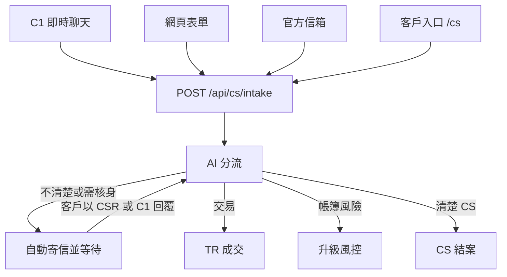

#### 9.3.7 CS／TR 儀表板 — `/admin/cs-dashboard`

**這頁是什麼。** CS／TR 量看板。**不是**[每日績效](/admin/dashboard)（CFD／加密日終），也**不是**[風險日誌分析](/admin/risk-log)（已關閉 Monitor 工單）。

**會看到什麼。** 總數、未結 vs 已結、WAITING 自動信、上限 3、TR／已派、已升級風控、身分驗證、待客戶、CS vs TR 台。依渠道、狀態、技能、台面、AI 清晰度長條。等待清單與最近更新請求。

**要點什麼。** 點 `CSR-XXXX` 跳到台面。開 CS／TR 日誌看 CS_* 時間軸。本機 `GET /api/cs?view=dashboard` 回同一包。

**怎樣算正常。** 種子收件匣：至少一列 WAITING（Sofia／Priya）、TR 桶（Chen Wei 滑點）、C1＋表單＋信箱渠道、SKILL-CS-*／SKILL-TR-* 長條。繁中標籤齊全。

#### 9.3.8 CS／TR 日誌 — `/admin/cs-log`

**這頁是什麼。** 這扇門的 CS_* 故事：進件、續辦、追問信、客戶回覆、專員回覆、指派 TR、升級風控、結案 — 加上已結案件包。通用[稽核日誌](/admin/audit)仍有 CRMP／Vantage 分頁；風險日誌仍放 Monitor 結案。

**會看到什麼。** 每個 `CS_*` 動作篩選晶片、搜尋框（操作者／CSR-XXXX）、時間軸、已結包表。

**要點什麼。** 篩 `CS_FOLLOWUP_EMAIL` 看等待迴圈。清楚 FAQ 結案後篩 `CS_RESOLVE`。從案件號開台面。

**怎樣算正常。** 種子進件寫 `CS_INTAKE`（常伴隨 `CS_FOLLOWUP_EMAIL`）。結清一則 FAQ 會在**本頁**加 `CS_RESOLVE` 與一包，**不會**進風險日誌。

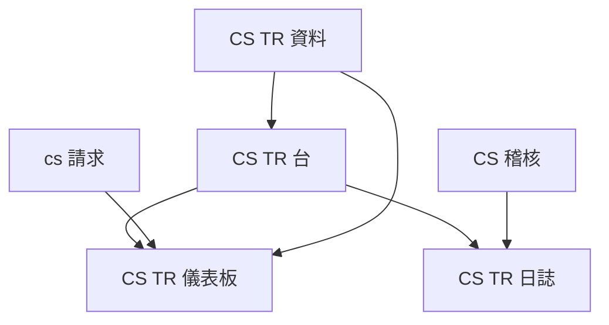

#### 9.3.9 CS／TR 資料 — `/admin/cs-data`

**這頁是什麼。** 台面、儀表板與日誌已在讀的即時營運契約：客服與交易 BU、嵌套團隊、具名 POC、四條升級關卡、`cs.*` 參數、核身庫與成交帶來源。永久網址：[https://hxyan2020.github.io/PRD/crmp-plus/admin/cs-data/](https://hxyan2020.github.io/PRD/crmp-plus/admin/cs-data/)。請在 [BU 與團隊](/admin/departments)、[升級路徑](/admin/escalation)、[平台設定](/admin/settings#settings-cs)、[資料來源](/admin/data-sources) 與 [Lark](/admin/lark) 編輯紀錄 — 本頁是讀出。

**會看到什麼。** 追問上限、等待／核身／TR／風控 SLA、進件 token、support@ 與 complaints@。兩個 BU。團隊 **CS 24/7 台**、**CS 核身庫**、**TR 成交支援**，含值班與 POC。關卡 `ESC-CS-24-7`（釐清／FAQ）、`ESC-CS-KYC`（核身）、`ESC-TR-DEAL`（成交）、`ESC-CS-RISK`（帳簿風險）。種子 C1／表單／信箱，加上核身庫與 MT4／MT5 成交帶。Lark 頻道 `oc_cs_c1`、`oc_cs_kyc`、`oc_tr_dealing`。

**要點什麼。** 跳到組織／關卡／`cs.*`／來源／Lark／台面。本機 `GET /api/cs?view=data` 回同一包。

**怎樣算正常。** CS 核身庫真的存在（不是只寫在 BU 卡片上）。`SKILL-CS-ID-VERIFY` 綁 `ESC-CS-KYC`。本頁上限與平台設定 `cs.followup_cap`、儀表板一致。證件圖不是資料來源 — 核身庫只有狀態旗標。繁中標籤齊全。

### 9.4 Lark 整合 — `/admin/lark`

**這頁是什麼。** 依嚴重度通知、值班叫應、雙人核准 ping 的頻道登錄。原型 Webhook 為模擬。

**會看到什麼。** 頻道清單（名稱、chat id、用途、啟用）。Lark 相關設定（`lark.*`）。

**要點什麼。** 有管理權可啟用／停用頻道。localhost 可送模擬通知。Pages 上當目錄。

**怎樣算正常。** 市場情報、風險、AI 實驗室頻道存在。停用頻道不會被升級路徑使用。

### 9.5 升級路徑 — `/admin/escalation`

**這頁是什麼。** 路徑由**維度**定義（嚴重度、涉入團隊、風險情境、待處理時間、是否需人工干預），各因子有可編輯**係數**。示範 Messenger **升級** 跟這張地圖走。每個警報一定有路徑：精確領域＋嚴重度 → 領域萬用 → **ESC-DEFAULT**。每個技能綁定**一條**路徑代碼；未綁定者回落 ESC-DEFAULT。**已移除獨立「路徑」名稱欄** — 以路徑代碼＋維度識別。

**會看到什麼。** 路徑代碼（含 `ESC-DEFAULT`）、維度欄位、係數編輯、團隊、頻道、SLA、預設旗標、啟用。

**要點什麼。** 有管理權可在 localhost 新增／編輯／停用。編輯維度係數。確認兜底預設存在。在技能頁確認每個劇本只綁一條路徑。

**怎樣算正常。** CRITICAL 的 SLA 比 WARN 緊。未匹配事件仍經 ESC-DEFAULT 落地。技能頁沒有自由文字「路徑」欄 — 只有綁定的路徑代碼。CS／TR 劇本綁 `ESC-CS-24-7`（釐清／FAQ）、`ESC-CS-KYC`（核身）、`ESC-TR-DEAL`（成交）、`ESC-CS-RISK`（帳簿風險升級）。在此頁、[CS／TR 資料](/admin/cs-data) 與技能晶片確認這四條存在。

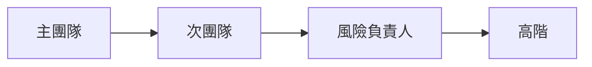

---

## 10. 組織

### 10.1 BU 與團隊 — `/admin/departments`（`/admin/teams` 轉址至此）

**合併中心。** Risk／Ops／AI／System、**客服（CS）** 與 **交易（TR）** BU 與嵌套值班團隊。展開 CS 看 **CS 24/7 台**與 **CS 核身庫**；展開 TR 看 **TR 成交支援**。每個 BU 顯示任務／擁有／負責／協作／範圍外／升級至，以及團隊任務與輪值（授權後可編輯）。左側不再有獨立「團隊」分頁。同一名冊摘要在 [CS／TR 資料](/admin/cs-data)。

### 10.2 角色與權限 — `/admin/roles`（可編輯）

**可編輯** RBAC 矩陣（`/admin/roles`；API：`GET/POST /api/roles`）。每個角色顯示名稱、說明、BU、權限晶片（`monitor.read`、`ai.approve`、`settings.manage`…），以及擁有／日常／不做／升級至。超級管理員有 `*`。有 `users.manage` 可更新角色；AI 執行者禁止寫入。用這頁理解某個角色為什麼少一顆按鈕。

### 10.3 使用者 — `/admin/users`

操作員與示範角色目錄，含 **demo platform owner**。欄位：姓名、email、角色、部門、團隊、狀態、上次登入。

有 `users.manage`（localhost）可 **新增使用者**（姓名、email、密碼、角色、部門、團隊）並切換 ACTIVE／DISABLED。Pages 上新增多半是示範空操作或僅本機瀏覽器。

**怎樣算正常。** demo platform owner 以平台負責人存在。停用使用者在 localhost API 不能當即時 Maker／Checker。

---

## 11. 平台

### 11.1 資料來源 — `/admin/data-sources`

內部平台與外部驗證來源登錄（分類、名稱、類型、狀態）。localhost 有 `sources.manage` 可管理。這是 AI 與 Monitor 2.0 偵測器在證據裡可以點名的目錄。CS 連接器列在這裡：**C1 Live Chat Gateway**、**Website CS submission form**、**Official support mailbox**、具名 **support@**／**complaints@**、**CS 核身庫**（僅狀態旗標）與 **MT4／MT5 成交帶**（TR 擁有）。

### 11.2 AI 存取安全 — `/admin/security/ai-access`

**僅限人類** 清單。AI 服務帳號絕不可取得這些頁、功能、欄位或資料（身分寫入、祕密、雙人核准、LP／錢包執行、角色寫入、session cookie）。

**會看到什麼。** 統計、黑名單（目標、理由、嚴重度）、允許的 AI 能力、禁止的權限代碼。

**怎樣算正常。** 核准路徑、使用者／角色寫入、交易執行都在黑名單。允許清單很窄（讀證據、起草 RCA、檢索 RAG）。

### 11.3 稽核日誌 — `/admin/audit`

兩個分頁：

| 分頁 | 記錄內容 |
|---|---|
| **CRMP 日誌** | 本 CRMP 管理介面內的所有變更 — 警報、AI、技能、升級、干預、Messenger、**CS／TR 進件**（`CS_INTAKE`、`CS_FOLLOWUP_EMAIL`、`CS_CLIENT_REPLY`、`CS_INTAKE_CONTINUE`、`CS_ASSIGN_TR`、`CS_ESCALATE_RISK`、`CS_RESOLVE`） |
| **Vantage Markets 管理日誌** | 其他管理頁面的變更 — 限制使用者權限、拉取交易資料、觸發 Lark 訊息、接收 BU POC 風險事件回應、設定／組織／RAG |

每列：時間、執行者、動作、實體、明細。兩個分頁皆有**回滾**按鈕 — 有變更前快照時可還原（`POST /api/audit/rollback`）。

### 11.4 平台設定 — `/admin/settings`

分組旗標（不是一大本按字母排）：

| 分組 | 例如這些鍵 |
|---|---|
| 平台身分 | `platform.*`、`products.*` |
| Monitor 2.0 | `monitor2.*` |
| AI 分析 | `ai.*`（RCA、信心、第二意見嚴重度、Maker／Checker） |
| 市場情報 | `market_intel.*`（啟用、間隔、Lark chat） |
| Messenger／Lark | `lark.*` |
| 升級與 SLA | `escalation.*`、`detectors.*` |
| CS／TR 營運 | `cs.*`（追問上限、等待／核身／TR／風控 SLA、進件 token、信箱、Lark 頻道） |

改一個值再 **儲存**。localhost 寫入 SQLite。GitHub Pages 只存在這個瀏覽器，並會這樣說明。

---

## 12. 文件（左側選單）

以下都可像其餘後台一樣切 **EN／繁中**。

| 頁 | 路徑 | 這是什麼 |
|---|---|---|
| 使用手冊 | `/admin/docs/user-guide` | 本手冊 |
| PRD | `/admin/docs/prd` | 我們在做什麼、為什麼、怎麼算過關 |
| TSD | `/admin/docs/tsd` | 怎麼做的（架構、API、資料模型） |
| UAT 清單 | `/admin/docs/uat` | 互動式 51 案簽核（UAT-01 … UAT-52，跳過 UAT-45）：為什麼、步驟、通過、證據、畫面覆蓋。**CS／TR 目錄 v2.6：** UAT-25 目錄、UAT-46 渠道＋`/cs`、UAT-47 等待迴圈、UAT-48 TR／風控、UAT-50 技能＋樹、UAT-51 儀表板＋日誌、UAT-52 BU／關卡／`cs.*`，另有支援案 UAT-17／22／27–29／36–40 |
| 生態導入評估 | `/admin/docs/ecosystem` | 真要導入的人力、預算帶、階段、風險 |
| 改進路線圖 | `/admin/docs/roadmap` | RM-01…15 卡片：今日／要做／完成標準／不做風險 |
| 開放議題 | `/admin/docs/open-issues` | 計畫清單：ETA、負責 BU、依賴（暫定至 2027） |
| 進度追蹤 | `/admin/docs/progress` | 互動看板：X＝議題、Y＝時間軸現在→2027 年底 |
| 網址目錄 | `/admin/docs/urls` | 每個管理頁、API、資料表，加上公開 Pages 網址。**CS／TR** 區段：`/cs` 入口、台面、儀表板、日誌、資料、五本 SKILL.md、RAG 葉、POST `/api/cs/intake`、`GET /api/cs?view=data`、`cs_*` 表 |

UAT：依序走案例。不要跳過 Critical 前置。在看板上勾 Pass／Fail；覆蓋晶片顯示每案打到哪些畫面。

---

## 13. 每次都要做的安全習慣

1. 每個版本打開一次 AI 存取安全，確認黑名單仍是「僅限人類」。  
2. 正式 AI 服務帳號絕不要拿到那些權限。  
3. 把 Messenger **排除** 與 **結案** 當真正決策 — 會被稽核。  
4. BREACH／CRITICAL 時，不可逆控制前主 AI 與第二 AI 都要留在畫面上。  
5. 控制之後，用同一組 id 核對 **稽核日誌** 與 **首頁脊柱**。  
6. AI 管理與指定控制的 Maker 與 Checker 必須是**兩個人**。  
7. CS／TR：追問仍為 WAITING 時不可結案；不可只憑口頭「是我」跳過核身；自動信件上限為 `cs.followup_cap`（預設 3 封），其後由 CS Lead 人工。  
8. CS 不啟動交易管制。TR 不值班 C1。帳簿風險經 **升級至風控** 離開此台。

---

## 14. 左側每一頁速查

| 分組 | 頁 | 來這裡是為了… |
|---|---|---|
| 總覽 | 管理首頁 | 看數字；虛擬脊柱按鈕；首頁脊柱階段工單計數；點每一張卡與警報列 |
| 監控與風險 | 每日績效 | 當日 CFD＋加密指標 |
| 監控與風險 | Monitor 2.0 | 統一指標＋偵測器登錄；全部執行／同步／暫停；近期執行；M2-* 深連結（警報 → 即時警報與追蹤） |
| 監控與風險 | 即時警報與追蹤 | 確認未結佇列；分組 AI 管線；MonitorCode；AI 分析列表轉址至此 |
| 監控與風險 | 市場情報 | 掃描新聞／社群；讀發現與寄件匣 |
| 監控與風險 | 風險日誌分析 | 90 天圖、已關閉包、損失 vs 防損 |
| 監控與風險 | 風險領域 | P0–P3 情境掛 Monitor 2.0 |
| AI 與知識 | AI 技能 | 瀏覽劇本；進入完整 SKILL.md；一條升級綁定 |
| AI 與知識 | 知識樹 | 領域（含 CS_SERVICE／TRADING_EXEC）、技能、RAG 文件葉＋深連結 |
| AI 與知識 | RAG 知識庫 | 搜尋／檢索；AI 寫入封鎖／人工閘道 — `propose_rag` |
| AI 與知識 | AI 管理 | 一線／二線卡片；提案／核准 |
| 應變 | 示範 Messenger | 證據、聊天、升級、排除、結案、控制 |
| 應變 | CS／TR 台 | C1／表單／信箱經 `/cs`＋`/api/cs/intake`；CSR-XXXX 回覆關閉 WAITING；專用 SKILL.md 晶片；AI 追問直到回覆；TR／風控 |
| 應變 | CS／TR 儀表板 | CS／TR 指標 — 不是每日績效 |
| 應變 | CS／TR 日誌 | CS_* 時間軸＋已結包 — 不是風險日誌 |
| 應變 | CS／TR 資料 | 台面已讀的 BU／團隊／關卡／`cs.*` 契約 |
| 應變 | 人工干預 | Checker；樣本顯示操作者信箱 |
| 應變 | 升級路徑 | 維度 × 係數；ESC-DEFAULT；技能綁一條；無「路徑」名稱欄 |
| 應變 | Lark 整合 | 頻道登錄 |
| 組織 | BU 與團隊 | 合併 BU RACI＋嵌套值班團隊（`/admin/departments`） |
| 組織 | 使用者 | 目錄，含 demo platform owner／haixiang.yan@hytechc.com |
| 組織 | 角色與權限 | 可編輯 RBAC（`/api/roles`） |
| 平台 | 資料來源 | 內部＋外部登錄 |
| 平台 | 平台設定 | 分組旗標 |
| 平台 | 稽核日誌 | CRMP／Vantage Markets 管理兩分頁＋回滾 |
| 平台 | AI 存取安全 | 僅限人類的頁／功能／欄位 |
| 文件 | 使用手冊／網址／UAT／PRD／TSD／路線圖／生態／開放議題／進度 | 產品與操作文件 |

---

## 15. 文件控制

| 版次 | 日期 | 說明 |
|---|---|---|
| 1.0 | 2026-10-01 | 操作手冊 |
| 1.3 | 2026-10-04 | 全部管理畫面、公開掃描示範、demo platform owner 負責人、Pages 登入 |
| 1.5 | 2026-10-04 | 登入、未讀、RCA、Messenger、Maker／Checker、情報掃描、知識樹、脊柱流程圖 |
| 1.6 | 2026-10-05 | 首頁脊柱；BU 與團隊；AI 一線／二線；propose_rag；ESC-DEFAULT；開放議題／進度 |
| 1.7 | 2026-10-05 | 稽核 CRMP／Vantage Markets 管理分頁＋回滾；可編輯角色；升級維度 × 係數 |
| 1.8 | 2026-10-05 | 選單真相：即時警報與追蹤；偵測器合併至 Monitor 2.0（轉址）；AI 分析列表非左側分頁；Monitor 中心＝指標＋偵測器表（無警報／工單分頁）；手機適配說明 |
| 1.9 | 2026-10-06 | 首頁虛擬脊柱：虛擬警報／虛擬警報組；英／繁中介面與儲存文案 |
| 1.10 | 2026-10-06 | 示範 Messenger 鳥瞰：升級路徑承辦聊天窗 |
| 1.11 | 2026-10-06 | CS／TR 台：C1、表單、官方信箱；AI 追問直到回覆；TR 分流 |
| 2.0 | 2026-10-06 | CRMP Plus 一體平台；公開網址 `/PRD/crmp-plus/`；原 CRMP 管理後台凍結於 `/PRD/crmp-admin/` |
| 2.1 | 2026-10-06 | CS／TR 專用 SKILL.md 晶片；知識樹 CS_SERVICE／TRADING_EXEC；RAG cs-* 葉 |
| 2.2 | 2026-10-06 | 手冊：公開 `/cs` 入口、三連接器、CSR-XXXX 進件對案、自動信件等待迴圈、CS／TR 日常角色、技能＋路徑 |
| 2.3 | 2026-10-06 | §9.3.7 儀表板＋§9.3.8 日誌（不是每日績效／風險日誌） |
| 2.4 | 2026-10-06 | §9.3.9 CS／TR 資料：BU／CS 核身庫／四條關卡／`cs.*`；UAT-52 |

**負責人：** demo platform owner（`haixiang.yan@hytechc.com`）
