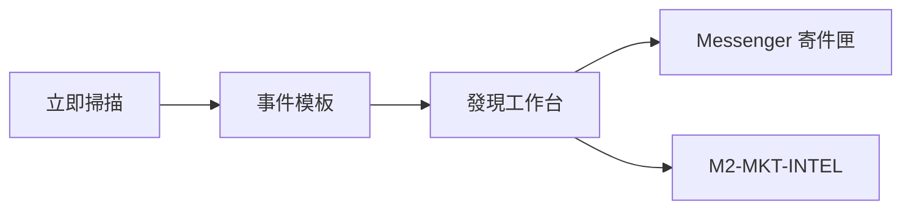
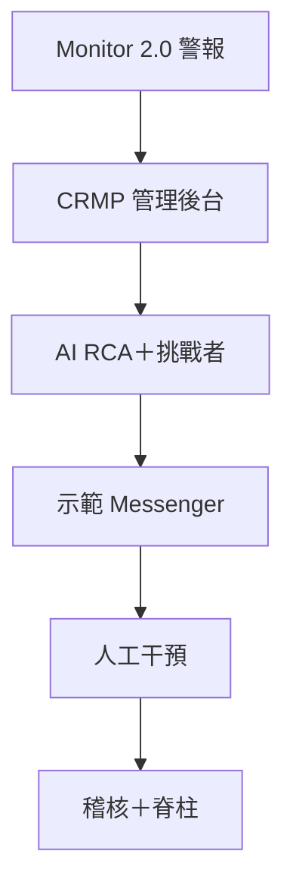

# CRMP 使用手冊

**文件編號：** CRMP-UG-001 · **對象：** 風險負責人、風險分析師、營運、AI 工程師、系統管理員  
**語言：** 繁體中文（本頁）· [English](/admin/docs/user-guide?lang=en)  
**文件與平台負責人：** YAN Haixiang（`yan.haixiang@vantagemarkets.com`）

## 0. 平台是什麼

Vantage **CRMP 管理後台** 是風險控制平面，將 Monitor 2.0 警報轉為：

1. AI 根因分析（技能匹配或 RAG）  
2. 高嚴重度下的獨立**第二 AI 挑戰**  
3. Messenger 分流（證據、升級、排除、結案、控制項）  
4. Maker／Checker 干預，並留下稽核與脊柱軌跡  

示範入口：[管理首頁](/admin) · [網址目錄](/admin/docs/urls)

---

## 1. 登入與語言

1. 開啟 [`/login`](/login)。公開 GitHub Pages 快照上此頁為 `/PRD/crmp-admin/login/` — 請用左側 **登入** 連結（不要只在 github.io 根路徑輸入 `/login`）。  
2. 點選角色按鈕或輸入帳密。已為你建立 **YAN Haixiang**（平台負責人）帳號；點登入後會留在此瀏覽器。

| 角色 | Email | 密碼 |
|---|---|---|
| 平台負責人 | `yan.haixiang@vantagemarkets.com` | `yan123` |
| 風險負責人 | `risk.owner@vantagemarkets.com` | `risk123` |
| 風險分析師 | `risk.analyst@vantagemarkets.com` | `risk123` |
| 營運主管 | `ops.lead@vantagemarkets.com` | `ops123` |
| AI 工程師 | `ai.engineer@vantagemarkets.com` | `ai123` |
| 系統管理員 | `system.admin@vantagemarkets.com` | `sys123` |
| 超級管理員 | `admin@vantagemarkets.com` | `admin123` |

3. 登入後進入 **管理首頁**。  
4. 以 **EN／繁中** 切換介面語言（桌面在側欄；手機在頂部）。  
5. 手機請用**漢堡選單**開啟導覽。

---

## 2. 依角色的每日路徑

### 風險負責人
1. 查看 [即時警報](/admin/alerts) 與 [AI 分析](/admin/ai-analyses) 的 BREACH／CRITICAL。  
2. 開啟雙 AI 包；若第二 AI 為 `PARTIAL`／`DISAGREE`，暫勿核准不可逆控制。  
3. 於 [Demo Messenger](/admin/messenger) 升級、結案（接受 AI）或排除誤報。  
4. Ops Maker 確認控制後，於 [人工干預](/admin/interventions) 執行 Checker 核准。  
5. 驗收版本時執行 [UAT 清單](/admin/docs/uat)。

### 風險分析師
1. 分流 OPEN 警報 → 開啟 AI 證據。  
2. 以 messenger 聊天機器人挑戰 AI 或補充脈絡。  
3. 升級至風險負責人前附上備註。

### 營運主管／分析師
1. 於 messenger **建議控制項** 提出封鎖／停牌／槓桿／擴點／暫停跟單。  
2. **雙重確認** → 取得管理編號與連結。  
3. 若待 Checker，請風險負責人或指定 Checker 核准。

### AI 工程師
1. 維護 [AI 技能](/admin/skills)、[RAG](/admin/rag)、[偵測器](/admin/detectors)。  
2. 於 [AI 管理](/admin/ai-admin) 調整設定／模型（Maker ≠ Checker）。  
3. 調整 `ai.second_opinion_severity`（預設 BREACH）。

### 系統管理員
1. 使用者、角色、團隊、部門、設定。  
2. 檢視 [AI 存取安全](/admin/security/ai-access) 黑名單。  
3. 監控 [稽核日誌](/admin/audit) 與 [脊柱日誌](/admin/spine)。

---

## 3. 分流警報（桌面流程）

1. 開啟 **即時警報** 或 **Monitor 2.0**。  
2. 找到 `OPEN`／`ACKNOWLEDGED` 項目。  
3. 前往 **AI 分析**（或等待警報自動分析）。  
4. 開啟分析並閱讀：模式、信心、說明、證據庫。  
5. 若嚴重度為 **BREACH**／**CRITICAL**（或達到第二意見門檻）：  
   - 檢視 **第二 AI 挑戰者** 面板  
   - 閱讀批評、改進建議、替代假說  
6. 決策原則：  
   - `AGREE` → 可依政策執行劇本  
   - `PARTIAL`／`DISAGREE` → **需要人工**；覆核前不做不可逆控制  

**示範模擬（AI 分析頁）：**
- 模擬 COPY breach（技能路徑）  
- 模擬 EQ 回撤（RAG／WARN — 通常不跑挑戰者）  
- 模擬 CRITICAL（強制第二 AI）  
- 回填第二 AI 挑戰  

---

## 4. Demo Messenger

路徑：[`/admin/messenger`](/admin/messenger)

### 版面
- **桌面：** 執行緒列表＋聊天並排  
- **手機：** 先列表 → 點進詳情；按 **Threads** 返回  

### 內嵌操作
| 操作 | 效果 |
|---|---|
| **Show evidence** | 將證據庫與第二 AI 摘要貼入對話 |
| **Chatbot** | 挑戰 AI 或補充資訊；表示不同意會標記 `needs_human` |
| **Escalate** | 沿 Primary → Secondary → Risk Owner → Exec 前進 |
| **Dismiss** | 誤報；關閉執行緒與警報 |
| **Close (accept AI)** | 接受分析並結案 |

### 建議控制項（AI 報告下方）
1. 選擇如 **封鎖帳戶**、**停牌**、**降低槓桿**、**預先擴點**、**暫停跟單**。  
2. 點 **Double-confirm…** 再按 **Yes, send to Vantage admin**。  
3. 對話顯示管理編號與連結。  
4. 若需 Checker，依系統訊息完成核准。

### 同步
使用 **Sync alerts** 將新 Monitor 警報拉入 messenger。

---

## 5. AI Admin（Maker／Checker）

路徑：[`/admin/ai-admin`](/admin/ai-admin)

1. **Maker** 提出設定／模型／政策變更。  
2. **不同使用者**以 Checker 權限核准或駁回。  
3. 設計上禁止自我核准。  
4. 規格見 TSD §8（[TSD](/admin/docs/tsd)）。

---

## 6. 市場情報

路徑：[`/admin/market-intel`](/admin/market-intel)

1. 由設定啟用（`market_intel.enabled`）。  
2. 點 **立即掃描**（本機也會每五分鐘排程）。  
3. 檢視發現、Messenger outbox、來源與掃描紀錄。  
4. 卡片採 i–vi 格式，可觸發指標 `M2-MKT-INTEL`。

**公開 GitHub Pages：** 快照沒有 `/api`。**立即掃描**會用與正式掃描相同的事件模板做本機示範掃描，發現會立刻出現在「發現／寄件匣／掃描紀錄」。真正 HTTP 抓取仍請在 `localhost:3000`。

---

## 7. 技能、RAG、偵測器、風險日誌

| 區塊 | 路徑 | 用途 |
|---|---|---|
| AI 技能 | `/admin/skills` | 劇本與強化風險情境／鏈 |
| RAG 知識庫 | `/admin/rag` | 技能不確定時的內外部證據 |
| 偵測器 | `/admin/detectors` | 觸發警報的門檻監控 |
| 風險日誌 | `/admin/risk-log` | 風險事件與 BU 修正時間軸 |
| 脊柱 | `/admin/spine` | 端到端階段日誌 |
| 人工干預 | `/admin/interventions` | 來自技能／RAG／messenger 的人工閘道 |

---

## 8. 安全與合規習慣

1. 開啟 [AI 存取安全](/admin/security/ai-access) — AI 不得操作僅限人類之頁面／功能／欄位。  
2. 正式環境勿授予 AI 服務帳號上述權限。  
3. 將 messenger 排除／結案視為可稽核決策。  
4. BREACH／CRITICAL 在不可逆控制前並陳主分析與挑戰者包。  
5. 於 **稽核日誌** 與 **脊柱日誌** 核對結果。

---

## 9. 行動裝置提示

- 使用漢堡導覽；語言切換在頂部。  
- Messenger 為主從結構：列表 → 執行緒 → **Threads** 返回。  
- 主要按鈕為全寬；寬表可在面板內橫向捲動。  
- 檢視大型文件表格時可改橫向。

---

## 10. 快速連結

| 頁面 | URL |
|---|---|
| 管理首頁 | `/admin` |
| AI 分析 | `/admin/ai-analyses` |
| Demo Messenger | `/admin/messenger` |
| AI 管理 | `/admin/ai-admin` |
| 市場情報 | `/admin/market-intel` |
| UAT 清單 | `/admin/docs/uat` |
| 生態導入評估 | `/admin/docs/ecosystem` |
| PRD／TSD | `/admin/docs/prd` · `/admin/docs/tsd` |
| 全部網址 | `/admin/docs/urls` |

---

## 11. 全部管理畫面（白話）

左側導覽依工作流分組。首頁卡片可點進同一頁。

| 分組 | 頁面 | 你在這裡做什麼 |
|---|---|---|
| 總覽 | 管理首頁 | 數量、部門、近期警報。卡片可點。 |
| 監控與風險 | 每日績效 | 當日 CFD＋加密風險圖像。 |
| 監控與風險 | 風險日誌分析 | 事件時間軸、處理時間、損失與防損。 |
| 監控與風險 | 市場情報 | 五分鐘新聞／社群掃描；立即掃描；Messenger 卡片。 |
| 監控與風險 | Monitor 2.0 | 指標登錄、工單、上游同步。 |
| 監控與風險 | 偵測器 | 觸發警報的門檻。 |
| 監控與風險 | 即時警報 | 未結佇列：確認、升級、開 AI。 |
| 監控與風險 | 風險領域 | CFD＋加密領域目錄。 |
| AI 與知識 | AI 分析 | 主 RCA＋第二 AI 挑戰。 |
| AI 與知識 | AI 管理 | Maker／Checker 設定、模型、Skills、RAG。 |
| AI 與知識 | AI 技能 | 劇本卡片；「進入」開完整 SKILL.md。 |
| AI 與知識 | 知識樹 | 領域、技能、RAG 視覺圖。 |
| AI 與知識 | RAG 知識庫 | 技能不確定時的證據語料。 |
| AI 與知識 | 脊柱日誌 | 偵測 → AI → 升級 → 干預軌跡。 |
| 應變 | 人工干預 | 核准或駁回閘道（Checker）。 |
| 應變 | 示範 Messenger | Lark 風格收件匣。 |
| 應變 | Lark 整合 | 頻道登錄（原型為 mock webhook）。 |
| 應變 | 升級路徑 | 嚴重度 → 團隊 → SLA。 |
| 組織 | 部門／團隊／角色／使用者 | RACI、值班、RBAC（含 YAN Haixiang）。 |
| 平台 | 資料來源、AI 存取安全、稽核、設定 | 登錄、黑名單、軌跡、分組旗標。 |
| 文件 | 使用手冊／PRD／TSD／UAT／生態／路線圖／網址 | 產品與操作文件。 |

---

## 12. 文件控制

| 版次 | 日期 | 說明 |
|---|---|---|
| 1.0 | 2026-10-01 | 操作手冊 |
| 1.3 | 2026-10-04 | 全部管理畫面、公開掃描示範、YAN Haixiang 負責人、Pages 登入 |

**負責人：** YAN Haixiang
